<!-- Generated by scripts/build_readme.py from data/. Do not edit by hand. -->

      

**Every TON and Telegram project we could verify: 4,524 of them in 35 categories, each with its channel, bot, X, site and GitHub, and the numbers that show whether it is alive.** The 9,370 links are checked every week; 2,146 wrong ones have been fixed so far, each with its evidence.

Maintained by [Gram News](https://gramnews.org). Open data: take it, fix it, build on it.

**This week**: 4,172 new projects, 525 new channels; [the weekly summary](reports/weekly/2026-10-02.md) has the names, [earlier weeks](reports/weekly/README.md) too.

**Browse it right here**: every category opens as a searchable table, its *table* link below; so do [channels](data/channels.csv) and [studios and funds](data/relations.csv).

**Jump to** [Categories](#categories), [Largest projects](#largest-projects), [NFT collections](#top-nft-collections), [Neighbours on Telegram](#neighbours-on-telegram), [Verified](#verified-on-telegram), [Other usernames](#other-usernames), [Studios and funds](#studios-funds-and-accelerators), [Channels](#channels), [How to read it](#how-to-read-it), [Data](#data), [Maps and reports](#maps-and-reports), [Contribute](#contribute)

## Categories

Each category has its own page with every project, active ones first.

| Category | Active | All | Notable projects | Table |
| --- | ---: | ---: | --- | --- |
| [CEX](categories/exchanges.md) | 50 | 84 |  [Binance](https://t.me/binance_announcements),  [Bybit](https://t.me/bybit_announcements),  [OKX](https://t.me/okxannouncements),  [Bitget](https://t.me/bitget_announcements) | [table](data/by-category/exchanges.csv) |
| [Custodial](categories/custodial.md) | 5 | 7 |  [@Walt](https://t.me/walt_news),  [@Send](https://t.me/cryptobotru),  [@XRocket](https://t.me/xrocketnews),  [Spell Wallet](https://t.me/spell_wallet) | [table](data/by-category/custodial.csv) |
| [Wallets](categories/wallets.md) | 28 | 102 | [Gram Wallet](https://gramwallet.io),  [Keeper](https://t.me/keeper_en),  [My Wallet](https://t.me/mywalleteng),  [Tonhub](https://t.me/tonhub) | [table](data/by-category/wallets.csv) |
| [DEX](categories/dex.md) | 14 | 70 |  [STON.fi](https://t.me/stonfidex),  [DeDust](https://t.me/dedust_en),  [swap.coffee](https://t.me/swap_coffee),  [TONCO](https://t.me/tonco_io) | [table](data/by-category/dex.csv) |
| [Payments](categories/payments.md) | 24 | 77 |  [Wallet Pay](https://t.me/walletpayofficial),  [@Tribute](https://t.me/tributenewsen), 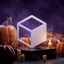 [Cryptomus](https://t.me/cryptomus), [NOWPayments](https://nowpayments.io/) | [table](data/by-category/payments.csv) |
| [On-ramp](categories/onramp.md) | 12 | 49 | [MoonPay](https://www.moonpay.com), [Changelly](https://t.me/changelly),  [ChangeNOW](https://t.me/changenow_chat), [Alchemy Pay](https://alchemypay.org) | [table](data/by-category/onramp.csv) |
| [Infra](categories/infra.md) | 33 | 75 |  [Telegram](https://t.me/telegram), [Fragment](https://fragment.com),  [TON Core](https://t.me/toncore),  [Acton](https://t.me/theopentooling) | [table](data/by-category/infra.csv) |
| [Developer tools](categories/devtools.md) | 15 | 87 |  [Telegram Bot API News](https://t.me/botnews),  [Telegram Crawler](https://t.me/tgcrawl),  [Tonutils](https://t.me/tonutilsnews),  [IntelliJ Idea plugin](https://t.me/actiqapp) | [table](data/by-category/devtools.csv) |
| [Analytics](categories/analytics.md) | 34 | 166 |  [Lagus research](https://t.me/lagus_research), [Dune](https://dune.com), [CoinGecko](https://www.coingecko.com),  [CoinMarketCap](https://t.me/coinmarketcapannouncements) | [table](data/by-category/analytics.csv) |
| [Explorers](categories/explorers.md) | 6 | 14 |  [Tonscan.org](https://t.me/catchain), [Tonviewer](https://tonviewer.com), [Tonscan.com](https://tonscan.com), [Actonscan](https://actonscan.com) | [table](data/by-category/explorers.csv) |
| [Security](categories/audit.md) | 10 | 38 |  [Hacken](https://t.me/hackenai),  [CertiK](https://t.me/certikcommunity), [SlowMist](https://www.slowmist.com), [Trail of Bits](https://www.trailofbits.com) | [table](data/by-category/audit.csv) |
| [Bridges](categories/bridges.md) | 10 | 20 |  [Symbiosis](https://t.me/symbiosis_announcements), [LayerZero](https://layerzero.network), [Stargate](https://stargate.finance),  [Rubic](https://t.me/cryptorubic) | [table](data/by-category/bridges.csv) |
| [Staking](categories/staking.md) | 14 | 40 |  [Hipo](https://t.me/hipofinance),  [Tonstakers](https://t.me/thetonstakers),  [Stakee](https://t.me/stakeeru),  [KTON](https://t.me/kton_channel) | [table](data/by-category/staking.csv) |
| [Lending](categories/lending.md) | 9 | 18 |  [EVAA Protocol](https://t.me/evaaprotocol),  [TONLender](https://t.me/tonlender_ru),  [DAOLama](https://t.me/daolama),  [GTC (Gift To Credit)](https://t.me/gifttocredit_new_age) | [table](data/by-category/lending.csv) |
| [Perp DEX](categories/perps.md) | 9 | 20 |  [Storm Trade](https://t.me/storm_trade_news),  [Tradoor](https://t.me/tradoor_io),  [WenLong](https://t.me/wenlongnews), [Hyperliquid](https://hyperliquid.xyz) | [table](data/by-category/perps.csv) |
| [RWA](categories/rwa.md) | 8 | 23 |  [XAUt](https://t.me/tether),  [Stable Metal](https://t.me/stablemetal), [USDT](https://tether.to),  [Ethena USDe](https://t.me/ethena_labs) | [table](data/by-category/rwa.csv) |
| [NASDAQ](categories/nasdaq.md) | 2 | 2 | [TON Strategy](https://tonstrat.com), [Alpha Compute](https://alphacompute.com) | [table](data/by-category/nasdaq.csv) |
| [Catalogues](categories/catalogs.md) | 9 | 29 |  [Gram News](https://t.me/gramnews),  [TON App](https://t.me/tonapp),  [DYOR.io](https://t.me/dyorninja),  [ton.website](https://t.me/mtproxyfreedom) | [table](data/by-category/catalogs.csv) |
| [Privacy](categories/vpn.md) | 13 | 45 |  [TonMobile eSIM](https://t.me/tonmobile_en),  [SnapSIM](https://t.me/snapsimbot),  [Durev VPN](https://t.me/durevvpn),  [Resistance Tools](https://t.me/resistancetools) | [table](data/by-category/vpn.csv) |
| [NFT collections](categories/nftcaps.md) | 23 | 144 | [Anonymous Numbers](https://fragment.com/gifts),  [Plush Pepe](https://t.me/plushpepe_coin), [Telegram Usernames](https://fragment.com/gifts), [Scared Cat](https://fragment.com/gifts) | [table](data/by-category/nftcaps.csv) |
| [Tokens](categories/tokens.md) | 53 | 264 |  [GROYP](https://t.me/groyp),  [UTYA](https://t.me/MagicVipClub),  [CHERRY](https://t.me/HotCherryTG),  [BabyDoge](https://t.me/babydogecoin) | [table](data/by-category/tokens.csv) |
| [NFT & Gifts](categories/nftmarkets.md) | 46 | 140 |  [Getgems](https://t.me/getgems),  [Tonnel](https://t.me/tonnel_en),  [@MRKT](https://t.me/mrkt),  [Marketapp](https://t.me/nfttonificatorbot) | [table](data/by-category/nftmarkets.csv) |
| [Memepads](categories/launchpads.md) | 18 | 83 |  [TopBlast](https://t.me/topblastdotlol),  [Meridian](https://t.me/meridian_wtf),  [@Blum](https://t.me/blumcrypto_memepad),  [BigPump](https://t.me/bigpumphub) | [table](data/by-category/launchpads.csv) |
| [Trading bots](categories/trading.md) | 20 | 97 |  [@Trade](https://t.me/gifttradeservise),  [PocketFi](https://t.me/pocketfi),  [Maestro](https://t.me/maestrosniperupdates),  [Upscale](https://t.me/upscale_news_en) | [table](data/by-category/trading.csv) |
| [Social](categories/social.md) | 19 | 114 |  [@Mira](https://t.me/miramedia_en),  [TON Dating](https://t.me/tondatingchannel),  [@Major](https://t.me/major),  [@IPredict](https://t.me/ipredict) | [table](data/by-category/social.csv) |
| [AI](categories/ai.md) | 14 | 72 |  [AI Lab](https://t.me/ailab_robot),  [MOONBERG AI BOT](https://t.me/moonbergai),  [Spru](https://t.me/spru_agent_bot),  [AgentBook](https://t.me/agentbookbot) | [table](data/by-category/ai.csv) |
| [Tools](categories/tools.md) | 37 | 174 |  [Randomize Bot](https://t.me/randomized),  [RandomGodBot](https://t.me/randomgod),  [XDAO](https://t.me/xdaoapp),  [Random Beast](https://t.me/randombeastnews) | [table](data/by-category/tools.csv) |
| [Shopping](categories/shopping.md) | 23 | 84 |  [StarsovBot](https://t.me/starsovnews),  [Indigo Gift](https://t.me/indigogif),  [Mops Stars](https://t.me/mopsstarsbot), 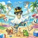 [Boogie](https://t.me/boo_gifts) | [table](data/by-category/shopping.csv) |
| [Education](categories/education.md) | 3 | 22 |  [TonNewbie](https://t.me/tonnewbie),  [BehLand](https://t.me/BehLand_Official),  [Rocketta](https://t.me/calm_me_bot) | [table](data/by-category/education.csv) |
| [Games](categories/games.md) | 142 | 1113 |  [Dogs](https://t.me/dogs),  [CITY Holder](https://t.me/city_holder),  [Catizen](https://t.me/catizenann),  [Gatto](https://t.me/gatto_game) | [table](data/by-category/games.csv) |
| [Farming](categories/farming.md) | 238 | 949 |  [Boinkers](https://t.me/boinkersnews),  [Time Farm](https://t.me/timefarmchannel),  [Agent 301](https://t.me/app301),  [Hrum](https://t.me/hrumfam) | [table](data/by-category/farming.csv) |
| [Casino](categories/gambling.md) | 64 | 247 |  [VIRUS GAME](https://t.me/omicron),  [Epic Gift](https://t.me/epic_gift_official),  [Easy Gift](https://t.me/easygiftnews),  [Gorilla Case](https://t.me/gorilla_news) | [table](data/by-category/gambling.csv) |
| [Studios](categories/studios.md) | 5 | 23 |  [Open Builders](https://t.me/builders),  [The Open Platform](https://t.me/topco),  [GAMEE](https://t.me/gameechannel),  [PlayDeck](https://t.me/playdeck_en) | [table](data/by-category/studios.csv) |
| [Funds](categories/funds.md) | 1 | 19 |  [TON Ventures](https://t.me/ton_ventures),  [TVM Ventures](https://t.me/tvmventures), [TONcoin.Fund](https://toncoin.fund), [Animoca Brands](https://www.animocabrands.com) | [table](data/by-category/funds.csv) |
| [Accelerators](categories/accelerators.md) | 1 | 13 |  [TON Accelerator](https://t.me/accelerator_ton),  [Gaming.tg](https://t.me/tggamingaccelerator), Telegram Growth Hub, TON Nest | [table](data/by-category/accelerators.csv) |

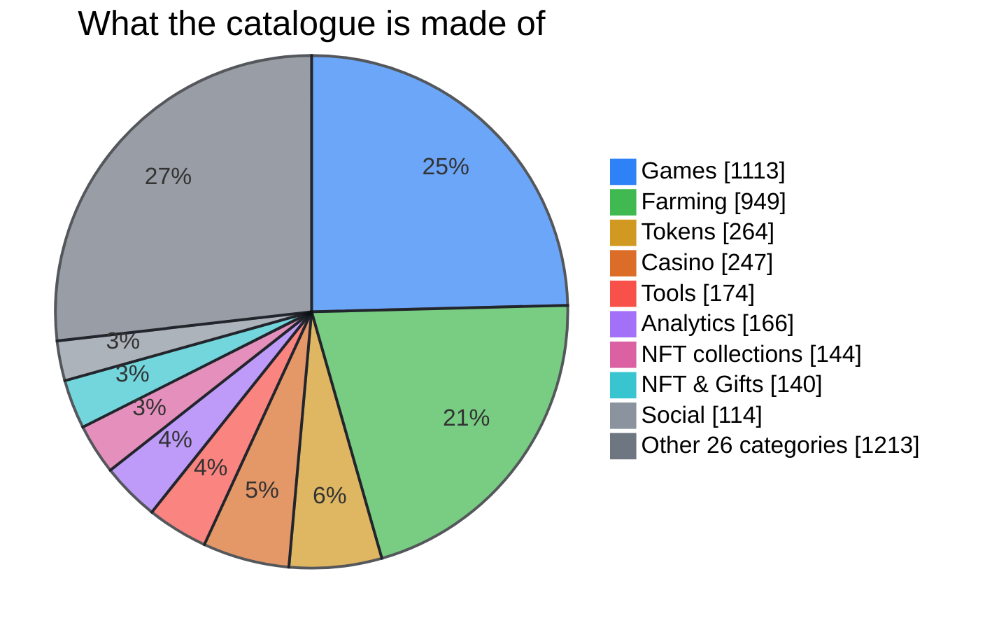

## Largest projects

By reach: post views on the project's own channel from July to September 2026, or its bot's monthly users, whichever is larger.

| Project | Category | Reach | Peak MAU | Launched | Verified |
| --- | --- | ---: | ---: | --- | --- |
|  [Binance](https://t.me/binance_announcements) | [CEX](categories/exchanges.md) | 15.8M |  | 2024-06 | since 2020-06 |
|  [Boinkers](https://t.me/boinkersnews) | [Farming](categories/farming.md) | 15.5M |  | 2024-07 | since 2024-09 |
|  [Telegram](https://t.me/telegram) | [Infra](categories/infra.md) | 14.7M |  | 2020-01 | yes |
|  [VIRUS GAME](https://t.me/omicron) | [Casino](categories/gambling.md) | 11M | 1.3M | 2025-01 |  |
|  [Epic Gift](https://t.me/epic_gift_official) | [Casino](categories/gambling.md) | 10M | 368K | 2025-03 |  |
|  [Bitget](https://t.me/bitget_announcements) | [CEX](categories/exchanges.md) | 8.6M |  | 2021-07 | since 2021-12 |
|  [@Walt](https://t.me/walt_news) | [Custodial](categories/custodial.md) | 8M |  | 2020-05 | yes |
|  [Time Farm](https://t.me/timefarmchannel) | [Farming](categories/farming.md) | 7.7M | 15.6M | 2024-04 |  |
|  [BotFather](https://t.me/botfather) | [Infra](categories/infra.md) | 7.6M | 10.2M | 2016-01 | since 2020-06 |
|  [Easy Gift](https://t.me/easygiftnews) | [Casino](categories/gambling.md) | 4.5M |  | 2025-03 |  |
|  [Gorilla Case](https://t.me/gorilla_news) | [Casino](categories/gambling.md) | 4.4M | 681K | 2025-05 |  |
|  [New Listings Feed](https://t.me/newlistingsfeed) | [Analytics](categories/analytics.md) | 4M |  | 2024-03 |  |

## Launches by quarter

When the 4,316 projects with a known launch month started or came to TON. The busiest quarter was Q2 2024 with 730.

## Verified on Telegram

185 projects carry Telegram's badge. For 166 of them the Web Archive shows when it appeared; the largest of each year:

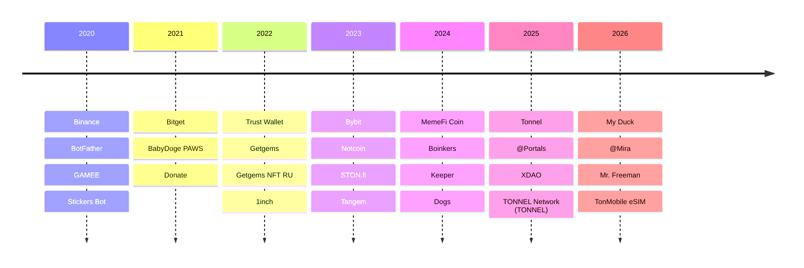

## Top NFT collections

The 200 largest TON collections on Getgems by all-time volume, snapshot of 2026-10-02; 109 of them are Telegram gifts, with 43M TON of the 323.2M traded. Launch dates are the collection contract's first transaction; socials, site and description come from the contract's own metadata. All of them, with addresses and descriptions, are in [nft-collections.csv](data/nft-collections.csv).

| # | Collection | Kind | Volume, TON | Floor | Owners | Items | Launched | Links |
| ---: | --- | --- | ---: | ---: | ---: | ---: | --- | --- |
| 1 |  [Telegram Usernames](https://getgems.io/collection/EQCA14o1-VWhS2efqoh_9M1b_A9DtKTuoqfmkn83AbJzwnPi) | Fragment usernames | 134.1M | 5.6 | 182K | 658K | 2022-10 | [site](https://fragment.com) |
| 2 |  [Anonymous Telegram Numbers](https://getgems.io/collection/EQAOQdwdw8kGftJCSFgOErM1mBjYPe4DBPq8-AhF6vr9si5N) | Fragment numbers | 122.5M | 2.3K | 48K | 136K | 2022-12 | [site](https://fragment.com/numbers) |
| 3 |  [Plush Pepes](https://getgems.io/collection/EQBG-g6ahkAUGWpefWbx-D_9sQ8oWbvy6puuq78U2c4NUDFS) | Telegram gift | 23.7M | 5.4K | 946 | 3K | 2025-01 | [site](https://fragment.com/gifts/plushpepe) |
| 4 |  [TON DNS Domains](https://getgems.io/collection/EQC3dNlesgVD8YbAazcauIrXBPfiVhMMr5YYk2in0Mtsz0Bz) | Domains | 8.1M | 0.4 | 88K | 197K | 2022-07 | [site](https://dns.ton.org) |
| 5 |  [Notcoin Pre-Market](https://getgems.io/collection/EQDmkj65Ab_m0aZaW8IpKw4kYqIgITw_HRstYEkVQ6NIYCyW) | Collection | 4M | 4 | 34K | 795K | 2024-03 | [TG](https://t.me/notcoin), [X](https://x.com/thenotcoin), [NOT](categories/tokens.md) |
| 6 | 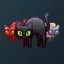 [Scared Cats](https://getgems.io/collection/EQATuUGdvrjLvTWE5ppVFOVCqU2dlCLUnKTsu0n1JYm9la10) | Telegram gift | 2.7M | 239 | 2K | 14K | 2025-01 | [site](https://fragment.com/gifts/scaredcat) |
| 7 | 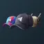 [Durov’s Caps](https://getgems.io/collection/EQD9ikZq6xPgKjzmdBG0G0S80RvUJjbwgHrPZXDKc_wsE84w) | Telegram gift | 2.1M | 385 | 1K | 3K | 2025-01 | [site](https://fragment.com/gifts/durovscap) |
| 8 |  [Heart Lockets](https://getgems.io/collection/EQC4XEulxb05Le5gF6esMtDWT5XZ6tlzlMBQGNsqffxpdC5U) | Telegram gift | 1.8M | 1.1K | 253 | 2K | 2025-06 | [site](https://fragment.com/gifts/heartlocket) |
| 9 |  [TON Diamonds](https://getgems.io/collection/EQAG2BH0JlmFkbMrLEnyn2bIITaOSssd4WdisE4BdFMkZbir) | Collection | 1.4M | 3.7 | 3K | 10K | 2022-06 | [TG](https://t.me/tondiamonds), [X](https://x.com/TonDiamonds), [site](https://ton.diamonds), [TON Diamonds](categories/nftmarkets.md) |
| 10 | 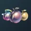 [Precious Peaches](https://getgems.io/collection/EQA4i58iuS9DUYRtUZ97sZo5mnkbiYUBpWXQOe3dEUCcP1W8) | Telegram gift | 1M | 253 | 646 | 3K | 2025-01 | [site](https://fragment.com/gifts/preciouspeach) |
| 11 |  [TON Punks 💎](https://getgems.io/collection/EQAo92DYMokxghKcq-CkCGSk_MgXY5Fo1SPW20gkvZl75iCN) | Collection | 939K | 30 | 1K | 5K | 2022-04 | [TG](https://t.me/punkton), [X](https://x.com/tonpunks), [TON Punks Bot](categories/tokens.md) |
| 12 |  [Animals Red List](https://getgems.io/collection/EQAA1yvDaDwEK5vHGOXRdtS2MbOVd1-TNy01L1S_t2HF4oLu) | Collection | 938K | 1.8 | 3K | 13K | 2022-05 |  |
| 13 |  [Swiss Watches](https://getgems.io/collection/EQBI07PXew94YQz7GwN72nPNGF6htSTOJkuU4Kx_bjTZv32U) | Telegram gift | 880K | 54.9 | 2K | 11K | 2025-02 | [site](https://fragment.com/gifts/swisswatch) |
| 14 |  [Loot Bags](https://getgems.io/collection/EQCE80Aln8YfldnQLwWMvOfloLGgmPY0eGDJz9ufG3gRui3D) | Telegram gift | 856K | 122 | 947 | 6K | 2025-03 | [site](https://fragment.com/gifts/lootbag) |
| 15 |  [Toy Bears](https://getgems.io/collection/EQC1gud6QO8NdJjVrqr7qFBMO0oQsktkvzhmIRoMKo8vxiyL) | Telegram gift | 714K | 35 | 2K | 29K | 2025-03 | [site](https://fragment.com/gifts/toybear) |
| 16 |  [EVAA XP Vouchers](https://getgems.io/collection/EQD0iQuSLkUrRky5Y0CL6a0nsF8iWu0SQZ8AsUQJv7uA7D3z) | Collection | 596K |  | 1 | 9K | 2025-09 | [TG](https://t.me/evaatg), [X](https://x.com/evaaprotocol), [site](https://evaa.finance), [EVAA Protocol](categories/lending.md) |
| 17 | 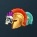 [Heroic Helmets](https://getgems.io/collection/EQAlROpjm1k1mW30r61qRx3lYHsZkTKXVSiaHEIhOlnYA4oy) | Telegram gift | 382K | 190 | 480 | 2K | 2025-06 | [site](https://fragment.com/gifts/heroichelmet) |
| 18 | 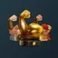 [Mighty Arms](https://getgems.io/collection/EQDeX0F1GDugNjtxkFRihu9ZyFFumBv2jYF5Al1thx2ADDQs) | Telegram gift | 378K | 122 | 516 | 3K | 2025-09 | [site](https://fragment.com/gifts/mightyarm) |
| 19 |  [X Empire Pre-Market](https://getgems.io/collection/EQBFg46ihgN95_3Ld7MU19kVJdKepJ0Dq3UHRBaEuJLlomQI) | Collection | 336K | 0.2 | 69K | 571K | 2024-09 | [TG](https://t.me/empirex), [X](https://x.com/xempiregame), [site](https://xempire.io), [X Empire (X)](categories/farming.md) |
| 20 | 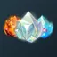 [Astral Shards](https://getgems.io/collection/EQDIReleOkTxCD4g_XEm8xj0LYNg6-zMsTGAAwCA-vEbkGBu) | Telegram gift | 302K | 110 | 786 | 3K | 2025-02 | [site](https://fragment.com/gifts/astralshard) |
| 21 |  [Getgems Domains](https://getgems.io/collection/EQDhlVq6cknyPk_SCGZUoXZRbZixNODfcBMCZ3wDfDWLFze7) | Domains | 299K | 0.1 | 74K | 164K | 2024-01 | [site](https://getgems.io/domains) |
| 22 |  [Lost Dogs](https://getgems.io/collection/EQAl_hUCAeEv-fKtGxYtITAS6PPxuMRaQwHj0QAHeWe6ZSD0) | Collection | 260K | 1.6 | 18K | 57K | 2023-03 | [TG](https://t.me/lostdogscoru), [X](https://x.com/LostDogsCo), [Lost Dogs](categories/games.md) |
| 23 |  [Vintage Cigars](https://getgems.io/collection/EQACcQpR2fmdeENWdE2YGQWHVxSTyA8Zq4_k7rk_IaxCRXNe) | Telegram gift | 253K | 37.9 | 2K | 9K | 2025-01 | [site](https://fragment.com/gifts/vintagecigar) |
| 24 |  [First Force](https://getgems.io/collection/EQDe-g7ds5azgdijv0YyGmS4flgqH_gUqP4o2pIvkOHcxJ9M) | Collection | 250K |  | 8K | 8K | 2025-06 | [X](https://x.com/TacBuild), [site](https://firstforce.tac.build), [TAC (TAC)](categories/infra.md) |
| 25 |  [Snoop Doggs](https://getgems.io/collection/EQAoJw7BpOcBD3y9voMuEQ-qhS3K4gtM-6EePLxkzk8iSifX) | Telegram gift | 234K | 5 | 11K | 55K | 2025-07 | [site](https://fragment.com/gifts/snoopdogg) |

## Neighbours on Telegram

Whom Telegram itself puts in *similar channels* and *similar bots* next to the largest projects, in its order. It picks them by overlapping audiences, so this is who shares the crowd, not who sends traffic. All 17,645 pairs are in [data/similar.csv](data/similar.csv) (snapshot of June 2026).

| Project | Shown next to it |
| --- | --- |
| [MemeFi Coin](https://t.me/memeficlub) |  [RoketoCoin Lunar Program](https://t.me/roketo_lunar_bot),  [PixelTap by Pixelverse](https://t.me/pixelverse_xyz),  [@Major](https://t.me/major),  [DreamCoin](https://t.me/dreamcoinofficial_bot) |
|  [Binance](https://t.me/binance_announcements) |  [NOT](https://t.me/notcoin),  [Hamster Kombat (HMSTR)](https://t.me/hamster_kombat),  [Catizen](https://t.me/catizenann),  [Tomarket App](https://t.me/tomarket_ai) |
|  [Boinkers](https://t.me/boinkersnews) |  [$BOOM](https://t.me/boomloudcoin),  [Trump's Empire](https://t.me/trumpsempirebot),  [Yescoin](https://t.me/theyescoin),  [Save Question](https://t.me/savequestion_bot) |
|  [Time Farm](https://t.me/timefarmchannel) |  [Dogs](https://t.me/dogs),  [BrainGames](https://t.me/caspertma),  [W3BFLIX](https://t.me/w3bflixbot),  [Yescoin](https://t.me/theyescoin) |
|  [Dogs](https://t.me/dogs) |  [Cats](https://t.me/cats_housewtf),  [Notcoin](https://t.me/notcoin),  [fomo_hash](https://t.me/fomohash),  [Sticker Pack](https://t.me/sticker_community) |
|  [Tonnel](https://t.me/tonnel_en) |  [Sticker Pack](https://t.me/sticker_community),  [@XRocket](https://t.me/xrocketnews),  [Megamine](https://t.me/megaminetg_bot),  [Marketapp](https://t.me/nfttonificatorbot) |
|  [Agent 301](https://t.me/app301) |  [Dogs](https://t.me/dogs),  [GOATS](https://t.me/realgoats_channel),  [Major Community](https://t.me/majors),  [Hamster Kombat (HMSTR)](https://t.me/hamster_kombat) |
|  [CEXIO Power Tap](https://t.me/cexio_announcements) |  [Major Community](https://t.me/majors),  [Simple Coin](https://t.me/smpl_app), 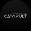 [Catapult Extreme](https://t.me/catapult_extreme),  [Dotcoin](https://t.me/dotcoin_help_support) |
|  [Catizen](https://t.me/catizenann) |  [Yescoin](https://t.me/theyescoin),  [Cattea](https://t.me/CatteaNews),  [Tomarket App](https://t.me/tomarket_ai),  [Vanilla Finance](https://t.me/vanilla_finance_bot) |
|  [HOT Wallet](https://t.me/hotonnear) |  [Wave Wallet](https://t.me/wave_announcements),  [SEED](https://t.me/seedupdates),  [PitchTalk](https://t.me/pitchtalk_bot),  [Yescoin](https://t.me/theyescoin) |

## Other usernames

Telegram's numeric id outlives a username, so the same account can be followed across names. 292 accounts here hold more than one username (627 extra names, mostly collectible ones), and 14 moved to a new name. All pairs are in [data/usernames.csv](data/usernames.csv).

| Account | Now | Was |
| --- | --- | --- |
| STON.fi | [@ston_fi](https://t.me/ston_fi) | @stonfi_bot (now another account) |
| TON.ton | [@tikitons](https://t.me/tikitons) | @stickrs (now another account) |
| Genopets | [@genopets](https://t.me/genopets) | @genopetsannouncements (now another account) |
| Nobby Game | [@nobbyofficial](https://t.me/nobbyofficial) | @nobbygameru (now another account) |
| S1dr / NFT подарки | [@s1drgifts](https://t.me/s1drgifts) | @giftferma (now another account) |
| TON Cabal | [@cooks](https://t.me/cooks) | @strat (now another account) |
| TON Fragment | [@tonfragment](https://t.me/tonfragment) | @numbers_ton (now another account) |
| Username’s | [@userbazar](https://t.me/userbazar) | @abhya (now another account) |
| 用户名NFT | [@nft899](https://t.me/nft899) | @jjuuuu (now another account) |
| FABERGE / CLUB | [@clubfaberge](https://t.me/clubfaberge) | @faberge_strategy (free) |

| Account | Also answers to |
| --- | --- |
| [Six Seven Club Bot](https://t.me/club67) | [@sixsevenclub](https://t.me/sixsevenclub) |
| [Dogs](https://t.me/dogs) | [@dogs_community](https://t.me/dogs_community) |
| [@Tribute](https://t.me/tribute) | [@subscribeappbot](https://t.me/subscribeappbot) |
| [TopGift](https://t.me/topgiftnews) | [@topgift](https://t.me/topgift) |
| [@Send](https://t.me/send) | [@cryptobot](https://t.me/cryptobot) |
| [Catizen](https://t.me/catizenann) | [@appgame](https://t.me/appgame), [@crypto_w](https://t.me/crypto_w), [@gamefi_crypto](https://t.me/gamefi_crypto), [@genshin_y](https://t.me/genshin_y), [@hamster_app](https://t.me/hamster_app), [@notcoin_io](https://t.me/notcoin_io), [@pixel_x](https://t.me/pixel_x), [@ton_gamefi](https://t.me/ton_gamefi) |
| [cult of not](https://t.me/cultofnot) | [@not_base](https://t.me/not_base) |
| [GAMEE](https://t.me/gameechannel) | [@gameetokennews](https://t.me/gameetokennews) |
| [PlayDeck](https://t.me/playdeck_en) | [@playcoin](https://t.me/playcoin) |
| [Gifts Battle](https://t.me/giftsbattle) | [@giftsbattles](https://t.me/giftsbattles) |

## Studios, funds and accelerators

Who builds and backs the projects. Each link between a project and an organisation is in [data/relations.csv](data/relations.csv) with the page that states it.

| Organisation | Type | Projects | Sources |
| --- | --- | --- | --- |
|  [Open Builders](https://t.me/builders) | studio | built:  [Notcoin](https://t.me/notcoin),  [Tonstarter](https://t.me/ton_starter_bot),  [Community](https://t.me/community_bot),  [Access](https://t.me/access_app_bot),  [Contests](https://t.me/contests_app_bot),  [Giveaway](https://t.me/giveaway_app_bot),  [Early](https://t.me/earn_early) | [1](https://medium.com/triangle-builders/the-journey-of-open-builders-a598f5aa27fa) |
|  [The Open Platform](https://t.me/topco) | studio | built:  [@Walt](https://t.me/walt_news),  [Wallet Pay](https://t.me/walletpayofficial); owns:  [PlayDeck](https://t.me/playdeck_en); ecosystem:  [STON.fi](https://t.me/stonfidex),  [Getgems](https://t.me/getgems),  [Keeper](https://t.me/keeper_en); co-launched: Telegram Growth Hub | [1](https://www.theblock.co/press-releases/361030/the-open-platform-is-first-unicorn-in-web3-ecosystem-in-telegram-at-1bn-valuation) [2](https://www.playdeck.io/) [3](https://www.streetinsider.com/Globe+Newswire/OKX+Ventures,+The+Open+Platform+and+Folius+Ventures+Launch+$10+Million+Telegram+Growth+Hub/23896789.html) |
|  [GAMEE](https://t.me/gameechannel) | studio | built:  [WatBird](https://t.me/watbird),  [Moon Cards](https://t.me/mooncards) | [1](https://www.animocabrands.com/gamee-receives-investment-from-ton-ventures) [2](https://playtoearn.com/news/gamee-launches-moon-cards-a-memecoin-powered-tcg-on-telegram) |
|  [PlayDeck](https://t.me/playdeck_en) | studio | published:  [State.io](https://t.me/stateio_bot),  [Idle Legion](https://t.me/idlelegion_bot) | [1](https://www.playdeck.io/) |
|  [TON Ventures](https://t.me/ton_ventures) | fund | invested:  [GAMEE](https://t.me/gameechannel),  [Delabs Games](https://t.me/delabsgameschat), [Goat Gaming](https://t.me/playgoatgaming),  [Memetics](https://t.me/memetics_news),  [TAC](https://t.me/tacbuild),  [STON.fi](https://t.me/stonfidex),  [EVAA Protocol](https://t.me/evaaprotocol),  [TONCash](https://t.me/toncashnetwork),  [bionapp](https://t.me/bionapp_bot) | [1](https://www.animocabrands.com/gamee-receives-investment-from-ton-ventures) [2](https://www.rootdata.com/Investors/detail/TON%20Ventures?k=MTI2ODA%3D) |
|  [TVM Ventures](https://t.me/tvmventures) | fund | invested:  [Affluent](https://t.me/Affluent), 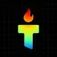 [Torch Finance](https://t.me/torch_ton),  [Fiva](https://t.me/fiva_protocol),  [Memes Lab](https://t.me/lab_trade), [TON Strategy](https://tonstrat.com) | [1](https://www.theblock.co/post/338477/ton-foundation-steve-yun-tvm-ventures) [2](https://cryptorank.io/funds/tvm-ventures) |
| [TONcoin.Fund](https://toncoin.fund) | fund | invested:  [Prophecy Pulse](https://t.me/prophecypulse_bot),  [Storm Trade](https://t.me/storm_trade_news),  [DeDust](https://t.me/dedust_en) | [1](https://ton.org/en/ton-accelerator-program-s-first-cohort-participants) |
| [Animoca Brands](https://www.animocabrands.com) | fund | parent company:  [GAMEE](https://t.me/gameechannel) | [1](https://www.animocabrands.com/gamee-receives-investment-from-ton-ventures) |
| [Folius Ventures](https://www.folius.ventures) | fund | co-launched: Telegram Growth Hub | [1](https://www.streetinsider.com/Globe+Newswire/OKX+Ventures,+The+Open+Platform+and+Folius+Ventures+Launch+$10+Million+Telegram+Growth+Hub/23896789.html) |
|  [OKX Ventures](https://t.me/okxventures) | fund | co-launched: Telegram Growth Hub | [1](https://www.streetinsider.com/Globe+Newswire/OKX+Ventures,+The+Open+Platform+and+Folius+Ventures+Launch+$10+Million+Telegram+Growth+Hub/23896789.html) |
| [Pantera Capital](https://panteracapital.com) | fund | invested:  [GAMEE](https://t.me/gameechannel) | [1](https://www.animocabrands.com/gamee-receives-investment-from-pantera-capital) |
|  [TON Accelerator](https://t.me/accelerator_ton) | accelerator | first cohort:  [Prophecy Pulse](https://t.me/prophecypulse_bot),  [Storm Trade](https://t.me/storm_trade_news),  [EVAA Protocol](https://t.me/evaaprotocol),  [DeDust](https://t.me/dedust_en),  [TON.SKI Access](https://t.me/tonski_eng), [Pluto Studios](https://www.pluto.vision) | [1](https://ton.org/en/ton-accelerator-program-s-first-cohort-participants) |

The same links as a web. Organisations are blue; a thick line means built or published, a dotted one invested, a thin one any other tie; a project tied to several organisations is drawn once.

## How to read it

- **Status** is measured, not judged: `active`, `quiet` or `closed`.
- **Launched** is when the project started or came to TON; `launched_source` says how the date was found.

<b>What makes a project active</b>

At least one of these held from July 1 to September 30, 2026:

1. its own Telegram channel published a post;
2. its bot showed 1,000+ monthly users on its t.me page;
3. Gram News wrote about it;
4. it had $10,000+ of TVL on TON on DefiLlama;
5. for developer tools and infrastructure, its GitHub repository received a commit.

Otherwise it is `quiet`, with its links kept. `closed` means the source catalogue marked it as shut down, or every link it had is dead: the username is free on t.me, the domain no longer resolves, the repository is gone.

A channel or bot counts for a project only if it matches the project by name: catalogues often carry someone else's.

<b>Where the projects come from</b>

The `sources` column lists every place a project was found:

- `gramnews-apps`: the [Gram News apps library](https://gramnews.org/apps);
- `ton.app`: the [ton.app](https://ton.app) catalogue, full sitemap;
- `dyor.io`: the [DYOR](https://dyor.io) catalogue;
- `findmini`: the [FindMini](https://www.findmini.app) catalogue, TON-related mini apps only;
- `defillama`: [DefiLlama](https://defillama.com/chain/ton), protocols with TVL on TON;
- `tonapi-whitelist`: the [tonapi](https://tonapi.io) token whitelist, from a $100K market cap or 1,000 holders;
- `ton-channel-posts`: bots and product channels linked by at least three different TON channels (`metric` says how many);
- `gramnews-feed`: a post on [@gramnews](https://t.me/gramnews);
- `gramnews-corpus`: the Gram News post corpus: 531.7 million Telegram posts since 2015, names mentioned by at least three TON channels, then checked by hand;
- `gramnews-orgs`: studio, fund and accelerator portfolios, each link with its source;
- `telegram-similar`: Telegram's own similar channels and similar bots next to TON projects (June 2026), recommended next to at least three of them, then checked by hand;
- `gramnews-q3-2026`: the [Gram News quarterly map](reports/2026-q3);
- `ton-society-ecosystem-map`: [ton-society/ecosystem-map](https://github.com/ton-society/ecosystem-map);
- `awesome-ton`: [ton-community/awesome-ton](https://github.com/ton-community/awesome-ton);
- a date and an author, such as `2024-06-dwf-ventures`: an ecosystem map in the [archive](archive).

## Data

| File | What is in it |
| --- | --- |
| [data/projects.csv](data/projects.csv) | 4,524 projects, one per row |
| [data/channels.csv](data/channels.csv) | 1,219 channels about TON that are not a project's own, with language, theme, creation date, posts and views |
| [data/categories.json](data/categories.json) | categories in display order |
| [data/link-fixes.csv](data/link-fixes.csv) | 2,236 link decisions (replaced, removed, confirmed, marked down) with evidence |
| [assets/icons](assets/icons) | 5,410 icons, 64px WebP copies of each project's and channel's Telegram avatar: `<slug>.webp`, channels as `ch-<username>.webp` |
| [datapackage.json](datapackage.json) | the [Frictionless](https://frictionlessdata.io) descriptor: every file and column, for tools that load typed tables |
| [data/category-fixes.csv](data/category-fixes.csv) | 852 category decisions with the reason: moves, and rows removed as not projects |
| [data/usernames.csv](data/usernames.csv) | 641 other usernames of the same accounts, by numeric id: second names, renames, names now held by someone else |
| [data/merged.csv](data/merged.csv) | 35 rows folded into the row that shares their Telegram account (the numeric id), with the key |
| [data/nft-collections.csv](data/nft-collections.csv) | the 200 largest NFT collections on Getgems by all-time volume (2026-10-02): kind, address, volume, floor, owners, items, launch date (first transaction of the contract), Telegram, X, site and description from the contract metadata, the catalogue project that shares a link |
| [data/unresolved.csv](data/unresolved.csv) | 220 names from old maps not tied to a project yet |
| [data/relations.csv](data/relations.csv) | which studio built, fund backed or accelerator took each project, with the source |
| [data/similar.csv](data/similar.csv) | 17,645 pairs: whom Telegram shows in similar channels or similar bots next to an entity here, with the position (June 2026); audiences overlap, it is not traffic |
| [reports/link-check.md](reports/link-check.md) | 770 links that failed the last check |

<b>Columns of projects.csv</b>

`category`, `subcategory` (for games, farming, casino, NFT & gifts and tools), `rank`, `name`, `slug`, `status`, `on_map`, `native`, `evidence`, `telegram`, `bot`, `x`, `website`, `website_down` (the date a check found the site gone), `telegram_id` and `bot_id` (Telegram's numeric ids, which survive a rename), `verified` and `verified_since` (the badge on t.me, and the first Web Archive copy of its page that shows it; empty when the archive does not date it), `peak_mau` and `peak_mau_date` (the highest monthly users on the FindMini chart, which starts in July 2024; a peak on the chart's first day may have been higher before it), `github`, `gramnews` (the project's card on gramnews.org), `last_post`, `last_commit`, `launched`, `launched_source`, `subscribers`, `reach_q3`, `views_q3`, `posts_q3`, `mau`, `metric`, `sources`, `description`.

<b>How launch dates are found</b>

Every project has a `launched` date: when it started, or when an existing company came to TON. Precision is `YYYY-MM-DD`, `YYYY-MM` for estimates, or `YYYY` when only the year is known. The earliest of these signals wins, and `launched_source` names it:

- its own channel was created (post number one on t.me), or its bot was first mentioned in another channel, from the Gram News archive of 531.7 million Telegram posts since 2015;
- the jetton was minted, the GitHub repository was created, the protocol was listed on DefiLlama;
- an existing company came to TON: the first post on its own channel that names TON, when that is half a year or more after launch;
- a catalogue listing: the Gram News library, or the month estimated from a project's number in the ton.app or DYOR catalogue (median error 46 days);
- otherwise a lower bound, worded as such: the earliest ecosystem map, commit or post that shows the project already existed; and, as a last resort, the X account or the domain registration.

For games, farming, NFT, casinos and memepads, dates before January 2018 are ignored when a later signal exists: they belong to an older channel or a username taken over.

## Maps and reports

- [**Gram News map, Q3 2026**](reports/2026-q3): the quarterly poster in English and Russian, with the methodology, and the [article with leaderboards](https://gramnews.org/articles/ton-ecosystem-map-q3-2026).
- [**Archive of 19 ecosystem maps**](archive) by Messari, DWF, Coin98, Tonstarter, TON CIS Hub and others, 2022 to 2026.

## Channels

1,219 channels write about TON without being a project's own. Together they have 129.1M subscribers and published 110,855 posts with 332.5M views from July to September 2026. The full list with each channel's numbers is in [data/channels.csv](data/channels.csv).

| Theme | Channels | Subscribers | Posts | Views | Largest |
| --- | ---: | ---: | ---: | ---: | --- |
| Authors and blogs | 436 | 42.2M | 33,812 | 168.3M |  [Pavel Durov](https://t.me/durov),  [crypto_okop](https://t.me/crypto_okop),  [BALENCIAGA](https://t.me/groza) |
| Gifts and NFT | 342 | 21.5M | 36,207 | 72.3M |  [bape](https://t.me/bape),  [BOROV_TUT](https://t.me/borov_club),  [I’m Pepe](https://t.me/pepe_vlog) |
| Airdrops and farming | 122 | 25.1M | 14,596 | 27.8M |  [TON AirDrop (RU)](https://t.me/tonairdrop_ru),  [SAGE AIRDROPS ( Crypto )](https://t.me/sageairdrops),  [Free Earnings](https://t.me/aird555) |
| News and media | 179 | 26.8M | 16,010 | 26.9M |  [Coingraph](https://t.me/coingraphnews),  [Крипта Скруджа](https://t.me/crypta), 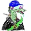 [CryptoDays 2.0](https://t.me/cryptodays) |
| Trading and signals | 85 | 6.9M | 5,961 | 22.3M |  [TONka→GRAM.smska](https://t.me/smska),  [YO vs Smash](https://t.me/yovssmash),  [MrKiaTeam](https://t.me/candootrade) |
| Investing and analytics | 55 | 6.6M | 4,269 | 14.9M | 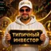 [Типичный Инвестор](https://t.me/eduardinvest),  [Дайте TON!](https://t.me/givemetonru),  [ПУШИСТЫЙ ИНВЕСТОР](https://t.me/fluffy_investor) |

By language: Russian 803, English 360, Persian 11, Ukrainian 11, Chinese 9, Arabic 6, Indonesian 5, es 3.

## Contribute

Found a wrong link or a missing project? Fill in a form, no files to edit: [wrong link](https://github.com/vitalikgpt/gram-ecosystem/issues/new?template=fix-link.yml), [missing project](https://github.com/vitalikgpt/gram-ecosystem/issues/new?template=add-project.yml). Pull requests are welcome too, see [CONTRIBUTING.md](CONTRIBUTING.md).

## Cite

GitHub's *Cite this repository* button gives the reference in APA and BibTeX ([CITATION.cff](CITATION.cff)).

## License

Data (`data/`, `reports/`) under [CC BY 4.0](LICENSE-DATA): reuse freely, credit Gram News. Scripts under [MIT](LICENSE). Images in `archive/` belong to their authors.

Not investment advice. A listing only says a project was found and what it did; check it yourself before you use it.
