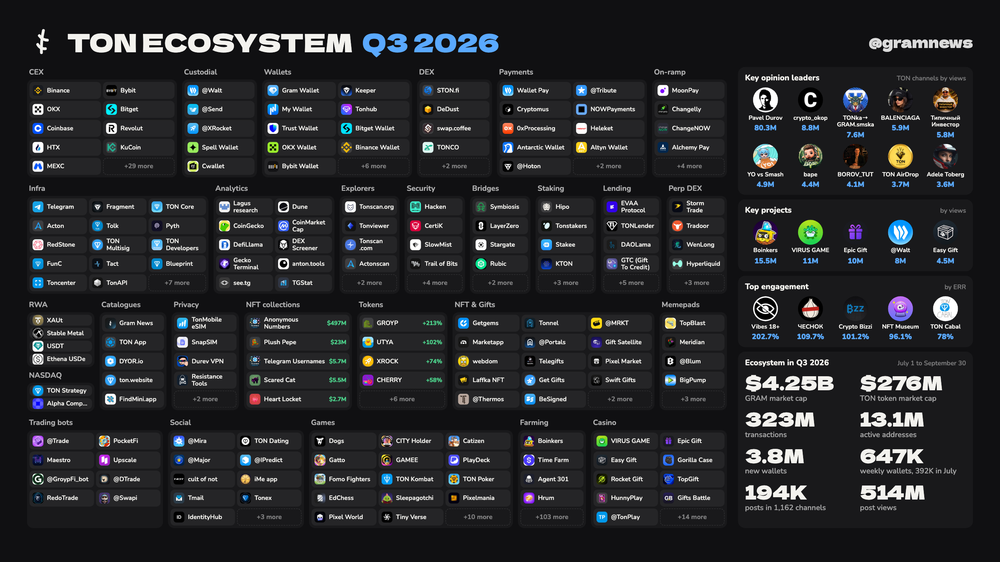

<!-- Generated by scripts/build_readme.py from data/. Do not edit by hand. -->

# Gram Ecosystem

A library of Gram (TON) and core Telegram projects, grouped by what they do, with links, the numbers that show each one is alive, and the ecosystem maps it appeared on since 2022. Maintained by [Gram News](https://gramnews.org).

**3186 projects in 32 categories: 927 active in Q3 2026, 2178 quiet, 81 closed.** 388 of the active ones are on the [Gram News map for Q3 2026](reports/2026-q3) ([article with interactive leaderboards](https://gramnews.org/articles/ton-ecosystem-map-q3-2026)). Plus 685 channels about TON and an [archive of 19 ecosystem maps](archive) by other authors, 2022 to 2026.

Every link here is checked. [792 links need a look](reports/link-check.md) (a wrong account, a dead page, or a name that does not match), and [220 names from older maps](data/unresolved.csv) still need a project to point to. Those two lists are the best place to start contributing. So far 1272 links have been replaced or removed and 89 confirmed, each with its evidence, in [data/link-fixes.csv](data/link-fixes.csv).

## Contents

- [Where the list comes from](#where-the-list-comes-from)
- [Status](#status)
- [CEX](#cex): 45 active, 68 in all
- [Custodial](#custodial): 5 active, 5 in all
- [Wallets](#wallets): 27 active, 93 in all
- [DEX](#dex): 15 active, 67 in all
- [Payments](#payments): 27 active, 69 in all
- [On-ramp](#on-ramp): 9 active, 21 in all
- [Infra](#infra): 25 active, 31 in all
- [Developer tools](#developer-tools): 15 active, 100 in all
- [Analytics](#analytics): 31 active, 113 in all
- [Explorers](#explorers): 6 active, 13 in all
- [Security](#security): 11 active, 33 in all
- [Bridges](#bridges): 11 active, 19 in all
- [Staking](#staking): 14 active, 40 in all
- [Lending](#lending): 10 active, 14 in all
- [Perp DEX](#perp-dex): 7 active, 7 in all
- [RWA](#rwa): 4 active, 9 in all
- [NASDAQ](#nasdaq): 2 active, 2 in all
- [Catalogues](#catalogues): 6 active, 10 in all
- [Privacy](#privacy): 10 active, 28 in all
- [NFT collections](#nft-collections): 5 active, 5 in all
- [Tokens](#tokens): 44 active, 114 in all
- [NFT & Gifts](#nft--gifts): 84 active, 236 in all
- [Memepads](#memepads): 17 active, 77 in all
- [Trading bots](#trading-bots): 20 active, 37 in all
- [Social](#social): 19 active, 106 in all
- [AI](#ai): 15 active, 39 in all
- [Tools](#tools): 24 active, 75 in all
- [Shopping](#shopping): 5 active, 32 in all
- [Education](#education): 4 active, 26 in all
- [Games](#games): 118 active, 751 in all
- [Farming](#farming): 247 active, 771 in all
- [Casino](#casino): 45 active, 175 in all
- [Channels](#channels)
- [Data files](#data-files)
- [Contributing](#contributing)
- [Disclaimer](#disclaimer)
- [License](#license)

## Where the list comes from

The `sources` column in [data/projects.csv](data/projects.csv) says where each project was found:

- `gramnews-q3-2026`: [Gram News map, Q3 2026](reports/2026-q3);
- `gramnews-apps`: the [Gram News apps library](https://gramnews.org/apps);
- `ton.app`: [ton.app](https://ton.app) catalogue (the full sitemap, read on October 1, 2026);
- `dyor.io`: [DYOR](https://dyor.io) catalogue;
- `findmini`: [FindMini](https://www.findmini.app) catalogue of mini apps, the TON-related ones;
- `defillama`: [DefiLlama](https://defillama.com/chain/ton), protocols on TON;
- `tonapi-whitelist`: tokens on the [tonapi](https://tonapi.io) whitelist with a $100K market cap or 1,000 holders;
- `ton-society-ecosystem-map`: [ton-society/ecosystem-map](https://github.com/ton-society/ecosystem-map);
- `awesome-ton`: [ton-community/awesome-ton](https://github.com/ton-community/awesome-ton);
- `gramnews-feed`: a [@gramnews](https://t.me/gramnews) post in Q3 2026;
- `ton-channel-posts`: a bot or product channel linked in posts of at least three different TON channels in Q3 2026 (the `metric` column says how many);
- a date and an author, such as `2024-06-dwf-ventures`: an ecosystem map in the [archive](archive).

## Status

`status` is measured, not judged. A project is `active` when at least one of these held from July 1 to September 30, 2026:

1. its Telegram channel published a post;
2. its bot showed 1,000+ monthly users on its t.me page;
3. Gram News wrote about it;
4. it had $10,000+ of TVL on TON on DefiLlama;
5. for developer tools and infrastructure, its GitHub repository received a commit.

Otherwise it is `quiet`: the links are kept, and `last_post` and `last_commit` say when it was last seen. `closed` means the catalogue it came from marked it as shut down, or every link the project had is dead: the username is free on t.me, the domain no longer resolves, the repository is gone (see [data/link-fixes.csv](data/link-fixes.csv)). Projects on the Q3 map passed a stricter test, described in [reports/2026-q3](reports/2026-q3), and a ✓ marks the ones built for TON.

Within a category, projects on the map come first in map order, then active ones by reach (post views or monthly users), then quiet ones by the date they were last seen.

## CEX

| # | Project | What it is | Links | Q3 signal | Last seen | On maps |
| ---: | --- | --- | --- | --- | --- | --- |
| 1 | Binance | Binance Official English Group | [Telegram](https://t.me/binance_announcements) [Site](https://www.binance.com) | 15.8M views | 2026-10-01 | [ton 25](archive/2025-07-ton.jpg) [tradoor 25](archive/2025-08-tradoor.jpg) |
| 2 | Bybit | BYBIT is a trading platform that caters to the needs of all types of traders. | [Telegram](https://t.me/bybit_announcements) [Site](https://www.bybit.com) | 2.2M views | 2026-10-01 | [ton 25](archive/2025-07-ton.jpg) [tradoor 25](archive/2025-08-tradoor.jpg) |
| 3 | OKX |  | [Telegram](https://t.me/okxannouncements) [Site](https://www.okx.com) | 552K views | 2026-10-01 | [tonpost 23](archive/2023-10-tonpost.jpg) [ton 25](archive/2025-07-ton.jpg) [tradoor 25](archive/2025-08-tradoor.jpg) |
| 4 | Bitget | 📢Official Bitget English Announcements Channel | [Telegram](https://t.me/bitget_announcements) [X](https://x.com/bitget) [Site](https://www.bitget.com) | 8.6M views | 2026-10-01 | [ton 25](archive/2025-07-ton.jpg) [tradoor 25](archive/2025-08-tradoor.jpg) |
| 5 | Coinbase |  | [Site](https://www.coinbase.com) |  |  |  |
| 6 | Revolut |  | [Site](https://www.revolut.com) |  |  | [ton 25](archive/2025-07-ton.jpg) |
| 7 | HTX | HTX Official English Group | [Telegram](https://t.me/htx_announcements) [X](https://x.com/TobbotTon) [Site](https://www.htx.com) | 865K views | 2026-10-01 | [tonpost 23](archive/2023-10-tonpost.jpg) [ton 25](archive/2025-07-ton.jpg) |
| 8 | KuCoin | Leading global crypto platform built on trust / 40M+ users worldwide | [Telegram](https://t.me/kucoin_news) [X](https://x.com/KuCoinCom) [Site](https://www.kucoin.com) [GitHub](https://github.com/qutoncash) | 2M views | 2026-10-01 | [tonpost 23](archive/2023-10-tonpost.jpg) [ton 25](archive/2025-07-ton.jpg) |
| 9 | MEXC |  | [Telegram](https://t.me/mexcofficialnews) [X](https://x.com/mexc) [Site](https://www.mexc.com) | 798K views | 2026-10-01 | [ton 25](archive/2025-07-ton.jpg) |
| 10 | bitFlyer |  | [Site](https://bitflyer.com) |  |  |  |
| 11 | wallex |  | [Telegram](https://t.me/wallexchange) [X](https://x.com/Wallex_ir) [Site](https://wallex.ir) | 1.9M views | 2026-10-01 |  |
| 12 | اوکی اکسچنج |  | [Telegram](https://t.me/okexir) [Bot](https://t.me/tonairdropfa_bot) [X](https://x.com/okexir) [Site](https://ok-ex.io/) | 1.8M views | 2026-10-01 |  |

[All 68 projects in CEX](categories/exchanges.md): 45 active, 21 quiet, 2 closed.

## Custodial

| # | Project | What it is | Links | Q3 signal | Last seen | On maps |
| ---: | --- | --- | --- | --- | --- | --- |
| 1 | @Walt ✓ | Crypto wallet for sending and buying USDT, gold, bitcoin, and other tokens. | [Telegram](https://t.me/walt_news) [Bot](https://t.me/walt) [Site](https://walt.app) | 8M views | 2026-10-01 | [tonpost 23](archive/2023-10-tonpost.jpg) [dwf-ventures 24](archive/2024-06-dwf-ventures.jpg) [ton-degen 24](archive/2024-06-ton-degen.jpg) [ton 25](archive/2025-07-ton.jpg) |
| 2 | @Send ✓ | Crypto Bot is a wallet for buying, selling, and storing cryptocurrency in Telegram. | [Telegram](https://t.me/cryptobotru) [Bot](https://t.me/send) [X](https://x.com/CryptoBotHQ) [GitHub](https://github.com/cryptopay-dev) | 1.5M views, 1.4M MAU | 2026-09-30 | [tonpost 23](archive/2023-10-tonpost.jpg) [dwf-ventures 24](archive/2024-06-dwf-ventures.jpg) [ton-degen 24](archive/2024-06-ton-degen.jpg) [ton 25](archive/2025-07-ton.jpg) [ton-cis-hub 25](archive/2025-ton-cis-hub.jpg) |
| 3 | @XRocket ✓ | xRocket is a wallet and crypto exchange inside Telegram | [Telegram](https://t.me/xrocketnews) [Bot](https://t.me/xrocket) [X](https://x.com/xRocket_tg) [Site](https://xrocket.exchange) | 115K views, 515K MAU | 2026-10-01 | [tonpost 23](archive/2023-10-tonpost.jpg) [ton 25](archive/2025-07-ton.jpg) [ton-cis-hub-q2 25](archive/2025-07-ton-cis-hub-q2.jpg) [ton-cis-hub 25](archive/2025-ton-cis-hub.jpg) |
| 4 | Spell Wallet ✓ | Crypto Airdrop Wallet - making airdrop claim easy and accessible for everyone | [Telegram](https://t.me/spell_wallet) [Bot](https://t.me/spell_wallet_bot) [X](https://x.com/spell_club) [Site](https://spellwallet.io/) | 211K views | 2026-08-01 | [ton 25](archive/2025-07-ton.jpg) [ton-cis-hub-q2 25](archive/2025-07-ton-cis-hub-q2.jpg) [ton-cis-hub 25](archive/2025-ton-cis-hub.jpg) |
| 5 | Cwallet | Cwallet is a crypto wallet for managing and swapping over 800 assets. | [Telegram](https://t.me/cctipnews) [X](https://x.com/Cwalletofficial) [Site](https://cwallet.com/) | 35K MAU | 2024-10-22 |  |

[All 5 projects in Custodial](categories/custodial.md): 5 active, 0 quiet, 0 closed.

## Wallets

| # | Project | What it is | Links | Q3 signal | Last seen | On maps |
| ---: | --- | --- | --- | --- | --- | --- |
| 1 | Gram Wallet ✓ | A non-custodial Gram wallet built into Telegram itself: the owner holds the keys, and… | [Site](https://gramwallet.io) |  |  |  |
| 2 | Keeper ✓ | Tonkeeper is a wallet. It allows managing TON and contacting support. | [Telegram](https://t.me/keeper_en) [Bot](https://t.me/tonkeeper) [X](https://x.com/tonkeeper) [Site](https://tonkeeper.page.link/LFgS) [GitHub](https://github.com/tonkeeper/tonkeeper-web) | 3.8M views, 34K MAU | 2026-10-01 | [tonpost 23](archive/2023-10-tonpost.jpg) [dwf-ventures 24](archive/2024-06-dwf-ventures.jpg) [ton-degen 24](archive/2024-06-ton-degen.jpg) [ton 25](archive/2025-07-ton.jpg) [tradoor 25](archive/2025-08-tradoor.jpg) [messari 26](archive/2026-05-messari.jpg) |
| 3 | My Wallet ✓ | · All You Need to Enjoy Crypto | [Telegram](https://t.me/mywalleteng) [Bot](https://t.me/mytonwalletbot) [X](https://x.com/mywallet_io) [Site](https://mytonwallet.io) [GitHub](https://github.com/mytonwalletorg) | 201K views | 2026-09-25 | [tonpost 23](archive/2023-10-tonpost.jpg) [dwf-ventures 24](archive/2024-06-dwf-ventures.jpg) [ton-degen 24](archive/2024-06-ton-degen.jpg) [ton 25](archive/2025-07-ton.jpg) [ton-cis-hub-q2 25](archive/2025-07-ton-cis-hub-q2.jpg) [tradoor 25](archive/2025-08-tradoor.jpg) [ton-cis-hub 25](archive/2025-ton-cis-hub.jpg) [messari 26](archive/2026-05-messari.jpg) |
| 4 | Tonhub ✓ |  | [Telegram](https://t.me/tonhub) [Bot](https://t.me/jettonvotebot) [Site](https://tonhub.com/dl) |  | 2026-04-09 | [tonpost 23](archive/2023-10-tonpost.jpg) [dwf-ventures 24](archive/2024-06-dwf-ventures.jpg) [ton 25](archive/2025-07-ton.jpg) [messari 26](archive/2026-05-messari.jpg) |
| 5 | Trust Wallet | The #1 crypto wallet, trusted by 220 million people. | [Telegram](https://t.me/trust_announcements) [X](https://x.com/trustwallet) [Site](https://trustwallet.com) [GitHub](https://github.com/trustwallet) | 1.4M views | 2026-10-01 | [tonpost 23](archive/2023-10-tonpost.jpg) [ton 25](archive/2025-07-ton.jpg) |
| 6 | Bitget Wallet | Bitget Wallet is a crypto wallet for everyday finance. | [Telegram](https://t.me/bitget_wallet) [Bot](https://t.me/bitgetofficialbot) [X](https://x.com/BitgetWallet) [Site](https://web3.bitget.com/) [GitHub](https://github.com/bitgetwallet/download) | 34K MAU | 2025-12-11 |  |
| 7 | OKX Wallet |  | [Site](https://web3.okx.com) |  |  |  |
| 8 | Binance Wallet |  | [Site](https://www.binance.com/en/web3wallet) |  |  |  |
| 9 | Bybit Wallet |  | [Site](https://www.bybit.com/en/web3) |  |  |  |
| 10 | SafePal | Stay tuned for the latest progress of SafePal Wallet(www.safepal.com) | [Telegram](https://t.me/safepal_official) [X](https://x.com/SafePal) [Site](https://www.safepal.com) [GitHub](https://github.com/SafePalWallet) | 109K views | 2026-09-24 | [tonpost 23](archive/2023-10-tonpost.jpg) [ton 25](archive/2025-07-ton.jpg) [tradoor 25](archive/2025-08-tradoor.jpg) |
| 11 | Tangem | Tap into crypto freedom. Security. Utility. Mobility. 6M+ wallets and counting. | [Telegram](https://t.me/tangem) [Site](https://tangem.com) [GitHub](https://github.com/tangem) | 327K views | 2026-10-01 | [ton 25](archive/2025-07-ton.jpg) |
| 12 | Ledger |  | [Site](https://www.ledger.com) |  |  | [ton 25](archive/2025-07-ton.jpg) [tradoor 25](archive/2025-08-tradoor.jpg) |

[All 93 projects in Wallets](categories/wallets.md): 27 active, 64 quiet, 2 closed.

## DEX

| # | Project | What it is | Links | Q3 signal | Last seen | On maps |
| ---: | --- | --- | --- | --- | --- | --- |
| 1 | STON.fi ✓ | STON.fi — swap tokens across TON, EVM, and TRON in one interface | [Telegram](https://t.me/stonfidex) [Bot](https://t.me/ston_fi) [X](https://x.com/ston_fi) [Site](https://ston.fi) [GitHub](https://github.com/ston-fi) | 425K views | 2026-10-01 | [tonpost 23](archive/2023-10-tonpost.jpg) [dwf-ventures 24](archive/2024-06-dwf-ventures.jpg) [ton-degen 24](archive/2024-06-ton-degen.jpg) [ton 25](archive/2025-07-ton.jpg) [tradoor 25](archive/2025-08-tradoor.jpg) [messari 26](archive/2026-05-messari.jpg) |
| 2 | STON.fi Bot ✓ | STON.fi: Cross-chain DeFi, without the chaos. | [Telegram](https://t.me/stonfidex) [Bot](https://t.me/stonfi_bot) [X](https://x.com/ston_fi) [Site](https://app.ston.fi) [GitHub](https://github.com/ston-fi) | 425K views, 27K MAU | 2026-10-01 |  |
| 3 | DeDust ✓ | Decentralized exchange on TON | [Telegram](https://t.me/dedust_en) [Bot](https://t.me/dedustBot) [X](https://x.com/dedust_io) [Site](https://dedust.io) [GitHub](https://github.com/dedust-io) |  | 2026-06-15 | [tonpost 23](archive/2023-10-tonpost.jpg) [dwf-ventures 24](archive/2024-06-dwf-ventures.jpg) [ton-degen 24](archive/2024-06-ton-degen.jpg) [ton 25](archive/2025-07-ton.jpg) [messari 26](archive/2026-05-messari.jpg) |
| 4 | swap.coffee ✓ | The most effective DEX Aggregator on TON. Smart routing and transaction splitting. | [Telegram](https://t.me/swap_coffee) [Bot](https://t.me/swapcoffeebot) [X](https://x.com/swap_coffee_ton) [Site](https://swap.coffee/dex) | 4K views | 2026-08-12 | [ton 25](archive/2025-07-ton.jpg) [tradoor 25](archive/2025-08-tradoor.jpg) |
| 5 | TONCO ✓ | TONCO — a decentralized exchange on TON with concentrated liquidity | [Telegram](https://t.me/tonco_io) [Bot](https://t.me/tonco_io_bot) [X](https://x.com/tonco_io) [Site](https://tonco.io) [GitHub](https://github.com/cryptoalgebra/tonco-demo) | 2K views | 2026-09-17 | [tonpost 23](archive/2023-10-tonpost.jpg) [ton 25](archive/2025-07-ton.jpg) [tradoor 25](archive/2025-08-tradoor.jpg) [ton-cis-hub 25](archive/2025-ton-cis-hub.jpg) [messari 26](archive/2026-05-messari.jpg) |
| 6 | Torch Finance ✓ | 🚀 Torch DEX - Stable Swap on TON | [Bot](https://t.me/torch_finance_bot) [Site](https://torch.finance) [GitHub](https://github.com/torch-core) |  | 2026-06-30 | [ton 25](archive/2025-07-ton.jpg) [messari 26](archive/2026-05-messari.jpg) |
| 7 | Megaton Finance ✓ |  | [Site](https://megaton.fi) [GitHub](https://github.com/megaton-fi) |  | 2023-03-03 | [tonpost 23](archive/2023-10-tonpost.jpg) [dwf-ventures 24](archive/2024-06-dwf-ventures.jpg) [ton-degen 24](archive/2024-06-ton-degen.jpg) [messari 26](archive/2026-05-messari.jpg) |
| 8 | Brivox | Brivox is built specifically for the future of decentralized finance. | [Bot](https://t.me/brivoxwbe3_bot) | mentioned by 9 TON channels in Q3 |  |  |
| 9 | Rebor | Rebor is a bot for trading tokens on a decentralized exchange. | [Telegram](https://t.me/ReborCoin) [Bot](https://t.me/ReborCoinBot) [X](https://x.com/Reborcoin) [Site](https://rebor.xyz) | 282K MAU | 2026-07-10 |  |
| 10 | CoffinMeme | CoffinMeme is a mini app for fighting "shitcoins" on TON. | [Telegram](https://t.me/coffin_en) [Bot](https://t.me/memecoffin_bot) [Site](https://coffin.meme) | TVL $23K | 2025-04-11 |  |
| 11 | BiniChain DEX App | Created by Binibit.com | [Telegram](https://t.me/binibitnews) [Bot](https://t.me/binichain_bot) | mentioned by 9 TON channels in Q3 | 2026-09-29 |  |
| 12 | TON Hedge | New generation trading platform on TON blockchain 💎 | [Telegram](https://t.me/ton_hedge) [Bot](https://t.me/ton_hedge_bot) [X](https://x.com/tonhedge) | TVL $25K | 2025-06-16 | [ton 25](archive/2025-07-ton.jpg) [ton-cis-hub-q2 25](archive/2025-07-ton-cis-hub-q2.jpg) [ton-cis-hub 25](archive/2025-ton-cis-hub.jpg) |

[All 67 projects in DEX](categories/dex.md): 15 active, 49 quiet, 3 closed.

## Payments

| # | Project | What it is | Links | Q3 signal | Last seen | On maps |
| ---: | --- | --- | --- | --- | --- | --- |
| 1 | Wallet Pay ✓ |  | [Site](https://pay.wallet.tg) |  |  | [ton 25](archive/2025-07-ton.jpg) |
| 2 | @Tribute ✓ | A service for Telegram creators to monetize content through subscriptions, donations,… | [Telegram](https://t.me/tributenewsen) [Bot](https://t.me/tribute) [Site](https://tribute.tg/) | 142K views, 1.8M MAU | 2026-10-01 | [ton 25](archive/2025-07-ton.jpg) |
| 3 | Cryptomus |  | [X](https://x.com/cryptomus) [Site](https://cryptomus.com/) |  |  | [ton 25](archive/2025-07-ton.jpg) |
| 4 | NOWPayments |  | [X](https://x.com/NOWPayments_io) [Site](https://nowpayments.io/) |  |  | [ton 25](archive/2025-07-ton.jpg) |
| 5 | 0xProcessing | Secure crypto payment gateway for global transactions with up to 99.9% acceptance rate | [Telegram](https://t.me/oxprocessing) [X](https://x.com/0Xprocessing) [Site](https://0xprocessing.com) | 31K views | 2026-10-01 |  |
| 6 | Heleket | A payment gateway for accepting crypto, TON included, on a website or in a Telegram bot,… | [Telegram](https://t.me/heleket) [Site](https://heleket.com) | 6K views | 2026-09-10 |  |
| 7 | Antarctic Wallet ✓ | Antarctic Wallet – первый полностью легальный и лицензированный криптокошелёк, созданный… | [Telegram](https://t.me/antarcticwallet) [Bot](https://t.me/antarctic_wallet_bot) [Site](https://antarcticwallet.com) | 154K MAU | 2026-10-01 |  |
| 8 | Altyn Wallet ✓ | Пополняйте с любого банка РФ бесплатно, тратьте по всему миру по лучшему курсу. | [Bot](https://t.me/altyn_wallet_bot) | 84K MAU |  |  |
| 9 | @Hoton ✓ | Telegram Premium, Stars & $GRAM top-ups — up to 60% cheaper than in-app. | [Bot](https://t.me/hoton) |  |  |  |
| 10 | TON Pay ✓ | Your provider to the safety and freedom of The Open Network. | [Telegram](https://t.me/tonpay_official) [Bot](https://t.me/tonpay) [Site](https://ton.org/en/pay) |  | 2025-01-09 | [messari 26](archive/2026-05-messari.jpg) |
| 11 | xStocks |  | [Site](https://xstocks.fi) |  |  | [messari 26](archive/2026-05-messari.jpg) |
| 12 | Mops Stars / Купить Звёзды |  | [Bot](https://t.me/mopsstarsbot) | 155K MAU |  |  |

[All 69 projects in Payments](categories/payments.md): 27 active, 40 quiet, 2 closed.

## On-ramp

| # | Project | What it is | Links | Q3 signal | Last seen | On maps |
| ---: | --- | --- | --- | --- | --- | --- |
| 1 | MoonPay |  | [X](https://x.com/moonpay) [Site](https://www.moonpay.com) |  |  | [ton 25](archive/2025-07-ton.jpg) |
| 2 | Changelly | Exchange crypto → changelly.page.link/telegram | [Telegram](https://t.me/changelly) [Site](https://apps.apple.com/us/app/crypto-exchange-buy-bitcoin/id1435140380) [GitHub](https://github.com/changelly) | 65K views | 2026-10-01 | [ton 25](archive/2025-07-ton.jpg) |
| 3 | ChangeNOW |  | [X](https://x.com/ChangeNOW) [Site](https://changenow.io) [GitHub](https://github.com/ChangeNow-io) |  | 2021-09-06 | [ton 25](archive/2025-07-ton.jpg) [messari 26](archive/2026-05-messari.jpg) |
| 4 | Alchemy Pay |  | [Site](https://alchemypay.org) |  |  | [ton 25](archive/2025-07-ton.jpg) |
| 5 | Transak |  | [Site](https://transak.com) |  |  |  |
| 6 | Itez | Buy, sell, swap and store digital assets in one app. OTC, off-ramp and payment solutions… | [Telegram](https://t.me/itezofficial) [X](https://x.com/Itezofficial) [Site](https://itez.com/) | 2K views | 2026-10-01 | [ton 25](archive/2025-07-ton.jpg) |
| 7 | MultiKassa Bot ✓ | MultiKassa bot lets you exchange cash rubles for cryptocurrency | [Telegram](https://t.me/multikassa_channel) [Bot](https://t.me/multikassa_bot) [X](https://x.com/multikassa) [Site](https://multikassa.com/) | 64 views | 2026-09-21 |  |
| 8 | Mercuryo |  | [Site](https://mercuryo.io) |  |  | [tonpost 23](archive/2023-10-tonpost.jpg) [ton 25](archive/2025-07-ton.jpg) [messari 26](archive/2026-05-messari.jpg) |
| 9 | Prosto Exchange | Платите криптой по QR. Покупка и вывод на карту, наличные по миру. ProstoEx -легальный… | [Bot](https://t.me/prostoexbot) | mentioned by 5 TON channels in Q3 |  |  |

[All 21 projects in On-ramp](categories/onramp.md): 9 active, 12 quiet, 0 closed.

## Infra

| # | Project | What it is | Links | Q3 signal | Last seen | On maps |
| ---: | --- | --- | --- | --- | --- | --- |
| 1 | Telegram ✓ | The official Telegram on Telegram. Much recursion. Very Telegram. Wow. | [Telegram](https://t.me/telegram) [Site](https://telegram.org) | 14.7M views | 2026-08-26 | [tonpost 23](archive/2023-10-tonpost.jpg) [ton-degen 24](archive/2024-06-ton-degen.jpg) [ton 25](archive/2025-07-ton.jpg) [ton-cis-hub-q2 25](archive/2025-07-ton-cis-hub-q2.jpg) [tradoor 25](archive/2025-08-tradoor.jpg) [ton-cis-hub 25](archive/2025-ton-cis-hub.jpg) [messari 26](archive/2026-05-messari.jpg) |
| 2 | Fragment ✓ |  | [Site](https://fragment.com) |  |  | [tonpost 23](archive/2023-10-tonpost.jpg) [ton 25](archive/2025-07-ton.jpg) [messari 26](archive/2026-05-messari.jpg) |
| 3 | TON Core ✓ |  | [Telegram](https://t.me/toncore) [Site](https://ton.org) | 45K views | 2026-09-23 | [ton 25](archive/2025-07-ton.jpg) |
| 4 | Acton ✓ | A unified command-line toolchain for TON smart contracts in Tolk — project setup, tests,… | [Telegram](https://t.me/theopentooling) [Site](https://ton-blockchain.github.io/acton/) [GitHub](https://github.com/ton-blockchain/acton) | 4K views | 2026-09-30 |  |
| 5 | Tolk ✓ | Channel devoted to TOLK — "next-generation FunC" — a language for writing smart… | [Telegram](https://t.me/tolk_lang) [Site](https://docs.ton.org/v3/documentation/smart-contracts/tolk/overview) |  | 2026-09-23 | [messari 26](archive/2026-05-messari.jpg) |
| 6 | Pyth |  | [Site](https://www.pyth.network) |  |  | [ton 25](archive/2025-07-ton.jpg) [tradoor 25](archive/2025-08-tradoor.jpg) [messari 26](archive/2026-05-messari.jpg) |
| 7 | RedStone | A modular oracle delivering data for DeFi to EVM and non-EVM chains, TON included. | [Site](https://www.redstone.finance) [GitHub](https://github.com/redstone-finance) | commit 2026-10-01 | 2026-10-01 | [ton 25](archive/2025-07-ton.jpg) [messari 26](archive/2026-05-messari.jpg) |
| 8 | TON Multisig ✓ |  | [Site](https://multisig.ton.org) |  |  |  |
| 9 | TON Developers ✓ |  | [Telegram](https://t.me/tondevs_tg) |  |  |  |
| 10 | FunC ✓ |  | [Site](https://docs.ton.org/v3/documentation/smart-contracts/func/overview) |  |  |  |
| 11 | Tact ✓ |  | [Site](https://tact-lang.org) |  |  |  |
| 12 | Blueprint ✓ |  | [Site](https://github.com/ton-org/blueprint) |  |  | [tonpost 23](archive/2023-10-tonpost.jpg) |

[All 31 projects in Infra](categories/infra.md): 25 active, 6 quiet, 0 closed.

## Developer tools

| # | Project | What it is | Links | Q3 signal | Last seen | On maps |
| ---: | --- | --- | --- | --- | --- | --- |
| 1 | TonTon Games |  | [Telegram](https://t.me/tikitons) | 25K views | 2026-10-01 | [ton 25](archive/2025-07-ton.jpg) |
| 2 | Durev Bot |  | [Telegram](https://t.me/poveldurev) [Bot](https://t.me/durevrobot) [X](https://x.com/poveldurev) [Site](https://dedust.io/swap/TON/DUREV) | 16K views | 2026-08-14 |  |
| 3 | FolioTrade | Automated crypto trading bot | [Telegram](https://t.me/foliostack) [Bot](https://t.me/FolioTradeBot) [Site](https://trade.foliostack.net) | 57 views | 2026-08-15 |  |
| 4 | Chainbase Network |  | [X](https://x.com/ChainbaseHQ) [Site](https://chainbase.com) [GitHub](https://github.com/chainbase-labs) | commit 2026-09-16 | 2026-09-16 |  |
| 5 | IntelliJ Idea plugin |  | [Telegram](https://t.me/actiqapp) [X](https://x.com/actiqapp) [Site](https://plugins.jetbrains.com/plugin/23382-ton) [GitHub](https://github.com/actiquest-dev) | commit 2026-08-27 | 2026-08-27 | [tonpost 23](archive/2023-10-tonpost.jpg) |
| 6 | Minter |  | [Site](https://minter.ton.org) |  |  |  |
| 7 | nessshon/tonutils | High-level SDK and toolkit. | [GitHub](https://github.com/nessshon/tonutils) | commit 2026-09-02 | 2026-09-02 |  |
| 8 | Orbs |  | [X](https://x.com/orbs_network) [Site](https://www.orbs.com) [GitHub](https://github.com/orbs-network) | commit 2026-10-01 | 2026-10-01 | [dwf-ventures 24](archive/2024-06-dwf-ventures.jpg) [ton 25](archive/2025-07-ton.jpg) |
| 9 | Softstack |  | [X](https://x.com/softstackHQ) [Site](https://softstack.io) [GitHub](https://github.com/softstack) | commit 2026-09-29 | 2026-09-29 |  |
| 10 | tact.vim | Vim 8+ plugin. | [GitHub](https://github.com/tact-lang/tact.vim) | commit 2026-07-08 | 2026-07-08 |  |
| 11 | TON Testnet Faucet |  | [Site](https://ton.run/#/faucet) [GitHub](https://github.com/awesome-doge) | commit 2026-10-01 | 2026-10-01 |  |
| 12 | tonlib-rs | Rust SDK for TON. | [GitHub](https://github.com/ston-fi/tonlib-rs) | commit 2026-08-12 | 2026-08-12 |  |

[All 100 projects in Developer tools](categories/devtools.md): 15 active, 82 quiet, 3 closed.

## Analytics

| # | Project | What it is | Links | Q3 signal | Last seen | On maps |
| ---: | --- | --- | --- | --- | --- | --- |
| 1 | Lagus research ✓ | ресерч, секьюрити, контракты, блокчейны | [Telegram](https://t.me/lagus_research) | 8K views | 2026-09-30 |  |
| 2 | Dune |  | [Site](https://dune.com) |  |  | [ton 25](archive/2025-07-ton.jpg) |
| 3 | CoinGecko |  | [Site](https://www.coingecko.com) |  |  |  |
| 4 | CoinMarketCap |  | [Site](https://coinmarketcap.com) |  |  |  |
| 5 | DefiLlama |  | [X](https://x.com/DefiLlama) [Site](https://defillama.com/chain/ton) |  |  | [tonpost 23](archive/2023-10-tonpost.jpg) |
| 6 | DEX Screener |  | [Site](https://dexscreener.com/ton) |  |  | [ton 25](archive/2025-07-ton.jpg) |
| 7 | Gecko Terminal |  | [Site](https://www.geckoterminal.com/ton/pools) |  |  | [ton 25](archive/2025-07-ton.jpg) |
| 8 | anton.tools ✓ |  | [Site](https://anton.tools) [GitHub](https://github.com/tonindexer) |  | 2025-07-01 | [tonpost 23](archive/2023-10-tonpost.jpg) [ton 25](archive/2025-07-ton.jpg) |
| 9 | see.tg ✓ |  | [Site](https://see.tg) |  |  |  |
| 10 | TGStat |  | [Site](https://tgstat.com) |  |  |  |
| 11 | New Listings Feed | Snappiest digital asset listings clearinghouse. http://newlistings.pro WebSocket:… | [Telegram](https://t.me/newlistingsfeed) [Bot](https://t.me/newlistingsfeed_bot) [Site](https://newlistings.pro) | mentioned by 4 TON channels in Q3 | 2026-10-01 |  |
| 12 | CryptoWhale | The official channel for crypto and bitcoin price action, social media analytics, news,… | [Telegram](https://t.me/whalebotalerts) [Bot](https://t.me/cryptowhalebot) [X](https://x.com/icebergy) | 238K views, 13K MAU | 2026-10-01 |  |

[All 113 projects in Analytics](categories/analytics.md): 31 active, 77 quiet, 5 closed.

## Explorers

| # | Project | What it is | Links | Q3 signal | Last seen | On maps |
| ---: | --- | --- | --- | --- | --- | --- |
| 1 | Tonscan.org ✓ |  | [Telegram](https://t.me/catchain) [Site](https://tonscan.org) | 8K views | 2026-09-18 | [tonpost 23](archive/2023-10-tonpost.jpg) [ton 25](archive/2025-07-ton.jpg) |
| 2 | Tonviewer ✓ |  | [X](https://x.com/bestramp_io) [Site](https://tonviewer.com) |  |  | [tonpost 23](archive/2023-10-tonpost.jpg) [ton 25](archive/2025-07-ton.jpg) |
| 3 | Tonscan.com ✓ |  | [X](https://x.com/bastion) [Site](https://tonscan.com) |  |  |  |
| 4 | Actonscan ✓ | An open-source TON explorer by TON Core — accounts, transactions, blocks, tokens and… | [Site](https://actonscan.com) |  |  |  |
| 5 | TON NFT Explorer ✓ |  | [Telegram](https://t.me/this_is_ton) [Site](https://explorer.tonnft.tools) | 6K views | 2026-09-17 |  |
| 6 | TonScan.info ✓ |  | [Site](https://tonscan.info) |  |  |  |

[All 13 projects in Explorers](categories/explorers.md): 6 active, 7 quiet, 0 closed.

## Security

| # | Project | What it is | Links | Q3 signal | Last seen | On maps |
| ---: | --- | --- | --- | --- | --- | --- |
| 1 | Hacken | Hacken — blockchain security and compliance audit and consulting firm | [Telegram](https://t.me/hackenai) [Bot](https://t.me/kostiantyn_hacken) [X](https://x.com/hackenclub) [Site](https://hacken.io/) [GitHub](https://github.com/hknio) | 49K views | 2026-09-16 | [ton 25](archive/2025-07-ton.jpg) |
| 2 | CertiK | This is the only official channel for CertiK. | [Telegram](https://t.me/certikcommunity) [X](https://x.com/CertiK) [Site](https://www.certik.com) [GitHub](https://github.com/CertiKProject) |  | 2026-09-19 | [tonpost 23](archive/2023-10-tonpost.jpg) [ton 25](archive/2025-07-ton.jpg) |
| 3 | SlowMist |  | [X](https://x.com/SlowMist_Team) [Site](https://www.slowmist.com) [GitHub](https://github.com/slowmist) |  | 2026-09-30 | [tonpost 23](archive/2023-10-tonpost.jpg) [ton 25](archive/2025-07-ton.jpg) |
| 4 | Trail of Bits |  | [Site](https://www.trailofbits.com) |  |  | [tonpost 23](archive/2023-10-tonpost.jpg) [ton 25](archive/2025-07-ton.jpg) |
| 5 | Quantstamp |  | [Site](https://quantstamp.com) |  |  | [tonpost 23](archive/2023-10-tonpost.jpg) |
| 6 | HackenProof | HackenProof is a bug bounty platform for crypto business and hackers. | [Telegram](https://t.me/hackenproof) [X](https://x.com/HackenProof) [Site](https://hackenproof.com/) [GitHub](https://github.com/hackenproof) | 7K views | 2026-09-29 | [ton 25](archive/2025-07-ton.jpg) |
| 7 | Chainalysis | Building trust in blockchains among people, businesses, and governments. | [Telegram](https://t.me/chainalysisinc) [GitHub](https://github.com/chainalysis) | 9K views | 2026-09-29 | [ton 25](archive/2025-07-ton.jpg) |
| 8 | Tonguard ✓ | TON Guard is the first cloud-based solution for the TON blockchain, leveraging AI-driven… | [Telegram](https://t.me/tonguardaml) [Bot](https://t.me/tonguard_bot) [Site](https://tonguard.org/) | 420 views | 2026-09-25 | [ton 25](archive/2025-07-ton.jpg) [ton-cis-hub-q2 25](archive/2025-07-ton-cis-hub-q2.jpg) [ton-cis-hub 25](archive/2025-ton-cis-hub.jpg) |
| 9 | TrustaTONApp_bot | AI service for on-chain identity and reputation. | [Bot](https://t.me/trustatonapp_bot) [X](https://x.com/TrustaLabs) [Site](https://trustalabs.ai) [GitHub](https://github.com/mir-one/fingerprints) | 17K views, 112K MAU | 2026-09-29 |  |
| 10 | GID Anti-Scam | Крупнейший анти-скам проект в Telegram🛡️ 👮‍♂️ Подать жалобу /report Скам-База… | [Bot](https://t.me/gidbanbot) | mentioned by 4 TON channels in Q3 |  |  |
| 11 | Nowarp | nowarp.io / github.com/nowarp / x.com/nowarp_io | [Telegram](https://t.me/nowarp_io) [X](https://x.com/nowarp_io) [Site](https://nowarp.io) [GitHub](https://github.com/nowarp) |  | 2026-07-13 |  |

[All 33 projects in Security](categories/audit.md): 11 active, 22 quiet, 0 closed.

## Bridges

| # | Project | What it is | Links | Q3 signal | Last seen | On maps |
| ---: | --- | --- | --- | --- | --- | --- |
| 1 | Symbiosis | The latest news on the development of the symbiotic blockchain metaverse. | [Telegram](https://t.me/symbiosis_announcements) [X](https://x.com/symbiosis_fi) [Site](https://app.symbiosis.finance/) [GitHub](https://github.com/symbiosis-finance) | 8K views | 2026-10-01 | [ton 25](archive/2025-07-ton.jpg) [messari 26](archive/2026-05-messari.jpg) |
| 2 | LayerZero |  | [Site](https://layerzero.network) |  |  | [ton 25](archive/2025-07-ton.jpg) [messari 26](archive/2026-05-messari.jpg) |
| 3 | Stargate |  | [Site](https://stargate.finance) |  |  | [ton 25](archive/2025-07-ton.jpg) |
| 4 | Rubic | Rubic - Best Rate Finder & Crypto Swap Aggregator | [Telegram](https://t.me/cryptorubic) [Bot](https://t.me/RubicSupportBot) [X](https://x.com/cryptorubic) [Site](https://app.rubic.exchange) | 11K views | 2026-09-30 |  |
| 5 | TAC ✓ |  | [Telegram](https://t.me/tacbuild) [Bot](https://t.me/tacairdrop_bot) |  | 2025-09-22 | [ton 25](archive/2025-07-ton.jpg) |
| 6 | NEAR Intents |  | [Site](https://near-intents.org) |  |  |  |
| 7 | TonTake Bridge | Благотворительно-развлекательная криптоорганизация. | [Telegram](https://t.me/TonTake) [X](https://x.com/tontakegame) | 84K views | 2026-10-01 |  |
| 8 | Orbit Bridge | Orbit Chain Announcement Channel | [Telegram](https://t.me/OrbitChainChannel) [X](https://x.com/Orbit_Chain) [Site](https://bridge.orbitchain.io/) [GitHub](https://github.com/orbit-chain) | TVL $20K | 2026-10-01 | [ton 25](archive/2025-07-ton.jpg) |
| 9 | SoDEX Bridge | SoDEX is a high-performance order book decentralized exchange (DEX) built on ValueChain. | [X](https://x.com/sodex_official) [Site](https://ssi.sosovalue.com) | TVL $12K |  |  |
| 10 | TAC Cross Chain Layer | TAC Cross Chain Layer is a messaging and custody layer connecting TON and TAC EVM,… | [X](https://x.com/tacbuild) [Site](https://tac.build) | TVL $1.7M |  |  |
| 11 | TON ↔ BSC |  | [Telegram](https://t.me/contest) [Bot](https://t.me/cryptouser_bot) [Site](https://bridge.ton.org) [GitHub](https://github.com/ton-blockchain) |  | 2026-10-01 |  |

[All 19 projects in Bridges](categories/bridges.md): 11 active, 6 quiet, 2 closed.

## Staking

| # | Project | What it is | Links | Q3 signal | Last seen | On maps |
| ---: | --- | --- | --- | --- | --- | --- |
| 1 | Hipo ✓ | Hipo Staking — GRAM staking on TON with hGRAM rewards | [Telegram](https://t.me/hipofinance) [Bot](https://t.me/HipoFinanceBot) [X](https://x.com/hipofinance) [Site](https://app.hipo.finance/) [GitHub](https://github.com/HipoFinance) | 99K views | 2026-10-01 | [dwf-ventures 24](archive/2024-06-dwf-ventures.jpg) [ton-degen 24](archive/2024-06-ton-degen.jpg) [ton 25](archive/2025-07-ton.jpg) [messari 26](archive/2026-05-messari.jpg) |
| 2 | Tonstakers ✓ | Tonstakers – liquid staking app for GRAM | [Telegram](https://t.me/thetonstakers) [Bot](https://t.me/tonstakers_support_bot) [X](https://x.com/tonstakers) [Site](https://app.tonstakers.com/) | 87K views | 2026-08-12 | [tonpost 23](archive/2023-10-tonpost.jpg) [dwf-ventures 24](archive/2024-06-dwf-ventures.jpg) [ton-degen 24](archive/2024-06-ton-degen.jpg) [ton 25](archive/2025-07-ton.jpg) [tradoor 25](archive/2025-08-tradoor.jpg) [messari 26](archive/2026-05-messari.jpg) |
| 3 | Stakee ✓ | TON staking with up to 25% APY and instant withdrawals. | [Telegram](https://t.me/stakeeru) [Bot](https://t.me/StakeeRu) [Site](https://stakee.org) [GitHub](https://github.com/ton-blockchain) | 8K views | 2026-10-01 | [dwf-ventures 24](archive/2024-06-dwf-ventures.jpg) [ton-degen 24](archive/2024-06-ton-degen.jpg) [ton 25](archive/2025-07-ton.jpg) [messari 26](archive/2026-05-messari.jpg) |
| 4 | KTON ✓ | KTON LST — staking TON with a liquid KTON token | [Telegram](https://t.me/kton_channel) [Bot](https://t.me/ktonio_bot) [X](https://x.com/kton_io) [Site](https://kton.io/) [GitHub](https://github.com/KTON-IO/liquid-staking-contract) | 74 views | 2026-10-01 | [ton 25](archive/2025-07-ton.jpg) |
| 5 | TON Validators ✓ |  | [Bot](https://t.me/tonvalidators_app_bot) |  |  | [tonpost 23](archive/2023-10-tonpost.jpg) [ton 25](archive/2025-07-ton.jpg) |
| 6 | UTONIC ✓ |  | [Site](https://utonic.org) |  |  | [ton 25](archive/2025-07-ton.jpg) [messari 26](archive/2026-05-messari.jpg) |
| 7 | bemo ✓ |  | [Site](https://bemo.finance) |  |  | [tonpost 23](archive/2023-10-tonpost.jpg) [dwf-ventures 24](archive/2024-06-dwf-ventures.jpg) [ton-degen 24](archive/2024-06-ton-degen.jpg) [ton 25](archive/2025-07-ton.jpg) [tradoor 25](archive/2025-08-tradoor.jpg) [messari 26](archive/2026-05-messari.jpg) |
| 8 | Butterflys | Welcome To 🦋 Butterfly's $BTYS. | [Bot](https://t.me/realbutterflys_bot) [X](https://x.com/Butterflyonton) [Site](https://app.hipo.finance/#/referrer=UQDo7L_NkX2FBF5WDKBvIA-lFXUvRMpou6Yc1076Q1j8FkcW/) [GitHub](https://github.com/HipoFinance) | 14K MAU | 2026-10-01 |  |
| 9 | bemo V1 | The liquid staking protocol on the TON blockchain. | [X](https://x.com/bemo_fi) [Site](https://bemo.fi/) | TVL $2.1M |  |  |
| 10 | bemo V2 | The liquid staking protocol on the TON blockchain. | [X](https://x.com/bemo_fi) [Site](https://bemo.fi/) | TVL $0.5M |  |  |
| 11 | Ethena tsUSDe | tsUSDe is a special version of sUSDe deployed on TON | [X](https://x.com/ethena) [Site](https://www.app.ethena.fi) | TVL $3.0M |  |  |
| 12 | SettleTON | SettleTON is the First TON Liquidity Pool Index Fund that maximises yields by helping… | [X](https://x.com/TonSettle) [Site](https://x.com/TonSettle) | TVL $83K |  |  |

[All 40 projects in Staking](categories/staking.md): 14 active, 23 quiet, 3 closed.

## Lending

| # | Project | What it is | Links | Q3 signal | Last seen | On maps |
| ---: | --- | --- | --- | --- | --- | --- |
| 1 | EVAA Protocol ✓ | The first decentralized lending protocol on TON , | [Telegram](https://t.me/evaaprotocol) [Bot](https://t.me/EvaaAppBot) [X](https://x.com/evaaprotocol) [Site](https://evaa.finance) [GitHub](https://github.com/evaafi) |  | 2026-08-30 | [tonpost 23](archive/2023-10-tonpost.jpg) [dwf-ventures 24](archive/2024-06-dwf-ventures.jpg) [ton-degen 24](archive/2024-06-ton-degen.jpg) [ton 25](archive/2025-07-ton.jpg) [tradoor 25](archive/2025-08-tradoor.jpg) [messari 26](archive/2026-05-messari.jpg) |
| 2 | TONLender ✓ | Borrow GRAM against NFT collateral on TON | [Telegram](https://t.me/tonlender_ru) [Bot](https://t.me/tonlenderbot) [X](https://x.com/tonlender) [Site](https://tonlender.com) | 7K views, 16K MAU | 2026-09-28 |  |
| 3 | DAOLama ✓ | DAOLama is a lending service for NFT collateral that is closing soon. | [Telegram](https://t.me/daolama) [Bot](https://t.me/daolama_bot) [X](https://x.com/daolama_ton) [Site](https://daolama.co?utm_source=tonapp&utm_medium=marketplace&utm_campaign=NFT_service) | 11K views | 2026-09-24 | [tonpost 23](archive/2023-10-tonpost.jpg) [dwf-ventures 24](archive/2024-06-dwf-ventures.jpg) [ton-degen 24](archive/2024-06-ton-degen.jpg) [ton 25](archive/2025-07-ton.jpg) [tradoor 25](archive/2025-08-tradoor.jpg) |
| 4 | GTC (Gift To Credit) ✓ | GTC is onchain / offchain lending against Telegram gifts & NFTs. | [Telegram](https://t.me/gifttocredit_new_age) [Site](https://giftcredit.app/borrow) | 9K views | 2026-08-20 |  |
| 5 | Fiva ✓ | FIVA - Your financial app in Telegram | [Telegram](https://t.me/fiva_protocol) [X](https://x.com/FivaProtocol) [Site](https://thefiva.com) | 2K views | 2026-07-21 | [ton 25](archive/2025-07-ton.jpg) |
| 6 | Octalend ✓ | Octalend — NFT and gift-backed lending on TON | [Telegram](https://t.me/octalend) [Bot](https://t.me/octalend_bot) [X](https://x.com/octalend) [Site](https://octalend.xyz) | 542 views | 2026-09-24 |  |
| 7 | Aqua Protocol (CDP) ✓ |  | [Telegram](https://t.me/aquaprotocolxyzchannel) [Bot](https://t.me/AquaProtocolxyz_Bot) [X](https://x.com/aquaprotocolxyz) [Site](https://aquaprotocol.xyz/?utm_source=tonapp&utm_medium=ecosystem&utm_campaign=aqua) | 487 views | 2026-09-29 |  |
| 8 | Delea Finance ✓ |  | [Telegram](https://t.me/delea_finance) [Bot](https://t.me/delea_app_bot) [X](https://x.com/DeleaFinance) [Site](https://delea.finance/) | 1 views | 2026-09-09 | [messari 26](archive/2026-05-messari.jpg) |
| 9 | Affluent ✓ | Affluent is a Telegram mini app for staking | [Telegram](https://t.me/Affluent) [Bot](https://t.me/affluentappbot) [X](https://x.com/affluentorg) [Site](https://affluent.org) |  | 2026-06-10 | [ton 25](archive/2025-07-ton.jpg) [tradoor 25](archive/2025-08-tradoor.jpg) [messari 26](archive/2026-05-messari.jpg) |
| 10 | Telegram USD | Telegram USD is a blue-chip-backed stablecoin on the TON blockchain, designed for… | [Site](https://torch.finance) | TVL $0.4M |  |  |

[All 14 projects in Lending](categories/lending.md): 10 active, 4 quiet, 0 closed.

## Perp DEX

| # | Project | What it is | Links | Q3 signal | Last seen | On maps |
| ---: | --- | --- | --- | --- | --- | --- |
| 1 | Storm Trade ✓ | Storm Trade — leveraged DEX in Telegram for trading on TON | [Telegram](https://t.me/storm_trade_news) [Bot](https://t.me/StormTradeBot) [X](https://x.com/storm_trade_ton) [Site](https://storm.tg/) | 45K views | 2026-09-28 | [tonpost 23](archive/2023-10-tonpost.jpg) [dwf-ventures 24](archive/2024-06-dwf-ventures.jpg) [ton-degen 24](archive/2024-06-ton-degen.jpg) [ton 25](archive/2025-07-ton.jpg) [ton-cis-hub-q2 25](archive/2025-07-ton-cis-hub-q2.jpg) [ton-cis-hub 25](archive/2025-ton-cis-hub.jpg) [messari 26](archive/2026-05-messari.jpg) |
| 2 | Tradoor ✓ | Tradoor is a decentralized exchange for trading options and perpetual futures on TON. | [Telegram](https://t.me/tradoor_io) [Bot](https://t.me/tradoor_io_bot) [X](https://x.com/tradoor_io) [Site](https://tradoor.io) [GitHub](https://github.com/TonTradoor) | 19K views | 2026-10-01 | [ton-degen 24](archive/2024-06-ton-degen.jpg) [ton 25](archive/2025-07-ton.jpg) [messari 26](archive/2026-05-messari.jpg) |
| 3 | WenLong ✓ | Trade Hyperliquid perps right inside Telegram. Deposit from your TON wallet — no KYC, no… | [Telegram](https://t.me/wenlongnews) [Bot](https://t.me/whenlongbot) | 6K views | 2026-09-20 |  |
| 4 | Hyperliquid |  | [Site](https://hyperliquid.xyz) |  |  |  |
| 5 | Vooi App | Join VOOI - Trade, Arbitrage, Earn Rewards / Unlock trading 👇 | [Telegram](https://t.me/vooi_app) [Bot](https://t.me/vooiappbot) | 24K views | 2026-09-16 | [ton-cis-hub-q2 25](archive/2025-07-ton-cis-hub-q2.jpg) [ton-cis-hub 25](archive/2025-ton-cis-hub.jpg) |
| 6 | Aster |  | [Site](https://www.asterdex.com) |  |  |  |
| 7 | Lighter |  | [Site](https://lighter.xyz) |  |  |  |

[All 7 projects in Perp DEX](categories/perps.md): 7 active, 0 quiet, 0 closed.

## RWA

| # | Project | What it is | Links | Q3 signal | Last seen | On maps |
| ---: | --- | --- | --- | --- | --- | --- |
| 1 | XAUt |  | [Telegram](https://t.me/tether) [Site](https://gold.tether.to) | 77K views | 2026-09-28 | [ton 25](archive/2025-07-ton.jpg) |
| 2 | Stable Metal ✓ | Stable Metal - your opportunity to invest in the precious metals market. | [Telegram](https://t.me/stablemetal) [Bot](https://t.me/Stable_metal_bot) [X](https://x.com/stable_metal) [Site](https://stablemetal.com) [GitHub](https://github.com/Stable-Metal/SLAG-Collection) | 2K views | 2026-08-21 |  |
| 3 | USDT |  | [Site](https://tether.to) |  |  |  |
| 4 | Ethena USDe |  | [Site](https://ethena.fi) |  |  | [ton 25](archive/2025-07-ton.jpg) |

[All 9 projects in RWA](categories/rwa.md): 4 active, 5 quiet, 0 closed.

## NASDAQ

| # | Project | What it is | Links | Q3 signal | Last seen | On maps |
| ---: | --- | --- | --- | --- | --- | --- |
| 1 | TON Strategy ✓ |  | [Site](https://tonstrat.com) |  |  |  |
| 2 | Alpha Compute ✓ |  | [Site](https://alphacompute.com) |  |  |  |

[All 2 projects in NASDAQ](categories/nasdaq.md): 2 active, 0 quiet, 0 closed.

## Catalogues

| # | Project | What it is | Links | Q3 signal | Last seen | On maps |
| ---: | --- | --- | --- | --- | --- | --- |
| 1 | Gram News ✓ | Агрегатор ключевых новостей экосистемы TON. | [Telegram](https://t.me/gramnews) [Site](https://gramnews.org) | 479K views | 2026-10-01 |  |
| 2 | TON App ✓ |  | [Site](https://ton-game.com) [GitHub](https://github.com/toncenter/ton-wallet) |  | 2025-08-21 | [tonpost 23](archive/2023-10-tonpost.jpg) [ton 25](archive/2025-07-ton.jpg) |
| 3 | DYOR.io ✓ |  | [Site](https://dyor.io) |  |  | [ton 25](archive/2025-07-ton.jpg) |
| 4 | ton.website ✓ |  | [Site](https://ton.website) |  |  |  |
| 5 | FindMini.app ✓ | Discover curated selection of the best Telegram Mini Apps | [Telegram](https://t.me/findminiapp) [Site](https://www.findmini.app/) |  | 2026-05-25 | [ton 25](archive/2025-07-ton.jpg) |
| 6 | SUPER PLATFORM | 💎 Discover quality platforms worth your attention. | [Bot](https://t.me/yaojingappbot) | mentioned by 6 TON channels in Q3 |  |  |

[All 10 projects in Catalogues](categories/catalogs.md): 6 active, 4 quiet, 0 closed.

## Privacy

| # | Project | What it is | Links | Q3 signal | Last seen | On maps |
| ---: | --- | --- | --- | --- | --- | --- |
| 1 | TonMobile eSIM ✓ | Mobile eSIM Purchaser | [Telegram](https://t.me/tonmobile_en) [Bot](https://t.me/MobileSuppBot) [X](https://x.com/tonmobile_esim) [Site](https://tonmobile.com) | 6K views, 42K MAU | 2026-08-25 | [ton 25](archive/2025-07-ton.jpg) |
| 2 | SnapSIM ✓ | Access numbers from anywhere in the world. | [Bot](https://t.me/snapsimbot) [Site](https://snapsim.online) | 13K MAU |  |  |
| 3 | Durev VPN ✓ | Durev VPN is a VPN service for fast and reliable internet access. | [Telegram](https://t.me/durevvpn) [Bot](https://t.me/DureVpnBot) [Site](https://durevpn.com/) | 812K views, 244K MAU | 2026-09-30 |  |
| 4 | Resistance Tools ✓ | An open-source privacy toolkit for TON, run through the @ResistanceToolsBot bot. | [Telegram](https://t.me/resistancetools) [Bot](https://t.me/ResistanceToolsBot) [Site](https://resistance.dog) | 5K views | 2026-09-20 |  |
| 5 | 1323vpn | Публикуем новости и обновления VPN'а | [Telegram](https://t.me/vpn1323) [Bot](https://t.me/vpn1323bot) | 283 views | 2026-09-24 |  |
| 6 | Connecton VPN ✓ |  | [Telegram](https://t.me/connectonbot) [GitHub](https://github.com/Connecton) | 26 views | 2026-09-15 | [tonpost 23](archive/2023-10-tonpost.jpg) |
| 7 | Need VPN & eSIM | Fast & Stable VPN & eSIM. Channel: @needapp Support: @need_supp_bot | [Bot](https://t.me/need) | mentioned by 16 TON channels in Q3 |  |  |
| 8 | VPN Скруджа 🛜 | 📡 VPN Сервис для избранных 💬Помощь: @ScroogeHelp Канал: @ScroogeVPN | [Bot](https://t.me/scroogevpnrobot) | mentioned by 8 TON channels in Q3 |  |  |
| 9 | Связь VPN⚡️ | Безопасный, Быстрый, Удобный и Лучший VPN на рынке с приятной ценой Наш канал:… | [Bot](https://t.me/svyazvpnrobot) | mentioned by 5 TON channels in Q3 |  |  |
| 10 | WayLuckyVPN / Channel | @wayluckyvpn_bot - WayLuckyVPN bot @wayluckyvpnadmin - WayLuckyVPN Support account | [Telegram](https://t.me/wayluckyvpnchannel) [Bot](https://t.me/wayluckyvpn_bot) | mentioned by 3 TON channels in Q3 | 2026-07-09 |  |

[All 28 projects in Privacy](categories/vpn.md): 10 active, 17 quiet, 1 closed.

## NFT collections

| # | Project | What it is | Links | Q3 signal | Last seen | On maps |
| ---: | --- | --- | --- | --- | --- | --- |
| 1 | Anonymous Numbers ✓ |  | [Site](https://fragment.com/gifts) | $497M |  | [tonpost 23](archive/2023-10-tonpost.jpg) |
| 2 | Plush Pepe ✓ |  | [Site](https://fragment.com/gifts) | $23M |  | [ton 25](archive/2025-07-ton.jpg) |
| 3 | Telegram Usernames ✓ |  | [Site](https://fragment.com/gifts) | $5.7M |  | [ton 25](archive/2025-07-ton.jpg) |
| 4 | Scared Cat ✓ |  | [Site](https://fragment.com/gifts) | $5.5M |  |  |
| 5 | Heart Locket ✓ |  | [Site](https://fragment.com/gifts) | $2.7M |  | [ton 25](archive/2025-07-ton.jpg) |

[All 5 projects in NFT collections](categories/nftcaps.md): 5 active, 0 quiet, 0 closed.

## Tokens

| # | Project | What it is | Links | Q3 signal | Last seen | On maps |
| ---: | --- | --- | --- | --- | --- | --- |
| 1 | GROYP ✓ | Oldest living memecoin on Ton 💎 | [Telegram](https://t.me/groyp) [X](https://x.com/groyp_on_ton) [Site](https://groypfi.io) | +213% | 2026-09-30 |  |
| 2 | UTYA ✓ |  | [Telegram](https://t.me/MagicVipClub) [Bot](https://t.me/utyagamebot) [X](https://x.com/Utya_game) [Site](https://taplink.cc/utyagame) | +102% | 2026-07-11 |  |
| 3 | XROCK ✓ | Token of xRocket, the exchange and wallet inside Telegram. | [Telegram](https://t.me/xrocketnews) [Bot](https://t.me/xrocket) [X](https://x.com/xRocket_tg) | +74% | 2026-10-01 |  |
| 4 | CHERRY ✓ |  | [Telegram](https://t.me/HotCherryTG) [Bot](https://t.me/cherrygame_io_bot) | +58% | 2026-08-24 |  |
| 5 | BabyDoge ✓ | BabyDoge, a top 200 cryptocurrency, blends meme culture with a thriving Web3 ecosystem. | [Telegram](https://t.me/babydogecoin) | +47% | 2026-09-23 | [ton-degen 24](archive/2024-06-ton-degen.jpg) [ton 25](archive/2025-07-ton.jpg) |
| 6 | HPO ✓ | Stake GRAM on TON with Hipo - liquid staking with top APY | [Telegram](https://t.me/HipoFinance) [Site](https://hipo.finance) | +45% | 2026-09-21 |  |
| 7 | NOT ✓ |  | [Telegram](https://t.me/notcoin) | +33% | 2026-06-08 | [ton 25](archive/2025-07-ton.jpg) |
| 8 | DOGS ✓ |  | [Telegram](https://t.me/dogs_community) [X](https://x.com/realDogsHouse) [Site](https://dogs.dev/links) | +31% | 2026-09-18 | [ton 25](archive/2025-07-ton.jpg) |
| 9 | RECA ✓ |  |  | +25% |  |  |
| 10 | STON ✓ | STON.fi: Cross-chain DeFi, without the chaos. | [Telegram](https://t.me/stonfidex) [X](https://x.com/ston_fi) [Site](https://ston.fi) | +13% | 2026-10-01 |  |
| 11 | Blum (BLUM) | Your easy, fun crypto trading app for buying and trading any crypto on the market. | [Telegram](https://t.me/blumcrypto) | mcap $564K, 217,333 holders | 2026-10-01 |  |
| 12 | Catizen (CATI) | Catizen is a Cat Intelligence ecosystem built around a cat-themed Telegram Mini App. | [Telegram](https://t.me/CatizenAnn) | mcap $39.6M, 1,631,846 holders | 2026-09-23 |  |

[All 114 projects in Tokens](categories/tokens.md): 44 active, 68 quiet, 2 closed.

## NFT & Gifts

| # | Project | What it is | Links | Q3 signal | Last seen | On maps |
| ---: | --- | --- | --- | --- | --- | --- |
| 1 | Getgems ✓ | getgems.io — the Home of NFT collections on The Open Network - an ultra-fast, secure,… | [Telegram](https://t.me/getgems) [X](https://x.com/getgemsdotio) [Site](https://getgems.io/) [GitHub](https://github.com/getgems-io) | 272K views | 2026-09-29 | [tonpost 23](archive/2023-10-tonpost.jpg) [dwf-ventures 24](archive/2024-06-dwf-ventures.jpg) [ton-degen 24](archive/2024-06-ton-degen.jpg) [ton 25](archive/2025-07-ton.jpg) [ton-cis-hub-q2 25](archive/2025-07-ton-cis-hub-q2.jpg) [ton-cis-hub 25](archive/2025-ton-cis-hub.jpg) [messari 26](archive/2026-05-messari.jpg) |
| 2 | Tonnel ✓ | P2P TON lending service against Telegram gifts. | [Telegram](https://t.me/tonnel_en) [Bot](https://t.me/tonnel_network_bot) [X](https://x.com/tonnel_network) [Site](https://Tonnel.network) [GitHub](https://github.com/Tonnel-Network/core) | 2.8M views, 125K MAU | 2026-10-01 | [tonpost 23](archive/2023-10-tonpost.jpg) [dwf-ventures 24](archive/2024-06-dwf-ventures.jpg) [ton-degen 24](archive/2024-06-ton-degen.jpg) [ton 25](archive/2025-07-ton.jpg) |
| 3 | @MRKT ✓ | A Telegram marketplace for digital assets — gifts, stickers and more, with floor-price… | [Bot](https://t.me/mrkt) | 382K MAU |  | [ton 25](archive/2025-07-ton.jpg) [messari 26](archive/2026-05-messari.jpg) |
| 4 | Marketapp ✓ | Advanced Solution for NFT traders on TON | [Bot](https://t.me/nfttonificatorbot) [Site](https://marketapp.ws) |  |  | [ton-degen 24](archive/2024-06-ton-degen.jpg) [ton 25](archive/2025-07-ton.jpg) |
| 5 | @Portals ✓ | Portals Market is a marketplace for trading gifts and items. | [Telegram](https://t.me/portals_community) [Bot](https://t.me/portals) [X](https://x.com/portalsmarket) | 1.8M views, 298K MAU | 2026-10-01 | [ton 25](archive/2025-07-ton.jpg) [ton-cis-hub-q2 25](archive/2025-07-ton-cis-hub-q2.jpg) [ton-cis-hub 25](archive/2025-ton-cis-hub.jpg) [messari 26](archive/2026-05-messari.jpg) |
| 6 | Gift Satellite ✓ | Gift Satellite — твой спутник в мире трейдинга подарками. | [Telegram](https://t.me/giftsatellite) [Bot](https://t.me/gift_satellite_bot) | 431K views, 21K MAU | 2026-10-01 | [ton-cis-hub 25](archive/2025-ton-cis-hub.jpg) |
| 7 | webdom ✓ | The first and most functional marketplace for TON DNS domains and usernames on Tolk. | [Bot](https://t.me/webdom_tgbot) [Site](https://webdom.market) |  |  | [ton 25](archive/2025-07-ton.jpg) [ton-cis-hub 25](archive/2025-ton-cis-hub.jpg) |
| 8 | Telegifts ✓ | Telegifts is the first full-featured Telegram Gifts explorer for iOS / Android / TMA | [Telegram](https://t.me/telegiftsapp) [Bot](https://t.me/telegiftsappbot) [Site](https://telegifts.app/download) | 19K views | 2026-09-10 | [ton-cis-hub 25](archive/2025-ton-cis-hub.jpg) |
| 9 | Pixel Market ✓ |  | [Telegram](https://t.me/pixelmarket_fam) [Bot](https://t.me/pixelmarket_support) [X](https://x.com/PixelMarketX) [Site](https://notpixel.org) | 120K views | 2026-09-29 |  |
| 10 | Laffka NFT ✓ |  | [Telegram](https://t.me/laffkanft) [Bot](https://t.me/laffkastickerbot) | 26K views | 2026-09-30 |  |
| 11 | Get Gifts ✓ |  | [Site](https://telegram-gifts.ru) |  |  |  |
| 12 | Swift Gifts ✓ | Telegram Gifts Aggregator | [Telegram](https://t.me/swiftgifts_news) [Bot](https://t.me/giftbot) [X](https://x.com/swiftgifts_fun) [Site](https://web.swiftgifts.tg/) | 31K views | 2026-09-10 | [ton-cis-hub-q2 25](archive/2025-07-ton-cis-hub-q2.jpg) [ton-cis-hub 25](archive/2025-ton-cis-hub.jpg) |

[All 236 projects in NFT & Gifts](categories/nftmarkets.md): 84 active, 134 quiet, 18 closed.

## Memepads

| # | Project | What it is | Links | Q3 signal | Last seen | On maps |
| ---: | --- | --- | --- | --- | --- | --- |
| 1 | TopBlast ✓ | Launch and create history on topblast.lol | [Telegram](https://t.me/topblastdotlol) | 59K views | 2026-10-01 |  |
| 2 | Meridian ✓ | 💰 Investors Сlub Meridian | [Telegram](https://t.me/meridian_wtf) [Site](https://getgems.io/collection/EQAVGhk_3rUA3ypZAZ1SkVGZIaDt7UdvwA4jsSGRKRo-MRDN) | 4K views | 2026-08-04 | [tonpost 23](archive/2023-10-tonpost.jpg) |
| 3 | @Blum ✓ | Blum Memepad is a trading platform for launching and trading meme coins. | [Telegram](https://t.me/blumcrypto_memepad) [Bot](https://t.me/blum) [X](https://x.com/blumcrypto) [Site](https://blum.io) | 266K MAU | 2026-02-06 | [ton-degen 24](archive/2024-06-ton-degen.jpg) [ton 25](archive/2025-07-ton.jpg) [messari 26](archive/2026-05-messari.jpg) |
| 4 | BigPump ✓ | Hottest in Meme Trading from BigPump | [Telegram](https://t.me/bigpumphub) [X](https://x.com/bigpumpmeme) | 40K views | 2026-09-16 | [ton 25](archive/2025-07-ton.jpg) |
| 5 | Uranus ✓ |  | [Telegram](https://t.me/nonameuranus) | 25K views | 2026-10-01 |  |
| 6 | JVault ✓ | JVault is a protocol for staking, launchpad, and locker on TON. | [Telegram](https://t.me/jvault) [Bot](https://t.me/JVaultBot) [X](https://x.com/JVault_app) [Site](https://jvault.xyz) [GitHub](https://github.com/JVault-app) | 2K views | 2026-08-17 | [ton-degen 24](archive/2024-06-ton-degen.jpg) [ton 25](archive/2025-07-ton.jpg) [tradoor 25](archive/2025-08-tradoor.jpg) |
| 7 | PumpMeme ✓ |  | [Telegram](https://t.me/pumpmemenews) [Bot](https://t.me/pumpmeme_bot) [X](https://x.com/PumpMemeClub) | 2K views | 2026-09-26 |  |
| 8 | DuckChain | DuckChain is a service for staking and bridging crypto assets. | [Telegram](https://t.me/duckchainann) [Bot](https://t.me/duckchain_bot) [X](https://x.com/duck_chain) [Site](https://bridge.duckchain.io) | 71K views, 24K MAU | 2026-07-20 | [ton 25](archive/2025-07-ton.jpg) |
| 9 | Pumplyx Competition |  | [Bot](https://t.me/pumplyxcompetitionbot) | mentioned by 5 TON channels in Q3 |  |  |
| 10 | PLAYS Hub |  | [Telegram](https://t.me/PlayshubAnn) [Bot](https://t.me/playshubbot) [X](https://x.com/PlaysHub) | 308 views, 25K MAU | 2026-09-28 |  |
| 11 | W3BFLIX | Experience the future of entertainment with W3BFLIX | [Bot](https://t.me/w3bflixbot) | 19K MAU |  | [ton-degen 24](archive/2024-06-ton-degen.jpg) |
| 12 | GasPump | ⛽️ GasPump fun channel. DYOR | [Telegram](https://t.me/gaspump_tv) [Bot](https://t.me/gasPump_bot) [X](https://x.com/gaspump_tv) | TVL $35K | 2026-06-23 | [ton 25](archive/2025-07-ton.jpg) [messari 26](archive/2026-05-messari.jpg) |

[All 77 projects in Memepads](categories/launchpads.md): 17 active, 59 quiet, 1 closed.

## Trading bots

| # | Project | What it is | Links | Q3 signal | Last seen | On maps |
| ---: | --- | --- | --- | --- | --- | --- |
| 1 | @Trade ✓ | Обменивайтесь подарками в | [Bot](https://t.me/trade) | 336K MAU |  | [ton 25](archive/2025-07-ton.jpg) [tradoor 25](archive/2025-08-tradoor.jpg) |
| 2 | PocketFi ✓ | Telegram-native memecoin trading app. | [Telegram](https://t.me/pocketfi) [Bot](https://t.me/pocketfi_bot) [X](https://x.com/pocket_fi) [Site](https://pocketfi.org/) | 236K views, 34K MAU | 2026-09-22 | [ton 25](archive/2025-07-ton.jpg) |
| 3 | Maestro |  | [Bot](https://t.me/maestro) [Site](https://www.maestrobots.com) | 95K MAU |  |  |
| 4 | Upscale ✓ | Upscale – a prop‑trading service without KYC | [Telegram](https://t.me/upscale_news_en) [Bot](https://t.me/UpscaleTradeBot) [X](https://x.com/upscaletrade) [Site](https://app.upscale.trade) | 95K views, 19K MAU | 2026-10-01 | [ton-cis-hub-q2 25](archive/2025-07-ton-cis-hub-q2.jpg) [ton-cis-hub 25](archive/2025-ton-cis-hub.jpg) |
| 5 | @GroypFi_bot ✓ | Chief Vibrations Officer A dose of this, a hit of that Twitter -… | [Telegram](https://t.me/groyp) [Bot](https://t.me/groypfi_bot) [X](https://x.com/groyp_on_ton) [Site](https://groypfi.io/) | 91K views | 2026-09-30 |  |
| 6 | @DTrade ✓ | News channel for the lightning fast trading bot on TON | [Telegram](https://t.me/dtrade_news) [Bot](https://t.me/dtrade) [X](https://x.com/dtrade_tg) | 9K views | 2026-09-04 | [ton-cis-hub 25](archive/2025-ton-cis-hub.jpg) |
| 7 | RedoTrade ✓ |  | [Telegram](https://t.me/gramtrade) [X](https://x.com/redo_trade) [Site](https://redo.trade/) | 6K views | 2026-10-01 |  |
| 8 | @Swapi ✓ |  | [Telegram](https://t.me/swapi_news) [Bot](https://t.me/swapi) | 71 views | 2026-08-26 |  |
| 9 | ATF | 📌 channel :https://t.me/AI_TRADING_FOREX 🌐 Website: https://www.atftoken.com 🐦 Twitter:… | [Bot](https://t.me/atf_airdrop_bot) [X](https://x.com/ai_trading_frx) [Site](https://www.atftoken.com) | mentioned by 37 TON channels in Q3 |  |  |
| 10 | ⚡️Лобушкин молнит | Главный новостной терминал Прислать новость — @zhora Основной канал — @lobushkin Канал в… | [Telegram](https://t.me/lobushkinflash) [Bot](https://t.me/tgpodbor_bot) | mentioned by 3 TON channels in Q3 | 2026-10-01 |  |
| 11 | КриптоАтака 24 ⚡️ | Наибыстрейший информационный по крипте 24/7 @cryptoattackbot - мгновенный агрегатор… | [Telegram](https://t.me/cryptoattack24) [Bot](https://t.me/attackconnect_bot) | mentioned by 4 TON channels in Q3 | 2026-10-01 |  |
| 12 | Ultra Wallet |  | [Bot](https://t.me/ultrawallettrade_bot) | mentioned by 6 TON channels in Q3 |  |  |

[All 37 projects in Trading bots](categories/trading.md): 20 active, 17 quiet, 0 closed.

## Social

| # | Project | What it is | Links | Q3 signal | Last seen | On maps |
| ---: | --- | --- | --- | --- | --- | --- |
| 1 | @Mira ✓ | Personal AI agent that turns conversations into actions. | [Bot](https://t.me/mira) | 548K MAU |  |  |
| 2 | TON Dating ✓ | TON Dating is a selective dating community with verified profiles. | [Telegram](https://t.me/tondatingchannel) [Bot](https://t.me/TonDating_bot) [Site](https://ton.dating) | 19K views, 72K MAU | 2026-08-20 | [ton 25](archive/2025-07-ton.jpg) |
| 3 | @Major ✓ | Major is a Telegram app with its own token, NFT market, games, and staking. | [Bot](https://t.me/major) [X](https://x.com/majoroftelegram) | 117K MAU |  | [ton 25](archive/2025-07-ton.jpg) |
| 4 | @IPredict ✓ | Predict match outcomes and trade football markets inside Telegram. Powered by USDT on… | [Bot](https://t.me/ipredict) | 18K MAU |  |  |
| 5 | cult of not ✓ |  | [Telegram](https://t.me/cultofnot) | 1.2M views | 2026-10-01 |  |
| 6 | iMe app | iMe Wallet: a wallet for the LIME token and cryptocurrency management. | [Telegram](https://t.me/ime_en) [Bot](https://t.me/iMe_lime_bot) [X](https://x.com/iMePlatform) [Site](https://www.imem.app/) [GitHub](https://github.com/imemessenger) | 83K views, 59K MAU | 2026-09-30 | [ton 25](archive/2025-07-ton.jpg) |
| 7 | Tmail ✓ | Tmail — a secure Web3‑Web2 email service on TON | [Telegram](https://t.me/tmailofficial) [Bot](https://t.me/tmail_ton_bot) [X](https://x.com/tmail_ton) [Site](https://tmail.ae/) | 42K views, 11K MAU | 2026-09-27 |  |
| 8 | Tonex ✓ |  | [Telegram](https://t.me/tonex_app) [Site](https://tonex.app) | 18K views | 2026-09-29 | [tonpost 23](archive/2023-10-tonpost.jpg) [dwf-ventures 24](archive/2024-06-dwf-ventures.jpg) |
| 9 | IdentityHub ✓ |  | [Site](https://identityhub.app) |  |  |  |
| 10 | Grouche ✓ | First charity & crowdfunding platform on TON working on DAO principle | [Telegram](https://t.me/grouche_coin) [Bot](https://t.me/grouche_bot) [X](https://x.com/grouchecoin) [Site](https://grouche.com) | 4K views | 2026-09-09 |  |
| 11 | КрипTONский кот ✓ | Правообладателям: copyright.by | [Telegram](https://t.me/cryptoncat) | 185 views | 2026-08-20 |  |
| 12 | Codeforces |  | [Site](https://codeforces.com) |  |  |  |

[All 106 projects in Social](categories/social.md): 19 active, 84 quiet, 3 closed.

## AI

| # | Project | What it is | Links | Q3 signal | Last seen | On maps |
| ---: | --- | --- | --- | --- | --- | --- |
| 1 | AI Lab | Cooperation - @AiLabSupport_robot | [Bot](https://t.me/ailab_robot) | mentioned by 33 TON channels in Q3 |  |  |
| 2 | MOONBERG AI BOT | MOONBERG AI BOT — AI-powered crypto trading tool | [Telegram](https://t.me/moonbergai) [Bot](https://t.me/moonbergai_bot) [X](https://x.com/moonberg) [Site](https://moonberg.com) [GitHub](https://github.com/Emmet-Finance) | 142K views, 12K MAU | 2026-09-10 |  |
| 3 | Spru | 🐙 ИИ, который делает за тебя Поддержка - @spru_support_bot | [Bot](https://t.me/spru_agent_bot) | mentioned by 3 TON channels in Q3 |  |  |
| 4 | AgentBook 🤖 |  | [Bot](https://t.me/agentbookbot) | mentioned by 5 TON channels in Q3 |  |  |
| 5 | Reverie | A mini app for chatting with virtual characters who have their own memory and… | [Bot](https://t.me/reverie_ai_bot) | 50K MAU |  |  |
| 6 | AE _Digital Tech | AE (AI Energy) powers always-on execution and stability,helping strategies run smarter,… | [Bot](https://t.me/ae_dx_bot) | mentioned by 3 TON channels in Q3 |  |  |
| 7 | Quant IA |  | [Bot](https://t.me/thequantaibot) | mentioned by 15 TON channels in Q3 |  |  |
| 8 | Guardian | An intelligent group management bot with portal, buy bot and AI features 🔥… | [Bot](https://t.me/mevfreeportalbot) | 27K MAU |  |  |
| 9 | Bter9 AI 2.5% | USDT balance to level up your agent and boost your daily income! @Bter9_Support | [Bot](https://t.me/bter9bot) | mentioned by 4 TON channels in Q3 |  |  |
| 10 | AmberMarket / оплата GPT • Claude • Steam • PS Store | Магазин цифровых товаров в Telegram. | [Bot](https://t.me/ambermarket_official_bot) | mentioned by 5 TON channels in Q3 |  |  |
| 11 | Creator. AI Video | Создавай ии видео и фото в боте 👉 или на сайте 👉 www.gensta.ai | [Telegram](https://t.me/creator_prompts) [Bot](https://t.me/creator_ai_tech_bot) [Site](https://Gensta.ai) | 16K views, 19K MAU | 2026-09-27 |  |
| 12 | TeleClaw | Your personal AI agent | [Bot](https://t.me/claw) | mentioned by 3 TON channels in Q3 |  |  |

[All 39 projects in AI](categories/ai.md): 15 active, 23 quiet, 1 closed.

## Tools

| # | Project | What it is | Links | Q3 signal | Last seen | On maps |
| ---: | --- | --- | --- | --- | --- | --- |
| 1 | Екатерина Мизулина | Директор Лиги безопасного интернета, член Общественной палаты России Сообщить об опасном… | [Telegram](https://t.me/ekaterina_mizulina) [Bot](https://t.me/ekaterinamizulina_bot) | mentioned by 8 TON channels in Q3 | 2026-10-01 |  |
| 2 | Randomize Bot 🎲 (Рандомайзер) | Конкурсный бот телеграм. Инструкция - https://cutt.ly/21DTeSP | [Bot](https://t.me/randomized) | mentioned by 35 TON channels in Q3 |  |  |
| 3 | RandomGodBot⚡️ (Рандомайзер) | Руководство - https://cutt.ly/zJI2tz9 Открытый код - https://cutt.ly/TW1BVwH Канал бота… | [Bot](https://t.me/random) | mentioned by 83 TON channels in Q3 |  |  |
| 4 | RandomGodBot⚡️ (Рандомайзер) | Руководство - https://cutt.ly/zJI2tz9 Открытый код - https://cutt.ly/TW1BVwH Канал бота… | [Bot](https://t.me/randomgodbot) | mentioned by 51 TON channels in Q3 |  |  |
| 5 | XDAO | Create DAOs. Co-own assets, formalize agreements, manage budgets and decisions. Join the… | [Telegram](https://t.me/xdaoapp) [Bot](https://t.me/xdao_ton_bot) [Site](https://xdao.app) | mentioned by 10 TON channels in Q3 | 2026-09-25 |  |
| 6 | Random Beast 🏆 | Розыгрыши в Telegram с проверкой подписки, защитой от ботов и без рекламы. News:… | [Bot](https://t.me/randombeast_bot) | mentioned by 50 TON channels in Q3 |  |  |
| 7 | Best Random Bot 🎁 (Конкурсный бот для розыгрышей / Рандомайзер) | Канал и инструкция: @BestRandom_info Служба поддержки: @BestRandom_support_bot Владелец:… | [Bot](https://t.me/bestrandom_bot) | mentioned by 24 TON channels in Q3 |  |  |
| 8 | Stickers Bot | A bot for creating Telegram stickers and tracking their usage statistics. | [Bot](https://t.me/stickers) | 629K MAU |  |  |
| 9 | Safeguard | The most extensive security and buy tracking platform on Telegram Powering @Trending… | [Bot](https://t.me/safeguard) | mentioned by 7 TON channels in Q3 |  |  |
| 10 | PR GRAM | PR GRAM — a promotion platform for Telegram. Support chat: @prgram_help News:… | [Bot](https://t.me/gram_piarbot) | mentioned by 5 TON channels in Q3 |  |  |
| 11 | Tuberg | Бот-ведущий для розыгрыша призов Новости: @tuberg_game По всем вопросам: @millerenos | [Telegram](https://t.me/tuberg_game) [Bot](https://t.me/millerenos_bot) | mentioned by 12 TON channels in Q3 | 2026-09-30 |  |
| 12 | VoteBot | This bot will help you create polls and share them with friends. | [Bot](https://t.me/vote) | 144K MAU |  |  |

[All 75 projects in Tools](categories/tools.md): 24 active, 49 quiet, 2 closed.

## Shopping

| # | Project | What it is | Links | Q3 signal | Last seen | On maps |
| ---: | --- | --- | --- | --- | --- | --- |
| 1 | iCryptoCheck | 💱💼 Your guide to the world of crypto. | [Telegram](https://t.me/iCryptoCheck) [Bot](https://t.me/iCryptoCheckBot) [X](https://x.com/iCryptoCheck) [GitHub](https://github.com/unlimadev/Orniton) | 42K MAU | 2025-05-15 | [ton-cis-hub 25](archive/2025-ton-cis-hub.jpg) |
| 2 | Uquid Shop |  | [Telegram](https://t.me/uquidshop) [Bot](https://t.me/uquidbot) [X](https://x.com/uquidcard) | 1K MAU | 2026-06-22 |  |
| 3 | uShopWebBot | Web bot shop builder for Telegram | [Telegram](https://t.me/uShopWeb) [Bot](https://t.me/uShopWebBot) [Site](https://www.ucoz.ru/bot/) | 475 views | 2026-07-08 |  |
| 4 | IrenSystem | IrenSystem - инструмент для предпринимателей и фрилансеров. | [Telegram](https://t.me/irensyst) [Bot](https://t.me/demoirensystembot) [Site](https://irensystem.ru) | 56 views | 2026-08-11 |  |
| 5 | $GOVNO Paper Store |  | [Telegram](https://t.me/govnopaperstore) [Bot](https://t.me/GOVNOPaperBot) [Site](https://govnoton.com/) |  | 2026-07-12 |  |

[All 32 projects in Shopping](categories/shopping.md): 5 active, 24 quiet, 3 closed.

## Education

| # | Project | What it is | Links | Q3 signal | Last seen | On maps |
| ---: | --- | --- | --- | --- | --- | --- |
| 1 | TonNewbie | Канал посвящён новостям и полезной информации для Вашего развития в крипто мире. | [Telegram](https://t.me/tonnewbie) [X](https://x.com/ru) | 201K views | 2026-09-28 |  |
| 2 | Be Unstoppable | Be Unstoppable — a cryptocurrency wallet supporting Bitcoin, Ethereum, and Zcash | [Telegram](https://t.me/unstoppable_announcements) [Bot](https://t.me/BeUnstoppable_bot) [X](https://x.com/unstoppablebyhs) [Site](https://unstoppable.money/) [GitHub](https://github.com/horizontalsystems) | 84K views, 10K MAU | 2026-10-01 |  |
| 3 | iQuizMaster | Seize the chance to grab a million pounds, showcase your strength, and win huge prizes | [Bot](https://t.me/iquizmaster_bot) [X](https://x.com/snapsterbot) | 20K MAU |  |  |
| 4 | BehLand - Web3 L2E | BehLand — an educational platform with Web3 elements | [Telegram](https://t.me/BehLand_Official) [X](https://x.com/BehLandOfficial) [Site](https://beh.land) [GitHub](https://github.com/beh-land) | 6K views | 2026-10-01 |  |

[All 26 projects in Education](categories/education.md): 4 active, 22 quiet, 0 closed.

## Games

| # | Project | What it is | Links | Q3 signal | Last seen | On maps |
| ---: | --- | --- | --- | --- | --- | --- |
| 1 | Dogs ✓ | A gaming mini app for the $DOGS memecoin with NFTs and tournaments. | [Telegram](https://t.me/dogs) [Bot](https://t.me/dogshouse_bot) [X](https://x.com/realDogsHouse) [Site](https://dogs.dev/links) | 2.9M views, 161K MAU | 2026-09-18 |  |
| 2 | CITY Holder ✓ | CITY Holder Game is a Build-to-Earn game where you build your city in Telegram. | [Telegram](https://t.me/city_holder) [Bot](https://t.me/cityholderbot) [X](https://x.com/City_Holder) [Site](https://holder.city/) | 2.2M views, 48K MAU | 2026-10-01 |  |
| 3 | Catizen ✓ | Catizen is a cat-themed simulation game on Telegram. | [Telegram](https://t.me/catizenann) [Bot](https://t.me/catizenbot) [X](https://x.com/CatizenAI) [Site](https://catizen.ai/) | 1.4M views, 83K MAU | 2026-09-23 | [coin98-games 24](archive/2024-05-coin98-games.jpg) [dwf-ventures 24](archive/2024-06-dwf-ventures.jpg) [ton-degen 24](archive/2024-06-ton-degen.jpg) [ton 25](archive/2025-07-ton.jpg) |
| 4 | Gatto ✓ | Gatto — 3v3 card battle game with pets on TON | [Telegram](https://t.me/gatto_game) [Bot](https://t.me/gatto_gamebot) [X](https://x.com/Gatto_game) [Site](https://gatto.pw/) | 1.3M views | 2026-10-01 | [coin98-games 24](archive/2024-02-coin98-games.jpg) [coin98-games 24](archive/2024-05-coin98-games.jpg) [ton-degen 24](archive/2024-06-ton-degen.jpg) [ton 25](archive/2025-07-ton.jpg) [ton-cis-hub-q2 25](archive/2025-07-ton-cis-hub-q2.jpg) [ton-cis-hub 25](archive/2025-ton-cis-hub.jpg) |
| 5 | GAMEE ✓ | Biggest gaming community on Telegram, powered by $GMEE token. | [Telegram](https://t.me/gameechannel) [Bot](https://t.me/gamee) [X](https://x.com/GAMEEToken) [Site](https://gamee.com) | 1.2M views, 279K MAU | 2026-09-29 | [ton 25](archive/2025-07-ton.jpg) |
| 6 | PlayDeck ✓ | PlayDeck is a Telegram mini app offering over 250 free games. | [Telegram](https://t.me/playdecksupport) [Bot](https://t.me/playdeckbot) [X](https://x.com/playdeckgames) [GitHub](https://github.com/ton-play) | 987K MAU | 2025-11-12 | [coin98-games 24](archive/2024-02-coin98-games.jpg) [coin98-games 24](archive/2024-05-coin98-games.jpg) [ton 25](archive/2025-07-ton.jpg) |
| 7 | Fomo Fighters ✓ | Fomo Fighters is a game where you develop your city, join a clan, and fight in wars. | [Telegram](https://t.me/fomo_fighters) [Bot](https://t.me/fomo_fighters_bot) | 833K views, 37K MAU | 2026-10-01 |  |
| 8 | TON Kombat ✓ | TON Kombat is a Web3 RPG game with elements of strategy and character progression. | [Telegram](https://t.me/tonkombatofficial) [Bot](https://t.me/ton_kombat_bot) [X](https://x.com/TONKombat) [Site](https://tokkombat.com/) | 372K views, 36K MAU | 2026-09-30 |  |
| 9 | TON Poker ✓ | TON Poker official channel | [Telegram](https://t.me/tonpokerroom) [Bot](https://t.me/mytonpokerbot) | 221K views | 2026-09-30 | [ton 25](archive/2025-07-ton.jpg) |
| 10 | EdChess ✓ | EdChess is a chess game with the ability to earn $GRAM. | [Telegram](https://t.me/edchessss) [Bot](https://t.me/edchess_bot) [X](https://x.com/join) [GitHub](https://github.com/PadTON) | 152K views, 34K MAU | 2026-10-01 | [ton-degen 24](archive/2024-06-ton-degen.jpg) [ton-cis-hub-q2 25](archive/2025-07-ton-cis-hub-q2.jpg) [ton-cis-hub 25](archive/2025-ton-cis-hub.jpg) |
| 11 | Sleepagotchi ✓ | App for Sleep. Play Sleepagotchi LITE to earn points. | [Telegram](https://t.me/sleepagotchi) [Site](https://sleepagotchi.freshdesk.com/) | 92K views | 2026-09-17 | [ton 25](archive/2025-07-ton.jpg) |
| 12 | Pixelmania ✓ | Find the golden pixel and win 1,000,000 Stars! | [Telegram](https://t.me/pixelmania) [Bot](https://t.me/pixel_mania_bot) | 33K views, 81K MAU | 2026-10-01 |  |

[All 751 projects in Games](categories/games.md): 118 active, 622 quiet, 11 closed.

## Farming

| # | Project | What it is | Links | Q3 signal | Last seen | On maps |
| ---: | --- | --- | --- | --- | --- | --- |
| 1 | Boinkers ✓ | Boinkers 💩💎 game: upgrade your Boinkers, earn Moons, and travel to new planets. | [Telegram](https://t.me/boinkersnews) [Bot](https://t.me/boinker_bot) [X](https://x.com/BoinkersIO) | 15.5M views, 807K MAU | 2026-10-01 | [ton 25](archive/2025-07-ton.jpg) [messari 26](archive/2026-05-messari.jpg) |
| 2 | Time Farm ✓ | A gamified Telegram app for completing tasks and earning SECOND tokens. | [Telegram](https://t.me/timefarmchannel) [Bot](https://t.me/timefarmcryptobot) [X](https://x.com/ChronotechNews) [Site](https://Chrono.tech) | 7.7M views, 107K MAU | 2026-10-01 |  |
| 3 | Agent 301 ✓ |  | [Telegram](https://t.me/app301) [Bot](https://t.me/agent301bot) [X](https://x.com/301Community) | 2.2M views, 264K MAU | 2026-10-01 |  |
| 4 | Hrum ✓ | Hrum is a fortune cookie app for predictions and earning tokens. | [Telegram](https://t.me/hrumfam) [Bot](https://t.me/hrummebot) [X](https://x.com/tonco_io) [Site](https://tonco.io/) | 1.9M views, 51K MAU | 2026-10-01 |  |
| 5 | CEXIO Power Tap ✓ | CEX.IO Power Tap is a crypto earning game. | [Telegram](https://t.me/cexio_announcements) [Bot](https://t.me/cexio_tap_bot) [X](https://x.com/cex_io) [Site](https://earn.cex.io/) | 1.5M views, 28K MAU | 2026-10-01 |  |
| 6 | Rich Dog Game ✓ | A play-to-earn Telegram mini-app where players earn in-game currency and can generate… | [Telegram](https://t.me/richdogsupport) [Bot](https://t.me/richdoggamebot) [X](https://x.com/RichDogGame) [Site](https://richdog.io) | 1.3M MAU |  |  |
| 7 | Dropee ✓ | Dropee is a game where you build an empire and earn rewards. | [Telegram](https://t.me/dropee_community) [Bot](https://t.me/dropeebot) | 1.1M views, 56K MAU | 2026-10-01 |  |
| 8 | SuperEarn ✓ | SuperEarn is a cross-chain platform for earning passive income on crypto. | [Telegram](https://t.me/superearn) [X](https://x.com/superdapp) [Site](https://superearn.org) | 1M views | 2026-10-01 |  |
| 9 | Super Wallet ✓ | Super Wallet — a wallet for earning crypto through staking and liquidity | [Telegram](https://t.me/superearn) [Bot](https://t.me/superdappbot) [X](https://x.com/superdapp) [Site](https://superearn.com/wallet) | 1M views | 2026-10-01 |  |
| 10 | My Duck ✓ | The most social game on Telegram where ducks make love. | [Bot](https://t.me/myduck) | 851K MAU |  |  |
| 11 | Hamster Kombat ✓ | Hamster Kombat is a game where you manage a game development studio and earn rewards. | [Telegram](https://t.me/hamsterkombat_official) [Bot](https://t.me/hamster_kombat_bot) [X](https://x.com/hamster_kombat) | 833K MAU | 2024-09-21 | [ton-degen 24](archive/2024-06-ton-degen.jpg) |
| 12 | HOT Wallet ✓ | HOT Wallet is a multichain crypto wallet within Telegram. | [Telegram](https://t.me/hotonnear) [Bot](https://t.me/herewalletbot) [X](https://x.com/hotdao_) | 672K views, 188K MAU | 2026-09-30 | [ton 25](archive/2025-07-ton.jpg) |

[All 771 projects in Farming](categories/farming.md): 247 active, 515 quiet, 9 closed.

## Casino

| # | Project | What it is | Links | Q3 signal | Last seen | On maps |
| ---: | --- | --- | --- | --- | --- | --- |
| 1 | VIRUS GAME ✓ | 🦠Канал: @omicron 🦠Поддержка: @Virussupport_bot 🦠Депозит подарками: @virusgift | [Telegram](https://t.me/omicron) [Bot](https://t.me/virus_play_bot) | 11M views, 744K MAU | 2026-10-01 |  |
| 2 | Epic Gift ✓ | Epic Gift is a mini-app for earning and invitations. | [Telegram](https://t.me/epic_gift_official) [Bot](https://t.me/epic_gift_bot) | 10M views, 940K MAU | 2026-10-01 |  |
| 3 | Easy Gift ✓ | Easy Gift is a game where users earn stars and receive gifts. | [Telegram](https://t.me/easygiftnews) [Bot](https://t.me/easygiftdropbot) | 4.5M views, 261K MAU | 2026-10-01 |  |
| 4 | Gorilla Case ✓ | 🎁 Выиграй NFT-подарки мечты! | [Telegram](https://t.me/gorilla_news) [Bot](https://t.me/gorillacasebot) [X](https://x.com/gorillacase) | 4.4M views, 421K MAU | 2026-10-01 |  |
| 5 | Rocket Gift ✓ | Rocket Gift is a game with "Mines", "Crash", and "Fortune Spin" modes. | [Telegram](https://t.me/rocket_gift) [Bot](https://t.me/rocketxappbot) | 3.3M views, 150K MAU | 2026-09-30 |  |
| 6 | TopGift ✓ | Community: @TopGiftNews | [Telegram](https://t.me/topgiftnews) [Bot](https://t.me/topgiftrobot) | 1.8M views, 68K MAU | 2026-10-01 |  |
| 7 | HunnyPlay ✓ | Official HunnyPlay Telegram Channel | [Telegram](https://t.me/hunnyfinancenews) [Bot](https://t.me/hunnyplay_bot) [X](https://x.com/HunnyPlay_) [Site](https://hunnyplay.io/?utm_source=ton-app&utm_medium=open-app&utm_campaign=profile-hunnyplay-web) | 661K views, 17K MAU | 2026-10-01 |  |
| 8 | Gifts Battle ✓ | Gifts Battle is a mini app for opening NFT cases. | [Telegram](https://t.me/giftsbattle) [Bot](https://t.me/giftsbattle_bot) | 650K views, 126K MAU | 2026-09-29 |  |
| 9 | @TonPlay ✓ | 📲 TonPlay — a licensed Telegram casino with bonuses, cashback and daily rewards! | [Bot](https://t.me/tonplay) [Site](https://tonplay.io) | 547K MAU |  | [tonpost 23](archive/2023-10-tonpost.jpg) [dwf-ventures 24](archive/2024-06-dwf-ventures.jpg) |
| 10 | Rolls ✓ | PVP game with Telegram Gifts | [Telegram](https://t.me/rolls_tv) [Bot](https://t.me/rollsgame_bot) | 455K views, 131K MAU | 2026-10-01 | [messari 26](archive/2026-05-messari.jpg) |
| 11 | Mell Gifts ✓ | Mell Gifts — a mini app for completing tasks and receiving NFTs | [Telegram](https://t.me/mellgifts) [Bot](https://t.me/mellgifts_bot) | 447K views, 30K MAU | 2026-10-01 |  |
| 12 | StarsCase ✓ | A mini-app for opening virtual cases to win Telegram Stars, TON, and NFT gifts. | [Telegram](https://t.me/starsik) [Bot](https://t.me/starscase_robot) | 386K views, 34K MAU | 2026-09-30 |  |

[All 175 projects in Casino](categories/gambling.md): 45 active, 122 quiet, 8 closed.

## Channels

Channels about TON that are not a project's own, by post views over the quarter. Top 50 here, all 685 in [data/channels.csv](data/channels.csv).

| # | Channel | Subscribers | Posts | Views |
| ---: | --- | ---: | ---: | ---: |
| 1 | [Pavel Durov](https://t.me/durov) | 10.6M | 18 | 80.3M |
| 2 | [crypto_okop](https://t.me/crypto_okop) | 142K | 947 | 8.8M |
| 3 | [TONka→GRAM.smska](https://t.me/smska) | 468K | 90 | 7.6M |
| 4 | [BALENCIAGA](https://t.me/groza) | 577K | 109 | 5.9M |
| 5 | [Типичный Инвестор](https://t.me/eduardinvest) | 1.3M | 844 | 5.8M |
| 6 | [YO vs Smash](https://t.me/yovssmash) | 27K | 664 | 4.9M |
| 7 | [bape](https://t.me/bape) | 869K | 154 | 4.4M |
| 8 | [BOROV_TUT](https://t.me/borov_club) | 92K | 215 | 4.1M |
| 9 | [TON AirDrop (RU)](https://t.me/tonairdrop_ru) | 1.1M | 395 | 3.7M |
| 10 | [Adele Toberg](https://t.me/adele_toberg) | 6K | 776 | 3.6M |
| 11 | [Дайте TON!](https://t.me/givemetonru) |  | 1193 | 3.5M |
| 12 | [I’m Pepe](https://t.me/pepe_vlog) | 943K | 70 | 3.2M |
| 13 | [SAGE AIRDROPS ( Crypto )](https://t.me/sageairdrops) | 44K | 406 | 3.1M |
| 14 | [ПУШИСТЫЙ ИНВЕСТОР](https://t.me/fluffy_investor) | 396K | 279 | 3.1M |
| 15 | [Крипта Скруджа](https://t.me/crypta) | 551K | 381 | 2.9M |
| 16 | [На стояНке](https://t.me/getsendgifts) | 42K | 295 | 2.7M |
| 17 | [PAPA CULT](https://t.me/papa666cult) | 863K | 85 | 2.4M |
| 18 | [Gift News](https://t.me/gift_newstg) | 52K | 181 | 2.3M |
| 19 | [Ladesov Crypto](https://t.me/eeusd) | 1.1M | 399 | 2.3M |
| 20 | [Крипто Дядя](https://t.me/dadyacrypto) | 231K | 127 | 2.2M |
| 21 | [Гои Дурова](https://t.me/durovgoyda) | 299K | 119 | 2.2M |
| 22 | [Free Earnings](https://t.me/aird555) | 106K | 782 | 2.2M |
| 23 | [Мысли Семенчука](https://t.me/semenchuk) | 1.2M | 1175 | 2.2M |
| 24 | [300 Криптанцев](https://t.me/cryptanci) | 81K | 215 | 2M |
| 25 | [igga](https://t.me/nigga1z) | 64K | 354 | 1.9M |
| 26 | [Da Exfin Block via ops BTC — крипто канал.](https://t.me/cryptofromeuropa) | 46K | 266 | 1.9M |
| 27 | [MrKiaTeam / Candoo Trade / آموزش ترید از زیر صفر](https://t.me/candootrade) | 44K | 577 | 1.8M |
| 28 | [Catapult Extreme](https://t.me/catapult_extreme) | 8.3M | 22 | 1.8M |
| 29 | [BELITON - Teleprem / Top up stars / Telestars / Confess Gift](https://t.me/beliton_channel) | 157K | 106 | 1.8M |
| 30 | [Стенка](https://t.me/stenka) | 21K | 350 | 1.7M |
| 31 | [Kedai Gift](https://t.me/kedaigift) | 21K | 1145 | 1.7M |
| 32 | [бензин](https://t.me/benzin) | 58K | 226 | 1.7M |
| 33 | [TON Всезнайка](https://t.me/ton_vseznayka) | 174K | 127 | 1.7M |
| 34 | [Insider TON](https://t.me/insidert0n) | 96K | 226 | 1.7M |
| 35 | [اخبار گیفت / عمو ایردراپ](https://t.me/amoairdrop) | 108K | 491 | 1.6M |
| 36 | [GiftsRO](https://t.me/giftsro) | 55K | 595 | 1.6M |
| 37 | [Gifts Holder](https://t.me/digest) | 141K | 311 | 1.6M |
| 38 | [Клуб Гифтомании](https://t.me/giftomania_community_ru) | 605K | 45 | 1.5M |
| 39 | [CP & CS2 Podcast 🎙](https://t.me/burewala) | 35K | 394 | 1.5M |
| 40 | [GlusheMoney](https://t.me/glushemoney) | 118K | 604 | 1.4M |
| 41 | [CryptoDays 2.0](https://t.me/cryptodays) | 30K | 630 | 1.4M |
| 42 | [LABA](https://t.me/thelab) | 78K | 211 | 1.4M |
| 43 | [Gift Mirror](https://t.me/gift_mirror) | 13K | 217 | 1.2M |
| 44 | [ADrops / Crypto & Gifts](https://t.me/adropscoin) | 318K | 379 | 1.2M |
| 45 | [NFT GIFTS](https://t.me/nftswe) | 52K | 331 | 1.2M |
| 46 | [Gift Changes](https://t.me/giftchanges) | 118K | 7 | 1.1M |
| 47 | [PLUSH PEPE SALES](https://t.me/plushpepesales) | 8K | 581 | 1.1M |
| 48 | [Digitality / Диджиталити](https://t.me/digitality) | 203K | 128 | 1.1M |
| 49 | [Gift News](https://t.me/gift_news) | 28K | 149 | 1.1M |
| 50 | [LEAN HUSTLE CRYPTO (TON SZN & NFT)](https://t.me/leanhustle_crypto) | 33K | 239 | 1M |

## Data files

- [data/projects.csv](data/projects.csv): one row per project. Columns: `category`, `rank`, `name`, `slug`, `status`, `on_map`, `native`, `evidence`, `telegram`, `bot`, `x`, `website`, `github`, `last_post`, `last_commit`, `launched`, `subscribers`, `reach_q3`, `views_q3`, `posts_q3`, `mau`, `metric`, `sources`, `description`.
- [data/categories.json](data/categories.json): categories in display order.
- [data/channels.csv](data/channels.csv): channels about TON with quarterly posts and views.
- [data/unresolved.csv](data/unresolved.csv): names seen on ecosystem maps that are not tied to a project yet.
- [data/link-fixes.csv](data/link-fixes.csv): every link that was replaced, removed or confirmed, with the evidence.
- [reports/link-check.md](reports/link-check.md): links that failed the check.
- [archive](archive): ecosystem maps by other authors, 2022 to 2026.

## Contributing

Fix a link, add a project, tie a name from an old map to a project, or move one to the right category: see [CONTRIBUTING.md](CONTRIBUTING.md). Edit `data/`, then run `python3 scripts/build_readme.py`; CI checks the rest.

## Disclaimer

Not investment advice. A listing is not an endorsement: it only says the project was found in one of the sources above and shows what it did in the period. Check any project yourself before you use it.

## License

Data (`data/`, `reports/`) under [CC BY 4.0](LICENSE-DATA): reuse freely, credit Gram News. Scripts under [MIT](LICENSE). Images in `archive/` belong to their authors, see [archive](archive).
