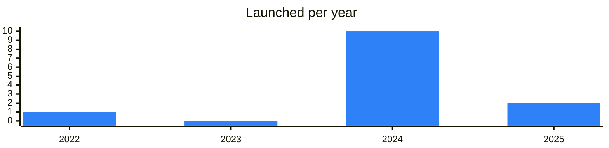

<!-- Generated by scripts/build_readme.py from data/. Do not edit by hand. -->

# Accelerators

**13 projects: 1 active, 12 quiet, 0 closed.** Back to [all categories](../README.md#categories); statuses are explained [here](../README.md#how-to-read-it). The same list as a [searchable table](../data/by-category/accelerators.csv).

## Active

| # | Project | What it is | Links | Launched | Peak MAU | Verified |
| ---: | --- | --- | --- | --- | ---: | --- |
| 1 | **TON Piter Hub** | TON community hub in Saint Petersburg | [Telegram](https://t.me/tonpiter) | 2024-12-14 |  |  |

<b>Quiet: 12</b>

| # | Project | What it is | Links | Launched | Peak MAU | Verified |
| ---: | --- | --- | --- | --- | ---: | --- |
| 2 | **Gaming.tg** |  | [Telegram](https://t.me/tggamingaccelerator) [X](https://x.com/TGAccelerator) [Site](https://www.gaming.tg) | 2024-07-04 |  |  |
| 3 | **Telegram Growth Hub** |  |  | 2024-10-30 |  |  |
| 4 | **TON Accelerator** |  | [Telegram](https://t.me/accelerator_ton) [X](https://x.com/accelerator_ton) | 2024-09-03 |  |  |
| 5 | **TON Europe Hub** | Official TON hub chat for Europe | [Telegram](https://t.me/toneuropechat) | 2024-07-29 |  |  |
| 6 | **TON Funding Assistant** | Official TON grants funding bot | [Bot](https://t.me/tonfunding_bot) | 2022-05-30 |  |  |
| 7 | **TON Nest** |  |  | 2024-08-16 |  |  |
| 8 | **Triangle.tg** |  | [Telegram](https://t.me/triangle_builders) [X](https://x.com/Triangle_web3) [Site](https://triangle.tg) | 2024-07-10 |  |  |
| 9 | **TON Regional Hub** | Official TON community hub for a region | [Telegram](https://t.me/toncishub) | 2024-02-01 |  |  |
| 10 | **TON Regional Hub** | Official TON community hub for a region | [Telegram](https://t.me/tonushub) | 2025-11-17 |  |  |
| 11 | **TON East Asia Hub** | Hub connecting TON builders and founders in East Asia | [Telegram](https://t.me/toneahub) | 2024-04-09 |  |  |
| 12 | **TON Regional Hub** | Official TON community hub for a region | [Telegram](https://t.me/toneuropehub) | 2024-03-18 |  | since 2025-12 |
| 13 | **TON SSEA Hub** | Official TON hub for Southeast Asia fostering local builders | [Telegram](https://t.me/tonsseahub) [X](https://x.com/TONSSEA) | 2025-01-23 |  |  |

