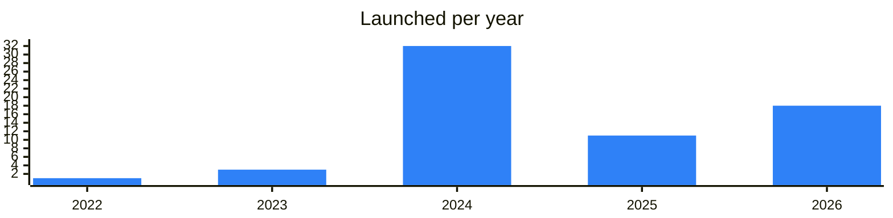

<!-- Generated by scripts/build_readme.py from data/. Do not edit by hand. -->

# AI

**67 projects: 17 active, 49 quiet, 1 closed.** Back to [all categories](../README.md#categories); statuses are explained [here](../README.md#how-to-read-it). The same list as a [searchable table](../data/by-category/ai.csv).

## Active

| # | Project | What it is | Links | Launched | Peak MAU | Verified |
| ---: | --- | --- | --- | --- | ---: | --- |
| 1 | **AI Lab** |  | [Bot](https://t.me/ailab_robot) | 2026-09-08 |  |  |
| 2 | **MOONBERG AI BOT** | MOONBERG AI BOT — AI-powered crypto trading tool | [Telegram](https://t.me/moonbergai) [Bot](https://t.me/moonbergai_bot) [X](https://x.com/moonberg) [Site](https://moonberg.com) [GitHub](https://github.com/Emmet-Finance) [Gram News](https://gramnews.org/apps/moonberg-ai-bot) | 2024-06-27 | 1.3M |  |
| 3 | **Spru** | ИИ, который делает за тебя | [Bot](https://t.me/spru_agent_bot) | 2026-03-30 |  |  |
| 4 | **AgentBook** |  | [Bot](https://t.me/agentbookbot) | 2026-09-03 |  |  |
| 5 | **Reverie** | A mini app for chatting with virtual characters who have their own memory and personalities | [Bot](https://t.me/reverie_ai_bot) [Gram News](https://gramnews.org/apps/reverie) | 2026-08-26 |  |  |
| 6 | **ForU AI** | Proof-based reputation layer for humans and AI agents | [Telegram](https://t.me/foruai_channel) [Site](https://foruai.io) | 2024-09-12 |  |  |
| 7 | **AE _Digital Tech** | AE (AI Energy) powers always-on execution and stability,helping strategies run smarter, safer, and consistently | [Bot](https://t.me/ae_dx_bot) | 2026-05-04 |  |  |
| 8 | **Quant IA** |  | [Bot](https://t.me/thequantaibot) | 2026-06-30 |  |  |
| 9 | **Guardian** | An intelligent group management bot with portal, buy bot and AI features | [Telegram](https://t.me/guardiantrending) [Bot](https://t.me/mevfreeportalbot) | 2022-08-13 | 158K |  |
| 10 | **Bter9 AI 2.5%** | USDT balance to level up your agent and boost your daily income! | [Bot](https://t.me/bter9bot) | 2026-09-05 |  |  |
| 11 | **AmberMarket** | Магазин цифровых товаров в Telegram | [Telegram](https://t.me/ambermarket_official) [Bot](https://t.me/ambermarket_official_bot) | 2026-05-11 |  |  |
| 12 | **Creator. AI Video** | Создавай ии видео и фото в боте или на сайте www.gensta.ai | [Telegram](https://t.me/creator_prompts) [Bot](https://t.me/creator_ai_tech_bot) [Site](https://Gensta.ai) [Gram News](https://gramnews.org/apps/creator_ai_tech_bot) | 2025-03-17 |  |  |
| 13 | **TeleClaw** | Your personal AI agent | [Telegram](https://t.me/teleclawbull) [Bot](https://t.me/claw) | 2026-05-26 |  |  |
| 14 | **Sentism** | Sentism — AI-powered tool for automating DeFi operations | [Telegram](https://t.me/sentismcommunity) [Bot](https://t.me/SentismAIBot) [X](https://x.com/Sentism_ai) [Site](https://sentism.ai) [Gram News](https://gramnews.org/apps/sentism) | 2025-02-17 |  |  |
| 15 | **Gem** | Best AI-bot in Telegram – | [Telegram](https://t.me/GemHQ) [Bot](https://t.me/gembot) [X](https://x.com/GEMofTON) [Site](https://gem.bot) [Gram News](https://gramnews.org/apps/gem) | 2024-05-05 | 112K |  |
| 16 | **Meme Me** | Ready to turn your photos into epic memes? Upload your picture and watch the magic happen | [Bot](https://t.me/mememebot_bot) [Gram News](https://gramnews.org/apps/meme-me) | 2024-09-25 | 6.7M |  |
| 17 | **TON Chat AI** | AI agent site and Telegram bot | [Telegram](https://t.me/bloggersnft) [Site](https://tonchat.ai) | 2024-04-29 |  |  |

<b>Quiet: 49</b>

| # | Project | What it is | Links | Launched | Peak MAU | Verified |
| ---: | --- | --- | --- | --- | ---: | --- |
| 18 | **Cocktail App** | Your endless fantasy | [Bot](https://t.me/cocktailappbot) [Gram News](https://gramnews.org/apps/cocktail-app) | 2024-05 | 63K |  |
| 19 | **HabbitHero** |  | [Bot](https://t.me/habbithero_bot) [Gram News](https://gramnews.org/apps/habbithero) | 2024-05-01 | 19K |  |
| 20 | **GraFun Bot** |  | [Bot](https://t.me/grafunbot) [Gram News](https://gramnews.org/apps/grafun-bot) | 2024-09-03 | 4.8M |  |
| 21 | **PartonaAI App** | Captivating AI character fantasies to explore, imagined by the community | [Telegram](https://t.me/partona_news) [Bot](https://t.me/partona_bot) [Gram News](https://gramnews.org/apps/partonaai-app) | 2024-10-02 | 148K |  |
| 22 | **SWAYE AI** |  | [Bot](https://t.me/swaye_ai_bot) [Gram News](https://gramnews.org/apps/swaye-ai) | 2024-05-29 | 961K |  |
| 23 | **JarvisBot** |  | [Telegram](https://t.me/jarvisbot_official) [Bot](https://t.me/jarvisbot_ai_bot) [X](https://x.com/booinuinfo) [Gram News](https://gramnews.org/apps/jarvisbot) | 2024-06-08 | 361K |  |
| 24 | **MozoAI Bot** | Self-improving Knowledge Hub for AI | [Telegram](https://t.me/ShillGuardOfficial) [Bot](https://t.me/mozoai_bot) [X](https://x.com/Mozo_xyz) [Gram News](https://gramnews.org/apps/mozoai-bot) | 2023-10-16 | 1M |  |
| 25 | **Tearline Bot** | Supercharge your AI agent with clean financial data | [Bot](https://t.me/tearlineai_bot) [Gram News](https://gramnews.org/apps/tearline-bot) | 2024-07-23 | 1.6M |  |
| 26 | **Yoda AI** | Talk with Yoda anytime you want | [Bot](https://t.me/yodabot) [Gram News](https://gramnews.org/apps/yoda-ai) | 2024-06 | 1K |  |
| 27 | **NeronAI** |  | [Telegram](https://t.me/neron_news) [Bot](https://t.me/neronai_bot) [Site](https://neron.ai) [Gram News](https://gramnews.org/apps/neronai) | 2024-01-02 | 192 |  |
| 28 | **NexaBit AI** | L3 AI blockchain powered by Arkham Intelligence and OpenAI | [Telegram](https://t.me/nexabitHQ) [Bot](https://t.me/NexaBit_Tap_bot) [X](https://x.com/nexabitHQ) [Site](https://nexabit.web.app) [Gram News](https://gramnews.org/apps/nexabit-ai) | 2024-05-15 | 39 |  |
| 29 | **Agentz** | AI crusade mini app | [Bot](https://t.me/aiagentz_bot) | 2024-08-11 | 185K |  |
| 30 | **AiTon** | Next Gen Ai Research project AiTon | [Bot](https://t.me/iaiton_bot) | 2026-05-22 |  |  |
| 31 | **Aiya** | Personal AI assistant project | [Bot](https://t.me/aiyaproject_bot) | 2024-03-05 |  |  |
| 32 | **AIYA** | Personal AI assistant with community channel | [Telegram](https://t.me/aiya_community) | 2024-02-05 |  |  |
| 33 | **Alice AI** | Yandex neural network assistant as Telegram bot | [Bot](https://t.me/alisa) | 2026-02-09 |  | since 2026-03 |
| 34 | **Alpha Track ~~ bot** | AI-powered crypto intelligence. Your channels filtered, categorized, delivered. Alpha, not noise TG | [Telegram](https://t.me/alphatrack_ann) [Bot](https://t.me/alphatrack_ai_bot) | 2026-07-15 |  |  |
| 35 | **ChainGPT CIS** | CIS channel of the ChainGPT AI model | [Telegram](https://t.me/chaingpt_cis) | 2023-04-04 |  |  |
| 36 | **CoinCoin.ai** | AI tools and news channel for coding with Codex, ChatGPT and Claude | [Telegram](https://t.me/coincoinai) | 2025-07-08 |  |  |
| 37 | **DecentralGPT** | Decentralized LLM inference network | [Telegram](https://t.me/decentralgpt) | 2024-06-14 |  |  |
| 38 | **Duck Ai App** | Deploy & Manage Ai Agents easily | [Telegram](https://t.me/myduckai) [Bot](https://t.me/teleduckaibot) | 2026-06-03 |  |  |
| 39 | **Fabrika AI** | Platform for building AI agents in Telegram | [Bot](https://t.me/game_nobot) | 2024-09-25 | 1.8M | since 2024-12 |
| 41 | **Fragment Neuro Bot** |  | [Telegram](https://t.me/TeletonApp) [Bot](https://t.me/TeletonOfficialAppBot) [X](https://x.com/teletonapp) [Gram News](https://gramnews.org/apps/fragment-neuro-bot) | 2024-07-29 |  |  |
| 42 | **GMAI** | GMAI — developer tool for Solana dApps with AI integration | [Telegram](https://t.me/gmAI_Ann) [Bot](https://t.me/gmdotaibot) [X](https://x.com/gm_dot_ai) [Site](https://docs.gm.ai/how-we-work/gmai-framework) [Gram News](https://gramnews.org/apps/gmai) | 2024-07-30 | 2.5M |  |
| 43 | **Grok** | xAI language model available as a Telegram bot | [Bot](https://t.me/grokai) | 2024-12-29 | 791K | since 2025-05 |
| 44 | **Husky AI** | All-in-one AI app in Telegram | [Bot](https://t.me/huskysearchbot) | 2024-11-05 | 2K |  |
| 45 | **Kamana AI** | Start your $KAMANA journey and reap the rewards in $TON • TG • Play | [Telegram](https://t.me/kamanaann) [Bot](https://t.me/kamanaai_bot) | 2026-10 | 685 |  |
| 46 | **NEONEXA AI** | Neonexa Network: Web: tonmason.com | [Telegram](https://t.me/tonmasons) [Bot](https://t.me/tonmasonaibot) | 2026-09-04 |  |  |
| 47 | **NEONEXA Network** | NEONEXA AI: Web: tonmason.com | [Telegram](https://t.me/tonmasons_ru) [Bot](https://t.me/masongamebot) | 2025-02-11 | 251K |  |
| 48 | **Neural Networks** |  | [Bot](https://t.me/chatgpt_tgm_bot) Site (down) [GitHub](https://github.com/Stenix777/Neural-network-telegram) [Gram News](https://gramnews.org/apps/neural-networks) | 2023-02-01 |  |  |
| 49 | **Neux** | AI agent mini app for general tasks | [Bot](https://t.me/neuxapp_bot) | 2026-02-18 |  |  |
| 50 | **OLOID X AI** | Официальный бот LLC OLOID X | [Bot](https://t.me/oloidxauth_bot) | 2026-08-09 |  |  |
| 51 | **Omniracle AI Search** | Omniracle AI Search — tool for analyzing fast-moving topics on the internet | [Telegram](https://t.me/omniracle) [Bot](https://t.me/omniracle_bot) [X](https://x.com/omniracle) [Site](https://omniracle.com) [Gram News](https://gramnews.org/apps/omniracle-ai-search) | 2024-06 |  |  |
| 52 | **Plate AI** | Snap. Know. Eat. Your free AI calorie tracker | [Bot](https://t.me/plateaibot) | 2025 |  |  |
| 53 | **Santa AI Agent** | AI web3 agent living inside HOT wallet that gifts users | [Bot](https://t.me/santa_agent_bot) | 2024-12-22 |  |  |
| 54 | **Sentient AI** | Hello mate Ready to connect with the world in a whole new way? | [Bot](https://t.me/sentient_ai_bot) | 2025-03-15 | 50K |  |
| 55 | **SkaldAIbot** | Skald AI is the first GameFi-related AI Agent | [Bot](https://t.me/skaldaiagentbot) |  |  |  |
| 56 | **StoryChain** | Engaging with StoryChain’s AI-based stories, voting on content, and completing tasks | [Bot](https://t.me/storychainbot) | 2024-10-07 | 252K |  |
| 57 | **Ta-da** | The first data-to-earn on Telegram Perform simple tasks and earn $TADA | [Bot](https://t.me/tada_ai_bot) | 2025-01-12 | 149K |  |
| 58 | **Teleton Agents** | Community group for Teleton autonomous AI agents | [Telegram](https://t.me/teletonagenthq) | 2026-02-08 |  |  |
| 59 | **Teleton Agents** | Autonomous AI agents on Telegram with TON integration | [Telegram](https://t.me/teletonagents) | 2025-11-08 |  |  |
| 60 | **TheOpenLayer** | Bot for making AI agents easy and secure to use | [Bot](https://t.me/theopenlayer_bot) | 2024-12-20 |  |  |
| 61 | **Tobi Copilot** | AI-powered web3 assistant bot | [Bot](https://t.me/tobicopilotbot) | 2024-12-18 |  |  |
| 62 | **TonsoAI** | AI powered super app and InfoFi hub on Telegram | [Bot](https://t.me/tonsoaibot) | 2025-12-24 |  |  |
| 63 | **TradeOS** | The AI Decision Engine for Global Markets | [Telegram](https://t.me/tradeos_news) |  |  |  |
| 64 | **XPump.AI** | AI-powered Telegram app | [Bot](https://t.me/xpumpai_bot) | 2024-11-08 | 106K |  |
| 65 | **Olivia AI Network** | Announcements of the Olivia AI network | [Telegram](https://t.me/olivia_ai_network) [X](https://x.com/Olivia_Network) [Site](https://olivianetwork.com) | 2025-03-18 |  |  |
| 66 | **Aiya** | Russian channel of the Aiya AI assistant | [Telegram](https://t.me/aiyaprojectru) | 2024-02-05 |  |  |
| 67 | **Imaginary Ones BubioAI** | Create and chat with AI characters | [Telegram](https://t.me/imaginaryoneshq) | 2025-06-22 |  |  |

<b>Closed: 1</b>

| # | Project | What it is | Links | Launched | Peak MAU | Verified |
| ---: | --- | --- | --- | --- | ---: | --- |
| 40 | **Fragment Checker Bot** |  | [Gram News](https://gramnews.org/apps/fragment-checker-bot) | 2024-09-05 |  |  |

