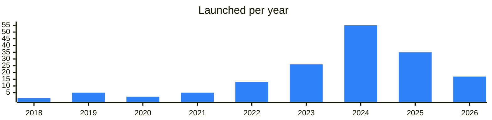

<!-- Generated by scripts/build_readme.py from data/. Do not edit by hand. -->

# Analytics

**166 projects: 34 active, 126 quiet, 6 closed.** Back to [all categories](../README.md#categories); statuses are explained [here](../README.md#how-to-read-it). The same list as a [searchable table](../data/by-category/analytics.csv).

## Active

| # | Project | What it is | Links | Launched | Peak MAU | Verified |
| ---: | --- | --- | --- | --- | ---: | --- |
| 1 | **Lagus research** | Channel covering research, security, smart contracts and blockchains. | [Telegram](https://t.me/lagus_research) | 2025-11-27 |  |  |
| 2 | **Dune** |  | [Site](https://dune.com) | 2024-12-19 |  |  |
| 3 | **CoinGecko** |  | [Site](https://www.coingecko.com) | 2014-03-26 |  |  |
| 4 | **CoinMarketCap** | Crypto data platform with an announcement channel and API resources for developers. | [Telegram](https://t.me/coinmarketcapannouncements) [Site](https://coinmarketcap.com) [GitHub](https://github.com/coinmarketcap-official) | 2013-04-28 |  | since 2022-05 |
| 5 | **DefiLlama** |  | [X](https://x.com/DefiLlama) [Site](https://defillama.com/chain/ton) [Gram News](https://gramnews.org/apps/defillama) | 2022-11-16 |  |  |
| 6 | **DEX Screener** |  | [Site](https://dexscreener.com/ton) | 2021-06-11 |  |  |
| 7 | **Gecko Terminal** |  | [Site](https://www.geckoterminal.com/ton/pools) | 2020-11-08 |  |  |
| 8 | **anton.tools** | Open-source TON blockchain indexer written in Go for developers. | [Telegram](https://t.me/tonindexer) [Site](https://anton.tools) [GitHub](https://github.com/tonindexer) | 2023-03-02 |  |  |
| 9 | **see.tg** |  | [Site](https://see.tg) | 2025-11-26 |  |  |
| 10 | **TGStat** | Analytics service for Telegram channels with a news channel for the project. | [Telegram](https://t.me/tgstat) [Site](https://tgstat.com) | 2017-07-08 |  |  |
| 11 | **New Listings Feed** | Snappiest digital asset listings clearinghouse. WebSocket: Feed in your group: X: x.com/NewListingsFeed Also: Deli | [Telegram](https://t.me/newlistingsfeed) [Bot](https://t.me/newlistingsfeed_bot) [X](https://x.com/NewListingsFeed) [Site](https://newlistings.pro) | 2024-03-16 |  |  |
| 12 | **Gift Alerts** | Bot alerting about new Telegram gifts and showing gift and profile prices. | [Telegram](https://t.me/gift_alerts) [Bot](https://t.me/pricenftbot) | 2024-10-02 | 202K |  |
| 13 | **CryptoWhale** | The official channel for crypto and bitcoin price action, social media analytics, news, and more! | [Telegram](https://t.me/whalebotalerts) [Bot](https://t.me/cryptowhalebot) [X](https://x.com/icebergy) [Gram News](https://gramnews.org/apps/cryptowhale) | 2019-05-27 | 49K |  |
| 14 | **Gift Charts News** | Mini app: Web version: giftcharts.com | [Telegram](https://t.me/gift_charts) [Bot](https://t.me/gift_charts_bot) [Site](https://giftcharts.com) | 2024-05-21 | 36K |  |
| 15 | **TrustaTONApp_bot** | AI service for on-chain identity and reputation | [Telegram](https://t.me/TrustalabsAnn) [Bot](https://t.me/trustatonapp_bot) [X](https://x.com/TrustaLabs) [Site](https://trustalabs.ai) [GitHub](https://github.com/mir-one/fingerprints) [Gram News](https://gramnews.org/apps/trustatonapp_bot) | 2022-03-24 | 214K |  |
| 16 | **SCANNER MESSAGE** | The best tools for blockchain analysis and cryptocurrency arbitrage! | [Telegram](https://t.me/arbitragescanner_eng) [Bot](https://t.me/m8tel_bot) [X](https://x.com/arbitragescan) [Site](https://arbitragescanner.io) [Gram News](https://gramnews.org/apps/scanner-message) | 2024-02-28 | 13K |  |
| 17 | **Username Price** | Every @ username has a price. Instant appraisal — rarity, demand, real Fragment sales. News & updates | [Telegram](https://t.me/userrate_news) [Bot](https://t.me/userrate_bot) | 2025-06-19 |  |  |
| 18 | **Raidar** | Bridging the trenches between X and Telegram | [Telegram](https://t.me/raidartrending) [Bot](https://t.me/raidarrobot) | 2025-01-12 | 125K |  |
| 19 | **PIRBView** | PIRBView – The Ultimate Token Scanner! Supports sol,ton,base,eth,bsc and many others. Dev | [Bot](https://t.me/pirbviewbot) | 2023-10-26 |  |  |
| 20 | **Callers Radar** | Disclaimer We are not responsible for any callers added here. Always do your own research before engaging with anyone. Full DYOR. NFA. Interesting ADS? -> By | [Telegram](https://t.me/callsradarton) [Bot](https://t.me/callsradarton_bot) | 2026-05-26 |  |  |
| 21 | **IrisApp** | IrisApp — AI-powered crypto market analytics app | [Telegram](https://t.me/iris_ecosystem) [Bot](https://t.me/iristoken_bot) [X](https://x.com/Iris_token) [Site](https://iristoken.io/) [Gram News](https://gramnews.org/apps/irisapp) | 2021-12-24 |  |  |
| 22 | **see.tg** | Analytics, tracking and search for NFT gifts and their owners. Web(pc) version: see.tg | [Telegram](https://t.me/seetg) [Bot](https://t.me/seetgbot) | 2025-12-18 |  |  |
| 23 | **SpyDefi Bot** | The Bot powering the dynamic feed of - home of DeFi analytics | [Telegram](https://t.me/spydefi) [Bot](https://t.me/spydefi_bot) | 2023-09-15 |  |  |
| 24 | **xGift** | xGift — your #1 data aggregator for TG gifts | [Telegram](https://t.me/xgift) [Bot](https://t.me/xgift_official_bot) | 2026-07-04 | 35K |  |
| 25 | **CoinStats** | Your go-to platform to track and manage your crypto, DeFi and NFTs | [Telegram](https://t.me/coinstats_news) [X](https://x.com/coinstats) [Site](https://coinstats.app/) [Gram News](https://gramnews.org/apps/coinstats) | 2021-11-25 |  |  |
| 26 | **Gift Inspector** | Telegram gift price lookup and wiki links | [Telegram](https://t.me/giftinspector) | 2025-04-14 |  |  |
| 27 | **GiftAsset** | Telegram gifts data center with a public API | [Telegram](https://t.me/giftassetapi) [GitHub](https://github.com/GIFT-ASSET) | 2025-07-31 |  |  |
| 28 | **Ton Inu BuyBot Tracker** | Tracker of whale buys for the TINU token | [Telegram](https://t.me/toninubuybottracker) | 2024-11-30 |  |  |
| 29 | **NoName Trending** | Big buys among the tokens tracked by the by | [Telegram](https://t.me/nonametrending) [Bot](https://t.me/buynnbot) | 2026-03-28 |  |  |
| 30 | **Changerella** | Changerella — cryptocurrency swap monitor with live rates and user reviews | [Telegram](https://t.me/changerella) [Bot](https://t.me/changerella_bot) [X](https://x.com/Changerella_com) [Site](https://changerella.com/) [Gram News](https://gramnews.org/apps/changerella) | 2024-05-05 | 239 |  |
| 31 | **Numbers 888** | Telegram Anonymous Numbers Price Chart and Historical Data | [Telegram](https://t.me/nums888) [Bot](https://t.me/nums888bot) [Site](https://nums888.io) [Gram News](https://gramnews.org/apps/numbers-888) | 2023-05-21 |  |  |
| 32 | **TON TRENDING BOT** |  | [Telegram](https://t.me/tontrending_LIVE_TON) [Bot](https://t.me/InsectTonBuyBot) Site (down) [Gram News](https://gramnews.org/apps/ton-trending-bot) | 2025-04-06 |  |  |
| 33 | **CoinCodex** |  | [Bot](https://t.me/toncoin_airdrop_eng_bot) [Site](https://coincodex.com/crypto/toncoin/) [GitHub](https://github.com/newton-blockchain) [Gram News](https://gramnews.org/apps/coincodex) | 2018-05-04 |  |  |
| 34 | **RUG Police** | Blockchain analytics tools and data provider | [Telegram](https://t.me/rugpolicenews) [X](https://x.com/RUGP_TON) [Site](https://rugp.io) | 2024-06-23 |  |  |

<b>Quiet: 126</b>

| # | Project | What it is | Links | Launched | Peak MAU | Verified |
| ---: | --- | --- | --- | --- | ---: | --- |
| 35 | **TON Price** | Must-have channel for everybody in the TON community! Current TON price is always on top of your chat list. Price gets updated once every 5 minutes. Easily forward price to your friends and clients! | [Telegram](https://t.me/tonprices) [Bot](https://t.me/tonpricesbot) | 2021-12-15 |  |  |
| 36 | **TypoCurator** |  | [Telegram](https://t.me/TypoCurator) [Bot](https://t.me/typocurator_bot) [X](https://x.com/TypoX_AI) [Gram News](https://gramnews.org/apps/typocurator) | 2024-06-14 | 48K |  |
| 37 | **Portfel** | The most powerful TON portfolio tracker | [Telegram](https://t.me/ton_portfel) [Bot](https://t.me/ton_portfel_bot) [X](https://x.com/Nikicompany) [Site](https://portfel.me) [GitHub](https://github.com/portfel-ton) [Gram News](https://gramnews.org/apps/portfel) | 2024-05-30 | 21K |  |
| 38 | **TON Tools Bot** | TON Tools Bot — price change monitoring for TON | [Bot](https://t.me/sbabet_tools_bot) [X](https://x.com/SnoopyBabe_meme) Site (down) [Gram News](https://gramnews.org/apps/ton-tools-bot) | 2024-03-31 | 16K |  |
| 39 | **Crypton research** | Crypton research: tools and calendar of crypto events | [Telegram](https://t.me/crypton_support) [Bot](https://t.me/crypton_research_bot) [X](https://x.com/CryptonCalendar) [Site](https://crypton.xyz/ru/) [Gram News](https://gramnews.org/apps/crypton-research) | 2022-02-12 | 55K |  |
| 40 | **RectCoinBot** |  | [Bot](https://t.me/rectcoinbot) [Gram News](https://gramnews.org/apps/rectcoinbot) | 2024-06-26 | 711K |  |
| 41 | **Time Price** |  | [Bot](https://t.me/timeprice_stat_bot) [Gram News](https://gramnews.org/apps/time-price) | 2024-08-20 | 85K |  |
| 42 | **SunKong Bot** |  | [Bot](https://t.me/sunkongmyth_bot) [Site](https://zjor.github.io/cv/) [GitHub](https://github.com/zjor/hello-tact) [Gram News](https://gramnews.org/apps/sunkong-bot) | 2023-09-21 | 994K |  |
| 43 | **Hare** |  | [Bot](https://t.me/hare_ton_bot) [Gram News](https://gramnews.org/apps/hare) | 2024-06-06 | 1.1M |  |
| 44 | **T-Plane** |  | [Bot](https://t.me/tplane_bot) [Gram News](https://gramnews.org/apps/t-plane) | 2024-07-04 | 474K |  |
| 45 | **Walbi** | Get an explanation of the cryptocurrency market | [Bot](https://t.me/walbi_ala_bot) [Gram News](https://gramnews.org/apps/walbi) | 2022-11-24 | 227K |  |
| 46 | **Vana Data Hero** |  | [Bot](https://t.me/vanadataherobot) [Gram News](https://gramnews.org/apps/vana-data-hero) | 2024-04-16 | 932K |  |
| 47 | **iCryptoAI** | iCrypto / Sentiment & On-chain Analysis | [Telegram](https://t.me/icryptoai) [Bot](https://t.me/icryptoaibot) [Gram News](https://gramnews.org/apps/icryptoai) | 2023-08-14 | 10K |  |
| 48 | **Tearline Bot** | Supercharge your AI agent with clean financial data | [Bot](https://t.me/tearlineai_bot) [Gram News](https://gramnews.org/apps/tearline-bot) | 2024-07-23 | 1.6M |  |
| 49 | **Blockchain Whispers Bot** | Crypto signals. Portfolio. Price Alerts. Your crypto Swiss-army Knife, powered by Blockchain Whispers | [Bot](https://t.me/blockchainwhispers_bot) [Gram News](https://gramnews.org/apps/blockchain-whispers-bot) | 2024-05-18 | 13K |  |
| 50 | **TON Wallet Tracker** | Track any wallet activity, such as just moving TONs, moving tokens, or NFTs to any address | [Bot](https://t.me/tontracker_bot) [Gram News](https://gramnews.org/apps/ton-wallet-tracker) | 2023-01-14 | 7K |  |
| 51 | **TbearBot** | What can this bot to to ? | [Bot](https://t.me/tbeargame_bot) [Gram News](https://gramnews.org/apps/tbearbot) | 2024-05-17 | 2K |  |
| 52 | **Nimbus** |  | [X](https://x.com/get_nimbus) [Site](https://getnimbus.io) [Gram News](https://gramnews.org/apps/nimbus) | 2024-03-03 |  |  |
| 53 | **TON Notify Bot** | Instant notifications about transfer coins of the TON address | [Bot](https://t.me/tonnotifybot) [Gram News](https://gramnews.org/apps/ton-notify-bot-2) | 2019-08-15 | 1K |  |
| 54 | **Whale Detect** | Bot detecting large transactions in BTC, ETH, TON and other networks. | [Telegram](https://t.me/TopTgDima) [Bot](https://t.me/whaledetectbot) [Gram News](https://gramnews.org/apps/whale-detect) | 2022-05-03 | 676 |  |
| 55 | **WhaleBrain Bot** |  | [Bot](https://t.me/whalebrain_bot) [Gram News](https://gramnews.org/apps/whalebrain-bot) | 2024-05-08 | 538 |  |
| 56 | **The TON Top** | Show your status. The more TON — the higher you stay in the Top | [Bot](https://t.me/thetontopbot) [Gram News](https://gramnews.org/apps/the-ton-top) | 2024-06 | 155 |  |
| 57 | **AdBuy** | Alert feed for new token and liquidity pool deploys on TON. | [Telegram](https://t.me/Crypton_Deploys) [Gram News](https://gramnews.org/apps/adbuy) | 2024-01-08 |  |  |
| 58 | **Alert Price TON** |  | [Telegram](https://t.me/TokenInfinity) [Bot](https://t.me/AlertPriceTonBot) [Gram News](https://gramnews.org/apps/alert-price-ton) | 2023-07-30 |  |  |
| 59 | **Alpha Track ~~ bot** | AI-powered crypto intelligence. Your channels filtered, categorized, delivered. Alpha, not noise TG | [Telegram](https://t.me/alphatrack_ann) [Bot](https://t.me/alphatrack_ai_bot) | 2026-07-15 |  |  |
| 60 | **AnalytEx** | Bot for analytics services in Telegram | [Bot](https://t.me/analytex_bot) | 2022-08-05 |  |  |
| 61 | **Anonymous Numbers Market Analytics** | Fragment market statistics | [GitHub](https://github.com/qpwedev/anonymous-numbers-market-analytics) | 2023-06-12 |  |  |
| 62 | **AppChain** | Bot to explore the TON ecosystem and receive price alerts | [Bot](https://t.me/appchainbot) | 2022-09-08 |  |  |
| 63 | **ArzDigital** | Set Market Alerts & Explore in Crypto Join Arzdigital | [Bot](https://t.me/arzdigitalcom_bot) | 2024-09-22 |  |  |
| 64 | **Assets Portfolio** | Tracks all TON wallet and app assets in one place | [Bot](https://t.me/dassets_bot) | 2025-01-23 | 14K |  |
| 65 | **Block Watch** | Block Watch — transaction analysis tool for wallets | [Telegram](https://t.me/BLWDev_bot) [X](https://x.com/blockwatchdev) [Site](https://blockwatch.tech) [Gram News](https://gramnews.org/apps/block-watch) | 2026-05-29 |  |  |
| 66 | **Blockchain Network Visualizer** | Network visualization tool | [GitHub](https://github.com/qpwedev/blockchain-network-visualizer) | 2022-12-31 |  |  |
| 67 | **Bubblemaps** | Blockchain analysis visualization tool | [Telegram](https://t.me/bubblemaps) | 2022-07-11 |  |  |
| 68 | **CAIHawk Signals** | Precision LONG signals SMC • Elliott Wave • TA 14-Day Free Trial Live Proofs | [Bot](https://t.me/caihawk_signals_bot) [Site](https://signals.caihawk.com) | 2026-04-09 |  |  |
| 69 | **Chaser** | Tracks TON jettons, NFTs and pools of a wallet | [Bot](https://t.me/ton_chaser_bot) | 2024-06-08 |  |  |
| 70 | **Check My Gifts** | Bot to analyze and track Telegram gift portfolios | [Bot](https://t.me/checkmygifts_bot) | 2023-05-07 |  |  |
| 71 | **Cielo Free Bot 1** | Track wallets on Solana, EVM, Tron, Sui + BTC | [Bot](https://t.me/evmtrackerbot) [Gram News](https://gramnews.org/apps/cielo-free-bot-1) | 2023-10-12 | 36K |  |
| 72 | **Club10k Tracker** | Tracks changes in four-digit TON DNS domains | [Bot](https://t.me/fourlstatsbot) | 2026-02-27 |  |  |
| 73 | **CoinCrackerBot** |  | [Gram News](https://gramnews.org/apps/coincrackerbot) | 2023-04 |  |  |
| 74 | **CoinMapAi** | Crypto market data and alerts app | [Bot](https://t.me/coinmapai_bot) | 2024-11-09 | 26K |  |
| 75 | **CoinRobot** |  | [GitHub](https://github.com/sora-xor/polkaswap-exchange-web) [Gram News](https://gramnews.org/apps/coinrobot) | 2020-09-17 |  |  |
| 76 | **CryptoRiskyGameCalls** |  | [Bot](https://t.me/vukly_bot) [Gram News](https://gramnews.org/apps/cryptoriskygamecalls) | 2024-06 |  |  |
| 77 | **DashPool** | Your easiest gateway to the complex AI market, right in Telegram! | [Bot](https://t.me/dashpoolbot) [X](https://x.com/dashpoolapp) Site (down) [Gram News](https://gramnews.org/apps/dashpool) | 2024-12-11 |  |  |
| 78 | **DexCheck** | AI-powered analytics and on-chain data tools | [Telegram](https://t.me/dexcheck) | 2023-04-22 |  |  |
| 79 | **dTON Forum** | Analytical system based on TON on-chain data | [Telegram](https://t.me/dtonforum) Site (down) | 2023-12-19 |  |  |
| 80 | **Eye of Gifts** | Bot that finds Telegram gifts by chosen parameters | [Bot](https://t.me/eyeofgifts_bot) | 2025-03-02 |  |  |
| 81 | **Eye of TON** | Bot of the Eye of TON channel | [Bot](https://t.me/istoneyebot) | 2025-03-27 |  |  |
| 82 | **Fragment Floor** | Bot showing floor rate from Fragment | [Bot](https://t.me/fragmentcom_floor_bot) | 2023-05-22 |  |  |
| 83 | **Full Metal Jetton** |  | [Gram News](https://gramnews.org/apps/full-metal-jetton) | 2023-09-05 |  |  |
| 84 | **Gift Alert Bot** | Notifications about Telegram gifts | [Bot](https://t.me/nftgiftalertbot) | 2025-01-29 |  |  |
| 85 | **Gift Caller** | Bot that calls when new Telegram gifts are released | [Bot](https://t.me/giftscallbot) | 2025-07-25 |  |  |
| 86 | **Gift Explore** | Price history and search for Telegram gifts | [Bot](https://t.me/giftexplorebot) | 2025-04-27 | 1K |  |
| 87 | **Gift Explorer** | Bot for Telegram gift price history and search | [Bot](https://t.me/tgiftcheckbot) | 2025-04-24 |  |  |
| 88 | **Gift Metric** | Discover the total value of Telegram Gifts owned by your audience | [Bot](https://t.me/giftmetricbot) | 2026-08-15 |  |  |
| 89 | **Gift Wiki Bot** | Telegram app cataloguing over 1500 gift collections with a virtual fitting room. | [Telegram](https://t.me/giftwiki) [Bot](https://t.me/giftwiki_bot) | 2025-03-11 |  |  |
| 90 | **Giftindex** |  | [Bot](https://t.me/giftindexbot) | 2025-06-17 |  |  |
| 91 | **Gifts Floor Calculator** | Bot that values a profile gift list by floor price | [Bot](https://t.me/giftsfloorbot) | 2025-01-26 |  |  |
| 92 | **Giftstat.com** |  | [Bot](https://t.me/giftstatcom_bot) | 2025-07 |  |  |
| 93 | **indicaton** |  | [Telegram](https://t.me/indicaton) [X](https://x.com/indicaton) [Site](https://indicaton.io/?utm_source=ton_app) [Gram News](https://gramnews.org/apps/indicaton) | 2024-01 |  |  |
| 94 | **JETPie** | Bot with data on TON jettons | [Bot](https://t.me/jetpiebot) | 2024-05-31 |  |  |
| 95 | **Jetton Whale Swaps** |  | [Telegram](https://t.me/MoonWeb3) [Bot](https://t.me/NFTRobot) [Gram News](https://gramnews.org/apps/jetton-whale-swaps) | 2023-07-05 |  |  |
| 96 | **Jettons Price Alerts** |  | [Gram News](https://gramnews.org/apps/jettons-price-alerts) | 2025-11-28 |  |  |
| 97 | **Journalinvest** |  | [Gram News](https://gramnews.org/apps/journalinvest) | 2025-10-01 |  |  |
| 98 | **Lambdo Tracking** |  | [Telegram](https://t.me/lambdo_tnt) [Bot](https://t.me/lambdotracking_bot) | 2026-07-21 |  |  |
| 99 | **Live Price TonCoin** |  | [Site](https://fan-ton.com/) [Gram News](https://gramnews.org/apps/live-price-toncoin) | 2024-06-03 |  |  |
| 100 | **M3TA** | Just Web3 data made simple, enabled by AI | [Telegram](https://t.me/m3ta_analytics) [X](https://x.com/M3TA_Analytics) | 2021-11-09 |  |  |
| 101 | **MAZITON** | Buy tracking bot for TON tokens | [Bot](https://t.me/mazitonbot) | 2025-04-18 |  |  |
| 102 | **MemeGuard** | Bot with real-time token performance and risk insights | [Bot](https://t.me/meme_guard_bot) | 2024-12-20 |  |  |
| 103 | **NFT Scanner** | NFT Scanner — blockchain analysis and arbitrage opportunities tool | [Bot](https://t.me/Arbitragescanner_official) [X](https://x.com/ArbitrageScan) [Site](https://arbitragescanner.io/) [Gram News](https://gramnews.org/apps/nft-scanner) | 2023-05-10 |  |  |
| 104 | **NoName Scanner** | Scan TON tokens and stickers by | [Bot](https://t.me/scannernnbot) | 2026-08-16 |  |  |
| 105 | **NoName Tracker** | Fast, flexible, user-friendly TON tracker by | [Telegram](https://t.me/nonamedev) [Bot](https://t.me/trackernnbot) | 2026-04-04 |  |  |
| 106 | **Ping** | Bot that tracks gift markets and sends notifications | [Bot](https://t.me/giftsnotificationrobot) | 2025-06-30 |  |  |
| 107 | **Pixel Stat** | Statistics bot for Pixel World game | [Bot](https://t.me/pixelstat_bot) | 2026-02-14 |  |  |
| 108 | **Quop** | Telegram gifts analytics service | [Bot](https://t.me/quoptgbot) | 2026-02-28 |  |  |
| 109 | **Spek Hub** | Leaderboard and vault tracking platform | [Bot](https://t.me/spekhubbot) | 2025-12-11 |  |  |
| 110 | **Spy** | Explore NFT data easily — track wallets, floor prices & ownership. Stay updated on . Powered by | [Bot](https://t.me/spyggbot) | 2025-03-22 |  |  |
| 111 | **Spybox** | Twitter follow and buy alerts for Telegram groups | [Telegram](https://t.me/spyboxofficial) | 2024-11-02 |  |  |
| 112 | **Spybox for Groups** | Follow and buy alerts for Telegram groups | [Bot](https://t.me/spyboxgroupsbot) | 2024-11-02 |  |  |
| 113 | **SpyDefi BuyBot** | Buy alert bot for token projects | [Bot](https://t.me/chat_boost) | 2024-01-06 |  |  |
| 114 | **Sticker Scan** | Sticker and NFT scanning app for Telegram | [Bot](https://t.me/sticker_scan_bot) | 2025-06-28 |  |  |
| 115 | **Stickers Tools** | Telegram app and web tools for stickers | [Telegram](https://t.me/stickers_tools) [Bot](https://t.me/stickers_tools_bot) | 2025-07-22 |  |  |
| 116 | **Swaps** | Chat for Swaps alerts and bot | [Telegram](https://t.me/swapsforum) | 2023-06-08 |  |  |
| 117 | **TBC** | TONBANKCARD - Ecosystem for cryptocurrencies | [Bot](https://t.me/marketcaprobot) [Site](https://marketcap.tonbankcard.com) [Gram News](https://gramnews.org/apps/tbc-client) | 2022-10-08 |  |  |
| 118 | **TBC TVL TON** | TBC TVL TON — analytics tool for tracking total value locked in DeFi on the TON network | [Bot](https://t.me/tonbankcard_bot) [Site](https://tonbankcard.com/tvlton.htm) [Gram News](https://gramnews.org/apps/tbc-tvl-ton) | 2022-10-08 |  |  |
| 119 | **TOKEN INSIDE** |  | [Gram News](https://gramnews.org/apps/token-inside) | 2026-04-21 |  |  |
| 120 | **TON Data Hub** | TON Foundation data and Dune dashboards hub | [Telegram](https://t.me/tondatahub) | 2025-02-26 |  |  |
| 121 | **TON Data Hub** | Chat of the TON Data Hub data project | [Telegram](https://t.me/tondatachat) | 2025-03-12 |  |  |
| 122 | **TON Grafana** | Blockchain metrics visualization | [Site](https://tonmon.xyz/) | 2019-12-25 |  |  |
| 123 | **Ton Inu Scanner** | TON blockchain scanner for token analysis | [Bot](https://t.me/TonChainScannerBot) [X](https://x.com/toninutools) [Site](https://toninu.tech/) [Gram News](https://gramnews.org/apps/ton-inu-scanner) | 2024-03-24 |  |  |
| 124 | **TON INU Tracker** | TON INU Tracker — analytics for the TINU token on the TON network | [Bot](https://t.me/toninu_trackerbot) [X](https://x.com/toninutools) [Site](https://toninu.tech/) [Gram News](https://gramnews.org/apps/ton-inu-tracker) | 2024-04-10 |  |  |
| 125 | **TON Jetton Analytics** | Alerts bot for TON jettons | [Bot](https://t.me/dyorninjabot) | 2024-02-12 |  |  |
| 126 | **Ton Mafia Plays** |  | [X](https://x.com/TonMafiaPlays) [Gram News](https://gramnews.org/apps/ton-mafia-plays) | 2024-05 |  |  |
| 127 | **TON Notify Bot** |  | [GitHub](https://github.com/CoinSpace/CoinSpace) [Gram News](https://gramnews.org/apps/ton-notify-bot) | 2015-03-30 |  |  |
| 128 | **TON Price Converter** |  | [Site](https://coinrecast.com/) [Gram News](https://gramnews.org/apps/ton-price-converter) | 2023-04 |  |  |
| 129 | **Ton Research** | Bot providing real-time TON data. | [Bot](https://t.me/tondatabot) Site (down) [GitHub](https://github.com/flutter-bees) [Gram News](https://gramnews.org/apps/ton-research) | 2024-10-07 | 537 |  |
| 130 | **TON Researcher** | Bot for researching wallet activity on TON | [Bot](https://t.me/ton_researcher_bot) | 2024-05-26 |  |  |
| 131 | **TON Status Notifications** | Automatic alerts about penalties for underperforming TON validators | [Telegram](https://t.me/tonstatus_notifications) | 2024-09-10 |  |  |
| 132 | **TON Tracker** | Bot for tracking wallet activity on TON | [Bot](https://t.me/ton_activity_bot) | 2024-05-26 |  |  |
| 133 | **Toncoin Converter** |  | [Gram News](https://gramnews.org/apps/toncoin-converter) | 2015-06-11 |  |  |
| 134 | **Tonk Analyser** | Tonk analyser is powered by $TONK INU | [Bot](https://t.me/tonkanalyser_bot) [X](https://x.com/tonkinubot) [GitHub](https://github.com/TonkInu) | 2026-07-01 | 2K |  |
| 135 | **Tonmarketcap** | Stay on top of the TON ecosystem with live prices, market caps, charts, and rankings — all inside Telegram | [Telegram](https://t.me/tonmarketcap_channel) [Bot](https://t.me/ton_market_cap_bot) [Site](https://tonmarketcap.ru) [Gram News](https://gramnews.org/apps/tonmarketcap) | 2024-12-12 |  |  |
| 136 | **Tonometer** |  | [Gram News](https://gramnews.org/apps/tonometer) | 2022-10-27 |  |  |
| 137 | **TonScore** | Bot proving an account is not a sybil | [Bot](https://t.me/tonscoretrack_bot) | 2024-12-20 |  |  |
| 138 | **TonSonar** | TonSonar Telegram bot: smart-money alerts and new TON jetton listings | [Bot](https://t.me/tonsonar_bot) [Site](https://ozamotailov.github.io/alphaping/) [GitHub](https://github.com/ozamotailov/alphaping) [Gram News](https://gramnews.org/apps/tonsonar) | 2026-06-10 |  |  |
| 139 | **TOTKIT** | News, signals, statistics, analysis and reviews of NFT collections on The Open Network | [Bot](https://t.me/totkitbot) Site (down) [GitHub](https://github.com/BradDev01) [Gram News](https://gramnews.org/apps/totkit) | 2022-12-08 |  |  |
| 140 | **Tracker TON** |  | [Telegram](https://t.me/TokenInfinity) [Bot](https://t.me/TrackerTonBot) [Gram News](https://gramnews.org/apps/tracker-ton) | 2023-07-30 |  |  |
| 141 | **TradeOS** | The AI Decision Engine for Global Markets | [Telegram](https://t.me/tradeos_news) |  |  |  |
| 142 | **UserCoin App** | UserCoin can evaluate the value of your username based on data from the Fragment | [Bot](https://t.me/crypto_iq_bot) [Gram News](https://gramnews.org/apps/usercoin-app) | 2024-08-21 | 77K |  |
| 143 | **Wallet Analysis** | Arbitrage bot and analytics for cryptocurrencies | [X](https://x.com/ArbitrageScan) [Site](https://arbitragescanner.io/) [Gram News](https://gramnews.org/apps/wallet-analysis) | 2019-12-18 |  |  |
| 144 | **Wallets Live** | Cryptocurrency arbitrage opportunity analytics | [Bot](https://t.me/wallets_live_bot) [X](https://x.com/ArbitrageScan) [Site](https://arbitragescanner.io/) [Gram News](https://gramnews.org/apps/wallets-live) | 2019-12-18 |  |  |
| 145 | **Xtontracker** | This group for discussing and resolving issues for xtontracker.com service | [Telegram](https://t.me/xtontracker) | 2024-03-12 |  |  |
| 146 | **Yieldo** | Compare staking rates, withdrawal fees, and P2P prices across top crypto exchanges in one place. Dev | [Bot](https://t.me/YieldoBot) [Site](https://yieldo.me/) [Gram News](https://gramnews.org/apps/yieldo) | 2026-01-17 |  |  |
| 147 | **Тонус** |  | [Bot](https://t.me/brainscoin_bot) [Gram News](https://gramnews.org/apps/tonus) | 2025-04-11 | 166K |  |
| 148 | **Maziton Trending** | Trending token board for TON | [Telegram](https://t.me/mazitontrending) | 2024-05-19 |  |  |
| 149 | **Eye of TON** | TON news, bot and API tools | [Telegram](https://t.me/eye_of_ton) | 2024-11-18 |  |  |
| 150 | **Gift Peek** | Telegram gift tracking tool from the MRKT ecosystem | [Telegram](https://t.me/peektg) [Bot](https://t.me/peektgbot) [Site](https://peek.tg) | 2025-10-31 |  |  |
| 151 | **Tonkol** | Know what KOLs are buying on TON | [Telegram](https://t.me/tonkolpro) [X](https://x.com/Toncoinkol) [Site](https://tonkol.pro/) [Gram News](https://gramnews.org/apps/tonkol) | 2025-11-06 |  |  |
| 152 | **Giftable** | Analytics and price table for Telegram gifts | [Telegram](https://t.me/giftable_community) | 2025-06-05 |  |  |
| 153 | **Gift Monitor** | Real-time tracking of Telegram gift floor prices | [Telegram](https://t.me/giftmonitor) | 2025-02-16 |  |  |
| 154 | **apiTON** | channel: / ws: apiton.org | [Telegram](https://t.me/apiton) [Bot](https://t.me/apitonBot) [Site](https://apiton.org/) [GitHub](https://github.com/apiton-org) [Gram News](https://gramnews.org/apps/apiton) | 2024-03-29 |  |  |
| 155 | **ShillGuard** | Bot for DeFi analysis, trends and trading signals. | [Telegram](https://t.me/ShillGuardOfficialAnnouncements) [Bot](https://t.me/ShillGuardAppBot) [X](https://x.com/ShillGuard) [Site](https://shillguard.com/) [Gram News](https://gramnews.org/apps/shillguard) | 2025-04-09 |  |  |
| 156 | **Tonalytics** | Analytics app and bot for TON | [Telegram](https://t.me/tonalyticsapp) [Bot](https://t.me/tonalytics_bot) | 2024-06-03 | 156K |  |
| 157 | **Watcher** | Watcher: Fast and accurate full tracking of TON wallets. News channel | [Telegram](https://t.me/watcher_news) [Bot](https://t.me/watcher_robot) [Gram News](https://gramnews.org/apps/watcher) | 2024-03-04 |  |  |
| 158 | **Jetton Price Alerts** | Price alerts for TON jettons | [Telegram](https://t.me/jettoncap) | 2023-03-09 |  |  |
| 159 | **re:doubt Jetton Alerts** | Jetton prices, volumes and alerts feed | [Telegram](https://t.me/jettonalertsbot) | 2023-03-02 |  |  |
| 160 | **Jetton Rates** | Latest rates of TON jettons from the chain | [Telegram](https://t.me/tonnull) | 2023-01-19 |  |  |

<b>Closed: 6</b>

| # | Project | What it is | Links | Launched | Peak MAU | Verified |
| ---: | --- | --- | --- | --- | ---: | --- |
| 161 | **TonRadar** | Radar app for TON projects with a channel and website. | [Telegram](https://t.me/TonRadarAdmin) [Bot](https://t.me/tonradarappbot) [X](https://x.com/tonradarapp) [Site](https://tonradar.app) [GitHub](https://github.com/tonradar) | 2023-04-25 | 5K |  |
| 162 | **Uniton** |  | [Bot](https://t.me/UnitonAIBot) [X](https://x.com/UnitonAI) [Site](https://www.uniton.ai) | 2024-03-09 | 94K |  |
| 163 | **Mooli** |  | Site (down) [Gram News](https://gramnews.org/apps/mooli) | 2016-06-11 |  |  |
| 164 | **POLYTEND DIGEST** |  | [Gram News](https://gramnews.org/apps/polytend-digest) | 2024-05 |  |  |
| 165 | **TON burnt** |  | [Gram News](https://gramnews.org/apps/ton-burnt) | 2023-04 |  |  |
| 166 | **TonDomenBot** |  | [Gram News](https://gramnews.org/apps/tondomenbot) | 2024-01 |  |  |

