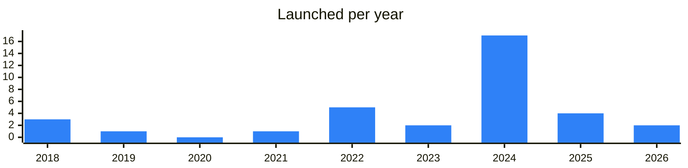

<!-- Generated by scripts/build_readme.py from data/. Do not edit by hand. -->

# Security

**38 projects: 10 active, 28 quiet, 0 closed.** Back to [all categories](../README.md#categories); statuses are explained [here](../README.md#how-to-read-it). The same list as a [searchable table](../data/by-category/audit.csv).

## Active

| # | Project | What it is | Links | Launched | Peak MAU | Verified |
| ---: | --- | --- | --- | --- | ---: | --- |
| 1 |  **Hacken** | Hacken — blockchain security and compliance audit and consulting firm | [Telegram](https://t.me/hackenai) [Bot](https://t.me/kostiantyn_hacken) [X](https://x.com/hackenclub) [Site](https://hacken.io/) [GitHub](https://github.com/hknio) [Gram News](https://gramnews.org/apps/hacken) | 2025-03-14 |  | since 2023-06 |
| 2 |  **CertiK** | This is the only official channel for CertiK | [Telegram](https://t.me/certikcommunity) [X](https://x.com/CertiK) [Site](https://www.certik.com) [GitHub](https://github.com/CertiKProject) [Gram News](https://gramnews.org/apps/certik) | 2022-04-12 |  |  |
| 3 | **SlowMist** |  | [X](https://x.com/SlowMist_Team) [Site](https://www.slowmist.com) [GitHub](https://github.com/slowmist) [Gram News](https://gramnews.org/apps/slowmist) | 2018-04-23 |  |  |
| 4 | **Trail of Bits** |  | [Site](https://www.trailofbits.com) | 2008-05-08 |  |  |
| 5 | **Quantstamp** |  | [Site](https://quantstamp.com) | 2017-07-21 |  |  |
| 6 |  **HackenProof** | HackenProof is a bug bounty platform for crypto business and hackers | [Telegram](https://t.me/hackenproof) [X](https://x.com/HackenProof) [Site](https://hackenproof.com/) [GitHub](https://github.com/hackenproof) [Gram News](https://gramnews.org/apps/hackenproof) | 2023-05-29 |  |  |
| 7 |  **Chainalysis** | Building trust in blockchains among people, businesses, and governments | [Telegram](https://t.me/chainalysisinc) [GitHub](https://github.com/chainalysis) | 2022-11-14 |  |  |
| 8 |  **Tonguard** | TON Guard is the first cloud-based solution for the TON blockchain, leveraging AI-driven tools to analyze wallets and transactions | [Telegram](https://t.me/tonguardaml) [Bot](https://t.me/tonguard_bot) [Site](https://tonguard.org/) [Gram News](https://gramnews.org/apps/tonguard) | 2024-05-16 |  |  |
| 9 |  **GID Anti-Scam** | Anti-scam project in Telegram with a scammer database and a form to file reports. | [Telegram](https://t.me/gid_scambase) [Bot](https://t.me/gidbanbot) | 2024-02-24 | 56K |  |
| 10 |  **Nowarp** | nowarp.io / github.com/nowarp / x.com/nowarp_io | [Telegram](https://t.me/nowarp_io) [X](https://x.com/nowarp_io) [Site](https://nowarp.io) [GitHub](https://github.com/nowarp) [Gram News](https://gramnews.org/apps/nowarp) | 2025-01-24 |  |  |

<b>Quiet: 28</b>

| # | Project | What it is | Links | Launched | Peak MAU | Verified |
| ---: | --- | --- | --- | --- | ---: | --- |
| 11 |  **Beosin Security** | Beosin Official Telegram Community | [Telegram](https://t.me/beosin) [X](https://x.com/Beosin_com) [Site](https://beosin.com) [Gram News](https://gramnews.org/apps/beosin-security) | 2018-06-13 |  |  |
| 12 |  **BitOK** |  | [Bot](https://t.me/bitok_support) [X](https://x.com/Bitok_org) [GitHub](https://github.com/telegram-bots/BitOk) | 2018-12-29 |  |  |
| 13 |  **ChainAware.ai** | AI-based Crypto Fraud Detection with a 98% prediction rate | [Bot](https://t.me/ChainAware_Bot) [X](https://x.com/ChainAware) [Site](https://ChainAware.ai) [GitHub](https://github.com/ChainAware/behavioral-prediction-mcp) [Gram News](https://gramnews.org/apps/chainaware-ai) | 2024-04-26 |  |  |
| 14 | **Config44** |  | [Site](https://config44.com) [GitHub](https://github.com/config44) [Gram News](https://gramnews.org/apps/config44) | 2024-12 |  |  |
| 15 |  **Cryptonite Scanner** | TON blockchain token scanner for detecting scam projects | [Telegram](https://t.me/cryptonportal) [Bot](https://t.me/CryptoniteScannerBot) [Site](https://crypton.tools) [Gram News](https://gramnews.org/apps/cryptonite-scanner) | 2024-01-08 |  |  |
| 16 |  **Decurity** | DeFi security alerts channel run by a security research team. | [Telegram](https://t.me/defimon_alerts) [X](https://x.com/DecurityHQ) [Site](https://www.decurity.io/) [GitHub](https://github.com/Decurity) [Gram News](https://gramnews.org/apps/decurity) | 2024-11-24 |  |  |
| 17 |  **Fuck Scammers** | Bot that analyzes tokens on the TON blockchain. | [Telegram](https://t.me/fuck_scammers_onTon) [Bot](https://t.me/fuck_scams_bot) [X](https://x.com/Fuck_scams_ton) [Gram News](https://gramnews.org/apps/fuck-scammers) | 2024-09 |  |  |
| 18 |  **GoPlus Security** | Transaction security intelligence | [Telegram](https://t.me/goplussecurity) | 2022-03-30 |  |  |
| 19 | **Hexens** |  | [X](https://x.com/hexensio) [Site](https://hexens.io) [Gram News](https://gramnews.org/apps/hexens) | 2024-07 |  |  |
| 20 |  **JettonTonGuard** | TON token analytics: contract, liquidity, holders | [Telegram](https://t.me/JettonTonGuard) [Bot](https://t.me/JettonTonGuard_Bot) [Site](https://app.scriptsnap.site/) [Gram News](https://gramnews.org/apps/jettontonguard) | 2026-05-27 |  |  |
| 21 |  **QuillAudits** | Web3 security research & audits (8+ yrs) | [Telegram](https://t.me/quillaudits_official) [X](https://x.com/quillaudits_ai) [Site](https://quillaudits.com/) [GitHub](https://github.com/Quillhash/QuillAudit_Reports) [Gram News](https://gramnews.org/apps/quillaudits) | 2019-01-21 |  |  |
| 22 |  **RUTON Checker** | TON token scanner for honeypots and fake revokes | [Bot](https://t.me/ruton_checker_bot) | 2024-11-29 |  |  |
| 23 |  **ScaleBit** | MoveBit - The Pioneer in MOVE Security | [Telegram](https://t.me/BitsLabHQ) [X](https://x.com/scalebit_) [Site](https://www.scalebit.xyz) [Gram News](https://gramnews.org/apps/scalebit) | 2024-08-19 |  |  |
| 24 |  **Scam Check** | Bot checking Telegram accounts against a scammer base | [Bot](https://t.me/scamcheck_robot) | 2025-01-07 |  |  |
| 25 |  **Scam-detect** | Scam-detect. Our mission - your security | [Bot](https://t.me/scam_detectg_bot) [Gram News](https://gramnews.org/apps/scam-detect) | 2024-07-06 |  |  |
| 26 |  **Scorechain** | Know Your Address / Wallet screening | [Bot](https://t.me/scorechainbot) [X](https://x.com/scorechain) | 2015-04-17 |  |  |
| 27 | **Solidity auditor** |  | [X](https://x.com/legalkornet) [Site](https://www.legal-kornet.com) [GitHub](https://github.com/Silent47boryara/AuditBadge) [Gram News](https://gramnews.org/apps/solidity-auditor) | 2025-08-19 |  |  |
| 28 |  **The Open Dev** | Development and security audit team on TON | [Telegram](https://t.me/theopendevblog) | 2024-08-18 |  |  |
| 29 |  **TokenGuide** |  | [Telegram](https://t.me/tokenguidesecurity) [Bot](https://t.me/tokenguide_bot) [X](https://x.com/tokenguideio) [Site](https://tokenguide.io) [Gram News](https://gramnews.org/apps/tokenguide) | 2024-05 |  |  |
| 30 |  **TON Security Bug Bounty** | Bug bounty bot for TON security | [Bot](https://t.me/ton_bugs_bot) | 2022-06-24 |  |  |
| 31 |  **Vidma** | Blockchain security auditing company for DeFi protocols, layer ones and marketplaces. | [Telegram](https://t.me/vidmasecurity) [X](https://x.com/Vidma_security) [Site](https://www.vidma.io) [GitHub](https://github.com/vidma-security) [Gram News](https://gramnews.org/apps/vidma) | 2022-02-28 |  |  |
| 32 |  **Web3defender** | Web3defender — wallet and link fraud detection | [Telegram](https://t.me/web3defender_alerts) [Bot](https://t.me/web3defender_bot) [Site](https://web3defender.tech) [Gram News](https://gramnews.org/apps/web3defender) | 2026-09-04 |  |  |
| 33 |  **Zokyo** | Web3 cybersecurity firm. | [Bot](https://t.me/zokyouat_bot) | 2024-10-24 |  |  |
| 34 |  **HAPI** | Onchain cybersecurity protocol for DeFi projects | [Telegram](https://t.me/hapi_ann) [X](https://x.com/i_am_hapi_one) [Site](https://hapi.one) | 2024-10-25 |  |  |
| 35 |  **Spide** | IT company in the field of development & cybersecurity | [Telegram](https://t.me/spide) [Bot](https://t.me/spide_robot) [X](https://x.com/spidesecurity) [Site](https://spide.org) [Gram News](https://gramnews.org/apps/spide) | 2021-03-26 |  |  |
| 36 |  **PositiveWeb3** | Web3 Security Research audit.com | [Telegram](https://t.me/positiveweb3) [X](https://x.com/PositiveWeb3) [Site](https://positive.com) [GitHub](https://github.com/PositiveSecurity) | 2023-09-26 |  |  |
| 37 |  **Esprito Protocol** | Esprito is an on-chain security analytics company. We offer comprehensive TON analytics for honeypot detection, wallet screening and blockchain analytics | [Telegram](https://t.me/espritoxyz) [Bot](https://t.me/espritobot) [X](https://x.com/espritoxyz) [Site](https://esprito.com/) [GitHub](https://github.com/espritoxyz) [Gram News](https://gramnews.org/apps/esprito-protocol) | 2024-06-17 |  |  |
| 38 |  **Verify** | Verification service for TON projects with Russian and English channels. | [Telegram](https://t.me/verify_ton_ru) [Bot](https://t.me/verify_eng) [Gram News](https://gramnews.org/apps/verify) | 2024-05-29 |  |  |

