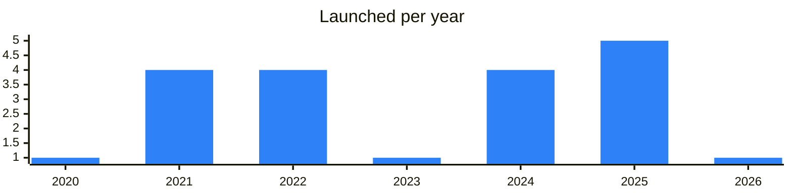

<!-- Generated by scripts/build_readme.py from data/. Do not edit by hand. -->

# Bridges

**21 projects: 10 active, 9 quiet, 2 closed.** Back to [all categories](../README.md#categories); statuses are explained [here](../README.md#how-to-read-it). The same list as a [searchable table](../data/by-category/bridges.csv).

## Active

| # | Project | What it is | Links | Launched | Peak MAU | Verified |
| ---: | --- | --- | --- | --- | ---: | --- |
| 1 | **Symbiosis** | The latest news on the development of the symbiotic blockchain metaverse | [Telegram](https://t.me/symbiosis_announcements) [X](https://x.com/symbiosis_fi) [Site](https://app.symbiosis.finance/) [GitHub](https://github.com/symbiosis-finance) [Gram News](https://gramnews.org/apps/symbiosis) | 2026-03-16 |  |  |
| 2 | **LayerZero** |  | [Site](https://layerzero.network) | 2021-05-01 |  |  |
| 3 | **Stargate** |  | [Site](https://stargate.finance) | 2021-04-01 |  |  |
| 4 | **Rubic** | Rubic - Best Rate Finder & Crypto Swap Aggregator | [Telegram](https://t.me/cryptorubic) [Bot](https://t.me/RubicSupportBot) [X](https://x.com/cryptorubic) [Site](https://app.rubic.exchange) [GitHub](https://github.com/Cryptorubic) [Gram News](https://gramnews.org/apps/rubic) | 2023-04-13 |  |  |
| 5 | **TAC** |  | [Telegram](https://t.me/tacbuild) [Bot](https://t.me/tacairdrop_bot) | 2025-09-22 |  |  |
| 6 | **NEAR Intents** |  | [Site](https://near-intents.org) | 2025-10-16 |  |  |
| 7 | **TonTake Bridge** | Благотворительно-развлекательная криптоорганизация | [Telegram](https://t.me/TonTake) [X](https://x.com/tontakegame) [Site](https://tontake.com) [Gram News](https://gramnews.org/apps/tontake-bridge) | 2022-05-10 |  |  |
| 8 | **Orbit Bridge** | Orbit Chain Announcement Channel | [Telegram](https://t.me/OrbitChainChannel) [X](https://x.com/Orbit_Chain) [Site](https://bridge.orbitchain.io/) [GitHub](https://github.com/orbit-chain) [Gram News](https://gramnews.org/apps/orbit-bridge) | 2025-12-24 |  |  |
| 9 | **TAC Cross Chain Layer** | TAC Cross Chain Layer is a messaging and custody layer connecting TON and TAC EVM, locking native TON assets and minting wrapped tokens for use in TAC miniapps | [X](https://x.com/tacbuild) [Site](https://tac.build) | 2025-08-28 |  |  |
| 10 | **TON BSC** |  | [Telegram](https://t.me/contest) [Bot](https://t.me/cryptouser_bot) [Site](https://bridge.ton.org) [GitHub](https://github.com/ton-blockchain) [Gram News](https://gramnews.org/apps/ton-bsc) | 2016-03-22 |  | since 2020-04 |

<b>Quiet: 9</b>

| # | Project | What it is | Links | Launched | Peak MAU | Verified |
| ---: | --- | --- | --- | --- | ---: | --- |
| 11 | **AnyTap** | AnyTap helps Telegram users transition into the TON ecosystem through onchain tasks and NFT rewards | [Bot](https://t.me/anytap_bot) [X](https://x.com/anytap_dapps) [Gram News](https://gramnews.org/apps/anytap) | 2024-08-27 | 48K |  |
| 12 | **TON Bridge** | Bridge for transferring USDT and USDC from other chains to TON | [Bot](https://t.me/TONBridge_robot) [Site](https://bridge.tonbankcard.com) [GitHub](https://github.com/xlabtg) [Gram News](https://gramnews.org/apps/ton-bridge) | 2022-10-08 | 267 |  |
| 13 | **island3** |  | [Site](https://bridge.rangersprotocol.com/) [GitHub](https://github.com/rangersprotocolcode) [Gram News](https://gramnews.org/apps/island3) | 2022-01-28 |  |  |
| 14 | **Ordinox** | Welcome to Ordinox! | [Bot](https://t.me/ordinoxbot) | 2025-01-06 |  |  |
| 15 | **rhino.fi** | Cross-chain bridging bot | [Bot](https://t.me/rhinofi_bot) | 2024-10-13 |  |  |
| 16 | **VIZ gateway** | VIZ gateway — bridge between GRAM and Solana chains for wVIZ | [Telegram](https://t.me/viz_world) [Site](https://gateway.viz.cx) [GitHub](https://github.com/viz-cx/viz-gateway) [Gram News](https://gramnews.org/apps/viz-gateway) | 2020-07-09 |  |  |
| 17 | **tgBTC** | Bitcoin on TON via TON Teleport | [Telegram](https://t.me/tgbtc_news) | 2024-10-31 |  |  |
| 18 | **CrossCurve** | Cross-chain bridge, formerly EYWA | [Telegram](https://t.me/eywa_channel) | 2022-06-11 |  |  |
| 19 | **MoonTON** | Bridge between TON, Ethereum and Solana | [Telegram](https://t.me/moonton_bridge) | 2024-09-14 |  |  |

<b>Closed: 2</b>

| # | Project | What it is | Links | Launched | Peak MAU | Verified |
| ---: | --- | --- | --- | --- | ---: | --- |
| 20 | **Layerswap** |  | [Telegram](https://t.me/layerswap_io) [Bot](https://t.me/lowkeybrokeybot) [X](https://x.com/layerswap) [Site](https://layerswap.io) [GitHub](https://github.com/layerswap) | 2021-09-12 | 84 |  |
| 21 | **XP.NETWORK** | A powerful NFT bridge connecting 30+ EVM and non-EVM blockchains. Go multichain effortlessly: attract fresh liquidity and audiences across ecosystems | [Telegram](https://t.me/XP_NETWORK_Ann) [Bot](https://t.me/siptg_bot) [X](https://x.com/xpnetwork_) [Site](https://bridge.xp.network/) [GitHub](https://github.com/XP-NETWORK) | 2021-09-30 | 2K |  |

