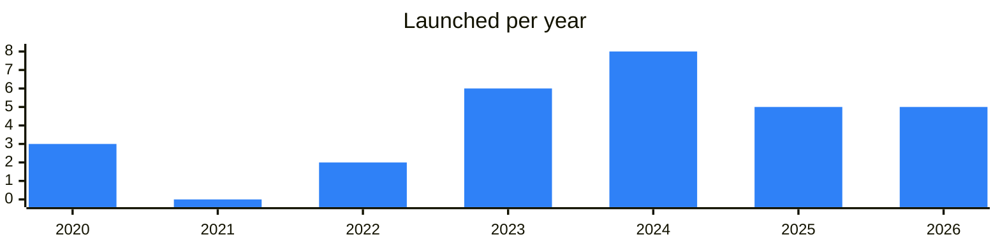

<!-- Generated by scripts/build_readme.py from data/. Do not edit by hand. -->

# Catalogues

**29 projects: 9 active, 20 quiet, 0 closed.** Back to [all categories](../README.md#categories); statuses are explained [here](../README.md#how-to-read-it). The same list as a [searchable table](../data/by-category/catalogs.csv).

## Active

| # | Project | What it is | Links | Launched | Peak MAU | Verified |
| ---: | --- | --- | --- | --- | ---: | --- |
| 1 |  **Gram News** | News aggregator covering key events in the TON ecosystem, with community post submissions. | [Telegram](https://t.me/gramnews) [Site](https://gramnews.org) | 2025-03-26 |  |  |
| 2 |  **TON App** | Catalogue website of TON mini apps with a Telegram channel for promotion and collaborations. | [Telegram](https://t.me/tonapp) [Site](https://ton-game.com) [Gram News](https://gramnews.org/apps/ton) | 2020-01-21 |  | since 2024-05 |
| 3 |  **DYOR.io** | Crypto research website with a Telegram mini app, chat and announcement channel. | [Telegram](https://t.me/dyorninja) [Site](https://dyor.io) | 2023 |  |  |
| 4 |  **ton.website** | Website offering MTProxy servers to unblock Telegram access. | [Site](https://ton.website) | 2022-10-15 |  |  |
| 5 |  **FindMini.app** | Discover curated selection of the best Telegram Mini Apps | [Telegram](https://t.me/findminiapp) [Site](https://www.findmini.app/) | 2024-06-23 |  |  |
| 6 |  **SUPER PLATFORM** | Discover quality platforms worth your attention | [Bot](https://t.me/yaojingappbot) | 2026-09-08 |  |  |
| 7 |  **Telegram Apps Center** | Catalog of TON and Telegram apps from third-party developers | [Telegram](https://t.me/tapps_official) [Bot](https://t.me/tapps_bot) [Gram News](https://gramnews.org/apps/telegram-apps-center) | 2020-05-06 | 7.8M | since 2024-09 |
| 8 |  **TONDb** | Project database on TON, described as an IMDb for mini apps, with a Telegram bot. | [Telegram](https://t.me/tondbapp) [Bot](https://t.me/tondbbot) [X](https://x.com/tondbapp) Site (down) [Gram News](https://gramnews.org/apps/tondb) | 2024-05-03 |  |  |
| 9 |  **Sousou** | Chinese-language index of Telegram groups, channels and bots | [Telegram](https://t.me/cn123) | 2023-04-20 |  |  |

<b>Quiet: 20</b>

| # | Project | What it is | Links | Launched | Peak MAU | Verified |
| ---: | --- | --- | --- | --- | ---: | --- |
| 10 |  **TonScout** | TONScout curates top new TON and Telegram apps. Users earn by supporting their favorite projects | [Bot](https://t.me/tonscout_bot) [Gram News](https://gramnews.org/apps/tonscout-1) | 2024-07-10 | 11K |  |
| 11 |  **Greedy Goblin** | Discover our innovative app store platform that bridges Web2 and Web3, offering a fun and engaging experience | [Bot](https://t.me/greedygoblinmaster_bot) [Gram News](https://gramnews.org/apps/greedy-goblin) | 2024-08-19 | 793K |  |
| 12 |  **Radar** | Mini app and bot catalogue that collects newly suggested Telegram apps and bots. | [Bot](https://t.me/radar_tg_bot) [Gram News](https://gramnews.org/apps/radar) | 2024-08-06 | 3K |  |
| 13 |  **@appss** | is your go-to global catalog for discovering Telegram Mini Apps, Bots, and Channels | [Telegram](https://t.me/appss_channel) [Bot](https://t.me/appsshubbot) | 2026-10 |  |  |
| 14 | **Games Catalog** | We hand-pick web2/web3 Telegram games for you so you can enjoy playing them solo or with your friends | [Site](https://8xr.io) | 2023-06 |  |  |
| 15 |  **Gapps Center** | Your Favourite App Center on Telegram gapps.site | [Bot](https://t.me/gappscenter_bot) | 2026-04-16 |  |  |
| 16 |  **Gram.Store** | Launchpad for Telegram mini apps | [Bot](https://t.me/gramstoreapp_bot) | 2026-06-29 |  |  |
| 17 |  **Mini Apps Center** | Directory of Telegram mini apps | [Bot](https://t.me/miniappscenterbot) | 2024-09-22 | 195K |  |
| 18 |  **TappRank** | Bot ranking and promoting Telegram bots | [Bot](https://t.me/tapprankbot) | 2025-03-10 | 78K |  |
| 19 |  **Telegram Stickers** | Catalogue of Telegram stickers with a bot for making custom stickers and premium emoji. | [Telegram](https://t.me/tgsticker) [Bot](https://t.me/moistikibot) | 2020-08-11 | 60K |  |
| 20 |  **TON App Center** | Directory of applications on the TON blockchain for discovering and exploring apps. | [Telegram](https://t.me/tonappcenterbot) | 2024-07-14 |  |  |
| 21 |  **TONcasinos** | TONcasinos.com is your one-stop guide for finding the best TON betting sites | [Bot](https://t.me/mytoncasinos_bot) [Site](https://toncasinos.com) | 2023-03 |  |  |
| 22 |  **TONHunt App** | Discovery app for TON mini apps with news and support channels. | [Bot](https://t.me/tonhuntexbot) | 2025-03-08 | 10K |  |
| 23 |  **TONPlayCenter** | TON Play Center is a one-stop hub that gathers the most popular and transparent TON mini-apps channel： | [Bot](https://t.me/lionsapp_bot) | 2025-01-05 |  |  |
| 24 |  **VVERITON** | Voting marketplace with project ratings on TON | [Bot](https://t.me/polyctonsbot) | 2025-06-04 |  |  |
| 25 |  **Yaya Mini Apps** | Yaya community: Dev | [Telegram](https://t.me/yaya_gram) [Bot](https://t.me/yayaminiapps_bot) [X](https://x.com/Yaya_gram) | 2026-06-16 |  |  |
| 26 |  **Trending Apps** | Trending Apps is a community-powered hub spotlighting the most exciting Telegram apps from indie developers | [Telegram](https://t.me/trendingapps) | 2023-07-31 |  | since 2024-03 |
| 27 |  **TON Spiders** | Aggregator of private chats for NFT, SBT and jetton holders | [Telegram](https://t.me/spiderston) | 2023-10-08 |  |  |
| 28 |  **Tonski** | Ecosystem and catalogue for TON Sites | [Telegram](https://t.me/searchington) | 2022-10-04 |  |  |
| 29 |  **FaktON** | Bot for discovering new games and projects and checking their tokens. | [Telegram](https://t.me/Fak_ton) [Bot](https://t.me/fakton_bot) [Gram News](https://gramnews.org/apps/fakton) | 2024-06-23 |  |  |

