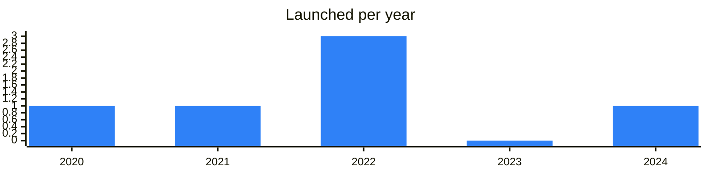

<!-- Generated by scripts/build_readme.py from data/. Do not edit by hand. -->

# Custodial

**7 projects: 5 active, 2 quiet, 0 closed.** Back to [all categories](../README.md#categories); statuses are explained [here](../README.md#how-to-read-it). The same list as a [searchable table](../data/by-category/custodial.csv).

## Active

| # | Project | What it is | Links | Launched | Peak MAU | Verified |
| ---: | --- | --- | --- | --- | ---: | --- |
| 1 |  **@Walt** | Crypto wallet for sending and buying USDT, gold, bitcoin, and other tokens | [Telegram](https://t.me/walt_news) [Bot](https://t.me/walt) [Site](https://walt.app) [Gram News](https://gramnews.org/apps/wallet) | 2020-05-06 |  | yes |
| 2 |  **@Send** | Crypto Bot is a wallet for buying, selling, and storing cryptocurrency in Telegram | [Telegram](https://t.me/cryptobotru) [Bot](https://t.me/send) [X](https://x.com/CryptoBotHQ) [Site](https://send.tg) [GitHub](https://github.com/cryptopay-dev) [Gram News](https://gramnews.org/apps/crypto-bot) | 2021-02-06 |  |  |
| 3 |  **@XRocket** | xRocket is a wallet and crypto exchange inside Telegram | [Telegram](https://t.me/xrocketnews) [Bot](https://t.me/xrocket) [X](https://x.com/xRocket_tg) [Site](https://xrocket.exchange) [GitHub](https://github.com/xrocket-tg) [Gram News](https://gramnews.org/apps/xrocket) | 2022-01-10 |  | since 2024-03 |
| 4 |  **Spell Wallet** | Crypto Airdrop Wallet - making airdrop claim easy and accessible for everyone | [Telegram](https://t.me/spell_wallet) [Bot](https://t.me/spell_wallet_bot) [X](https://x.com/spell_club) [Site](https://spellwallet.io/) | 2024-04-09 |  | since 2025-08 |
| 5 |  **Cwallet** | Cwallet is a crypto wallet for managing and swapping over 800 assets | [Telegram](https://t.me/cctipnews) [X](https://x.com/Cwalletofficial) [Site](https://cwallet.com/) [Gram News](https://gramnews.org/apps/cwallet) | 2022-08-09 |  |  |

<b>Quiet: 2</b>

| # | Project | What it is | Links | Launched | Peak MAU | Verified |
| ---: | --- | --- | --- | --- | ---: | --- |
| 6 |  **TradeTON Cheque** | CEX - Wallet & Trading Bot - Your Telegram Wallet for Trading and Holding Cryptocurrencies - News - Community @ | [Telegram](https://t.me/tradetoncheques) |  |  |  |
| 7 |  **Wallet** | News channel of Wallet in Telegram | [Telegram](https://t.me/wallet_news_en) [X](https://x.com/wallet_tg) | 2022-03-31 |  |  |

