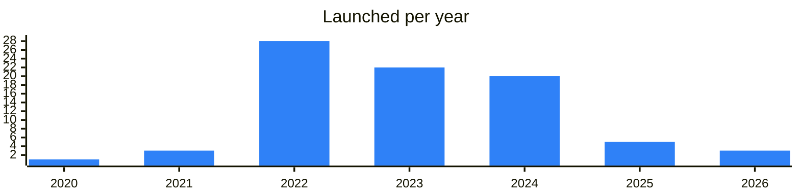

<!-- Generated by scripts/build_readme.py from data/. Do not edit by hand. -->

# Developer tools

**87 projects: 15 active, 66 quiet, 6 closed.** Back to [all categories](../README.md#categories); statuses are explained [here](../README.md#how-to-read-it). The same list as a [searchable table](../data/by-category/devtools.csv).

## Active

| # | Project | What it is | Links | Launched | Peak MAU | Verified |
| ---: | --- | --- | --- | --- | ---: | --- |
| 1 |  **Telegram Bot API News** | Official news about the Telegram Bot API | [Telegram](https://t.me/botnews) | 2016-01-17 |  | yes |
| 2 |  **Telegram Crawler** | Tracks changes in official Telegram sites and clients | [Telegram](https://t.me/tgcrawl) | 2022-10-23 |  |  |
| 3 |  **Tonutils** | News of Tonutils TON development tools | [Telegram](https://t.me/tonutilsnews) | 2024-07-25 |  |  |
| 4 |  **IntelliJ Idea plugin** |  | [Telegram](https://t.me/actiqapp) [X](https://x.com/actiqapp) [Site](https://plugins.jetbrains.com/plugin/23382-ton) [GitHub](https://github.com/actiquest-dev) [Gram News](https://gramnews.org/apps/intellij-idea-plugin) | 2022-06-01 |  |  |
| 5 | **Minter** |  | [Site](https://minter.ton.org) [Gram News](https://gramnews.org/apps/minter) | 2025-10-28 |  |  |
| 6 | **nessshon/tonutils** | High-level SDK and toolkit | [GitHub](https://github.com/nessshon/tonutils) | 2024-07-28 |  |  |
| 7 |  **Orbs** | Blockchain infrastructure network publishing news and updates. | [Telegram](https://t.me/orbs_news) [X](https://x.com/orbs_network) [Site](https://www.orbs.com) [GitHub](https://github.com/orbs-network) [Gram News](https://gramnews.org/apps/orbs) | 2017-08-28 |  |  |
| 8 |  **Softstack** |  | [Telegram](https://t.me/softstack) [X](https://x.com/softstackHQ) [Site](https://softstack.io) [GitHub](https://github.com/softstack) [Gram News](https://gramnews.org/apps/softstack) | 2015-04-25 |  |  |
| 9 | **tact.vim** |  | [GitHub](https://github.com/tact-lang/tact.vim) | 2023-09-29 |  |  |
| 10 |  **TON Testnet Faucet** |  | [Site](https://ton.run/#/faucet) [Gram News](https://gramnews.org/apps/ton-testnet-faucet) | 2022-12 |  |  |
| 11 | **tonlib-rs** |  | [GitHub](https://github.com/ston-fi/tonlib-rs) | 2023-04-10 |  |  |
| 12 |  **TONNode** | TONNode gives you direct access to TON without running a node | [Telegram](https://t.me/tonnode) [Site](https://tonnode.io) [GitHub](https://github.com/tonnode) | 2026-07-16 |  |  |
| 13 | **tonutils/tonconnect** | Python SDK for TON Connect | [GitHub](https://github.com/nessshon/tonutils) | 2024-07-28 |  |  |
| 14 | **xssnick/tonutils-go** | Comprehensive Go SDK for the TON blockchain. | [GitHub](https://github.com/xssnick/tonutils-go) | 2022-04-26 |  |  |
| 15 | **yungwine/pytoniq** | SDK with LiteClient and TLB | [GitHub](https://github.com/yungwine/pytoniq) | 2023-05-25 |  |  |

<b>Quiet: 66</b>

| # | Project | What it is | Links | Launched | Peak MAU | Verified |
| ---: | --- | --- | --- | --- | ---: | --- |
| 16 |  **Grid TON** |  | [Bot](https://t.me/gridton_bot) [Gram News](https://gramnews.org/apps/grid-ton) | 2024-06-03 | 189K |  |
| 17 |  **DECODE UR SEED** |  | [Bot](https://t.me/decodeseedbot) [Gram News](https://gramnews.org/apps/decode-ur-seed) | 2024-07-16 | 255K |  |
| 18 |  **Shuttle** | We are here for great things | [Telegram](https://t.me/Shuttle_ads) [Bot](https://t.me/shuttle_ton_bot) [Gram News](https://gramnews.org/apps/shuttle) | 2024-04-21 | 1.3M |  |
| 19 |  **DPXWallet** | Feature-Rich demonstration of a dummy Wallet app / Dev | [Bot](https://t.me/dpxwalletbot) [Gram News](https://gramnews.org/apps/dpxwallet) | 2023-10-31 | 142 |  |
| 20 | **@tonconnect/sdk** | JavaScript SDK for TON Connect 2.0 | [Site](https://www.npmjs.com/package/@tonconnect/sdk) | 2022-09-26 |  |  |
| 21 | **Adradar** |  | [X](https://x.com/adradar_xyz) [Site](https://adradar.xyz) [Gram News](https://gramnews.org/apps/adradar) | 2025-06-19 |  |  |
| 22 |  **Apps Father** | Apps Father — AI tool to build Telegram Mini Apps without code | [Telegram](https://t.me/apps_father) [Bot](https://t.me/apps_father_bot) [X](https://x.com/AppsFather) [Site](https://apps-father.com/) [Gram News](https://gramnews.org/apps/apps-father) | 2026-04-07 |  |  |
| 23 | **C#/tonconnect** | C# SDK for TON Connect. | [GitHub](https://github.com/continuation-team/TonSdk.NET) | 2023-03-08 |  |  |
| 24 | **Chainstack TON Faucet** | Daily TON testnet refills | [Site](https://faucet.chainstack.com/ton-testnet-faucet) | 2014-11-26 |  |  |
| 25 |  **Crypto Pay Developers** | Developer chat for the Crypto Pay payment system | [Telegram](https://t.me/cryptopaydevru) | 2023-04-29 |  |  |
| 26 | **custon** | Custom wallet address generator in JavaScript | [GitHub](https://github.com/TON-NFT/custon) | 2022-06-08 |  |  |
| 27 | **darttonconnect** | Dart SDK for TON Connect aimed at mobile apps. | [GitHub](https://github.com/romanovichim/dartTonconnect) | 2023-05-03 |  |  |
| 28 |  **DeLab** |  | [Bot](https://t.me/delabbot) [X](https://x.com/delabteam) Site (down) [GitHub](https://github.com/delab-team) [Gram News](https://gramnews.org/apps/delab) | 2024-04-03 |  |  |
| 29 | **delab-team/connect** | Multi-protocol SDK with unified interface | [GitHub](https://github.com/delab-team/connect) | 2022-11-02 |  |  |
| 30 | **Development Wallet** |  | [Site](https://test.tonhub.com/dl) [Gram News](https://gramnews.org/apps/development-wallet) | 2024-01-08 |  |  |
| 31 |  **Directual no-code** | Your smart Telegram assistant for Directual — get key updates and manage your account anytime, anywhere | [Bot](https://t.me/Directual_bot) [X](https://x.com/directual) [Site](https://readme.directual.com/plugins/using-plugins/blockchain-web3/ton-the-open-network) [Gram News](https://gramnews.org/apps/directual-no-code) | 2020-08-13 |  |  |
| 32 |  **DYOR.io API** | Developer chat for DYOR.io API | [Telegram](https://t.me/dyorapi) | 2025-01-13 |  |  |
| 33 |  **Escape from Zeya** |  | [Telegram](https://t.me/tonplayinsider) [X](https://x.com/insider_ton) [Site](https://tonplay.io/games/DZmrVk1mJ5) [GitHub](https://github.com/ton-play) | 2024-05 |  |  |
| 34 | **foton** | Comprehensive toolkit for TON dApps | [GitHub](https://github.com/VanishMax/foton) | 2024-04-01 |  |  |
| 35 |  **GMAI** | GMAI — developer tool for Solana dApps with AI integration | [Telegram](https://t.me/gmAI_Ann) [Bot](https://t.me/gmdotaibot) [X](https://x.com/gm_dot_ai) [Site](https://docs.gm.ai/how-we-work/gmai-framework) [Gram News](https://gramnews.org/apps/gmai) | 2024-07-30 | 2.5M |  |
| 36 | **IntelliJ IDEs Plugin** | TON development for JetBrains IDEs | [Site](https://plugins.jetbrains.com/plugin/23382-ton) | 2022-02-01 |  |  |
| 37 |  **Marble** | Marble has completed a framework that allows you to easily integrate Unity, HTML5, and WebGL-based games into Telegram | [Bot](https://t.me/Marblegame_bot) [X](https://x.com/marbletoken) [Site](https://marbletoken.io) | 2024-10 |  |  |
| 38 |  **Misti Static Analyzer** | Static analyzer for smart contracts on the TON blockchain. | [Telegram](https://t.me/tonsec_chat) [GitHub](https://github.com/nowarp/misti) | 2024-04-14 |  |  |
| 39 | **Nimbus API** |  | [Site](https://getnimbus.io) [Gram News](https://gramnews.org/apps/nimbus-api) | 2024-06 |  |  |
| 40 | **node-tonlib** | Node.js C++ addon for TON |  | 2022-10-29 |  |  |
| 41 | **Port3** |  | [Site](https://twitter.com/Port3Network) [Gram News](https://gramnews.org/apps/port3) | 2023-04 |  |  |
| 42 | **pytonconnect** | Alternative Python SDK for TON Connect. | [Site](https://pypi.org/project/pytonconnect/) | 2023-04-04 |  |  |
| 43 | **Rift** |  | [Site](https://rift.skyring.io) [GitHub](https://github.com/sky-ring) [Gram News](https://gramnews.org/apps/rift) | 2022-10-08 |  |  |
| 44 |  **SimpleNFT** | Simplifying web3 monetization for developers. For creators by creators | [Telegram](https://t.me/simplenft4all) [Bot](https://t.me/simplenftbot) | 2025-04-04 | 49K |  |
| 45 | **Sublime Text Plugin** | Plugin adding FunC language support to Sublime Text. | [GitHub](https://github.com/savva425/func_plugin_sublimetext3) | 2021-10-29 |  |  |
| 46 | **SwiftyTON** | Swift SDK with async/await support |  | 2022-10-29 |  |  |
| 47 |  **Tact Language** | Group for discussing Tact programming language in English | [Telegram](https://t.me/tactlang) [X](https://x.com/tact_language) [GitHub](https://github.com/tact-lang) | 2023-01-10 |  |  |
| 48 |  **Testgiver TON** | Bot that hands out TON testnet coins as a faucet. | [Bot](https://t.me/testgiver_ton_bot) | 2022-07-26 | 32K |  |
| 49 | **Testnet Faucet** |  | [Gram News](https://gramnews.org/apps/testnet-faucet) | 2015-06-11 |  |  |
| 50 |  **TMA Dev** | Community of Telegram developers discussing mini apps in English. | [Telegram](https://t.me/twa_dev) [GitHub](https://github.com/twa-dev) | 2023-09-29 |  |  |
| 51 | **TON & TG Dev Tools** |  | [Site](https://mehrdadjeyrani.ir) [GitHub](https://github.com/MGamerica) [Gram News](https://gramnews.org/apps/ton-tg-dev-tools) | 2025-03 |  |  |
| 52 |  **TON Dev Chat** | English-speaking TON developers chat | [Telegram](https://t.me/tondev_eng) | 2022-04-21 |  |  |
| 53 |  **TON NoCode SDK** |  | [Telegram](https://t.me/safemoonTon) [X](https://x.com/SafetonPad) [Site](https://novabloq.com/plugin/ton-connect-nocode-sdk-1679505489636x562684572799117440) [Gram News](https://gramnews.org/apps/ton-nocode-sdk) | 2024-01-06 |  |  |
| 54 |  **TON Play** | Toolkit for developers of Telegram games on TON | [Telegram](https://t.me/tonplayinsiderrus) | 2022-08-02 |  |  |
| 55 |  **Ton Site Builder** | Ton Web3 Site Builder.Based on Ton Storage | [Bot](https://t.me/ton_site_builder_bot) | 2026-07-04 |  |  |
| 56 | **ton-blockchain/tonlib-go** | Official Golang TonLib wrapper | [GitHub](https://github.com/ton-blockchain/tonlib-go) | 2021-07-02 |  |  |
| 57 | **ton-core/ton** | Cross-platform client by ton-core | [GitHub](https://github.com/ton-core/ton) | 2023-01-26 |  |  |
| 58 | **ton-k8s** | Self-hosted TON network with Kubernetes and Docker | [GitHub](https://github.com/disintar/ton-k8s) | 2022-01-15 |  |  |
| 59 | **Tonana** |  | [X](https://x.com/tonanadao) [Site](https://github.com/tonanadao) [Gram News](https://gramnews.org/apps/tonana) | 2023-05-21 |  |  |
| 60 |  **toncenter.com bot** | Bot for managing toncenter.com API keys | [Bot](https://t.me/tonapibot) | 2022-02-21 |  |  |
| 61 | **TonDevWallet** |  | [Site](https://github.com/TonDevWallet/TonDevWallet) [GitHub](https://github.com/TonDevWallet/TonDevWallet) [Gram News](https://gramnews.org/apps/tondevwallet) | 2023-01-27 |  |  |
| 62 | **tonfactory/tonsdk** | Cells and contract wrappers | [GitHub](https://github.com/tonfactory/tonsdk) | 2022-08-04 |  |  |
| 63 | **TonSdk.NET** |  | [GitHub](https://github.com/continuation-team/TonSdk.NET) | 2023-03-08 |  |  |
| 64 |  **TonStatic** | Bot for creating simple .ton sites | [Bot](https://t.me/tonstaticbot) | 2023-12-04 |  |  |
| 65 | **tonutils-dart** | Dart/Flutter SDK for mobile apps | [GitHub](https://github.com/novusnota/tonutils-dart) | 2023-05-12 |  |  |
| 66 | **TONX Testnet Faucet** | Web-based faucet service for TON testnet coins. | [Site](https://faucet.tonxapi.com/) | 2024-07-24 |  |  |
| 67 | **TONX.JS** | JavaScript SDK for TONX API | [GitHub](https://github.com/frigatebird-studio/TONX.js) | 2024-10-22 |  |  |
| 68 | **twa-dev/boilerplate** | Starter boilerplate for TWAs | [GitHub](https://github.com/twa-dev/Boilerplate) | 2022-09-11 |  |  |
| 69 | **twa-dev/Mark42** | UI library optimized for TWAs | [GitHub](https://github.com/twa-dev/Mark42) | 2022-08-18 |  |  |
| 70 | **twa-dev/sdk** | SDK package for TWA development | [GitHub](https://github.com/twa-dev/sdk) | 2022-08-16 |  |  |
| 71 | **unity/tonconnect** | Unity SDK for TON Connect | [GitHub](https://github.com/continuation-team/unity-ton-connect) | 2023-09-05 |  |  |
| 72 | **VS Code Plugin** | FunC syntax highlighting and tools | [Site](https://marketplace.visualstudio.com/items?itemName=tonwhales.func-vscode) | 2022-03-28 |  |  |
| 73 | **WebDeployer** |  | [Site](https://ratingers.pythonanywhere.com/deployer/) | 2023-07 |  |  |
| 74 | **Xircus** |  | [Bot](https://t.me/xircus_bot) | 2024-06 |  |  |
| 75 |  **DeLab Team** | Development team building on TVM, including a TON SIM bot | [Telegram](https://t.me/delabteam) | 2022-11-04 |  |  |
| 76 |  **TON Contests** | Announcements of TON developer contests | [Telegram](https://t.me/toncontests) | 2021-11-09 |  |  |
| 77 |  **TONX** | TONX is the SuperApp platform layer that enables builders to create the new Web3 economy | [Telegram](https://t.me/tonxstudio) [X](https://x.com/TONX_Studio) [Site](https://tonx.ai/) | 2022-09-29 |  |  |
| 78 |  **MyTonWallet** | MyTonWallet developer contests channel | [Telegram](https://t.me/mycontests) [X](https://x.com/mytonwallet_io) [GitHub](https://github.com/mytonwallet-org) | 2024-05-15 |  |  |
| 79 |  **TONX API** | Support the development of TON by offering an array of robust tools for a seamless developer journey | [Telegram](https://t.me/tonxapi) [X](https://x.com/TONXAPI) [Site](https://tonxapi.com/) [GitHub](https://github.com/tonxapi/sample) [Gram News](https://gramnews.org/apps/tonx-api) | 2023-10-31 |  |  |
| 80 |  **TON.SKI Access** | An ecosystem for TON Sites | [Telegram](https://t.me/tonski_eng) [Site](https://ton.ski/access/) [Gram News](https://gramnews.org/apps/ton-ski-access) | 2022-12-22 |  |  |
| 81 |  **Tact Software Foundation** | Official channel for TON development news and the Tact language | [Telegram](https://t.me/tondevnews) | 2022-12-23 |  |  |

<b>Closed: 6</b>

| # | Project | What it is | Closed | Proof |
| ---: | --- | --- | --- | --- |
| 82 | **go/tonconnect** | Go SDK for TON Connect. | 2024-07-16 | [archived repository](https://github.com/cameo-engineering/tonconnect) |
| 83 | **Language Server (LSP Server)** | Supports Sublime Text, (Neo)Vim, Helix, and other editors with LSP support | 2026-06-26 | [archived repository](https://github.com/tact-lang/tact-language-server) |
| 84 |  **TON Web IDE** | Boost your web3 coding journey with us | 2026-06-23 | [archived repository](https://github.com/tact-lang/web-ide) |
| 85 | **ton-community/twa-template** | TWA template with TON integration | 2023-10-20 | [archived repository](https://github.com/ton-community/twa-template) |
| 86 | **ton-kotlin** | Kotlin SDK for JVM applications | 2025-11-11 | [archived repository](https://github.com/andreypfau/ton-kotlin) |
| 87 | **yungwine/TonTools** | High-level library for HTTP/ADNL | 2024-07-24 | [archived repository](https://github.com/yungwine/TonTools) |

