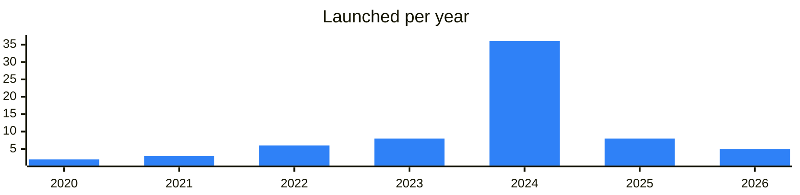
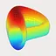

<!-- Generated by scripts/build_readme.py from data/. Do not edit by hand. -->

# DEX

**70 projects: 14 active, 55 quiet, 1 closed.** Back to [all categories](../README.md#categories); statuses are explained [here](../README.md#how-to-read-it). The same list as a [searchable table](../data/by-category/dex.csv).

## Active

| # | Project | What it is | Links | Launched | Peak MAU | Verified |
| ---: | --- | --- | --- | --- | ---: | --- |
| 1 |  **STON.fi** | STON.fi — swap tokens across TON, EVM, and TRON in one interface | [Telegram](https://t.me/stonfidex) [Bot](https://t.me/ston_fi) [X](https://x.com/ston_fi) [Site](https://ston.fi) [GitHub](https://github.com/ston-fi) [Gram News](https://gramnews.org/apps/ston-fi) | 2022-04-30 | 174K | since 2023-10 |
| 2 |  **DeDust** | Decentralized exchange on TON | [Telegram](https://t.me/dedust_en) [Bot](https://t.me/dedustBot) [X](https://x.com/dedust_io) [Site](https://dedust.io) [GitHub](https://github.com/dedust-io) [Gram News](https://gramnews.org/apps/dedust-io) | 2022-01-28 | 92K | since 2023-12 |
| 3 |  **swap.coffee** | The most effective DEX Aggregator on TON. Smart routing and transaction splitting | [Telegram](https://t.me/swap_coffee) [Bot](https://t.me/swapcoffeebot) [X](https://x.com/swap_coffee_ton) [Site](https://swap.coffee/dex) [GitHub](https://github.com/swapcoffee) [Gram News](https://gramnews.org/apps/swap-coffee) | 2023-05-01 | 22K | since 2025-11 |
| 4 |  **TONCO** | TONCO — a decentralized exchange on TON with concentrated liquidity | [Telegram](https://t.me/tonco_io) [Bot](https://t.me/tonco_io_bot) [X](https://x.com/tonco_io) [Site](https://tonco.io) [GitHub](https://github.com/cryptoalgebra/tonco-demo) [Gram News](https://gramnews.org/apps/tonco) | 2024-07-11 | 872K |  |
| 5 |  **Torch Finance** | Torch DEX - Stable Swap on TON | [Telegram](https://t.me/torch_ton) [Bot](https://t.me/torch_finance_bot) [Site](https://torch.finance) [GitHub](https://github.com/torch-core) [Gram News](https://gramnews.org/apps/torchfinance) | 2024-08-05 | 23K |  |
| 6 |  **Megaton Finance** | Decentralized finance protocol with an announcement channel. | [Telegram](https://t.me/megatonfinancechannel) [Site](https://megaton.fi) [GitHub](https://github.com/megaton-fi) | 2023-02-16 |  |  |
| 7 |  **Brivox** | Brivox is built specifically for the future of decentralized finance | [Bot](https://t.me/brivoxwbe3_bot) | 2026-02-25 |  |  |
| 8 |  **STON.fi Africa** | Regional channel of STON.fi DEX | [Telegram](https://t.me/stonfiafricanews) | 2025-07-10 |  |  |
| 9 |  **BiniChain DEX App** | Created by Binibit.com | [Telegram](https://t.me/binibitnews) [Bot](https://t.me/binichain_bot) | 2026-02-06 |  |  |
| 10 |  **1inch** | DeFi ecosystem and DEX aggregator | [Telegram](https://t.me/oneinchnetworknews) [X](https://x.com/1inch) [GitHub](https://github.com/1inch) | 2022-03-21 |  | since 2022-09 |
| 11 |  **Pump.tg** | TON token swap aggregator | [Telegram](https://t.me/pumpme_tg) [Bot](https://t.me/pumpn_bot) [X](https://x.com/pumptg_n) [Site](https://pump.tg/) [Gram News](https://gramnews.org/apps/pump-tg) | 2026-07-13 |  |  |
| 12 | **SoDEX Bridge** | SoDEX is a high-performance order book decentralized exchange (DEX) built on ValueChain | [X](https://x.com/sodex_official) [Site](https://ssi.sosovalue.com) | 2026-01-08 |  |  |
| 13 | **Tegro Finance** | TegroFinance - A next evolution DeFi exchange on The Open Network (TON) | [X](https://x.com/TegroDEX) | 2023-01-04 |  |  |
| 14 |  **Bidask** | Bidask – a decentralized exchange on TON for token trading and liquidity provision | [Telegram](https://t.me/bidask) [Bot](https://t.me/bidask_protocol_bot) [X](https://x.com/BidaskProtocol) [Site](https://bidask.finance/) [Gram News](https://gramnews.org/apps/bidask) | 2024-05-16 |  |  |

<b>Quiet: 55</b>

| # | Project | What it is | Links | Launched | Peak MAU | Verified |
| ---: | --- | --- | --- | --- | ---: | --- |
| 15 |  **Rainbow.ag** | Rainbow.ag - a swap aggregator on TON using GRAM | [Telegram](https://t.me/rainbow_swap) [Bot](https://t.me/rainbow_swap_bot) [X](https://x.com/rainbow_swap) [Site](https://rainbow.ag/) [GitHub](https://github.com/0xblackbot/rainbow-swap) [Gram News](https://gramnews.org/apps/rainbow-ag) | 2024-04-29 | 183K |  |
| 16 |  **Titan** | Titan is a decentralized exchange for token swaps on the TON network | [Telegram](https://t.me/TitanTrading) [Bot](https://t.me/TitanTradeBot) [X](https://x.com/titanaggregator) Site (down) [GitHub](https://github.com/titan-tg) [Gram News](https://gramnews.org/apps/titan) | 2024-11-27 | 31K |  |
| 17 |  **ChainCrops** |  | [Bot](https://t.me/chaincrops_bot) [Site](https://traffic.adsgram.ai/campaigns) [Gram News](https://gramnews.org/apps/chaincrops) | 2024-05-12 | 1.7M |  |
| 18 |  **Gain Bot** | Gain your digital sovereignty in Web3 | [Bot](https://t.me/the_gain_bot) [Gram News](https://gramnews.org/apps/gain-bot) | 2024-08-06 | 416K |  |
| 19 |  **Bitrall** | Bitrall is a decentralized hybrid cryptocurrency exchange built on artificial intelligence | [Bot](https://t.me/bitrall_bot) [Gram News](https://gramnews.org/apps/bitrall) | 2024-07-15 | 1.3M |  |
| 20 |  **Horizon Launch** | Official bot of the EVEDEX decentralized exchange | [Bot](https://t.me/horizonlaunch_bot) [Gram News](https://gramnews.org/apps/horizon-launch) | 2024-07-14 | 2.5M |  |
| 21 |  **Alton Trader** | AltonTrade - Future DEX on TON Blockchain / Empowering decentralized finance. Trade smarter, faster, and safer. Join us on the journey to revolutionize trading | [Telegram](https://t.me/alton_trade) [Bot](https://t.me/altontraderbot) [X](https://x.com/TradeAlton) [Site](https://altons.trade) [Gram News](https://gramnews.org/apps/alton-trader) | 2024-04-16 |  |  |
| 22 |  **Electra App** | Trade easy, send BTC to the moon, farm points, and get rewarded! | [Telegram](https://t.me/electra_channel) [Bot](https://t.me/electraappbot) [X](https://x.com/ElectraTrade) [Site](https://electra.trade) [Gram News](https://gramnews.org/apps/electra-app) | 2024-05-26 | 1.8M |  |
| 23 |  **Joker Swap** | Joker Swap get free tokens for using your DEX wallet | [Telegram](https://t.me/jokerswapofficial) [Bot](https://t.me/jokerswapbot) [X](https://x.com/joker__swap) [Gram News](https://gramnews.org/apps/joker-swap) | 2024-09-08 | 1.2M |  |
| 24 |  **VitooCoin** |  | [Bot](https://t.me/vitoocoinbot) [Gram News](https://gramnews.org/apps/vitoocoin) | 2024-07-29 | 4K |  |
| 25 | **Kibble Exchange** | Forging Tomorrow’s DeFi with AI Precision! | [Telegram](https://t.me/KibbleAnnouncement) [Bot](https://t.me/KibbleExchangeBot) [X](https://x.com/KibbleExchange) Site (down) [Gram News](https://gramnews.org/apps/kibble-exchange) | 2024-06-06 | 20K |  |
| 26 |  **DEX BOOSTER GOLD** |  | [Bot](https://t.me/dex_booster_bot) [Gram News](https://gramnews.org/apps/dex-booster-gold) | 2024-01-08 | 2K |  |
| 27 |  **ION Finance** | Official ION Finance Community Telegram Group, managed by the ION Finance Foundation Community Team | [Telegram](https://t.me/IONFINANCE_OFFICIAL) [Bot](https://t.me/ion_finance_bot) [X](https://x.com/Ion_Finance) [Site](https://ionfi.xyz/) [GitHub](https://github.com/ion-finance) [Gram News](https://gramnews.org/apps/ion-finance) | 2023-08-22 | 2K |  |
| 28 |  **xAurum BTC DCA** |  | [Bot](https://t.me/xaurumbot) [Gram News](https://gramnews.org/apps/xaurum-btc-dca) | 2021-12-12 | 243 |  |
| 29 |  **MyTonSwap** | Dex Aggregator & Trading Bot On TON | [Telegram](https://t.me/MyTonSwap) [Bot](https://t.me/MyTonSwap_bot) [X](https://x.com/MyTonSwap) Site (down) [GitHub](https://github.com/MyTonSwap) [Gram News](https://gramnews.org/apps/mytonswap) | 2024-03-15 | 5K |  |
| 30 | **Capital DEX** |  | [X](https://x.com/curio_invest) [Site](https://capitaldex.exchange) [GitHub](https://github.com/CurioTeam) [Gram News](https://gramnews.org/apps/capital-dex) | 2022-05-04 |  |  |
| 31 | **Crouton Finance** | Crouton is a decentralized exchange (DEX) and automated market maker (AMM) on TON, designed for the efficient trading of stablecoins and pegged assets | [X](https://x.com/croutonfi) | 2024-10-09 |  |  |
| 32 | **CryptoRiviera** |  | [X](https://x.com/CryptoRivieraAI) [Site](https://cryptoriviera-2xng.onrender.com/) [Gram News](https://gramnews.org/apps/cryptoriviera) | 2025-06-25 |  |  |
| 33 |  **Curve TON** | Mini app for swapping TON tokens | [Bot](https://t.me/curveappbot) | 2025-03-11 |  |  |
| 34 | **DeFi Canvas** |  | [Bot](https://t.me/deficanvasbot) | 2025 |  |  |
| 35 |  **DexTon** | Decentralized exchange on TON with a community chat. | [Telegram](https://t.me/dexton_io) | 2024-08-29 |  |  |
| 36 |  **Dexy Finance** | Access the Yellow Network from telegram with Dexy! | [Bot](https://t.me/dexyfi_bot) | 2024-10-30 | 1.9M |  |
| 37 | **Dodo** |  | [Telegram](https://t.me/dodo) [Site](https://app.dodoex.io/?from=ton&to=USDC) [GitHub](https://github.com/DODOEX) [Gram News](https://gramnews.org/apps/dodo) | 2023-07 |  |  |
| 38 |  **EXTON** | State of the Art BEETON: BOOST: EXTON | [Telegram](https://t.me/exton_orders) [Bot](https://t.me/EXTON_SWAP_BOT) [Gram News](https://gramnews.org/apps/exton) | 2022-12-20 |  |  |
| 39 |  **GraphDex** | GraphDex — The Infrastructure for Digital Asset Trading Website: graphdex.io | [Telegram](https://t.me/graphdex) |  |  |  |
| 40 |  **Lost Dogs REX** | Random exchange for WOOF token swaps | [Bot](https://t.me/lodo_rex_bot) | 2024-11-12 |  |  |
| 41 |  **Moki** | Token swap bot with tasks on TON | [Bot](https://t.me/mokiswapbot) | 2024-10-09 | 47K |  |
| 42 |  **Neptune Airdrop** | Exchange project with a website, Telegram group and X account. | [Bot](https://t.me/neptuneexchange_bot) |  |  |  |
| 43 | **Nomiswap** |  | [Site](https://nomiswap.io/swap?outputCurrency=0x76A797A59Ba2C17726896976B7B3747BfD1d220f) [GitHub](https://github.com/nominex) [Gram News](https://gramnews.org/apps/nomiswap) | 2024-01-19 |  |  |
| 44 |  **Open Swap** |  | [Bot](https://t.me/openswapbot) | 2026-04-30 |  |  |
| 45 |  **Orbiton** |  | [Bot](https://t.me/orbiton_swap_bot) | 2024-12-20 |  |  |
| 46 |  **PancakeSwap** | Decentralized exchange with a channel of announcements and scam warnings. | [Telegram](https://t.me/pancakeswap) [Site](https://pancakeswap.finance/swap?outputcurrency=0x76a797a59ba2c17726896976b7b3747bfd1d220f) [GitHub](https://github.com/pancakeswap) [Gram News](https://gramnews.org/apps/pancakeswap) | 2023-05 |  |  |
| 47 |  **Polkaswap DEX** | Polkaswap DEX: Built for an interoperable future | [Telegram](https://t.me/polkaswap) [Bot](https://t.me/polkaswap_io_bot) [X](https://x.com/polkaswap) [Site](https://polkaswap.io) [GitHub](https://github.com/sora-xor/polkaswap-exchange-web) [Gram News](https://gramnews.org/apps/polkaswap-dex) | 2020-08-07 |  |  |
| 48 |  **Rovex Swap Bot** | Welcome to the Rovex platform, a platform specializing in EFT (Edge Form Trading) for the pre-Market token | [Bot](https://t.me/rovexswapbot) | 2024-05-16 | 55K |  |
| 49 | **SwapSwop** |  | [Site](https://swapswop.io/) [Gram News](https://gramnews.org/apps/swapswop) | 2023-08 |  |  |
| 50 |  **Swapzone** | Cryptocurrency exchange deal aggregator | [Telegram](https://t.me/swapzoneio) | 2021-05-19 |  |  |
| 51 |  **Swapzone** | Exchange aggregator comparing rates across exchanges | [Bot](https://t.me/swapzoneio_bot) | 2025-05-26 |  |  |
| 52 |  **The Open League** | Liquidity pool rewards program with a multi-million prize pool | [Bot](https://t.me/open_league_bot) | 2024-03-18 | 1M |  |
| 53 |  **TheOne** | Telegram bot for swapping tokens with deep liquidity | [Bot](https://t.me/theonetgbot) | 2025-04-08 | 34K |  |
| 54 |  **Titan Aggregator** | Swap aggregator on TON | [Telegram](https://t.me/titanaggregator) | 2024-11-08 |  |  |
| 55 |  **TonSwap** | On-chain AMM decentralized exchange on TON | [Bot](https://t.me/tonswapofficialbot) | 2022-08-09 |  |  |
| 56 | **Transit Swap** |  | [X](https://x.com/TransitFinance) [Site](https://swap.transit.finance/) [Gram News](https://gramnews.org/apps/transit-swap) | 2021-07-04 |  |  |
| 57 | **Uniswap** |  | [Site](https://app.uniswap.org/#/swap?outputcurrency=0x582d872a1b094fc48f5de31d3b73f2d9be47def1) [Gram News](https://gramnews.org/apps/uniswap) | 2020-04-26 |  |  |
| 58 |  **UTYABSWAP** | Token swap service available as a Telegram mini app. | [Bot](https://t.me/utyabswapbot) | 2024-08-13 | 20K |  |
| 59 |  **What Swap** |  | [Bot](https://t.me/what_swap_bot) [X](https://x.com/bigbangdear) [Site](https://what-swap.vercel.app/) [GitHub](https://github.com/bigbanghere/what-swap) [Gram News](https://gramnews.org/apps/what-swap) | 2025-09-13 |  |  |
| 60 |  **XBOT** | Crypto tools and DEX trading right in your Telegram | [Bot](https://t.me/chainspyrobot) [X](https://x.com/twinbyxbot) [Gram News](https://gramnews.org/apps/xbot) | 2024-03-18 | 155K |  |
| 61 |  **xDelta** | DEX liquidity aggregator on TON offering instant swaps with low fees. | [Telegram](https://t.me/xdelta_bot) [Bot](https://t.me/xdelta_finance) [X](https://x.com/xdelta_finance) [Site](https://xdelta.fi/?utm_source=tonapp) [Gram News](https://gramnews.org/apps/xdelta) | 2025-01-20 |  |  |
| 62 |  **RPine** | DEX aggregator unifying liquidity from multiple exchanges | [Telegram](https://t.me/rpine_xyz_news) [X](https://x.com/RPineXyz) [Site](https://rpine.xyz) | 2024-05-15 |  |  |
| 63 |  **DeDust (DUST)** | Decentralized exchange on TON with a bot, chat and Russian-language channel. | [Telegram](https://t.me/dedust_en) [X](https://x.com/dedust_io) [Site](https://dedust.io) | 2024-06-04 |  | since 2023-12 |
| 64 |  **Syde Protocol** | Synthetic DeFi layer on TON | [Telegram](https://t.me/sydefi) [Bot](https://t.me/sydefi_bot) [Site](https://syde.fi) | 2024-12-20 |  |  |
| 65 |  **Nest** | DEX aggregator on the TON blockchain | [Telegram](https://t.me/nest_dex) | 2024-09-03 |  |  |
| 66 |  **Moon.cx** | Swap service with a Russian-language support channel. | [Telegram](https://t.me/mooncx_ru) [Site](https://moon.cx/) [Gram News](https://gramnews.org/apps/moon-cx) | 2024-10-26 |  |  |
| 67 |  **Swap App** | Swap app with a news channel and an airdrop bot. | [Telegram](https://t.me/swapapp_news) [Bot](https://t.me/swapairbot) [X](https://x.com/SwapAppTon) [Gram News](https://gramnews.org/apps/swap-app) | 2024-07-20 | 18K |  |
| 68 |  **PixelSwap** | Modular upgradeable DEX on TON | [Telegram](https://t.me/pixelswap_io) [X](https://x.com/PixelSwap_io) | 2024-03-31 |  |  |
| 69 |  **The Gate** |  | [Telegram](https://t.me/TheGateR) [X](https://x.com/TheGate562007) [Site](https://thegate.fun) [Gram News](https://gramnews.org/apps/the-gate) | 2024-04-03 |  |  |

<b>Closed: 1</b>

| # | Project | What it is | Links | Launched | Peak MAU | Verified |
| ---: | --- | --- | --- | --- | ---: | --- |
| 70 | **LoneToken CABOT** |  | [Gram News](https://gramnews.org/apps/lonetoken-cabot) | 2023-09-02 |  |  |

