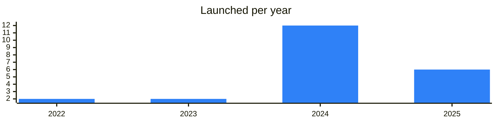

<!-- Generated by scripts/build_readme.py from data/. Do not edit by hand. -->

# Education

**22 projects: 3 active, 19 quiet, 0 closed.** Back to [all categories](../README.md#categories); statuses are explained [here](../README.md#how-to-read-it). The same list as a [searchable table](../data/by-category/education.csv).

## Active

| # | Project | What it is | Links | Launched | Peak MAU | Verified |
| ---: | --- | --- | --- | --- | ---: | --- |
| 1 |  **TonNewbie** | Channel with news and educational material about crypto and blockchain on TON for beginners. | [Telegram](https://t.me/tonnewbie) [X](https://x.com/ru) Site (down) [Gram News](https://gramnews.org/apps/tonnewbie-nr1hca) | 2022-01-09 |  |  |
| 2 |  **BehLand** | BehLand — an educational platform with Web3 elements | [Telegram](https://t.me/BehLand_Official) [X](https://x.com/BehLandOfficial) [Site](https://beh.land) [GitHub](https://github.com/beh-land) [Gram News](https://gramnews.org/apps/behland-web3-l2e) | 2025-08-01 |  |  |
| 3 |  **Rocketta** | Digital currency education and earning bot | [Telegram](https://t.me/calm_me_bot) | 2024-07-31 | 1.5M |  |

<b>Quiet: 19</b>

| # | Project | What it is | Links | Launched | Peak MAU | Verified |
| ---: | --- | --- | --- | --- | ---: | --- |
| 4 |  **WordBooX** | Learn-to-earn language game with a chat, guide and support channels. | [Telegram](https://t.me/wordboox) [Bot](https://t.me/wordboox_bot) [X](https://x.com/watchlist_id) [Gram News](https://gramnews.org/apps/wordboox) | 2024-04-26 | 233K |  |
| 5 |  **Leap** | Have fun, earn Leaps and learn crypto - for free and with friends | [Telegram](https://t.me/leap_app) [Bot](https://t.me/leapapp_bot) [X](https://x.com/hey_leap) [Gram News](https://gramnews.org/apps/leap) | 2024-07-10 | 102K |  |
| 6 |  **Botanica** |  | [Bot](https://t.me/botanica_school_bot) [Gram News](https://gramnews.org/apps/botanica) | 2024-06-28 | 90K |  |
| 7 |  **Vottun Dojo** | Hello! Welcome to Shuriken, the place to master your Web3 skills | [Bot](https://t.me/vottundojobot) Site (down) [GitHub](https://github.com/BradDev01) [Gram News](https://gramnews.org/apps/vottun-dojo) | 2024-09-06 | 131K |  |
| 8 |  **LingoTon** | Tired of just learning languages or aimlessly maintaining streaks in other apps? No more! | [Telegram](https://t.me/lingoton_official) [Bot](https://t.me/lingoton_bot) [X](https://x.com/lingoton_app) [Gram News](https://gramnews.org/apps/lingoton) | 2024-06-20 | 1K |  |
| 9 |  **Catia Eduverse** | Learn something fun today and earn amazing rewards! | [Bot](https://t.me/catia_gamebot) [X](https://x.com/WeAreCatia) [Site](https://catia.co/) [Gram News](https://gramnews.org/apps/catia-eduverse) | 2024-03-24 |  |  |
| 10 |  **Trading Simulator** | Trading Simulator - Learn trading easily and enjoyably! Real charts, intuitive interface, virtual accounts | [Bot](https://t.me/trading_simulation_bot) [Gram News](https://gramnews.org/apps/trading-simulator) | 2024-06 | 270 |  |
| 11 |  **Roblet** | Learn and Earn with Roblet! | [Bot](https://t.me/roblet_io_bot) [Gram News](https://gramnews.org/apps/roblet) | 2024-05 |  |  |
| 12 |  **Crazy Llama English** | English learning app with word training and exercises for all levels. | [Bot](https://t.me/CrazyLlamaEnglish_bot) Site (down) [Gram News](https://gramnews.org/apps/crazy-llama-english) | 2023-05-07 |  |  |
| 13 |  **FunC Lessons** | Channel with TON blockchain development tutorials and onchain analytics. | [Telegram](https://t.me/ton_learn) [GitHub](https://github.com/romanovichim/TonFunClessons_Eng) | 2022-07-05 |  |  |
| 14 |  **TABB** | BullBeary is a Telegram mini app that teaches cryptocurrency trading through gamification and community engagement | [Bot](https://t.me/bullbearybot) | 2024-11-08 |  |  |
| 15 |  **Tinlake** | Tinlake is an educational mini-app on Telegram | [Bot](https://t.me/tinlake_bot) [X](https://x.com/AppTinlake) [Gram News](https://gramnews.org/apps/tinlake) | 2025-05-04 | 262K |  |
| 16 |  **TON Academy** | Education bot for the TON ecosystem | [Bot](https://t.me/tonacad_bot) | 2025-09-08 | 41K |  |
| 17 |  **TON Ecosystem Course** | Educational course bot about the TON ecosystem | [Bot](https://t.me/magnetto_edu_tonecosystem_bot) | 2025-10-23 |  |  |
| 18 |  **TON Smart Challenge** | Bot for TON smart contract contests | [Bot](https://t.me/smartchallengebot) | 2023-08-29 |  |  |
| 19 | **Дневник разработчика на TON** |  | [Gram News](https://gramnews.org/apps/dnevnik-razrabotchika-na-ton) | 2024-06-08 |  |  |
| 20 |  **Дневник стартапера** |  | [Bot](https://t.me/chaingptai_bot) [Site](https://www.chaingpt.org/) [Gram News](https://gramnews.org/apps/dnevnik-startupera) | 2024-06 | 4K |  |
| 21 |  **WORD** | Telegram app for learning languages with a WORD token | [Telegram](https://t.me/words) | 2025-09-18 |  |  |
| 22 |  **Lazy Reader** | App for reading, translating and learning from texts while building vocabulary. | [Telegram](https://t.me/lazyreader_channel) [Bot](https://t.me/lazyreader_bot) [Site](https://lazy-reader.com/) [Gram News](https://gramnews.org/apps/lazy-reader) | 2025-02-20 |  |  |

