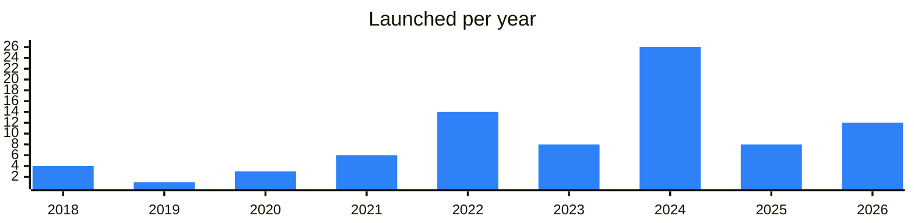

<!-- Generated by scripts/build_readme.py from data/. Do not edit by hand. -->

# CEX

**84 projects: 50 active, 32 quiet, 2 closed.** Back to [all categories](../README.md#categories); statuses are explained [here](../README.md#how-to-read-it). The same list as a [searchable table](../data/by-category/exchanges.csv).

## Active

| # | Project | What it is | Links | Launched | Peak MAU | Verified |
| ---: | --- | --- | --- | --- | ---: | --- |
| 1 |  **Binance** | Binance Official English Group | [Telegram](https://t.me/binance_announcements) [X](https://x.com/binance) [Site](https://www.binance.com) | 2024-06-21 |  | since 2020-06 |
| 2 |  **Bybit** | BYBIT is a trading platform that caters to the needs of all types of traders | [Telegram](https://t.me/bybit_announcements) [X](https://x.com/Bybit_Official) [Site](https://www.bybit.com) | 2022-12-21 |  | since 2023-03 |
| 3 |  **OKX** | Crypto exchange that posts platform announcements, campaigns and Web3 wallet updates in Telegram. | [Telegram](https://t.me/okxannouncements) [Site](https://www.okx.com) [Gram News](https://gramnews.org/apps/okx) | 2026-05-12 |  | since 2024-12 |
| 4 |  **Bitget** | Official Bitget English Announcements Channel | [Telegram](https://t.me/bitget_announcements) [X](https://x.com/bitget) [Site](https://www.bitget.com) [Gram News](https://gramnews.org/apps/bitget) | 2021-07-03 |  | since 2021-12 |
| 5 | **Coinbase** |  | [Site](https://www.coinbase.com) | 2025-11-18 |  |  |
| 6 | **Revolut** |  | [Site](https://www.revolut.com) | 2024-09-13 |  |  |
| 7 |  **HTX** | HTX Official English Group | [Telegram](https://t.me/htx_announcements) [X](https://x.com/TobbotTon) [Site](https://www.htx.com) [Gram News](https://gramnews.org/apps/huobi) | 2017-05-13 |  |  |
| 8 | **KuCoin** | Leading global crypto platform built on trust / 40M+ users worldwide | [Telegram](https://t.me/kucoin_news) [X](https://x.com/KuCoinCom) [Site](https://www.kucoin.com) [GitHub](https://github.com/qutoncash) [Gram News](https://gramnews.org/apps/kucoin) | 2022-12-20 |  |  |
| 9 | **MEXC** | Crypto exchange with a website, a downloadable app and community channels for events and chat. | [Telegram](https://t.me/mexcofficialnews) [X](https://x.com/mexc) [Site](https://www.mexc.com) [Gram News](https://gramnews.org/apps/mexc-cex) | 2026-01-02 |  |  |
| 10 | **bitFlyer** |  | [Site](https://bitflyer.com) | 2026-09-29 |  |  |
| 11 |  **wallex** | Iranian crypto exchange that publishes news and API updates through Telegram channels. | [Telegram](https://t.me/wallexchange) [X](https://x.com/Wallex_ir) [Site](https://wallex.ir) [Gram News](https://gramnews.org/apps/wallex) | 2018-11-27 |  |  |
| 12 |  **اوکی اکسچنج** | Persian-language crypto exchange offering trading of more than 700 digital currencies. | [Telegram](https://t.me/okexir) [Bot](https://t.me/tonairdropfa_bot) [X](https://x.com/okexir) [Site](https://ok-ex.io/) [Gram News](https://gramnews.org/apps/yrdrp-twn-frsy) | 2018-04-08 |  |  |
| 13 |  **Bitpin** | Iranian crypto exchange with a trading app and a Telegram support bot. | [Telegram](https://t.me/bitpin) [X](https://x.com/bitpinmarket) [Site](https://bitpin.ir/) [Gram News](https://gramnews.org/apps/bitpin) | 2022-08-04 |  |  |
| 14 |  **Swapster** | Licensed exchange for storing, swapping and earning crypto, with virtual cards. | [Telegram](https://t.me/swpstr) [Bot](https://t.me/swapsterbot) [X](https://x.com/swapsterteam) [Site](https://swapster.fi) [Gram News](https://gramnews.org/apps/swapster) | 2022-10-13 |  |  |
| 15 |  **Bit2Me** | Spanish-language crypto purchase platform with an educational academy about blockchain. | [Telegram](https://t.me/bit2me_es) [X](https://x.com/Bit2Me) [Site](https://www.bit2me.com) [GitHub](https://github.com/bit2me-devs) [Gram News](https://gramnews.org/apps/bit2me) | 2018-08-13 |  |  |
| 16 | **XCrypto** |  | [Telegram](https://t.me/xcryptoen) [Gram News](https://gramnews.org/apps/xcrypto) | 2026-05-25 |  |  |
| 17 |  **StealthEX** | This is an official Telegram Account of | [Telegram](https://t.me/stealthex) [X](https://x.com/StealthEX_io) [Site](https://stealthex.io/?ref=y83bSWcwSs) [Gram News](https://gramnews.org/apps/stealthex) | 2026-05-06 |  |  |
| 18 |  **Quickex** | Swap $BTC, $ETH, $XMR and other coins at best rate | [Telegram](https://t.me/quickex_en) [X](https://x.com/QuickEx_Tweets) [Site](https://quickex.io/?utm_source=tonapp) [Gram News](https://gramnews.org/apps/quickex) | 2026-04-02 |  |  |
| 19 |  **Exolix Exchange** | Cross-chain swap aggregator connecting over 200 blockchains for non-custodial swaps. | [Telegram](https://t.me/exolixcom) [X](https://x.com/exolix_com) [Site](https://exolix.com/) [Gram News](https://gramnews.org/apps/exolix-exchange) | 2022-12-23 |  |  |
| 20 |  **SwapSpace** | SwapSpace is an instant cryptocurrency exchange aggregator | [Telegram](https://t.me/swapspace) [X](https://x.com/SwapSpaceCo) [Site](https://swapspace.co/) [Gram News](https://gramnews.org/apps/swapspace) | 2026-05-08 |  |  |
| 21 |  **xKuCoin** |  | [Bot](https://t.me/xkucoinbot) [Gram News](https://gramnews.org/apps/xkucoin) | 2024-01-13 | 7.1M | since 2024-11 |
| 22 |  **FixedFloat** | FixedFloat — Instant, fully automatic cryptocurrency exchange with rates tailored to your needs | [Telegram](https://t.me/fixedfloat) [X](https://x.com/fixedfloat) [Site](https://fixedfloat.com/) [Gram News](https://gramnews.org/apps/fixedfloat) | 2023-04-17 |  |  |
| 23 |  **ChangeHero Bot** | A crypto exchange bot with no accounts required | [Telegram](https://t.me/chcryptonews) [Bot](https://t.me/ChangeHeroBot) [X](https://x.com/Changehero_io) [Site](https://changehero.io) [Gram News](https://gramnews.org/apps/changehero-bot) | 2025-10-29 | 3K |  |
| 24 |  **NAGA Everything Trading** | Welcome to the NAGA Everything Trading Community! | [Telegram](https://t.me/naga_everything_trading) [Bot](https://t.me/nagatrading_bot) [X](https://x.com/cedelabs) [Site](https://github.com/cedelabs/cede.store) [Gram News](https://gramnews.org/apps/naga-everything-trading) | 2024-08-13 | 168K |  |
| 25 |  **Bitmit** | Persian-language exchange for buying and selling more than 110 popular cryptocurrencies. | [Telegram](https://t.me/bitmit_co) [X](https://x.com/bitmit_co) [Site](https://bitmit.co/price/TON) [Gram News](https://gramnews.org/apps/bitmit) | 2020-07-29 |  |  |
| 26 |  **LetsExchange.io** | Cryptocurrency exchange with a wide range of cryptocurrencies and networks | [Telegram](https://t.me/letsexchange_io) [Bot](https://t.me/LetsExchange_official_bot) [X](https://x.com/letsexchange_io) [Site](https://letsexchange.io/) [Gram News](https://gramnews.org/apps/letsexchange-io) | 2026-02-17 |  |  |
| 27 |  **COYTX** |  | [Telegram](https://t.me/coytx) [Bot](https://t.me/coytxcombot) [X](https://x.com/coytxcom) [Site](https://coytx.com) [Gram News](https://gramnews.org/apps/coytx) | 2022-10-27 | 113K |  |
| 28 |  **Block Card Future** | Block Card is a TMA system inside Telergam with the TON blockchain | [Telegram](https://t.me/blockcard_bc) [Bot](https://t.me/BlockCardFutureBot) [X](https://x.com/BlockCardTON) [Gram News](https://gramnews.org/apps/block-card-future) | 2024-09-10 |  |  |
| 29 |  **CrystalTrade** | CrystalTrade Crypto Exchange | [Telegram](https://t.me/crystaltradeorg) [Bot](https://t.me/crystaltradebot) [X](https://x.com/crystaltradeorg) [Site](https://crystal-trade.org/) [Gram News](https://gramnews.org/apps/crystaltrade) | 2024-02-19 |  |  |
| 30 |  **Dex-Trade** |  | [Telegram](https://t.me/dex_trade) [Bot](https://t.me/dex_trade_com_bot) [X](https://x.com/dextrade_) [Site](https://dex-trade.com/) [Gram News](https://gramnews.org/apps/dex-trade) | 2020-05-02 |  |  |
| 31 |  **Xgram** | Xgram is a service for fast and secure cryptocurrency exchange | [Telegram](https://t.me/xgram_io) [Bot](https://t.me/xgram_io_bot) [X](https://x.com/xgram_io) [Site](https://xgram.io/) [Gram News](https://gramnews.org/apps/xgram) | 2026-01-10 | 23K |  |
| 32 |  **AlwaysMoney Exchange** | Блог про крипту, финансы, саморазвитие | [Telegram](https://t.me/alwaysmoneyorg) [X](https://x.com/AlwaysMoneyOrg) [Site](https://alwaysmoney.org/) [Gram News](https://gramnews.org/apps/alwaysmoney-exchange) | 2025-06-13 |  |  |
| 33 |  **CoinCraddle** | CoinCraddle — crypto exchange without registration | [Telegram](https://t.me/coincraddle_en) [Bot](https://t.me/coincraddle_change_bot) [X](https://x.com/coincraddle) [Site](https://coincraddle.com/) [Gram News](https://gramnews.org/apps/coincraddle) | 2024-05-14 |  |  |
| 34 |  **TONBANKCARD Exchange** | TONBANKCARD – crypto exchange in Telegram | [Telegram](https://t.me/tonbankcard) [X](https://x.com/tonbankcard) [Site](https://exchange.tonbankcard.com) [GitHub](https://github.com/xlabtg) [Gram News](https://gramnews.org/apps/tonbankcard-exchange) | 2024-11-19 |  |  |
| 35 |  **Explace** | Cryptocurrency exchange listing over 2000 coins with live support and quick swaps. | [Telegram](https://t.me/explaceio) [X](https://x.com/Explaceio) [Site](https://explace.io/) [Gram News](https://gramnews.org/apps/explace) | 2024-09-26 |  |  |
| 36 | **Bitstorage** |  | [Telegram](https://t.me/bitstoragefinancechannel) [X](https://x.com/BitstorageFin) [Site](https://bitstorage.finance/) [Gram News](https://gramnews.org/apps/bitstorage) | 2026-08-08 |  |  |
| 37 | **Gate** |  | [Site](https://www.gate.io) [Gram News](https://gramnews.org/apps/gate-io) | 2021-10-25 |  |  |
| 38 |  **WhiteBIT** | European cryptocurrency exchange publishing news and updates for its users. | [Telegram](https://t.me/whitebit) [X](https://x.com/WhiteBit) [Site](https://whitebit.com) [GitHub](https://github.com/whitebit-exchange) | 2024-03-14 |  | since 2022-04 |
| 39 |  **HashKey Global** | Licensed digital asset exchange announcements channel | [Telegram](https://t.me/hashkeyglobal_announcement) | 2024-08-03 |  |  |
| 40 |  **BitMart** | Cryptocurrency exchange channel with announcements and links to its social accounts. | [Telegram](https://t.me/bitmartexchange_channel) [X](https://x.com/BitMartExchange) [Site](https://bitmart.com) [GitHub](https://github.com/bitmartexchange) | 2021-10-12 |  |  |
| 41 |  **KuCoin Russia** | Russian news channel of KuCoin exchange | [Telegram](https://t.me/kucoinrussiannews) [X](https://x.com/KuCoin_Web3) | 2021-11-16 |  |  |
| 42 |  **GOPAX** | Official channel of the GOPAX crypto exchange | [Telegram](https://t.me/gopaxkr_official) | 2024-02-15 |  |  |
| 43 |  **Bitrue** | Announcements channel of the Bitrue exchange | [Telegram](https://t.me/bitrue_official) | 2020-05-07 |  |  |
| 44 |  **BingX** | Empowering Traders. Elevate your crypto trading game at BingX | [Telegram](https://t.me/bingxofficial) [X](https://x.com/BingXOfficial) [Site](https://bingx.com) | 2024-07-08 |  | since 2022-09 |
| 45 |  **Bitunix** | Global Crypto Derivatives Exchange. Better Liquidity, Better Trading | [Telegram](https://t.me/bitunixglobal) [X](https://x.com/BitunixOfficial) [Site](https://www.bitunix.com) | 2024-08-27 |  | since 2024-06 |
| 46 | **BloFin** | Trade with Next-gen Experience, Profit from Functioning Strategies, and Keep Your Crypto Safe | [X](https://x.com/BloFin_Official) [Site](https://blofin.com) | 2024-08-26 |  |  |
| 47 | **HashKey Exchange** | HashKey Exchange is a centralized cryptocurrency exchange established in 2018 and is registered in Hong Kong | [X](https://x.com/HashKeyExchange) [Site](https://www.hashkey.com) | 2024-06-20 |  |  |
| 48 |  **LeveX** | LeveX is a centralized crypto exchange offering both spot and leveraged futures trading with integrated social trading features and multi-position management tools for traders | [Telegram](https://t.me/levexalerts) [X](https://x.com/LeveX) [Site](https://levex.com/en/assets/proof-of-reserve) | 2025-11-28 |  |  |
| 49 |  **SwissBorg** | Making crypto wealth management accessible to everyone | [Telegram](https://t.me/swissborg) [X](https://x.com/swissborg) [Site](https://swissborg.com) | 2022-11-18 |  | yes |
| 50 |  **WEEX** | WEEX is a global cryptocurrency trading platform founded in 2018, serving users in 150+ countries. It offers spot and futures trading across thousands of pairs, including futures markets with leverage | [Telegram](https://t.me/weexglobal) [X](https://x.com/WEEX_Official) [Site](https://www.weex.com/) | 2026-01-02 |  |  |

<b>Quiet: 32</b>

| # | Project | What it is | Links | Launched | Peak MAU | Verified |
| ---: | --- | --- | --- | --- | ---: | --- |
| 51 |  **Nominex Exchange App** | Nominex - crypto exchange with an internal token NMX distributed via YieldFarming | [Telegram](https://t.me/NominexExchange) [Bot](https://t.me/nominex_exchange_bot) [X](https://x.com/NominexExchange) [Site](https://nominex.io) [Gram News](https://gramnews.org/apps/nominex-exchange-app) | 2018-04-24 | 117K |  |
| 52 | **90Rich** |  | [Telegram](https://t.me/Channel_90Rich) Site (down) [Gram News](https://gramnews.org/apps/90rich) | 2025-04-09 |  |  |
| 53 |  **Aliniex** | Official bot of the Aliniex exchange | [Bot](https://t.me/aliniex_bot) | 2025-04-09 |  |  |
| 54 | **Arkham Exchange** | Arkham is a centralized cryptocurrency exchange offering both Spot & Perps and is incorporated in the Dominican Republic | [X](https://x.com/ArkhamIntel) [Site](https://arkm.com/) | 2024-11-25 |  |  |
| 55 |  **Azbit** |  | [Bot](https://t.me/TON_NFT_Market_HYBRA_bot) [Site](https://azbit.com) [Gram News](https://gramnews.org/apps/azbit) | 2023-02 |  |  |
| 56 |  **Biconomy.com** |  | [Telegram](https://t.me/Biconomycom) [X](https://x.com/BiconomyCom) [Site](https://www.biconomy.com/en) [Gram News](https://gramnews.org/apps/biconomy-com) | 2023-01-11 |  |  |
| 57 | **BIT** |  | [X](https://x.com/BITofficial_EN) [Site](https://www.bit.com) [Gram News](https://gramnews.org/apps/bit) | 2023-07-18 |  |  |
| 58 |  **BIT.com** | Official English community group of the BIT crypto exchange | [Telegram](https://t.me/bitcom_exchange) | 2022-01-23 |  |  |
| 59 |  **BitcoinVN** |  | [Telegram](https://t.me/bitcoinvn_community) [X](https://x.com/bitcoinvn_io) [Site](https://bitcoinvn.io) [Gram News](https://gramnews.org/apps/bitcoinvn) | 2014-03-06 |  |  |
| 60 |  **Bitkub** | No.1 licensed bitcoin exchange in Thailand that offers services to individuals who intend to buy, sell cryptocurrency | [Telegram](https://t.me/bitkubofficial) [X](https://x.com/BitkubOfficial) [Site](https://www.bitkub.com/) | 2024-12-19 |  | since 2022-11 |
| 61 | **BitMart CIS** | Official Russian-language community chat of the BitMart exchange | [Telegram](https://t.me/bitmartcis) | 2023-08-16 |  |  |
| 62 | **BYDFi** |  | [Site](https://www.bydfi.com/) [Gram News](https://gramnews.org/apps/bydfi) | 2022-12 |  |  |
| 63 |  **CEDEX** | cedex.io is a seamless way to exchange crypto Got questions? | [Telegram](https://t.me/cedex_io) | 2024-07-03 |  |  |
| 64 | **CoinEx** |  | [Site](https://www.coinex.com/) [Gram News](https://gramnews.org/apps/coinex) | 2023-04 |  |  |
| 65 | **Cryptobotex** |  | [Gram News](https://gramnews.org/apps/cryptobotex) | 2022-11-30 |  |  |
| 66 | **DigiFinex** |  | [Site](https://www.digifinex.com) [Gram News](https://gramnews.org/apps/digifinex) | 2024-01 |  |  |
| 67 | **Dualcoin** |  | [Site](https://dualcoin.io/en) [Gram News](https://gramnews.org/apps/dualcoin) | 2023-09 |  |  |
| 68 |  **EXMO** | Официальный Telegram канал криптовалютной платформы EXMO.me | [Telegram](https://t.me/exmome_official) [Bot](https://t.me/GrinderyAIBot) [Site](https://exmo.me/trade/ton_usdt) [GitHub](https://github.com/grindery-io) [Gram News](https://gramnews.org/apps/exmo) | 2024-10-22 | 765K |  |
| 69 |  **Flipster** | Flipster has a wide selection of over 300 perpetual futures listings, including Bitcoin (BTC) and Ethereum (ETH), that can be traded with leverage of up to 100x | [Telegram](https://t.me/flipster_io) [X](https://x.com/flipster_io) [Site](https://flipster.io) | 2024-05-10 |  |  |
| 70 |  **Gate.io** | International English chat of the Gate.io exchange | [Telegram](https://t.me/gateio) | 2021-10-14 |  | since 2022-07 |
| 71 |  **Kraken** | Official community chat of the Kraken crypto exchange | [Telegram](https://t.me/kraken_exchange_official) | 2025-12-18 |  |  |
| 72 |  **KuCoin GemSpace** | KuCoin hub for new listings and promotions | [Telegram](https://t.me/kucoingemspace) | 2024-09-07 |  |  |
| 73 |  **KuCoin TON** | Official KuCoin group for TON events | [Telegram](https://t.me/kucointongroup) | 2022-12-21 |  |  |
| 74 | **Matrixport** |  | [Site](https://www.matrixport.com/) [Gram News](https://gramnews.org/apps/matrixport) | 2019-05-22 |  |  |
| 75 |  **NovaDax** |  | [Telegram](https://t.me/livehub_to) [X](https://x.com/livehub_to) [Site](https://www.novadax.com.br/product/orderbook?pair=TON_BRL) [Gram News](https://gramnews.org/apps/novadax) | 2024-12-28 |  |  |
| 76 |  **OKX Explorer** |  | [Telegram](https://t.me/OKXOfficial_English) [X](https://x.com/okxexplorer) [Site](https://www.okx.com/web3/explorer) [Gram News](https://gramnews.org/apps/okx-explorer) | 2024-07-15 |  | since 2022-01 |
| 77 | **OSL Exchange** | OSL Digital Securities is Hong Kong’s first and most established SFC-licensed and insured digital asset exchange. Operating since 2018, the platform provides institutional-grade digital asset services | [X](https://x.com/OSL_HK) [Site](https://www.osl.com/en) | 2026-01-13 |  |  |
| 78 |  **Phemex** | Official chat of the Phemex crypto exchange | [Telegram](https://t.me/phemex_en) | 2022-10-25 |  | yes |
| 79 | **Websea** | Websea provides a comprehensive suite of trading and financial products, including Spot Trading, Futures Trading, Standard Copy Trading | [X](https://x.com/webseaofficial) [Site](https://www.websea.com/) | 2022-04-24 |  |  |
| 80 |  **Excoino** | Persian-language crypto exchange operated by a knowledge-based Iranian company. | [Telegram](https://t.me/excoino) [Bot](https://t.me/tonbuytechbot) [X](https://x.com/excoino) [Site](https://excoino.com) [Gram News](https://gramnews.org/apps/excoino) | 2022-06-29 |  |  |
| 81 |  **ONUS** | Announcements of ONUS finance app | [Telegram](https://t.me/onus_globalchannel) | 2021-11-22 |  | since 2024-01 |
| 82 |  **Bitdealer** | Official Bitdealer news channel | [Telegram](https://t.me/bitdealernews) | 2025-08-31 |  |  |

<b>Closed: 2</b>

| # | Project | What it is | Links | Launched | Peak MAU | Verified |
| ---: | --- | --- | --- | --- | ---: | --- |
| 83 | **LBank Exchange** |  | Site (down) [Gram News](https://gramnews.org/apps/lbank-exchange) | 2024-05-15 |  |  |
| 84 | **Neocrypto** |  | [Site](https://neocrypto.net) | 2023-07 |  |  |

