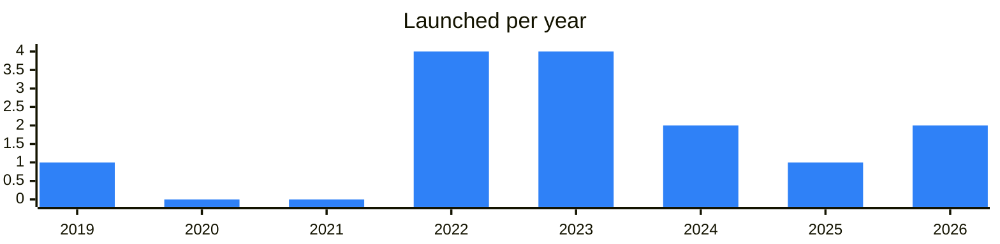

<!-- Generated by scripts/build_readme.py from data/. Do not edit by hand. -->

# Explorers

**14 projects: 6 active, 8 quiet, 0 closed.** Back to [all categories](../README.md#categories); statuses are explained [here](../README.md#how-to-read-it). The same list as a [searchable table](../data/by-category/explorers.csv).

## Active

| # | Project | What it is | Links | Launched | Peak MAU | Verified |
| ---: | --- | --- | --- | --- | ---: | --- |
| 1 |  **Tonscan.org** | Validator channel for The Open Network with news, services and announcements. | [Telegram](https://t.me/catchain) [Site](https://tonscan.org) [Gram News](https://gramnews.org/apps/tonscan) | 2019-01-28 |  |  |
| 2 | **Tonviewer** |  | [X](https://x.com/bestramp_io) [Site](https://tonviewer.com) [Gram News](https://gramnews.org/apps/tonviewer) | 2023-05-20 |  |  |
| 3 | **Tonscan.com** |  | [Site](https://tonscan.com) [Gram News](https://gramnews.org/apps/tonscan-com) | 2023-05-02 |  |  |
| 4 | **Actonscan** | An open-source TON explorer by TON Core — accounts, transactions, blocks, tokens and collectibles | [Site](https://actonscan.com) [Gram News](https://gramnews.org/apps/actonscan) | 2026-06-06 |  |  |
| 5 |  **TON NFT Explorer** | Channel with concentrated news from the TON blockchain world. | [Telegram](https://t.me/this_is_ton) [Site](https://explorer.tonnft.tools) [Gram News](https://gramnews.org/apps/ton-nft-explorer) | 2022-01-07 |  |  |
| 6 | **TonScan.info** |  | [Site](https://tonscan.info) | 2022-03-14 |  |  |

<b>Quiet: 8</b>

| # | Project | What it is | Links | Launched | Peak MAU | Verified |
| ---: | --- | --- | --- | --- | ---: | --- |
| 7 | **3xpl** |  | [X](https://x.com/3xplcom) [Site](https://3xpl.com/ton) [GitHub](https://github.com/3xplcom) [Gram News](https://gramnews.org/apps/3xpl) | 2026-04-28 |  |  |
| 8 | **Dton** |  | [Site](https://dton.io) [GitHub](https://github.com/StalinFoundation) [Gram News](https://gramnews.org/apps/dton) | 2023-08-09 |  |  |
| 9 |  **G-LABS Explorer** | NFT explorer bot by G-LABS | [Bot](https://t.me/glabs_explorer_bot) | 2022-05-05 |  |  |
| 10 | **Scaleton** |  | [Site](https://explorer.scaleton.io/connect) [Gram News](https://gramnews.org/apps/scaleton) | 2023-08 |  |  |
| 11 |  **TON Atlas** |  | [Bot](https://t.me/tonatlasbot) [Site](https://8xr.io) [Gram News](https://gramnews.org/apps/tonatlasbot) | 2024-07-12 |  |  |
| 12 |  **TON Moon Explorer** | Explorer and NFT bot on TON | [Bot](https://t.me/tonmoonbot) | 2022-01-23 |  |  |
| 13 | **TxTracer** | Tool to emulate and trace any transaction from TON blockchain | [Site](https://txtracer.ton.org) | 2025-05-14 |  |  |
| 14 | **Whales Explorer** |  | [Site](https://tonwhales.com/explorer) [GitHub](https://github.com/tonwhales) [Gram News](https://gramnews.org/apps/whales-explorer) | 2024-10-22 |  |  |

