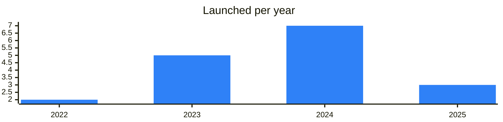
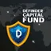

<!-- Generated by scripts/build_readme.py from data/. Do not edit by hand. -->

# Funds

**19 projects: 1 active, 18 quiet, 0 closed.** Back to [all categories](../README.md#categories); statuses are explained [here](../README.md#how-to-read-it). The same list as a [searchable table](../data/by-category/funds.csv).

## Active

| # | Project | What it is | Links | Launched | Peak MAU | Verified |
| ---: | --- | --- | --- | --- | ---: | --- |
| 1 |  **Redo Invest** | Onchain investment project in TON | [Telegram](https://t.me/redoinveston) [X](https://x.com/redoinveston) [Site](https://redoifoundation.org) | 2024-08-19 |  |  |

<b>Quiet: 18</b>

| # | Project | What it is | Links | Launched | Peak MAU | Verified |
| ---: | --- | --- | --- | --- | ---: | --- |
| 2 | **Animoca Brands** |  | [X](https://x.com/animocabrands) [Site](https://www.animocabrands.com) | 2023-11-28 |  |  |
| 3 | **CoinFund** |  | [X](https://x.com/coinfund) [Site](https://coinfund.io) | 2025-03-20 |  |  |
| 4 |  **Cypher Capital** |  | [Telegram](https://t.me/cyphercapital) [X](https://x.com/cypher_capital) [Site](https://www.cyphercapital.com) | 2023-05 |  |  |
| 5 |  **DeFinder Capital** | Crypto fund investing in TON projects | [Telegram](https://t.me/dfcfund) | 2023-12-11 |  |  |
| 6 |  **DWF Labs** | Crypto investment firm that publishes investments, collaborations and project updates. | [Telegram](https://t.me/dwflabs) [X](https://x.com/DWFLabs) [Site](https://www.dwf-labs.com) | 2022-11-17 |  |  |
| 7 | **Folius Ventures** |  | [X](https://x.com/FoliusVentures) [Site](https://www.folius.ventures) | 2024-07 |  |  |
| 8 |  **Impossible Finance** | DeFi project with an official English community group and announcement channel. | [Telegram](https://t.me/impossiblefinance) [X](https://x.com/impossible_) [Site](https://www.impossible.finance) |  |  |  |
| 9 | **Kingsway Capital** |  |  | 2025-03-20 |  |  |
| 10 | **Mechanism Capital** |  | [X](https://x.com/MechanismCap) [Site](https://www.mechanism.capital) |  |  |  |
| 11 |  **OKX Ventures** | Investment arm of the OKX cryptocurrency exchange. | [Telegram](https://t.me/okxventures) [X](https://x.com/okx_ventures) [Site](https://www.okx.com/ventures) | 2024-10-30 |  |  |
| 12 | **Pantera Capital** |  | [X](https://x.com/PanteraCapital) [Site](https://panteracapital.com) | 2024-05-02 |  |  |
| 13 | **Polymorphic Capital** |  | [X](https://x.com/polymorphiccap) [Site](https://polymorphic.capital) | 2025-01 |  |  |
| 14 |  **TON Ventures** | Venture fund channel publishing articles and news about TON investments. | [Telegram](https://t.me/ton_ventures) [X](https://x.com/TON_Ventures) | 2024-08-14 |  |  |
| 15 | **TONcoin.Fund** |  | [X](https://x.com/toncoinfund) [Site](https://toncoin.fund) | 2022-04-11 |  |  |
| 16 |  **TVM Ventures** | Venture fund focused on bringing DeFi to mobile users. | [Telegram](https://t.me/tvmventures) [X](https://x.com/tvm_ventures) [Site](https://tvm.ventures) | 2024-11 |  |  |
| 17 |  **MemeFund** | Meme fund project with MF token | [Telegram](https://t.me/meme_as_fund) | 2024-04-01 |  |  |
| 18 |  **DeFinder Capital** | Crypto investment fund and community | [Telegram](https://t.me/definder_capital_eng) | 2023-12-01 |  |  |
| 19 |  **Milyman** | TON ecosystem development fund with a diversification strategy | [Telegram](https://t.me/milyman) | 2023-05-22 |  |  |

