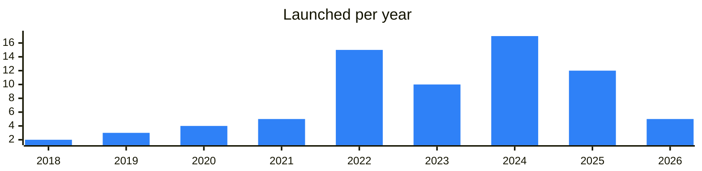
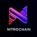
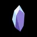
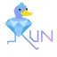
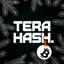

<!-- Generated by scripts/build_readme.py from data/. Do not edit by hand. -->

# Infra

**75 projects: 33 active, 41 quiet, 1 closed.** Back to [all categories](../README.md#categories); statuses are explained [here](../README.md#how-to-read-it). The same list as a [searchable table](../data/by-category/infra.csv).

## Active

| # | Project | What it is | Links | Launched | Peak MAU | Verified |
| ---: | --- | --- | --- | --- | ---: | --- |
| 1 |  **Telegram** | The official Telegram on Telegram. Much recursion. Very Telegram. Wow | [Telegram](https://t.me/telegram) [Site](https://telegram.org) | 2020-01-06 |  | yes |
| 2 | **Fragment** |  | [Site](https://fragment.com) [Gram News](https://gramnews.org/apps/fragment-7kzxik) | 2022-10-27 |  |  |
| 3 |  **TON Core** | Development team channel for open-source technologies of The Open Network. | [Telegram](https://t.me/toncore) [Site](https://ton.org) | 2024-11-06 |  | since 2020-01 |
| 4 |  **Acton** | A unified command-line toolchain for TON smart contracts in Tolk — project setup, tests, debugging, deployment and verification | [Telegram](https://t.me/theopentooling) [Site](https://ton-blockchain.github.io/acton/) [GitHub](https://github.com/ton-blockchain/acton) [Gram News](https://gramnews.org/apps/acton) | 2025-07-17 |  |  |
| 5 | **Tolk** | Channel devoted to TOLK — "next-generation FunC" — a language for writing smart contracts in TON | [Telegram](https://t.me/tolk_lang) [Site](https://docs.ton.org/v3/documentation/smart-contracts/tolk/overview) | 2024-08-05 |  |  |
| 6 | **Pyth** |  | [Site](https://www.pyth.network) | 2020-12-01 |  |  |
| 7 |  **RedStone** | A modular oracle delivering data for DeFi to EVM and non-EVM chains, TON included | [Telegram](https://t.me/redstonefinance) [Site](https://www.redstone.finance) [GitHub](https://github.com/redstone-finance) [Gram News](https://gramnews.org/apps/redstone) | 2021-04-30 |  |  |
| 8 | **TON Multisig** |  | [Site](https://multisig.ton.org) | 2024-01-23 |  |  |
| 9 |  **TON Developers** | Community for TON developers covering smart contracts, tooling and updates. | [Telegram](https://t.me/tondevs_tg) | 2026-08-07 |  |  |
| 10 | **FunC** |  | [Site](https://docs.ton.org/v3/documentation/smart-contracts/func/overview) | 2019-09-07 |  |  |
| 11 | **Tact** |  | [Site](https://tact-lang.org) | 2022-05-26 |  |  |
| 12 | **Blueprint** |  | [Site](https://github.com/ton-org/blueprint) | 2023-01-17 |  |  |
| 13 |  **Toncenter** | Fast HTTP API for the TON blockchain with its own announcement channel. | [Telegram](https://t.me/toncenter_news) [Site](https://toncenter.com) [GitHub](https://github.com/toncenter/ton-http-api) | 2022-01-22 |  |  |
| 14 |  **TonAPI** | API and developer console for accessing the TON blockchain. | [Telegram](https://t.me/tonconsole_com) [Site](https://tonconsole.com) [GitHub](https://github.com/tonkeeper) [Gram News](https://gramnews.org/apps/ton-api) | 2022-05-31 |  |  |
| 15 | **TON Connect** |  | [Site](https://github.com/ton-connect) | 2022-09-20 |  |  |
| 16 | **Wallet Connect** |  | [Site](https://walletconnect.network) | 2018-06-20 |  |  |
| 17 | **TON DNS** |  | [Site](https://dns.ton.org) [GitHub](https://github.com/ton-blockchain) | 2022-06-30 |  |  |
| 18 | **TON Storage** |  | [Site](https://docs.ton.org/v3/guidelines/web3/ton-storage/storage-daemon) | 2023-01-04 |  |  |
| 19 | **MyTonCtrl** |  | [Site](https://github.com/ton-blockchain/mytonctrl) | 2020-01-31 |  |  |
| 20 | **TON Verifier** |  | [Site](https://verifier.ton.org) [GitHub](https://github.com/ton-blockchain/verifier) [Gram News](https://gramnews.org/apps/ton-verifier) | 2022-10-24 |  |  |
| 21 |  **Cocoon** | A decentralized network for confidential AI inference — GPU owners are paid in TON for processing requests, and Telegram is named as its first major customer | [Telegram](https://t.me/cocoon) [Site](https://cocoon.org) [GitHub](https://github.com/TelegramMessenger/cocoon) [Gram News](https://gramnews.org/apps/cocoon) | 2025-10-29 |  | since 2025-10 |
| 22 |  **BotFather** | BotFather is the one bot to rule them all. Use it to create new bot accounts and manage your existing bots | [Bot](https://t.me/botfather) | 2016-01-14 | 10.2M | since 2020-06 |
| 23 |  **TeQoin Wallet** | Welcome to TeQoin Blockchain! Telegram | [Telegram](https://t.me/teqoin) [Bot](https://t.me/teqoin_wallet_bot) [X](https://x.com/teqoin) [Site](https://teqoin.io) [GitHub](https://github.com/TeQoin-Blockchain) | 2026-03-29 |  | yes |
| 24 |  **DuckChain** | DuckChain is a service for staking and bridging crypto assets | [Telegram](https://t.me/duckchainann) [Bot](https://t.me/duckchain_bot) [X](https://x.com/duck_chain) [Site](https://bridge.duckchain.io) [Gram News](https://gramnews.org/apps/duckchain) | 2024-06-15 | 15.4M |  |
| 25 |  **DuckChain Token (DUCK)** | The Telegram AI Chain. Empowering Telegram users to enter crypto through AI, EVM, and beyond | [Telegram](https://t.me/DuckChainAnn) [X](https://x.com/Duck_Chain) [Site](https://bridge.duckchain.io) | 2024-02-25 |  |  |
| 26 |  **XOOB** | Web3 growth infrastructure network | [Telegram](https://t.me/xoob_announcement) | 2025-02-01 |  |  |
| 27 |  **4EVERLAND Bot** | The Powerful AI Cloud Platform for Web3. Backed by , Arweave, and IPFS! | [Telegram](https://t.me/Announcements4EVERLAND) [Bot](https://t.me/tg_4everland_bot) [X](https://x.com/4everland_org) [Site](https://4everland.org) [GitHub](https://github.com/4everland) [Gram News](https://gramnews.org/apps/4everland-bot) | 2021-07-19 | 922K |  |
| 28 |  **SOREN** | SOREN is a digital identity layer on the TON blockchain | [Telegram](https://t.me/SORENCHANNEL) [X](https://x.com/ownsoren) [Site](https://www.soren.today/) [Gram News](https://gramnews.org/apps/soren) | 2025-06-10 |  |  |
| 29 |  **NitroChain** | NitroChain — blockchain infrastructure for fast and low-cost transactions | [Telegram](https://t.me/NitrochainNews) [Bot](https://t.me/nitrochainbot) [X](https://x.com/Nitrochainapp) [Site](https://nitrochain.space/) [Gram News](https://gramnews.org/apps/nitrochain) | 2023-12-07 | 5K |  |
| 30 |  **Chainbase Network** | Data network for AI built on blockchain data, with an API and website. | [Telegram](https://t.me/chainbasenetwork) [X](https://x.com/ChainbaseHQ) [Site](https://chainbase.com) [GitHub](https://github.com/chainbase-labs) [Gram News](https://gramnews.org/apps/chainbase-network) | 2025-07-10 |  |  |
| 31 |  **DTON GraphQL** |  | [Telegram](https://t.me/tvorogme) [GitHub](https://github.com/disintar) | 2023-10-04 |  |  |
| 32 |  **NOWNodes** | RPC & node infrastructure for 120+ blockchains, with human support | [Telegram](https://t.me/nownodes) [X](https://x.com/NowNodes) [GitHub](https://github.com/NOWNodes) | 2019-05-15 |  | since 2023-10 |
| 33 |  **TON Access** | Decentralized RPC access to TON provided by the Orbs network. | [Telegram](https://t.me/orbsnetwork) [GitHub](https://github.com/orbs-network) | 2022-08-29 |  | since 2023-08 |

<b>Quiet: 41</b>

| # | Project | What it is | Links | Launched | Peak MAU | Verified |
| ---: | --- | --- | --- | --- | ---: | --- |
| 34 |  **NexaBit AI** | L3 AI blockchain powered by Arkham Intelligence and OpenAI | [Telegram](https://t.me/nexabitHQ) [Bot](https://t.me/NexaBit_Tap_bot) [X](https://x.com/nexabitHQ) [Site](https://nexabit.web.app) [Gram News](https://gramnews.org/apps/nexabit-ai) | 2024-05-15 | 39 |  |
| 35 |  **Ancient8** | Gaming-focused Ethereum Layer 2 | [Telegram](https://t.me/ancient8_gg) | 2021-09-25 |  |  |
| 36 |  **Apex Fusion Telegram App** | The Apex Fusion Telegram app is an interactive tool that helps users engage with the Apex Fusion ecosystem | [Bot](https://t.me/apexfusion_bot) | 2025-02-10 | 37K |  |
| 37 |  **Athene Network** | Athene Network - Leading The Future Of AI And Blockchain Website: X: Mini app: https | [Telegram](https://t.me/athenenetwork_ann) | 2024-10-15 |  |  |
| 38 |  **Chainlink** | Official Chainlink oracle community | [Telegram](https://t.me/chainlinkofficial) | 2021-08-10 |  | since 2022-03 |
| 39 |  **Chainstack** | Managed RPC nodes with geo balancing | [Telegram](https://t.me/chainstack) [Site](https://chainstack.com/build-better-with-ton/) | 2014-11-26 |  | yes |
| 40 |  **DATS** | You can start the app with /start command | [Bot](https://t.me/datsapp_bot) | 2024-10-07 | 195K |  |
| 41 |  **DeepLink Protocol** | Decentralized AI cloud gaming and GPU protocol | [Telegram](https://t.me/deeplinkglobal) | 2024-05-21 |  |  |
| 42 |  **DeepSafe** | The first CRVA (Crypto Random Verification Agent) solution, leveraging MPC, ZKP, TEE, and Ring-VRF, creates a secure verification network for blockcha | [Telegram](https://t.me/deepsafe_official) | 2025-01-03 |  |  |
| 43 |  **GetBlock** | Premium infrastructure provider for Web3 and AI, 130+ networks, AML, Data Streams, and more | [Telegram](https://t.me/getblockio_eng) [X](https://x.com/getblockio) | 2019-10-23 |  |  |
| 44 |  **Ghost Drive 369** | Building a Web3 future where you own your data • Private AI • Encrypted streaming • Driven by the community via Drive 369 DAO | [Telegram](https://t.me/drive369_dao) | 2024-07-08 |  |  |
| 45 |  **Gram of TON** | Native token channel of the TON blockchain | [Telegram](https://t.me/gram) | 2018-05-04 |  |  |
| 46 |  **Gram-20** | Inscription token standard on the TON blockchain | [Bot](https://t.me/gram20bot) | 2023-12-22 |  |  |
| 47 |  **JAMTON** | Layer 2 for TON with TON/DOT liquid staking | [Bot](https://t.me/jamtonappbot) | 2024-12-20 |  |  |
| 48 |  **Lumia App** |  | [Bot](https://t.me/lumiaappbot) | 2025-01-05 |  |  |
| 49 |  **Matchain** | Staking is live: Official Chat Farm now with our Bot Official links | [Telegram](https://t.me/matchain_fam) | 2024-08-29 |  |  |
| 50 |  **NeOn** | Marketplace for remote AI GPUs | [Bot](https://t.me/neonvc_bot) | 2026-05-21 | 127K |  |
| 51 | **orbs-network/ton-access** | Decentralized RPC access library for TON nodes. | [GitHub](https://github.com/orbs-network/ton-access) | 2022-08-29 |  |  |
| 52 |  **Orochi Network** | Verifiable data infrastructure | [Telegram](https://t.me/orochinetwork) | 2024-04-16 |  |  |
| 53 |  **Pyth Network** | First-party oracle for financial data | [Telegram](https://t.me/pyth_network) | 2024-11-12 |  |  |
| 54 |  **Resistance Storage Bot** | Free TON Storage Provider Bag Explorer Mini-App Decentralized Storage Indexer piracy.ton | [Bot](https://t.me/resistoragebot) | 2025-11-08 |  |  |
| 55 |  **Shard.Zone** | Lightweight inscription protocol based on TON and inspired by the Ordinals NFT on Bitcoin | [Telegram](https://t.me/tonshardzone) [X](https://x.com/ShardMarket) | 2023-12-20 |  |  |
| 56 |  **The Open Network** | Archived official channel of the TON blockchain | [Telegram](https://t.me/tonblockchain) | 2021-01-11 |  |  |
| 57 |  **titon.network** | Shared security stack for TON | [Telegram](https://t.me/titonnet) [X](https://x.com/titonnet) [Site](https://titon.network) [Gram News](https://gramnews.org/apps/titon-network) | 2026-04-28 |  |  |
| 58 | **TON Domains** | Naming service that maps a readable domain to a crypto wallet address. | [Site](https://dns.ton.org/) | 2022-07-30 |  |  |
| 59 |  **TON Factory** | Scalability accelerator for the TVM ecosystem | [Telegram](https://t.me/tonfactory_news) | 2025-04-30 |  |  |
| 60 |  **TON Help** | Technical support for TON bridge, vesting and multisig | [Bot](https://t.me/ton_help_bot) | 2022-07-30 |  | since 2023-03 |
| 61 |  **TON Search Engine** | Search engine for the TON network with its own channel. | [Telegram](https://t.me/runner_ton) | 2023-08-21 |  |  |
| 62 |  **TON Status** | Technical notifications for TON validators and developers | [Telegram](https://t.me/tonstatus) | 2020-05-06 |  |  |
| 63 | **TON Torrents** | Torrent service from the Tonutils tools channel for the TON network. | [Telegram](https://t.me/tonrh) [GitHub](https://github.com/xssnick/TON-Torrent) | 2023-06-12 |  |  |
| 64 | **TonGo** | TonGo — a .ton domains and subdomains management service | [Site](https://tongo.run) [GitHub](https://github.com/tongochi/DEX) [Gram News](https://gramnews.org/apps/tongo) | 2023-06-28 |  |  |
| 65 | **Tonutils Proxy** | User-friendly TON Proxy implementation | [GitHub](https://github.com/xssnick/Tonutils-Proxy) | 2022-11-18 |  |  |
| 66 |  **Warden Protocol** | Protocol bringing AI to web3 applications and smart contracts | [Telegram](https://t.me/wardenprotocol) | 2025-09-19 |  |  |
| 67 |  **TON Tech** | Core tech organization abstracting blockchain complexity on TON | [Telegram](https://t.me/tontech) [X](https://x.com/TONTechHQ) [GitHub](https://github.com/the-ton-tech) | 2022-05-16 |  |  |
| 68 |  **TON Tech** | Core tech organization abstracting blockchain complexity on TON | [Telegram](https://t.me/tontechru) [X](https://x.com/TONTechHQ) | 2026-04-14 |  |  |
| 69 |  **TeraHash** | Bitcoin-native yield layer bridging hashrate and DeFi | [Telegram](https://t.me/terahash) [X](https://x.com/TeraHash_xyz) | 2025-06-04 |  |  |
| 70 |  **TAC (TAC)** | Token of the TAC project with a Telegram portal channel. | [Telegram](https://t.me/TACbuild) [X](https://x.com/TacBuild) [Site](https://tac.build) | 2024-02-01 |  |  |
| 71 |  **Runecoin Network** | Runecoin Network provides a more comprehensive blockchain ecosystem that combines fun interactions with the power of the TON Blockchain | [Telegram](https://t.me/Runecoin_Network) [Bot](https://t.me/runecoinapp_bot) [X](https://x.com/RuneCoinNetwork) [Site](https://runecoin.network/) | 2024-10-10 | 21K |  |
| 72 |  **Rebalancer** | TON project with English channel and site | [Telegram](https://t.me/rebalancer_en) | 2024-06-25 |  |  |
| 73 | **TON Foundation** | Channel of the foundation supporting the TON blockchain ecosystem. | [Telegram](https://t.me/tonfoundation) | 2023-11-02 |  |  |
| 74 |  **TON Names** | Registers short TON NFT domains that point straight to a wallet, and manages them at tonnames.org | [Telegram](https://t.me/tonnames) [Site](https://tonnames.org) [Gram News](https://gramnews.org/apps/ton-names) | 2022-01-01 |  |  |

<b>Closed: 1</b>

| # | Project | What it is | Closed | Proof |
| ---: | --- | --- | --- | --- |
| 75 | **TON Console (TonAPI)** |  | 2023-06-01 | [archived repository](https://github.com/tonkeeper/tonapi) |

