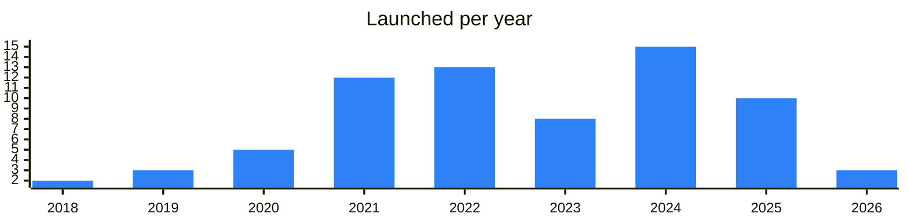

<!-- Generated by scripts/build_readme.py from data/. Do not edit by hand. -->

# Infra

**72 projects: 29 active, 43 quiet, 0 closed.** Back to [all categories](../README.md#categories); statuses are explained [here](../README.md#how-to-read-it). The same list as a [searchable table](../data/by-category/infra.csv).

## Active

| # | Project | What it is | Links | Launched | Peak MAU | Verified |
| ---: | --- | --- | --- | --- | ---: | --- |
| 1 | **Telegram** | The official Telegram on Telegram. Much recursion. Very Telegram. Wow | [Telegram](https://t.me/telegram) [Site](https://telegram.org) | 2020-01-06 |  | yes |
| 2 | **Fragment** |  | [Site](https://fragment.com) [Gram News](https://gramnews.org/apps/fragment-7kzxik) | 2022-10-27 |  |  |
| 3 | **TON Core** |  | [Telegram](https://t.me/toncore) [Site](https://ton.org) | 2024-11-06 |  | since 2020-01 |
| 4 | **Acton** | A unified command-line toolchain for TON smart contracts in Tolk — project setup, tests, debugging, deployment and verification | [Telegram](https://t.me/theopentooling) [Site](https://ton-blockchain.github.io/acton/) [GitHub](https://github.com/ton-blockchain/acton) [Gram News](https://gramnews.org/apps/acton) | 2025-07-17 |  |  |
| 5 | **Tolk** | Channel devoted to TOLK — "next-generation FunC" — a language for writing smart contracts in TON | [Telegram](https://t.me/tolk_lang) [Site](https://docs.ton.org/v3/documentation/smart-contracts/tolk/overview) | 2024-08-05 |  |  |
| 6 | **Pyth** |  | [Site](https://www.pyth.network) | 2020-12-01 |  |  |
| 7 | **RedStone** | A modular oracle delivering data for DeFi to EVM and non-EVM chains, TON included | [Telegram](https://t.me/redstonefinance) [Site](https://www.redstone.finance) [GitHub](https://github.com/redstone-finance) [Gram News](https://gramnews.org/apps/redstone) | 2021-04-30 |  |  |
| 8 | **TON Multisig** |  | [Site](https://multisig.ton.org) | 2024-01-23 |  |  |
| 9 | **TON Developers** |  | [Telegram](https://t.me/tondevs_tg) | 2026-08-07 |  |  |
| 10 | **FunC** |  | [Site](https://docs.ton.org/v3/documentation/smart-contracts/func/overview) | 2019-09-07 |  |  |
| 11 | **Tact** |  | [Site](https://tact-lang.org) | 2022-05-26 |  |  |
| 12 | **Blueprint** |  | [Site](https://github.com/ton-org/blueprint) | 2023-01-17 |  |  |
| 13 | **Toncenter** |  | [Telegram](https://t.me/toncenter_news) [Site](https://toncenter.com) [GitHub](https://github.com/toncenter/ton-http-api) | 2022-01-22 |  |  |
| 14 | **TonAPI** |  | [Telegram](https://t.me/tonconsole_com) [X](https://x.com/Grokton) [Site](https://tonconsole.com) [GitHub](https://github.com/tonkeeper) [Gram News](https://gramnews.org/apps/ton-api) | 2022-05-31 |  |  |
| 15 | **TON Connect** |  | [Site](https://github.com/ton-connect) | 2022-09-20 |  |  |
| 16 | **Wallet Connect** |  | [Site](https://walletconnect.network) | 2018-06-20 |  |  |
| 17 | **TON DNS** |  | [Site](https://dns.ton.org) [GitHub](https://github.com/ton-blockchain) | 2022-06-30 |  |  |
| 18 | **TON Storage** |  | [Site](https://docs.ton.org/v3/guidelines/web3/ton-storage/storage-daemon) | 2023-01-04 |  |  |
| 19 | **MyTonCtrl** |  | [Site](https://github.com/ton-blockchain/mytonctrl) | 2020-01-31 |  |  |
| 20 | **TON Verifier** |  | [X](https://x.com/LevelQFinance) [Site](https://verifier.ton.org) [GitHub](https://github.com/ton-blockchain/verifier) [Gram News](https://gramnews.org/apps/ton-verifier) | 2022-10-24 |  |  |
| 21 | **Cocoon** | A decentralized network for confidential AI inference — GPU owners are paid in TON for processing requests, and Telegram is named as its first major customer | [Telegram](https://t.me/cocoon) [Site](https://cocoon.org) [GitHub](https://github.com/TelegramMessenger/cocoon) [Gram News](https://gramnews.org/apps/cocoon) | 2025-10-29 |  | since 2025-10 |
| 22 | **BotFather** | BotFather is the one bot to rule them all. Use it to create new bot accounts and manage your existing bots | [Bot](https://t.me/botfather) | 2016-01-14 | 10.2M | since 2020-06 |
| 23 | **DuckChain** | DuckChain is a service for staking and bridging crypto assets | [Telegram](https://t.me/duckchainann) [Bot](https://t.me/duckchain_bot) [X](https://x.com/duck_chain) [Site](https://bridge.duckchain.io) [Gram News](https://gramnews.org/apps/duckchain) | 2024-06-15 | 15.4M |  |
| 24 | **DuckChain Token (DUCK)** | The Telegram AI Chain. Empowering Telegram users to enter crypto through AI, EVM, and beyond | [Telegram](https://t.me/DuckChainAnn) [X](https://x.com/Duck_Chain) [Site](https://bridge.duckchain.io) | 2024-02-25 |  |  |
| 25 | **XOOB** | Web3 growth infrastructure network | [Telegram](https://t.me/xoob_announcement) | 2025-02-01 |  |  |
| 26 | **NitroChain** | NitroChain — blockchain infrastructure for fast and low-cost transactions | [Telegram](https://t.me/NitrochainNews) [Bot](https://t.me/nitrochainbot) [X](https://x.com/Nitrochainapp) [Site](https://nitrochain.space/) [Gram News](https://gramnews.org/apps/nitrochain) | 2023-12-07 | 5K |  |
| 27 | **DTON GraphQL** |  | [Telegram](https://t.me/tvorogme) [GitHub](https://github.com/disintar) | 2023-10-04 |  |  |
| 28 | **NOWNodes** | RPC & node infrastructure for 120+ blockchains, with human support | [Telegram](https://t.me/nownodes) [X](https://x.com/NowNodes) [GitHub](https://github.com/NOWNodes) | 2019-05-15 |  | since 2023-10 |
| 29 | **TON Access** |  | [Telegram](https://t.me/orbsnetwork) [GitHub](https://github.com/orbs-network) | 2022-08-29 |  | since 2023-08 |

<b>Quiet: 43</b>

| # | Project | What it is | Links | Launched | Peak MAU | Verified |
| ---: | --- | --- | --- | --- | ---: | --- |
| 30 | **Ancient8** | Gaming-focused Ethereum Layer 2 | [Telegram](https://t.me/ancient8_gg) | 2021-09-25 |  |  |
| 31 | **Apex Fusion Telegram App** | The Apex Fusion Telegram app is an interactive tool that helps users engage with the Apex Fusion ecosystem | [Bot](https://t.me/apexfusion_bot) | 2025-02-10 | 37K |  |
| 32 | **Athene Network** | Athene Network - Leading The Future Of AI And Blockchain Website: X: Mini app: https | [Telegram](https://t.me/athenenetwork_ann) | 2024-10-15 |  |  |
| 33 | **Chainlink** | Official Chainlink oracle community | [Telegram](https://t.me/chainlinkofficial) | 2021-08-10 |  | since 2022-03 |
| 34 | **DATS** | You can start the app with /start command | [Bot](https://t.me/datsapp_bot) | 2024-10-07 | 195K |  |
| 35 | **DeepLink Protocol** | Decentralized AI cloud gaming and GPU protocol | [Telegram](https://t.me/deeplinkglobal) | 2024-05-21 |  |  |
| 36 | **DeepSafe** | The first CRVA (Crypto Random Verification Agent) solution, leveraging MPC, ZKP, TEE, and Ring-VRF, creates a secure verification network for blockcha | [Telegram](https://t.me/deepsafe_official) | 2025-01-03 |  |  |
| 37 | **GetBlock** | Premium infrastructure provider for Web3 and AI, 130+ networks, AML, Data Streams, and more | [Telegram](https://t.me/getblockio_eng) [X](https://x.com/getblockio) | 2019-10-23 |  |  |
| 38 | **Ghost Drive 369** | Building a Web3 future where you own your data • Private AI • Encrypted streaming • Driven by the community via Drive 369 DAO | [Telegram](https://t.me/drive369_dao) | 2024-07-08 |  |  |
| 39 | **Grafilab PowerTap** | PowerTap to join CeDePIN GPU aggregator network & $GRAFI Airdrop! | [Bot](https://t.me/grafilab_bot) | 2024-09-11 | 81K |  |
| 40 | **Gram of TON** | Native token channel of the TON blockchain | [Telegram](https://t.me/gram) | 2018-05-04 |  |  |
| 41 | **JAMTON** | Layer 2 for TON with TON/DOT liquid staking | [Bot](https://t.me/jamtonappbot) | 2024-12-20 |  |  |
| 42 | **Lumia App** |  | [Bot](https://t.me/lumiaappbot) | 2025-01-05 |  |  |
| 43 | **Matchain** | Staking is live: Official Chat Farm now with our Bot Official links | [Telegram](https://t.me/matchain_fam) | 2024-08-29 |  |  |
| 44 | **NeOn** | Marketplace for remote AI GPUs | [Bot](https://t.me/neonvc_bot) | 2026-05-21 | 127K |  |
| 45 | **Orochi Network** | Verifiable data infrastructure | [Telegram](https://t.me/orochinetwork) | 2024-04-16 |  |  |
| 46 | **Pyth Network** | First-party oracle for financial data | [Telegram](https://t.me/pyth_network) | 2024-11-12 |  |  |
| 47 | **Resistance Storage Bot** | Free TON Storage Provider Bag Explorer Mini-App Decentralized Storage Indexer piracy.ton | [Bot](https://t.me/resistoragebot) | 2025-11-08 |  |  |
| 48 | **The Open Network** | Archived official channel of the TON blockchain | [Telegram](https://t.me/tonblockchain) | 2021-01-11 |  |  |
| 49 | **TON Console (TonAPI)** |  | [GitHub](https://github.com/tonkeeper/tonapi) | 2022-06-28 |  |  |
| 50 | **TON Domains** | TON DNS — сервис, который позволяет задать криптокошелькам, смарт-контрактам или сайтам короткие читаемые имена | [Site](https://dns.ton.org/) | 2022-07-30 |  |  |
| 51 | **TON Factory** | Scalability accelerator for the TVM ecosystem | [Telegram](https://t.me/tonfactory_news) | 2025-04-30 |  |  |
| 52 | **TON Help** | Technical support for TON bridge, vesting and multisig | [Bot](https://t.me/ton_help_bot) | 2022-07-30 |  | since 2023-03 |
| 53 | **TON Search Engine** |  | [Telegram](https://t.me/runner_ton) | 2023-08-21 |  |  |
| 54 | **TON Status** | Technical notifications for TON validators and developers | [Telegram](https://t.me/tonstatus) | 2020-05-06 |  |  |
| 55 | **TON Torrents** |  | [Telegram](https://t.me/tonrh) [GitHub](https://github.com/xssnick/TON-Torrent) | 2023-06-12 |  |  |
| 56 | **Toncoin** | Official Russian-language channel of the TON blockchain and its Toncoin | [Telegram](https://t.me/toncoin_rus) | 2020-05-06 |  |  |
| 57 | **Toncoin** | Official Chinese-language channel of The Open Network | [Telegram](https://t.me/toncoin_cn) | 2021-11-18 |  |  |
| 58 | **Toncoin** | Official Spanish-language channel of The Open Network | [Telegram](https://t.me/toncoin_es) | 2021-11-18 |  |  |
| 59 | **Toncoin Chinese** | Chinese-language Toncoin community channel | [Telegram](https://t.me/toncoin_tc) | 2021-11-18 |  |  |
| 60 | **Toncoin Indonesia** | Regional channel of the TON Foundation covering the TON ecosystem | [Telegram](https://t.me/toncoin_id) | 2021-11-18 |  |  |
| 61 | **Toncoin Italy** | Regional channel of the TON Foundation covering the TON ecosystem | [Telegram](https://t.me/toncoin_it) | 2021-11-18 |  |  |
| 62 | **Toncoin Korea** | Regional channel of the TON Foundation covering the TON ecosystem | [Telegram](https://t.me/toncoin_kr) | 2021-11-08 |  |  |
| 63 | **Toncoin Turkey** | Regional channel of the TON Foundation covering the TON ecosystem | [Telegram](https://t.me/toncoin_tur) | 2021-11-18 |  |  |
| 64 | **Toncoin Uzbekistan** | Regional channel of the TON Foundation covering the TON ecosystem | [Telegram](https://t.me/toncoin_uz) | 2021-11-18 |  |  |
| 65 | **TonGo** | TonGo — a .ton domains and subdomains management service | [Site](https://tongo.run) [GitHub](https://github.com/tongochi/DEX) [Gram News](https://gramnews.org/apps/tongo) | 2023-06-28 |  |  |
| 66 | **Warden Protocol** | Protocol bringing AI to web3 applications and smart contracts | [Telegram](https://t.me/wardenprotocol) | 2025-09-19 |  |  |
| 67 | **TON Tech** | Core tech organization abstracting blockchain complexity on TON | [Telegram](https://t.me/tontech) [X](https://x.com/TONTechHQ) [GitHub](https://github.com/the-ton-tech) | 2022-05-16 |  |  |
| 68 | **TON Tech** | Core tech organization abstracting blockchain complexity on TON | [Telegram](https://t.me/tontechru) [X](https://x.com/TONTechHQ) | 2026-04-14 |  |  |
| 69 | **TeraHash** | Bitcoin-native yield layer bridging hashrate and DeFi | [Telegram](https://t.me/terahash) [X](https://x.com/TeraHash_xyz) | 2025-06-04 |  |  |
| 70 | **Rebalancer** | TON project with English channel and site | [Telegram](https://t.me/rebalancer_en) | 2024-06-25 |  |  |
| 71 | **TON Foundation** |  | [Telegram](https://t.me/tonfoundation) | 2023-11-02 |  |  |
| 72 | **TON Names** | Registers short TON NFT domains that point straight to a wallet, and manages them at tonnames.org | [Telegram](https://t.me/tonnames) [Site](https://tonnames.org) [Gram News](https://gramnews.org/apps/ton-names) | 2022-01-01 |  |  |

