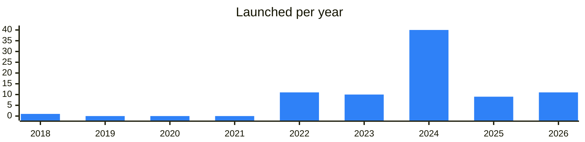
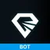
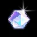
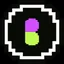

<!-- Generated by scripts/build_readme.py from data/. Do not edit by hand. -->

# Memepads

**83 projects: 18 active, 64 quiet, 1 closed.** Back to [all categories](../README.md#categories); statuses are explained [here](../README.md#how-to-read-it). The same list as a [searchable table](../data/by-category/launchpads.csv).

## Active

| # | Project | What it is | Links | Launched | Peak MAU | Verified |
| ---: | --- | --- | --- | --- | ---: | --- |
| 1 |  **TopBlast** | Launch and create history on topblast.lol | [Telegram](https://t.me/topblastdotlol) [X](https://x.com/topblastlol) [Site](https://topblast.lol) | 2026-02-11 |  |  |
| 2 |  **Meridian** | Investors club with a private bot, chat and website. | [Telegram](https://t.me/meridian_wtf) [X](https://x.com/meridianwtf) [Site](https://getgems.io/collection/EQAVGhk_3rUA3ypZAZ1SkVGZIaDt7UdvwA4jsSGRKRo-MRDN) | 2022-09-14 |  |  |
| 3 |  **@Blum** | Blum Memepad is a trading platform for launching and trading meme coins | [Telegram](https://t.me/blumcrypto_memepad) [Bot](https://t.me/blum) [X](https://x.com/blumcrypto) [Site](https://blum.io) [Gram News](https://gramnews.org/apps/blum-memepad) | 2022-12-31 |  | since 2024-08 |
| 4 |  **BigPump** | Hottest in Meme Trading from BigPump | [Telegram](https://t.me/bigpumphub) [X](https://x.com/bigpumpmeme) | 2024-10-30 |  |  |
| 5 |  **Uranus** | Token deployment tool on TON with a support contact. | [Telegram](https://t.me/nonameuranus) | 2026-05-06 |  |  |
| 6 |  **JVault** | JVault is a protocol for staking, launchpad, and locker on TON | [Telegram](https://t.me/jvault) [Bot](https://t.me/JVaultBot) [X](https://x.com/JVault_app) [Site](https://jvault.xyz) [GitHub](https://github.com/JVault-app) [Gram News](https://gramnews.org/apps/jvault) | 2023-09-25 | 42K |  |
| 7 |  **PumpMeme** | Meme token launchpad on TON with a Telegram mini app. | [Telegram](https://t.me/pumpmemenews) [Bot](https://t.me/pumpmeme_bot) [X](https://x.com/PumpMemeClub) [Site](https://pumpmeme.club) [Gram News](https://gramnews.org/apps/pumpmeme) | 2024-09-24 | 145K |  |
| 8 |  **Pumplyx Competition** | Telegram bot for a competition on the Pumplyx platform. | [Bot](https://t.me/pumplyxcompetitionbot) | 2026-08-25 |  |  |
| 9 |  **W3BFLIX** | Experience the future of entertainment with W3BFLIX | [Bot](https://t.me/w3bflixbot) | 2024-05-15 | 632K |  |
| 10 |  **GasPump** | GasPump fun channel. DYOR | [Telegram](https://t.me/gaspump_tv) [Bot](https://t.me/gasPump_bot) [X](https://x.com/gaspump_tv) Site (down) [Gram News](https://gramnews.org/apps/gaspump-1) | 2024-05-29 | 389K |  |
| 11 |  **Clarnium Games** | Clarnium Games — a platform for launching tokens and earning meme coins through quests and competitions | [Telegram](https://t.me/clarnium) [Bot](https://t.me/ClarniumGame_bot) [X](https://x.com/clarnium_io) [Site](https://clarnium.io/) [Gram News](https://gramnews.org/apps/clarnium-games) | 2022-09-13 |  |  |
| 12 |  **Just Pump It** | Test token for a USDA launchpad on TON | [Telegram](https://t.me/justpumpthis) [X](https://x.com/JustPumpItTON) [Site](https://pumpit.best) | 2026-08-18 |  |  |
| 13 |  **Grambo** | Social token launchpad on TON | [Telegram](https://t.me/grambofun) [X](https://x.com/grambofun) [Site](https://grambo.fun) | 2026-06-19 |  |  |
| 14 |  **The Fund** | Next-gen launchpad with AI features, with Russian-language channel. | [Telegram](https://t.me/thefund) | 2018-10-19 |  |  |
| 15 |  **USDAGemBot** | Here will be new tokens from USDA launchpad chat Channel Pump launch your gem here | [Telegram](https://t.me/usdagembot) [Bot](https://t.me/pumpitlaunch_bot) | 2026-08-17 |  |  |
| 16 |  **JVault Token (JVT)** | JVault is an ecosystem for project creators and investors that includes three active products: Staking, Launchpad and Locker | [Telegram](https://t.me/JVault) [X](https://x.com/JVault_app) [Site](https://jvault.xyz) | 2023-12-27 |  |  |
| 17 |  **Uranus & Topblast** | Deploys and bondings channel of memepads on TON | [Telegram](https://t.me/sounds_from_uranus) [X](https://x.com/topblastlol) [Site](https://topblast.lol) | 2025-11-30 |  |  |
| 18 |  **Tonstarter** | Tonstarter — a launchpad for projects on TON | [Bot](https://t.me/ton_starter_bot) [X](https://x.com/ton_starter) [Site](https://tonstarter.com) [Gram News](https://gramnews.org/apps/tonstarter) | 2022-02-23 | 2K |  |

<b>Quiet: 64</b>

| # | Project | What it is | Links | Launched | Peak MAU | Verified |
| ---: | --- | --- | --- | --- | ---: | --- |
| 19 |  **Cyber Islands Game** | Platform for token generation events run in a game format. | [Bot](https://t.me/cyberislandsbot) [Gram News](https://gramnews.org/apps/cyber-islands-game) | 2024-08-31 | 43K |  |
| 20 |  **TON of Memes** | Create and trade memecoins | [Bot](https://t.me/TonOfMemesBot) [X](https://x.com/useTONMemes) [Gram News](https://gramnews.org/apps/ton-of-memes) | 2024-09-04 | 24K |  |
| 21 |  **Polyton App** | Easy and secure token launches! | [Telegram](https://t.me/soda_fun) [Bot](https://t.me/polytonappbot) [Gram News](https://gramnews.org/apps/polyton-app) | 2024-06-18 | 59K |  |
| 22 |  **Crypto Magnet** |  | [Bot](https://t.me/magnet_crypto_bot) [Gram News](https://gramnews.org/apps/crypto-magnet) | 2024-09-08 | 112K |  |
| 23 |  **ApePadcom** |  | [Bot](https://t.me/apepad_bot) [Gram News](https://gramnews.org/apps/apepadcom) | 2024-06-22 | 86K |  |
| 24 |  **SecretTonProject QQQ** | Launchpad bot with news and support channels for new meme token launches. | [Telegram](https://t.me/secrettonprojectqqq) [Bot](https://t.me/secretpadbot) [Gram News](https://gramnews.org/apps/secrettonproject-qqq) | 2024-08-02 | 1.6M |  |
| 25 |  **OpenTap by Openpad** |  | [Bot](https://t.me/openpadbot) [X](https://x.com/Openpad_io) [Gram News](https://gramnews.org/apps/opentap-by-openpad) | 2023-02-10 | 241K |  |
| 26 |  **Bankcoin** | Master Banking, Earn Bitcoin | [Bot](https://t.me/bankcoins_bot) [X](https://x.com/realDogsHouse) [Gram News](https://gramnews.org/apps/bankcoin) | 2024-07-03 | 206K |  |
| 27 |  **PinGo** | PinGo Punny Bot - Wrapped your telegram | [Bot](https://t.me/pingo_minibot) [X](https://x.com/PinGoAI) [Site](https://pingo.work) [Gram News](https://gramnews.org/apps/pingo) | 2024-08-06 | 560K |  |
| 28 |  **BoostChain** | web 3.0 ecosystem for making money | [Bot](https://t.me/boostchainbot) [Gram News](https://gramnews.org/apps/boostchain) | 2024-07-13 | 29K |  |
| 29 |  **TokenTable** | Token distribution platform with a Telegram bot, built by Sign. | [Telegram](https://t.me/tokentable) [Bot](https://t.me/tokentable_bot) [Gram News](https://gramnews.org/apps/tokentable) | 2024-08-26 | 2M |  |
| 30 |  **AGIcoin** |  | [Bot](https://t.me/agicoins_bot) [X](https://x.com/agicointon) [Gram News](https://gramnews.org/apps/agicoin) | 2022-11-13 | 902K |  |
| 31 | **Parachute** | App for exploring campaigns of TON projects. | [Telegram](https://t.me/parachuteannouncements) [Bot](https://t.me/parachute_app_bot) [X](https://x.com/Parachute_ton) [Site](https://www.parachute.finance/) [Gram News](https://gramnews.org/apps/parachute) | 2024-10-01 | 154K |  |
| 32 | **TonCapy** | Capybara-themed project with a website, community channel and email contact. | [Telegram](https://t.me/toncapy) [Bot](https://t.me/toncapy_bot) [X](https://x.com/Ton_Capy) [Site](https://toncapy.com) [Gram News](https://gramnews.org/apps/toncapy) | 2024-07-21 | 4.3M |  |
| 33 |  **Cakon** | One-stop Web3 game launch platform based on TON. Web3 Game | [Telegram](https://t.me/Cakonio) [Bot](https://t.me/cakonbot) [X](https://x.com/CakonIoTon) Site (down) [Gram News](https://gramnews.org/apps/cakon) | 2024-05-05 | 33K |  |
| 34 |  **Fastmint App** | Secure your future with Fastmint | [Telegram](https://t.me/Fastmint_Assist) [Bot](https://t.me/fastmintapp_bot) [X](https://x.com/fastmintorg) [Gram News](https://gramnews.org/apps/fastmint-app) | 2023-03-13 | 546K |  |
| 35 |  **CoinGatePad** | CoinGatePad — a platform for voting on and discovering new crypto projects | [Bot](https://t.me/coingatepadbot) [X](https://x.com/CoinGatePad) [Site](https://coingatepad.com/cgp) [Gram News](https://gramnews.org/apps/coingatepad) | 2023-08-11 | 14K |  |
| 36 |  **GoldVerseBot** | The largest MEME ecosystem launchpad infrastructure on TON | [Bot](https://t.me/goldversebot) [Gram News](https://gramnews.org/apps/goldversebot) | 2024-06-23 | 912K |  |
| 37 |  **XTON Launchpad** | XTON is a Funding Platform Activating Telegram's Billion Users | [Bot](https://t.me/xtonbetabot) [Gram News](https://gramnews.org/apps/xton-launchpad) | 2024-03-15 | 9K |  |
| 38 | **Spica** |  | [X](https://x.com/spicafund) [Gram News](https://gramnews.org/apps/spica) | 2025-02-17 |  |  |
| 39 |  **PizzaTon** | Pizza-themed project with a token locker, meme tool and launchpad. | [Telegram](https://t.me/PitzaTon) [Bot](https://t.me/pizzatonbot) Site (down) [GitHub](https://github.com/pizzaton) [Gram News](https://gramnews.org/apps/pizzaton) | 2023-11-04 | 3K |  |
| 40 |  **TonUP Launchpad** |  | [Bot](https://t.me/tonup_launchpad_bot) [Gram News](https://gramnews.org/apps/tonup-launchpad) | 2024-03-16 | 1K |  |
| 41 |  **MoneyMaker by RAYS** | RAYS: The Super Account for Multichain DeFi Management | [Telegram](https://t.me/raysx_global) [Bot](https://t.me/xtap_rays_bot) [X](https://x.com/Ray__sX) [Gram News](https://gramnews.org/apps/moneymaker-by-rays) | 2022-06-03 | 61K |  |
| 42 |  **Burning Meme** | Burning Meme is the ultimate memecoin launchpad, merging one-click AI-powered meme generation with gamified and proven viral social sharing mechanics | [Telegram](https://t.me/burning_meme) |  |  |  |
| 43 |  **DEX Fund** | Community DEX fundraising on TON | [Bot](https://t.me/dexfundbot) | 2026-06-12 |  |  |
| 44 |  **Early** | Offers from early-stage projects for their contributors and active users | [Telegram](https://t.me/earn_early) | 2024-02 |  | since 2025-01 |
| 45 |  **Earn** | Telegram Launchpools. Hold tokens and Earn. Supported by | [Bot](https://t.me/earnhqbot) | 2025-01-09 | 2.3M | since 2024-12 |
| 46 |  **FOMO** | FOMO blends finance and gaming, making token launches and earning fun for everyone—whether creating, trading, or farming | [Bot](https://t.me/fomofund_bot) | 2024-09-05 | 12.9M |  |
| 47 |  **Gems.FUN** | Solana's first Memecoin Launchpad on Telegram! | [Bot](https://t.me/gemsfun_bot) | 2024-11-22 |  |  |
| 48 |  **GraFun** | Platform for creating and trading memecoins on TON | [Bot](https://t.me/tongrafunbot) | 2024-12-04 |  |  |
| 49 | **Investment kingyru EN** |  | [X](https://x.com/kingyru) [Gram News](https://gramnews.org/apps/investment-kingyru-en) | 2022-02-14 |  |  |
| 50 |  **ListingUz** |  | [Bot](https://t.me/cryptowood_mini_app_bot) [Gram News](https://gramnews.org/apps/listinguz) | 2023-02-11 |  |  |
| 51 |  **Memes Lab** | LAB launcher: create, trade, develop | [Telegram](https://t.me/lab_trade) [Bot](https://t.me/memeslabbot) [X](https://x.com/memeslabxyz) [Site](https://lab.pro) | 2024-07-25 | 11M | since 2025-01 |
| 52 |  **MOMO.FUN** | Mantle PartnerBackers: Mantle Ecofund, Bybit, Bybit Web3, Hashkey, catizen | [Bot](https://t.me/momofunbot) | 2025-03-09 | 62K |  |
| 53 |  **Nifty Nerds Network** | Nifty Nerds Network(NNN) is a Web3 gaming launchpad built on top of Telegram and TON blockchain | [Telegram](https://t.me/niftynerdsnetwork) [Bot](https://t.me/niftynerds_bot) [X](https://x.com/niftynerds) [Site](https://niftynerdsnetwork.com/) | 2024-08-12 | 95K |  |
| 54 |  **ONRANK LAUNCHPAD** | Coins on $GRAM that pay: hold one, earn 70% of its fees in USDT. The Vault buys real stocks for 500 Rank NFTs | [Telegram](https://t.me/onranknews) [Bot](https://t.me/onrankbot) | 2026-09-15 |  |  |
| 55 |  **Preseller** | Launch secure presale campaign on the TON blockchain in 5 minutes | [Bot](https://t.me/tonpreseller_bot) [Gram News](https://gramnews.org/apps/preseller) | 2025-01 |  |  |
| 56 |  **PumpChat** | AI memepad on TON where users create and chat with AI characters. | [Bot](https://t.me/chatcoinappbot) | 2024-08-21 | 274K |  |
| 57 |  **Slide.fun** | Telegram-native meme token launchpad | [Bot](https://t.me/slidefunbot) | 2025-09-06 | 44K |  |
| 58 |  **SolanaForge** | SolanaForge is a no-code multi-chain token creation platform that makes launching Web3 tokens simple, fast, and accessible | [Telegram](https://t.me/SolanaForgeGroup) [X](https://x.com/solanaforgeapp) [Site](https://solanaforge.app) [GitHub](https://github.com/SolanaForge/SolanaForge) | 2026-05-10 |  |  |
| 59 |  **StartON** | Community launchpad on TON | [Bot](https://t.me/start_onbot) | 2024-12-17 |  |  |
| 60 |  **TAND3M** | TAND3M – a platform for launching tokens and NFTs via LBP on the TON blockchain | [Bot](https://t.me/Tand3m_bot) [X](https://x.com/TAND3M_Official) [Site](https://tand3m.io/) [Gram News](https://gramnews.org/apps/tand3m) | 2024-12-13 |  |  |
| 61 |  **TON Gagarin World** | Crowdfunding platform for investing in crypto projects. | [Telegram](https://t.me/ton_gagarin_world_chat) [X](https://x.com/GAGARIN_World) | 2022-02-07 |  |  |
| 62 |  **TON INU Launchpad** | Launchpad app of the TON Inu meme token ecosystem. | [Telegram](https://t.me/toninutools) [X](https://x.com/toninutools) [Site](https://app.toninu.tech/launchpad) [Gram News](https://gramnews.org/apps/ton-inu-launchpad) | 2024-01-12 |  |  |
| 63 |  **TON Meme Republic** | Memecoin platform support bot | [Bot](https://t.me/ton_memerepublicbot) | 2025-11-07 |  |  |
| 64 |  **TON Starter** | Launchpad channel for TON projects | [Telegram](https://t.me/tonstarter) | 2022-02-14 |  |  |
| 65 |  **ton.fun** |  | [Bot](https://t.me/tonfunbot) | 2024-10-16 | 223K |  |
| 66 |  **TonPump.app** | TonPump Memes Launchpad Community | [Telegram](https://t.me/tonpump_community) [X](https://x.com/TonPump_app) | 2024-12-06 |  |  |
| 67 |  **TONUP** | Platform for discovering assets on TON, with a website and community. | [Telegram](https://t.me/tonup_io) [X](https://x.com/TonUP_io) [Site](https://tonup.io/) [Gram News](https://gramnews.org/apps/tonup) | 2023-04 |  |  |
| 68 |  **topblast.lol** | Token launch platform on TON | [Telegram](https://t.me/tonlaunchpad) | 2026-07-11 |  |  |
| 69 |  **Wagmi** | Meme token launchpad and trading platform on TON | [Bot](https://t.me/wagmi_app_bot) | 2024-11-27 | 36K |  |
| 70 |  **GAGARIN** | Web3 growth and launch ecosystem for projects | [Telegram](https://t.me/gagarin_launchpad) [Site](https://gagarin.world) | 2023-01-04 |  |  |
| 71 |  **GAGARIN** | Web3 project booster and launchpad with media resource | [Telegram](https://t.me/gagarin_launchpad_ru) [Site](https://gagarin.world) | 2022-12-27 |  |  |
| 72 |  **Loton** | Value distribution platform in the TON ecosystem | [Telegram](https://t.me/lotongenesis) | 2026-03-03 |  |  |
| 73 | **Orexn** | Telegram app and bot with a project website. | [Telegram](https://t.me/OrexnApp) [Bot](https://t.me/Orexnbot) [X](https://x.com/OrexnX) Site (down) [Gram News](https://gramnews.org/apps/orexn) | 2025-07-25 |  |  |
| 74 |  **OpenPad** | OpenPad revolutionizes Web3 fundraising with AI-powered innovation, launching decentralized token pools for projects | [Telegram](https://t.me/openpad_channel) [Bot](https://t.me/openpadbot) [X](https://x.com/Openpad_io) [Site](https://openpad.io/homepage) | 2023-02-10 | 241K |  |
| 75 |  **GraFun** | Memecoin launchpad on TON | [Telegram](https://t.me/grafunmeme) | 2024-09-11 |  | since 2024-09 |
| 76 | **Ton Launchpad** | Launchpad for building projects on TON. | [Telegram](https://t.me/TheTonlaunch_pad) [Bot](https://t.me/tonlaunchpadofficial_bot) [X](https://x.com/thetonlaunchpad) [Site](https://tonlaunchpad.com/) [Gram News](https://gramnews.org/apps/ton-launchpad) | 2025-04-09 |  |  |
| 77 |  **BYIN** | One-click meme launchpad on TON | [Telegram](https://t.me/byin_fun) [Site](https://byin.fun) | 2024-07-13 |  |  |
| 78 |  **Purr.Fund** | The first Community-Driven Launchpad & Launchpool | [Telegram](https://t.me/purr_news) [Bot](https://t.me/purr_fund_bot) [X](https://x.com/PurrFund) Site (down) [GitHub](https://github.com/PurrFund/SC-Purr) [Gram News](https://gramnews.org/apps/purr-fund) | 2024-04-09 |  |  |
| 79 |  **Memeboost** | The most popular #memecoin launchpad on , bringing 1 billion users to memecoins! | [Telegram](https://t.me/MemeBoost_app) [Bot](https://t.me/meme_boost_bot) [X](https://x.com/MemeBoostBot) [Gram News](https://gramnews.org/apps/memeboost) | 2024-06-04 |  |  |
| 80 |  **TONpad** | TONpad - The first and premier Community-driven Token Launch Protocol on TON Blockchain | [Telegram](https://t.me/TONpad_news) [X](https://x.com/TON_launchpad) Site (down) [GitHub](https://github.com/tonpad) [Gram News](https://gramnews.org/apps/tonpad) | 2024-03-20 |  |  |
| 81 |  **XTON** | Launchpad for the Telegram community on TON | [Telegram](https://t.me/xton_official) | 2024-03-17 |  |  |
| 82 |  **Startup Market** | DeFi investment platform for startups and investors | [Telegram](https://t.me/startupmarket_rus) | 2022-05-21 |  |  |

<b>Closed: 1</b>

| # | Project | What it is | Links | Launched | Peak MAU | Verified |
| ---: | --- | --- | --- | --- | ---: | --- |
| 83 |  **Pumpers.tg** | Launch and Trade Memecoins on TON | [Telegram](https://t.me/pumpers) [X](https://x.com/pumperstg) | 2024-05-21 |  |  |

