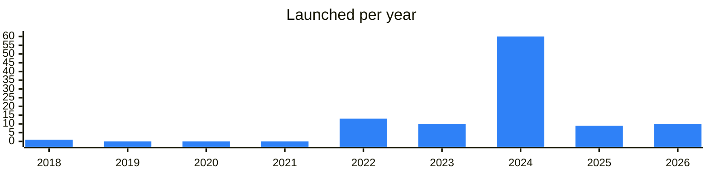

<!-- Generated by scripts/build_readme.py from data/. Do not edit by hand. -->

# Memepads

**104 projects: 21 active, 82 quiet, 1 closed.** Back to [all categories](../README.md#categories); statuses are explained [here](../README.md#how-to-read-it). The same list as a [searchable table](../data/by-category/launchpads.csv).

## Active

| # | Project | What it is | Links | Launched | Peak MAU | Verified |
| ---: | --- | --- | --- | --- | ---: | --- |
| 1 | **TopBlast** | Launch and create history on topblast.lol | [Telegram](https://t.me/topblastdotlol) [X](https://x.com/topblastlol) [Site](https://topblast.lol) | 2026-02-11 |  |  |
| 2 | **Meridian** | Investors Сlub Meridian | [Telegram](https://t.me/meridian_wtf) [X](https://x.com/meridianwtf) [Site](https://getgems.io/collection/EQAVGhk_3rUA3ypZAZ1SkVGZIaDt7UdvwA4jsSGRKRo-MRDN) | 2022-09-14 |  |  |
| 3 | **@Blum** | Blum Memepad is a trading platform for launching and trading meme coins | [Telegram](https://t.me/blumcrypto_memepad) [Bot](https://t.me/blum) [X](https://x.com/blumcrypto) [Site](https://blum.io) [Gram News](https://gramnews.org/apps/blum-memepad) | 2022-12-31 |  | since 2024-08 |
| 4 | **BigPump** | Hottest in Meme Trading from BigPump | [Telegram](https://t.me/bigpumphub) [X](https://x.com/bigpumpmeme) | 2024-10-30 |  |  |
| 5 | **Uranus** |  | [Telegram](https://t.me/nonameuranus) | 2026-05-06 |  |  |
| 6 | **JVault** | JVault is a protocol for staking, launchpad, and locker on TON | [Telegram](https://t.me/jvault) [Bot](https://t.me/JVaultBot) [X](https://x.com/JVault_app) [Site](https://jvault.xyz) [GitHub](https://github.com/JVault-app) [Gram News](https://gramnews.org/apps/jvault) | 2023-09-25 | 42K |  |
| 7 | **PumpMeme** |  | [Telegram](https://t.me/pumpmemenews) [Bot](https://t.me/pumpmeme_bot) [X](https://x.com/PumpMemeClub) [Site](https://pumpmeme.club) [Gram News](https://gramnews.org/apps/pumpmeme) | 2024-09-24 | 145K |  |
| 8 | **DuckChain** | DuckChain is a service for staking and bridging crypto assets | [Telegram](https://t.me/duckchainann) [Bot](https://t.me/duckchain_bot) [X](https://x.com/duck_chain) [Site](https://bridge.duckchain.io) [Gram News](https://gramnews.org/apps/duckchain) | 2024-06-15 | 15.4M |  |
| 9 | **Pumplyx Competition** |  | [Bot](https://t.me/pumplyxcompetitionbot) | 2026-08-25 |  |  |
| 10 | **PLAYS Hub** |  | [Telegram](https://t.me/PlayshubAnn) [Bot](https://t.me/playshubbot) [X](https://x.com/PlaysHub) Site (down) [Gram News](https://gramnews.org/apps/plays-hub) | 2024-07-25 | 117K |  |
| 11 | **W3BFLIX** | Experience the future of entertainment with W3BFLIX | [Bot](https://t.me/w3bflixbot) | 2024-05-15 | 632K |  |
| 12 | **GasPump** | GasPump fun channel. DYOR | [Telegram](https://t.me/gaspump_tv) [Bot](https://t.me/gasPump_bot) [X](https://x.com/gaspump_tv) Site (down) [Gram News](https://gramnews.org/apps/gaspump-1) | 2024-05-29 | 389K |  |
| 13 | **Clarnium Games** | Clarnium Games — a platform for launching tokens and earning meme coins through quests and competitions | [Telegram](https://t.me/clarnium) [Bot](https://t.me/ClarniumGame_bot) [X](https://x.com/clarnium_io) [Site](https://clarnium.io/) [Gram News](https://gramnews.org/apps/clarnium-games) | 2022-09-13 |  |  |
| 14 | **Just Pump It** | Test token for a USDA launchpad on TON | [Telegram](https://t.me/justpumpthis) [X](https://x.com/JustPumpItTON) [Site](https://pumpit.best) | 2026-08-18 |  |  |
| 15 | **Grambo** | Social token launchpad on TON | [Telegram](https://t.me/grambofun) [X](https://x.com/grambofun) [Site](https://grambo.fun) | 2026-06-19 |  |  |
| 16 | **Wizzwoods** |  | [Bot](https://t.me/wizzwoodsbot) [Site](https://wizzwoods.com/) [Gram News](https://gramnews.org/apps/wizzwoods) | 2024-06-17 |  |  |
| 17 | **The Fund** | Next-gen launchpad | [Telegram](https://t.me/thefund) | 2018-10-19 |  |  |
| 18 | **USDAGemBot** | Here will be new tokens from USDA launchpad chat Channel Pump launch your gem here | [Telegram](https://t.me/usdagembot) [Bot](https://t.me/pumpitlaunch_bot) | 2026-08-17 |  |  |
| 19 | **NitroChain** | NitroChain — blockchain infrastructure for fast and low-cost transactions | [Telegram](https://t.me/NitrochainNews) [Bot](https://t.me/nitrochainbot) [X](https://x.com/Nitrochainapp) [Site](https://nitrochain.space/) [Gram News](https://gramnews.org/apps/nitrochain) | 2023-12-07 | 5K |  |
| 20 | **Uranus & Topblast** | Deploys and bondings channel of memepads on TON | [Telegram](https://t.me/sounds_from_uranus) [X](https://x.com/topblastlol) [Site](https://topblast.lol) | 2025-11-30 |  |  |
| 21 | **Tonstarter** | Tonstarter — a launchpad for projects on TON | [Bot](https://t.me/ton_starter_bot) [X](https://x.com/ton_starter) [Site](https://tonstarter.com) [Gram News](https://gramnews.org/apps/tonstarter) | 2022-02-23 | 2K |  |

<b>Quiet: 82</b>

| # | Project | What it is | Links | Launched | Peak MAU | Verified |
| ---: | --- | --- | --- | --- | ---: | --- |
| 22 | **TON of Memes** | Create and trade memecoins | [Bot](https://t.me/TonOfMemesBot) [X](https://x.com/useTONMemes) [Gram News](https://gramnews.org/apps/ton-of-memes) | 2024-09-04 | 24K |  |
| 23 | **Planeton** | PlaneTon is a SocialFi game where you can earn real money by growing your fleet of planes | [Telegram](https://t.me/planeton_hub) [Bot](https://t.me/theplanetonbot) [X](https://x.com/theplaneton) [Site](https://0xiceberg.com/) [Gram News](https://gramnews.org/apps/planeton) | 2024-07-07 |  |  |
| 24 | **Polyton App** | Easy and secure token launches! | [Telegram](https://t.me/soda_fun) [Bot](https://t.me/polytonappbot) [Gram News](https://gramnews.org/apps/polyton-app) | 2024-06-18 | 59K |  |
| 25 | **FUNTON.AI** | The Modular Multi-Game Platform | [Telegram](https://t.me/funton_ai) [Bot](https://t.me/funton_ai_app_bot) [X](https://x.com/funton_ai) [Site](https://funton.ai) [Gram News](https://gramnews.org/apps/funton-ai) | 2024-07-05 | 435K |  |
| 26 | **Quest Labs** |  | [Bot](https://t.me/questlabsbot) [X](https://x.com/TorchTon) [Site](https://torch.finance) [GitHub](https://github.com/torch-core) [Gram News](https://gramnews.org/apps/quest-labs) | 2024-05-28 | 600K |  |
| 27 | **Crypto Magnet** |  | [Bot](https://t.me/magnet_crypto_bot) [Gram News](https://gramnews.org/apps/crypto-magnet) | 2024-09-08 | 112K |  |
| 28 | **ApePadcom** |  | [Bot](https://t.me/apepad_bot) [Gram News](https://gramnews.org/apps/apepadcom) | 2024-06-22 | 86K |  |
| 29 | **SecretTonProject QQQ** |  | [Telegram](https://t.me/secrettonprojectqqq) [Bot](https://t.me/secretpadbot) [Gram News](https://gramnews.org/apps/secrettonproject-qqq) | 2024-08-02 | 1.6M |  |
| 30 | **OpenTap by Openpad** |  | [Bot](https://t.me/openpadbot) [X](https://x.com/Openpad_io) [Gram News](https://gramnews.org/apps/opentap-by-openpad) | 2023-02-10 | 241K |  |
| 31 | **2040World** | PvP game on a space station with avatars and combat | [Bot](https://t.me/world2040_bot) [X](https://x.com/2040World) [Site](https://cloudflare.com) [Gram News](https://gramnews.org/apps/2040world) | 2022-06-09 | 55K |  |
| 32 | **RoOLZ** | RoOLZ — a Telegram roleplay game with NFTs and agentic gameplay | [Telegram](https://t.me/roolznft) [Bot](https://t.me/roolzquest_bot) [X](https://x.com/AtriumNft) [Site](https://Atrium.art) [Gram News](https://gramnews.org/apps/roolz) | 2023-08-23 | 10.5M | since 2024-05 |
| 33 | **Bankcoin** | Master Banking, Earn Bitcoin | [Bot](https://t.me/bankcoins_bot) [X](https://x.com/realDogsHouse) [Gram News](https://gramnews.org/apps/bankcoin) | 2024-07-03 | 206K |  |
| 34 | **Snap Fly Bot** | Snap Fly / Snap & Earn - Play for airdrop | [Telegram](https://t.me/SnapFly_updates) [Bot](https://t.me/snapfly_game_bot) [X](https://x.com/SnapFly_xyz) [Site](https://docs.snapfly.xyz/) [Gram News](https://gramnews.org/apps/snap-fly-bot) | 2024-06-28 | 160K |  |
| 35 | **PinGo** | PinGo Punny Bot - Wrapped your telegram | [Bot](https://t.me/pingo_minibot) [X](https://x.com/PinGoAI) [Site](https://pingo.work) [Gram News](https://gramnews.org/apps/pingo) | 2024-08-06 | 560K |  |
| 36 | **LUMO** | Tap, trade, connect, grow and… farm LUMO Tokens! Next generation wallet. Made by team | [Telegram](https://t.me/cryptolumo) [Bot](https://t.me/cryptolumo_bot) [Gram News](https://gramnews.org/apps/lumo) | 2024-08-22 | 111K |  |
| 37 | **BoostChain** | web 3.0 ecosystem for making money | [Bot](https://t.me/boostchainbot) [Gram News](https://gramnews.org/apps/boostchain) | 2024-07-13 | 29K |  |
| 38 | **TokenTable** |  | [Telegram](https://t.me/tokentable) [Bot](https://t.me/tokentable_bot) [Gram News](https://gramnews.org/apps/tokentable) | 2024-08-26 | 2M |  |
| 39 | **AGIcoin** |  | [Bot](https://t.me/agicoins_bot) [X](https://x.com/agicointon) [Gram News](https://gramnews.org/apps/agicoin) | 2022-11-13 | 902K |  |
| 40 | **Parachute** |  | [Telegram](https://t.me/parachuteannouncements) [Bot](https://t.me/parachute_app_bot) [X](https://x.com/Parachute_ton) [Site](https://www.parachute.finance/) [Gram News](https://gramnews.org/apps/parachute) | 2024-10-01 | 154K |  |
| 41 | **TonCapy** |  | [Telegram](https://t.me/toncapy) [Bot](https://t.me/toncapy_bot) [X](https://x.com/Ton_Capy) [Site](https://toncapy.com) [Gram News](https://gramnews.org/apps/toncapy) | 2024-07-21 | 4.3M |  |
| 42 | **Oldy** | Oldyest crypto community | [Telegram](https://t.me/oldy_community) [Bot](https://t.me/tonoldy_bot) [X](https://x.com/Oldy_Community) [Gram News](https://gramnews.org/apps/oldy) | 2024-08-08 | 941K |  |
| 43 | **RATS** |  | [Telegram](https://t.me/ratsgame_community) [Bot](https://t.me/ratsgame_bot) [Gram News](https://gramnews.org/apps/rats) | 2024-06-10 | 705K |  |
| 44 | **Firecoin** | At the beginning of time, you could stare at Nothing. Now you stare at light shining brightly coming from Fire | [Bot](https://t.me/firecoin_app_bot) [X](https://x.com/firecoin_app) [Gram News](https://gramnews.org/apps/firecoin) | 2024-05-07 | 1.8M |  |
| 45 | **Bitbot** | Secure, manage, and protect your wallets with ease | [Telegram](https://t.me/bitbotofficial) [Bot](https://t.me/hello_bitbot) [Gram News](https://gramnews.org/apps/bitbot) | 2024-08-30 | 87K |  |
| 46 | **Horizon Launch** | Official bot of the EVEDEX decentralized exchange | [Bot](https://t.me/horizonlaunch_bot) [Gram News](https://gramnews.org/apps/horizon-launch) | 2024-07-14 | 2.5M |  |
| 47 | **RoketoCoin Lunar Program** |  | [Bot](https://t.me/roketo_lunar_bot) [Gram News](https://gramnews.org/apps/roketocoin-lunar-program) | 2024-05-21 | 308K |  |
| 48 | **Fastmint App** | Secure your future with Fastmint | [Telegram](https://t.me/Fastmint_Assist) [Bot](https://t.me/fastmintapp_bot) [X](https://x.com/fastmintorg) [Gram News](https://gramnews.org/apps/fastmint-app) | 2023-03-13 | 546K |  |
| 49 | **CoinGatePad** | CoinGatePad — a platform for voting on and discovering new crypto projects | [Bot](https://t.me/coingatepadbot) [X](https://x.com/CoinGatePad) [Site](https://coingatepad.com/cgp) [Gram News](https://gramnews.org/apps/coingatepad) | 2023-08-11 | 14K |  |
| 50 | **XTON Launchpad** | XTON is a Funding Platform Activating Telegram's Billion Users | [Bot](https://t.me/xtonbetabot) [Gram News](https://gramnews.org/apps/xton-launchpad) | 2024-03-15 | 9K |  |
| 51 | **NotBabyCoinFAM** |  | [Bot](https://t.me/notbabycoinfambot) Site (down) [GitHub](https://github.com/marakitio) [Gram News](https://gramnews.org/apps/notbabycoinfam) | 2024-02-03 | 7K |  |
| 52 | **Shaker Coin** |  | [Bot](https://t.me/shaker_coin_bot) [Gram News](https://gramnews.org/apps/shaker-coin) | 2024-06-26 | 4K |  |
| 53 | **Spica** |  | [X](https://x.com/spicafund) [Gram News](https://gramnews.org/apps/spica) | 2025-02-17 |  |  |
| 54 | **PizzaTon** |  | [Telegram](https://t.me/PitzaTon) [Bot](https://t.me/pizzatonbot) Site (down) [GitHub](https://github.com/pizzaton) [Gram News](https://gramnews.org/apps/pizzaton) | 2023-11-04 | 3K |  |
| 55 | **Finch Coin** | Finch Coin – a Telegram mini app for claiming airdrop tokens | [Telegram](https://t.me/FinchCoin_org) [Bot](https://t.me/FinchAirdropBot) [X](https://x.com/FinchCoin_org) [Site](https://finchcoin.org) [Gram News](https://gramnews.org/apps/finch-coin) | 2024-10-04 | 1.2M |  |
| 56 | **Flare X** | Mission to the Flare X solar system (Version 1.4.6) | [Bot](https://t.me/flarexgamebot) [Gram News](https://gramnews.org/apps/flare-x) | 2024-04-03 | 352K |  |
| 57 | **TonUP Launchpad** |  | [Bot](https://t.me/tonup_launchpad_bot) [Gram News](https://gramnews.org/apps/tonup-launchpad) | 2024-03-16 | 1K |  |
| 58 | **MoneyMaker by RAYS** | RAYS: The Super Account for Multichain DeFi Management | [Telegram](https://t.me/raysx_global) [Bot](https://t.me/xtap_rays_bot) [X](https://x.com/Ray__sX) [Gram News](https://gramnews.org/apps/moneymaker-by-rays) | 2022-06-03 | 61K |  |
| 59 | **Seeds of TON** | Seed is an open social exploration game aiming at realizing social games. Telegram | [Telegram](https://t.me/SeedsofTON) [Bot](https://t.me/seeds_game_bot) [X](https://x.com/SeedsofTon) [Gram News](https://gramnews.org/apps/seeds-of-ton) | 2024-07-19 | 215 |  |
| 60 | **Rikcoin** |  | [Telegram](https://t.me/r1kcoin) [Bot](https://t.me/rikcoinbot) [X](https://x.com/r1kcoin) [Gram News](https://gramnews.org/apps/rikcoin) | 2022-02-09 | 4K |  |
| 61 | **Buck** | Making an honest buck | [Bot](https://t.me/buck_meme_bot) [Gram News](https://gramnews.org/apps/buck) | 2024-04-25 |  |  |
| 62 | **Burning Meme** | Burning Meme is the ultimate memecoin launchpad, merging one-click AI-powered meme generation with gamified and proven viral social sharing mechanics | [Telegram](https://t.me/burning_meme) |  |  |  |
| 63 | **Early** | Offers from early-stage projects for their contributors and active users | [Telegram](https://t.me/earn_early) | 2024-02 |  | since 2025-01 |
| 64 | **EL TON** | Memecoin Most Wanted on TON! | [Bot](https://t.me/eltoncoin_bot) [Gram News](https://gramnews.org/apps/el-ton) | 2025-04-29 | 13K |  |
| 65 | **FOMO** | FOMO blends finance and gaming, making token launches and earning fun for everyone—whether creating, trading, or farming | [Bot](https://t.me/fomofund_bot) | 2024-09-05 | 12.9M |  |
| 66 | **Gems.FUN** | Solana's first Memecoin Launchpad on Telegram! | [Bot](https://t.me/gemsfun_bot) | 2024-11-22 |  |  |
| 67 | **GraFun** | Platform for creating and trading memecoins on TON | [Bot](https://t.me/tongrafunbot) | 2024-12-04 |  |  |
| 68 | **Gram.Store** | Launchpad for Telegram mini apps | [Bot](https://t.me/gramstoreapp_bot) | 2026-06-29 |  |  |
| 69 | **Hypecoin** |  | [Telegram](https://t.me/hypecoinnews) [X](https://x.com/HypecoinFinance) [Gram News](https://gramnews.org/apps/hypecoin) | 2024-06-07 |  |  |
| 70 | **Investment kingyru EN** |  | [X](https://x.com/kingyru) [Gram News](https://gramnews.org/apps/investment-kingyru-en) | 2022-02-14 |  |  |
| 71 | **ListingUz** |  | [Bot](https://t.me/cryptowood_mini_app_bot) [Gram News](https://gramnews.org/apps/listinguz) | 2023-02-11 |  |  |
| 72 | **Memes Lab** | LAB launcher: create, trade, develop | [Telegram](https://t.me/lab_trade) [Bot](https://t.me/memeslabbot) [X](https://x.com/memeslabxyz) [Site](https://lab.pro) | 2024-07-25 | 11M | since 2025-01 |
| 73 | **Memetics** | Home of Telegram mini economies | [Telegram](https://t.me/memetics_news) | 2024-09-23 |  |  |
| 74 | **MOMO.FUN** | Mantle PartnerBackers: Mantle Ecofund, Bybit, Bybit Web3, Hashkey, catizen | [Bot](https://t.me/momofunbot) | 2025-03-09 | 62K |  |
| 75 | **Pandastic** |  | [Bot](https://t.me/pandastic_bot) [X](https://x.com/pandastic_io) [Gram News](https://gramnews.org/apps/pandastic) | 2024-06-23 |  |  |
| 76 | **Preseller** | Launch secure presale campaign on the TON blockchain in 5 minutes | [Bot](https://t.me/tonpreseller_bot) [Gram News](https://gramnews.org/apps/preseller) | 2025-01 |  |  |
| 77 | **PumpChat** |  | [Bot](https://t.me/chatcoinappbot) | 2024-08-21 | 274K |  |
| 78 | **Quick** |  | [Bot](https://t.me/quick_tg_bot) [Gram News](https://gramnews.org/apps/quick) | 2024-08-15 |  |  |
| 79 | **Slide.fun** | Telegram-native meme token launchpad | [Bot](https://t.me/slidefunbot) | 2025-09-06 | 44K |  |
| 80 | **SolanaForge** | SolanaForge is a no-code multi-chain token creation platform that makes launching Web3 tokens simple, fast, and accessible | [Telegram](https://t.me/SolanaForgeGroup) [X](https://x.com/solanaforgeapp) [Site](https://solanaforge.app) [GitHub](https://github.com/SolanaForge/SolanaForge) | 2026-05-10 |  |  |
| 81 | **StartON** | Community launchpad on TON | [Bot](https://t.me/start_onbot) | 2024-12-17 |  |  |
| 82 | **TAND3M** | TAND3M – a platform for launching tokens and NFTs via LBP on the TON blockchain | [Bot](https://t.me/Tand3m_bot) [X](https://x.com/TAND3M_Official) [Site](https://tand3m.io/) [Gram News](https://gramnews.org/apps/tand3m) | 2024-12-13 |  |  |
| 83 | **TON Gagarin World** |  | [Telegram](https://t.me/ton_gagarin_world_chat) [X](https://x.com/GAGARIN_World) | 2022-02-07 |  |  |
| 84 | **TON INU Launchpad** |  | [Telegram](https://t.me/toninutools) [X](https://x.com/toninutools) [Site](https://app.toninu.tech/launchpad) [Gram News](https://gramnews.org/apps/ton-inu-launchpad) | 2024-01-12 |  |  |
| 85 | **TON Meme Republic** | Memecoin platform support bot | [Bot](https://t.me/ton_memerepublicbot) | 2025-11-07 |  |  |
| 86 | **TON Starter** | Launchpad channel for TON projects | [Telegram](https://t.me/tonstarter) | 2022-02-14 |  |  |
| 87 | **ton.fun** |  | [Bot](https://t.me/tonfunbot) | 2024-10-16 | 223K |  |
| 88 | **TonPump.app** | TonPump Memes Launchpad Community | [Telegram](https://t.me/tonpump_community) [X](https://x.com/TonPump_app) | 2024-12-06 |  |  |
| 89 | **TONUP** |  | [Telegram](https://t.me/tonup_io) [X](https://x.com/TonUP_io) [Site](https://tonup.io/) [Gram News](https://gramnews.org/apps/tonup) | 2023-04 |  |  |
| 90 | **topblast.lol** | Token launch platform on TON | [Telegram](https://t.me/tonlaunchpad) | 2026-07-11 |  |  |
| 91 | **Wagmi** | Meme token launchpad and trading platform on TON | [Bot](https://t.me/wagmi_app_bot) | 2024-11-27 | 36K |  |
| 92 | **GAGARIN** | Web3 growth and launch ecosystem for projects | [Telegram](https://t.me/gagarin_launchpad) [Site](https://gagarin.world) | 2023-01-04 |  |  |
| 93 | **GAGARIN** | Web3 project booster and launchpad with media resource | [Telegram](https://t.me/gagarin_launchpad_ru) [Site](https://gagarin.world) | 2022-12-27 |  |  |
| 94 | **Loton** | Value distribution platform in the TON ecosystem | [Telegram](https://t.me/lotongenesis) | 2026-03-03 |  |  |
| 95 | **Orexn** |  | [Telegram](https://t.me/OrexnApp) [Bot](https://t.me/Orexnbot) [X](https://x.com/OrexnX) Site (down) [Gram News](https://gramnews.org/apps/orexn) | 2025-07-25 |  |  |
| 96 | **GraFun** | Memecoin launchpad on TON | [Telegram](https://t.me/grafunmeme) | 2024-09-11 |  | since 2024-09 |
| 97 | **Ton Launchpad** |  | [Telegram](https://t.me/TheTonlaunch_pad) [Bot](https://t.me/tonlaunchpadofficial_bot) [X](https://x.com/thetonlaunchpad) [Site](https://tonlaunchpad.com/) [Gram News](https://gramnews.org/apps/ton-launchpad) | 2025-04-09 |  |  |
| 98 | **BYIN** | One-click meme launchpad on TON | [Telegram](https://t.me/byin_fun) [Site](https://byin.fun) | 2024-07-13 |  |  |
| 99 | **Capitalist** |  | [Telegram](https://t.me/capitalist_web3) [Bot](https://t.me/wisekeeperbot) [X](https://x.com/capitalistweb3) [Gram News](https://gramnews.org/apps/capitalist) | 2024-10-25 | 680K |  |
| 100 | **Purr.Fund** | The first Community-Driven Launchpad & Launchpool | [Telegram](https://t.me/purr_news) [Bot](https://t.me/purr_fund_bot) [X](https://x.com/PurrFund) Site (down) [GitHub](https://github.com/PurrFund/SC-Purr) [Gram News](https://gramnews.org/apps/purr-fund) | 2024-04-09 |  |  |
| 101 | **TONpad** | TONpad - The first and premier Community-driven Token Launch Protocol on TON Blockchain | [Telegram](https://t.me/TONpad_news) [X](https://x.com/TON_launchpad) Site (down) [GitHub](https://github.com/tonpad) [Gram News](https://gramnews.org/apps/tonpad) | 2024-03-20 |  |  |
| 102 | **XTON** | Launchpad for the Telegram community on TON | [Telegram](https://t.me/xton_official) | 2024-03-17 |  |  |
| 103 | **Startup Market** | DeFi investment platform for startups and investors | [Telegram](https://t.me/startupmarket_rus) | 2022-05-21 |  |  |

<b>Closed: 1</b>

| # | Project | What it is | Links | Launched | Peak MAU | Verified |
| ---: | --- | --- | --- | --- | ---: | --- |
| 104 | **Pumpers.tg** | Launch and Trade Memecoins on TON | [Telegram](https://t.me/pumpers) [X](https://x.com/pumperstg) | 2024-05-21 |  |  |

