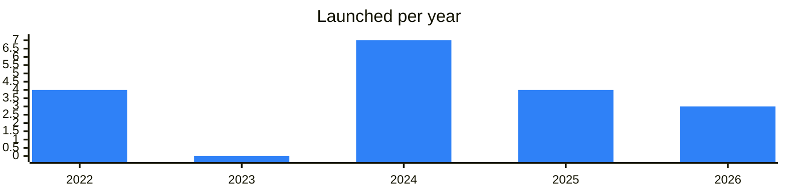

<!-- Generated by scripts/build_readme.py from data/. Do not edit by hand. -->

# Lending

**18 projects: 9 active, 9 quiet, 0 closed.** Back to [all categories](../README.md#categories); statuses are explained [here](../README.md#how-to-read-it). The same list as a [searchable table](../data/by-category/lending.csv).

## Active

| # | Project | What it is | Links | Launched | Peak MAU | Verified |
| ---: | --- | --- | --- | --- | ---: | --- |
| 1 |  **EVAA Protocol** | The first decentralized lending protocol on TON | [Telegram](https://t.me/evaaprotocol) [Bot](https://t.me/EvaaAppBot) [X](https://x.com/evaaprotocol) [Site](https://evaa.finance) [GitHub](https://github.com/evaafi) [Gram News](https://gramnews.org/apps/evaa-protocol) | 2022-12-10 | 90K | since 2024-09 |
| 2 |  **TONLender** | Borrow GRAM against NFT collateral on TON | [Telegram](https://t.me/tonlender_ru) [Bot](https://t.me/tonlenderbot) [X](https://x.com/tonlender) [Site](https://tonlender.com) [Gram News](https://gramnews.org/apps/tonlender) | 2026-04-22 |  |  |
| 3 |  **DAOLama** | DAOLama is a lending service for NFT collateral that is closing soon | [Telegram](https://t.me/daolama) [Bot](https://t.me/daolama_bot) [X](https://x.com/daolama_ton) [Site](https://daolama.co?utm_source=tonapp&utm_medium=marketplace&utm_campaign=NFT_service) [Gram News](https://gramnews.org/apps/daolama) | 2022-08-30 | 56K |  |
| 4 |  **GTC (Gift To Credit)** | GTC is onchain / offchain lending against Telegram gifts & NFTs | [Telegram](https://t.me/gifttocredit_new_age) [Site](https://giftcredit.app/borrow) | 2026-07-01 |  |  |
| 5 |  **Fiva** | FIVA - Your financial app in Telegram | [Telegram](https://t.me/fiva_protocol) [Bot](https://t.me/fiva_yield_bot) [X](https://x.com/FivaProtocol) [Site](https://thefiva.com) [Gram News](https://gramnews.org/apps/fiva) | 2024-07-23 | 24K |  |
| 6 |  **Octalend** | Octalend — NFT and gift-backed lending on TON | [Telegram](https://t.me/octalend) [Bot](https://t.me/octalend_bot) [X](https://x.com/octalend) [Site](https://octalend.xyz) [Gram News](https://gramnews.org/apps/octalend) | 2026-03-09 |  |  |
| 7 |  **Aqua Protocol (CDP)** | Telegram bot for farming Aqua Points tied to the Aqua Protocol crypto products. | [Telegram](https://t.me/aquaprotocolxyzchannel) [Bot](https://t.me/AquaProtocolxyz_Bot) [X](https://x.com/aquaprotocolxyz) [Site](https://aquaprotocol.xyz/?utm_source=tonapp&utm_medium=ecosystem&utm_campaign=aqua) [Gram News](https://gramnews.org/apps/aqua-protocol-cdp) | 2022-11-10 |  |  |
| 8 |  **Delea Finance** |  | [Telegram](https://t.me/delea_finance) [Bot](https://t.me/delea_app_bot) [X](https://x.com/DeleaFinance) [Site](https://delea.finance/) [Gram News](https://gramnews.org/apps/delea-finance) | 2024-11-19 |  |  |
| 9 |  **Affluent** | Affluent is a Telegram mini app for staking | [Telegram](https://t.me/Affluent) [Bot](https://t.me/affluentappbot) [X](https://x.com/affluentorg) [Site](https://affluent.org) [Gram News](https://gramnews.org/apps/affluent) | 2024-10-22 |  |  |

<b>Quiet: 9</b>

| # | Project | What it is | Links | Launched | Peak MAU | Verified |
| ---: | --- | --- | --- | --- | ---: | --- |
| 10 |  **Cephei Bot** | Collateralized debt position lending protocol on TON for borrowing against a decentralized overcollateralized stablecoin. | [Telegram](https://t.me/cephei_fi) [Bot](https://t.me/cephei_fi_bot) [X](https://x.com/cephei_fi) [Gram News](https://gramnews.org/apps/cephei-bot) | 2024-04-21 | 131K |  |
| 11 |  **AXUS Protocol** |  | [Telegram](https://t.me/axusprotocol) [Bot](https://t.me/AXUSProtocol_bot) [X](https://x.com/axusprotocol) [Site](https://axus-protocol.web.app) [GitHub](https://github.com/axusprotocol/axusprotocol) [Gram News](https://gramnews.org/apps/axus-protocol) | 2025-05-21 |  |  |
| 12 |  **BeaverLand** | Lending protocol on TON | [Bot](https://t.me/beaverland_bot) | 2024-09-13 |  |  |
| 13 |  **Euler** | Lending super app in Telegram | [Bot](https://t.me/eulerfinancebot) | 2025-07-17 |  |  |
| 14 |  **Morpho** | Telegram bot for earning yield on crypto deposits through a lending protocol. | [Bot](https://t.me/morphoorgbot) | 2025-07-19 |  |  |
| 15 | **Tonpound** |  | [Bot](https://t.me/tonpoundbot) | 2024-06 |  |  |
| 16 |  **KirkaFi** | Modular DeFi infrastructure on TON built around undercollateralized credit | [Telegram](https://t.me/farmixton) | 2024-09-18 |  |  |
| 17 |  **EVAA Protocol (EVAA)** | The first decentralized lending protocol on TON | [Telegram](https://t.me/evaaprotocol) [X](https://x.com/evaaprotocol) [Site](https://evaa.finance) | 2025-09-29 |  |  |
| 18 |  **TON Lombard** | Credit in TON via Telegram bot | [Telegram](https://t.me/ton_lombard) [Bot](https://t.me/tonlombardbot) | 2022-06-18 | 1K |  |

