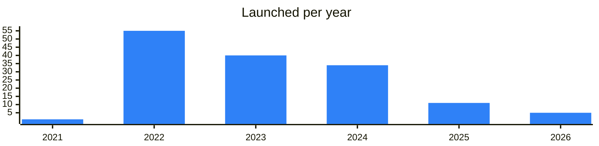

<!-- Generated by scripts/build_readme.py from data/. Do not edit by hand. -->

# NFT collections

**146 projects: 23 active, 113 quiet, 10 closed.** Back to [all categories](../README.md#categories); statuses are explained [here](../README.md#how-to-read-it). The same list as a [searchable table](../data/by-category/nftcaps.csv).

## Active

| # | Project | What it is | Links | Launched | Peak MAU | Verified |
| ---: | --- | --- | --- | --- | ---: | --- |
| 1 | **Anonymous Numbers** |  | [Site](https://fragment.com/gifts) | 2022-12-06 |  |  |
| 2 | **Plush Pepe** |  | [Telegram](https://t.me/plushpepe_coin) [Site](https://fragment.com/gifts) | 2025-01-23 |  |  |
| 3 | **Telegram Usernames** |  | [Site](https://fragment.com/gifts) | 2022-10-27 |  |  |
| 4 | **Scared Cat** |  | [Site](https://fragment.com/gifts) | 2025-01-23 |  |  |
| 5 | **Heart Locket** |  | [Site](https://fragment.com/gifts) | 2025-06-06 |  |  |
| 6 | **NOT Wise** | NFT community on TON | [Telegram](https://t.me/notwise) | 2024-03-20 |  |  |
| 7 | **Apes Club** |  | [Telegram](https://t.me/apes_club) [Bot](https://t.me/apes_club_bot) | 2025-09-29 | 132K |  |
| 8 | **NOT Punks** |  | [Telegram](https://t.me/notpunks_official) [Site](https://notpunks.com) | 2024-05-26 |  |  |
| 9 | **NOTAPES** | Pixel PFP NFT collection of hand drawn apes on TON | [Telegram](https://t.me/notapes) [X](https://x.com/notapess) | 2025-03-31 |  |  |
| 10 | **Chess Pieces** | A unique NFT collection of 3600 Chess Pieces from the Chess Zombies metaverse - summon NFT warriors - collect an indestructible army - level up your Warriors | [Telegram](https://t.me/chesszombies) [X](https://x.com/SHEDEVERstudio) [Site](https://chesszombies.fun) | 2022-09-07 |  |  |
| 11 | **Seals Playground** | Seals pixel NFT project | [Telegram](https://t.me/sealsplayground) | 2025-11-26 |  |  |
| 12 | **Gram Rabbits** | NFT rabbit collection on Getgems with community chat | [Telegram](https://t.me/mh_friends_zone) [Site](https://gram.org) | 2023-10-19 |  |  |
| 13 | **Hello Novia** | TON NFT collection on Getgems | [Telegram](https://t.me/hello_novia) | 2023-07-25 |  |  |
| 14 | **TON Chinchillas** | Collection of 777 chinchilla NFTs on TON | [Telegram](https://t.me/tonchinchi) | 2022-01-23 |  |  |
| 15 | **LEVELS** | NFT collection of 1500 cards on TON | [Telegram](https://t.me/levels_ton) | 2026-01-27 |  |  |
| 16 | **Stalin Party Card** | Stalin Party Card - is a collection of 1000 NFT party cards that are used in the Stalin Foundation ecosystem | [Telegram](https://t.me/StalinFoundation) [Site](https://) [GitHub](https://github.com/StalinFoundation) | 2023-08-09 |  |  |
| 17 | **Ton Street Boys** | Коллекция из 2500 фотографий уличных пацанов, борющихся с испытаниями жития в гетто, пытающихся нахастлить деньги | [Telegram](https://t.me/tonstreetboys) [Bot](https://t.me/TsbWarsBot) Site (down) | 2025-05-26 |  |  |
| 18 | **ПOSTNEIRONIA** | history of cursed humor and AI evolution | [Telegram](https://t.me/postneironia) [Site](https://getgems.io/user/EQD7TF4JB0hOz1nBOPDRVKyl14eGnMm7LcYzk_8A-7KMjalE) | 2021-10-02 |  |  |
| 19 | **Ton Hedgehog** | 1111 different hand-drawn pixel hedgehogs | [Telegram](https://t.me/hedgehog_ton) [Site](https://) | 2026-09-04 |  |  |
| 20 | **TON Cats NFT** | NFT cat collection on The Open Network | [Telegram](https://t.me/tonnftcat) [Site](https://toncat.org) | 2022-01-30 |  |  |
| 21 | **Utya Portal** | Utya duck NFT project on TON | [Telegram](https://t.me/utyaduck) | 2024-04-12 |  |  |
| 22 | **10kClub** | Club for holders of 4-digit .ton domains | [Telegram](https://t.me/club10k) [Site](https://10kclub.com) | 2024-06-20 |  |  |
| 23 | **The Dinos** | Dinosaur NFT collection on TON | [Telegram](https://t.me/dinoston) | 2023-12-21 |  |  |

<b>Quiet: 113</b>

| # | Project | What it is | Links | Launched | Peak MAU | Verified |
| ---: | --- | --- | --- | --- | ---: | --- |
| 24 | **Market Makers** | Discover the Market Makers - an epic NFT collection by Storm Trade, where trading meets victory | [Site](https://getgems.io/market-makers) | 2023-06-12 |  |  |
| 25 | **Allo Sticker Verify** | Bot to verify BAYC sticker pack ownership | [Bot](https://t.me/allosticker_bot) | 2026-05-14 |  |  |
| 26 | **Animals Cyberpunk** | In the vast metropolis of Neo-Arcadia, a new generation of creatures known as the Cyberpunk Syndicate of Animals has emerged from the shadows | [X](https://x.com/AnimalCyberpunk) Site (down) | 2024-04 |  |  |
| 27 | **Annihilation** | First NFT collection by Ellen Sheidlin | [Site](https://ton.diamonds/collection/annihilation?tab=items) | 2023-04 |  |  |
| 28 | **ASTROPUNK** | A beautiful and unusual collection of astro-monkeys with their own history that are talismans for your wallets | [Site](https://getgems.io/collection/EQB9cmgY_7BAeufdhYacKRTrxniEnJwyTvQJWAm2xlw48cdf) | 2024-03 |  |  |
| 29 | **Bolgur NFT** | Official NFT bot of Airina Bolgur | [Bot](https://t.me/bolgurnftbot) | 2024-11-20 |  |  |
| 30 | **Cat Mafia NFT** | Уникальная коллекция NFT Cat Mafia, найди себе мафиози по вкусу! | [Site](https://getgems.io/collection/EQBUhVMKeO5YZ4I151B1DVNbsimI_VWDA_eo7hpw4ITPvUbo) | 2023-02 |  |  |
| 31 | **Cats in a parallel** |  | [Site](https://getgems.io/collection/EQCJEMMuZIKwgxpnShxAykSSXqn9Y788ld6mIC7w9EqRayoS) | 2024-03 |  |  |
| 32 | **Crypto Snoops** | NFT collection of 4000 2D dogs on TON | [Telegram](https://t.me/cryptosnoops) | 2022-03-11 |  |  |
| 33 | **Cyberpunk World NFT** | One of the most future large collections of NFT in cyberpunk style based on TON | [Site](https://getgems.io/collection/EQBG35T0OW0qbKH6BZBy7fGPGBXtdlPEcld_VoXhW-SXLr39) | 2023-07 |  |  |
| 34 | **Cyborg Rock** | Cyborg Rock is a thrilling NFT collection where robots unleash powerful guitar riffs and captivating girls play enchanting violin tunes | [Telegram](https://t.me/cyborgrock) [Bot](https://t.me/CyborgRockBot) [X](https://x.com/cyborgrocks) [Site](https://getgems.io/cyborgrock) | 2024-08 |  |  |
| 35 | **Degenerate Ape** | PFP digital-art NFT collection | [Telegram](https://t.me/degenerate_ape_nft) | 2023-08-01 |  |  |
| 36 | **eNOT COIN NFT** | eNOT NFT Collection | [Telegram](https://t.me/eNOTCLUB) [Bot](https://t.me/eNOT_Invest_Bot) [Site](https://enot.info) | 2024-02 |  |  |
| 37 | **G-Bots** | Бот для розыгрышей G-BOTS | [Telegram](https://t.me/gbotston) [Bot](https://t.me/gbots_bot) [Site](https://getgems.io/collection/gbots) | 2022-01-23 |  |  |
| 38 | **GhettoNFT** |  | [Telegram](https://t.me/ghetton) [Bot](https://t.me/jumanjirobot) [Gram News](https://gramnews.org/apps/ghettonft) | 2022-10-04 |  |  |
| 39 | **Hello TON NFT** | Community chat of the Hello TON NFT collections | [Telegram](https://t.me/hellotonchat) | 2022-06-07 |  |  |
| 40 | **Humans** | Уникальная, лимитированная коллекция NFT аватаров на базе TON, выбери свой аватар! | [Site](https://getgems.io/collection/EQDgUeotvXbB1_YEIhrYvYHj8jO9rY6ud7uIW-TBTQIP2odD) | 2023-02 |  |  |
| 41 | **kingyTON NFT** | A unique animated collection of 315 items on significant events of the TON project | [Telegram](https://t.me/investkingyru) [Site](https://ton.org.in) | 2023-05 |  |  |
| 42 | **Knuckles TON** | Knuckles TON is everything you need | [Telegram](https://t.me/knucklesonton) [Site](https://getgems.io/knuckleston) | 2024-03 |  |  |
| 43 | **LlamasInPixelHarmony** | Llamas In Pixel Harmony is a symbol of the strength, tenacity and endurance of the TON community in creating decentralization | [Telegram](https://t.me/LlamasInPixelHarmony) [Site](https://getgems.io/collection/EQB31ij7PT2XWo2onAdhOVwEWvOrU804b70MD0PPpyqz2qv8) | 2023-12 |  |  |
| 44 | **MINTODINOS** | Привет, ты слышал новость? | [Site](https://getgems.io/collection/mintodinos) | 2024-01 |  |  |
| 45 | **MONAKI** | Discover a closed community of builders, NFT collectors and crypto enthusiasts | [Site](https://monaki.life) | 2023-04 |  |  |
| 46 | **Not Cap** | App for Not Cap sticker holders | [Bot](https://t.me/notcapclub_bot) | 2025-08-13 |  |  |
| 47 | **Not Doge** | Epic NFT collection consisting of 400 randomly generated Doge and 100 hand drawn Doge in different styles | [Site](https://getgems.io/collection/EQAOQFjv7uuyChgfCQnntF-TAIkBlvx9lbfhShvZkxG0Ht6Y#activity) | 2024-03 |  |  |
| 48 | **OCTOPUS BOYZ** | A collection of 777 unique animated NFTs opens up a fascinating world crafted by the renowned artist and animation director Brickspacer using Unreal Engine 5 | [Site](https://ton.diamonds/collection/octopusboyz?tab=items) | 2023-04 |  |  |
| 49 | **PacTon** | The collection unites active people of TON community! | [Telegram](https://t.me/pac_ton) [Site](https://getgems.io/collection/omnomnomnom) | 2023-06 |  |  |
| 50 | **PUPS TON** |  | [X](https://x.com/pups_TON) [Site](https://getgems.io/collection/EQBKG8QlHNvEZvubLspjbZ5sC4qthZQOQTOA7JgjKIE2ACEO) [Gram News](https://gramnews.org/apps/pups-ton) | 2024-05-15 |  |  |
| 51 | **Rabbits** | Telegram gifts bot of the Rabbits collection | [Bot](https://t.me/rabbitsgiftbot) | 2026-03-12 |  |  |
| 52 | **Rabbits TON** | These cute earwigs will serve as a mascot for the lucky ones and a pass-through ticket to the community, where you can win something interesting by participatin | [Site](https://rabbits-ton.ru/) | 2023-06 |  |  |
| 53 | **Rich Cats** | First customizable NFT for Telegram, based on TON | [Bot](https://t.me/richcatsbot) | 2022-03-07 |  |  |
| 54 | **Seals Playground** | Seals pixel NFT project | [Telegram](https://t.me/sealsgate) | 2025-08-19 |  |  |
| 55 | **Summer Dancing** | Summer Dancing is a vibrant NFT collection featuring beautifully drawn Girls set against stunning Summer landscapes | [Telegram](https://t.me/summerdances) [Bot](https://t.me/SummerDancingBot) [X](https://x.com/SummerDanceNFT) [Site](https://getgems.io/summerdancing) | 2024-08 |  |  |
| 56 | **TEIKO** | The TEIKŌ project combines web3 and web2 for artists and art enthusiasts | [Telegram](https://t.me/teiko) Site (down) | 2023-06 |  |  |
| 57 | **Tenere Slopy** | Пиксельная NFT коллекция с розыгрышем 12000 TON среди всех владельцев NFT Tenere Slopy За каждые 50 приобретенных NFT у владельца коллекции мы проводим розыгрыш | [X](https://x.com/slopymeme) Site (down) | 2023-06 |  |  |
| 58 | **TON AVATARS** | TON AVATARS — collection of 5,555 unique NFT Avatars on the TON blockchain, created in collaboration with famous artists, bloggers, musicians, and brands | [Site](https://tonavatars.to/) | 2024-01 |  |  |
| 59 | **TON Capsules** | NFT collection on TON with official bot | [Bot](https://t.me/toncapsulesbot) | 2022-05-03 |  |  |
| 60 | **TON Diamonds NFT** | TON Diamonds NFT collection contains 10,000 unique animated diamonds that grant exclusive priveleges in TON Ecosystem | [Telegram](https://t.me/sheidlinart) [Site](https://ton.diamonds) | 2023-06 |  | since 2022-06 |
| 61 | **TON Doodles** | NFT collection on TON with official bot | [Bot](https://t.me/tondoodles_bot) | 2022-06-18 |  |  |
| 62 | **Ton Famous People** | Best future NFT avatars for Telegram TON / CRYPTO / SIGNALS, NEWS & ANALYTICS | [Telegram](https://t.me/tonfamouspeople) | 2023-09-09 |  |  |
| 63 | **TON Frogs** | Погрузись в мир TON Frogs App | [Telegram](https://t.me/tonfrogs) [Bot](https://t.me/tonfrogs_bot) [X](https://x.com/tonfrogs) | 2022-04-06 |  |  |
| 64 | **TON Goblins** | TON Goblins is a limited NFT collection on TON (The Open Network) that consists of 300 unique pixel goblins | [Telegram](https://t.me/goblinium) [Site](https://getgems.io/collection/EQDId39SNQ6HyClTaZRCfanKJ4PdVy5pyY2BwZmubHdSWlmT) | 2023-04 |  |  |
| 65 | **TON NFT Cats** | NFT cat collection on TON | [Telegram](https://t.me/tegrocatnft) | 2022-05-06 |  |  |
| 66 | **TON Sharks** | Pixel shark NFT collection on TON | [Telegram](https://t.me/sharks_community) | 2023-03-09 |  |  |
| 67 | **TON Space Vibes** | NFT collection on Getgems | [Telegram](https://t.me/tonspacevibes) | 2022-07-06 |  |  |
| 68 | **VeVe Stickerverse** | Digital sticker collectibles on Telegram | [Bot](https://t.me/veve_stickerverse_bot) | 2026-06-04 |  |  |
| 69 | **Web3TON NFT** | Web3TON is the first NFT project dedicated to the future Web 3.0 Internet on TON | [Site](https://web3ton.pro) | 2023-08 |  |  |
| 70 | **Welcome to @Whale** | Each digital artwork represents a memorable token earned after successfully completing a Whale Journey quest about the #01 Crypto Community | [Telegram](https://t.me/whale) [X](https://x.com/whalegames_en) [Site](https://whale.io) | 2023-04-17 |  |  |
| 71 | **Whales Club** | Collection limited to 10000 utility-enabled NFTs, where the token is your membership to the Whales Club | [Site](https://getgems.io/collection/whales) | 2023-04 |  |  |
| 72 | **Wizzard Cats** | The “Wizard Cats” collection is a series of images of cats dressed in wizard attire | [Site](https://getgems.io/collection/EQAyn3CpHxHdjVy_BQWzAy7QxbYX5hu8uPjVgDCrPrVNbdum) | 2024-02 |  |  |
| 73 | **Neko NFT** | NFT collection on TON | [Telegram](https://t.me/nek0nft) | 2025-09-08 |  |  |
| 74 | **Telegram Monk** | Telegram Monk NFT portal channel | [Telegram](https://t.me/tg_monk) [X](https://x.com/TMonkOfficial) [Site](https://tgmonk.com) | 2024-03-10 |  |  |
| 75 | **DreamWalkers** | NFT collection of 6363 items on TON | [Telegram](https://t.me/dreamwalkersnft) [Site](https://dreamwalkers.io) | 2022-07-23 |  |  |
| 76 | **TON Olbanec** | Free mint NFT collection | [Telegram](https://t.me/olbania_memeland) | 2023-03-27 |  |  |
| 77 | **Meta Panthers** | Торговая площадка с низкой комиссией. Создавайте, продавайте и покупайте цифровые товары! Карта • Открывайте, пополняйте и обменивайте валюту с крипто-картой Liber | [Telegram](https://t.me/metapanthers_ru) [Bot](https://t.me/libermallbot) [X](https://x.com/LibermallNFT) [Site](https://metapanthers.ru) [GitHub](https://github.com/LiberMall) [Gram News](https://gramnews.org/apps/meta-panthers) | 2022-01-26 |  |  |
| 78 | **Blockchain NFT** | Info channel of the Blockchain NFT collection | [Telegram](https://t.me/chat_blockchain_nft) | 2023-02-05 |  |  |
| 79 | **Nutcrackers Club** | Holder club for the Nutcrackers NFT collection on TON | [Telegram](https://t.me/nutcracker_en) [X](https://x.com/NutcrackersNFT) | 2024-02-01 |  |  |
| 80 | **TON Fans** | TON Fans NFT collection and community fund | [Telegram](https://t.me/tonfans_nft) | 2022-08-21 |  |  |
| 81 | **Smeshariki on TON** | NFT collections and mini app based on Smeshariki | [Telegram](https://t.me/smeshtonnews) | 2024-04-30 |  | since 2024-09 |
| 82 | **Punks market** | Offers for Punks NFTs from GetGems and Disintar | [Telegram](https://t.me/punksv2) [Bot](https://t.me/punks_bot) | 2022-05-15 |  |  |
| 83 | **Eggs Wisdom** | Eggs Wisdom NFT collection on Getgems | [Telegram](https://t.me/eggswisdom) [X](https://x.com/EggsWisdom) | 2023-10-03 |  |  |
| 84 | **BARASH** | Sheep NFT collection on TON | [Telegram](https://t.me/barash_ton) | 2024-01-18 |  |  |
| 85 | **NFT Dogs Metaverse** | Husky dog NFT collection on The Open Network | [Telegram](https://t.me/tonnftdog) | 2022-02-27 |  |  |
| 86 | **Ponchiqs** | Ponchiqs NFT community on TON | [Telegram](https://t.me/ponchiqs) [Site](https://ponchiqs.com) | 2023-12-12 |  |  |
| 87 | **Zhdun** | NFT collection on TON | [Telegram](https://t.me/zhdunnft) | 2025-07-02 |  |  |
| 88 | **The Anime** | The Anime is a collection of 20K Anime NFTs - Unique digital collectibles living on TON Blockchain | [Telegram](https://t.me/TheAnime2024) [Site](https://getgems.io/theanime) [Gram News](https://gramnews.org/apps/the-anime) | 2024-05-10 |  |  |
| 89 | **The Miners Club** | NFT collection for miners on TON | [Telegram](https://t.me/theminersclub) | 2024-02-07 |  |  |
| 90 | **Freax** | NFT collection of crazy freax | [Telegram](https://t.me/freaxnft) | 2024-10-09 |  |  |
| 91 | **RoundChickenTON** | NFT collection on Getgems | [Telegram](https://t.me/roundchicken) | 2023-09-03 |  |  |
| 92 | **CARTONKI** | NFT cookies collection | [Telegram](https://t.me/cartonki_ru) | 2024-09-23 |  |  |
| 93 | **TON Birds** | TON Birds NFT community | [Telegram](https://t.me/ton_birds) | 2023-06-12 |  |  |
| 94 | **MamonTON** | Generated NFT collection with its own site | [Telegram](https://t.me/mamontonft) | 2022-04-18 |  |  |
| 95 | **Succulents Dreams** | Первая негенеративная коллекция NFT суккулентов, владение которыми позволяет получить живое, настоящее растение! | [Telegram](https://t.me/tonsucculents) [Bot](https://t.me/tonsucculents_bot) [X](https://x.com/tonsucculents) [Site](https://getgems.io/collection/tonsucculents) [Gram News](https://gramnews.org/apps/succulents-dreams) | 2022-12-20 |  |  |
| 96 | **NFT Dog TON** | Dog NFT collection on TON by Tegro | [Telegram](https://t.me/tonnfttegrodog) | 2022-05-06 |  |  |
| 97 | **Concept2048** | NFT collection with official channel | [Telegram](https://t.me/nft_ton_concept) | 2022-08-30 |  |  |
| 98 | **Forever Meow** | Cat NFT collection on Getgems | [Telegram](https://t.me/forever_meow) [X](https://x.com/forevermeow) | 2022-11-15 |  |  |
| 99 | **TON Bored Ape** | Collectible Bored Ape NFT for TON | [Telegram](https://t.me/tonbored) | 2022-04-07 |  |  |
| 100 | **Angga Code** | The Angga Code NFT project aims to develop a robust and integrated digital ecosystem using blockchain technology | [Telegram](https://t.me/anggacode) Site (down) | 2024-11-08 |  |  |
| 101 | **Sweetie NFT** | TON NFT project managing a network of channels | [Telegram](https://t.me/sweetie_nft) | 2023-06-29 |  |  |
| 102 | **Ghosts** | Images from the NFT collection ":Ghosts" depict samurais standing with their backs turned, symbolizing a gaze into the past | [Telegram](https://t.me/ghosts_ru) [Bot](https://t.me/GhostonBot) [X](https://x.com/ghosts_ton) [Site](https://getgems.io/collection/ghosts) | 2023-01-15 |  |  |
| 103 | **Mutant Toadz** | NFT collection on the TON blockchain | [Telegram](https://t.me/mutanttoadz) [Bot](https://t.me/mutanttoadz_bot) | 2022-04-14 |  |  |
| 104 | **The Simpletons** | NFT collection project sold on Getgems | [Telegram](https://t.me/thesimpletons) | 2024-05-05 |  |  |
| 105 | **Toned Ape Club** | NFT collection on TON | [Telegram](https://t.me/toned_ape_club) [Site](https://tonedapeclub.space) | 2022-01-29 |  |  |
| 106 | **Cookie NFT** | NFT collection for joining a private chat | [Telegram](https://t.me/cookiestokens) Site (down) | 2024-04-13 |  |  |
| 107 | **Cossacks NFT** | Introducing the Cossacks NFT Collection: Dive into a world of digital art inspired by the legendary Cossacks | [Telegram](https://t.me/cossacksnft) [X](https://x.com/CossacksNFT_) Site (down) | 2024-06-03 |  |  |
| 108 | **TON Corgi NFT** | Corgi NFT collection on TON | [Telegram](https://t.me/toncorgi) | 2022-07-18 |  |  |
| 109 | **Soul Stones** | NFT collection on TON | [Telegram](https://t.me/tonsoulstonesnft) | 2022-03-03 |  |  |
| 110 | **TON CAT** | Cat NFT collection on TON | [Telegram](https://t.me/ton_cat) | 2022-03-10 |  |  |
| 111 | **Skullymo** | NFT collection on TON | [Telegram](https://t.me/skullymoton) | 2022-06-27 |  |  |
| 112 | **Skullhead** | Collection of 666 skull NFTs on Getgems | [Telegram](https://t.me/skullhead_ton) | 2022-09-29 |  |  |
| 113 | **Mintosaurs** | NFT project on TON | [Telegram](https://t.me/mintosaurs_ru) | 2022-01-14 |  |  |
| 114 | **Anime.Dance** | NFT collection and MOCHI jetton | [Telegram](https://t.me/playdance) | 2024-02-09 |  |  |
| 115 | **Time-Wandering Apes** | NFT avatar and comic collection on TON | [Telegram](https://t.me/wanderingapes) | 2023-03-27 |  |  |
| 116 | **Ton Raccoon Clan** | NFT collection on TON | [Telegram](https://t.me/tonraccoonclan) | 2022-02-22 |  |  |
| 117 | **TON Ducks** | Pixel art NFT collection on TON | [Telegram](https://t.me/tonducks_nft) | 2022-01-08 |  |  |
| 118 | **NeuroMonks** | Cyberpunk NFT media franchise | [Telegram](https://t.me/neuromonksnft_ru) | 2022-09-11 |  |  |
| 119 | **Tonsylvania** | NFT collection on Getgems | [Telegram](https://t.me/tonsylvania) | 2022-05-06 |  |  |
| 120 | **TON Capybara** | Collection of 1111 NFTs on TON | [Telegram](https://t.me/capy20bara23) | 2023-07-24 |  |  |
| 121 | **Lucky Ducky** | NFT collection of 1001 items on TON | [Telegram](https://t.me/luckyduckynft) | 2022-11-28 |  |  |
| 122 | **Savaton NFT** | NFT collection on TON | [Telegram](https://t.me/savaton) | 2022-10-25 |  |  |
| 123 | **SpaceNoodles** | TON NFT collection channel | [Telegram](https://t.me/spacenoodles) | 2022-05-25 |  |  |
| 124 | **MetaCapsules** | MetaCapsules NFT project | [Telegram](https://t.me/metacapsules) | 2022-09-01 |  |  |
| 125 | **TON Ducks** | NFT collection of ducks on TON | [Telegram](https://t.me/tonducksnft) | 2022-05-13 |  |  |
| 126 | **TON Masks** | Mask NFT collection on TON | [Telegram](https://t.me/tonmasks_ru) [Bot](https://t.me/tonmasksairdropbot) | 2022-01-14 |  |  |
| 127 | **Minibots** | NFT collection on TON | [Telegram](https://t.me/nftminibots) | 2022-08-22 |  |  |
| 128 | **Weird Guy TON** | NFT collection on TON blockchain | [Telegram](https://t.me/weirdguyton) | 2022-07-10 |  |  |
| 129 | **NFT Gnomes** | Gnome NFT collection on TON with mining bot | [Telegram](https://t.me/nft_gnomes) | 2022-06-24 |  |  |
| 130 | **Circles on Fields** | NFT collection on TON | [Telegram](https://t.me/nftkrugi) | 2022-06-27 |  |  |
| 131 | **Non-Fungible Rabbits** | 3D animal NFT project on TON | [Telegram](https://t.me/nfrton) | 2022-05-08 |  |  |
| 132 | **TON Kawaii Protection** | Collection of 696 NFTs on TON | [Telegram](https://t.me/kawaiiprotection) | 2022-04-18 |  |  |
| 133 | **Baby Boss Club** | Animated music 3D NFT collection on TON | [Telegram](https://t.me/bbclubton) | 2022-09-16 |  |  |
| 134 | **TON NFT Stamps** | NFT stamp collection on TON | [Telegram](https://t.me/nft_stamps) | 2022-03-16 |  |  |
| 135 | **TON Rabbits** | NFT collection of rabbits on TON | [Telegram](https://t.me/tonrabbitnft) | 2022-06-07 |  |  |
| 136 | **Peton** | NFT collection of pets on TON | [Telegram](https://t.me/petonnft) | 2022-08-06 |  |  |

<b>Closed: 10</b>

| # | Project | What it is | Links | Launched | Peak MAU | Verified |
| ---: | --- | --- | --- | --- | ---: | --- |
| 137 | **Crazy Llama Farm NFT** | Crazy Llama Farm is a pfp collection generated on the TON blockchain | Site (down) | 2024-01 |  |  |
| 138 | **Dangerous Chickens** | Dangerous Chickens TON is a collection of 5 thousand Chickens of the good race and 5 thousand Chickens of the angry race | Site (down) | 2024-01 |  |  |
| 139 | **DC TON** | Dangerous Chickens TON is a collection of 5,000 Good race Chickens and 5,000 Angry race Chickens | Site (down) | 2023-06 |  |  |
| 140 | **Montessori School** | Welcome to the universe of the Montessori School NFT serial! | Site (down) | 2024-01 |  |  |
| 141 | **SMART TIGERS** | This is the first collection of Smart Tigers on the NFT TON blockchain by ceoa | Site (down) | 2023-06 |  |  |
| 142 | **SPACEDISCOSHEEP** | SPACEDISCOSHEEP is an NFT collection of 888 hand drawn sheep, inspired by an artwork of the same name, drawn ten years ago | Site (down) | 2022-12 |  |  |
| 143 | **Tenere Wanderlust** | Tenere Wanderlust is a limited edition collection of 365 unique live NFT | Site (down) | 2023-06 |  |  |
| 144 | **TON Fingerprints** | This is a NFT collection of 10 000 unique digital fingerprints created based on the algorithm for generating basic rings using a noise texture | Site (down) | 2023-08 |  |  |
| 145 | **TONDONS** | A unique multifunctional NFT collection of TONDONS in The Open Network Collect TON Dons, get cashback, free $DON tokens and also a free subscription to the AI A | Site (down) | 2023-06 |  |  |
| 146 | **White Rabbit TON** | White Rabbit - this collection is dedicated to the new phase of $NOT | Site (down) | 2024-03 |  |  |

