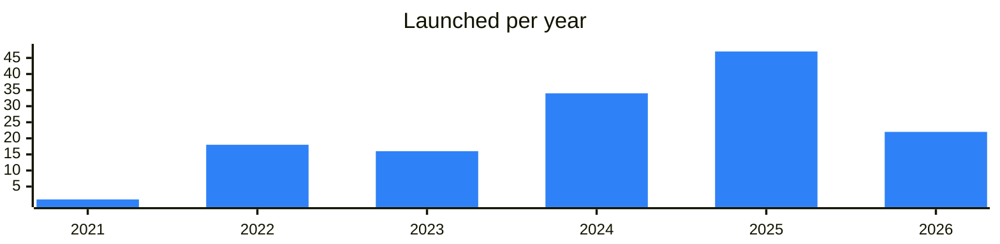

<!-- Generated by scripts/build_readme.py from data/. Do not edit by hand. -->

# NFT & Gifts

**140 projects: 46 active, 88 quiet, 6 closed.** Back to [all categories](../README.md#categories); statuses are explained [here](../README.md#how-to-read-it). The same list as a [searchable table](../data/by-category/nftmarkets.csv).

## Active

| # | Project | What it is | Links | Launched | Peak MAU | Verified |
| ---: | --- | --- | --- | --- | ---: | --- |
| 1 | **Getgems** | getgems.io — the Home of NFT collections on The Open Network - an ultra-fast, secure, and truly decentralized blockchain network | [Telegram](https://t.me/getgems) [X](https://x.com/getgemsdotio) [Site](https://getgems.io/) [GitHub](https://github.com/getgems-io) [Gram News](https://gramnews.org/apps/getgems-mtmajh) | 2022-02-08 |  | since 2022-05 |
| 2 | **Tonnel** | P2P TON lending service against Telegram gifts | [Telegram](https://t.me/tonnel_en) [Bot](https://t.me/tonnel_network_bot) [X](https://x.com/tonnel_network) [Site](https://Tonnel.network) [GitHub](https://github.com/Tonnel-Network/core) [Gram News](https://gramnews.org/apps/tonnel-relayer-bot) | 2022-10-25 |  | since 2025-03 |
| 3 | **@MRKT** | A Telegram marketplace for digital assets — gifts, stickers and more, with floor-price purchases and a shopping cart | [Bot](https://t.me/mrkt) [Gram News](https://gramnews.org/apps/mrkt) | 2023-04-14 |  | yes |
| 4 | **Marketapp** | Advanced Solution for NFT traders on TON | [Bot](https://t.me/nfttonificatorbot) [Site](https://marketapp.ws) [Gram News](https://gramnews.org/apps/marketapp) | 2023-02-26 | 24K |  |
| 5 | **@Portals** | Portals Market is a marketplace for trading gifts and items | [Telegram](https://t.me/portals_community) [Bot](https://t.me/portals) [X](https://x.com/portalsmarket) [Gram News](https://gramnews.org/apps/portals-market) | 2023-04-14 |  | since 2025-08 |
| 6 | **Gift Satellite** | Aggregator of Telegram gift markets with notifications for gift traders. | [Telegram](https://t.me/giftsatellite) [Bot](https://t.me/gift_satellite_bot) | 2025-05-02 | 22K |  |
| 7 | **webdom** | The first and most functional marketplace for TON DNS domains and usernames on Tolk | [Bot](https://t.me/webdom_tgbot) [Site](https://webdom.market) | 2026-05-30 |  |  |
| 8 | **Telegifts** | Telegifts is the first full-featured Telegram Gifts explorer for iOS / Android / TMA | [Telegram](https://t.me/telegiftsapp) [Bot](https://t.me/telegiftsappbot) [X](https://x.com/telegifts) [Site](https://telegifts.app/download) | 2025-09-24 |  |  |
| 9 | **Pixel Market** | Marketplace app linked to the Pixel project, with a support channel. | [Telegram](https://t.me/pixelmarket_fam) [Bot](https://t.me/pixelmarket_support) [X](https://x.com/PixelMarketX) [Site](https://notpixel.org) [Gram News](https://gramnews.org/apps/pixel-market) | 2025-08-07 |  |  |
| 10 | **Laffka NFT** | Marketplace bot for NFT stickers with on-chain and off-chain trading and NFT loans. | [Telegram](https://t.me/laffkanft) [Bot](https://t.me/laffkastickerbot) | 2025-06-11 |  |  |
| 11 | **Get Gifts** | Channel with news, changelog and statistics on limited Telegram gifts. | [Telegram](https://t.me/giftchanges) [Site](https://telegram-gifts.ru) | 2024-12-18 |  |  |
| 12 | **Swift Gifts** | Telegram Gifts Aggregator | [Telegram](https://t.me/swiftgifts_news) [Bot](https://t.me/giftbot) [X](https://x.com/swiftgifts_fun) [Site](https://web.swiftgifts.tg/) | 2025-05-22 |  |  |
| 13 | **@Thermos** | Gift & Stickers Aggregator by team | [Telegram](https://t.me/thermos_news) [Bot](https://t.me/thermos) [Gram News](https://gramnews.org/apps/thermos) | 2024-09-20 |  |  |
| 14 | **BeSigned** | Telegram project with a community chat and support bot. | [Telegram](https://t.me/besigned) [Bot](https://t.me/besignedbot) | 2026-04-17 |  |  |
| 15 | **Palace Market** | Marketplace bot for trading NFTs inside Telegram, with support and community chats. | [Telegram](https://t.me/palaceproject) [Bot](https://t.me/palacenftbot) [Gram News](https://gramnews.org/apps/palacenftbot) | 2024-07-08 | 273K |  |
| 16 | **@Tags Bot** | A bot for buying and selling NFT and non-NFT tags | [Telegram](https://t.me/tagged) [Bot](https://t.me/tags) [Site](https://tagsbot.netlify.app) [Gram News](https://gramnews.org/apps/tags-bot) | 2026-01-29 |  |  |
| 17 | **Подарки от Скруджа** | Russian-language channel with gift news and giveaways, plus a bot. | [Telegram](https://t.me/pepes_gold) [Bot](https://t.me/garantscroogebot) | 2022-08-31 |  |  |
| 18 | **EDGE GIFT** | Telegram gift game bot with a gift relayer, support bot and channel. | [Telegram](https://t.me/edge_gift) [Bot](https://t.me/edge_gift_bot) | 2025-09-15 | 101K |  |
| 19 | **Rocket-Number** | Telegram bot for buying and selling anonymous numbers. | [Telegram](https://t.me/rockettg) [Bot](https://t.me/rocketnumberbot) | 2024-04-26 |  |  |
| 20 | **Goodies** |  | [Telegram](https://t.me/goodies) [Bot](https://t.me/getgoodies_bot) [X](https://x.com/goodies_tg) | 2025-06-15 | 658K |  |
| 21 | **Portals Market** | Open the portal. Trade your gifts | [Bot](https://t.me/portals_market_bot) | 2025-06-09 |  | yes |
| 22 | **Gift Go** | A Telegram mini app for selling gift stickers with an authentication error page on open | [Telegram](https://t.me/gift_board) [Bot](https://t.me/giftgobot) [Gram News](https://gramnews.org/apps/gift-go) | 2025-06-02 |  |  |
| 23 | **NFT Afrom** | Channel for auctions, giveaways and news, with a bot for buying Telegram Stars cheaply. | [Telegram](https://t.me/nftafrom) [Bot](https://t.me/afromstarsbot) | 2025-02-04 |  |  |
| 24 | **bandabot** | Telegram gift bot with a news channel and support contact. | [Telegram](https://t.me/bandabotchannel) [Bot](https://t.me/bandagiftbot) | 2025-09-07 |  |  |
| 25 | **Paradox Gifts** | Russian-language giveaway channel for Telegram gifts and Stars with a chat and bot. | [Telegram](https://t.me/giftsparadox) [Bot](https://t.me/freegns_bot) | 2025-10-15 |  |  |
| 26 | **Getgems NFT RU** | Russian channel of Getgems, the NFT marketplace on TON. | [Telegram](https://t.me/getgemsrus) [Bot](https://t.me/nfton_bot) | 2022-02-08 |  | since 2022-09 |
| 27 | **DegenPhone** | Anonymous NFT phone numbers sold via a Telegram mini app | [Telegram](https://t.me/degenphone) [Bot](https://t.me/degenphonetonbot) [X](https://x.com/degenphone) [Site](https://degenphone.xyz) | 2025-06-11 | 41K |  |
| 28 | **Diamond Bazar** | NFT marketplace on TON described as the first black NFT market. | [Telegram](https://t.me/bazaarclubs) | 2024-03-08 |  |  |
| 29 | **T2T** | Telegram marketplace bot with a news channel and help bot. | [Telegram](https://t.me/t2t_news) [Bot](https://t.me/t2t_bobot) | 2026-07-22 |  |  |
| 30 | **TonTake NFT** | A friendly, charitable and entertainment company whose members receive TON and TAKE daily | [Telegram](https://t.me/TonTake) [Bot](https://t.me/TonTakeChatbot) [Site](https://getgems.io/user/tontakewallet#collections) | 2022-05-10 |  |  |
| 31 | **GiftStarsin** |  | [Bot](https://t.me/giftstarsin) | 2026-02-07 |  |  |
| 32 | **Getgems: Buy and Sell Gifts** | Trade Telegram Gifts, Numbers and Usernames | [Bot](https://t.me/getgemsnftbot) | 2022-05-27 | 831K | since 2025-09 |
| 33 | **GDOMAINS** | Service for registering, renting and managing .tg domains in Telegram. | [Telegram](https://t.me/regtg) [Bot](https://t.me/tgdomains_bot) | 2025-11-05 |  |  |
| 34 | **Meebits** | Pixel NFTs, daily income and free Level 1–5 NFTs through invitations. Explore Meebits | [Bot](https://t.me/meebitsappbot) | 2026-09-21 |  |  |
| 35 | **REDOG** | Gift news channel. REDO Community. Private Club: OTC: Founder: Co | [Telegram](https://t.me/redogclub) [Bot](https://t.me/redogclubbot) | 2023-11-14 |  |  |
| 36 | **NFT от frina** | Channel for NFT giveaways and auctions, with Stars and VPN bots. | [Telegram](https://t.me/nft_frina) [Bot](https://t.me/starsfrina_bot) | 2025-08-29 |  |  |
| 37 | **Gates Market** | Your digital home for managing valuable assets | [Telegram](https://t.me/gates_market) [Bot](https://t.me/gates_market_bot) | 2025-03-30 |  |  |
| 38 | **Sticker Pack** | The first unique and tokenized stickers on Telegram | [Telegram](https://t.me/sticker_community) [Bot](https://t.me/sticker_bot) | 2024-08-11 |  |  |
| 39 | **Игры Патрика** | Telegram bot for winning NFT gifts, with a channel, chat and support. | [Telegram](https://t.me/patrickgames_news) [Bot](https://t.me/patrickgamesbot) | 2025-12-30 | 72K |  |
| 40 | **GAMES** | game name: one for all games, an NFT in your wallet. Forever, from 1 GRAM | [Bot](https://t.me/games) | 2016-03-04 |  |  |
| 41 | **FomoLiquid v3.0** | Liquidity pools, wallet, and games where you can win gifts and cryptocurrency | [Telegram](https://t.me/fomoliquid) [Bot](https://t.me/fomoliquidbot) | 2026-09-10 |  |  |
| 42 | **Tonnel Ticket** | Ticket sale channel of Tonnel | [Telegram](https://t.me/tonnelticket) | 2025-02-28 |  |  |
| 43 | **AxisCat** | Marketplace for Telegram gifts | [Telegram](https://t.me/axiscat) | 2025-05-20 |  |  |
| 44 | **xRare** | NFT marketplace with no royalties and low fees | [Telegram](https://t.me/xrareclub) | 2024-03-25 |  |  |
| 45 | **StarAI** | The world’s first AI multimodal asset Marketplace | [Telegram](https://t.me/StarAI_Channel) [Bot](https://t.me/thestaraibot) [X](https://x.com/The_StarAI) [Site](https://starai.pro/) [Gram News](https://gramnews.org/apps/starai) | 2024-08-01 |  |  |
| 46 | **TRIBE marketplace** | WEB3 producer for content creators tribeton.io | [Telegram](https://t.me/tribe_ton) [Bot](https://t.me/Tribeton_bot) [X](https://x.com/tribeton) [Site](https://tribeton.io) [Gram News](https://gramnews.org/apps/tribe-marketplace) | 2023-12-05 |  |  |

<b>Quiet: 88</b>

| # | Project | What it is | Links | Launched | Peak MAU | Verified |
| ---: | --- | --- | --- | --- | ---: | --- |
| 47 | **Tanpin** | Marketplace for tokenized in-game items and achievements. | [Telegram](https://t.me/tanpin_ru) [Bot](https://t.me/tanpinplaybot) [X](https://x.com/tanpin_en) [Gram News](https://gramnews.org/apps/tanpin) | 2023-07-06 | 158K |  |
| 48 | **Cubes** | The most questionable cubes on planet | [Bot](https://t.me/cubesonthewater_bot) [Gram News](https://gramnews.org/apps/cubes) | 2024-03-24 |  |  |
| 49 | **TonPixel** | Collaborative pixel canvas app on TON with its own token. | [Telegram](https://t.me/tonpixelworld) [Bot](https://t.me/tonpixel2049_bot) [X](https://x.com/TonPixelWorld) [Gram News](https://gramnews.org/apps/tonpixel) | 2024-05-10 | 59K |  |
| 50 | **Shardify** | Shardify: Split NFTs into tokens, buy/sell them to own a piece of NFT | [Telegram](https://t.me/shardify) [Bot](https://t.me/shardify_bot) [X](https://x.com/shardify_app) [Site](https://shardify.app) [Gram News](https://gramnews.org/apps/shardify) | 2023-08-23 | 3K |  |
| 51 | **Farty Beetle NFT Bot** |  | [Bot](https://t.me/fart_beetle_bot) [Gram News](https://gramnews.org/apps/farty-beetle-nft-bot) | 2024-05-25 |  |  |
| 52 | **DropGift** |  | [Telegram](https://t.me/tondartist) [Bot](https://t.me/dropgiftbot) [Gram News](https://gramnews.org/apps/dropgift) | 2024-06-26 | 515 |  |
| 53 | **Toniqueapp** | Telegram bot combining NFT collections and gaming. | [Telegram](https://t.me/toniqueapp) [Bot](https://t.me/tonique_bot) [Gram News](https://gramnews.org/apps/toniqueapp) | 2024-04-16 |  |  |
| 54 | **QRMint** | QRMint — a platform for creating and selling NFTs | [Telegram](https://t.me/qrmint) [Bot](https://t.me/qrmint_bot) [Site](https://qr-mint.net/en) [GitHub](https://github.com/qr-mint/terminal) [Gram News](https://gramnews.org/apps/qrmint) | 2024-07-09 | 23 |  |
| 55 | **@mint** | Telegram Native Tokenized IP | [Bot](https://t.me/mintcollectiblesbot) | 2026-10 | 865K |  |
| 56 | **Bubble** | Aggregator that lets users buy Telegram NFT stickers from several markets. | [Telegram](https://t.me/bubble_store) [Bot](https://t.me/bubble_market_bot) [X](https://x.com/Bubbleagg) | 2024-09-27 | 16K |  |
| 57 | **Diamond Bazar** | Black NFT market on TON, community chat | [Telegram](https://t.me/blckbazaar) | 2024-03-09 |  |  |
| 58 | **Easy Market** | Marketplace for exploring and trading Telegram collectibles | [Bot](https://t.me/easy_mrktbot) | 2025-06-15 | 66K |  |
| 59 | **Emojii** | Create a Telegram identity like no one else | [Bot](https://t.me/emojii_robot) | 2026-05 |  |  |
| 60 | **Farm and Earn TON Coin** | NFT Marketplace by — You can buy TON and TGR using a • Official channel project | [Telegram](https://t.me/tegronft) [Bot](https://t.me/tegronftbot) | 2022-02-10 |  |  |
| 61 | **flip.meme** | Instantly create and trade liquid collections of Non-Fungible Memecoins using AI from just $1 Soon | [Bot](https://t.me/flipdotmemebot) |  |  |  |
| 62 | **Fragment @username** | Community-driven centralized trading platform with a Telegram bot. | [Telegram](https://t.me/PieTrade) [Bot](https://t.me/PieTradeBot) [Gram News](https://gramnews.org/apps/fragment-username) | 2024-08-26 |  |  |
| 63 | **Fuse** | Launching with Web2, Web3, and Fusion collections that make culture collectible on-chain | [Bot](https://t.me/fusestickerbot) | 2025-08-27 | 140K |  |
| 64 | **Gift Guarant** | Все сделки проводятся строго ВНУТРИ БОТА! Сделки в чатах - мошенничество. Комиссия - 3% Саппорт | [Bot](https://t.me/giftguarantbot) | 2024-12-26 |  |  |
| 65 | **Gift Restart** | Internal ecosystem project run through a Telegram bot. | [Telegram](https://t.me/gift_restart) [Bot](https://t.me/gift_restart_bot) | 2026-08-16 |  |  |
| 66 | **Gift To Сredit Bot** | Gifts In. TON Out. No brainer | [Bot](https://t.me/gifttocreditbot) | 2025-08-01 |  |  |
| 67 | **GiftHub** | Marketplace to buy, sell and exchange gifts | [Bot](https://t.me/gift_mplace_bot) | 2025-03-02 |  |  |
| 68 | **Giftlee** | Telegram app for gifts with giveaways, auctions and a bank bot. | [Telegram](https://t.me/giftleechat) [Bot](https://t.me/giftleebot) | 2026-04-03 | 20K |  |
| 69 | **GIFTLIFT** |  | [Bot](https://t.me/giftlift_bot) | 2025 |  |  |
| 70 | **Gifts Market** | Telegram NFT gifts marketplace for rubles | [Bot](https://t.me/starsgram_nft_bot) | 2025-08-01 | 44K |  |
| 71 | **Glowie** | certified glowie. i file dockets on the gramsupercycle. always right. never impressed | [Bot](https://t.me/stickercapbot) | 2026-08-14 |  |  |
| 72 | **Harbor Market** |  | [Bot](https://t.me/harbormarketbot) | 2025 |  |  |
| 73 | **Kents OTC** | OTC market for gifts, usernames and numbers | [Telegram](https://t.me/kents) | 2024-07-23 |  |  |
| 74 | **Kito so cool** | Cat-themed community project on TON with its own website. | [Telegram](https://t.me/kitocommunity) [Bot](https://t.me/nordom_gates_bot) [X](https://x.com/kitosocool) [Site](https://kitoton.com) [Gram News](https://gramnews.org/apps/kito-so-cool) | 2024-06-10 |  |  |
| 75 | **Lucky Market** | Service for selling NFTs on TON | [Bot](https://t.me/lucky_marketbot) | 2024-12-13 |  |  |
| 76 | **Magic Market** | Marketplace for NFT gifts | [Bot](https://t.me/magic_mrkt_bot) | 2025-06-15 | 208K |  |
| 77 | **Magic Market** | Gift market bot on Telegram | [Bot](https://t.me/magicmrktbot) | 2025-12-25 |  |  |
| 78 | **Market & Tochka** | Marketplace for Telegram gifts paid in rubles | [Bot](https://t.me/markettochkabot) | 2025-05-11 | 55K |  |
| 79 | **MetaTrace** | Bot for buying and viewing MetaTrace NFTs | [Bot](https://t.me/tracetop_sale_bot) | 2022-07-03 |  |  |
| 80 | **Minty** | Mini app for collecting, upgrading and trading gifts | [Bot](https://t.me/mintygift_bot) | 2026-04-14 |  |  |
| 81 | **Mutant Gifts** | Mutant Gift Gifts Mutantgiftsbot | [Bot](https://t.me/mutantgiftsbot) | 2025 |  |  |
| 82 | **NameCatcher** | Telegram usernames as an asset — catch mints, score any name, track the market | [Bot](https://t.me/NameCatcherBot) [GitHub](https://github.com/productmap/namecatcher-skills) [Gram News](https://gramnews.org/apps/namecatcher) | 2026-05-10 |  |  |
| 83 | **Nest Store** | Telegram bot store for gifts and collectibles | [Bot](https://t.me/nestore_robot) | 2025-01-11 | 13K |  |
| 84 | **NFT ONE** |  | [X](https://x.com/nftoneio) [Site](https://nftone.io/) [Gram News](https://gramnews.org/apps/nft-one-2) | 2023-01-30 |  |  |
| 85 | **NFT TONificaror** |  | [Bot](https://t.me/rb_click_bot) [Gram News](https://gramnews.org/apps/nft-tonificaror) | 2024-02-15 | 3K |  |
| 86 | **NFTRobot** | NFT guarantor and airdrop bot | [Bot](https://t.me/nftonrobot) | 2023-10-24 |  |  |
| 87 | **NFTWallet** |  | [Gram News](https://gramnews.org/apps/nftwallet) | 2026-08-13 |  |  |
| 88 | **OTC ELF** | P2P escrow for trading Telegram gifts | [Bot](https://t.me/giftelfrobot) | 2025-01-04 |  |  |
| 89 | **PET Marketplace** | Marketplace for Tongochi game assets | [Bot](https://t.me/petmarketplace_bot) | 2023-06-12 |  |  |
| 90 | **Pets Memorial** | Pets Memorial lets you create a lasting digital tribute to your beloved pet | [Bot](https://t.me/pets_memorial_bot) [Site](https://petsmem.site) | 2025-06 |  |  |
| 91 | **Public TON Market** | Marketplace chat for TON collectors | [Telegram](https://t.me/publictonmarket) | 2025-05-29 |  |  |
| 92 | **Quant Market** | First automatic marketplace for trading channels with gifts and gifts | [Telegram](https://t.me/quantmarketplace) [Bot](https://t.me/quantmarketrobot) | 2025-06-03 | 61K |  |
| 93 | **RAT GIFTS** |  | [Bot](https://t.me/ratgiftsbot) | 2026-04-11 |  |  |
| 94 | **Rent-a-Name** | Service for renting Telegram usernames | [Bot](https://t.me/rentanamebot) | 2023-04-27 |  |  |
| 95 | **Royals** | Play. Trade. Collect. But only one takes the crown | [Telegram](https://t.me/royals_community) [Bot](https://t.me/royals_market_bot) | 2026-10 | 21K |  |
| 96 | **Royaltycoin** | Project for making pixel art GIF NFTs with games and gift crafting. | [Bot](https://t.me/Royaltycoin_bot) [Gram News](https://gramnews.org/apps/royaltycoin) | 2025-11 |  |  |
| 97 | **SafeApe** | Торгуй по реальным графикам на виртуальный банк, забирай кейсы, турниры и сезонные награды | [Bot](https://t.me/safe_ape_bot) | 2026-07-05 |  |  |
| 98 | **StickerPad** | Listings feed from the StickerPad sticker marketplace | [Telegram](https://t.me/stickerpadlistings) | 2025-12-30 |  |  |
| 99 | **StickerX** | Marketplace for tokenized sticker collections | [Telegram](https://t.me/stickerx_community) [Bot](https://t.me/stkrx_bot) | 2025-03-17 |  |  |
| 100 | **Tags** | Marketplace for NFT and non-NFT tags | [Bot](https://t.me/tagsbot) | 2025-07-14 |  |  |
| 101 | **Telegram Numbers** | Trade IDs not tied to a SIM card which allow logging into Telegram with your blockchain account | [Site](https://fragment.com/numbers) | 2022-12-06 |  |  |
| 102 | **TON Diamonds NFT Deployer** | Bot for the TON Diamonds NFT marketplace. | [Telegram](https://t.me/tondiamondsbot) [X](https://x.com/TonDiamonds) [GitHub](https://github.com/tondiamonds/ton-nft-deployer) | 2022-03-30 |  |  |
| 103 | **TonCells** | Project where users own and customize cells stored on the TON chain, inspired by pixelmap.io. | [Telegram](https://t.me/toncells) [Site](https://toncells.org) | 2023-07 |  |  |
| 104 | **Tonika** |  | [Site](https://tonika.me) [Gram News](https://gramnews.org/apps/tonika) | 2024-01 |  |  |
| 105 | **Tonnel Network** | Telegram gifts and NFT marketplace chat | [Telegram](https://t.me/tonnel_chat) | 2023-06-20 |  |  |
| 106 | **TONNY** |  | [Telegram](https://t.me/tonjuniortonny) [Site](https://getgems.io/collection/EQBWTv36dodIGegiXDGohSNicgPUW1Kol6tdjvlKDdeLY50l) [Gram News](https://gramnews.org/apps/tonny) | 2024-05 |  |  |
| 107 | **TonRock** | The first publicly available asset on TON FISH is TON ROCK | [X](https://x.com/tonrock100) [Site](https://getgems.io/collection/EQA0jEn-tR0_iU1vKLaOnmFaHTsT3w69pQ0WOp8eFllDCn3E) | 2023-12 |  |  |
| 108 | **TonTrust** | Platform for anonymous collectible Telegram numbers | [Bot](https://t.me/tontrustenbot) | 2025-09-30 | 14K |  |
| 109 | **UseTon** | Marketplace in Telegram for buying and selling NFT usernames and anonymous numbers without KYC. | [Telegram](https://t.me/useton) [Bot](https://t.me/use_ton_market_bot) [Gram News](https://gramnews.org/apps/useton) | 2025-03-31 |  |  |
| 110 | **v gift** |  | [Bot](https://t.me/vgiftt_bot) | 2026-09-09 |  |  |
| 111 | **VOLYA HYPE** | VOLYA HYPE is the counterpart to VOLYA FORGE | [Telegram](https://t.me/volya_ton) [Bot](https://t.me/volyamintbot) [X](https://x.com/volya_ton) [Site](https://app.volya.world) | 2026-01-05 |  |  |
| 112 | **WTS** | Telegram gift marketplace on TON | [Bot](https://t.me/wtstonbot) | 2025-01-15 | 16K |  |
| 113 | **xRare** | Chat for xRare, an NFT marketplace. | [Telegram](https://t.me/xrarechat) | 2024-04-25 |  |  |
| 114 | **xRare (Tonex)** | NFT marketplace based on the TON blockchain. | [Telegram](https://t.me/tonexappbot) [X](https://x.com/xrarenft) | 2024-03-28 | 4K |  |
| 115 | **xRareio** | NFT marketplace based on the TON blockchain. | [Telegram](https://t.me/versus_announcements) [Bot](https://t.me/tonexappbot) [Gram News](https://gramnews.org/apps/xrareio) | 2022-07-21 | 4K |  |
| 116 | **Scared Cat Sales** | Sales feed for Scared Cat NFTs across marketplaces | [Telegram](https://t.me/scaredcat_sales) | 2026-02-14 |  |  |
| 117 | **Matcha Market** | Telegram sticker sales notifications | [Telegram](https://t.me/matcha_stickers) [Bot](https://t.me/matchamarket_bot) | 2024-09-27 | 67K |  |
| 118 | **Chainsim** | Chainsim Official Channel | [Telegram](https://t.me/getchainsim) [X](https://x.com/getchainsim) [Site](https://app.chainsim.io) [GitHub](https://github.com/chainsim/sdk-node) [Gram News](https://gramnews.org/apps/chainsim) | 2025-01-21 |  |  |
| 119 | **OOIA** | NFT marketplace on TON with a support bot. | [Telegram](https://t.me/ooiaton) [Bot](https://t.me/ooiatonbot) | 2023-08-15 |  |  |
| 120 | **HAVEUN** | Directory app where users list Telegram usernames and TON web addresses. | [Telegram](https://t.me/Haveuncom) [Bot](https://t.me/haveun_bot) [Site](https://haveun.com/) | 2022-11-10 |  |  |
| 121 | **TON Diamonds** | DAO-driven NFT marketplace on TON with a Telegram bot and support bot. | [Telegram](https://t.me/tondiamonds) [Bot](https://t.me/tondiamondsbot) [X](https://x.com/TonDiamonds) [Site](https://ton.diamonds) [Gram News](https://gramnews.org/apps/tondiamondsbot) | 2021-11-11 |  | since 2022-04 |
| 122 | **FractioNFT** | Fractional NFT service with Telegram bot | [Telegram](https://t.me/fractionft) [Bot](https://t.me/fractionftbot) [Site](https://fractionft.xyz) | 2024-10-04 |  |  |
| 123 | **Market Playmuse** | Playmuse is a Web 3.0 service developed based on The Open Network blockchain. The technologies used will help to create a decentralized media service without external influence | [Telegram](https://t.me/playmuse) [X](https://x.com/playmuseton) [Site](https://playmuse.org) [Gram News](https://gramnews.org/apps/market-playmuse) | 2022-05-24 |  |  |
| 124 | **Playmuse** | Playmuse is a Web 3.0 service developed based on The Open Network blockchain. The technologies used will help to create a decentralized media service without external influence | [Telegram](https://t.me/playmuse) Site (down) | 2022-05-24 |  |  |
| 125 | **Disintar** | NFT marketplace on TON with a Telegram bot, support channel and chat. | [Telegram](https://t.me/disintar) [Bot](https://t.me/disintar_bot) | 2022-02-24 |  |  |
| 126 | **Palace Sticker Deals** | Sticker offers channel of the Palace NFT bot | [Telegram](https://t.me/palacedeals) | 2025-04-30 |  |  |
| 127 | **Punks market** | Offers for Punks NFTs from GetGems and Disintar | [Telegram](https://t.me/punksv2) [Bot](https://t.me/punks_bot) | 2022-05-15 |  |  |
| 128 | **Sense** | Platform where artists drop NFT collections | [Telegram](https://t.me/sense_ton) [X](https://x.com/Sense_collect) | 2024-03-05 |  |  |
| 129 | **GiftON** | Telegram gifts market with bot | [Telegram](https://t.me/gifton_market) [Bot](https://t.me/gifton_market_bot) | 2025-02-20 |  |  |
| 130 | **GiftHub Marketplace** | Telegram gift store and marketplace with a mini app | [Telegram](https://t.me/gifthub_store) | 2025-06-22 |  |  |
| 131 | **Futurum** | Marketplace for digital assets, NFTs and investment projects | [Telegram](https://t.me/futurumx100) [Bot](https://t.me/futurumx100_bot) [X](https://x.com/FuturumX100) | 2024-09-18 |  |  |
| 132 | **Morpher** | Updates channel of an NFT marketplace on TON | [Telegram](https://t.me/morpherton) [Bot](https://t.me/morpherton_bot) | 2024-04-16 |  |  |
| 133 | **POLYTEND (Auction)** | On auction: Telegram Anonymous Numbers | [Telegram](https://t.me/anonymous_numbers_auction) [Gram News](https://gramnews.org/apps/polytend-auction) | 2024-01-02 |  |  |
| 134 | **POLYTEND (DOM)** | Depth of Market: Telegram Anonymous Numbers | [Telegram](https://t.me/anonymous_numbers_dom) [Bot](https://t.me/airdropvwsbot) [GitHub](https://github.com/MagicVipPeople) [Gram News](https://gramnews.org/apps/polytend-dom) | 2024-01-02 |  |  |

<b>Closed: 6</b>

| # | Project | What it is | Links | Launched | Peak MAU | Verified |
| ---: | --- | --- | --- | --- | ---: | --- |
| 135 | **3.14XL (Pixel)** | 3.14XL NFT creation tool Bring your visions to life with ease! | Site (down) | 2022-12 |  |  |
| 136 | **Disintar.io** |  | [Site](https://disintar.io/) | 2023-05 |  |  |
| 137 | **Elephant Store** | Don't miss a single sticker — collect them all! | [Telegram](https://t.me/slon_market) [Bot](https://t.me/elephantstorebot) [X](https://x.com/ownthedoge) | 2025-07-09 |  |  |
| 138 | **LONFT Alerts** |  | [Gram News](https://gramnews.org/apps/lonft-alerts) | 2026-05-30 |  |  |
| 139 | **NFT Drop Calendar** |  | [Gram News](https://gramnews.org/apps/nft-drop-calendar) | 2024-01 |  |  |
| 140 | **TON Gifts** | Service for sending NFT gifts to friends and family in Telegram. | [Bot](https://t.me/giftstonbot) [X](https://x.com/joinretrocoin) Site (down) | 2022-12-27 |  |  |

