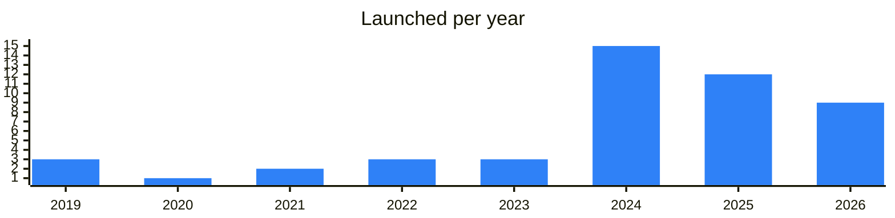

<!-- Generated by scripts/build_readme.py from data/. Do not edit by hand. -->

# On-ramp

**49 projects: 12 active, 37 quiet, 0 closed.** Back to [all categories](../README.md#categories); statuses are explained [here](../README.md#how-to-read-it). The same list as a [searchable table](../data/by-category/onramp.csv).

## Active

| # | Project | What it is | Links | Launched | Peak MAU | Verified |
| ---: | --- | --- | --- | --- | ---: | --- |
| 1 | **MoonPay** |  | [X](https://x.com/moonpay) [Site](https://www.moonpay.com) [Gram News](https://gramnews.org/apps/moonpay) | 2024-03-28 |  |  |
| 2 | **Changelly** | Exchange crypto changelly.page.link/telegram | [Telegram](https://t.me/changelly) [Site](https://apps.apple.com/us/app/crypto-exchange-buy-bitcoin/id1435140380) [GitHub](https://github.com/changelly) [Gram News](https://gramnews.org/apps/changelly) | 2019-06-11 |  |  |
| 3 | **ChangeNOW** | Crypto swap and fiat on-ramp service with cashback, non-custodial. | [Telegram](https://t.me/changenow_chat) [X](https://x.com/ChangeNOW) [Site](https://changenow.io) [GitHub](https://github.com/ChangeNow-io) [Gram News](https://gramnews.org/apps/changenow) | 2024-10-28 |  |  |
| 4 | **Alchemy Pay** |  | [Site](https://alchemypay.org) [Gram News](https://gramnews.org/apps/alchemy-pay) | 2023-10-17 |  |  |
| 5 | **Transak** |  | [Site](https://transak.com) [Gram News](https://gramnews.org/apps/transak) | 2024-05-05 |  |  |
| 6 | **Itez** | Buy, sell, swap and store digital assets in one app. OTC, off-ramp and payment solutions for business. Crypto & AI news, daily. Since 2019 | [Telegram](https://t.me/itezofficial) [X](https://x.com/Itezofficial) [Site](https://itez.com/) [Gram News](https://gramnews.org/apps/itez) | 2019-07-23 |  |  |
| 7 | **MultiKassa Bot** | MultiKassa bot lets you exchange cash rubles for cryptocurrency | [Telegram](https://t.me/multikassa_channel) [Bot](https://t.me/multikassa_bot) [X](https://x.com/multikassa) [Site](https://multikassa.com/) [Gram News](https://gramnews.org/apps/multikassa-bot) | 2022-11-30 | 12K |  |
| 8 | **Mercuryo** |  | [Site](https://mercuryo.io) [Gram News](https://gramnews.org/apps/mercuryo) | 2026-06-17 |  |  |
| 9 | **AlfaBit** | Buy/Sell & Trade Crypto, Bank Card, Air tickets, Hotels, Gift Card AlfaBit.org | [Telegram](https://t.me/alfabit_news) [Bot](https://t.me/alfabitwallet_bot) [Site](https://alfabit.org) | 2024-03-13 | 352K |  |
| 10 | **Shiba Bank** | Service for buying and selling Telegram Stars and Premium, paid by SBP or card. | [Telegram](https://t.me/shiba_bank_booms) [Bot](https://t.me/barboskich_stars_bot) | 2026-07-18 |  |  |
| 11 | **BuynStars.com** | Service for buying Telegram Stars and selling Telegram gifts. | [Telegram](https://t.me/buynstarscom) [Bot](https://t.me/buynstars_bot) [Site](https://buynstars.com) | 2025-06-21 | 55K |  |
| 12 | **Prosto Exchange** | Legal financial service in Telegram for paying crypto by QR and cashing out to cards. | [Telegram](https://t.me/prostoex_news) [Bot](https://t.me/prostoexbot) | 2021-10-11 | 24K |  |

<b>Quiet: 37</b>

| # | Project | What it is | Links | Launched | Peak MAU | Verified |
| ---: | --- | --- | --- | --- | ---: | --- |
| 13 | **Pluto Top** | Welcome to the Pluto Top-up Center！ | [Bot](https://t.me/plutotopupbot) [Gram News](https://gramnews.org/apps/pluto-top) | 2024-06-28 | 170K |  |
| 14 | **FinchPay** | FinchPay — buy crypto with a bank card, no KYC up to 500 EUR | [Telegram](https://t.me/FinchPay_io) [Bot](https://t.me/finchpaybot) [X](https://x.com/FinchPay_io) [Site](https://finchpay.io/) [Gram News](https://gramnews.org/apps/finchpay) | 2024-02-28 | 734 |  |
| 15 | **Avanchange** | Fast and secure crypto exchange since 2018. Buy, sell, or swap | [Bot](https://t.me/avanchange_bot) | 2021-01-29 |  |  |
| 16 | **AWX Crypto SHOP** | Network of offices for buying and selling crypto for fiat worldwide. | [Bot](https://t.me/awexcryptobot) | 2026-10 | 13K |  |
| 17 | **BestChange Bot** | The BestChange monitor will select profitable exchangers for cryptocurrencies, payment systems, banks and cash | [Telegram](https://t.me/bestchange) [Bot](https://t.me/bestchange_bot) [X](https://x.com/bestchangeeng) | 2020-08-26 | 33K |  |
| 18 | **Bitpapa** | Crypto marketplace with a media channel covering crypto, fintech and finance news. | [Telegram](https://t.me/bitpapa_io) [X](https://x.com/bitpapa_io) [Site](https://bitpapa.com) [Gram News](https://gramnews.org/apps/bitpapa) | 2024-03-09 |  | since 2022-10 |
| 19 | **Cosmifi** | ​​​Cosmifi - financial app to trade Telegram Stars for GRAM and USD₮(TON) or borrow against Gifts ​ | [Telegram](https://t.me/cosmifi) [Bot](https://t.me/cosmifi_bot) | 2026-03-29 |  |  |
| 20 | **DW: Toncoin Buy&Sell** | Buy & Sale TON Coin with great rate in few clicks. The part of the ecosystem | [Telegram](https://t.me/TokenInfinity) [Bot](https://t.me/DW_tonbot) [Gram News](https://gramnews.org/apps/dw-toncoin-buy-sell) | 2022-09-12 |  |  |
| 21 | **Golden Stars** | Service for buying Stars, TON and NFT gifts for rubles | [Bot](https://t.me/golden_starsbot) | 2025-03-09 |  |  |
| 22 | **GRAM в Рубли** | Automatic exchange of GRAM into rubles with withdrawal to a bank card. | [Bot](https://t.me/gramtorub_bot) | 2026-06-01 |  |  |
| 23 | **HoudiniSwap** | HoudiniSwap bot will enable you to create exchanges directly within Telegram | [Bot](https://t.me/houdiniswap_bot) | 2026-05 |  |  |
| 24 | **LH Telegram Stars** | Service for buying and selling Telegram Stars | [Bot](https://t.me/lh_tgstars_bot) | 2025-08-14 |  |  |
| 25 | **LH TON Buy** | Bot to buy and sell TON and USDT | [Bot](https://t.me/lh_tonbuy_bot) | 2024-04-21 |  |  |
| 26 | **ONLY** | Peer-to-peer service for selling crypto for rubles inside Telegram without exchanges. | [Telegram](https://t.me/p2pru) [Bot](https://t.me/only_pays_bot) | 2025-12-16 |  |  |
| 27 | **Onmeta** | Fiat-to-crypto on-ramp service with an official Telegram channel. | [Telegram](https://t.me/onmetatg) [X](https://x.com/onmetahq) [Site](https://onmeta.in/) [GitHub](https://github.com/onmetahq) [Gram News](https://gramnews.org/apps/onmeta) | 2022-01-18 |  |  |
| 28 | **Onramp** |  | [Site](https://onramp.money/main/buy/?appId=1&coinCode=ton) [Gram News](https://gramnews.org/apps/onramp) | 2023-02 |  |  |
| 29 | **Paybis Wallet** | Paybis Wallet — cryptocurrency wallet | [Bot](https://t.me/paybis_crypto_exchange_bot) [X](https://x.com/paybis) [Site](https://paybis.com/?utm_source=TonApp&utm_medium=Wallets_lisitng&utm_campaign=website) [Gram News](https://gramnews.org/apps/paybis-wallet) | 2015-06-11 |  |  |
| 30 | **Quick** | Telegram tool for converting Stars to Toncoin. | [Bot](https://t.me/quick_tg_bot) [Gram News](https://gramnews.org/apps/quick) | 2024-08-15 |  |  |
| 31 | **Seconds Market** | A service for buying and selling Telegram Stars | [Telegram](https://t.me/Seconds_market) [Bot](https://t.me/Seconds_market_bot) [X](https://x.com/Seconds_Market) [Site](https://secondsmarket.store) [Gram News](https://gramnews.org/apps/seconds-market) | 2024-12-06 |  |  |
| 32 | **SimpleSwap** |  | [Site](https://simpleswap.io/?utm_source=tonapp&utm_medium=portal&utm_campaign=exchange) [Gram News](https://gramnews.org/apps/simpleswap) | 2023-02-04 |  |  |
| 33 | **SPLIT** | Telegram Stars and TON purchase bot | [Bot](https://t.me/stars) | 2026-02-05 |  |  |
| 34 | **Stars Gold** | Bots for buying Telegram Stars and TON with rubles or cards. | [Telegram](https://t.me/referral_game) [Bot](https://t.me/starsgd_bot) | 2024-09-27 |  |  |
| 35 | **StarsBank** | Bot that converts Telegram Stars into USDT | [Bot](https://t.me/thestarsbank_bot) | 2025-03-10 |  |  |
| 36 | **StarsShopApp** | Bot for buying and selling Telegram Stars. | [Bot](https://t.me/starsshopapp_bot) | 2026-08-25 |  |  |
| 37 | **StarStore** | StarStore: A Telegram platform for stars—buy and sell stars with ease | [Telegram](https://t.me/StarStore_app) [Bot](https://t.me/TgStarStore_bot) [Site](https://starstore.app/) [Gram News](https://gramnews.org/apps/starstore) | 2024-09-25 |  |  |
| 38 | **StarSwap** | Bot to swap Telegram Stars to crypto | [Bot](https://t.me/thestarswapbot) | 2025-01-10 | 54K |  |
| 39 | **Swap2stars** | Swaps tokens and TON into Telegram Stars | [Bot](https://t.me/swap2starsbot) | 2025-12-17 |  |  |
| 40 | **Swipelux** |  | [Site](https://swipelux.com/?utm_source=tonapp&utm_medium=referral&utm_campaign=inbound) [Gram News](https://gramnews.org/apps/swipelux) | 2025-05-08 |  |  |
| 41 | **TEPE** | Instant crypto exchange without KYC, plus an airdrop bot. | [Telegram](https://t.me/sirex_io) [Bot](https://t.me/sirexio_bot) [X](https://x.com/ton_tepe) Site (down) [Gram News](https://gramnews.org/apps/tepe) | 2024-03-12 |  |  |
| 42 | **TON за рубли** | Service for buying TON with rubles. | [Bot](https://t.me/tonrub_bot) | 2024-09-27 |  |  |
| 43 | **Transack** | Fiat to crypto on-ramp that plugs into any dapp or website. | [Telegram](https://t.me/transakfinance) [X](https://x.com/transak) [GitHub](https://github.com/Transak) | 2019-04-26 |  |  |
| 44 | **TurboStars** | Bot for buying and trading Telegram Stars | [Bot](https://t.me/turbostarc_bot) | 2026-04-20 |  |  |
| 45 | **Vseznayka** | Bot for buying TON and Telegram Stars for rubles | [Bot](https://t.me/vseznayka_ex_bot) | 2025-06-23 |  |  |
| 46 | **WalletStars** | Service for buying and selling Telegram Stars for TON. | [Telegram](https://t.me/walletstarsofficial) [Bot](https://t.me/walletstarsnewbot) | 2025-02-20 | 16K |  |
| 47 | **WhiteBird.io** | Legal crypto exchange news channel | [Telegram](https://t.me/whitebirdio) [Bot](https://t.me/whitebirdbot) | 2024-05-21 |  |  |
| 48 | **Starz Market** | A bot for buying and selling Telegram Stars | [Telegram](https://t.me/StarzMarketNews) [Bot](https://t.me/StarzMarketBot) [Site](https://durovs.com) [Gram News](https://gramnews.org/apps/starz-market) | 2025-05-30 |  |  |
| 49 | **StarX** | Service for exchanging Telegram Stars and gifts for rubles and back | [Telegram](https://t.me/starxeco) | 2025-05-14 |  |  |

