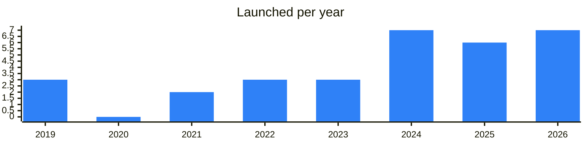

<!-- Generated by scripts/build_readme.py from data/. Do not edit by hand. -->

# On-ramp

**31 projects: 9 active, 22 quiet, 0 closed.** Back to [all categories](../README.md#categories); statuses are explained [here](../README.md#how-to-read-it). The same list as a [searchable table](../data/by-category/onramp.csv).

## Active

| # | Project | What it is | Links | Launched | Peak MAU | Verified |
| ---: | --- | --- | --- | --- | ---: | --- |
| 1 | **MoonPay** |  | [X](https://x.com/moonpay) [Site](https://www.moonpay.com) [Gram News](https://gramnews.org/apps/moonpay) | 2024-03-28 |  |  |
| 2 | **Changelly** | Exchange crypto changelly.page.link/telegram | [Telegram](https://t.me/changelly) [Site](https://apps.apple.com/us/app/crypto-exchange-buy-bitcoin/id1435140380) [GitHub](https://github.com/changelly) [Gram News](https://gramnews.org/apps/changelly) | 2019-06-11 |  |  |
| 3 | **ChangeNOW** |  | [Telegram](https://t.me/changenow_chat) [X](https://x.com/ChangeNOW) [Site](https://changenow.io) [GitHub](https://github.com/ChangeNow-io) [Gram News](https://gramnews.org/apps/changenow) | 2024-10-28 |  |  |
| 4 | **Alchemy Pay** |  | [Site](https://alchemypay.org) [Gram News](https://gramnews.org/apps/alchemy-pay) | 2023-10-17 |  |  |
| 5 | **Transak** |  | [Site](https://transak.com) [Gram News](https://gramnews.org/apps/transak) | 2024-05-05 |  |  |
| 6 | **Itez** | Buy, sell, swap and store digital assets in one app. OTC, off-ramp and payment solutions for business. Crypto & AI news, daily. Since 2019 | [Telegram](https://t.me/itezofficial) [X](https://x.com/Itezofficial) [Site](https://itez.com/) [Gram News](https://gramnews.org/apps/itez) | 2019-07-23 |  |  |
| 7 | **MultiKassa Bot** | MultiKassa bot lets you exchange cash rubles for cryptocurrency | [Telegram](https://t.me/multikassa_channel) [Bot](https://t.me/multikassa_bot) [X](https://x.com/multikassa) [Site](https://multikassa.com/) [Gram News](https://gramnews.org/apps/multikassa-bot) | 2022-11-30 | 12K |  |
| 8 | **Mercuryo** |  | [Site](https://mercuryo.io) [Gram News](https://gramnews.org/apps/mercuryo) | 2026-06-17 |  |  |
| 9 | **Prosto Exchange** | Платите криптой по QR. Покупка и вывод на карту, наличные по миру. ProstoEx -легальный сервис | [Telegram](https://t.me/prostoex_news) [Bot](https://t.me/prostoexbot) | 2021-10-11 | 24K |  |

<b>Quiet: 22</b>

| # | Project | What it is | Links | Launched | Peak MAU | Verified |
| ---: | --- | --- | --- | --- | ---: | --- |
| 10 | **FinchPay** | FinchPay — buy crypto with a bank card, no KYC up to 500 EUR | [Telegram](https://t.me/FinchPay_io) [Bot](https://t.me/finchpaybot) [X](https://x.com/FinchPay_io) [Site](https://finchpay.io/) [Gram News](https://gramnews.org/apps/finchpay) | 2024-02-28 | 734 |  |
| 11 | **Avanchange** | Fast and secure crypto exchange since 2018. Buy, sell, or swap | [Bot](https://t.me/avanchange_bot) | 2021-01-29 |  |  |
| 12 | **AWX Crypto SHOP** | Покупка и продажа крипто за фиат в офисах по всему Миру! | [Bot](https://t.me/awexcryptobot) | 2026-10 | 13K |  |
| 13 | **Bitpapa** |  | [Telegram](https://t.me/bitpapa_io) [X](https://x.com/bitpapa_io) [Site](https://bitpapa.com) [Gram News](https://gramnews.org/apps/bitpapa) | 2024-03-09 |  | since 2022-10 |
| 14 | **DW: Toncoin Buy&Sell** | Buy & Sale TON Coin with great rate in few clicks. The part of the ecosystem | [Telegram](https://t.me/TokenInfinity) [Bot](https://t.me/DW_tonbot) [Gram News](https://gramnews.org/apps/dw-toncoin-buy-sell) | 2022-09-12 |  |  |
| 15 | **Golden Stars** | Service for buying Stars, TON and NFT gifts for rubles | [Bot](https://t.me/golden_starsbot) | 2025-03-09 |  |  |
| 16 | **GRAM в Рубли** | Автоматический обмен GRAM в рубли с выводом на банковскую карту. Без верификации / NO KYC | [Bot](https://t.me/gramtorub_bot) | 2026-06-01 |  |  |
| 17 | **HoudiniSwap** | HoudiniSwap bot will enable you to create exchanges directly within Telegram | [Bot](https://t.me/houdiniswap_bot) | 2026-05 |  |  |
| 18 | **LH Telegram Stars** | Service for buying and selling Telegram Stars | [Bot](https://t.me/lh_tgstars_bot) | 2025-08-14 |  |  |
| 19 | **LH TON Buy** | Bot to buy and sell TON and USDT | [Bot](https://t.me/lh_tonbuy_bot) | 2024-04-21 |  |  |
| 20 | **ONLY** |  | [Telegram](https://t.me/p2pru) [Bot](https://t.me/only_pays_bot) | 2025-12-16 |  |  |
| 21 | **Onmeta** |  | [Telegram](https://t.me/onmetatg) [X](https://x.com/onmetahq) [Site](https://onmeta.in/) [GitHub](https://github.com/onmetahq) [Gram News](https://gramnews.org/apps/onmeta) | 2022-01-18 |  |  |
| 22 | **Onramp** |  | [Site](https://onramp.money/main/buy/?appId=1&coinCode=ton) [Gram News](https://gramnews.org/apps/onramp) | 2023-02 |  |  |
| 23 | **PSINA Stars** | Service for buying Telegram Stars and Premium | [Bot](https://t.me/psinastarsbot) | 2026-01-06 |  |  |
| 24 | **Ray Stars** | Bot for buying Telegram Stars | [Bot](https://t.me/raystarsrobot) | 2026-02-27 |  |  |
| 25 | **SimpleSwap** |  | [Site](https://simpleswap.io/?utm_source=tonapp&utm_medium=portal&utm_campaign=exchange) [Gram News](https://gramnews.org/apps/simpleswap) | 2023-02-04 |  |  |
| 26 | **Stars Buy** | Bot for buying Telegram Stars | [Bot](https://t.me/sells_stars_bot) | 2026-02-03 |  |  |
| 27 | **StarsBank** | Bot that converts Telegram Stars into USDT | [Bot](https://t.me/thestarsbank_bot) | 2025-03-10 |  |  |
| 28 | **The Open Money** | Bot for buying Telegram Stars below Telegram prices | [Bot](https://t.me/theopenmoneybot) | 2025-04-17 |  |  |
| 29 | **Transack** |  | [Telegram](https://t.me/transakfinance) [X](https://x.com/transak) [GitHub](https://github.com/Transak) | 2019-04-26 |  |  |
| 30 | **Vseznayka** | Bot for buying TON and Telegram Stars for rubles | [Bot](https://t.me/vseznayka_ex_bot) | 2025-06-23 |  |  |
| 31 | **WhiteBird.io** | Legal crypto exchange news channel | [Telegram](https://t.me/whitebirdio) [Bot](https://t.me/whitebirdbot) | 2024-05-21 |  |  |

