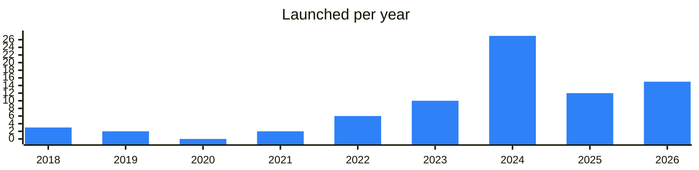

<!-- Generated by scripts/build_readme.py from data/. Do not edit by hand. -->

# Payments

**77 projects: 24 active, 51 quiet, 2 closed.** Back to [all categories](../README.md#categories); statuses are explained [here](../README.md#how-to-read-it). The same list as a [searchable table](../data/by-category/payments.csv).

## Active

| # | Project | What it is | Links | Launched | Peak MAU | Verified |
| ---: | --- | --- | --- | --- | ---: | --- |
| 1 | **Wallet Pay** | Wallet and payments service for accepting crypto, with a website and social channels. | [Telegram](https://t.me/walletpayofficial) [Site](https://pay.wallet.tg) | 2023-07-13 |  |  |
| 2 | **@Tribute** | A service for Telegram creators to monetize content through subscriptions, donations, and selling goods | [Telegram](https://t.me/tributenewsen) [Bot](https://t.me/tribute) [Site](https://tribute.tg/) [Gram News](https://gramnews.org/apps/tribute-2uz67w) | 2024-01-24 |  | since 2024-08 |
| 3 | **Cryptomus** | International crypto ecosystem with accounts and payment tools. | [Telegram](https://t.me/cryptomus) [X](https://x.com/cryptomus) [Site](https://cryptomus.com/) [GitHub](https://github.com/CryptomusCom) [Gram News](https://gramnews.org/apps/cryptomus) | 2018-05-04 |  |  |
| 4 | **NOWPayments** |  | [X](https://x.com/NOWPayments_io) [Site](https://nowpayments.io/) [Gram News](https://gramnews.org/apps/nowpayments) | 2019-05-27 |  |  |
| 5 | **0xProcessing** | Secure crypto payment gateway for global transactions with up to 99.9% acceptance rate | [Telegram](https://t.me/oxprocessing) [X](https://x.com/0Xprocessing) [Site](https://0xprocessing.com) [Gram News](https://gramnews.org/apps/0xprocessing) | 2026-04-29 |  |  |
| 6 | **Heleket** | A payment gateway for accepting crypto, TON included, on a website or in a Telegram bot, with no customer sign-up | [Telegram](https://t.me/heleket) [Site](https://heleket.com) [Gram News](https://gramnews.org/apps/heleket) | 2024-12-25 |  |  |
| 7 | **Antarctic Wallet** | Licensed crypto wallet that pays USDT in stores by QR code. | [Telegram](https://t.me/antarcticwallet) [Bot](https://t.me/antarctic_wallet_bot) [X](https://x.com/AntarcticWallet) [Site](https://antarcticwallet.com) | 2023-08-28 | 154K |  |
| 8 | **Altyn Wallet** | Wallet combining banking and stablecoins, funded from any Russian bank. | [Telegram](https://t.me/altynwallet) [Bot](https://t.me/altyn_wallet_bot) [Site](https://altyn.one) | 2024-05-21 | 46K |  |
| 9 | **@Hoton** | Telegram Premium, Stars & $GRAM top-ups — up to 60% cheaper than in-app | [Telegram](https://t.me/hotonnews) [Bot](https://t.me/hoton) | 2026-03-24 |  |  |
| 10 | **TON Pay** | Your provider to the safety and freedom of The Open Network | [Telegram](https://t.me/tonpay_official) [Bot](https://t.me/tonpay) [Site](https://ton.org/en/pay) [Gram News](https://gramnews.org/apps/tonpay-2) | 2022-05-20 |  |  |
| 11 | **xStocks** |  | [Telegram](https://t.me/xstocksfi) [X](https://x.com/xStocksFi) [Site](https://xstocks.fi) | 2025-03-31 |  |  |
| 12 | **CentPay Escrow** | Buy • Sell • Escrow • Trade Secure Transactions / Fast Processing / Global Marketplace | [Bot](https://t.me/centpaaybot) | 2026-09-01 |  |  |
| 13 | **Okpay** | Easy crypto transactions, secure storage, mobile top-ups, & digital red envelopes | [Bot](https://t.me/okaypaybot) | 2023-04-25 |  |  |
| 14 | **Kolo Bot** | Single app for spending, sending, and banking! | [Telegram](https://t.me/KoloAnn) [Bot](https://t.me/kolo) [X](https://x.com/KoloHub) [Site](https://kolo.bot/) [Gram News](https://gramnews.org/apps/kolo-bot) | 2024-05-14 |  |  |
| 15 | **Advance Stars** |  | [Telegram](https://t.me/advancestarschannel) [Bot](https://t.me/advancestars_bot) | 2025-07-23 |  |  |
| 16 | **Karta** | www.karta.io Top up with crypto, spend anywhere. Your gateway to digital finance | [Bot](https://t.me/kartawalletbot) | 2025-08-21 | 36K |  |
| 17 | **PMT (GRAM)** |  | [Bot](https://t.me/pmt_gram_bot) | 2026-08-30 |  |  |
| 18 | **Guarant** | Make your transactions without any problems! | [Telegram](https://t.me/guarantappen) [Bot](https://t.me/GuarantAppBot) [X](https://x.com/GuarantApp) [Gram News](https://gramnews.org/apps/guarant) | 2024-08-10 |  |  |
| 19 | **BFinance** | Issue a virtual crypto card with a replenished cryptocurrency today. Support: Channel | [Telegram](https://t.me/bfinancepay) [Bot](https://t.me/bfinancebot) [X](https://x.com/bfinancepay) [Site](https://bfinance.app) [Gram News](https://gramnews.org/apps/bfinance) | 2023-07-24 | 17K |  |
| 20 | **PAY.SPACE** | Wallet and card hub offering virtual cards for foreign payments and QR payments in Russia. | [Telegram](https://t.me/pay_space_channel) [Bot](https://t.me/pay_space_wallet_bot) [Site](https://pay.space) | 2025-09-26 |  |  |
| 21 | **loofta** | Loofta — payment service allowing transfers in tokens or bank accounts | [Telegram](https://t.me/loofta) [Bot](https://t.me/looftabot) [X](https://x.com/looftaxyz) [Site](https://loofta.xyz) [Gram News](https://gramnews.org/apps/loofta) | 2024-08-12 |  |  |
| 22 | **AEON** | Crypto payment standard and community | [Telegram](https://t.me/aeon_community) [X](https://x.com/AEON_Community) [Site](https://aeon.xyz) | 2024-08-05 |  |  |
| 23 | **TONBANKCARD TECH** | The TONBANKCARD ecosystem virtual NFT card will enable cardholders to use closed products within the ecosystem, such as a bank wallet with deposits and loans, a | [Telegram](https://t.me/tonbankcard) [Bot](https://t.me/tonbankcard_bot) [Site](https://getgems.io/collection/EQAjHkHtt1MIoU5c7dks73Rz8NMxAA3oStSrcQ_qgn3il-Le) | 2022-10-08 |  |  |
| 24 | **NovaCont Lite** | NovaCont Lite is a non-custodial escrow Mini App on TON | [Bot](https://t.me/NovaCont_Lite_bot) [X](https://x.com/getnovacont) [Site](https://novacont.tech) [GitHub](https://github.com/nova-cyber-and-technology/novacont-lite) | 2026-07-23 |  |  |

<b>Quiet: 51</b>

| # | Project | What it is | Links | Launched | Peak MAU | Verified |
| ---: | --- | --- | --- | --- | ---: | --- |
| 25 | **MuggleLink** | Crypto payment service offering discounts on takeout orders. | [Telegram](https://t.me/MuggleLink) [Bot](https://t.me/MuggleLinkBot) [X](https://x.com/MuggleLink) [Site](https://www.muggle.link/) [Gram News](https://gramnews.org/apps/mugglelink) | 2024-03-26 | 31K |  |
| 26 | **UStars** |  | [X](https://x.com/UStars_exchange) [Gram News](https://gramnews.org/apps/ustars) | 2024-11-20 |  |  |
| 27 | **@push** | Secure crypto transfers on Telegram. By | [Bot](https://t.me/brilliantappbot) | 2026-10 |  | yes |
| 28 | **Adpact** | Book Telegram channel ads with escrow on TON. The bot posts and verifies. Collect payment or a refund in the app | [Bot](https://t.me/adpactbot) [Site](https://adpact.app/) | 2026-08-18 |  |  |
| 29 | **ArcPay** | TON payments for sellers with direct payouts | [Bot](https://t.me/arcpaybot) | 2024-10-28 |  |  |
| 30 | **Banan Bank** | Crypto Cards that you can use for purchases and transfers | [Bot](https://t.me/bananbank_bot) | 2024-11-08 | 1.1M |  |
| 31 | **bionapp** | Scan to Pay, access credit up to $300, buy gift cards and earn rewards—all in the Bion Mini App | [Telegram](https://t.me/bionapp_bot) [X](https://x.com/bion_app) [Site](https://www.bionapp.com/) [Gram News](https://gramnews.org/apps/bionapp) | 2023-05-01 | 62K |  |
| 32 | **Card** | Crypto accounts, cards and payments inside Telegram | [Bot](https://t.me/noncustodialcardbot) | 2026-10 |  | yes |
| 33 | **Crypto Wallet** | Multicurrency Crypto Wallet by . Pay with cryptocurrency, view transactions, checks, payments | [Telegram](https://t.me/tegromoney) [Bot](https://t.me/tegrowalletbot) | 2023-04-05 |  |  |
| 34 | **Crypto Wallet Libermall Card** | Service issuing crypto Visa and Mastercard cards compatible with Apple Pay and Google Pay within minutes. | [Bot](https://t.me/libermallcardbot) | 2026-04-09 |  |  |
| 35 | **CryptoGas.shop** |  | [Site](https://cryptogas.shop/ton?ref=37027482) [Gram News](https://gramnews.org/apps/cryptogas-shop) | 2024-01 |  |  |
| 36 | **DeCoupons** |  | [Gram News](https://gramnews.org/apps/decoupons) | 2022-10-27 |  |  |
| 37 | **DeDonate** |  | [GitHub](https://github.com/delab-team) [Gram News](https://gramnews.org/apps/dedonate) | 2023-09-14 |  |  |
| 38 | **Donate** | This bot helps content creators receive financial support from their followers directly in the app | [Telegram](https://t.me/subscriptions) [Bot](https://t.me/donate) | 2021-06-28 | 12K | since 2021-06 |
| 39 | **EDGE STARS** |  | [Bot](https://t.me/edge_stars_bot) | 2026-02-15 |  |  |
| 40 | **Exact Receipt** | Exact Receipt is a TON-native, watch-only payment request and receipt service | [Telegram](https://t.me/exactreceipt) [Bot](https://t.me/WDK_Wallet_bot) [Site](https://exactreceipt.com/) | 2026-05 |  |  |
| 41 | **HANDL** | Payments to a social media handle | [Telegram](https://t.me/handlpay) | 2026-07-24 |  |  |
| 42 | **IKEEPER** | The decentralized escrow project utilizes smart contracts on the blockchain to provide a secure and transparent platform for conducting transactions | [Telegram](https://t.me/ikeeperapp) [Bot](https://t.me/ikeeperapp_bot) [X](https://x.com/app_ikeeper) Site (down) | 2024-10-20 |  |  |
| 43 | **iVendPay** |  | [X](https://x.com/ivendpay) | 2018-01-08 |  |  |
| 44 | **MineFi** | Cross-border stablecoin network | [Bot](https://t.me/mine_fi_bot) | 2025-10-04 | 69K |  |
| 45 | **moonpacket** | moonpacket — sending token red packets in Telegram | [Telegram](https://t.me/moonpacketchat) [Bot](https://t.me/moonpacket_bot) [X](https://x.com/mooniniofficial) [Site](https://moonpacket.com) [Gram News](https://gramnews.org/apps/moonpacket) | 2025-10-28 | 12K |  |
| 46 | **MugglePay** |  | [X](https://x.com/paymuggle) [GitHub](https://github.com/mugglepay) | 2019-04-03 |  |  |
| 47 | **Open Guarantor** | Escrow guarantor bot, moved to a new bot | [Bot](https://t.me/negarant_bot) | 2025-10-31 |  |  |
| 48 | **PassimPay** | PassimPay – payment gateway for business | [Telegram](https://t.me/Passim_Pay) [Bot](https://t.me/PassimPayAPP_Bot) [X](https://x.com/passimpay) [Site](https://passimpay.io/) [GitHub](https://github.com/Passimpay) [Gram News](https://gramnews.org/apps/passimpay) | 2022-11-07 |  |  |
| 49 | **PayC** | Virtual card bot paid with TON | [Bot](https://t.me/paycabot) | 2022-08-05 |  |  |
| 50 | **PayCrypto.Global** | Crypto payment service with a support bot and channel. | [Telegram](https://t.me/paycryptoglobal) [X](https://x.com/paycryptoglobal) [Site](https://paycrypto.global) [Gram News](https://gramnews.org/apps/paycrypto-global) | 2023-06-15 |  |  |
| 51 | **Payhook** |  | [Site](https://payhook.org) [GitHub](https://github.com/beh-land) [Gram News](https://gramnews.org/apps/payhook) | 2021-04-17 |  |  |
| 52 | **QR2Pay** | Service for paying through Russian SBP QR codes with USDT and virtual cards. | [Bot](https://t.me/qr2pay_bot) | 2026-04-23 |  |  |
| 53 | **Ready to Pay** | Telegram crypto cards and fiat exchange | [Bot](https://t.me/rt_pay_bot) | 2024-09-17 |  |  |
| 54 | **Rebank.fi** | Crypto bank app on Telegram | [Bot](https://t.me/rebankfi_bot) | 2024-12-20 |  |  |
| 55 | **RedotPay** | Crypto payment and card service with an official chat | [Telegram](https://t.me/redotpay) | 2024-03-18 |  |  |
| 56 | **RedotPay** | Stablecoin payments service on Telegram | [Bot](https://t.me/redotpay_bot) | 2025-06-25 | 67K | since 2026-01 |
| 57 | **Tegro** | Bot for buying Web3 apps via Tegro Money | [Bot](https://t.me/tegroweb3bot) | 2025-03-07 |  |  |
| 58 | **Tegro DeFi Crypto Payments** | Tegro ecosystem in one bot. No-KYC crypto cards, a DeFi exchange, staking and payments. The Open Network | [Bot](https://t.me/tegromoneybot) | 2022-01-25 |  |  |
| 59 | **Tegro Money** | Payment service with support bot | [Bot](https://t.me/tegrocommunitybot) | 2023-02-10 |  |  |
| 60 | **Tegro Private USDt Card** | Anonymous crypto cards for Telegram users. No KYC. No limits on freedom by | [Bot](https://t.me/tegrocardbot) | 2026-04-09 |  |  |
| 61 | **The Open Card** | AI-powered virtual crypto card for digital payments | [Bot](https://t.me/theopencardbot) | 2025-03-27 | 43K |  |
| 62 | **Token Spritz** | Voice-gifting bot sending crypto and gifts | [Telegram](https://t.me/tokenspritz) [Bot](https://t.me/tokenspritz_bot) | 2024-07-27 |  |  |
| 63 | **TON Multisender** | Batch transaction tool for TON and Jettons | [Site](https://ton.multisender.app/) | 2018-09-19 |  |  |
| 64 | **TONCA$H** | Crypto cashback app that returns part of purchases in crypto. | [Bot](https://t.me/toncashappbot) | 2024-11-11 |  |  |
| 65 | **USDPay** |  | [Site](https://usdpay.me/networks/ton) [Gram News](https://gramnews.org/apps/usdpay) | 2026-05 |  |  |
| 66 | **Volet.com** | The official English-language channel of Volet.com | [Telegram](https://t.me/voletcom) | 2024-09-04 |  |  |
| 67 | **Wallet Bot** |  | [Gram News](https://gramnews.org/apps/wallet-bot) | 2024-03-29 |  |  |
| 68 | **Wallet Pay Demo Store** | Demo store for Wallet Pay features | [Bot](https://t.me/pineappledemowpstorebot) | 2023-07-13 |  |  |
| 69 | **WebWise Pay** | Wallet and payment bot with community channel and support bot. | [Telegram](https://t.me/webwisepay) [Bot](https://t.me/webwisepay_bot) [X](https://x.com/webwise_pay) | 2025-12-25 |  |  |
| 70 | **Zimabank** | Zima Bank — your world’s first Telegram banking app & new generation bank, focused on traditional and crypto solutions | [Bot](https://t.me/zimabank_tg_bot) | 2024-07-29 |  |  |
| 71 | **TON Fonates** | Service for sending and receiving crypto gift vouchers. | [Telegram](https://t.me/fonates) [Bot](https://t.me/fonatesbot) Site (down) [GitHub](https://github.com/orgs/Fonates) [Gram News](https://gramnews.org/apps/ton-fonates) | 2024-04-01 |  |  |
| 72 | **Tonation** | Decentralized donation service with no middleman. | [Telegram](https://t.me/tonationme) [X](https://x.com/tonationme) [Site](https://tonation.me/) [Gram News](https://gramnews.org/apps/tonation) | 2024-06-06 |  |  |
| 73 | **CryptoChill** |  | [Telegram](https://t.me/CryptoChillGateway) [Bot](https://t.me/kingdomsurvivorgamebot) [X](https://x.com/cryptochill) [Site](https://cryptochill.com) [Gram News](https://gramnews.org/apps/cryptochill) | 2025-03-18 | 224 |  |
| 74 | **Tonspay** | Best telegram crypto payment system | [Telegram](https://t.me/tonspays) [Bot](https://t.me/tonspay_bot) Site (down) [GitHub](https://github.com/tonspay) [Gram News](https://gramnews.org/apps/tonspay) | 2024-02-29 |  |  |
| 75 | **QuTON Cash (QTC)** | Cash-token project with its own announcement channel. | [Telegram](https://t.me/qutoncashchannel) Site (down) [GitHub](https://github.com/qutoncash) [Gram News](https://gramnews.org/apps/quton-cash-qtc) | 2024-04-02 |  |  |

<b>Closed: 2</b>

| # | Project | What it is | Links | Launched | Peak MAU | Verified |
| ---: | --- | --- | --- | --- | ---: | --- |
| 76 | **TonoGram** |  | [Gram News](https://gramnews.org/apps/tonogram) | 2024-01 |  |  |
| 77 | **Solo** | Banking app inside Telegram for topping up mobile balance and paying utilities. | [Telegram](https://t.me/solobank) [Bot](https://t.me/solobankbot) [Site](https://www.solo.bot) | 2024-09-28 |  |  |

