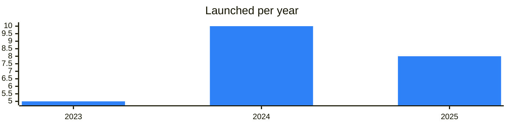
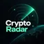

<!-- Generated by scripts/build_readme.py from data/. Do not edit by hand. -->

# RWA

**23 projects: 8 active, 15 quiet, 0 closed.** Back to [all categories](../README.md#categories); statuses are explained [here](../README.md#how-to-read-it). The same list as a [searchable table](../data/by-category/rwa.csv).

## Active

| # | Project | What it is | Links | Launched | Peak MAU | Verified |
| ---: | --- | --- | --- | --- | ---: | --- |
| 1 |  **XAUt** |  | [Telegram](https://t.me/tether) [Site](https://gold.tether.to) | 2024-04-19 |  | since 2024-12 |
| 2 |  **Stable Metal** | Stable Metal - your opportunity to invest in the precious metals market | [Telegram](https://t.me/stablemetal) [Bot](https://t.me/Stable_metal_bot) [X](https://x.com/stable_metal) [Site](https://stablemetal.com) [GitHub](https://github.com/Stable-Metal/SLAG-Collection) [Gram News](https://gramnews.org/apps/stable-metal) | 2023-05-14 |  |  |
| 3 | **USDT** |  | [Site](https://tether.to) | 2024-04-19 |  |  |
| 4 |  **Ethena USDe** |  | [Telegram](https://t.me/ethena_labs) [Site](https://ethena.fi) | 2023-05-23 |  |  |
| 5 |  **Tether Gold (XAUt0)** |  | [Telegram](https://t.me/tether) [X](https://x.com/USDT0_to) [Site](https://gold.usdt0.to/transfer) | 2025-04-22 |  | since 2024-12 |
| 6 | **Ethena tsUSDe** | tsUSDe is a special version of sUSDe deployed on TON | [X](https://x.com/ethena) [Site](https://www.app.ethena.fi) | 2025-07-22 |  |  |
| 7 | **Telegram USD** | Telegram USD is a blue-chip-backed stablecoin on the TON blockchain, designed for cross-chain yield and seamless payments. It’s easy to mint, secure, and optimized for DeFi on Telegram | [Site](https://torch.finance) | 2025-05-05 |  |  |
| 8 |  **Portal Network** | Portal Network — a bot for managing a network of electric vehicle charging stations | [Telegram](https://t.me/portal_energy) [Bot](https://t.me/portal_network_bot) [X](https://x.com/PortalNetwork_) [Site](https://portalnetwork.tech) [Gram News](https://gramnews.org/apps/portal-network) | 2024-09-24 |  |  |

<b>Quiet: 15</b>

| # | Project | What it is | Links | Launched | Peak MAU | Verified |
| ---: | --- | --- | --- | --- | ---: | --- |
| 9 |  **tbook** | The first embedded RWA liquidity layer that brings institutional-grade tokenized yield into user-facing apps | [Bot](https://t.me/tbook_incentive_bot) [Gram News](https://gramnews.org/apps/tbook) | 2023-08-31 | 423K |  |
| 10 | **SOLARIAN TECH** | Solar power plant technology project with a cryptocurrency. | [Bot](https://t.me/solariantechbot) [Gram News](https://gramnews.org/apps/solarian-tech) | 2024-07-02 | 120K |  |
| 11 |  **TokenizeTrade** | Real-world asset trading project with a points farming bot in Telegram. | [Telegram](https://t.me/tokenizetrade) [Bot](https://t.me/tokenizetradebot) [X](https://x.com/tokenizetrade) [Site](https://www.tokenize.trade) [Gram News](https://gramnews.org/apps/tokenizetrade) | 2024-02-05 | 88K |  |
| 12 |  **Aqua Protocol** |  | [Telegram](https://t.me/aquaprotocolxyz) [X](https://x.com/aquaprotocolxyz) | 2024-09-18 |  |  |
| 13 | **Bridged USD Coin (TON Bridge) (JUSDC)** |  | [Site](https://bridge.ton.org) | 2023-04-01 |  |  |
| 14 |  **CurioDAO** | Real-world asset tokenization ecosystem | [Telegram](https://t.me/curiocarqa) | 2024-08-22 |  |  |
| 15 |  **dEquity App** | dEquity!Your go-to app for trading real-world assets right from your pocket! | [Bot](https://t.me/dequityminiapp_bot) | 2024-08-10 |  |  |
| 16 | **Ethena tsUSDe (tsUSDe)** |  | [X](https://x.com/ethena_labs) [Site](https://app.ethena.fi) | 2025-04-29 |  |  |
| 17 | **Ethena USDe (USDe)** |  | [X](https://x.com/ethena_labs) [Site](https://app.ethena.fi) | 2025-02-07 |  |  |
| 18 | **jUSDT (jUSDT)** |  | [Site](https://bridge.ton.org) | 2023-04-01 |  |  |
| 19 | **Telegram USD (tgusd)** | Telegram USD (tgusd) — yield-generating stablecoin on TON | [Site](https://torch.finance) [GitHub](https://github.com/torch-core) [Gram News](https://gramnews.org/apps/telegram-usd-tgusd) | 2024-05-28 |  |  |
| 20 |  **tgUSD** | Yield-bearing stablecoin by Torch Finance | [Bot](https://t.me/tgusd_official_bot) | 2025-05-05 | 15K |  |
| 21 |  **TonStable** | The decentralized over-collateralized stablecoin protocol built on TON | [Telegram](https://t.me/TonStableOfficial) [X](https://x.com/TonStable) [Site](https://tonstable.xyz/) [Gram News](https://gramnews.org/apps/tonstable) | 2024-09-05 |  |  |
| 22 |  **TVERLOFT** | Real estate-backed RWA token TLOFT | [Telegram](https://t.me/tverloft_chat) | 2025-06-30 |  |  |
| 23 |  **Plume** | Real-world asset blockchain network | [Telegram](https://t.me/plumenetwork) [X](https://x.com/plumenetwork) [Site](https://plume.org) | 2025-01-06 |  |  |

