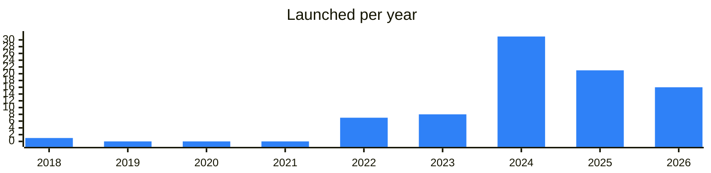

<!-- Generated by scripts/build_readme.py from data/. Do not edit by hand. -->

# Shopping

**84 projects: 23 active, 59 quiet, 2 closed.** Back to [all categories](../README.md#categories); statuses are explained [here](../README.md#how-to-read-it). The same list as a [searchable table](../data/by-category/shopping.csv).

## Active

| # | Project | What it is | Links | Launched | Peak MAU | Verified |
| ---: | --- | --- | --- | --- | ---: | --- |
| 1 | **StarsovBot** | Bot for buying Telegram Stars and gifts, with a news channel and support. | [Telegram](https://t.me/starsovnews) [Bot](https://t.me/starsovbot) | 2022-08-11 |  |  |
| 2 | **Indigo Gift** | Bot for buying Telegram stars and premium | [Telegram](https://t.me/indigogif) | 2025-08-11 |  |  |
| 3 | **Mops Stars** | Bot for buying Telegram Stars. | [Bot](https://t.me/mopsstarsbot) | 2026-01-14 |  |  |
| 4 | **Boogie** | Bot for buying Telegram Stars, run by the Boogie channel. | [Telegram](https://t.me/boo_gifts) [Bot](https://t.me/boogiestars_bot) | 2024-05-07 |  |  |
| 5 | **Vortex Crypto** | Bot for buying Telegram Stars run by a crypto channel, with a chat and managers. | [Telegram](https://t.me/vortexcryptoo) [Bot](https://t.me/straxzxstar_bot) | 2025-10-02 |  |  |
| 6 | **BERKUT COMMUNITY** | Bot marketplace selling Telegram Stars, Premium and gifts, run by a crypto community channel. | [Telegram](https://t.me/berkutcryptoteam) [Bot](https://t.me/berkutstars_bot) | 2024-07-16 |  |  |
| 7 | **KNTxMRKT** | Bot for buying Telegram Stars, with a channel, chat, price list and reviews. | [Telegram](https://t.me/knt007b) [Bot](https://t.me/knt_stars_bot) | 2025-04-09 |  |  |
| 8 | **Звёзды** | Bot for buying Telegram Stars, with terms and a support bot. | [Bot](https://t.me/stars_buddy_bot) | 2026-02-06 | 517K |  |
| 9 | **Bikini Stars** | Service for buying and selling Telegram Stars | [Telegram](https://t.me/bikininft) | 2025-09-09 |  |  |
| 10 | **iCryptoCheck** | Your guide to the world of crypto | [Telegram](https://t.me/iCryptoCheck) [Bot](https://t.me/iCryptoCheckBot) [X](https://x.com/iCryptoCheck) [GitHub](https://github.com/unlimadev/Orniton) [Gram News](https://gramnews.org/apps/icryptocheck) | 2022-05-03 | 52K |  |
| 11 | **Foxy Stars** | Bot for quickly buying Telegram Stars, Premium and other digital goods. | [Bot](https://t.me/foxystarsshopbot) | 2026-08-23 |  |  |
| 12 | **AmberMarket** | Digital goods store in Telegram selling subscriptions, games and top-ups such as GPT, Claude and PS Plus. | [Telegram](https://t.me/ambermarket_official) [Bot](https://t.me/ambermarket_official_bot) | 2026-05-11 |  |  |
| 13 | **BitFlick Stars** | Purchase Stars and Premium subscriptions – easy, fast, anonymous Community, reviews – t.me/BitStarsInfo | [Telegram](https://t.me/bitstarsinfo) [Bot](https://t.me/bfstars) | 2025-11-23 |  |  |
| 14 | **HelperStars & Premium** | Bot that helps buy Telegram Stars, TON and Premium subscriptions. | [Bot](https://t.me/helperstars_robot) [Gram News](https://gramnews.org/apps/helperstars_robot) | 2022-05-27 | 40K |  |
| 15 | **Gifting** | Buy Telegram Premium and Stars Sponsored by - rainbet.com | [Telegram](https://t.me/giftingtg) [Bot](https://t.me/cryptotopremiumbot) [Site](https://gifting.tg) | 2024-07-26 |  |  |
| 16 | **Пипл** | Marketplace for Apple Pay and Google Pay payments, gift cards, games and eSIMs. | [Bot](https://t.me/pyyplrubot) | 2022-04-06 |  |  |
| 17 | **ЛЭЙМ** | Bot for buying Telegram Stars, with a help contact, reviews and channel boost. | [Telegram](https://t.me/lamestars) [Bot](https://t.me/lamestarsbot) | 2025-11-06 |  |  |
| 18 | **webappz** | Service for creating automatic stores and menus inside Telegram. | [Telegram](https://t.me/webappz) [Bot](https://t.me/webappzconnectbot) [Site](https://webappz.org) [Gram News](https://gramnews.org/apps/webappz) | 2023-07-28 |  |  |
| 19 | **Uquid Shop** | Shopping bot in Telegram giving access to millions of products. | [Telegram](https://t.me/uquidshop) [Bot](https://t.me/uquidbot) [X](https://x.com/uquidcard) [Site](https://uquid.com) [Gram News](https://gramnews.org/apps/uquid-shop) | 2024-05-16 |  | since 2026-02 |
| 20 | **uShopWebBot** | Web bot shop builder for Telegram | [Telegram](https://t.me/uShopWeb) [Bot](https://t.me/uShopWebBot) [Site](https://www.ucoz.ru/bot/) [Gram News](https://gramnews.org/apps/ushopwebbot) | 2022-12-05 |  |  |
| 21 | **IrenSystem** | Tool for entrepreneurs and freelancers to build a personal website for their clients. | [Telegram](https://t.me/irensyst) [Bot](https://t.me/demoirensystembot) [Site](https://irensystem.ru) [Gram News](https://gramnews.org/apps/irensystem) | 2023-03-22 |  |  |
| 22 | **digiverse** | Digiverse is an on-chain marketplace with a Shop & Earn function | [Telegram](https://t.me/digibuycommunity) [Bot](https://t.me/digibuy_bot) Site (down) [Gram News](https://gramnews.org/apps/digiverse-pzj157) | 2024-08-13 | 1.1M |  |
| 23 | **$GOVNO Paper Store** | Online merchandise store with shipping to Kaliningrad and CIS countries. | [Telegram](https://t.me/govnopaperstore) [Bot](https://t.me/GOVNOPaperBot) [X](https://x.com/govno_on_ton) [Site](https://govnoton.com/) [Gram News](https://gramnews.org/apps/govno-paper-store) | 2025-02-13 |  |  |

<b>Quiet: 59</b>

| # | Project | What it is | Links | Launched | Peak MAU | Verified |
| ---: | --- | --- | --- | --- | ---: | --- |
| 24 | **USDt Gift Shop** | USDt Gift Shop — a bot for buying gifts and services with TON stablecoins | [Telegram](https://t.me/fizen_io) [Bot](https://t.me/fizengiftshop_bot) [X](https://x.com/fizenapp) [Site](https://fizen.io/) [Gram News](https://gramnews.org/apps/usdt-gift-shop) | 2024-05-10 | 24K |  |
| 25 | **FileMarket AI** | Welcome to the world of FileMarket AI Data! Monetize your data and help major AI companies to train their models | [Telegram](https://t.me/filemarketai) [Bot](https://t.me/filemarketaiplaybot) [X](https://x.com/FileMarketAI) [Site](https://filemarket.xyz) [Gram News](https://gramnews.org/apps/filemarket-ai) | 2024-09-12 | 100K |  |
| 26 | **MrGem** | MrGem — a marketplace for in-game items and gift cards | [Telegram](https://t.me/mrgem_official) [Bot](https://t.me/mestergem_bot) [Site](https://mrgem.io/blog/) [Gram News](https://gramnews.org/apps/mrgem) | 2024-04-20 | 32K |  |
| 27 | **Boosteam** | is a Telegram Boosts Exchange | [Telegram](https://t.me/boosteamchannel) [Bot](https://t.me/boosteambot) [Gram News](https://gramnews.org/apps/boosteam) | 2024-07-18 | 14K |  |
| 28 | **TADA mini** | Ride the new wave, TADA mini for Web3 | [Telegram](https://t.me/mvlchain_news_en) [Bot](https://t.me/TADA_Ride_Bot) [X](https://x.com/mvlchain) [Site](https://mvlchain.io/) [Gram News](https://gramnews.org/apps/tada-mini) | 2018-05-14 | 3.6M |  |
| 29 | **Hybrid Savings** | Aggregator of offers and coupons from Web2 and Web3 brands. | [Telegram](https://t.me/hybridsavings) [Bot](https://t.me/hybridsavingsbot) [X](https://x.com/Hybrid_savings) [Gram News](https://gramnews.org/apps/hybrid-savings) | 2024-08-24 |  |  |
| 30 | **Sellz Digital** | Create your Telegram digital store, accept orders, manage products, and engage customers | [Telegram](https://t.me/sellzdigital) [Bot](https://t.me/sellzdigitalbot) [Gram News](https://gramnews.org/apps/sellz-digital) | 2024-07-03 | 4K |  |
| 31 | **Shop Builder** | A Telegram shop with automated product filling and AI support | [Telegram](https://t.me/TGShopNews) [Bot](https://t.me/TGShopsBuilderBot) [X](https://x.com/Twitgram_HQ) [Site](https://tg-shops.com/) [Gram News](https://gramnews.org/apps/shop-builder-2) | 2023-12-07 | 3K |  |
| 32 | **Shop Builder** | A Telegram shop with crypto payments and AI assistants | [Telegram](https://t.me/ShopsBuilder) [Bot](https://t.me/ShopsBuilderBot) [X](https://x.com/shopsbuilder) [Site](https://shopsbuilder.notion.site/helpcenter) [Gram News](https://gramnews.org/apps/shop-builder) | 2024-04-22 |  |  |
| 33 | **Tickyton** |  | [Bot](https://t.me/tickytonbot) [Gram News](https://gramnews.org/apps/tickyton) | 2024-02-27 | 137 |  |
| 34 | **AOKI Seller** | Start business and open your shop with /start | [Telegram](https://t.me/DigtonFaucet) [Bot](https://t.me/aoki_seller_bot) [X](https://x.com/DigTonApp) [Site](https://aokimarket.com) [Gram News](https://gramnews.org/apps/aoki-seller) | 2025-04-02 |  |  |
| 35 | **behind** |  | [Bot](https://t.me/bhndbot) [Gram News](https://gramnews.org/apps/behind) | 2023-08 |  |  |
| 36 | **Beliton** | Bot for automatic Stars top-up and Telegram Premium purchase | [Bot](https://t.me/belitonbot) | 2022-04-26 |  |  |
| 37 | **Buy Telegram Stars** | Bot for buying Telegram Stars without verification | [Bot](https://t.me/buy_stars_sell_bot) | 2024-12-14 |  |  |
| 38 | **Cashbacker** | Cashback bot that pays TON to a wallet for fiat purchases made through it. | [Telegram](https://t.me/cashbacktoncommunity) [Bot](https://t.me/cashbackton_bot) [Site](https://pizzaton.me) [GitHub](https://github.com/pizzaton) [Gram News](https://gramnews.org/apps/cashbacker) | 2023-11-04 | 553 |  |
| 39 | **Catallaxy** | Catallaxy — a marketplace for digital goods and services on TON | [Telegram](https://t.me/catallaxy_ton) [Bot](https://t.me/catallaxy_bot) [X](https://x.com/catallaxy_ton) [Site](https://ctlx.cc) [GitHub](https://github.com/dearjohndoe/ton-agents-marketplace) [Gram News](https://gramnews.org/apps/catallaxy) | 2026-03-15 |  |  |
| 40 | **Coinco** | Shop your favorite products in Coinco. Pay with crypto and ship to 200+ countries | [Telegram](https://t.me/coinco_global) [Bot](https://t.me/coinco_bot) [Site](https://coinco.io) [Gram News](https://gramnews.org/apps/coinco) | 2026-05-01 |  |  |
| 41 | **CryptoMerch** | Marketplace exchanging NFTs for physical merchandise on TON | [Bot](https://t.me/cryptomerchstorebot) | 2024-06-28 |  |  |
| 42 | **frens robot** | Telegram bot store for buying Telegram gifts in any quantity. | [Bot](https://t.me/frensrobot) | 2025-08-19 |  |  |
| 43 | **GiftX: AI Wishlist** | Wishlist app with AI gift suggestions and reservations, shared through one link. | [Bot](https://t.me/giftxtech_bot) [Gram News](https://gramnews.org/apps/giftx-ai-wishlist) | 2025-08-20 |  |  |
| 44 | **LaFTon Bot** | Buy Stars, Premium, and top up TON in Telegram with payments in any cryptocurrencies | [Telegram](https://t.me/LaFTon) [Bot](https://t.me/LaFTonBot) [X](https://x.com/laftonnews) [Gram News](https://gramnews.org/apps/lafton-bot) | 2024-09-21 |  |  |
| 45 | **Luxury Stars** | Bot for buying Stars, Premium and topping up Gram balance without KYC. | [Bot](https://t.me/lxstarsbot) [Site](https://luxurystars.tg) | 2025-09-01 |  |  |
| 46 | **mgs backstage** | Digital goods hub bot selling Stars, Premium and NFT gifts, with crypto exchange. | [Telegram](https://t.me/mgsbackstage) [Bot](https://t.me/lumenx_robot) | 2026-08-18 |  |  |
| 47 | **Moneton** | Bot for buying Telegram Stars and Premium, with a news channel and support. | [Bot](https://t.me/moneton_bot) | 2023-09-29 |  |  |
| 48 | **monomenu** |  | [Gram News](https://gramnews.org/apps/monomenu) | 2024-05-30 |  |  |
| 49 | **MyStars.tg** | Buy Telegram Stars and Premium with TON/USDT, no KYC | [Telegram](https://t.me/mystarstg_official) [Bot](https://t.me/my_stars_tg_bot) [X](https://x.com/MyStars_tg) [Site](https://mystars.tg) [GitHub](https://github.com/mystars-tg) [Gram News](https://gramnews.org/apps/mystars-tg) | 2026-03-31 |  |  |
| 50 | **mzhn.store** | Telegram shop with drops and support bot | [Bot](https://t.me/mozhnostore_bot) | 2024-09-10 |  |  |
| 51 | **OpenMarketplace** |  | [Gram News](https://gramnews.org/apps/openmarketplace) | 2025-04-29 |  |  |
| 52 | **Peeple** | Marketplace for gift cards, games and eSIM in Telegram | [Bot](https://t.me/cryptocard) | 2025-12-22 |  |  |
| 53 | **PSINA Stars** | Service for buying Telegram Stars and Premium | [Bot](https://t.me/psinastarsbot) | 2026-01-06 |  |  |
| 54 | **Ray Stars** | Bot for buying Telegram Stars | [Bot](https://t.me/raystarsrobot) | 2026-02-27 |  |  |
| 55 | **Refovoz** | Store of referrals for Zoo, Bums and other crypto games | [Bot](https://t.me/refovoz_bot) | 2024-05-21 |  |  |
| 56 | **Spend App** | Fast. Secure. Simple. Fragment or Major. spend.tg | [Bot](https://t.me/spendtgbot) | 2024-09-20 |  |  |
| 57 | **Stargram** | Bot for buying Telegram Stars, Premium and TON. | [Bot](https://t.me/stargram_official_bot) | 2025-08-11 | 5K |  |
| 58 | **Stars Buy** | Bot for buying Telegram Stars | [Bot](https://t.me/sells_stars_bot) | 2026-02-03 |  |  |
| 59 | **Stars Partners** | Franchise for building Telegram bots that sell stars | [Bot](https://t.me/starspartners_robot) | 2022-05-27 |  |  |
| 60 | **Starsgram** | Service for buying Telegram Stars, TON and Premium | [Bot](https://t.me/starsgram_official_bot) | 2024-11-26 |  |  |
| 61 | **StarShip** | Bot for buying Telegram Stars quickly, with a support contact. | [Bot](https://t.me/starsshipbot) | 2024-05-21 |  |  |
| 62 | **StarsPrime** | Bot selling Telegram Stars, Premium and hidden gifts, with a support contact. | [Bot](https://t.me/starsprimesbot) | 2026-08-29 |  |  |
| 63 | **The Open Money** | Bot for buying Telegram Stars below Telegram prices | [Bot](https://t.me/theopenmoneybot) | 2025-04-17 |  |  |
| 64 | **Tmarket** | Shop for NFT email domains, Telegram stars & premium, eSIMs, top-up Steam and more | [Telegram](https://t.me/tmarket) [Bot](https://t.me/tmarkettonbot) | 2025-05-07 |  |  |
| 65 | **TON Merch** | Online merchandise store where items are paid for in TON. | [Telegram](https://t.me/tonmerch) [Bot](https://t.me/tonmerch_bot) | 2023-02-07 |  |  |
| 66 | **TonMart** | Shop global products in TonMart. Pay with crypto and ship to 200+ countries | [Bot](https://t.me/tonmartbot) | 2024-06 |  |  |
| 67 | **Umy.com** | Umy.com — hotel and flight bookings with cryptocurrency payments | [Telegram](https://t.me/umyofficialnews) [Bot](https://t.me/umy_official_bot) [X](https://x.com/umycomofficial) [Site](https://umy.com/) [Gram News](https://gramnews.org/apps/umy-com) | 2025-03-17 |  |  |
| 68 | **Utya Stars** | Bot for buying Telegram Premium, TON and Stars at a discount. | [Telegram](https://t.me/giftsutya) [Bot](https://t.me/starsutya_bot) [Site](https://utya.net) | 2026-02-13 |  |  |
| 69 | **VibeMarket** |  | [Telegram](https://t.me/vibecodemarketdev_bot) [Site](https://vibemarket.pro/en) [Gram News](https://gramnews.org/apps/vibemarket) | 2026-05 |  |  |
| 70 | **VillaTon** | Service selling TON, Stars, Premium and gifts, run by a crypto channel. | [Telegram](https://t.me/cryptoandvilla) [Bot](https://t.me/villaton_bot) | 2026-03-15 |  |  |
| 71 | **Vozik Shop** | Bot for buying Telegram Stars and Premium quickly, with a support contact. | [Bot](https://t.me/vozikstarsbot) | 2025-07-28 |  |  |
| 72 | **Vseznayka Stars** | Bot for buying Telegram Stars and Premium at a discount | [Bot](https://t.me/vseznayka_stars_bot) | 2025-03-01 |  |  |
| 73 | **WebDosa** | WebDosa — a shopping bot in Telegram | [Telegram](https://t.me/undrdosabot) [Bot](https://t.me/undrdosa) Site (down) [Gram News](https://gramnews.org/apps/webdosa) | 2024-09-17 |  |  |
| 74 | **WeStars** | Bot for buying Telegram Stars and Premium with instant delivery, with Persian-language support. | [Bot](https://t.me/westarsbot) | 2026-08-11 |  |  |
| 75 | **Zemo Tea** | Online tea shop bot with TON integration | [Bot](https://t.me/zemotea_bot) | 2024-12-26 | 30K |  |
| 76 | **МАРКЕТ СКРУДЖА** | Telegram bot selling Stars, with no refunds, run by a gifts channel. | [Telegram](https://t.me/gift_podarki) [Bot](https://t.me/stars_scrooge_bot) | 2025-06-06 |  |  |
| 77 | **TONCash** | Telegram mini app for cashback shopping at many brands | [Telegram](https://t.me/toncashnetwork) [X](https://x.com/ToncashNetwork) [Site](https://toncashnetwork.com) | 2024-10-28 |  |  |
| 78 | **FragMem** | Dev log of Fragment meme bots | [Telegram](https://t.me/fragmembots) [Bot](https://t.me/fragmembot) | 2024-12-03 |  |  |
| 79 | **Peravel** | The Modern Life Solution! | [Telegram](https://t.me/peraveldefi) [Bot](https://t.me/Peravelbot) [Site](https://app.peravel.com/) [Gram News](https://gramnews.org/apps/peravel) | 2025-02-06 |  |  |
| 80 | **SoftShelf** | Marketplace for digital goods in Telegram with payment in TON. | [Telegram](https://t.me/SoftShelf) [Bot](https://t.me/SoftShelfBot) [Gram News](https://gramnews.org/apps/softshelf) | 2024-08-29 |  |  |
| 81 | **Play Wallet** | Top up games with crypto › | [Telegram](https://t.me/playwallet_news) [X](https://x.com/playwalletbot) [Site](https://www.playwallet.bot) [Gram News](https://gramnews.org/apps/play-wallet) | 2023-03-26 |  |  |
| 82 | **MAGAZ** | Crypto marketplace on TON | [Telegram](https://t.me/magaz_channel) [Bot](https://t.me/magaz_tonwinners_bot) | 2024-04-15 |  |  |

<b>Closed: 2</b>

| # | Project | What it is | Links | Launched | Peak MAU | Verified |
| ---: | --- | --- | --- | --- | ---: | --- |
| 83 | **Bounty Bay** |  | [X](https://x.com/0xBountyBay) [Site](https://www.bountybay.app/) | 2024-04 |  |  |
| 84 | **TGGifts** | Bot for sending crypto and gifts to friends, with a chat and news channel. | [Telegram](https://t.me/tongiftsnews) [Bot](https://t.me/GetTonGifts_Bot) [X](https://x.com/TonGiftsbot) [Site](https://gifts.tg) | 2024-03-01 | 1.2M |  |

