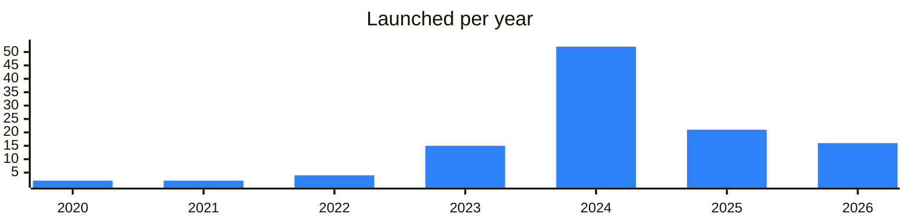

<!-- Generated by scripts/build_readme.py from data/. Do not edit by hand. -->

# Social

**114 projects: 19 active, 95 quiet, 0 closed.** Back to [all categories](../README.md#categories); statuses are explained [here](../README.md#how-to-read-it). The same list as a [searchable table](../data/by-category/social.csv).

## Active

| # | Project | What it is | Links | Launched | Peak MAU | Verified |
| ---: | --- | --- | --- | --- | ---: | --- |
| 1 | **@Mira** | Personal AI agent that turns conversations into actions | [Telegram](https://t.me/miramedia_en) [Bot](https://t.me/mira) [Site](https://mira.tg) | 2025-03-19 |  | since 2026-03 |
| 2 | **TON Dating** | TON Dating is a selective dating community with verified profiles | [Telegram](https://t.me/tondatingchannel) [Bot](https://t.me/TonDating_bot) [Site](https://ton.dating) [Gram News](https://gramnews.org/apps/ton-dating) | 2023-10-17 |  | since 2024-05 |
| 3 | **@Major** | Major is a Telegram app with its own token, NFT market, games, and staking | [Bot](https://t.me/major) [X](https://x.com/majoroftelegram) [Site](https://major.bot) [Gram News](https://gramnews.org/apps/major-1) | 2021-11-06 |  | since 2024-08 |
| 4 | **@IPredict** | Predict match outcomes and trade football markets inside Telegram. Powered by USDT on TON with instant cashout | [Bot](https://t.me/ipredict) | 2026-06-05 |  |  |
| 5 | **cult of not** |  | [Telegram](https://t.me/cultofnot) | 2024-05-22 |  |  |
| 6 | **iMe app** | iMe Wallet: a wallet for the LIME token and cryptocurrency management | [Telegram](https://t.me/ime_en) [Bot](https://t.me/iMe_lime_bot) [X](https://x.com/iMePlatform) [Site](https://www.imem.app/) [GitHub](https://github.com/imemessenger) [Gram News](https://gramnews.org/apps/ime-app) | 2020-04-26 |  |  |
| 7 | **Tmail** | Tmail — a secure Web3‑Web2 email service on TON | [Telegram](https://t.me/tmailofficial) [Bot](https://t.me/tmail_ton_bot) [X](https://x.com/tmail_ton) [Site](https://tmail.ae/) [Gram News](https://gramnews.org/apps/tmail) | 2024-11-20 |  |  |
| 8 | **Tonex** | Web3-focused social network available as an app, with an English-language channel. | [Telegram](https://t.me/tonex_app) [X](https://x.com/tonexapp) [Site](https://tonex.app) [Gram News](https://gramnews.org/apps/tonex) | 2022-04-18 |  |  |
| 9 | **IdentityHub** |  | [Site](https://identityhub.app) | 2026-01-25 |  |  |
| 10 | **Grouche** | First charity & crowdfunding platform on TON working on DAO principle | [Telegram](https://t.me/grouche_coin) [Bot](https://t.me/grouche_bot) [X](https://x.com/grouchecoin) [Site](https://grouche.com) [Gram News](https://gramnews.org/apps/grouche) | 2024-04-23 |  |  |
| 11 | **КрипTONский кот** | Правообладателям: copyright.by | [Telegram](https://t.me/cryptoncat) [Gram News](https://gramnews.org/apps/kriptonskii-kot) | 2023-04-01 |  |  |
| 12 | **Codeforces** |  | [Site](https://codeforces.com) | 2009-04-10 |  |  |
| 13 | **Six Seven Club Bot** | Community mini app built around the 67 meme, with a dedicated channel and support bot. | [Telegram](https://t.me/club67) [Bot](https://t.me/sixsevenclub_bot) | 2025-12-02 |  |  |
| 14 | **TonTake (TAKE)** | Crypto community project with a clicker bot, scammer reports, a marketplace and a guarantor service. | [Telegram](https://t.me/TonTake) [Bot](https://t.me/TonTakeChatbot) [X](https://x.com/TonTakeGame) Site (down) [Gram News](https://gramnews.org/apps/tontake-take) | 2022-05-10 |  |  |
| 15 | **ZIFRETTA** | Set of Web3 projects on TON, including an educational bot, with a public wiki. | [Telegram](https://t.me/zifretta_ecosystem) [Bot](https://t.me/zifretta_bot) [Site](https://zifretta.com) | 2024-04-16 | 54K |  |
| 16 | **Not Meme** | Social network for meme creators on TON | [Telegram](https://t.me/tonstrategy) | 2025-08-25 |  |  |
| 17 | **Skate** | Telegram mini app announcements channel for the Skate app | [Telegram](https://t.me/skate_app) | 2024-10-16 |  |  |
| 18 | **DAOPEOPLE** | Social network for AI and Web3 | [Telegram](https://t.me/daopeople_official) [X](https://x.com/DAOPEOPLE) [Site](https://daopeople.io) | 2024-06-18 |  |  |
| 19 | **Phoenix** | SocialFi and GameFi project | [Telegram](https://t.me/phxpw) | 2025-09-19 |  |  |

<b>Quiet: 95</b>

| # | Project | What it is | Links | Launched | Peak MAU | Verified |
| ---: | --- | --- | --- | --- | ---: | --- |
| 20 | **RichBlock** | Telegram bot with an accompanying community channel. | [Telegram](https://t.me/richblock_channel) [Bot](https://t.me/richblock_bot) [Gram News](https://gramnews.org/apps/richblock) | 2024-07-10 | 92K |  |
| 21 | **vSelf** | Official channel for early adopters of vSelf: a platform that helps brands host and tokenize their communities on Telegram and socials. Build mini-games, quests, and activations for your community | [Telegram](https://t.me/vselfmeta) [Bot](https://t.me/vself_bot) [X](https://x.com/vself_meta) [Site](https://vself.app/) [Gram News](https://gramnews.org/apps/vself) | 2021-11-20 | 21K |  |
| 22 | **BeeVerse By NCTR** | Are you ready for adventures in BeeVerse? | [Bot](https://t.me/bee_verse_bot) [Gram News](https://gramnews.org/apps/beeverse-by-nctr) | 2024-06-15 | 372K |  |
| 23 | **WALL Future** | Social platform — posts, graffiti, gifts, Stars | [Telegram](https://t.me/wall) [Bot](https://t.me/wall_game_bot) [Gram News](https://gramnews.org/apps/wall-future) | 2024-06 | 50K |  |
| 24 | **INVITE** |  | [Bot](https://t.me/uxinvite_bot) [Gram News](https://gramnews.org/apps/invite) | 2024-08-01 | 324K |  |
| 25 | **Khomyakovo GOV** |  | [Bot](https://t.me/khomyakovo_gov_bot) [Gram News](https://gramnews.org/apps/khomyakovo-gov) | 2024-05-22 | 35K |  |
| 26 | **Friends** |  | [Bot](https://t.me/friendstonbot) [Gram News](https://gramnews.org/apps/friends) | 2024-07-24 | 228K |  |
| 27 | **LinkFork** | LinkFork is your ultimate social network hub on Telegram | [Telegram](https://t.me/linkfork_en) [Bot](https://t.me/linkforkbot) [Site](https://linkfork.io) [Gram News](https://gramnews.org/apps/linkfork) | 2023-11-26 | 21K |  |
| 28 | **CyTrump** | Game on the Telegram platform themed around CyberTrump, with its own channel. | [Telegram](https://t.me/CyTrump) [Bot](https://t.me/cytrumpbot) [Gram News](https://gramnews.org/apps/cytrump) | 2024-09-25 | 123K |  |
| 29 | **To The Moon** |  | [Bot](https://t.me/popptothemoon_bot) [Gram News](https://gramnews.org/apps/to-the-moon-54wdfm) | 2024-07-27 | 423K |  |
| 30 | **Be Taurus** | Community: Chat: Support | [Bot](https://t.me/be_taurus_bot) [X](https://x.com/BeTaurus_App) Site (down) [Gram News](https://gramnews.org/apps/be-taurus) | 2024-05-08 | 363K |  |
| 31 | **Freelz** | Telegram bot and news channel for short videos inside Telegram. | [Telegram](https://t.me/freelz_official) [Bot](https://t.me/freelz_bot) [Gram News](https://gramnews.org/apps/freelz) | 2024-07-17 | 166K |  |
| 32 | **Swarm** | Decentralized deliberative prediction markets | [Bot](https://t.me/getswarmed_bot) [X](https://x.com/getswarmed) [Gram News](https://gramnews.org/apps/swarm) | 2024-03-17 | 2.9M |  |
| 33 | **Buzzit.TON** | the first-ever voting mini-app in telegram | [Telegram](https://t.me/buzzitton) [Bot](https://t.me/buzzit1_bot) [X](https://x.com/buzzit_public) [Gram News](https://gramnews.org/apps/buzzit-ton) | 2024-12-27 | 8.8M |  |
| 34 | **Whycoin** |  | [Bot](https://t.me/whycoinorgbot) [X](https://x.com/whycoinorg) [Gram News](https://gramnews.org/apps/whycoin) | 2024-07-15 | 376K |  |
| 35 | **DINO** |  | [Telegram](https://t.me/dinocards) [Bot](https://t.me/dinocards_bot) [Gram News](https://gramnews.org/apps/dino) | 2024-08-08 | 26K |  |
| 36 | **OGCommunity Bot** | We are building the most influential community in gaming! | [Bot](https://t.me/ogcommunitybot) [Gram News](https://gramnews.org/apps/ogcommunity-bot) | 2024-01-06 | 1.6M |  |
| 37 | **Frogy LIVE** | Welcome to the official FROGY Channel! | [Telegram](https://t.me/FrogyNews) [Bot](https://t.me/FrogyLiveBot) [X](https://x.com/Frogy_LIVE) [Site](https://docs.frogy.live) [Gram News](https://gramnews.org/apps/frogy-live) | 2024-07-07 | 316K |  |
| 38 | **SideFans (By SideKick)** | Share, Engage, and Trade Live Effortlessly | [Telegram](https://t.me/sidekick_official) [Bot](https://t.me/sidekick_fans_bot) [X](https://x.com/sidekick_labs) [Gram News](https://gramnews.org/apps/sidefans-by-sidekick) | 2024-04-16 | 9M | since 2025-08 |
| 39 | **KKX love** |  | [Bot](https://t.me/kkxlove_bot) [Gram News](https://gramnews.org/apps/kkx-love) | 2024-05-15 | 30K |  |
| 40 | **Bulls** | #1 Prediction markets platform on tonchain ! | [Telegram](https://t.me/realbullscommunity) [Bot](https://t.me/bullsonton_bot) [X](https://x.com/bullsonton) [Gram News](https://gramnews.org/apps/bulls) | 2024-08-28 | 259K |  |
| 41 | **SecondLive Bot** | SecondLive Bot — an AI-powered social mini app | [Telegram](https://t.me/SecondLiveCommunity) [Bot](https://t.me/secondlive_bot) [X](https://x.com/SecondLiveReal) Site (down) [GitHub](https://github.com/SecondLive) [Gram News](https://gramnews.org/apps/secondlive-bot) | 2024-02-07 | 851K |  |
| 42 | **pigshousebot** |  | [Bot](https://t.me/pigshousebot) [X](https://x.com/realpigshouse) [Gram News](https://gramnews.org/apps/pigshousebot) | 2024-05-29 | 6.4M |  |
| 43 | **ShareON** | Read, share, and earn web3 assets now! | [Bot](https://t.me/share_on_bot) [Gram News](https://gramnews.org/apps/shareon) | 2024-01-16 | 7K |  |
| 44 | **Fast Food Memes** | Bot that sends memes, with a channel posting selected memes from the bot. | [Telegram](https://t.me/fastfoodmemes) [Bot](https://t.me/ffmemesbot) [Gram News](https://gramnews.org/apps/fast-food-memes) | 2020-03-15 | 3K |  |
| 45 | **Towim** | Crypto dating bot for Telegram. | [Bot](https://t.me/towimbot) [Gram News](https://gramnews.org/apps/towim) | 2024-02-10 | 1K |  |
| 46 | **SmartDeer** |  | [Bot](https://t.me/smartdeer_prod_bot) [Gram News](https://gramnews.org/apps/smartdeer) | 2024-01-22 | 631 |  |
| 47 | **The Caps** | Prediction market inside Telegram, branded as Tolymarket. | [Bot](https://t.me/the_caps_bot) [X](https://x.com/The_Caps_Game) [Gram News](https://gramnews.org/apps/the-caps) | 2024-04-30 |  |  |
| 48 | **Twitton** | Web3 take on Twitter where users read news, browse pictures and watch videos for rewards. | [Bot](https://t.me/twitton_bot) [X](https://x.com/web3Twitton) [Gram News](https://gramnews.org/apps/twitton) | 2024-08-14 | 130K |  |
| 49 | **@Placce** |  | [Telegram](https://t.me/placce) [Bot](https://t.me/placcerobot) | 2025-05-29 |  |  |
| 50 | **ART VNUKICH** |  | [Bot](https://t.me/art_vnukich_bot) | 2026-05-04 |  |  |
| 51 | **Asiqpai** | ASIQPAI is a music-focused Telegram Mini App built on TON and powered by the ASIQ utility token | [Telegram](https://t.me/asiqpaihub) [Bot](https://t.me/asiqpai_bot) [X](https://x.com/asiqpai) [Site](https://asiqpai.site) [GitHub](https://github.com/qaztrap/asiqpai) | 2026-07-13 |  |  |
| 52 | **Atomic Star** | Platform for communicating with the Web3 products of the StalinFoundation project on the TON blockchain. | [Bot](https://t.me/AtomicStarBot) [GitHub](https://github.com/StalinFoundation) [Gram News](https://gramnews.org/apps/atomic-star) | 2023-08-09 |  |  |
| 53 | **Ausum** | The ultimate challenge platform on Telegram. ausum.social | [Bot](https://t.me/ausum_bot) | 2026-04-22 |  |  |
| 54 | **B.appka** | Messenger-style community app in Telegram | [Telegram](https://t.me/b_appka_hub) | 2024-12-16 |  |  |
| 55 | **Earnigram Prediction** | Step into the world of market forecasting with Earnigram Prediction! | [Telegram](https://t.me/earnigram_group) [X](https://x.com/earnigram) | 2026-01 |  |  |
| 56 | **Episodes** | Short vertical episodes mini app | [Bot](https://t.me/watchepisodesbot) | 2024-11-28 | 534K |  |
| 57 | **Fibarium** |  | [Telegram](https://t.me/fibarium) [Bot](https://t.me/fibariumbot) [X](https://x.com/fibarium) | 2024-12-21 |  |  |
| 58 | **Fox Tails** |  | [Bot](https://t.me/BearAMLBot) [Site](https://foxtails.io) [Gram News](https://gramnews.org/apps/fox-tails) | 2025-04-09 |  |  |
| 59 | **Foxygram** | Task exchange in Telegram | [Bot](https://t.me/foxygrambot) | 2025-11-16 |  |  |
| 60 | **Fronex** | Fronex is a Telegram-native platform for social prediction gaming on TON | [Telegram](https://t.me/fronex_official) [Bot](https://t.me/fronexfun_bot) [X](https://x.com/fronexhq) [Site](https://fronex.fun) [GitHub](https://github.com/fronexhq) | 2026-05 |  |  |
| 61 | **GENZA** | Dating mini app designed as a game. | [Bot](https://t.me/genza_vibing_bot) | 2025-12-18 | 32K |  |
| 62 | **GoatVote** |  | [Bot](https://t.me/goatvotebot) | 2026-09-14 |  |  |
| 63 | **Host.tg** | Host.tg — an app for organizing and participating in events via Telegram | [X](https://x.com/HostAppHQ) [Site](https://host.tg) [Gram News](https://gramnews.org/apps/host-tg) | 2023-12-04 |  |  |
| 64 | **INFINITY** | INFINITY is an evolving visual world inside Telegram | [Telegram](https://t.me/infinity_bid) [Bot](https://t.me/infinity_bid_bot) [Site](https://infinity.bid/) | 2026-05 |  |  |
| 65 | **MoonHub (By Moongate)** | Discover events, buy tickets, socialize, and earn airdrops with Moonhub | [Bot](https://t.me/moongateaibot) | 2024-10-19 | 182K |  |
| 66 | **Moons** | Crypto social network for Telegram users | [Bot](https://t.me/moons_so_bot) | 2024-08-04 | 10K |  |
| 67 | **NEONEXA** | Hub bot and channel collecting everything about the NEONEXA project in one place. | [Bot](https://t.me/tonmason_newsbot) | 2026-06-20 |  |  |
| 68 | **NFTune** |  | [Bot](https://t.me/nftunebot) | 2025 |  |  |
| 69 | **Peace Da Love** |  | [Site](https://peacedalove.com) [Gram News](https://gramnews.org/apps/peace-da-love) | 2023-06 |  |  |
| 70 | **Photon** | Photon - a social app to express yourself, discover your friends, and bring your dreams to life | [Telegram](https://t.me/The_Photon_app) [Bot](https://t.me/ThePhoton_Bot) [X](https://x.com/photon_friends) [Gram News](https://gramnews.org/apps/photon) | 2024-07-31 | 83K |  |
| 71 | **Polyboost** | Tool for building parlay bets on Polymarket, offered through a Telegram bot and website. | [Bot](https://t.me/polyboostbot) | 2026-03-19 |  |  |
| 72 | **Predict** | Prediction market trading app inside Telegram | [Telegram](https://t.me/predictapp_en) | 2026-06-24 |  |  |
| 73 | **Predicta** | Prediction market in Telegram for the CIS | [Bot](https://t.me/predicta_market_bot) | 2025-02-27 | 98K |  |
| 74 | **PredictMe** | Bot for competing in stock price predictions | [Bot](https://t.me/predictmebot) | 2022-08-18 |  |  |
| 75 | **PROJECTFADE** | PROJECTFADE is a peer-to-peer prediction platform inside Telegram | [Telegram](https://t.me/projectfade) [Bot](https://t.me/projectfade_bot) [Site](https://projectfade.ru) | 2026-06-16 |  |  |
| 76 | **RateOracleBot** | Make price predictions for crypto, stocks, and national currencies – the rules are yours | [Bot](https://t.me/RateOracleBot) | 2024-09 |  |  |
| 77 | **Shoble** | Predict real-world events on TON | [Bot](https://t.me/ShoblePredictBot) [Site](https://shoble.space/) | 2026-01 |  |  |
| 78 | **Spiritual Hub** | Spiritual hub - mindfulness app aggregator | [Bot](https://t.me/spiritualhubbot) | 2025 |  |  |
| 79 | **StarsMarket** | Prediction market on future events in Telegram | [Bot](https://t.me/starshash_bot) | 2025-01-01 | 1.4M | since 2025-01 |
| 80 | **Starzy** | Telegram rating checker and level-based clubs | [Bot](https://t.me/starzy_rating_bot) | 2025-08-01 |  |  |
| 81 | **Stena DAO** | Blockchain wall-style community project run as a DAO, with a channel and chat. | [Telegram](https://t.me/stenadao) | 2024-08-24 |  |  |
| 82 | **Swipy** | Dating bot with crypto earnings | [Bot](https://t.me/swipydatingbot) | 2024-07-22 |  |  |
| 83 | **Telegram one Top** |  | [Gram News](https://gramnews.org/apps/telegram-one-top) | 2024-05 |  |  |
| 84 | **Telemitz** | Voice app inside Telegram with a channel, community chat and support. | [Bot](https://t.me/telemitzbot) | 2025-09-09 |  |  |
| 85 | **the future is TON** |  | [X](https://x.com/cointool) [Site](https://ct.app) [GitHub](https://github.com/cointool-app) [Gram News](https://gramnews.org/apps/the-future-is-ton) | 2026-03-10 |  |  |
| 86 | **The Saudis TON** | GameFi ecosystem for the SAU token built on The Open Network. | [Bot](https://t.me/SauSpaceBot) [X](https://x.com/TheSaudisTON) Site (down) [Gram News](https://gramnews.org/apps/the-saudis-ton) | 2022-08-02 |  |  |
| 87 | **TON Africa Hub** | TON community hub for Africa | [Telegram](https://t.me/tonnigeria) | 2024-01-17 |  |  |
| 88 | **TON Breakfast** | Community chat for organizing TON meetups | [Telegram](https://t.me/tonbreakfast) | 2023-06-11 |  |  |
| 89 | **TON Circle** | Bot for TON content creators and the TON Society | [Bot](https://t.me/toncirclebot) | 2025-08-27 |  |  |
| 90 | **TON Community Chat** | Official TON community chat with regional hubs | [Telegram](https://t.me/tonchathq) | 2025-12-12 |  |  |
| 91 | **TON France** | French community chat of TON France | [Telegram](https://t.me/ton_france_chat) | 2024-04-13 |  |  |
| 92 | **TON Gentlemens** | TON insights and aid community | [Telegram](https://t.me/tongentlemens) | 2025-03-27 |  |  |
| 93 | **TON ID** | Build your reputation with every app you use and every contribution you make | [Bot](https://t.me/ton_society_bot) | 2024-04-10 | 1.7M | since 2025-02 |
| 94 | **TON Society Lisbon** | Local TON community hub in Lisbon | [Telegram](https://t.me/tonlisbonhub) | 2023-01-22 |  |  |
| 95 | **TON Vibe** | Post content and earn TON and Stars | [Bot](https://t.me/tonvibe_bot) | 2026-04-22 |  |  |
| 96 | **TON Vote** |  | [Telegram](https://t.me/tonvotesupportgroup) [GitHub](https://github.com/orbs-network/dao-vote) | 2023-01-26 |  |  |
| 97 | **ton.place** |  | [Site](https://ton.place) [Gram News](https://gramnews.org/apps/ton-place) | 2023-05 |  |  |
| 98 | **TONpie** |  | [Site](https://tonpie.io) [Gram News](https://gramnews.org/apps/tonpie) | 2024-09-30 |  |  |
| 99 | **TonsOfFriends** |  | [Bot](https://t.me/toftechbot) [X](https://x.com/TonsOfFriends) [Site](https://app.tonfriends.tech) [Gram News](https://gramnews.org/apps/tonsoffriends) | 2024-04-19 | 867K |  |
| 100 | **UXLINK** | Web3 social network project | [Telegram](https://t.me/uxlinkofficial) | 2023-12-04 |  |  |
| 101 | **vnukiсh** | Activity reward system run through a Telegram bot and channel. | [Bot](https://t.me/vnukich_bot) | 2025-10-28 |  |  |
| 102 | **Wall Telegram** | Wall Telegram is a social network with posts, graffiti, and music | [Telegram](https://t.me/wall_people) [Bot](https://t.me/wall) [Site](https://wall.tg) [Gram News](https://gramnews.org/apps/wall-telegram) | 2023-04-21 |  |  |
| 103 | **WAP** | Bot tied to the H0N World ecosystem connecting identity, finance, infrastructure, AI and applications. | [Telegram](https://t.me/h0nworld) [Bot](https://t.me/weareprime_bot) [Site](https://h0n.io) [Gram News](https://gramnews.org/apps/wap) | 2025-10-19 | 3M |  |
| 104 | **WEB3 Community** | Web3 ideas and deals community | [Telegram](https://t.me/web3jetton) | 2023-09-03 |  |  |
| 105 | **Web3Events** |  | [X](https://x.com/Web3Events_ai) | 2023-08-26 |  |  |
| 106 | **WhoWhere** |  | [Gram News](https://gramnews.org/apps/whowhere) | 2023-02 |  |  |
| 107 | **YouToy** | Crypto webcam service. | [Telegram](https://t.me/youtoytech) |  |  |  |
| 108 | **Btok** | Web3 messaging app with its own channel, website and community resources. | [Telegram](https://t.me/btokofficialchannel) [X](https://x.com/Btok_official) [Site](https://btok360.com) | 2024-07-16 |  |  |
| 109 | **TON Builders** | Hub for developers, creators and founders on TON | [Telegram](https://t.me/tonbuild) | 2025-06-04 |  |  |
| 110 | **Coub** | Short video platform available in Telegram | [Telegram](https://t.me/coubnews) [X](https://x.com/coub) [Site](https://coub.com) | 2024-08-04 |  | yes |
| 111 | **Memegram** | Memegram anonymous numbers community | [Telegram](https://t.me/memex) | 2024-11-10 |  |  |
| 112 | **TON Stars** | Telegram app with a public channel and a bot for contact. | [Telegram](https://t.me/ton_stars_official) [Bot](https://t.me/ton_stars_app_bot) [X](https://x.com/tonstarsapp) [Site](https://) [Gram News](https://gramnews.org/apps/ton-stars) | 2025-04-11 |  |  |
| 113 | **BIME** | Your call ! Fight for your belief and earn $bime + $usdt | [Telegram](https://t.me/bime_ann) [Bot](https://t.me/btc_is_meme_bot) [X](https://x.com/btc_is_meme) [Gram News](https://gramnews.org/apps/bime) | 2024-08-15 | 86K |  |
| 114 | **Commander** |  | [Telegram](https://t.me/commander_ton) [X](https://x.com/commanderton) Site (down) [Gram News](https://gramnews.org/apps/commander) | 2024-06-13 |  |  |

