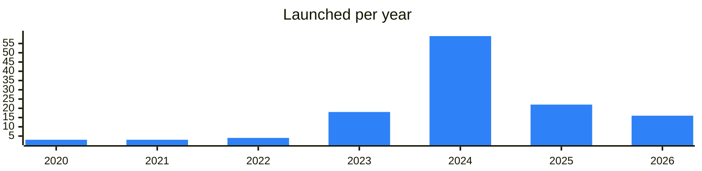

<!-- Generated by scripts/build_readme.py from data/. Do not edit by hand. -->

# Social

**126 projects: 19 active, 107 quiet, 0 closed.** Back to [all categories](../README.md#categories); statuses are explained [here](../README.md#how-to-read-it). The same list as a [searchable table](../data/by-category/social.csv).

## Active

| # | Project | What it is | Links | Launched | Peak MAU | Verified |
| ---: | --- | --- | --- | --- | ---: | --- |
| 1 | **@Mira** | Personal AI agent that turns conversations into actions | [Telegram](https://t.me/miramedia_en) [Bot](https://t.me/mira) [Site](https://mira.tg) | 2025-03-19 |  | since 2026-03 |
| 2 | **TON Dating** | TON Dating is a selective dating community with verified profiles | [Telegram](https://t.me/tondatingchannel) [Bot](https://t.me/TonDating_bot) [Site](https://ton.dating) [Gram News](https://gramnews.org/apps/ton-dating) | 2023-10-17 |  | since 2024-05 |
| 3 | **@Major** | Major is a Telegram app with its own token, NFT market, games, and staking | [Bot](https://t.me/major) [X](https://x.com/majoroftelegram) [Site](https://major.bot) [Gram News](https://gramnews.org/apps/major-1) | 2021-11-06 |  | since 2024-08 |
| 4 | **@IPredict** | Predict match outcomes and trade football markets inside Telegram. Powered by USDT on TON with instant cashout | [Bot](https://t.me/ipredict) | 2026-06-05 |  |  |
| 5 | **cult of not** |  | [Telegram](https://t.me/cultofnot) | 2024-05-22 |  |  |
| 6 | **iMe app** | iMe Wallet: a wallet for the LIME token and cryptocurrency management | [Telegram](https://t.me/ime_en) [Bot](https://t.me/iMe_lime_bot) [X](https://x.com/iMePlatform) [Site](https://www.imem.app/) [GitHub](https://github.com/imemessenger) [Gram News](https://gramnews.org/apps/ime-app) | 2020-04-26 |  |  |
| 7 | **Tmail** | Tmail — a secure Web3‑Web2 email service on TON | [Telegram](https://t.me/tmailofficial) [Bot](https://t.me/tmail_ton_bot) [X](https://x.com/tmail_ton) [Site](https://tmail.ae/) [Gram News](https://gramnews.org/apps/tmail) | 2024-11-20 |  |  |
| 8 | **Tonex** |  | [Telegram](https://t.me/tonex_app) [X](https://x.com/tonexapp) [Site](https://tonex.app) [Gram News](https://gramnews.org/apps/tonex) | 2022-04-18 |  |  |
| 9 | **IdentityHub** |  | [Site](https://identityhub.app) | 2026-01-25 |  |  |
| 10 | **Grouche** | First charity & crowdfunding platform on TON working on DAO principle | [Telegram](https://t.me/grouche_coin) [Bot](https://t.me/grouche_bot) [X](https://x.com/grouchecoin) [Site](https://grouche.com) [Gram News](https://gramnews.org/apps/grouche) | 2024-04-23 |  |  |
| 11 | **КрипTONский кот** | Правообладателям: copyright.by | [Telegram](https://t.me/cryptoncat) [Gram News](https://gramnews.org/apps/kriptonskii-kot) | 2023-04-01 |  |  |
| 12 | **Codeforces** |  | [Site](https://codeforces.com) | 2009-04-10 |  |  |
| 13 | **Six Seven Club Bot** |  | [Telegram](https://t.me/club67) [Bot](https://t.me/sixsevenclub_bot) | 2025-12-02 |  |  |
| 14 | **TonTake (TAKE)** | Благотворительно-развлекательная криптоорганизация | [Telegram](https://t.me/TonTake) [Bot](https://t.me/TonTakeChatbot) [X](https://x.com/TonTakeGame) Site (down) [Gram News](https://gramnews.org/apps/tontake-take) | 2022-05-10 |  |  |
| 15 | **ZIFRETTA** | Комплекс Web3 проектов на блокчейне TON | [Telegram](https://t.me/zifretta_ecosystem) [Bot](https://t.me/zifretta_bot) [Site](https://zifretta.com) | 2024-04-16 | 54K |  |
| 16 | **Not Meme** | Social network for meme creators on TON | [Telegram](https://t.me/tonstrategy) | 2025-08-25 |  |  |
| 17 | **Skate** | Telegram mini app announcements channel for the Skate app | [Telegram](https://t.me/skate_app) | 2024-10-16 |  |  |
| 18 | **DAOPEOPLE** | Social network for AI and Web3 | [Telegram](https://t.me/daopeople_official) [X](https://x.com/DAOPEOPLE) [Site](https://daopeople.io) | 2024-06-18 |  |  |
| 19 | **Phoenix** | SocialFi and GameFi project | [Telegram](https://t.me/phxpw) | 2025-09-19 |  |  |

<b>Quiet: 107</b>

| # | Project | What it is | Links | Launched | Peak MAU | Verified |
| ---: | --- | --- | --- | --- | ---: | --- |
| 20 | **RichBlock** |  | [Telegram](https://t.me/richblock_channel) [Bot](https://t.me/richblock_bot) [Gram News](https://gramnews.org/apps/richblock) | 2024-07-10 | 92K |  |
| 21 | **vSelf** | Official channel for early adopters of vSelf: a platform that helps brands host and tokenize their communities on Telegram and socials. Build mini-games, quests, and activations for your community | [Telegram](https://t.me/vselfmeta) [Bot](https://t.me/vself_bot) [X](https://x.com/vself_meta) [Site](https://vself.app/) [Gram News](https://gramnews.org/apps/vself) | 2021-11-20 | 21K |  |
| 22 | **BeeVerse By NCTR** | Are you ready for adventures in BeeVerse? | [Bot](https://t.me/bee_verse_bot) [Gram News](https://gramnews.org/apps/beeverse-by-nctr) | 2024-06-15 | 372K |  |
| 23 | **Zipsy** | Watch & Earn - Short Videos on Telegram | [Telegram](https://t.me/zipsy_community) [Bot](https://t.me/zipsy_bot) [X](https://x.com/zipsycommunity) [Gram News](https://gramnews.org/apps/zipsy) | 2024-06-02 |  |  |
| 24 | **WALL Future** | Social platform — posts, graffiti, gifts, Stars | [Telegram](https://t.me/wall) [Bot](https://t.me/wall_game_bot) [Gram News](https://gramnews.org/apps/wall-future) | 2024-06 | 50K |  |
| 25 | **INVITE** |  | [Bot](https://t.me/uxinvite_bot) [Gram News](https://gramnews.org/apps/invite) | 2024-08-01 | 324K |  |
| 26 | **Khomyakovo GOV** |  | [Bot](https://t.me/khomyakovo_gov_bot) [Gram News](https://gramnews.org/apps/khomyakovo-gov) | 2024-05-22 | 35K |  |
| 27 | **Memepolis** | Farming memecoins is fun! | [Telegram](https://t.me/MemepolisBOSS) [Bot](https://t.me/memepolisbot) [X](https://x.com/memepolisTON) [Gram News](https://gramnews.org/apps/memepolis) | 2024-05-22 | 62K |  |
| 28 | **ChatGalaTon** | Социальная игровая метавселенная нового поколения внутри Telegram! | [Telegram](https://t.me/ChatGalaTon) [Bot](https://t.me/chatgalatone_bot) [X](https://x.com/ChatGalaTon) [Gram News](https://gramnews.org/apps/chatgalaton) | 2025-12-10 | 21K |  |
| 29 | **Pumpkin Bot** | Pumpkin: The World's First Decentralized Live Streaming Trading Platform / Trade Like a Show, Earn Like a Pro! | [Telegram](https://t.me/pumpkin_global) [Bot](https://t.me/pumpkin_xyz_bot) [X](https://x.com/pumpkin_global) [Site](https://pumpkin.xyz) [Gram News](https://gramnews.org/apps/pumpkin-bot) | 2023-05-25 | 27K |  |
| 30 | **Friends** |  | [Bot](https://t.me/friendstonbot) [Gram News](https://gramnews.org/apps/friends) | 2024-07-24 | 228K |  |
| 31 | **LinkFork** | LinkFork is your ultimate social network hub on Telegram | [Telegram](https://t.me/linkfork_en) [Bot](https://t.me/linkforkbot) [Site](https://linkfork.io) [Gram News](https://gramnews.org/apps/linkfork) | 2023-11-26 | 21K |  |
| 32 | **CyTrump** |  | [Telegram](https://t.me/CyTrump) [Bot](https://t.me/cytrumpbot) [Gram News](https://gramnews.org/apps/cytrump) | 2024-09-25 | 123K |  |
| 33 | **To The Moon** |  | [Bot](https://t.me/popptothemoon_bot) [Gram News](https://gramnews.org/apps/to-the-moon-54wdfm) | 2024-07-27 | 423K |  |
| 34 | **Be Taurus** | Community: Chat: Support | [Bot](https://t.me/be_taurus_bot) [X](https://x.com/BeTaurus_App) Site (down) [Gram News](https://gramnews.org/apps/be-taurus) | 2024-05-08 | 363K |  |
| 35 | **Dwag** |  | [Telegram](https://t.me/dwagairdrop) [Bot](https://t.me/dwagairdropbot) [Gram News](https://gramnews.org/apps/dwag) | 2024-08-19 | 571K |  |
| 36 | **Freelz** |  | [Telegram](https://t.me/freelz_official) [Bot](https://t.me/freelz_bot) [Gram News](https://gramnews.org/apps/freelz) | 2024-07-17 | 166K |  |
| 37 | **Swarm** | Decentralized deliberative prediction markets | [Bot](https://t.me/getswarmed_bot) [X](https://x.com/getswarmed) [Gram News](https://gramnews.org/apps/swarm) | 2024-03-17 | 2.9M |  |
| 38 | **Buzzit.TON** | the first-ever voting mini-app in telegram | [Telegram](https://t.me/buzzitton) [Bot](https://t.me/buzzit1_bot) [X](https://x.com/buzzit_public) [Gram News](https://gramnews.org/apps/buzzit-ton) | 2024-12-27 | 8.8M |  |
| 39 | **Whycoin** |  | [Bot](https://t.me/whycoinorgbot) [X](https://x.com/whycoinorg) [Gram News](https://gramnews.org/apps/whycoin) | 2024-07-15 | 376K |  |
| 40 | **DINO** |  | [Telegram](https://t.me/dinocards) [Bot](https://t.me/dinocards_bot) [Gram News](https://gramnews.org/apps/dino) | 2024-08-08 | 26K |  |
| 41 | **OGCommunity Bot** | We are building the most influential community in gaming! | [Bot](https://t.me/ogcommunitybot) [Gram News](https://gramnews.org/apps/ogcommunity-bot) | 2024-01-06 | 1.6M |  |
| 42 | **Leagushqa Bot** |  | [Telegram](https://t.me/leagushqa) [Bot](https://t.me/leagushqabot) [Gram News](https://gramnews.org/apps/leagushqa-bot) | 2020-03-23 | 16K |  |
| 43 | **Frogy LIVE** | Welcome to the official FROGY Channel! | [Telegram](https://t.me/FrogyNews) [Bot](https://t.me/FrogyLiveBot) [X](https://x.com/Frogy_LIVE) [Site](https://docs.frogy.live) [Gram News](https://gramnews.org/apps/frogy-live) | 2024-07-07 | 316K |  |
| 44 | **SideFans (By SideKick)** | Share, Engage, and Trade Live Effortlessly | [Telegram](https://t.me/sidekick_official) [Bot](https://t.me/sidekick_fans_bot) [X](https://x.com/sidekick_labs) [Gram News](https://gramnews.org/apps/sidefans-by-sidekick) | 2024-04-16 | 9M | since 2025-08 |
| 45 | **KKX love** |  | [Bot](https://t.me/kkxlove_bot) [Gram News](https://gramnews.org/apps/kkx-love) | 2024-05-15 | 30K |  |
| 46 | **Hug** | The most kind Telegram native token | [Telegram](https://t.me/hugcommunity) [Bot](https://t.me/hugcommunity_bot) [X](https://x.com/communityhug) [GitHub](https://github.com/PurrFund/SC-Purr) [Gram News](https://gramnews.org/apps/hug) | 2024-04-09 | 275K |  |
| 47 | **Bulls** | #1 Prediction markets platform on tonchain ! | [Telegram](https://t.me/realbullscommunity) [Bot](https://t.me/bullsonton_bot) [X](https://x.com/bullsonton) [Gram News](https://gramnews.org/apps/bulls) | 2024-08-28 | 259K |  |
| 48 | **SecondLive Bot** | SecondLive Bot — an AI-powered social mini app | [Telegram](https://t.me/SecondLiveCommunity) [Bot](https://t.me/secondlive_bot) [X](https://x.com/SecondLiveReal) Site (down) [GitHub](https://github.com/SecondLive) [Gram News](https://gramnews.org/apps/secondlive-bot) | 2024-02-07 | 851K |  |
| 49 | **pigshousebot** |  | [Bot](https://t.me/pigshousebot) [X](https://x.com/realpigshouse) [Gram News](https://gramnews.org/apps/pigshousebot) | 2024-05-29 | 6.4M |  |
| 50 | **AtomCoin** |  | [Telegram](https://t.me/atomcoin_news) [Bot](https://t.me/atomcointgbot) [Gram News](https://gramnews.org/apps/atomcoin) | 2026-04-05 | 20K |  |
| 51 | **ShareON** | Read, share, and earn web3 assets now! | [Bot](https://t.me/share_on_bot) [Gram News](https://gramnews.org/apps/shareon) | 2024-01-16 | 7K |  |
| 52 | **Fast Food Memes** |  | [Telegram](https://t.me/fastfoodmemes) [Bot](https://t.me/ffmemesbot) [Gram News](https://gramnews.org/apps/fast-food-memes) | 2020-03-15 | 3K |  |
| 53 | **EcoHero** | Help, Earn, Donate, Make a Difference | [Telegram](https://t.me/ECHA_EcoHero) [Bot](https://t.me/echa_ecohero_bot) [X](https://x.com/echa_ecohero) [Site](https://lesnikovfund.org/) [GitHub](https://github.com/layerswap/layerswapapp) [Gram News](https://gramnews.org/apps/ecohero) | 2021-09-11 | 1K |  |
| 54 | **Towim** |  | [Bot](https://t.me/towimbot) [Gram News](https://gramnews.org/apps/towim) | 2024-02-10 | 1K |  |
| 55 | **SmartDeer** |  | [Bot](https://t.me/smartdeer_prod_bot) [Gram News](https://gramnews.org/apps/smartdeer) | 2024-01-22 | 631 |  |
| 56 | **Pollo** | Pollo Official Announcement Channel | [Telegram](https://t.me/polloverse) [Bot](https://t.me/pollovotebot) [X](https://x.com/pollovote) Site (down) [GitHub](https://github.com/ton-blockchain) [Gram News](https://gramnews.org/apps/pollo) | 2024-06-24 |  |  |
| 57 | **The Caps** | Tolymarket - рынок прогнозов в Telegram | [Bot](https://t.me/the_caps_bot) [X](https://x.com/The_Caps_Game) [Gram News](https://gramnews.org/apps/the-caps) | 2024-04-30 |  |  |
| 58 | **Twitton** |  | [Bot](https://t.me/twitton_bot) [X](https://x.com/web3Twitton) [Gram News](https://gramnews.org/apps/twitton) | 2024-08-14 | 130K |  |
| 59 | **@Placce** |  | [Telegram](https://t.me/placce) [Bot](https://t.me/placcerobot) | 2025-05-29 |  |  |
| 60 | **ART VNUKICH** |  | [Bot](https://t.me/art_vnukich_bot) | 2026-05-04 |  |  |
| 61 | **Asiqpai** | ASIQPAI is a music-focused Telegram Mini App built on TON and powered by the ASIQ utility token | [Telegram](https://t.me/asiqpaihub) [Bot](https://t.me/asiqpai_bot) [X](https://x.com/asiqpai) [Site](https://asiqpai.site) [GitHub](https://github.com/qaztrap/asiqpai) | 2026-07-13 |  |  |
| 62 | **Atomic Star** | Платформа для коммуникации с Web3 продуктами проекта StalinFoundation на базе блокчейна The Open Network | [Bot](https://t.me/AtomicStarBot) [GitHub](https://github.com/StalinFoundation) [Gram News](https://gramnews.org/apps/atomic-star) | 2023-08-09 |  |  |
| 63 | **Ausum** | The ultimate challenge platform on Telegram. ausum.social | [Bot](https://t.me/ausum_bot) | 2026-04-22 |  |  |
| 64 | **B.appka** | Messenger-style community app in Telegram | [Telegram](https://t.me/b_appka_hub) | 2024-12-16 |  |  |
| 65 | **Community** | Telegram-native toolset for communities | [Bot](https://t.me/community_bot) | 2023-08-17 | 15.7M | since 2024-09 |
| 66 | **Episodes** | Short vertical episodes mini app | [Bot](https://t.me/watchepisodesbot) | 2024-11-28 | 534K |  |
| 67 | **Fibarium** |  | [Telegram](https://t.me/fibarium) [Bot](https://t.me/fibariumbot) [X](https://x.com/fibarium) | 2024-12-21 |  |  |
| 68 | **Fox Tails** |  | [Bot](https://t.me/BearAMLBot) [Site](https://foxtails.io) [Gram News](https://gramnews.org/apps/fox-tails) | 2025-04-09 |  |  |
| 69 | **Foxygram** | Task exchange in Telegram | [Bot](https://t.me/foxygrambot) | 2025-11-16 |  |  |
| 70 | **Fronex** | Fronex is a Telegram-native platform for social prediction gaming on TON | [Telegram](https://t.me/fronex_official) [Bot](https://t.me/fronexfun_bot) [X](https://x.com/fronexhq) [Site](https://fronex.fun) [GitHub](https://github.com/fronexhq) | 2026-05 |  |  |
| 71 | **GENZA** | Dating game mini app | [Bot](https://t.me/genza_vibing_bot) | 2025-12-18 | 32K |  |
| 72 | **GoatVote** |  | [Bot](https://t.me/goatvotebot) | 2026-09-14 |  |  |
| 73 | **Host.tg** | Host.tg — an app for organizing and participating in events via Telegram | [X](https://x.com/HostAppHQ) [Site](https://host.tg) [Gram News](https://gramnews.org/apps/host-tg) | 2023-12-04 |  |  |
| 74 | **INFINITY** | INFINITY is an evolving visual world inside Telegram | [Telegram](https://t.me/infinity_bid) [Bot](https://t.me/infinity_bid_bot) [Site](https://infinity.bid/) | 2026-05 |  |  |
| 75 | **MAROHA** | Pink MAROHA on TON | [Bot](https://t.me/maroha_hubbot) | 2026-08-23 |  |  |
| 76 | **MoonHub (By Moongate)** | Discover events, buy tickets, socialize, and earn airdrops with Moonhub | [Bot](https://t.me/moongateaibot) | 2024-10-19 | 182K |  |
| 77 | **Moons** | Crypto social network for Telegram users | [Bot](https://t.me/moons_so_bot) | 2024-08-04 | 10K |  |
| 78 | **NEONEXA** | Всё про NEONEXA в одном месте — спокойно и по делу, без давления | [Bot](https://t.me/tonmason_newsbot) | 2026-06-20 |  |  |
| 79 | **NFTune** |  | [Bot](https://t.me/nftunebot) | 2025 |  |  |
| 80 | **Peace Da Love** |  | [Site](https://peacedalove.com) [Gram News](https://gramnews.org/apps/peace-da-love) | 2023-06 |  |  |
| 81 | **Photon** | Photon - a social app to express yourself, discover your friends, and bring your dreams to life | [Telegram](https://t.me/The_Photon_app) [Bot](https://t.me/ThePhoton_Bot) [X](https://x.com/photon_friends) [Gram News](https://gramnews.org/apps/photon) | 2024-07-31 | 83K |  |
| 82 | **Polyboost** | Parlays on Polymarket | [Bot](https://t.me/polyboostbot) | 2026-03-19 |  |  |
| 83 | **Predict** | Prediction market trading app inside Telegram | [Telegram](https://t.me/predictapp_en) | 2026-06-24 |  |  |
| 84 | **Predicta** | Prediction market in Telegram for the CIS | [Bot](https://t.me/predicta_market_bot) | 2025-02-27 | 98K |  |
| 85 | **PredictMe** | Bot for competing in stock price predictions | [Bot](https://t.me/predictmebot) | 2022-08-18 |  |  |
| 86 | **PROJECTFADE** | PROJECTFADE is a peer-to-peer prediction platform inside Telegram | [Telegram](https://t.me/projectfade) [Bot](https://t.me/projectfade_bot) [Site](https://projectfade.ru) | 2026-06-16 |  |  |
| 87 | **RateOracleBot** | Make price predictions for crypto, stocks, and national currencies – the rules are yours | [Bot](https://t.me/RateOracleBot) | 2024-09 |  |  |
| 88 | **Spiritual Hub** | Spiritual hub - mindfulness app aggregator | [Bot](https://t.me/spiritualhubbot) | 2025 |  |  |
| 89 | **StarsMarket** | Prediction market on future events in Telegram | [Bot](https://t.me/starshash_bot) | 2025-01-01 | 1.4M | since 2025-01 |
| 90 | **Starzy** | Telegram rating checker and level-based clubs | [Bot](https://t.me/starzy_rating_bot) | 2025-08-01 |  |  |
| 91 | **Stena DAO** | Задняя стена твоего любимого блокчейна | [Telegram](https://t.me/stenadao) | 2024-08-24 |  |  |
| 92 | **Swipy** | Dating bot with crypto earnings | [Bot](https://t.me/swipydatingbot) | 2024-07-22 |  |  |
| 93 | **Telegram one Top** |  | [Gram News](https://gramnews.org/apps/telegram-one-top) | 2024-05 |  |  |
| 94 | **Telemitz** | Voice app in Telegram | [Bot](https://t.me/telemitzbot) | 2025-09-09 |  |  |
| 95 | **the future is TON** |  | [X](https://x.com/cointool) [Site](https://ct.app) [GitHub](https://github.com/cointool-app) [Gram News](https://gramnews.org/apps/the-future-is-ton) | 2026-03-10 |  |  |
| 96 | **The Saudis TON** |  | [Bot](https://t.me/SauSpaceBot) [X](https://x.com/TheSaudisTON) Site (down) [Gram News](https://gramnews.org/apps/the-saudis-ton) | 2022-08-02 |  |  |
| 97 | **Token Spritz** | Voice-gifting bot sending crypto and gifts | [Telegram](https://t.me/tokenspritz) [Bot](https://t.me/tokenspritz_bot) | 2024-07-27 |  |  |
| 98 | **TON Africa Hub** | TON community hub for Africa | [Telegram](https://t.me/tonnigeria) | 2024-01-17 |  |  |
| 99 | **TON Breakfast** | Community chat for organizing TON meetups | [Telegram](https://t.me/tonbreakfast) | 2023-06-11 |  |  |
| 100 | **TON Circle** | Bot for TON content creators and the TON Society | [Bot](https://t.me/toncirclebot) | 2025-08-27 |  |  |
| 101 | **TON Community Chat** | Official TON community chat with regional hubs | [Telegram](https://t.me/tonchathq) | 2025-12-12 |  |  |
| 102 | **TON France** | French community chat of TON France | [Telegram](https://t.me/ton_france_chat) | 2024-04-13 |  |  |
| 103 | **TON Gentlemens** | TON insights and aid community | [Telegram](https://t.me/tongentlemens) | 2025-03-27 |  |  |
| 104 | **TON ID** | Build your reputation with every app you use and every contribution you make | [Bot](https://t.me/ton_society_bot) | 2024-04-10 | 1.7M | since 2025-02 |
| 105 | **TON Society Lisbon** | Local TON community hub in Lisbon | [Telegram](https://t.me/tonlisbonhub) | 2023-01-22 |  |  |
| 106 | **TON Vibe** | Post content and earn TON and Stars | [Bot](https://t.me/tonvibe_bot) | 2026-04-22 |  |  |
| 107 | **TON Vote** |  | [Telegram](https://t.me/tonvotesupportgroup) [GitHub](https://github.com/orbs-network/dao-vote) | 2023-01-26 |  |  |
| 108 | **ton.place** |  | [Site](https://ton.place) [Gram News](https://gramnews.org/apps/ton-place) | 2023-05 |  |  |
| 109 | **TONpie** |  | [Site](https://tonpie.io) [Gram News](https://gramnews.org/apps/tonpie) | 2024-09-30 |  |  |
| 110 | **TonsOfFriends** |  | [Bot](https://t.me/toftechbot) [X](https://x.com/TonsOfFriends) [Site](https://app.tonfriends.tech) [Gram News](https://gramnews.org/apps/tonsoffriends) | 2024-04-19 | 867K |  |
| 111 | **UXLINK** | Web3 social network project | [Telegram](https://t.me/uxlinkofficial) | 2023-12-04 |  |  |
| 112 | **vnukiсh** | Привет, Друг! Ты попал в систему награждения активности Внукича | [Bot](https://t.me/vnukich_bot) | 2025-10-28 |  |  |
| 113 | **Wall Telegram** | Wall Telegram is a social network with posts, graffiti, and music | [Telegram](https://t.me/wall_people) [Bot](https://t.me/wall) [Site](https://wall.tg) [Gram News](https://gramnews.org/apps/wall-telegram) | 2023-04-21 |  |  |
| 114 | **WAP** |  | [Telegram](https://t.me/h0nworld) [Bot](https://t.me/weareprime_bot) [Site](https://h0n.io) [Gram News](https://gramnews.org/apps/wap) | 2025-10-19 | 3M |  |
| 115 | **WEB3 Community** | Web3 ideas and deals community | [Telegram](https://t.me/web3jetton) | 2023-09-03 |  |  |
| 116 | **Web3Events** |  | [X](https://x.com/Web3Events_ai) | 2023-08-26 |  |  |
| 117 | **WhoWhere** |  | [Gram News](https://gramnews.org/apps/whowhere) | 2023-02 |  |  |
| 118 | **Btok** | Web3 messaging app | [Telegram](https://t.me/btokofficialchannel) [X](https://x.com/Btok_official) [Site](https://btok360.com) | 2024-07-16 |  |  |
| 119 | **TON Builders** | Hub for developers, creators and founders on TON | [Telegram](https://t.me/tonbuild) | 2025-06-04 |  |  |
| 120 | **Coub** | Short video platform available in Telegram | [Telegram](https://t.me/coubnews) [X](https://x.com/coub) [Site](https://coub.com) | 2024-08-04 |  | yes |
| 121 | **Hubz Chat** | Hubz Chat — a chat bot for verifying members by wallets and NFTs | [Telegram](https://t.me/Hubz_News) [Bot](https://t.me/hubz_app_bot) [X](https://x.com/hubz_chat) [Site](https://hubz.io/) [Gram News](https://gramnews.org/apps/hubz-chat) | 2024-04-26 |  |  |
| 122 | **Memegram** | Memegram anonymous numbers community | [Telegram](https://t.me/memex) | 2024-11-10 |  |  |
| 123 | **QuestHub** | Quest platform to collaborate with TON projects | [Telegram](https://t.me/brobot) | 2024-01-09 |  |  |
| 124 | **Faces of TON** | Satirical content project about the TON community | [Telegram](https://t.me/facesofton) | 2023-04-29 |  |  |
| 125 | **TON Stars** |  | [Telegram](https://t.me/ton_stars_official) [Bot](https://t.me/ton_stars_app_bot) [X](https://x.com/tonstarsapp) [Site](https://) [Gram News](https://gramnews.org/apps/ton-stars) | 2025-04-11 |  |  |
| 126 | **Commander** |  | [Telegram](https://t.me/commander_ton) [X](https://x.com/commanderton) Site (down) [Gram News](https://gramnews.org/apps/commander) | 2024-06-13 |  |  |

