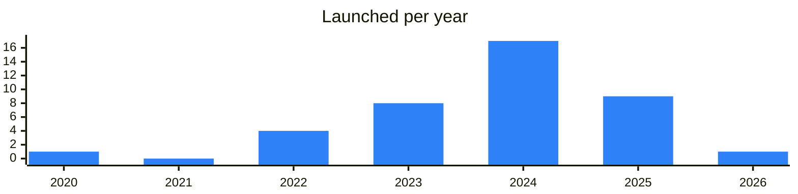

<!-- Generated by scripts/build_readme.py from data/. Do not edit by hand. -->

# Staking

**40 projects: 13 active, 25 quiet, 2 closed.** Back to [all categories](../README.md#categories); statuses are explained [here](../README.md#how-to-read-it). The same list as a [searchable table](../data/by-category/staking.csv).

## Active

| # | Project | What it is | Links | Launched | Peak MAU | Verified |
| ---: | --- | --- | --- | --- | ---: | --- |
| 1 |  **Hipo** | Hipo Staking — GRAM staking on TON with hGRAM rewards | [Telegram](https://t.me/hipofinance) [Bot](https://t.me/HipoFinanceBot) [X](https://x.com/hipofinance) [Site](https://app.hipo.finance/) [GitHub](https://github.com/HipoFinance) [Gram News](https://gramnews.org/apps/hipo-staking) | 2023-02-23 | 263K | since 2025-05 |
| 2 |  **Tonstakers** | Tonstakers – liquid staking app for GRAM | [Telegram](https://t.me/thetonstakers) [Bot](https://t.me/tonstakers_support_bot) [X](https://x.com/tonstakers) [Site](https://app.tonstakers.com/) [Gram News](https://gramnews.org/apps/tonstakers-staking) | 2023-05-04 |  | since 2024-10 |
| 3 |  **Stakee** | TON staking with up to 25% APY and instant withdrawals | [Telegram](https://t.me/stakeeru) [Bot](https://t.me/StakeeRu) [Site](https://stakee.org) [Gram News](https://gramnews.org/apps/stakee) | 2022-11-11 |  |  |
| 4 |  **KTON** | KTON LST — staking TON with a liquid KTON token | [Telegram](https://t.me/kton_channel) [Bot](https://t.me/ktonio_bot) [X](https://x.com/kton_io) [Site](https://kton.io/) [GitHub](https://github.com/KTON-IO/liquid-staking-contract) [Gram News](https://gramnews.org/apps/kton-lst) | 2025-01-21 |  |  |
| 5 |  **TON Validators** |  | [Bot](https://t.me/tonvalidators_app_bot) [Gram News](https://gramnews.org/apps/ton-validators) | 2024-09-25 |  |  |
| 6 | **UTONIC** |  | [Site](https://utonic.org) | 2024-11-11 |  |  |
| 7 | **bemo** |  | [Site](https://bemo.finance) | 2023-03-20 |  |  |
| 8 |  **Hipo Staked GRAM (HGRAM)** | Stake GRAM on TON with Hipo - liquid staking with top APY | [Telegram](https://t.me/HipoFinance) [X](https://x.com/hipofinance) [Site](https://hipo.finance) | 2024-03-21 |  | since 2025-05 |
| 9 |  **Social DeFi on TON** | Social yield aggregator for TON DeFi | [Telegram](https://t.me/socdefi) | 2025-02-10 |  |  |
| 10 | **bemo V1** | The liquid staking protocol on the TON blockchain | [X](https://x.com/bemo_fi) [Site](https://bemo.fi/) | 2023-07-11 |  |  |
| 11 | **bemo V2** | The liquid staking protocol on the TON blockchain | [X](https://x.com/bemo_fi) [Site](https://bemo.fi/) | 2025-04-21 |  |  |
| 12 |  **TonPools** | TonPools is a dapp built on the TON Blockchain that offers prize-linked savings accounts. The platform allows users to stake their TON coins and participate in prize draws without risking their initia | [Telegram](https://t.me/tonpools_com) [X](https://x.com/TonPools_Com) | 2024-09-09 |  |  |
| 13 | **Tonstakers LSD** | The Open Network Liquid Staking protocol empowering TON DeFi ecosystem | [X](https://x.com/tonstakers) [Site](https://tonstakers.com) | 2023-09-21 |  |  |

<b>Quiet: 25</b>

| # | Project | What it is | Links | Launched | Peak MAU | Verified |
| ---: | --- | --- | --- | --- | ---: | --- |
| 14 |  **Shieldeum Node Rewards** |  | [Bot](https://t.me/shieldeumbot) [X](https://x.com/Shieldeum) [Site](https://shieldeum.net) [Gram News](https://gramnews.org/apps/shieldeum-node-rewards) | 2024-08-24 | 1.9M |  |
| 15 |  **Beetroot Finance** | Automated Yield Farming Aggregator on TON blockchain | [Telegram](https://t.me/BeetrootFinance) [Bot](https://t.me/BeetrootFiBot) [X](https://x.com/beetroot_fi) [Site](https://beetroot.finance) [GitHub](https://github.com/Beetroot-fi) | 2024-10-13 | 30K |  |
| 16 |  **Bemo liquid staking** | Bemo — a liquid staking platform on the TON blockchain | [Telegram](https://t.me/bemofinance) [Bot](https://t.me/bemo_finance_bot) [X](https://x.com/bemo_fi) [Site](https://bemo.fi/) [Gram News](https://gramnews.org/apps/bemo-liquid-staking) | 2023-06-01 | 45K |  |
| 17 |  **BounceTon Restaking** | No lock, no staking. Move to Faucet Wallet — earn 4.08% yearly paid daily, enjoy free spins, win up to $150 | [Bot](https://t.me/bounceton_bot) [X](https://x.com/BouncTon) [Gram News](https://gramnews.org/apps/bounceton-restaking) | 2024-05-17 | 333K |  |
| 18 |  **YouHold** | YouHold is SuperFI app — wallet for earnings, investments and more | [Telegram](https://t.me/youhold) [Bot](https://t.me/youhold_bot) [X](https://x.com/youhold_ton) [Gram News](https://gramnews.org/apps/youhold) | 2024-07-13 |  |  |
| 19 | **bemo Staked TON (STTON)** |  | [X](https://x.com/bemo_finance) [Site](https://bemo.fi) | 2023-06-09 |  |  |
| 20 | **Fanzee** |  | [Site](https://app.fanz.ee/staking) [Gram News](https://gramnews.org/apps/fanzee) | 2020-07-09 |  |  |
| 21 | **Farmix** | Leverage yield farming based on TON blockchain | [Telegram](https://t.me/farmix_news) [X](https://x.com/TonFarmix) | 2024-11-18 |  |  |
| 22 |  **JSI Staking** | Staking bot for reward coins | [Bot](https://t.me/jsistakingbot) | 2025-12-01 |  |  |
| 23 | **MINTODINOS Staking** |  | [Gram News](https://gramnews.org/apps/mintodinos-staking) | 2023-07-30 |  |  |
| 24 | **Nexton** | NEXTON is a staking and arbitrage platform designed to maximize rewards in the TON ecosystem, targeting DeFi enthusiasts, investors seeking higher yields through automated strategies, and general Tele | [X](https://x.com/NextonNode) [Site](https://www.nexton.solutions) | 2024-11-29 |  |  |
| 25 |  **Palette Finance** | Staking and yield service on TON that handles earning with minimal manual steps. | [Bot](https://t.me/palettefinancebot) | 2025-03-21 |  |  |
| 26 |  **Stake Stars** | Staking service for Telegram Stars | [Bot](https://t.me/stakestars_bot) | 2026-04-26 |  |  |
| 27 |  **Staking by CAT** | Alternative TON staking from validator ton.cat | [Bot](https://t.me/stakingcatbot) | 2022-02-08 |  |  |
| 28 |  **TON Staked** | Toncoin staking bot by TonCorp | [Bot](https://t.me/stakingtoncoinbot) | 2024-05-15 |  |  |
| 29 |  **TON Whales** | Support bot for the Whales staking pool service on TON, linked to its support chat. | [Telegram](https://t.me/whalessupportbot) [X](https://x.com/whalescorp) [GitHub](https://github.com/tonwhales) | 2025-05-26 |  |  |
| 30 |  **TONbit** | Staked TON app with up to 5% APY | [Bot](https://t.me/tonbitstakedbot) | 2025-01-24 |  |  |
| 31 |  **TonStake.com** |  | [Telegram](https://t.me/tonstake_com_en) [X](https://x.com/tonstakecom) [Site](https://tonstake.com/) [Gram News](https://gramnews.org/apps/tonstake-com) | 2022-01-21 |  |  |
| 32 | **Tonyielding** |  | [X](https://x.com/Tonyielding) Site (down) [Gram News](https://gramnews.org/apps/tonyielding) | 2024-11-28 |  |  |
| 33 |  **Upton Finance** | Upton Finance is Telegram’s first AI-driven MemeCoin Yield Layer | [Bot](https://t.me/uptonfi_bot) | 2024-08-29 |  |  |
| 34 |  **UTN Staking** | Staking app for the Uniton family meme token on TON. | [Telegram](https://t.me/uniton_token) [Site](https://app.unitontoken.com) [Gram News](https://gramnews.org/apps/utn-staking) | 2024-03-17 |  |  |
| 35 |  **Whales Staking** | Ton Whales Staking pool chat for communicating in any language | [Telegram](https://t.me/stakeonwhales) [X](https://x.com/whalescorp) [Site](https://tonwhales.com/staking) [GitHub](https://github.com/tonwhales) [Gram News](https://gramnews.org/apps/whales-staking) | 2022-03-24 |  |  |
| 36 | **YieldFort Protocol** |  | [Bot](https://t.me/ton_yieldfortbot) [X](https://x.com/yieldfort) [Gram News](https://gramnews.org/apps/yieldfort-protocol) | 2025-03-22 |  |  |
| 37 |  **Kiln** | Staking infrastructure provider news and updates | [Telegram](https://t.me/kiln_finance) | 2024-12-13 |  |  |
| 38 |  **XBANKING** |  | [Telegram](https://t.me/xbanking) [X](https://x.com/xbankingapp) [Site](https://xbanking.org) [Gram News](https://gramnews.org/apps/xbanking) | 2025-07-17 |  |  |

<b>Closed: 2</b>

| # | Project | What it is | Closed | Proof |
| ---: | --- | --- | --- | --- |
| 39 |  **Parraton** | Yield optimizer on TON available as a Telegram mini app and on the web. | 2025-05-28 | [announcement](https://t.me/parraton_en/43) |
| 40 |  **SettleTON** | SettleTON is the First TON Liquidity Pool Index Fund that maximises yields by helping users invest in the most reliable TON Projects in just one click | 2025-11-22 | [announcement](https://t.me/settleton/143) |

