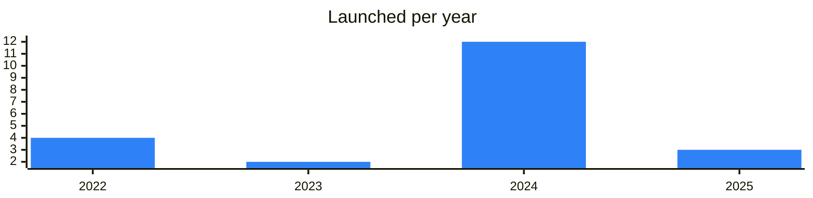

<!-- Generated by scripts/build_readme.py from data/. Do not edit by hand. -->

# Studios

**23 projects: 5 active, 18 quiet, 0 closed.** Back to [all categories](../README.md#categories); statuses are explained [here](../README.md#how-to-read-it). The same list as a [searchable table](../data/by-category/studios.csv).

## Active

| # | Project | What it is | Links | Launched | Peak MAU | Verified |
| ---: | --- | --- | --- | --- | ---: | --- |
| 1 | **GAMEE** | Biggest gaming community on Telegram, powered by $GMEE token | [Telegram](https://t.me/gameechannel) [Bot](https://t.me/gamee) [X](https://x.com/gameetoken) [Site](https://www.gamee.com) [Gram News](https://gramnews.org/apps/gamee) | 2024 |  | since 2020-04 |
| 2 | **PlayDeck** | PlayDeck is a Telegram mini app offering over 250 free games | [Telegram](https://t.me/playdeck_en) [Bot](https://t.me/playdeckbot) [X](https://x.com/playdeckgames) [Site](https://www.playdeck.io) [GitHub](https://github.com/ton-play) [Gram News](https://gramnews.org/apps/playdeck) | 2023-10-13 |  | since 2024-05 |
| 3 | **Ice Creators** | Investment studio for Web3 projects | [Telegram](https://t.me/ice_creators) | 2025-08-17 |  |  |
| 4 | **TonTon Games** |  | [Telegram](https://t.me/tikitons) [X](https://x.com/ton_tongames) | 2024 |  |  |
| 5 | **Axiom Game Labs** | Studio making Telegram games | [Telegram](https://t.me/axiomgame) | 2025-07-18 |  |  |

<b>Quiet: 18</b>

| # | Project | What it is | Links | Launched | Peak MAU | Verified |
| ---: | --- | --- | --- | --- | ---: | --- |
| 6 | **AKEDO Games** |  | [Telegram](https://t.me/akedofun) [X](https://x.com/akedofun) [Site](https://akedo.fun) | 2024-07-18 |  |  |
| 7 | **Axiom Labs** |  | [Telegram](https://t.me/axiomlabsofficial) [X](https://x.com/AxiomGame_Labs) | 2024-10 |  |  |
| 8 | **Bastion** |  |  |  |  |  |
| 9 | **Delabs Games** |  | [Telegram](https://t.me/delabsgameschat) [X](https://x.com/delabsOfficial) [Site](https://www.delabs.gg) | 2024-07-15 |  |  |
| 10 | **Fanzee Labs** | Web3 studio building gamified sports and entertainment experiences on TON | [Telegram](https://t.me/fanzeecommunity) | 2024-01-06 |  |  |
| 11 | **Hackney Games** |  |  | 2022 |  |  |
| 12 | **LevelQ** |  | [Telegram](https://t.me/levelqfin) | 2025-03-17 |  |  |
| 13 | **Open Builders** |  | [Telegram](https://t.me/builders) [X](https://x.com/open_builders) [Site](https://openbuilders.xyz) | 2022-06 |  | since 2025-06 |
| 14 | **Pluto Studios** |  | [X](https://x.com/PlutoVisionLabs) [Site](https://www.pluto.vision) | 2024-03 |  |  |
| 15 | **RSquad** |  | [Telegram](https://t.me/rsquad) [X](https://x.com/rsquadlab) [Site](https://rsquad.io) | 2015 |  |  |
| 16 | **Televerse** | Gaming infrastructure from WeChat mini-game veterans | [Telegram](https://t.me/televerseodyssey) [Bot](https://t.me/televerseodyssey_bot) | 2024-10-11 | 673K |  |
| 17 | **The Open Platform** |  | [Telegram](https://t.me/topco) [X](https://x.com/topdotco) [Site](https://top.co) | 2023-09-08 |  |  |
| 18 | **TON Studio** |  | [Telegram](https://t.me/ton_studio) [X](https://x.com/thetonstudio) [Site](https://tonstudio.io) | 2024-11-01 |  |  |
| 19 | **YeehaGames** | Web3 games studio | [Telegram](https://t.me/realyeehagames) | 2022-12-22 |  |  |
| 20 | **AmberTON** | Studio building apps and games for Telegram on TON | [Telegram](https://t.me/amberton) | 2024-07-02 |  |  |
| 21 | **OPEN** | Laboratory building blockchain and AI products | [Telegram](https://t.me/opensites) [Bot](https://t.me/opensitesbot) | 2024-01-16 |  |  |
| 22 | **Off lab** | Developer of utility projects for TON | [Telegram](https://t.me/off_lab) | 2024-08-12 |  |  |
| 23 | **Tonic** | Independent co-operative building on TON | [Telegram](https://t.me/toniccx) [X](https://x.com/toniccx) | 2022-02-01 |  |  |

