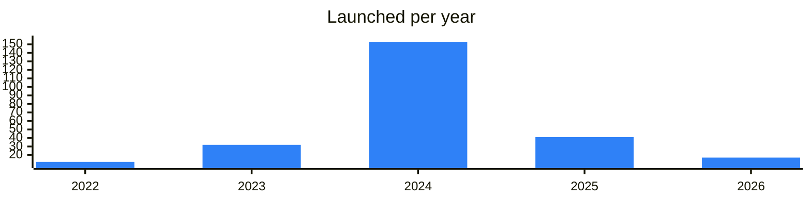

<!-- Generated by scripts/build_readme.py from data/. Do not edit by hand. -->

# Tokens

**259 projects: 56 active, 200 quiet, 3 closed.** Back to [all categories](../README.md#categories); statuses are explained [here](../README.md#how-to-read-it). The same list as a [searchable table](../data/by-category/tokens.csv).

## Active

| # | Project | What it is | Links | Launched | Peak MAU | Verified |
| ---: | --- | --- | --- | --- | ---: | --- |
| 1 | **GROYP** | Oldest living memecoin on Ton | [Telegram](https://t.me/groyp) [X](https://x.com/groyp_on_ton) [Site](https://groypfi.io) | 2023-07-19 |  |  |
| 2 | **UTYA** |  | [Telegram](https://t.me/MagicVipClub) [Bot](https://t.me/utyagamebot) [X](https://x.com/Utya_game) [Site](https://taplink.cc/utyagame) [Gram News](https://gramnews.org/apps/utyagame) | 2024-04-12 |  |  |
| 3 | **CHERRY** |  | [Telegram](https://t.me/HotCherryTG) [Bot](https://t.me/cherrygame_io_bot) [X](https://x.com/HotCherryTG) [Site](https://hotcherry.online) [Gram News](https://gramnews.org/apps/cherry-game) | 2024-04-22 | 6.8M |  |
| 4 | **BabyDoge** | BabyDoge, a top 200 cryptocurrency, blends meme culture with a thriving Web3 ecosystem | [Telegram](https://t.me/babydogecoin) [X](https://x.com/BabyDoge) [Site](https://babydoge.com) | 2025-03-10 |  | since 2021-07 |
| 5 | **HPO** | Stake GRAM on TON with Hipo - liquid staking with top APY | [Telegram](https://t.me/HipoFinance) [X](https://x.com/hipofinance) [Site](https://hipo.finance) | 2024-11-24 |  | since 2025-05 |
| 6 | **NOT** |  | [Telegram](https://t.me/notcoin) [X](https://x.com/notcoin) [Site](https://notco.in/) | 2025-04-11 |  | since 2024-01 |
| 7 | **DOGS** |  | [Telegram](https://t.me/dogs_community) [X](https://x.com/realDogsHouse) [Site](https://dogs.dev/links) | 2024-12-16 |  | since 2024-08 |
| 8 | **RECA** |  | [X](https://x.com/ResistanceCat) [Site](https://reca.live) | 2024-04-08 |  |  |
| 9 | **STON** | STON.fi: Cross-chain DeFi, without the chaos | [Telegram](https://t.me/stonfidex) [X](https://x.com/ston_fi) [Site](https://ston.fi) | 2023-06-27 |  | since 2023-10 |
| 10 | **Capybobo (PYBOBO)** | PYBOBO, Your Capy, Your Culture, Your Coin | [Telegram](https://t.me/CapyboboNews) [X](https://x.com/Capybobo_io) [Site](https://capybobo.io) | 2025-09-18 |  |  |
| 11 | **TONNEL Network (TONNEL)** | TONNEL Network is a zero-knowledge privacy protocol on the TON blockchain | [Telegram](https://t.me/tonnel_en) [X](https://x.com/tonnel_network) [Site](https://Tonnel.network) | 2023-09-21 |  | since 2025-03 |
| 12 | **Not Pixel (PX)** | mexc.com/exchange/PX_USDT | [Telegram](https://t.me/notpixel_channel) [X](https://x.com/notpixelx) [Site](https://notpixel.org) | 2025-01-20 |  | since 2024-11 |
| 13 | **GEMSTON (GEMSTON)** |  | [X](https://x.com/ston_fi) [Site](https://ston.fi) | 2023-09-04 |  |  |
| 14 | **GoMining (GOMINING)** | GoMining — Mine Bitcoin. Use Bitcoin. All in one app | [Telegram](https://t.me/gmt_token) [X](https://x.com/Gomining_token) [Site](https://gomining.com) | 2024-06-28 |  | yes |
| 15 | **TON Station (MRSOON)** | Premium Game Distribution TG Platform by Sidus Heroes & SuperVerse | [Telegram](https://t.me/tonstationgames) [X](https://x.com/TONStationLabs) [Site](https://tonstation.app) | 2024-12-13 |  | since 2024-10 |
| 16 | **$PAPA CULT BOT** | 𝕏 Twitter Telegram Chat | [Telegram](https://t.me/papa666cult) [Bot](https://t.me/papacultbot) [X](https://x.com/papa666cult) | 2026-08-28 |  |  |
| 17 | **DuckCoin (DUCK)** |  | [Telegram](https://t.me/duckcoin) [X](https://x.com/Duck_Chain) [Site](https://duckcoin.org) | 2024-02-25 |  |  |
| 18 | **ANTHILL** | Reward token backed by BTC mining | [Telegram](https://t.me/anthill_rewards) | 2025-07-15 |  |  |
| 19 | **Groyper** |  | [Telegram](https://t.me/gtrade) | 2026-05-22 |  |  |
| 20 | **Groyper** | Announcement channel of the Groyper memecoin on TON | [Telegram](https://t.me/gapps) | 2026-04-16 |  |  |
| 21 | **LAMBO ($LAMBO)** | The only official channel of LAMBO | [Telegram](https://t.me/lambospeak) [X](https://x.com/LAMBOtokenTON) [Site](https://lambo.tg) | 2024-11-01 |  |  |
| 22 | **Not Meme (MEM)** |  | [Telegram](https://t.me/notmeme) [X](https://x.com/notmeme_org) [Site](https://notmeme.org) | 2024-04-10 |  |  |
| 23 | **JetTon Games (JETTON)** |  | [Telegram](https://t.me/jetannouncements) [X](https://x.com/JetTonGames) [Site](https://jetton.pet/cffiylglyk5?click_id=%7Bclick_id%7D) | 2023-05-28 |  |  |
| 24 | **Durev Bot** |  | [Telegram](https://t.me/poveldurev) [Bot](https://t.me/durevrobot) [X](https://x.com/poveldurev) [Site](https://dedust.io/swap/TON/DUREV) [Gram News](https://gramnews.org/apps/durev-bot) | 2024-03-26 | 10K |  |
| 25 | **Povel Durev (DUREV)** |  | [Telegram](https://t.me/poveldurev) [X](https://x.com/poveldurev) [Site](https://poveldurev.net) | 2024-04-03 |  |  |
| 26 | **S.O.T.A.** | Token project linked to BEETON | [Telegram](https://t.me/sotatoken) [Site](https://sotatoken.ru) | 2025-02-19 |  |  |
| 27 | **Hydra** | Официальный канал токена $HYDRA | [Telegram](https://t.me/ton_hydra_community) [X](https://x.com/ton_hydra) [Site](https://tonhydra.com) | 2023-05-04 |  |  |
| 28 | **Butterflys** | Welcome To Butterfly's $BTYS | [Bot](https://t.me/realbutterflys_bot) [X](https://x.com/Butterflyonton) [Site](https://app.hipo.finance/#/referrer=UQDo7L_NkX2FBF5WDKBvIA-lFXUvRMpou6Yc1076Q1j8FkcW/) [GitHub](https://github.com/HipoFinance) [Gram News](https://gramnews.org/apps/butterflys) | 2023-02-23 | 28K |  |
| 29 | **CapybaraCoins** | Capybara is The Friendliest Telegram-Native Meme Coin! | [Telegram](https://t.me/the_capybara_meme) [X](https://x.com/meme_capybara) | 2024-07-15 |  |  |
| 30 | **Arbuz** |  | [Telegram](https://t.me/tonarbuz) [X](https://x.com/arbuz_ton) [Site](https://tonarbuz.fun) | 2023-12-03 |  |  |
| 31 | **Ton Fish** |  | [Telegram](https://t.me/tonfish_tg) [X](https://x.com/tonfish_tg) | 2023-11-04 |  |  |
| 32 | **Ton Fish Box** | FISH is a meme token inspired by $PEPE | [Telegram](https://t.me/tonfish_tg) [Bot](https://t.me/Tonsifisifhbot) [X](https://x.com/tonfish_tg) [Site](https://www.tonfish.io/) | 2023-11-04 |  |  |
| 33 | **TON FISH MEMECOIN (FISH)** |  | [Telegram](https://t.me/tonfish_tg) [X](https://x.com/tonfish_tg) [Site](https://www.tonfish.io) | 2023-12-31 |  |  |
| 34 | **JOYSTICK** | Digital assets project with TON dividends | [Telegram](https://t.me/joystickpro) | 2025-02-25 |  |  |
| 35 | **POK** | Memecoin built on Proof of Capital technology | [Telegram](https://t.me/proofofkarl) [X](https://x.com/proofofkarl) [Site](https://proofofcapital.org) | 2025-03-10 |  |  |
| 36 | **SISU** | Dragon-themed meme token on TON | [Telegram](https://t.me/sisudatuton) [X](https://x.com/SisuTon) | 2025-03-26 |  |  |
| 37 | **Soko Inu** | Soko Inu memecoin news channel | [Telegram](https://t.me/soko_inu) | 2024-12-20 |  |  |
| 38 | **VNUK** | Reward token on TON | [Telegram](https://t.me/vnukton) | 2025-03-20 |  |  |
| 39 | **Terminator** | Token on TON spun off from ARNI | [Telegram](https://t.me/termionton) | 2025-09-06 |  |  |
| 40 | **Gifts Strategy (GIFTSTR)** | $GIFTSTR — The Degen Engine for Telegram Gifts on TON Blockchain | [Telegram](https://t.me/giftsfomo) [X](https://x.com/giftsfomo) | 2025-09-29 |  |  |
| 41 | **JVault Token (JVT)** | JVault is an ecosystem for project creators and investors that includes three active products: Staking, Launchpad and Locker | [Telegram](https://t.me/JVault) [X](https://x.com/JVault_app) [Site](https://jvault.xyz) | 2023-12-27 |  |  |
| 42 | **The Resistance Cat** |  | [Telegram](https://t.me/resistancecatton) [X](https://x.com/ResistanceCat) | 2024-04-08 |  |  |
| 43 | **Melody Token** | MLT token connecting music and technology | [Telegram](https://t.me/melody_token) [X](https://x.com/Melody_Token) | 2025-03-21 |  |  |
| 44 | **SHRK** |  | [Telegram](https://t.me/shrkonton) | 2025-12-28 |  |  |
| 45 | **TELO** | Meme token on TON with a mining bot | [Telegram](https://t.me/telomeme) [Site](https://telo.meme) | 2024-11-16 |  |  |
| 46 | **WTF** | Ecosystem memecoin on TON | [Telegram](https://t.me/wtf_on_ton) [Site](https://tonwtf.xyz) | 2024-05-26 |  |  |
| 47 | **KILOTON** | KILOTON project channel | [Telegram](https://t.me/kilotonisboom) | 2024-10-10 |  |  |
| 48 | **Long Capital (LNG)** | Official channel of Long Capital strategy - The first fully decentralized 7x leveraged strategy on TON. Powered by the $LNG jetton — transparent, on-chain, community-owned | [Telegram](https://t.me/longcapitalstrategy) [X](https://x.com/longton_capital) [Site](https://longton.capital) | 2026-04-24 |  |  |
| 49 | **COFFEE (COFE)** | the holy water of caffeine junkies | [Telegram](https://t.me/coffeesolmeme) [X](https://x.com/CoffeeMemeCoin) [Site](https://www.cofe.fun) | 2024-03-22 |  |  |
| 50 | **LLAMA (LLAMA)** |  | [Telegram](https://t.me/daolama_en) [X](https://x.com/daolama_ton) [Site](https://daolama.co) | 2024-04-25 |  |  |
| 51 | **1RUS DAO (1RUSD)** |  | [Telegram](https://t.me/bitcon2024) [Site](https://1rus.com) | 2024-02-06 |  |  |
| 52 | **RuGramCoin Bot** |  | [Telegram](https://t.me/rugramcoin) [Bot](https://t.me/rugramcoin_bot) [Gram News](https://gramnews.org/apps/rugramcoin-bot) | 2025-04-09 |  |  |
| 53 | **ANON (ANON)** |  | [Telegram](https://t.me/anon_club) [X](https://x.com/anonclub8) [Site](https://anon.tg) | 2024-04-02 |  |  |
| 54 | **INSECTS** | For support and enquiries, please contacts the core team and | [Telegram](https://t.me/insects_futures) [X](https://x.com/insectsvip) | 2025-11-17 |  |  |
| 55 | **Holdcoin (HOLD)** |  | [Telegram](https://t.me/Holdcoin_Channel) [X](https://x.com/HoldCoinGo) [Site](https://holdcoin.xyz) | 2024-11-15 |  |  |
| 56 | **Mittens (MITTENS)** |  | [Telegram](https://t.me/Mittenston) [X](https://x.com/mittenstonchain) [Site](https://www.mittenston.com) | 2024-04-16 |  |  |

<b>Quiet: 200</b>

| # | Project | What it is | Links | Launched | Peak MAU | Verified |
| ---: | --- | --- | --- | --- | ---: | --- |
| 57 | **PAKETKA** |  | [Bot](https://t.me/paketka2_bot) [Site](https://swap.coffee/dex?referral=user_UQDo7L_NkX2FBF5WDKBvIA-lFXUvRMpou6Yc1076Q1j8FkcW) [Gram News](https://gramnews.org/apps/paketka) | 2023-05-01 | 133K |  |
| 58 | **DMT Holder Assistant** | That’s an official bot for DMT token community | [Bot](https://t.me/dmt_community_bot) [Gram News](https://gramnews.org/apps/dmt-holder-assistant) | 2024-05-15 | 88K |  |
| 59 | **NEKO Box** | Мем токен, расположившийся в сети TON. Присоединяйся к нам, будем рады видеть тебя в нашем боте | [Telegram](https://t.me/neco_arc_ton) [Bot](https://t.me/nekoapp_bot) [X](https://x.com/tongochi) Site (down) [Gram News](https://gramnews.org/apps/neko-box) | 2024-04-20 | 17K |  |
| 60 | **NOTAI** | $NOTAI — Definitely Not AI | [Bot](https://t.me/notai_app_bot) [Site](https://cryptoriviera-2xng.onrender.com/) [Gram News](https://gramnews.org/apps/notai) | 2024-05-15 | 2.5M |  |
| 61 | **Clout** | $CLOUT token in Telegram | [Telegram](https://t.me/CloutCoinSol) [Bot](https://t.me/the_clout_bot) [X](https://x.com/offsetyrn) [Site](https://alpaton.bid) [GitHub](https://github.com/alpaton) [Gram News](https://gramnews.org/apps/clout) | 2024-06-23 | 3.4M |  |
| 62 | **GREEN COIN MEME** |  | [Telegram](https://t.me/greencoinmeme) [Bot](https://t.me/greencoinmeme_bot) [Gram News](https://gramnews.org/apps/green-coin-meme) | 2024-07-19 | 119K |  |
| 63 | **Real Cows House** | The most telegram-native memecoin | [Telegram](https://t.me/cowspartners) [Bot](https://t.me/realcowshouse_bot) [X](https://x.com/realcowshouse) [Gram News](https://gramnews.org/apps/real-cows-house) | 2024-08-28 | 3.1M |  |
| 64 | **TRUST APP BOT** | Introducing TRUST: A Telegram Meme Token Set to Become the Largest Project by Both Participant Count and Token Value | [Telegram](https://t.me/trust_empire) [Bot](https://t.me/trust_empire_bot) [Gram News](https://gramnews.org/apps/trust-app-bot) | 2024-07-14 |  |  |
| 65 | **Firecoin** | At the beginning of time, you could stare at Nothing. Now you stare at light shining brightly coming from Fire | [Bot](https://t.me/firecoin_app_bot) [X](https://x.com/firecoin_app) [Gram News](https://gramnews.org/apps/firecoin) | 2024-05-07 | 1.8M |  |
| 66 | **G9 Token** |  | [Bot](https://t.me/g9tokenbot) [Gram News](https://gramnews.org/apps/g9-token) | 2024-12-13 | 165K |  |
| 67 | **MemeCatsBot** | Welcome to CATS Meme Coin! | [Telegram](https://t.me/memecatsnews) [Bot](https://t.me/imemecatsbot) [X](https://x.com/MemeCatsXYZ) [Site](https://bridge.tonbankcard.com) [Gram News](https://gramnews.org/apps/memecatsbot) | 2024-07-13 | 1.2M |  |
| 68 | **Monkey** | Find out the age and value of your Telegram account and get our MONKEY token for FREE | [Telegram](https://t.me/monkey_on_ton) [Bot](https://t.me/monkeycost_bot) [X](https://x.com/Monkey_on_TON) [Gram News](https://gramnews.org/apps/monkey) | 2024-07-14 | 2.2M |  |
| 69 | **Finch Coin** | Finch Coin – a Telegram mini app for claiming airdrop tokens | [Telegram](https://t.me/FinchCoin_org) [Bot](https://t.me/FinchAirdropBot) [X](https://x.com/FinchCoin_org) [Site](https://finchcoin.org) [Gram News](https://gramnews.org/apps/finch-coin) | 2024-10-04 | 1.2M |  |
| 70 | **Vending Coin ($VNDG)** | Be a member of Vending Coin community | [Telegram](https://t.me/VNDG_COIN) [Bot](https://t.me/VNDG_COIN_BOT) [X](https://x.com/VNDG_COIN) [Site](https://vndg.world/) [Gram News](https://gramnews.org/apps/vending-coin-vndg) | 2024-12-28 | 17K |  |
| 71 | **TonzCoin** |  | [Telegram](https://t.me/TonzCoin) [Bot](https://t.me/tonzcoin_bot) [X](https://x.com/tonzcoin) Site (down) [Gram News](https://gramnews.org/apps/tonzcoin) | 2022-11-22 | 115K |  |
| 72 | **Rikcoin** |  | [Telegram](https://t.me/r1kcoin) [Bot](https://t.me/rikcoinbot) [X](https://x.com/r1kcoin) [Gram News](https://gramnews.org/apps/rikcoin) | 2022-02-09 | 4K |  |
| 73 | **$TIME** |  | [Telegram](https://t.me/timecoinsol) [X](https://x.com/timecointon) [Site](https://memetimeton.fun) | 2024-07-20 |  |  |
| 74 | **$VODKA** | You're still drinking water? | [Telegram](https://t.me/vodkatokensol) | 2024-07-19 |  |  |
| 75 | **Addickted** | Russian chat of the Addickted DICK token | [Telegram](https://t.me/addicktedchat) | 2024-04-10 |  |  |
| 76 | **AiDogs** | AI-themed meme coin born on Telegram, claimable by DOGS holders | [Bot](https://t.me/aidogs_bot) | 2024-08-29 | 2.5M |  |
| 77 | **Based Mike** | Buy bot for Based Mike token on TON | [Bot](https://t.me/basedmikebuybot) | 2025-06-02 |  |  |
| 78 | **Bear Country Token** | BCT token community chat | [Telegram](https://t.me/bct_official_chat) | 2023-01-18 |  |  |
| 79 | **Bimcoin** |  | [Telegram](https://t.me/Bimlight_Group) [Bot](https://t.me/BimlightBot) [X](https://x.com/Bim_Light) [Site](https://bimlight.org) [Gram News](https://gramnews.org/apps/bimcoin-ton-defi-protocol) | 2026-01-02 |  |  |
| 80 | **BOLT** | Community chat of the BOLT token | [Telegram](https://t.me/daiteboltchat) [X](https://x.com/boltlabston) [Site](https://huebel.art) | 2022-06-20 |  |  |
| 81 | **BOMT** | Token project with official Telegram channel | [Telegram](https://t.me/bomt_official) |  |  |  |
| 82 | **BRN Metaverse** |  | [Telegram](https://t.me/brntokenannouncementss) |  |  |  |
| 83 | **Buck** | Making an honest buck | [Bot](https://t.me/buck_meme_bot) [Gram News](https://gramnews.org/apps/buck) | 2024-04-25 |  |  |
| 84 | **CLAN Coin** | Community chat of CLAN CLN and CLNR tokens | [Telegram](https://t.me/spr_clan) | 2025-08-14 |  |  |
| 85 | **CLOWN** | Airdrop bot of the CLOWN token on TON | [Bot](https://t.me/clownton_bot) | 2024-06-13 |  |  |
| 86 | **DHD** | Holders bot for DHD token | [Bot](https://t.me/dhd_holder_bot) | 2022-11-21 |  |  |
| 87 | **Dictator Crypto** | Ave Legion!Вступаем! | [Telegram](https://t.me/lostdogsdictat) | 2024-08-01 |  |  |
| 88 | **Dmitry's Friend Game** | Официальный бот токена $DF Администрация | [Telegram](https://t.me/dmitrys_friends) [Bot](https://t.me/df_gamebot) | 2026-06-09 |  |  |
| 89 | **DogePee** |  | [Bot](https://t.me/dogeepee_bot) [X](https://x.com/DogePeeCoin) [Site](https://kibble.exchange/) [Gram News](https://gramnews.org/apps/dogepee) | 2024-06-01 |  |  |
| 90 | **DogeX** | Crypto token with a Telegram app | [Bot](https://t.me/dogex_ton_bot) | 2024-09-16 |  |  |
| 91 | **DOGG TON** | Community chat of the DOGG TON meme token | [Telegram](https://t.me/dogetonchat) | 2024-06-22 |  |  |
| 92 | **DOGWIFHOOD (WIF)** |  | [Telegram](https://t.me/dogwifhood_TON) [X](https://x.com/dogwifhoodTON) [Site](https://wifhood.dog) | 2024-03-04 |  |  |
| 93 | **DUCKS** | Social meme token on Telegram | [Bot](https://t.me/duckscoop_bot) | 2025-01-05 | 8.4M |  |
| 94 | **Durovs Dog (PYONYA)** | Original Sticker Pack created by Pavel Durov | [Telegram](https://t.me/PYONYATON) [X](https://x.com/pyonyaton) [Site](https://pyonya.com) | 2026-05-05 |  |  |
| 95 | **DYOR Coin (DYOR)** | Official DYOR English Chat | [Telegram](https://t.me/DYORchatEN) [X](https://x.com/dyorninja) [Site](https://dyor.io/?utm_source=chaten) | 2023-07-11 |  |  |
| 96 | **EL TON** | Memecoin Most Wanted on TON! | [Bot](https://t.me/eltoncoin_bot) [Gram News](https://gramnews.org/apps/el-ton) | 2025-04-29 | 13K |  |
| 97 | **Fish** |  | [Telegram](https://t.me/tonfish_en) [X](https://x.com/tonfish_tg) [Site](https://www.tonfish.io) | 2023-12-31 |  |  |
| 98 | **GOVNO (GOVNO)** |  | [Telegram](https://t.me/cryptover1eng) [X](https://x.com/official_govno) [Site](https://govnoton.com) | 2025-01-10 |  |  |
| 99 | **Gram Morning** | GM meme token on TON | [Telegram](https://t.me/gram_morning) | 2026-06-07 |  |  |
| 100 | **Gram-20** | Inscription token standard on the TON blockchain | [Bot](https://t.me/gram20bot) | 2023-12-22 |  |  |
| 101 | **Grm (GRM)** |  | [Telegram](https://t.me/gramcoinorg) [X](https://x.com/gramcoinorg) [Site](https://gramcoin.org) | 2024-01-26 |  |  |
| 102 | **Hamsterbabybot** | First Meme Community on Ton for Hamster Lovers .. $NOT just got a baby | [Bot](https://t.me/hansterbabybot) [Gram News](https://gramnews.org/apps/hamsterbabybot) | 2024-07-12 | 41K |  |
| 103 | **Harry Coin** | Harry Coin token community bot | [Bot](https://t.me/harry_coin_bot) | 2024-09-28 | 38K |  |
| 104 | **HEDGE** | Early memecoin on TON | [Telegram](https://t.me/tonhedgecoin) | 2023-01-19 |  |  |
| 105 | **Hedgehog** | Meme token on TON listed on STON.fi | [Telegram](https://t.me/tonhedgehogchat) | 2024-06-11 |  |  |
| 106 | **Hot Cherry** |  | [Telegram](https://t.me/hotcherry_ton) [X](https://x.com/hotcherry_ton) | 2024-04-22 |  |  |
| 107 | **JackToken** | Announcements: Discussion: Whitepaper: wp.jacktoken.com | [Bot](https://t.me/jacktokencombot) | 2025-01-09 | 30K |  |
| 108 | **JETTON** | Game currency token with Russian channel | [Telegram](https://t.me/jettontokenrus) [X](https://x.com/JetTonGames) [Site](https://jetton.pet/cffiylglyk5?click_id=%7Bclick_id%7D) | 2024-07-15 |  |  |
| 109 | **Jetty** |  | [Telegram](https://t.me/jettymem) | 2024-11-08 |  |  |
| 110 | **Kamana AI** | Start your $KAMANA journey and reap the rewards in $TON • TG • Play | [Telegram](https://t.me/kamanaann) [Bot](https://t.me/kamanaai_bot) | 2026-10 | 685 |  |
| 111 | **KGB Protocol** | KGB token project with bot and chat | [Telegram](https://t.me/protocol_kgb) | 2024-05-14 |  |  |
| 112 | **Kilogram** |  | [Telegram](https://t.me/kgonton) | 2025-01-18 |  |  |
| 113 | **Kitty** | Get ready to vibe with $KITTY, the ultimate meme coin that’s not just here to play but to SLAY! | [Bot](https://t.me/kittyofficialbot) | 2025-01-11 |  |  |
| 114 | **LAMBO** | Meme token on TON with adventure game | [Bot](https://t.me/lambo_adventurebot) [X](https://x.com/LAMBOtokenTON) [Site](https://lambo.tg) | 2024-12-06 |  |  |
| 115 | **LAMBO** | Meme token and Wen Lambo project | [Telegram](https://t.me/lambo_ru) [X](https://x.com/LAMBOtokenTON) [Site](https://lambo.tg) | 2025-09-29 |  |  |
| 116 | **Make TON Great Again (MTONGA)** |  | [Telegram](https://t.me/mtonga_meme) [X](https://x.com/MTONGA_ON_TON) [Site](https://www.mtonga.com/) | 2026-04-09 |  |  |
| 117 | **Master Chef** | Master Chef of the Wonton project | [Telegram](https://t.me/mastercheforg) | 2024-09-03 |  |  |
| 118 | **MOEW (MOEW)** | Official $MOEW Community group | [Telegram](https://t.me/moewcommunty) [X](https://x.com/MOEW_Agent) [Site](https://donotfomoew.org) | 2024-07-17 |  |  |
| 119 | **NEW** | NEW jetton token channel on TON | [Telegram](https://t.me/newbiejet) [X](https://x.com/newjetton) [Site](https://new-jetton.site) | 2024-10-30 |  |  |
| 120 | **Newcoin** | Crypto token with a Telegram app | [Bot](https://t.me/newcoin_official_bot) | 2024-11-27 | 622K |  |
| 121 | **NikolAI (NIKO)** | The Meme, The Myth, The AI Machina | [Telegram](https://t.me/NikolAIToncoinChat) [X](https://x.com/NikolAIToncoin) [Site](https://nikolai.meme/) | 2024-11-01 |  |  |
| 122 | **OLYCoin** | Welcome to OLYCoin! Backed by Foresight Ventures Business | [Telegram](https://t.me/olycoin_official) |  |  |  |
| 123 | **Peng** |  | [X](https://x.com/pengtoncoin) [Site](https://pengonton.com) | 2024-04-15 |  |  |
| 124 | **PIGS** | The most telegram-native memecoin Join our Twitter Support #PIGS #PIGSCOMMUNITY | [Telegram](https://t.me/pigscrew) | 2024-08-07 |  |  |
| 125 | **PinGo (PINGO)** |  | [Telegram](https://t.me/PinGo_AI) [X](https://x.com/PinGoAI) [Site](https://pingo.work) | 2024-11-17 |  |  |
| 126 | **PirateCash (PIRATE)** | PIRATECASH ($PIRATE) – cryptocurrency for privacy and freedom | [Telegram](https://t.me/PirateCash_ENG) [X](https://x.com/PirateCash_NET) [Site](https://p.cash) | 2024-01-16 |  |  |
| 127 | **PLPP** | PLPP token community chat on TON | [Telegram](https://t.me/plpphold) [X](https://x.com/poolpepehold) | 2026-05-01 |  |  |
| 128 | **PUPCUBY** | Community for the PUPCUBY token on TON | [Telegram](https://t.me/pupcuby) [X](https://x.com/pupcuby) | 2024-12-02 |  |  |
| 129 | **Redrawn Dog** | Meme token REDRAW on TON | [Telegram](https://t.me/redrawndogton) | 2026-04-18 |  |  |
| 130 | **Rekt.me** | Meme token bot for the REKT token on TON | [Bot](https://t.me/rektme_bot) | 2024-10-14 | 417K |  |
| 131 | **Resistance Dog** |  | [Site](https://redoton.com) [Gram News](https://gramnews.org/apps/resistance-dog) | 2024-04-17 |  |  |
| 132 | **Resistance Pack** | DAO of 10,000 dogs on TON | [Telegram](https://t.me/resistancepack) | 2022-06-28 |  |  |
| 133 | **SCRATS** | SCRATS, the meme coin, was inspired by the character Scrat, the squirrel from the animated movie "Ice Age." Just like Scrat is determined to obtain his acorn, the SCRATS token team is focused on gaini | [Telegram](https://t.me/scratchmemecoin) [Bot](https://t.me/scrats_kleym1_bot) [X](https://x.com/ScratchMemeCoin) [Site](https://bot.cryptosymbiotic.com/?user_id=1) [Gram News](https://gramnews.org/apps/scrats) | 2023-05-14 |  |  |
| 134 | **Shard.Zone** | Lightweight inscription protocol based on TON and inspired by the Ordinals NFT on Bitcoin | [Telegram](https://t.me/tonshardzone) [X](https://x.com/ShardMarket) | 2023-12-20 |  |  |
| 135 | **SHWRM** | Community chat of the SHWRM memecoin | [Telegram](https://t.me/shwrmm) | 2024-07-11 |  |  |
| 136 | **Sons of TON** | Telegram-Native Meme Coin on ecosystem | [Bot](https://t.me/sonsofton_bot) | 2025-02-15 |  |  |
| 137 | **Spintria** | Spintria (SP) токен в сети TON, созданный для анонимного и быстрого доступа к adult-контенту | [Telegram](https://t.me/spintrru) | 2024-04-15 |  |  |
| 138 | **The BAD Coin** | Are you BAD enough to join anon? | [Bot](https://t.me/badcoinbadbot) |  |  |  |
| 139 | **The Open Coin** | Community-owned token inspired by Bitcoin | [Bot](https://t.me/theopencoin_bot) | 2024-05-26 | 246K |  |
| 140 | **The Resistance Girl** |  | [Telegram](https://t.me/resistancegirl) [X](https://x.com/regitoncoin) | 2024-03-12 |  |  |
| 141 | **Tnc** |  | [Telegram](https://t.me/tnc_community) [Bot](https://t.me/tontncbot) | 2026-08-24 |  |  |
| 142 | **TOGE** |  | [Telegram](https://t.me/togeofficial) [X](https://x.com/TOGE_TON) [Site](https://toge.world) | 2024-01-06 |  |  |
| 143 | **Ton Capybara** | TCAPY token community | [Telegram](https://t.me/t_capy) | 2025-12-05 |  |  |
| 144 | **TON DOGE COIN & NFT** | Почему TON Doge Coin & NFT: Свои "DOGE coin’ы" есть у сетей Ethereum, Solana, Binance и они уже выросли в десятки раз | [Site](https://tondoge.com/) | 2023-08 |  |  |
| 145 | **Ton Inu** | Ton Inu memecoin bot | [Bot](https://t.me/toninubot) | 2026-01-15 |  |  |
| 146 | **Ton INU $TINU NFT** | Each NFT is a unique blend of tech brilliance and Inu charm | [Telegram](https://t.me/toninutools) [Site](https://toninu.tech/) | 2024-02 |  |  |
| 147 | **Ton Inu (TINU)** |  | [Telegram](https://t.me/toninutools) [X](https://x.com/toninutools) [Site](https://toninu.tech) | 2024-01-07 |  |  |
| 148 | **TON INU Launchpad** |  | [Telegram](https://t.me/toninutools) [X](https://x.com/toninutools) [Site](https://app.toninu.tech/launchpad) [Gram News](https://gramnews.org/apps/ton-inu-launchpad) | 2024-01-12 |  |  |
| 149 | **TON Pedro** | Airdrop bot for the PEDRO coin on TON | [Bot](https://t.me/tonpedrocoin_bot) | 2024-06-03 |  |  |
| 150 | **Tonio (TONIO)** |  | [Telegram](https://t.me/toniomeme) [X](https://x.com/TonioMeme) [Site](https://www.toniomeme.com) | 2025-06-24 |  |  |
| 151 | **Tonk** | $TONK An entire ecosystem for traders on $TON and the first multichain influencer marketplace based on onchain data in history | [Telegram](https://t.me/tonkinu_official) [X](https://x.com/tonkinubot) [Site](https://tonk.bot) | 2024-01-20 |  |  |
| 152 | **Tony The Duck** | The Quackiest Duck on TON | [Telegram](https://t.me/tonytheduck) [X](https://x.com/theducktony) [Site](https://tonytheduck.com) | 2024-01-13 |  |  |
| 153 | **Tower (TOWER)** | Powered by $TOWER, experience pioneering blockchain game features and earn rewards from the Ecosystem! | [Telegram](https://t.me/TowerToken) [X](https://x.com/TowerToken) [Site](https://www.towerecosystem.com) | 2024-01-22 |  |  |
| 154 | **Trade TOKEN** |  | [Telegram](https://t.me/gumcoin) [Site](https://gumcoin.org/) [Gram News](https://gramnews.org/apps/trade-token) | 2023-08-30 |  |  |
| 155 | **UTN Staking** |  | [Telegram](https://t.me/uniton_token) [Site](https://app.unitontoken.com) [Gram News](https://gramnews.org/apps/utn-staking) | 2024-03-17 |  |  |
| 156 | **WOOF (WOOF)** |  | [X](https://x.com/LostDogsCo) [Site](https://x.com/lostdogsco) | 2024-12-23 |  |  |
| 157 | **Yaya** | Yaya memecoin community on TON | [Telegram](https://t.me/yayamemeton) | 2026-05-09 |  |  |
| 158 | **DUCKS** | Telegram social game and token on TON | [Telegram](https://t.me/duckcoopchannel) [X](https://x.com/Ducks_realcoop) | 2024-07-19 |  |  |
| 159 | **UNIC** | Utility token community on TON | [Telegram](https://t.me/unicorncoinmain) [X](https://x.com/unicornmainai) [Site](https://unic.pro) | 2024-02-13 |  |  |
| 160 | **EvoSimGame (ESIM)** | EvoLife — switch on your new lifestyle and earn with every MB | [Telegram](https://t.me/evolife_channel) [X](https://x.com/evo_evolife) [Site](https://evolife.me) | 2025-04-09 |  |  |
| 161 | **DRIFT Foundation** | Car enthusiast community and token on TON | [Telegram](https://t.me/ton_drift) | 2023-11-04 |  |  |
| 162 | **Ton Inu** | TINU token announcements and tools | [Telegram](https://t.me/toninuannoucement) | 2024-03-15 |  |  |
| 163 | **Gram Community** | Enthusiast community channel about Gram | [Telegram](https://t.me/gramcommunity) [X](https://x.com/gramcommunity) | 2024-01-31 |  |  |
| 164 | **Dracoin** |  | [Telegram](https://t.me/dracoin) | 2024-01-13 |  |  |
| 165 | **Grand Ton Ape** | Memecoin project on TON themed around GTA | [Telegram](https://t.me/gtaonton) | 2025-09-08 |  |  |
| 166 | **TON Raffles (RAFF)** |  | [Telegram](https://t.me/tonraffles_en) [X](https://x.com/TonRaffles) [Site](https://tonraffles.app) [GitHub](https://github.com/Ton-Raffles) | 2023-12-01 |  |  |
| 167 | **Bombie (BOMB)** | Survive the Apocalypse, Airdrop is Key! | [Telegram](https://t.me/BombieNews) [X](https://x.com/Bombie_xyz) [Site](https://bombie.xyz) | 2025-03-24 |  | since 2024-12 |
| 168 | **Pepek TON** | Frog-themed memecoin on the TON network | [Telegram](https://t.me/pepekton) [X](https://x.com/PepekTon) | 2026-05-05 |  |  |
| 169 | **Gentleman (MAN)** |  | [Telegram](https://t.me/gentlemanton) [X](https://x.com/gentlemanonton) [Site](https://gentlemanton.com) | 2024-04-23 |  |  |
| 170 | **Lavandos** | LAVE decentralized token on TON | [Telegram](https://t.me/lavefoundation) | 2023-01-25 |  |  |
| 171 | **Huebel Bolt** |  | [Telegram](https://t.me/boltfoundation) [X](https://x.com/boltlabston) | 2022-06-14 |  |  |
| 172 | **BlyatCoin** |  | [Telegram](https://t.me/blyatcoin) | 2023-12-28 |  |  |
| 173 | **DIAMOND HANDS (DIAMOND)** |  | [Telegram](https://t.me/DiamondHandsonTON) [X](https://x.com/diamondhandston) [Site](https://diamondhandston.com) | 2026-02-09 |  |  |
| 174 | **SPONGE** |  | [Telegram](https://t.me/spngton) | 2024-10-25 |  |  |
| 175 | **Durov Official Meme** | Meme token community on TON | [Telegram](https://t.me/durov_official_meme) [X](https://x.com/off_durov_meme) | 2025-01-19 |  |  |
| 176 | **PAPA CARLO BOT** | Official Channel of the Project | [Telegram](https://t.me/papacarlotoken) [Bot](https://t.me/papacarlobot_bot) [X](https://x.com/PCtoken) Site (down) [Gram News](https://gramnews.org/apps/papa-carlo-bot) | 2023-05-20 |  |  |
| 177 | **PEPE TON** | Memecoin on TON with burnt LP | [Telegram](https://t.me/pepecoin_ton) | 2024-03-27 |  |  |
| 178 | **Spintria (SP)** | Spintria (SP) is a token on the TON network created for anonymous and quick access to the content of the adult ecosystem | [Telegram](https://t.me/spintr) [X](https://x.com/Spintria_coin) [Site](https://sp.one) | 2024-04-08 |  |  |
| 179 | **CATS (CATS)** | Only $CATS the meowest Telegram native token. Join meow | [Telegram](https://t.me/Cats_housewtf) [X](https://x.com/toncats_tg) [Site](https://toncats.pw) | 2024-09-21 |  | since 2024-10 |
| 180 | **PunkCity (PUNK)** | The first NFT on the TON Blockchain | [Telegram](https://t.me/TONPunksENG) [X](https://x.com/TonPunks) [Site](https://tonpunks.org) | 2023-07-04 |  |  |
| 181 | **TON Punks Bot** | TON Punks Bot is a bot for managing $PUNK and $TON tokens on the TON blockchain | [Telegram](https://t.me/punkton) [Bot](https://t.me/tonpunksbot) [Site](https://tonpunks.org) [Gram News](https://gramnews.org/apps/tonpunksbot) | 2022-01-12 |  | since 2024-08 |
| 182 | **OwnershipCoin (OC)** | The Community-run Chill Gallery on TON. We are the Gallery that doesn't take itself too seriously | [Telegram](https://t.me/ownershipcoin) [X](https://x.com/ownershipcoin) [Site](https://ownershipcoin.com) | 2024-10-09 |  |  |
| 183 | **TONDEV** | Jetton token of the TON developer community | [Telegram](https://t.me/tondev_jetton) [X](https://x.com/tondevmeme) [Site](https://tondev.foundation) | 2025-11-29 |  |  |
| 184 | **SuperVerse** | Announcement channel for SuperVerse and the $SUPER token | [Telegram](https://t.me/superverse) [X](https://x.com/SuperVerse) [Site](https://superverse.co) | 2024-09-04 |  |  |
| 185 | **Amocucinare (AMORE)** |  | [Telegram](https://t.me/amoreAIcrypto) [X](https://x.com/AmoreCoin) [Site](https://amorecoin.love/) | 2024-11-04 |  |  |
| 186 | **GOATS (GOATS)** |  | [Telegram](https://t.me/realgoats_channel) [X](https://x.com/GOATS_immortal) [Site](https://ton.goatsbot.xyz/) | 2024-11-23 |  |  |
| 187 | **Numbers Strategy** | NUMSTR token focused on anonymous Telegram numbers on TON | [Telegram](https://t.me/numsfomo) | 2025-10-03 |  |  |
| 188 | **Turbo Toad** | Turbo Toad token community portal | [Telegram](https://t.me/turbotoadtoken) | 2024-05-28 |  |  |
| 189 | **Nest Coin** | Official channel of the Nest Coin token | [Telegram](https://t.me/tapovich_channel) | 2024-03-13 |  |  |
| 190 | **TON Cats Jetton** |  | [Telegram](https://t.me/toncats_tg) [Bot](https://t.me/toncats_cbot) [X](https://x.com/toncats_tg) | 2024-03-13 |  |  |
| 191 | **FPI Bank (FPIBANK)** |  | [Telegram](https://t.me/fpibank) [X](https://x.com/fpi_bank) [Site](https://fpibank.com) | 2024-11-26 |  |  |
| 192 | **SHWRM** | SHWRM memecoin channel | [Telegram](https://t.me/shwrm) | 2024-07-11 |  |  |
| 193 | **ARTDRA Coin (ARTDRA)** | Combat Games & Artdra Coin | [Telegram](https://t.me/artdracoin) [X](https://x.com/combatgamestv) [Site](https://artdra.pro) | 2025-07-10 |  |  |
| 194 | **Epic Clash Story** | Memecoin project with TON and Solana communities | [Telegram](https://t.me/epicclashstory) | 2024-11-13 |  |  |
| 195 | **Bolgur** | Meme token project with official channel on TON | [Telegram](https://t.me/airinabolgur) [X](https://x.com/airinabolgur) [Site](https://bolgur.ai) | 2024-11-01 |  |  |
| 196 | **Ton Cat (TCAT)** |  | [Telegram](https://t.me/TheRealTCAT) [X](https://x.com/TonCatonTon) [Site](https://www.toncat.net) | 2024-06-26 |  |  |
| 197 | **B UserBot** | B — the most distributed Telegram community coin! | [Telegram](https://t.me/b_users) [Bot](https://t.me/b_usersbot) | 2024-04-04 | 3.5M |  |
| 198 | **BARK47** |  | [Telegram](https://t.me/bark_47) [X](https://x.com/bark047) [Site](https://bark47.com) | 2024-11-14 |  |  |
| 199 | **CAVIAR** | Utility token of the TON Frogs NFT project | [Telegram](https://t.me/caviarcoin) | 2024-03-22 |  |  |
| 200 | **DoubleDog** | Memecoin community | [Telegram](https://t.me/doubledogmeme) | 2024-04-07 |  |  |
| 201 | **Tonion** | TONion- The Ultimate Meme | [Telegram](https://t.me/tonion_official) [X](https://x.com/TONion_io) Site (down) | 2024-11-24 |  |  |
| 202 | **TON Degen** | Degen community on TON | [Telegram](https://t.me/degenon_ton) | 2024-06-20 |  |  |
| 203 | **TAC (TAC)** |  | [Telegram](https://t.me/TACbuild) [X](https://x.com/TacBuild) [Site](https://tac.build) | 2024-02-01 |  |  |
| 204 | **BUILD (BUILD)** |  | [Telegram](https://t.me/join_community) [X](https://x.com/commmmmunity) [Site](https://openbuilders.xyz) | 2025-01-06 |  |  |
| 205 | **AngelPoop** | Announcements for the AngelPoop token | [Telegram](https://t.me/angelpoop_announcements) | 2024-11-02 |  |  |
| 206 | **ECO Project** | ECO token project on TON | [Telegram](https://t.me/eco_project_ton) | 2024-07-12 |  |  |
| 207 | **Mr. Feeman** | FMAN meme token on TON | [Telegram](https://t.me/mrfeeman_ru) [Bot](https://t.me/mrfeeman_bot) | 2024-06-02 |  |  |
| 208 | **Memeerkat** |  | [Telegram](https://t.me/memeerkat) [X](https://x.com/WeAreMemeerkat) | 2024-11-26 |  |  |
| 209 | **England Fan Token** |  | [Telegram](https://t.me/englandfantokenchannel) | 2024-05-24 |  |  |
| 210 | **Cyber Dog** |  | [Telegram](https://t.me/cyberdogmeme) [X](https://x.com/CyberDogMeme) | 2024-09-06 |  |  |
| 211 | **BOOK OF MEME TON** |  | [Telegram](https://t.me/bome_tonann) | 2024-04-07 |  |  |
| 212 | **mylegton** | Just a degen token on #TON | [Telegram](https://t.me/mylegonton) [Bot](https://t.me/mylegonton_bot) [X](https://x.com/mylegonton) Site (down) [Gram News](https://gramnews.org/apps/mylegton) | 2025-04-06 | 821 |  |
| 213 | **ZGGY** |  | [Telegram](https://t.me/zggycoin) [Bot](https://t.me/zggy_bot) [X](https://x.com/zggycoin) Site (down) [Gram News](https://gramnews.org/apps/zggy) | 2024-08-14 |  |  |
| 214 | **JIRIQ** | Meme coin with website and roadmap | [Telegram](https://t.me/jirique) | 2025-01-21 |  |  |
| 215 | **Lucky TON** | Possessing this token is believed to attract prosperity and luck | [Telegram](https://t.me/lkyton) [Bot](https://t.me/lkytonbot) [X](https://x.com/luckyton8) Site (down) [Gram News](https://gramnews.org/apps/lucky-ton) | 2025-01-30 |  |  |
| 216 | **EMOB TON** |  | [Telegram](https://t.me/emobton) [X](https://x.com/emobton) [GitHub](https://github.com/emobton) | 2025-01-18 |  |  |
| 217 | **OTON** | Announcement channel of the OTON token | [Telegram](https://t.me/orangutonchain) [X](https://x.com/RealOranguTON) [Site](https://oranguton.com) | 2024-04-21 |  |  |
| 218 | **Redo** | Welcome to the Digital Resistance | [Telegram](https://t.me/redotoken) [X](https://x.com/redotoken) [Site](https://redoton.com) | 2024-01-09 |  |  |
| 219 | **Resistance Dog (REDO)** | Welcome to the Digital Resistance | [Telegram](https://t.me/redotoken) [X](https://x.com/redotoken) [Site](https://redoton.com) | 2024-01-09 |  |  |
| 220 | **DOGG TON** | Dog-themed meme token on TON with a game | [Telegram](https://t.me/dogecoin_onton) | 2024-04-12 |  |  |
| 221 | **KAKAXA** |  | [Telegram](https://t.me/kakaxa_coin) [X](https://x.com/kakaxa_ton) [Site](https://kakaxa.com/eng#rec739886644) | 2024-04-17 |  |  |
| 222 | **Tenere Explorer** | Audiatur et altera pars. Universal token The Open Network. Max Supply 210,000,000 | [Telegram](https://t.me/teneretoken) [X](https://x.com/Tenerecash) | 2022-12-30 |  |  |
| 223 | **Pizza Gram** | Memecoin on The Open Network | [Telegram](https://t.me/pizzaforgram) | 2024-03-25 |  |  |
| 224 | **Shitcoin (SHIT)** | Главный Shitcoin, чтобы править всеми | [Telegram](https://t.me/Shitcoinrun) [X](https://x.com/shitcoinrun) [Site](https://tonshitcoin.xyz/) | 2024-05-09 |  |  |
| 225 | **Hedgehog in the Fog** | It’s just hedgehog in the fog on TON. Listing is on 5th of June on StonFi | [Telegram](https://t.me/hedgehoginthefogen) [X](https://x.com/hedgehogton) [Site](https://www.hedgehoginthefog.xyz) | 2024-06-05 |  |  |
| 226 | **TonBubbles** | Antimemecoin on TON with the DICK token | [Telegram](https://t.me/addicktedton) | 2024-04-09 |  |  |
| 227 | **Alenka** | ALENKA coin project on TON | [Telegram](https://t.me/alenkaonton) [X](https://x.com/AlenkaTON) [Site](https://alenka.tg) | 2024-05-31 |  |  |
| 228 | **Resistance Girl (REGI)** |  | [Telegram](https://t.me/ResistanceGirlCoin) [X](https://x.com/regitoncoin) [Site](https://regiton.net) | 2024-03-13 |  |  |
| 229 | **SAD MEOW (SADMEOW)** |  | [Telegram](https://t.me/sadmeowcto_portal) [X](https://x.com/SadMeowMP3) [Site](https://sadmeow.lol) | 2024-10-11 |  |  |
| 230 | **Jason Statham TON** |  | [Telegram](https://t.me/statham_ton) | 2024-01-28 |  |  |
| 231 | **SpartaCats** | Cat-themed memecoin | [Telegram](https://t.me/spartacats) | 2024-04-13 |  |  |
| 232 | **meh (MEH)** |  | [Telegram](https://t.me/mehtoken) [X](https://x.com/meh_ton) [Site](https://meh.promo) | 2024-04-06 |  |  |
| 233 | **BROUK** |  | [Telegram](https://t.me/broukonton) | 2024-07-02 |  |  |
| 234 | **Kotecoin** | Russian community of Kotecoin, a jetton and ICO on TON | [Telegram](https://t.me/kotecoinru) | 2022-04-21 |  |  |
| 235 | **NOTGEM** |  | [Telegram](https://t.me/gemtonmeme) | 2024-05-03 |  |  |
| 236 | **Raha Coin** | Raha Coin token project | [Telegram](https://t.me/rahacoin) | 2023-09-05 |  |  |
| 237 | **FUEL** | Jetton with Telegram bot | [Telegram](https://t.me/fueljetton) | 2024-04-16 |  |  |
| 238 | **KOT on TON** |  | [Telegram](https://t.me/kot_on_ton) | 2024-04-28 |  |  |
| 239 | **MMM2049** |  | [Telegram](https://t.me/mmm2049) | 2024-05-14 |  |  |
| 240 | **Fuel Jetton** | Jetton token on TON with its own bot | [Telegram](https://t.me/fueljetton_en) | 2024-05-31 |  |  |
| 241 | **The Open League MEME** | $TOL is The Open League meme community token. Earn rewards by using TON ecosystem projects | [Telegram](https://t.me/tolmeme) [X](https://x.com/tolmeme) | 2024-03-26 |  |  |
| 242 | **John Doge** |  | [Telegram](https://t.me/johndogeton) [X](https://x.com/JohnDogeTON) | 2024-02-05 |  |  |
| 243 | **Cubigator (CUB)** |  | [Telegram](https://t.me/cubigatorton) [X](https://x.com/CubigatorOnTon) [Site](https://www.cubigator.club) | 2024-04-24 |  |  |
| 244 | **TON Airplane** | Community token project on TON | [Telegram](https://t.me/tonairplane) | 2022-01-15 |  |  |
| 245 | **KREEPTA** | Meme token on TON with community channel | [Telegram](https://t.me/kreeptatoken) | 2024-06-26 |  |  |
| 246 | **Morfey** | Ton founders' (Nikolai and Pavel Durov) Cat | [Telegram](https://t.me/morfeyofficial) [X](https://x.com/morfeytoken) [Site](https://morfeytoken.io) | 2024-01-07 |  |  |
| 247 | **Ton Shiba Inu** | Shiba Inu on Ton Blockchain | [Telegram](https://t.me/ton_shibainu) [X](https://x.com/ton_shiba) [Gram News](https://gramnews.org/apps/ton-shiba-inu) | 2024-03-22 |  |  |
| 248 | **Laika** |  | [Telegram](https://t.me/laikaofficialstation) [X](https://x.com/LaikaOnTon) [Site](https://www.laikaonton.com) | 2023-12-27 |  |  |
| 249 | **Rosecoin (ROSE)** | Rosecoin pays homage to the most recognisable face on Telegram - Join our fan token community | [Telegram](https://t.me/Rosecointon) [X](https://x.com/RosecoinTon) [Site](https://roseton.org) | 2024-04-12 |  |  |
| 250 | **tbrc** | Inscription-style token experiment on TON and Telegram | [Telegram](https://t.me/tbrc_ton) | 2024-02-02 |  |  |
| 251 | **PAPA** | Community token project | [Telegram](https://t.me/papa_community) | 2023-12-31 |  |  |
| 252 | **PADLA** | Official channel of the PADLA bear project | [Telegram](https://t.me/padla_project) | 2022-08-26 |  |  |
| 253 | **Paper Plane (PLANE)** |  | [Telegram](https://t.me/paperplane_ton) [X](https://x.com/paperplane_ton) [Site](https://paperplanetoken.site) | 2024-01-11 |  |  |
| 254 | **NOT DAO** | Community DAO channel of the Notcoin ecosystem | [Telegram](https://t.me/not_dao) | 2024-01-27 |  |  |
| 255 | **Not Notcoin** |  | [Telegram](https://t.me/not_notcoin) [X](https://x.com/Not_Notcoin) | 2024-01-10 |  |  |
| 256 | **iOi Coin** | Official channel of iOi coin with wallet bot | [Telegram](https://t.me/ioi_coin) | 2023-03-18 |  |  |

<b>Closed: 3</b>

| # | Project | What it is | Links | Launched | Peak MAU | Verified |
| ---: | --- | --- | --- | --- | ---: | --- |
| 257 | **TON DOGE bot** |  | [Telegram](https://t.me/tondogeofficial) [Bot](https://t.me/tondoge_bot) [X](https://x.com/tondogeofficial) [Site](https://tondoge.com) | 2022-05-01 | 837 |  |
| 258 | **DOGWIFHOOD** |  | [Telegram](https://t.me/dogwifhood_TON) [X](https://x.com/dogwifhoodTON) [Site](https://wifhood.dog/) | 2024-03-15 |  |  |
| 259 | **X Bull** | X Bull Meme Coin is launching soon! | Site (down) | 2025-01 |  |  |

