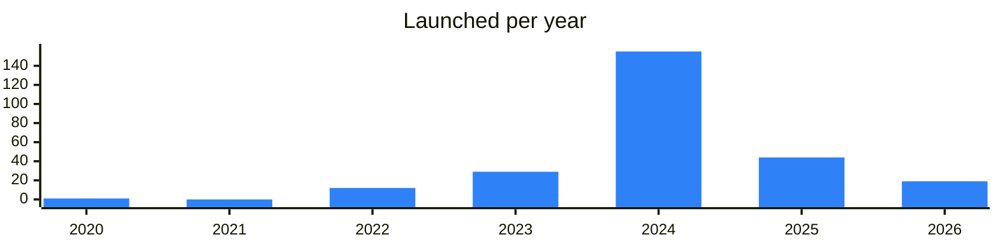

<!-- Generated by scripts/build_readme.py from data/. Do not edit by hand. -->

# Tokens

**264 projects: 53 active, 208 quiet, 3 closed.** Back to [all categories](../README.md#categories); statuses are explained [here](../README.md#how-to-read-it). The same list as a [searchable table](../data/by-category/tokens.csv).

## Active

| # | Project | What it is | Links | Launched | Peak MAU | Verified |
| ---: | --- | --- | --- | --- | ---: | --- |
| 1 | **GROYP** | Oldest living memecoin on Ton | [Telegram](https://t.me/groyp) [X](https://x.com/groyp_on_ton) [Site](https://groypfi.io) | 2023-07-19 |  |  |
| 2 | **UTYA** |  | [Telegram](https://t.me/MagicVipClub) [Bot](https://t.me/utyagamebot) [X](https://x.com/Utya_game) [Site](https://taplink.cc/utyagame) [Gram News](https://gramnews.org/apps/utyagame) | 2024-04-12 |  |  |
| 3 | **CHERRY** | Token tied to the Cherry Game, a Telegram mini app. | [Telegram](https://t.me/HotCherryTG) [Bot](https://t.me/cherrygame_io_bot) [X](https://x.com/HotCherryTG) [Site](https://hotcherry.online) [Gram News](https://gramnews.org/apps/cherry-game) | 2024-04-22 | 6.8M |  |
| 4 | **BabyDoge** | BabyDoge, a top 200 cryptocurrency, blends meme culture with a thriving Web3 ecosystem | [Telegram](https://t.me/babydogecoin) [X](https://x.com/BabyDoge) [Site](https://babydoge.com) | 2025-03-10 |  | since 2021-07 |
| 5 | **HPO** | Stake GRAM on TON with Hipo - liquid staking with top APY | [Telegram](https://t.me/HipoFinance) [X](https://x.com/hipofinance) [Site](https://hipo.finance) | 2024-11-24 |  | since 2025-05 |
| 6 | **NOT** | Notcoin token with a community channel and project website. | [Telegram](https://t.me/notcoin) [X](https://x.com/notcoin) [Site](https://notco.in/) | 2025-04-11 |  | since 2024-01 |
| 7 | **DOGS** | DOGS memecoin from the Dogs House Telegram app. | [Telegram](https://t.me/dogs_community) [X](https://x.com/realDogsHouse) [Site](https://dogs.dev/links) | 2024-12-16 |  | since 2024-08 |
| 8 | **RECA** |  | [X](https://x.com/ResistanceCat) [Site](https://reca.live) | 2024-04-08 |  |  |
| 9 | **STON** | STON.fi: Cross-chain DeFi, without the chaos | [Telegram](https://t.me/stonfidex) [X](https://x.com/ston_fi) [Site](https://ston.fi) | 2023-06-27 |  | since 2023-10 |
| 10 | **Capybobo (PYBOBO)** | PYBOBO, Your Capy, Your Culture, Your Coin | [Telegram](https://t.me/CapyboboNews) [X](https://x.com/Capybobo_io) [Site](https://capybobo.io) | 2025-09-18 |  |  |
| 11 | **GEMSTON (GEMSTON)** |  | [X](https://x.com/ston_fi) [Site](https://ston.fi) | 2023-09-04 |  |  |
| 12 | **GoMining (GOMINING)** | GoMining — Mine Bitcoin. Use Bitcoin. All in one app | [Telegram](https://t.me/gmt_token) [X](https://x.com/Gomining_token) [Site](https://gomining.com) | 2024-06-28 |  | yes |
| 13 | **$PAPA CULT BOT** | Community bot and token project with Twitter and Telegram chat links. | [Telegram](https://t.me/papa666cult) [Bot](https://t.me/papacultbot) [X](https://x.com/papa666cult) | 2026-08-28 |  |  |
| 14 | **DuckCoin (DUCK)** | Community-run meme token on TON with a website and community chats. | [Telegram](https://t.me/duckcoin) [X](https://x.com/Duck_Chain) [Site](https://duckcoin.org) | 2024-02-25 |  |  |
| 15 | **ANTHILL** | Reward token backed by BTC mining | [Telegram](https://t.me/anthill_rewards) | 2025-07-15 |  |  |
| 16 | **Groyper** | Memecoin on TON with a Telegram super app and announcement channel. | [Telegram](https://t.me/gtrade) | 2026-05-22 |  |  |
| 17 | **Groyper** | Announcement channel of the Groyper memecoin on TON | [Telegram](https://t.me/gapps) | 2026-04-16 |  |  |
| 18 | **LAMBO ($LAMBO)** | The only official channel of LAMBO | [Telegram](https://t.me/lambospeak) [X](https://x.com/LAMBOtokenTON) [Site](https://lambo.tg) | 2024-11-01 |  |  |
| 19 | **Not Meme (MEM)** | Token for a social network where users create, browse and share memes. | [Telegram](https://t.me/notmeme) [X](https://x.com/notmeme_org) [Site](https://notmeme.org) | 2024-04-10 |  |  |
| 20 | **JetTon Games (JETTON)** | Token linked to a Jetton games project with an announcements channel. | [Telegram](https://t.me/jetannouncements) [X](https://x.com/JetTonGames) [Site](https://jetton.pet/cffiylglyk5?click_id=%7Bclick_id%7D) | 2023-05-28 |  |  |
| 21 | **Durev Bot** | TON memecoin with trading and VPN bots, traded on DeDust and Stonfi. | [Telegram](https://t.me/poveldurev) [Bot](https://t.me/durevrobot) [X](https://x.com/poveldurev) [Site](https://dedust.io/swap/TON/DUREV) [Gram News](https://gramnews.org/apps/durev-bot) | 2024-03-26 | 10K |  |
| 22 | **Povel Durev (DUREV)** | TON memecoin with trading and VPN bots, traded on DeDust and Stonfi. | [Telegram](https://t.me/poveldurev) [X](https://x.com/poveldurev) [Site](https://poveldurev.net) | 2024-04-03 |  |  |
| 23 | **S.O.T.A.** | Token project linked to BEETON | [Telegram](https://t.me/sotatoken) [Site](https://sotatoken.ru) | 2025-02-19 |  |  |
| 24 | **Hydra** | Token with a private chat, monitoring channel and forum. | [Telegram](https://t.me/ton_hydra_community) [X](https://x.com/ton_hydra) [Site](https://tonhydra.com) | 2023-05-04 |  |  |
| 25 | **Butterflys** | Welcome To Butterfly's $BTYS | [Bot](https://t.me/realbutterflys_bot) [X](https://x.com/Butterflyonton) [Site](https://app.hipo.finance/#/referrer=UQDo7L_NkX2FBF5WDKBvIA-lFXUvRMpou6Yc1076Q1j8FkcW/) [GitHub](https://github.com/HipoFinance) [Gram News](https://gramnews.org/apps/butterflys) | 2023-02-23 | 28K |  |
| 26 | **CapybaraCoins** | Capybara is The Friendliest Telegram-Native Meme Coin! | [Telegram](https://t.me/the_capybara_meme) [X](https://x.com/meme_capybara) | 2024-07-15 |  |  |
| 27 | **Arbuz** | Fun meme token project on TON with no stated roadmap. | [Telegram](https://t.me/tonarbuz) [X](https://x.com/arbuz_ton) [Site](https://tonarbuz.fun) | 2023-12-03 |  |  |
| 28 | **Ton Fish** | Social meme token for Telegram and the TON ecosystem. | [Telegram](https://t.me/tonfish_tg) [X](https://x.com/tonfish_tg) | 2023-11-04 |  |  |
| 29 | **Ton Fish Box** | FISH is a meme token inspired by $PEPE | [Telegram](https://t.me/tonfish_tg) [Bot](https://t.me/Tonsifisifhbot) [X](https://x.com/tonfish_tg) [Site](https://www.tonfish.io/) | 2023-11-04 |  |  |
| 30 | **TON FISH MEMECOIN (FISH)** | Social meme token for Telegram and the TON ecosystem. | [Telegram](https://t.me/tonfish_tg) [X](https://x.com/tonfish_tg) [Site](https://www.tonfish.io) | 2023-12-31 |  |  |
| 31 | **JOYSTICK** | Digital assets project with TON dividends | [Telegram](https://t.me/joystickpro) | 2025-02-25 |  |  |
| 32 | **POK** | Memecoin built on Proof of Capital technology | [Telegram](https://t.me/proofofkarl) [X](https://x.com/proofofkarl) [Site](https://proofofcapital.org) | 2025-03-10 |  |  |
| 33 | **SISU** | Dragon-themed meme token on TON | [Telegram](https://t.me/sisudatuton) [X](https://x.com/SisuTon) | 2025-03-26 |  |  |
| 34 | **Soko Inu** | Soko Inu memecoin news channel | [Telegram](https://t.me/soko_inu) | 2024-12-20 |  |  |
| 35 | **VNUK** | Reward token on TON with a community chat. | [Telegram](https://t.me/vnukton) | 2025-03-20 |  |  |
| 36 | **Terminator** | Token on TON spun off from ARNI | [Telegram](https://t.me/termionton) | 2025-09-06 |  |  |
| 37 | **Gifts Strategy (GIFTSTR)** | $GIFTSTR — The Degen Engine for Telegram Gifts on TON Blockchain | [Telegram](https://t.me/giftsfomo) [X](https://x.com/giftsfomo) | 2025-09-29 |  |  |
| 38 | **The Resistance Cat** | Meme token project on TON with an announcement channel. | [Telegram](https://t.me/resistancecatton) [X](https://x.com/ResistanceCat) | 2024-04-08 |  |  |
| 39 | **Melody Token** | MLT token connecting music and technology | [Telegram](https://t.me/melody_token) [X](https://x.com/Melody_Token) | 2025-03-21 |  |  |
| 40 | **SHRK** |  | [Telegram](https://t.me/shrkonton) | 2025-12-28 |  |  |
| 41 | **TELO** | Meme token on TON with a mining bot | [Telegram](https://t.me/telomeme) [Site](https://telo.meme) | 2024-11-16 |  |  |
| 42 | **WTF** | Ecosystem memecoin on TON | [Telegram](https://t.me/wtf_on_ton) [Site](https://tonwtf.xyz) | 2024-05-26 |  |  |
| 43 | **KILOTON** | Token project on TON with its own channel and chat. | [Telegram](https://t.me/kilotonisboom) | 2024-10-10 |  |  |
| 44 | **Long Capital (LNG)** | Official channel of Long Capital strategy - The first fully decentralized 7x leveraged strategy on TON. Powered by the $LNG jetton — transparent, on-chain, community-owned | [Telegram](https://t.me/longcapitalstrategy) [X](https://x.com/longton_capital) [Site](https://longton.capital) | 2026-04-24 |  |  |
| 45 | **COFFEE (COFE)** | the holy water of caffeine junkies | [Telegram](https://t.me/coffeesolmeme) [X](https://x.com/CoffeeMemeCoin) [Site](https://www.cofe.fun) | 2024-03-22 |  |  |
| 46 | **LLAMA (LLAMA)** | Token of the Llama DAO community on TON. | [Telegram](https://t.me/daolama_en) [X](https://x.com/daolama_ton) [Site](https://daolama.co) | 2024-04-25 |  |  |
| 47 | **1RUS DAO (1RUSD)** |  | [Telegram](https://t.me/bitcon2024) [Site](https://1rus.com) | 2024-02-06 |  |  |
| 48 | **RuGramCoin Bot** | Telegram bot and community for the RuGramCoin token. | [Telegram](https://t.me/rugramcoin) [Bot](https://t.me/rugramcoin_bot) [Gram News](https://gramnews.org/apps/rugramcoin-bot) | 2025-04-09 |  |  |
| 49 | **ANON (ANON)** | Token with a public chat and website for the ANON community. | [Telegram](https://t.me/anon_club) [X](https://x.com/anonclub8) [Site](https://anon.tg) | 2024-04-02 |  |  |
| 50 | **INSECTS** | For support and enquiries, please contacts the core team and | [Telegram](https://t.me/insects_futures) [X](https://x.com/insectsvip) | 2025-11-17 |  |  |
| 51 | **Holdcoin (HOLD)** | Hold-to-earn token with a Telegram game bot, chat and announcement channel. | [Telegram](https://t.me/Holdcoin_Channel) [X](https://x.com/HoldCoinGo) [Site](https://holdcoin.xyz) | 2024-11-15 |  |  |
| 52 | **Mittens (MITTENS)** | Cat-themed token on TON with its own website and community channel. | [Telegram](https://t.me/Mittenston) [X](https://x.com/mittenstonchain) [Site](https://www.mittenston.com) | 2024-04-16 |  |  |
| 53 | **Simple swap** | Swap bot linked to Simple Coin, a deflationary reward token. | [Telegram](https://t.me/just_a_simple_coin) [Bot](https://t.me/SwapSCBot) [X](https://x.com/SimpleCoin_Move) [Site](https://simple-coin.xyz/) [Gram News](https://gramnews.org/apps/simple-swap) | 2025-01-07 |  |  |

<b>Quiet: 208</b>

| # | Project | What it is | Links | Launched | Peak MAU | Verified |
| ---: | --- | --- | --- | --- | ---: | --- |
| 54 | **PAKETKA** |  | [Bot](https://t.me/paketka2_bot) [Site](https://swap.coffee/dex?referral=user_UQDo7L_NkX2FBF5WDKBvIA-lFXUvRMpou6Yc1076Q1j8FkcW) [Gram News](https://gramnews.org/apps/paketka) | 2023-05-01 | 133K |  |
| 55 | **DMT Holder Assistant** | That’s an official bot for DMT token community | [Bot](https://t.me/dmt_community_bot) [Gram News](https://gramnews.org/apps/dmt-holder-assistant) | 2024-05-15 | 88K |  |
| 56 | **NEKO Box** | Meme token on TON with a Telegram community. | [Telegram](https://t.me/neco_arc_ton) [Bot](https://t.me/nekoapp_bot) [X](https://x.com/tongochi) Site (down) [Gram News](https://gramnews.org/apps/neko-box) | 2024-04-20 | 17K |  |
| 57 | **NOTAI** | $NOTAI — Definitely Not AI | [Bot](https://t.me/notai_app_bot) [Site](https://cryptoriviera-2xng.onrender.com/) [Gram News](https://gramnews.org/apps/notai) | 2024-05-15 | 2.5M |  |
| 58 | **Clout** | Memecoin with a Telegram channel and community, linked to a rapper's brand. | [Telegram](https://t.me/CloutCoinSol) [Bot](https://t.me/the_clout_bot) [X](https://x.com/offsetyrn) [Site](https://alpaton.bid) [GitHub](https://github.com/alpaton) [Gram News](https://gramnews.org/apps/clout) | 2024-06-23 | 3.4M |  |
| 59 | **GREEN COIN MEME** | Eco-themed memecoin on Solana with a Telegram game bot. | [Telegram](https://t.me/greencoinmeme) [Bot](https://t.me/greencoinmeme_bot) [Gram News](https://gramnews.org/apps/green-coin-meme) | 2024-07-19 | 119K |  |
| 60 | **Real Cows House** | The most telegram-native memecoin | [Telegram](https://t.me/cowspartners) [Bot](https://t.me/realcowshouse_bot) [X](https://x.com/realcowshouse) [Gram News](https://gramnews.org/apps/real-cows-house) | 2024-08-28 | 3.1M |  |
| 61 | **TRUST APP BOT** | Introducing TRUST: A Telegram Meme Token Set to Become the Largest Project by Both Participant Count and Token Value | [Telegram](https://t.me/trust_empire) [Bot](https://t.me/trust_empire_bot) [Gram News](https://gramnews.org/apps/trust-app-bot) | 2024-07-14 |  |  |
| 62 | **Leagushqa Bot** | Frog-themed exchange bot with staking and peer-to-peer trading, plus a help bot for newcomers. | [Telegram](https://t.me/leagushqa) [Bot](https://t.me/leagushqabot) [Gram News](https://gramnews.org/apps/leagushqa-bot) | 2020-03-23 | 16K |  |
| 63 | **Oldy** | Community app with a Telegram bot and its own STONE token. | [Telegram](https://t.me/oldy_community) [Bot](https://t.me/tonoldy_bot) [X](https://x.com/Oldy_Community) [Gram News](https://gramnews.org/apps/oldy) | 2024-08-08 | 941K |  |
| 64 | **Apes Gang** | The Apest Telegram memecoin | [Bot](https://t.me/apesgang_bot) [X](https://x.com/apes_telegram) [Site](https://apesgang.xyz) [Gram News](https://gramnews.org/apps/apes-gang) | 2024-06 | 357K |  |
| 65 | **Firecoin** | At the beginning of time, you could stare at Nothing. Now you stare at light shining brightly coming from Fire | [Bot](https://t.me/firecoin_app_bot) [X](https://x.com/firecoin_app) [Gram News](https://gramnews.org/apps/firecoin) | 2024-05-07 | 1.8M |  |
| 66 | **Hug** | The most kind Telegram native token | [Telegram](https://t.me/hugcommunity) [Bot](https://t.me/hugcommunity_bot) [X](https://x.com/communityhug) [GitHub](https://github.com/PurrFund/SC-Purr) [Gram News](https://gramnews.org/apps/hug) | 2024-04-09 | 275K |  |
| 67 | **G9 Token** |  | [Bot](https://t.me/g9tokenbot) [Gram News](https://gramnews.org/apps/g9-token) | 2024-12-13 | 165K |  |
| 68 | **MemeCatsBot** | Welcome to CATS Meme Coin! | [Telegram](https://t.me/memecatsnews) [Bot](https://t.me/imemecatsbot) [X](https://x.com/MemeCatsXYZ) [Site](https://bridge.tonbankcard.com) [Gram News](https://gramnews.org/apps/memecatsbot) | 2024-07-13 | 1.2M |  |
| 69 | **Monkey** | Find out the age and value of your Telegram account and get our MONKEY token for FREE | [Telegram](https://t.me/monkey_on_ton) [Bot](https://t.me/monkeycost_bot) [X](https://x.com/Monkey_on_TON) [Gram News](https://gramnews.org/apps/monkey) | 2024-07-14 | 2.2M |  |
| 70 | **AtomCoin** | Cryptocurrency platform in the TON ecosystem, operated through a Telegram bot and news channel. | [Telegram](https://t.me/atomcoin_news) [Bot](https://t.me/atomcointgbot) [Gram News](https://gramnews.org/apps/atomcoin) | 2026-04-05 | 20K |  |
| 71 | **Shaker Coin** | Meme token project with its own Telegram bot. | [Bot](https://t.me/shaker_coin_bot) [Gram News](https://gramnews.org/apps/shaker-coin) | 2024-06-26 | 4K |  |
| 72 | **Tonano** | Inscription protocol on TON that introduced the TON20 token standard. | [Telegram](https://t.me/tonanoOfficial) [Bot](https://t.me/tonanobot) [X](https://x.com/Ton_scription) [Site](https://tonano.io/) [Gram News](https://gramnews.org/apps/tonano) | 2023-12-26 | 1K |  |
| 73 | **Vending Coin ($VNDG)** | Be a member of Vending Coin community | [Telegram](https://t.me/VNDG_COIN) [Bot](https://t.me/VNDG_COIN_BOT) [X](https://x.com/VNDG_COIN) [Site](https://vndg.world/) [Gram News](https://gramnews.org/apps/vending-coin-vndg) | 2024-12-28 | 17K |  |
| 74 | **TonzCoin** | Telegram memecoin with its own community channel. | [Telegram](https://t.me/TonzCoin) [Bot](https://t.me/tonzcoin_bot) [X](https://x.com/tonzcoin) Site (down) [Gram News](https://gramnews.org/apps/tonzcoin) | 2022-11-22 | 115K |  |
| 75 | **NotStakers** |  | [Bot](https://t.me/notstacker_bot) [Gram News](https://gramnews.org/apps/notstakers) | 2023-11-13 | 25 |  |
| 76 | **Rikcoin** | Token with a Telegram bot and community channel. | [Telegram](https://t.me/r1kcoin) [Bot](https://t.me/rikcoinbot) [X](https://x.com/r1kcoin) [Gram News](https://gramnews.org/apps/rikcoin) | 2022-02-09 | 4K |  |
| 77 | **Utopia** | Meme token on TON with a Telegram mini app for staking and playing games. | [Telegram](https://t.me/safepermoon) [Bot](https://t.me/utopia_ton_bot) [X](https://x.com/UtopiaTon) [Site](https://safepermoon.com) [Gram News](https://gramnews.org/apps/utopia) | 2025-10-26 | 2 |  |
| 78 | **$TIME** | Memecoin themed around time, with a website and Twitter account. | [Telegram](https://t.me/timecoinsol) [X](https://x.com/timecointon) [Site](https://memetimeton.fun) | 2024-07-20 |  |  |
| 79 | **$VODKA** | You're still drinking water? | [Telegram](https://t.me/vodkatokensol) | 2024-07-19 |  |  |
| 80 | **Addickted** | Russian chat of the Addickted DICK token | [Telegram](https://t.me/addicktedchat) | 2024-04-10 |  |  |
| 81 | **AiDogs** | AI-themed meme coin born on Telegram, claimable by DOGS holders | [Bot](https://t.me/aidogs_bot) | 2024-08-29 | 2.5M |  |
| 82 | **Arixdex** | Arixcoin, a Crypto quirk | [Bot](https://t.me/arixcoin_bot) | 2024-05-21 | 1.9M |  |
| 83 | **Based Mike** | Buy bot for Based Mike token on TON | [Bot](https://t.me/basedmikebuybot) | 2025-06-02 |  |  |
| 84 | **Bear Country Token** | Token community with its own wallet bot and a warning against unrelated investment schemes. | [Telegram](https://t.me/bct_official_chat) | 2023-01-18 |  |  |
| 85 | **Bimcoin** | DeFi protocol on TON tied to the Bimlight Foundation. | [Telegram](https://t.me/Bimlight_Group) [Bot](https://t.me/BimlightBot) [X](https://x.com/Bim_Light) [Site](https://bimlight.org) [Gram News](https://gramnews.org/apps/bimcoin-ton-defi-protocol) | 2026-01-02 |  |  |
| 86 | **BOLT** | Community chat of the BOLT token | [Telegram](https://t.me/daiteboltchat) [X](https://x.com/boltlabston) [Site](https://huebel.art) | 2022-06-20 |  |  |
| 87 | **BOMT** | Token project with official Telegram channel | [Telegram](https://t.me/bomt_official) |  |  |  |
| 88 | **Bonsopoly** | Bonsopoly Token reflects the company's capitalization, and the development of the ecosystem allows you to invest more in the development of the token, increasin | [X](https://x.com/bonsopoly) [Site](https://bons.io/) | 2024-10 |  |  |
| 89 | **BRN Metaverse** | Token project with Turkish and global channels. | [Telegram](https://t.me/brntokenannouncementss) |  |  |  |
| 90 | **Buck** | Meme token project on TON with its own bot. | [Bot](https://t.me/buck_meme_bot) [Gram News](https://gramnews.org/apps/buck) | 2024-04-25 |  |  |
| 91 | **CLAN Coin** | Community chat of CLAN CLN and CLNR tokens | [Telegram](https://t.me/spr_clan) | 2025-08-14 |  |  |
| 92 | **CLOWN** | Airdrop bot of the CLOWN token on TON | [Bot](https://t.me/clownton_bot) | 2024-06-13 |  |  |
| 93 | **DHD** | Holders bot for DHD token | [Bot](https://t.me/dhd_holder_bot) | 2022-11-21 |  |  |
| 94 | **Dictator Crypto** | Crypto token community with a Telegram channel. | [Telegram](https://t.me/lostdogsdictat) | 2024-08-01 |  |  |
| 95 | **Dmitry's Friend Game** | Официальный бот токена $DF Администрация | [Telegram](https://t.me/dmitrys_friends) [Bot](https://t.me/df_gamebot) | 2026-06-09 |  |  |
| 96 | **DogePee** | Meme token on TON with a Telegram bot. | [Bot](https://t.me/dogeepee_bot) [X](https://x.com/DogePeeCoin) [Site](https://kibble.exchange/) [Gram News](https://gramnews.org/apps/dogepee) | 2024-06-01 |  |  |
| 97 | **DogeX** | Crypto token with a Telegram app | [Bot](https://t.me/dogex_ton_bot) | 2024-09-16 |  |  |
| 98 | **DOGG TON** | Community chat of the DOGG TON meme token | [Telegram](https://t.me/dogetonchat) | 2024-06-22 |  |  |
| 99 | **DOGWIFHOOD (WIF)** | Meme token on TON with a news channel and community chat. | [Telegram](https://t.me/dogwifhood_TON) [X](https://x.com/dogwifhoodTON) [Site](https://wifhood.dog) | 2024-03-04 |  |  |
| 100 | **DUCKS** | Social meme token on Telegram | [Bot](https://t.me/duckscoop_bot) | 2025-01-05 | 8.4M |  |
| 101 | **Durovs Dog (PYONYA)** | Original Sticker Pack created by Pavel Durov | [Telegram](https://t.me/PYONYATON) [X](https://x.com/pyonyaton) [Site](https://pyonya.com) | 2026-05-05 |  |  |
| 102 | **DYOR Coin (DYOR)** | Official DYOR English Chat | [Telegram](https://t.me/DYORchatEN) [X](https://x.com/dyorninja) [Site](https://dyor.io/?utm_source=chaten) | 2023-07-11 |  |  |
| 103 | **EL TON** | Memecoin Most Wanted on TON! | [Bot](https://t.me/eltoncoin_bot) [Gram News](https://gramnews.org/apps/el-ton) | 2025-04-29 | 13K |  |
| 104 | **Fish** | Social meme token used to upgrade various TON ecosystem assets. | [Telegram](https://t.me/tonfish_en) [X](https://x.com/tonfish_tg) [Site](https://www.tonfish.io) | 2023-12-31 |  |  |
| 105 | **GOVNO (GOVNO)** | Meme token on TON with its own website and community channel. | [Telegram](https://t.me/cryptover1eng) [X](https://x.com/official_govno) [Site](https://govnoton.com) | 2025-01-10 |  |  |
| 106 | **Gram Morning** | Meme token on TON named after the greeting GM. | [Telegram](https://t.me/gram_morning) | 2026-06-07 |  |  |
| 107 | **Grm (GRM)** | Token with its own website and Telegram channel. | [Telegram](https://t.me/gramcoinorg) [X](https://x.com/gramcoinorg) [Site](https://gramcoin.org) | 2024-01-26 |  |  |
| 108 | **Hamsterbabybot** | First Meme Community on Ton for Hamster Lovers .. $NOT just got a baby | [Bot](https://t.me/hansterbabybot) [Gram News](https://gramnews.org/apps/hamsterbabybot) | 2024-07-12 | 41K |  |
| 109 | **Harry Coin** | Harry Coin token community bot | [Bot](https://t.me/harry_coin_bot) | 2024-09-28 | 38K |  |
| 110 | **HEDGE** | One of the earliest tokens on TON, tied to the Hedge Fighting game. | [Telegram](https://t.me/tonhedgecoin) | 2023-01-19 |  |  |
| 111 | **Hedgehog** | Meme token on TON listed on STON.fi | [Telegram](https://t.me/tonhedgehogchat) | 2024-06-11 |  |  |
| 112 | **Hot Cherry** |  | [Telegram](https://t.me/hotcherry_ton) [X](https://x.com/hotcherry_ton) | 2024-04-22 |  |  |
| 113 | **JackToken** | Announcements: Discussion: Whitepaper: wp.jacktoken.com | [Bot](https://t.me/jacktokencombot) | 2025-01-09 | 30K |  |
| 114 | **JETTON** | Game currency token with Russian channel | [Telegram](https://t.me/jettontokenrus) [X](https://x.com/JetTonGames) [Site](https://jetton.pet/cffiylglyk5?click_id=%7Bclick_id%7D) | 2024-07-15 |  |  |
| 115 | **Jetty** | Meme token from the team behind the Jetton Telegram casino. | [Telegram](https://t.me/jettymem) | 2024-11-08 |  |  |
| 116 | **Kamana AI** | Start your $KAMANA journey and reap the rewards in $TON • TG • Play | [Telegram](https://t.me/kamanaann) [Bot](https://t.me/kamanaai_bot) | 2026-10 | 685 |  |
| 117 | **KGB Protocol** | KGB token project with bot and chat | [Telegram](https://t.me/protocol_kgb) | 2024-05-14 |  |  |
| 118 | **Kilogram** | Token project on TON with its own Telegram channel. | [Telegram](https://t.me/kgonton) | 2025-01-18 |  |  |
| 119 | **Kitty** | Get ready to vibe with $KITTY, the ultimate meme coin that’s not just here to play but to SLAY! | [Bot](https://t.me/kittyofficialbot) | 2025-01-11 |  |  |
| 120 | **LAMBO** | Meme token on TON with adventure game | [Bot](https://t.me/lambo_adventurebot) [X](https://x.com/LAMBOtokenTON) [Site](https://lambo.tg) | 2024-12-06 |  |  |
| 121 | **LAMBO** | Meme token and Wen Lambo project | [Telegram](https://t.me/lambo_ru) [X](https://x.com/LAMBOtokenTON) [Site](https://lambo.tg) | 2025-09-29 |  |  |
| 122 | **Liberty Dog** | Liberty Dog is a community dedicated to digital freedom | [Bot](https://t.me/lido_appbot) [X](https://x.com/lidotoken) [Site](https://lido-app.fun/) | 2025-07 |  |  |
| 123 | **Make TON Great Again (MTONGA)** | Meme token on TON with its own website and channel. | [Telegram](https://t.me/mtonga_meme) [X](https://x.com/MTONGA_ON_TON) [Site](https://www.mtonga.com/) | 2026-04-09 |  |  |
| 124 | **MAROHA** | Pink MAROHA on TON | [Bot](https://t.me/maroha_hubbot) | 2026-08-23 |  |  |
| 125 | **Master Chef** | Master Chef of the Wonton project | [Telegram](https://t.me/mastercheforg) | 2024-09-03 |  |  |
| 126 | **MOEW (MOEW)** | Official $MOEW Community group | [Telegram](https://t.me/moewcommunty) [X](https://x.com/MOEW_Agent) [Site](https://donotfomoew.org) | 2024-07-17 |  |  |
| 127 | **Moonraid Online** | Mini‑app for staking and playing with the Moonraid token | [Telegram](https://t.me/safepermoon) [Bot](https://t.me/moonraid_game_bot) [X](https://x.com/safepermoon) [Site](https://safepermoon.com) [Gram News](https://gramnews.org/apps/moonraid-online) | 2025-10-26 |  |  |
| 128 | **NEW** | NEW jetton token channel on TON | [Telegram](https://t.me/newbiejet) [X](https://x.com/newjetton) [Site](https://new-jetton.site) | 2024-10-30 |  |  |
| 129 | **Newcoin** | Crypto token with a Telegram app | [Bot](https://t.me/newcoin_official_bot) | 2024-11-27 | 622K |  |
| 130 | **NEXTBITCOIN** | Telegram game with an investment-themed pitch around the NEXTBITCOIN project. | [Bot](https://t.me/next_bitcoin_bot) | 2024-10-27 | 247K |  |
| 131 | **NikolAI (NIKO)** | The Meme, The Myth, The AI Machina | [Telegram](https://t.me/NikolAIToncoinChat) [X](https://x.com/NikolAIToncoin) [Site](https://nikolai.meme/) | 2024-11-01 |  |  |
| 132 | **OLYCoin** | Welcome to OLYCoin! Backed by Foresight Ventures Business | [Telegram](https://t.me/olycoin_official) |  |  |  |
| 133 | **Oxygen Hunters** | The first Chia token to be traded on a centralized exchange! | [X](https://x.com/Oxygen_Hunters) Site (down) | 2024-10 |  |  |
| 134 | **Pandastic** |  | [Bot](https://t.me/pandastic_bot) [X](https://x.com/pandastic_io) [Gram News](https://gramnews.org/apps/pandastic) | 2024-06-23 |  |  |
| 135 | **Peng** | Penguin-themed token on TON with its own website. | [X](https://x.com/pengtoncoin) [Site](https://pengonton.com) | 2024-04-15 |  |  |
| 136 | **PIGS** | The most telegram-native memecoin Join our Twitter Support #PIGS #PIGSCOMMUNITY | [Telegram](https://t.me/pigscrew) | 2024-08-07 |  |  |
| 137 | **PinGo (PINGO)** | Token with a Twitter account and listings on Gate.io and STON.fi. | [Telegram](https://t.me/PinGo_AI) [X](https://x.com/PinGoAI) [Site](https://pingo.work) | 2024-11-17 |  |  |
| 138 | **PirateCash (PIRATE)** | PIRATECASH ($PIRATE) – cryptocurrency for privacy and freedom | [Telegram](https://t.me/PirateCash_ENG) [X](https://x.com/PirateCash_NET) [Site](https://p.cash) | 2024-01-16 |  |  |
| 139 | **PLPP** | PLPP token community chat on TON | [Telegram](https://t.me/plpphold) [X](https://x.com/poolpepehold) | 2026-05-01 |  |  |
| 140 | **Pocket Waifu** | $WIFE is the #1 waifu meme coin, bringing you closer to your favorite waifus in ways you’ve only dreamed of | [Bot](https://t.me/pocketwaifu_bot) [X](https://x.com/PocketWaifuGame) [Site](https://pocketwaifu.io/) | 2024-10-02 | 300K |  |
| 141 | **PUPCUBY** | Community for the PUPCUBY token on TON | [Telegram](https://t.me/pupcuby) [X](https://x.com/pupcuby) | 2024-12-02 |  |  |
| 142 | **Redrawn Dog** | Meme token on TON with a community chat. | [Telegram](https://t.me/redrawndogton) | 2026-04-18 |  |  |
| 143 | **Rekt.me** | Meme token bot for the REKT token on TON | [Bot](https://t.me/rektme_bot) | 2024-10-14 | 417K |  |
| 144 | **Resistance Dog** |  | [Site](https://redoton.com) [Gram News](https://gramnews.org/apps/resistance-dog) | 2024-04-17 |  |  |
| 145 | **Resistance Pack** | DAO of 10,000 dogs on TON | [Telegram](https://t.me/resistancepack) | 2022-06-28 |  |  |
| 146 | **SCRATS** | SCRATS, the meme coin, was inspired by the character Scrat, the squirrel from the animated movie "Ice Age." Just like Scrat is determined to obtain his acorn, the SCRATS token team is focused on gaini | [Telegram](https://t.me/scratchmemecoin) [Bot](https://t.me/scrats_kleym1_bot) [X](https://x.com/ScratchMemeCoin) [Site](https://bot.cryptosymbiotic.com/?user_id=1) [Gram News](https://gramnews.org/apps/scrats) | 2023-05-14 |  |  |
| 147 | **SHWRM** | Community chat of the SHWRM memecoin | [Telegram](https://t.me/shwrmm) | 2024-07-11 |  |  |
| 148 | **Sons of TON** | Telegram-Native Meme Coin on ecosystem | [Bot](https://t.me/sonsofton_bot) | 2025-02-15 |  |  |
| 149 | **Spintria** | Token on TON intended for anonymous and quick access to adult content. | [Telegram](https://t.me/spintrru) | 2024-04-15 |  |  |
| 150 | **The BAD Coin** | Are you BAD enough to join anon? | [Bot](https://t.me/badcoinbadbot) |  |  |  |
| 151 | **The Open Coin** | Community-owned token inspired by Bitcoin | [Bot](https://t.me/theopencoin_bot) | 2024-05-26 | 246K |  |
| 152 | **The Resistance Girl** | Meme token project on TON with a news channel. | [Telegram](https://t.me/resistancegirl) [X](https://x.com/regitoncoin) | 2024-03-12 |  |  |
| 153 | **TINU Ads Bot** | Advertising bot of the TINU token community | [Bot](https://t.me/tinuadsbot) | 2025-09-27 |  |  |
| 154 | **Tnc** | Token project on TON with a community channel. | [Telegram](https://t.me/tnc_community) [Bot](https://t.me/tontncbot) | 2026-08-24 |  |  |
| 155 | **TOGE** | Doge-themed meme token on TON with a website and community channels. | [Telegram](https://t.me/togeofficial) [X](https://x.com/TOGE_TON) [Site](https://toge.world) | 2024-01-06 |  |  |
| 156 | **Ton Capybara** | Capybara-themed token on TON run as a community takeover project. | [Telegram](https://t.me/t_capy) | 2025-12-05 |  |  |
| 157 | **TON DOGE COIN & NFT** | Doge-themed coin and NFT project on the TON network. | [Site](https://tondoge.com/) | 2023-08 |  |  |
| 158 | **Ton Inu** | Telegram bot for the Ton Inu memecoin. | [Bot](https://t.me/toninubot) | 2026-01-15 |  |  |
| 159 | **Ton Inu (TINU)** | Meme token on TON with a support bot and ecosystem links. | [Telegram](https://t.me/toninutools) [X](https://x.com/toninutools) [Site](https://toninu.tech) | 2024-01-07 |  |  |
| 160 | **TON INU BuyBot** | TON INU BuyBot — a bot for buying the TINU token on the TON network | [Telegram](https://t.me/toninu_trending) [Bot](https://t.me/TonBuyTechBot) [X](https://x.com/toninutools) [Site](https://toninu.tech/) [Gram News](https://gramnews.org/apps/ton-inu-buybot) | 2025-01-16 |  |  |
| 161 | **TON INU Locker** |  | [Telegram](https://t.me/toninutools) [X](https://x.com/toninutools) [Site](https://app.toninu.tech/locker) [Gram News](https://gramnews.org/apps/ton-inu-locker) | 2024-01-12 |  |  |
| 162 | **TON Pedro** | Airdrop bot for the PEDRO coin on TON | [Bot](https://t.me/tonpedrocoin_bot) | 2024-06-03 |  |  |
| 163 | **Tonio (TONIO)** | Mascot-themed meme token on TON with its own website. | [Telegram](https://t.me/toniomeme) [X](https://x.com/TonioMeme) [Site](https://www.toniomeme.com) | 2025-06-24 |  |  |
| 164 | **Tony The Duck** | The Quackiest Duck on TON | [Telegram](https://t.me/tonytheduck) [X](https://x.com/theducktony) [Site](https://tonytheduck.com) | 2024-01-13 |  |  |
| 165 | **Trade TOKEN** | Token with its own website, forum and Russian-language channel. | [Telegram](https://t.me/gumcoin) [Site](https://gumcoin.org/) [Gram News](https://gramnews.org/apps/trade-token) | 2023-08-30 |  |  |
| 166 | **WOOF (WOOF)** |  | [X](https://x.com/LostDogsCo) [Site](https://x.com/lostdogsco) | 2024-12-23 |  |  |
| 167 | **Yaya** | Yaya memecoin community on TON | [Telegram](https://t.me/yayamemeton) | 2026-05-09 |  |  |
| 168 | **UNIC** | Utility token community on TON | [Telegram](https://t.me/unicorncoinmain) [X](https://x.com/unicornmainai) [Site](https://unic.pro) | 2024-02-13 |  |  |
| 169 | **DRIFT Foundation** | Car enthusiast community and token on TON | [Telegram](https://t.me/ton_drift) | 2023-11-04 |  |  |
| 170 | **Ton Inu** | TINU token announcements and tools | [Telegram](https://t.me/toninuannoucement) | 2024-03-15 |  |  |
| 171 | **Gram Community** | Enthusiast community channel about Gram | [Telegram](https://t.me/gramcommunity) [X](https://x.com/gramcommunity) | 2024-01-31 |  |  |
| 172 | **Dracoin** | Dragon-themed token on TON with a chat and contact channel. | [Telegram](https://t.me/dracoin) | 2024-01-13 |  |  |
| 173 | **Grand Ton Ape** | Memecoin project on TON themed around GTA | [Telegram](https://t.me/gtaonton) | 2025-09-08 |  |  |
| 174 | **Pepek TON** | Frog-themed memecoin on the TON network | [Telegram](https://t.me/pepekton) [X](https://x.com/PepekTon) | 2026-05-05 |  |  |
| 175 | **Gentleman (MAN)** | Meme token on TON with its own website. | [Telegram](https://t.me/gentlemanton) [X](https://x.com/gentlemanonton) [Site](https://gentlemanton.com) | 2024-04-23 |  |  |
| 176 | **Lavandos** | LAVE decentralized token on TON | [Telegram](https://t.me/lavefoundation) | 2023-01-25 |  |  |
| 177 | **Huebel Bolt** | Token with an official channel, CoinMarketCap listing and art website. | [Telegram](https://t.me/boltfoundation) [X](https://x.com/boltlabston) | 2022-06-14 |  |  |
| 178 | **BlyatCoin** | Memecoin described as the first on TON, tradable on STON.fi. | [Telegram](https://t.me/blyatcoin) | 2023-12-28 |  |  |
| 179 | **DIAMOND HANDS (DIAMOND)** | Meme token on TON with a portal channel and website. | [Telegram](https://t.me/DiamondHandsonTON) [X](https://x.com/diamondhandston) [Site](https://diamondhandston.com) | 2026-02-09 |  |  |
| 180 | **SPONGE** | Meme token on TON with English and Russian chats. | [Telegram](https://t.me/spngton) | 2024-10-25 |  |  |
| 181 | **Durov Official Meme** | Meme token community on TON | [Telegram](https://t.me/durov_official_meme) [X](https://x.com/off_durov_meme) | 2025-01-19 |  |  |
| 182 | **PAPA CARLO BOT** | Official Channel of the Project | [Telegram](https://t.me/papacarlotoken) [Bot](https://t.me/papacarlobot_bot) [X](https://x.com/PCtoken) Site (down) [Gram News](https://gramnews.org/apps/papa-carlo-bot) | 2023-05-20 |  |  |
| 183 | **PEPE TON** | Memecoin on TON with burnt LP | [Telegram](https://t.me/pepecoin_ton) | 2024-03-27 |  |  |
| 184 | **Spintria (SP)** | Spintria (SP) is a token on the TON network created for anonymous and quick access to the content of the adult ecosystem | [Telegram](https://t.me/spintr) [X](https://x.com/Spintria_coin) [Site](https://sp.one) | 2024-04-08 |  |  |
| 185 | **CATS (CATS)** | Only $CATS the meowest Telegram native token. Join meow | [Telegram](https://t.me/Cats_housewtf) [X](https://x.com/toncats_tg) [Site](https://toncats.pw) | 2024-09-21 |  | since 2024-10 |
| 186 | **TON Punks Bot** | TON Punks Bot is a bot for managing $PUNK and $TON tokens on the TON blockchain | [Telegram](https://t.me/punkton) [Bot](https://t.me/tonpunksbot) [Site](https://tonpunks.org) [Gram News](https://gramnews.org/apps/tonpunksbot) | 2022-01-12 |  | since 2024-08 |
| 187 | **TONKING Network** | A secret social, gaming and entertainment network connected by Telegram Wallets, powered by TONKING token | [Telegram](https://t.me/tonkcommunity) [Bot](https://t.me/TONKREFERBOT) [X](https://x.com/TheTonkToken) [Site](https://) | 2023-12-16 |  |  |
| 188 | **OwnershipCoin (OC)** | The Community-run Chill Gallery on TON. We are the Gallery that doesn't take itself too seriously | [Telegram](https://t.me/ownershipcoin) [X](https://x.com/ownershipcoin) [Site](https://ownershipcoin.com) | 2024-10-09 |  |  |
| 189 | **TONDEV** | Jetton token of the TON developer community | [Telegram](https://t.me/tondev_jetton) [X](https://x.com/tondevmeme) [Site](https://tondev.foundation) | 2025-11-29 |  |  |
| 190 | **SuperVerse** | Announcement channel for SuperVerse and the $SUPER token | [Telegram](https://t.me/superverse) [X](https://x.com/SuperVerse) [Site](https://superverse.co) | 2024-09-04 |  |  |
| 191 | **Amocucinare (AMORE)** |  | [Telegram](https://t.me/amoreAIcrypto) [X](https://x.com/AmoreCoin) [Site](https://amorecoin.love/) | 2024-11-04 |  |  |
| 192 | **Numbers Strategy** | NUMSTR token focused on anonymous Telegram numbers on TON | [Telegram](https://t.me/numsfomo) | 2025-10-03 |  |  |
| 193 | **Turbo Toad** | Turbo Toad token community portal | [Telegram](https://t.me/turbotoadtoken) | 2024-05-28 |  |  |
| 194 | **Nest Coin** | Official channel of the Nest Coin token | [Telegram](https://t.me/tapovich_channel) | 2024-03-13 |  |  |
| 195 | **TON Cats Jetton** | Telegram social meme token with NFT upgrades and a referral system. | [Telegram](https://t.me/toncats_tg) [Bot](https://t.me/toncats_cbot) [X](https://x.com/toncats_tg) | 2024-03-13 |  |  |
| 196 | **FPI Bank (FPIBANK)** | Token project with a DEX Screener listing and a technical support bot. | [Telegram](https://t.me/fpibank) [X](https://x.com/fpi_bank) [Site](https://fpibank.com) | 2024-11-26 |  |  |
| 197 | **SHWRM** | SHWRM memecoin channel | [Telegram](https://t.me/shwrm) | 2024-07-11 |  |  |
| 198 | **ARTDRA Coin (ARTDRA)** | Combat Games & Artdra Coin | [Telegram](https://t.me/artdracoin) [X](https://x.com/combatgamestv) [Site](https://artdra.pro) | 2025-07-10 |  |  |
| 199 | **Epic Clash Story** | Memecoin project with TON and Solana communities | [Telegram](https://t.me/epicclashstory) | 2024-11-13 |  |  |
| 200 | **Bolgur** | Meme token project with official channel on TON | [Telegram](https://t.me/airinabolgur) [X](https://x.com/airinabolgur) [Site](https://bolgur.ai) | 2024-11-01 |  |  |
| 201 | **Ton Cat (TCAT)** | Cat-themed meme token on TON with its own website. | [Telegram](https://t.me/TheRealTCAT) [X](https://x.com/TonCatonTon) [Site](https://www.toncat.net) | 2024-06-26 |  |  |
| 202 | **B UserBot** | B — the most distributed Telegram community coin! | [Telegram](https://t.me/b_users) [Bot](https://t.me/b_usersbot) | 2024-04-04 | 3.5M |  |
| 203 | **BARK47** | Meme token on TON presented as a dog president, with a website. | [Telegram](https://t.me/bark_47) [X](https://x.com/bark047) [Site](https://bark47.com) | 2024-11-14 |  |  |
| 204 | **CAVIAR** | Utility token of the TON Frogs NFT project | [Telegram](https://t.me/caviarcoin) | 2024-03-22 |  |  |
| 205 | **DoubleDog** | Memecoin on TON with a community, Twitter account and website. | [Telegram](https://t.me/doubledogmeme) | 2024-04-07 |  |  |
| 206 | **Mumba TaskBot** | Official Channel of the Mumba Token | [Telegram](https://t.me/mumbatonofficial) [X](https://x.com/mumba_ton) [Site](https://teletype.in/@mumba/taskbot) [Gram News](https://gramnews.org/apps/mumba-taskbot) | 2024-02-02 |  |  |
| 207 | **Tonion** | TONion- The Ultimate Meme | [Telegram](https://t.me/tonion_official) [X](https://x.com/TONion_io) Site (down) | 2024-11-24 |  |  |
| 208 | **TON Degen** | Community project on TON for speculative traders. | [Telegram](https://t.me/degenon_ton) | 2024-06-20 |  |  |
| 209 | **BUILD (BUILD)** | Token of the Open Builders community with its own website. | [Telegram](https://t.me/join_community) [X](https://x.com/commmmmunity) [Site](https://openbuilders.xyz) | 2025-01-06 |  |  |
| 210 | **AngelPoop** | Announcements for the AngelPoop token | [Telegram](https://t.me/angelpoop_announcements) | 2024-11-02 |  |  |
| 211 | **ECO Project** | Token project on TON with an English channel. | [Telegram](https://t.me/eco_project_ton) | 2024-07-12 |  |  |
| 212 | **Mr. Feeman** | Meme token on TON with Russian and English communities and bots. | [Telegram](https://t.me/mrfeeman_ru) [Bot](https://t.me/mrfeeman_bot) | 2024-06-02 |  |  |
| 213 | **Memeerkat** | Meerkat-themed meme token with an announcement channel. | [Telegram](https://t.me/memeerkat) [X](https://x.com/WeAreMemeerkat) | 2024-11-26 |  |  |
| 214 | **England Fan Token** | Fan token on TON for supporters of the English football team. | [Telegram](https://t.me/englandfantokenchannel) | 2024-05-24 |  |  |
| 215 | **Cyber Dog** | Memecoin of a gaming community, with a contract address and social links. | [Telegram](https://t.me/cyberdogmeme) [X](https://x.com/CyberDogMeme) | 2024-09-06 |  |  |
| 216 | **BOOK OF MEME TON** | Meme token with burnt liquidity pool tokens and renounced contract ownership. | [Telegram](https://t.me/bome_tonann) | 2024-04-07 |  |  |
| 217 | **mylegton** | Just a degen token on #TON | [Telegram](https://t.me/mylegonton) [Bot](https://t.me/mylegonton_bot) [X](https://x.com/mylegonton) Site (down) [Gram News](https://gramnews.org/apps/mylegton) | 2025-04-06 | 821 |  |
| 218 | **ZGGY** | Meme token on TON with its own website. | [Telegram](https://t.me/zggycoin) [Bot](https://t.me/zggy_bot) [X](https://x.com/zggycoin) Site (down) [Gram News](https://gramnews.org/apps/zggy) | 2024-08-14 |  |  |
| 219 | **JIRIQ** | Meme coin with website and roadmap | [Telegram](https://t.me/jirique) | 2025-01-21 |  |  |
| 220 | **Lucky TON** | Possessing this token is believed to attract prosperity and luck | [Telegram](https://t.me/lkyton) [Bot](https://t.me/lkytonbot) [X](https://x.com/luckyton8) Site (down) [Gram News](https://gramnews.org/apps/lucky-ton) | 2025-01-30 |  |  |
| 221 | **EMOB TON** |  | [Telegram](https://t.me/emobton) [X](https://x.com/emobton) [GitHub](https://github.com/emobton) | 2025-01-18 |  |  |
| 222 | **OTON** | Announcement channel of the OTON token | [Telegram](https://t.me/orangutonchain) [X](https://x.com/RealOranguTON) [Site](https://oranguton.com) | 2024-04-21 |  |  |
| 223 | **Redo** | Welcome to the Digital Resistance | [Telegram](https://t.me/redotoken) [X](https://x.com/redotoken) [Site](https://redoton.com) | 2024-01-09 |  |  |
| 224 | **Resistance Dog (REDO)** | Welcome to the Digital Resistance | [Telegram](https://t.me/redotoken) [X](https://x.com/redotoken) [Site](https://redoton.com) | 2024-01-09 |  |  |
| 225 | **DOGG TON** | Dog-themed meme token on TON with a game | [Telegram](https://t.me/dogecoin_onton) | 2024-04-12 |  |  |
| 226 | **KAKAXA** | Meme token on TON with a community channel. | [Telegram](https://t.me/kakaxa_coin) [X](https://x.com/kakaxa_ton) [Site](https://kakaxa.com/eng#rec739886644) | 2024-04-17 |  |  |
| 227 | **Tenere Explorer** | Audiatur et altera pars. Universal token The Open Network. Max Supply 210,000,000 | [Telegram](https://t.me/teneretoken) [X](https://x.com/Tenerecash) | 2022-12-30 |  |  |
| 228 | **Pizza Gram** | Memecoin on The Open Network | [Telegram](https://t.me/pizzaforgram) | 2024-03-25 |  |  |
| 229 | **Shitcoin (SHIT)** | Joke meme token on TON with Russian and English channels and a website. | [Telegram](https://t.me/Shitcoinrun) [X](https://x.com/shitcoinrun) [Site](https://tonshitcoin.xyz/) | 2024-05-09 |  |  |
| 230 | **Hedgehog in the Fog** | It’s just hedgehog in the fog on TON. Listing is on 5th of June on StonFi | [Telegram](https://t.me/hedgehoginthefogen) [X](https://x.com/hedgehogton) [Site](https://www.hedgehoginthefog.xyz) | 2024-06-05 |  |  |
| 231 | **TonBubbles** | Antimemecoin on TON with the DICK token | [Telegram](https://t.me/addicktedton) | 2024-04-09 |  |  |
| 232 | **Alenka** | ALENKA coin project on TON | [Telegram](https://t.me/alenkaonton) [X](https://x.com/AlenkaTON) [Site](https://alenka.tg) | 2024-05-31 |  |  |
| 233 | **Resistance Girl (REGI)** | Meme token on TON with its own website and community channel. | [Telegram](https://t.me/ResistanceGirlCoin) [X](https://x.com/regitoncoin) [Site](https://regiton.net) | 2024-03-13 |  |  |
| 234 | **SAD MEOW (SADMEOW)** | Cat-themed meme token on TON with its own website. | [Telegram](https://t.me/sadmeowcto_portal) [X](https://x.com/SadMeowMP3) [Site](https://sadmeow.lol) | 2024-10-11 |  |  |
| 235 | **Jason Statham TON** | Celebrity-themed meme token on TON tradable on DeDust. | [Telegram](https://t.me/statham_ton) | 2024-01-28 |  |  |
| 236 | **SpartaCats** | Cat-themed memecoin built around a rivalry with dog-related memecoins. | [Telegram](https://t.me/spartacats) | 2024-04-13 |  |  |
| 237 | **meh (MEH)** | Meme token on TON with its own website. | [Telegram](https://t.me/mehtoken) [X](https://x.com/meh_ton) [Site](https://meh.promo) | 2024-04-06 |  |  |
| 238 | **BROUK** | Meme token on TON with a community channel. | [Telegram](https://t.me/broukonton) | 2024-07-02 |  |  |
| 239 | **Kotecoin** | Russian community of Kotecoin, a jetton and ICO on TON | [Telegram](https://t.me/kotecoinru) | 2022-04-21 |  |  |
| 240 | **NOTGEM** | Token on TON with a community channel. | [Telegram](https://t.me/gemtonmeme) | 2024-05-03 |  |  |
| 241 | **Raha Coin** | Token project with a founder contact and community chat. | [Telegram](https://t.me/rahacoin) | 2023-09-05 |  |  |
| 242 | **FUEL** | Jetton on TON with a Telegram bot and support contact. | [Telegram](https://t.me/fueljetton) | 2024-04-16 |  |  |
| 243 | **KOT on TON** | Cat-themed meme token with a website, Twitter account, chat and bot. | [Telegram](https://t.me/kot_on_ton) | 2024-04-28 |  |  |
| 244 | **MMM2049** | Meme token on TON with Russian and English channels and chats. | [Telegram](https://t.me/mmm2049) | 2024-05-14 |  |  |
| 245 | **Fuel Jetton** | Jetton token on TON with its own bot | [Telegram](https://t.me/fueljetton_en) | 2024-05-31 |  |  |
| 246 | **The Open League MEME** | $TOL is The Open League meme community token. Earn rewards by using TON ecosystem projects | [Telegram](https://t.me/tolmeme) [X](https://x.com/tolmeme) | 2024-03-26 |  |  |
| 247 | **John Doge** |  | [Telegram](https://t.me/johndogeton) [X](https://x.com/JohnDogeTON) | 2024-02-05 |  |  |
| 248 | **Cubigator (CUB)** | Token of the Cubigator project with a Telegram portal and website. | [Telegram](https://t.me/cubigatorton) [X](https://x.com/CubigatorOnTon) [Site](https://www.cubigator.club) | 2024-04-24 |  |  |
| 249 | **TON Airplane** | Community token project on TON | [Telegram](https://t.me/tonairplane) | 2022-01-15 |  |  |
| 250 | **KREEPTA** | Meme token on TON with community channel | [Telegram](https://t.me/kreeptatoken) | 2024-06-26 |  |  |
| 251 | **Morfey** | Ton founders' (Nikolai and Pavel Durov) Cat | [Telegram](https://t.me/morfeyofficial) [X](https://x.com/morfeytoken) [Site](https://morfeytoken.io) | 2024-01-07 |  |  |
| 252 | **Ton Shiba Inu** | Shiba Inu on Ton Blockchain | [Telegram](https://t.me/ton_shibainu) [X](https://x.com/ton_shiba) [Gram News](https://gramnews.org/apps/ton-shiba-inu) | 2024-03-22 |  |  |
| 253 | **Laika** | Meme token on TON with its own website and community station channel. | [Telegram](https://t.me/laikaofficialstation) [X](https://x.com/LaikaOnTon) [Site](https://www.laikaonton.com) | 2023-12-27 |  |  |
| 254 | **Rosecoin (ROSE)** | Rosecoin pays homage to the most recognisable face on Telegram - Join our fan token community | [Telegram](https://t.me/Rosecointon) [X](https://x.com/RosecoinTon) [Site](https://roseton.org) | 2024-04-12 |  |  |
| 255 | **tbrc** | Inscription-style token experiment on TON and Telegram | [Telegram](https://t.me/tbrc_ton) | 2024-02-02 |  |  |
| 256 | **PAPA** | Meme token on the TON blockchain with a Russian community. | [Telegram](https://t.me/papa_community) | 2023-12-31 |  |  |
| 257 | **PADLA** | Official channel of the PADLA bear project | [Telegram](https://t.me/padla_project) | 2022-08-26 |  |  |
| 258 | **Paper Plane (PLANE)** | Token on TON with a portal channel and website. | [Telegram](https://t.me/paperplane_ton) [X](https://x.com/paperplane_ton) [Site](https://paperplanetoken.site) | 2024-01-11 |  |  |
| 259 | **NOT DAO** | Community DAO channel of the Notcoin ecosystem | [Telegram](https://t.me/not_dao) | 2024-01-27 |  |  |
| 260 | **Not Notcoin** | Parody meme token on TON with a community channel. | [Telegram](https://t.me/not_notcoin) [X](https://x.com/Not_Notcoin) | 2024-01-10 |  |  |
| 261 | **iOi Coin** | Official channel of iOi coin with wallet bot | [Telegram](https://t.me/ioi_coin) | 2023-03-18 |  |  |

<b>Closed: 3</b>

| # | Project | What it is | Links | Launched | Peak MAU | Verified |
| ---: | --- | --- | --- | --- | ---: | --- |
| 262 | **TON DOGE bot** | Telegram bot and community for the TON Doge coin and NFT project. | [Telegram](https://t.me/tondogeofficial) [Bot](https://t.me/tondoge_bot) [X](https://x.com/tondogeofficial) [Site](https://tondoge.com) | 2022-05-01 | 837 |  |
| 263 | **DOGWIFHOOD** | Meme token on TON with a news channel and community chat. | [Telegram](https://t.me/dogwifhood_TON) [X](https://x.com/dogwifhoodTON) [Site](https://wifhood.dog/) | 2024-03-15 |  |  |
| 264 | **X Bull** | X Bull Meme Coin is launching soon! | Site (down) | 2025-01 |  |  |

