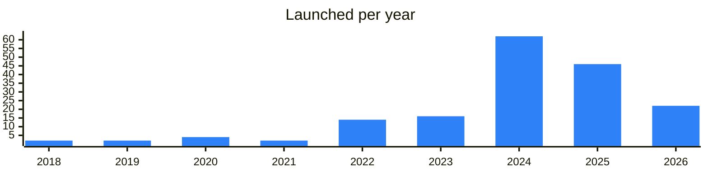
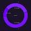
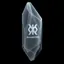
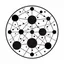

<!-- Generated by scripts/build_readme.py from data/. Do not edit by hand. -->

# Tools

**174 projects: 37 active, 137 quiet, 0 closed.** Back to [all categories](../README.md#categories); statuses are explained [here](../README.md#how-to-read-it). The same list as a [searchable table](../data/by-category/tools.csv).

## Active

Jump to [Giveaways and contests](#giveaways-and-contests), [Moderation and access](#moderation-and-access), [Media tools](#media-tools), [Utilities](#utilities), [Other](#other).

### Giveaways and contests

| # | Project | What it is | Links | Launched | Peak MAU | Verified |
| ---: | --- | --- | --- | --- | ---: | --- |
| 1 |  **Randomize Bot** | Giveaway bot for Telegram channels, with an instruction guide. | [Bot](https://t.me/randomized) | 2024-03-27 |  |  |
| 2 |  **RandomGodBot** | Open-source giveaway randomizer bot for Telegram, with a guide and news channel. | [Telegram](https://t.me/randomgod) [Bot](https://t.me/randomgodbot) | 2021-12-02 | 8.2M |  |
| 4 |  **Random Beast** | Giveaway bot for Telegram channels with subscription checks, bot protection and no ads. | [Telegram](https://t.me/randombeastnews) [Bot](https://t.me/randombeast_bot) | 2025-01-19 | 3.5M |  |
| 5 |  **Best Random Bot** | Contest bot for running giveaways in Telegram channels, with an instruction channel and support. | [Telegram](https://t.me/bestrandom_info) [Bot](https://t.me/bestrandom_bot) | 2023-04-01 | 2.9M |  |
| 8 |  **Fast Giveaways** | Bot for contests, lotteries and fast-click giveaways, with no ads and public statistics. | [Telegram](https://t.me/fgmonitoring) [Bot](https://t.me/fastgiveawaysbot) | 2025-04-21 | 488K |  |
| 11 |  **Tuberg** | Host bot for prize giveaways in Telegram channels. | [Telegram](https://t.me/tuberg_game) [Bot](https://t.me/millerenos_bot) | 2025-12-19 |  |  |
| 13 |  **Raffles by The Daily TON** | Your daily dose of TON news | [Telegram](https://t.me/thedailyton) [Bot](https://t.me/the_daily_bot) [X](https://x.com/the_daily_ton) [Gram News](https://gramnews.org/apps/the_daily_bot) | 2022-05-24 |  |  |
| 16 |  **Win Land** | Welcome to WinLand Where Luck Meets Victory Giveaways & Raffles | [Telegram](https://t.me/gifty_land) [Bot](https://t.me/winlandtelbot) | 2026-06-08 |  |  |
| 18 |  **Greats Gift** | Randomizer bot that runs giveaways in one click, with a support bot and news channel. | [Telegram](https://t.me/greatsgiftchannel) [Bot](https://t.me/rngenius_bot) | 2025-08-29 | 643K |  |
| 22 |  **Wheel Games** | Daily giveaways, raffles and mini-games | [Telegram](https://t.me/wheelgamesnews) [Bot](https://t.me/wheelgamesbot) | 2026-02-07 |  |  |
| 26 |  **Gifts Giveaway** | Launch Gifts Giveaway in Telegram! Send collectible gifts, auto-pick winners and grow your community | [Bot](https://t.me/giftaway) | 2025-06-13 |  |  |

### Moderation and access

| # | Project | What it is | Links | Launched | Peak MAU | Verified |
| ---: | --- | --- | --- | --- | ---: | --- |
| 9 |  **Safeguard** | The most extensive security and buy tracking platform on Telegram Powering Announcements | [Telegram](https://t.me/safeguard_ann) [Bot](https://t.me/safeguard) [Site](https://safeguard.run) | 2023-07-29 |  |  |
| 23 |  **Guardian** | An intelligent group management bot with portal, buy bot and AI features | [Telegram](https://t.me/guardiantrending) [Bot](https://t.me/mevfreeportalbot) | 2022-08-13 | 158K |  |

### Media tools

| # | Project | What it is | Links | Launched | Peak MAU | Verified |
| ---: | --- | --- | --- | --- | ---: | --- |
| 6 |  **Stickers Bot** | A bot for creating Telegram stickers and tracking their usage statistics | [Bot](https://t.me/stickers) [Gram News](https://gramnews.org/apps/stickers) | 2015-09-24 | 1M | since 2020-04 |

### Utilities

| # | Project | What it is | Links | Launched | Peak MAU | Verified |
| ---: | --- | --- | --- | --- | ---: | --- |
| 7 |  **LikeBot** | A cool bot to create posts with emoji-based like buttons | [Bot](https://t.me/like) [Gram News](https://gramnews.org/apps/like) | 2016-04-10 | 1.4M |  |
| 15 |  **VoteBot** | This bot will help you create polls and share them with friends | [Bot](https://t.me/vote) [Gram News](https://gramnews.org/apps/vote) | 2016-04-12 | 418K |  |
| 20 |  **iMe** | Telegram client with crypto wallet and AI | [Telegram](https://t.me/ime_ru) | 2020-04-26 |  |  |
| 28 |  **Crypto Office** | Crypto Office - Your helper in crypto world | [Telegram](https://t.me/officeappnews) [Bot](https://t.me/office_app_bot) | 2025-01-11 |  |  |
| 32 |  **FinTax** | FinTax offers crypto accounting suite, tax calculator and professional taxconsulting services | [Telegram](https://t.me/FinTax2023) [Bot](https://t.me/fintax_bot) [X](https://x.com/FinTax_Official) [Site](https://fintax.tech) [Gram News](https://gramnews.org/apps/fintax) | 2024-12-18 |  |  |
| 35 | **TONify** | TONify is a free, browser-based converter for TON addresses | [Site](https://alexmubarakshin.github.io/tonify/) [GitHub](https://github.com/AlexMubarakshin/tonify) | 2024-12-16 |  |  |

### Other

| # | Project | What it is | Links | Launched | Peak MAU | Verified |
| ---: | --- | --- | --- | --- | ---: | --- |
| 3 |  **XDAO** | Create DAOs. Co-own assets, formalize agreements, manage budgets and decisions. Join the | [Telegram](https://t.me/xdaoapp) [Bot](https://t.me/xdao_ton_bot) [Site](https://xdao.app) [GitHub](https://github.com/xdao-app) | 2024-08-15 |  | since 2025-08 |
| 10 |  **PR GRAM** | PR GRAM — a promotion platform for Telegram. Support | [Telegram](https://t.me/pr_gram_news) [Bot](https://t.me/gram_piarbot) | 2024-07-31 |  |  |
| 12 |  **Pikcher Gift** | Telegram gifts news and service | [Telegram](https://t.me/pikchergift) | 2025-06-30 |  |  |
| 14 |  **AdsGram** | Telegram-native advertising network for mini apps | [Telegram](https://t.me/adsgram_ai) [Bot](https://t.me/adsgram_reward_bot) [X](https://x.com/Adsgram_ai) [Site](https://adsgram.ai) | 2024-04-12 |  |  |
| 17 |  **Inside Ads** | Smart tool for growth and monetisation of Telegram channels. Attract subscribers and earn money on your channel | [Telegram](https://t.me/insideads_news) [Bot](https://t.me/insideads_bot) | 2024-12-30 |  |  |
| 19 |  **Peepo Stickers** | Sticker pack author channel | [Telegram](https://t.me/peepohd) | 2026-08-03 |  |  |
| 21 |  **Pynex** | Pynex Official Web3 Mini App & Community | [Bot](https://t.me/pynex_org_bot) | 2026-09-26 |  |  |
| 24 |  **Monetag** | Ad network for websites and Telegram Mini Apps | [Telegram](https://t.me/monetag) [Site](https://monetag.com) | 2025-07-03 |  |  |
| 25 |  **Ads Galaxy** | Ads Galaxy connects advertisers with Telegram channels to promote ads and help publishers earn effortlessly | [Bot](https://t.me/ads_galaxy_bot) | 2026-01-26 | 14K |  |
| 27 |  **Talents** | Decentralized freelance platform on TON | [Telegram](https://t.me/tontalents) | 2026-06-09 |  |  |
| 29 |  **AdsGram** | Native advertising system for Telegram mini apps | [Telegram](https://t.me/adsgram_ai_cis) [X](https://x.com/Adsgram_ai) [Site](https://adsgram.ai) | 2024-09-04 |  |  |
| 30 |  **Engage ADS** | Advertising campaigns that pay users in TON | [Telegram](https://t.me/engageads) [X](https://x.com/EngageADS) | 2024-06-02 |  |  |
| 31 |  **Underworld Tools** | Tools and projects for Telegram stickers and apps | [Telegram](https://t.me/underworld_dev) [Site](https://stickers.tools) | 2025-07-09 |  |  |
| 33 |  **Workzora** | Freelance platform where users find work or hire contractors, with a Ukrainian-language channel. | [Telegram](https://t.me/ofworkzora) | 2026-04-30 |  |  |
| 34 | **TON Box** |  | [Site](https://storage-two.vercel.app/) [Gram News](https://gramnews.org/apps/ton-box) | 2025-05-26 |  |  |
| 36 |  **Workix** | Workix — platform for finding and applying to freelance tasks | [Bot](https://t.me/workix_tbot) [Site](https://workix.co) [GitHub](https://github.com/facetoplace/Workix) [Gram News](https://gramnews.org/apps/workix) | 2024-01-02 |  |  |
| 37 |  **Teleport Gifts** | Telegram gifts service with a public channel. | [Telegram](https://t.me/teleportgifts) | 2025-07-03 |  |  |

<b>Quiet: 137</b>

| # | Project | What it is | Links | Launched | Peak MAU | Verified |
| ---: | --- | --- | --- | --- | ---: | --- |
| 38 |  **Music** | First music streaming service inside Telegram: read, chat, listen to music | [Telegram](https://t.me/tonmusiccommunity) [Bot](https://t.me/ton_music_bot) [X](https://x.com/ton_music_x) [Gram News](https://gramnews.org/apps/music) | 2021-11-09 | 42K |  |
| 39 |  **Ton Raffles Bot** | tonraffles.app — TON Ecosystem for everyone | [Telegram](https://t.me/tonraffles_ru) [Bot](https://t.me/tonraffle_bot) [Site](https://tonraffles.app) [GitHub](https://github.com/Ton-Raffles) [Gram News](https://gramnews.org/apps/ton-raffles-bot) | 2022-07-23 | 155K |  |
| 40 | **Time TON Ecosystem** |  | [Gram News](https://gramnews.org/apps/time-ton-ecosystem) | 2024-05-16 |  |  |
| 41 |  **Raffley** | Raffley is like the party planner of Telegram, where Raffles, Predictions and Community fun collide! | [Telegram](https://t.me/raffleychannel) [Bot](https://t.me/raffleybot) [Gram News](https://gramnews.org/apps/raffley) | 2024-05-25 | 115K |  |
| 42 |  **NUMA** |  | [Bot](https://t.me/numasocialbot) [X](https://x.com/NUMAsocial) [Gram News](https://gramnews.org/apps/numa) | 2024-10-25 | 288K |  |
| 43 |  **Magic Pot** | Bot for creating stashes with any tokens or distribution rules for friends to find. | [Telegram](https://t.me/magicpot_fam) [Bot](https://t.me/magic_pot_bot) [Site](https://magicpot.xyz) [Gram News](https://gramnews.org/apps/magic-pot) | 2024-06-19 | 11K |  |
| 44 |  **TrumPump SEASON I** |  | [Bot](https://t.me/trumpumpbot) [Gram News](https://gramnews.org/apps/trumpump-season-i) | 2024-08-29 | 125K |  |
| 45 |  **InOne** | – a convenient service for online booking and ticket sales in Telegram | [Telegram](https://t.me/inone_me) [Bot](https://t.me/inone_me_bot) [Site](https://inone.me/) [Gram News](https://gramnews.org/apps/inone) | 2023-10-04 | 57K |  |
| 46 |  **Slof** |  | [Bot](https://t.me/slofbot) [X](https://x.com/SlofBot) [Gram News](https://gramnews.org/apps/slof) | 2024-08-07 | 74K |  |
| 47 | **Bottle Up** |  | [Bot](https://t.me/bottleupmining_bot) [Gram News](https://gramnews.org/apps/bottle-up) | 2023-08-07 | 696K |  |
| 48 |  **Not Task** |  | [Telegram](https://t.me/tongiftsnews) [Bot](https://t.me/not_task_bot) [Gram News](https://gramnews.org/apps/not-task) | 2024-01-17 | 27K |  |
| 49 |  **Reputation Builder** |  | [Bot](https://t.me/reputationbuilderbot) [X](https://x.com/GalacticaNet) [Site](https://Galactica.com) [Gram News](https://gramnews.org/apps/reputation-builder) | 2024-06-11 | 333K |  |
| 50 |  **Hybrid Mini App** |  | [Bot](https://t.me/hybridminiappbot) [Gram News](https://gramnews.org/apps/hybrid-mini-app) | 2024-06-23 | 493K |  |
| 51 |  **Teletop** | Your all-in-one desktop for Telegram apps | [Bot](https://t.me/the_teletop_bot) [Gram News](https://gramnews.org/apps/teletop) | 2024-08-29 | 210K |  |
| 52 |  **Guardify AI** | AI-powered group manager with triggers, a virality plugin and a buying bot. | [Bot](https://t.me/guardifybot) [Gram News](https://gramnews.org/apps/guardify-ai) | 2024-02-29 | 4K |  |
| 53 |  **AvanGifts** | Contest bot by . Join, pass the tasks to win prizes! | [Bot](https://t.me/avangifts_bot) [X](https://x.com/avanchange) [Site](https://avangifts.com/) [Gram News](https://gramnews.org/apps/avangifts) | 2024-08-08 |  |  |
| 54 |  **MoneyTab** | Keep tabs on subscriptions and shared expenses | [Bot](https://t.me/moneytabbot) [Gram News](https://gramnews.org/apps/moneytab) | 2024-05-30 | 3K |  |
| 55 |  **Glow** | Become a part of the Secret Glow world | [Telegram](https://t.me/Glow_Stories) [Bot](https://t.me/secretglowbot) [X](https://x.com/Glow_Stories) Site (down) [Gram News](https://gramnews.org/apps/glow) | 2024-10-03 | 45K |  |
| 56 |  **TWITRIS** | TWITRIS — a Telegram mini app for handling NFT gifts | [Telegram](https://t.me/expert_tm) [Bot](https://t.me/twitris_bot) [Site](https://twitris.com) [Gram News](https://gramnews.org/apps/twitris) | 2019-06-07 |  |  |
| 57 |  **GVWS** | GVWS is an app for giveaways! | [Telegram](https://t.me/tecteam) [Bot](https://t.me/gvws_bot) [X](https://x.com/tecteam_) [Gram News](https://gramnews.org/apps/gvws) | 2023-12-17 | 65K |  |
| 58 |  **Web3 Jobs Bot** | Web3 Jobs Bot — tool for tracking Web3 job openings | [Bot](https://t.me/jobs_web3_bot) [X](https://x.com/xrayWeb3) [Site](https://web3jobs.online/) [Gram News](https://gramnews.org/apps/web3-jobs-bot) | 2024-11-18 | 651 |  |
| 59 |  **Crypto Trader's Calc** | Calculator for transaction risk, positions, profit, take-profit, stop-loss and Elliott waves. | [Telegram](https://t.me/C4B_Best_Telegram_Bots) [Bot](https://t.me/TradersCalculatorBot) [Gram News](https://gramnews.org/apps/crypto-trader-s-calc) | 2024-12-28 | 438 |  |
| 60 |  **Exchangel** | Calculate values of cryptocurrencies in multiple currencies | [Bot](https://t.me/exchangel_bot) [Gram News](https://gramnews.org/apps/exchangel) | 2022-01-18 | 87 |  |
| 61 |  **Game Cashback Calc** | Cashback calculator bot for games, published alongside other useful Telegram bots. | [Telegram](https://t.me/C4B_Best_Telegram_Bots) [Bot](https://t.me/CashbackGameBot) [Gram News](https://gramnews.org/apps/game-cashback-calc) | 2024-12-28 | 32 |  |
| 62 |  **2FA** | Two-Factor Authentication for TON | [Bot](https://t.me/tgmfabot) | 2026-08-01 |  | yes |
| 63 |  **Access** | Set up a custom access to your private group or channel. Built by independent devs as part of | [Bot](https://t.me/access_app_bot) | 2025-06-11 | 88K |  |
| 64 |  **Airbot** | Hello World, I’m Airbot If you’re finding massive Airdrops to join or you’re a Newbie who wants to enter Crypto Market | [Bot](https://t.me/AirbotCrypto_bot) [X](https://x.com/Airbot_x) Site (down) | 2024-11-20 |  |  |
| 65 |  **Allo Sticker Verify** | Bot to verify BAYC sticker pack ownership | [Bot](https://t.me/allosticker_bot) | 2026-05-14 |  |  |
| 66 |  **alpha Drop** | Discover verified crypto airdrops, token launches, and Web3 opportunities before they trend | [Bot](https://t.me/blombard_com_bot) | 2025-02-14 | 2M |  |
| 67 | **Auto Orbit** |  | [Gram News](https://gramnews.org/apps/auto-orbit) | 2024-12 |  |  |
| 68 |  **Based Tools** | Buy bot and tools community | [Telegram](https://t.me/thebasedtools) | 2025-03-28 |  |  |
| 69 |  **BeautyTON** | Booking platform and mini app builder for beauty professionals | [Bot](https://t.me/beautytonbot) | 2025-07-25 |  |  |
| 70 |  **BlockChecker** | Bot that checks gift crafting availability | [Bot](https://t.me/blockchecker_bot) | 2025-06-30 |  |  |
| 71 |  **Bravo Pro** | Interface to Bravo Ecosystem products | [Bot](https://t.me/bravoprobot) | 2026-01-21 |  |  |
| 72 | **Bulksender** |  | [Bot](https://t.me/bulksenderbot) | 2025-07 |  |  |
| 73 |  **ByteMe** | Discover your identity's value with zkHero while protecting your privacy | [Bot](https://t.me/byteme_zkme_bot) | 2025-01-08 |  |  |
| 74 |  **CoinFi** |  | [Bot](https://t.me/coin_fi_bot) | 2026-02-11 |  |  |
| 75 |  **Collab** | Ads marketplace for channel owners and advertisers | [Bot](https://t.me/collab_app_bot) | 2026-04-13 |  |  |
| 76 |  **Community** | Telegram-native toolset for communities | [Bot](https://t.me/community_bot) | 2023-08-17 | 15.7M | since 2024-09 |
| 77 |  **Contests** | Create, host and join contests; part of tools.tg | [Bot](https://t.me/contests_app_bot) [GitHub](https://github.com/OpenBuilders/contest-tool) | 2025-10-17 |  |  |
| 78 |  **Core** | Platform for crafting, splitting and tracking Telegram gifts | [Bot](https://t.me/core_fbot) | 2026-03-28 |  |  |
| 79 |  **DeJob** | Web3 and AI professional services and job platform with channels in Chinese, English and Korean. | [Telegram](https://t.me/dejob_official) | 2026-02-28 |  |  |
| 80 |  **Designers Bot** | Bot accepting UI layouts and animations to improve Telegram | [Bot](https://t.me/design_bot) | 2019-01-01 |  | since 2020-05 |
| 81 |  **Drops Bot** | Your ultimate tool for Crypto | [Bot](https://t.me/etherdrops4_bot) | 2024-09-24 |  |  |
| 82 |  **Drops Bot** | Your ultimate tool for Crypto | [Bot](https://t.me/etherdrops_bot) | 2023-01-29 |  |  |
| 83 |  **Easy Raffle** | Free giveaways with verifiable results in Telegram | [Bot](https://t.me/easy_raffle_official_bot) | 2026-07-18 |  |  |
| 84 |  **Emoji** | Telegram bot with crypto tools | [Bot](https://t.me/webemoji_bot) | 2024-11-13 | 277K |  |
| 85 |  **Empty Pepe Bot** | Service bot for sending and receiving gifts | [Bot](https://t.me/emptypeperobot) | 2025-04-11 |  |  |
| 86 |  **Find & Check** | Tool built on TON by the fck.team group. | [Bot](https://t.me/findcheckbot) | 2024-05-16 |  |  |
| 87 |  **Foldee** | App for saving links and notes into folders and setting reminders about them. | [Bot](https://t.me/foldee_bot) | 2025-07-20 |  |  |
| 88 |  **fStik** | Bot creating stickers and emoji from photos, videos and GIFs | [Bot](https://t.me/fstikbot) | 2023-04-22 |  |  |
| 89 |  **G-Bots** | Brand combining a mobile game, comics and an NFT collection, with a giveaway bot. | [Telegram](https://t.me/gbotston) [Bot](https://t.me/gbots_bot) [Site](https://getgems.io/collection/gbots) | 2022-01-23 |  |  |
| 90 |  **Get My ID** | Bot returning Telegram user IDs | [Bot](https://t.me/getmyid_bot) | 2024-03-20 | 254K |  |
| 91 |  **GetTON** | Service that lets you create custom wallet addresses ending with any 3–5 characters you choose | [Bot](https://t.me/gettonapp_bot) [Site](https://getton.app) | 2025-06 |  |  |
| 92 |  **Gift Labs** | Preview gift combinations and find gift owners | [Bot](https://t.me/giftlabs_bot) | 2025-09-18 |  |  |
| 93 |  **Giftify** | Telegram-native utilities and games platform | [Bot](https://t.me/giftify_nft_bot) | 2025-06-16 |  |  |
| 94 |  **GiftNow** | Bot for sending treasure box gifts | [Bot](https://t.me/getgiftnowbot) | 2024-10-29 |  |  |
| 95 |  **Give Me Total** | Bot for collective disputes on TON | [Bot](https://t.me/givemetotal_bot) | 2023-06-25 |  |  |
| 96 |  **Giveaway** | Create and join giveaways; part of tools.tg | [Bot](https://t.me/giveaway_app_bot) [GitHub](https://github.com/OpenBuilders/giveaway-tool-backend) | 2025-12-04 |  |  |
| 97 |  **GoldGift** | Telegram bot for sending gifts | [Bot](https://t.me/goldgift_robot) | 2025-12-09 |  |  |
| 98 |  **GramAds** | Advertising network that places ad impressions inside Telegram bots. | [Bot](https://t.me/gramadsrobot) | 2024-10-17 | 14K |  |
| 99 |  **Hashwall** | Bot for creating personal addresses | [Bot](https://t.me/hashwallapp_bot) | 2025-09-28 |  |  |
| 100 |  **HunterNetwork** | International Crypto Marketing Community | [Bot](https://t.me/hunternetwork_bot) |  |  |  |
| 101 |  **iMe** | Telegram client with crypto wallet and AI | [Telegram](https://t.me/ime_ai) | 2020-04-08 |  |  |
| 102 |  **Lambo Stickers** | Bot creating sticker packs with a connected wallet | [Bot](https://t.me/lambo_stickers_bot) | 2026-04-09 |  |  |
| 103 |  **LightDAO** | Bot for quickly creating DAO votings | [Bot](https://t.me/daolightbot) | 2024-08-18 |  |  |
| 104 |  **LinkRoad** | Web3-based ride-hailing service bot | [Bot](https://t.me/linkroad_bot) | 2025-06-25 |  |  |
| 105 |  **Manage Ton Subdomain** | Manage .ton subdomains directly in Telegram | [Bot](https://t.me/ton_subdomain_bot) [Site](https://subdomain.earnigram.com) [Gram News](https://gramnews.org/apps/manage-ton-subdomain) | 2024-06-15 |  |  |
| 106 | **massmint** | Bot for minting in bulk. | [Bot](https://t.me/massmintbot) | 2025-03-16 |  |  |
| 107 |  **Meta** | You are here to become a millionaire not just to win small amounts | [Bot](https://t.me/xtometabot) | 2024-11-18 | 387K |  |
| 108 |  **MoEditor** | Message editor with buttons, media and rich text | [Bot](https://t.me/moeditorbot) | 2024-04-03 |  |  |
| 109 |  **Monster Bot** | Services for NFT, channel and bot creators on TON | [Bot](https://t.me/toncoin_monster_bot) | 2022-04-06 |  |  |
| 110 |  **Multisender** | Multisender sends tokens and NFTs to multiple recipients in just three clicks | [Telegram](https://t.me/MultiSender) [Bot](https://t.me/MultisenderTONBot) [X](https://x.com/multi_sender) [Site](https://multisender.app/) [Gram News](https://gramnews.org/apps/multisender) | 2024-10-18 |  |  |
| 111 |  **My Gift Stickers** | Stickers showing current prices of your gifts | [Bot](https://t.me/giftstickersbot) | 2025-03-02 |  |  |
| 112 |  **NFT Access Guardian Bot** | NFT Access Guardian Bot: Verifies NFT ownership for exclusive chat access | [Bot](https://t.me/access_ton_control_bot) | 2023-08-26 |  |  |
| 113 |  **NFT AirDrop TON** | Bot for running NFT airdrops on TON | [Bot](https://t.me/nft_airdrop_ton_bot) | 2022-10-20 |  |  |
| 114 |  **NFT Collection Planner** | Mini app for experimenting with and designing collections of Telegram gifts. | [Telegram](https://t.me/giftconstructchannel) [Bot](https://t.me/giftconstruct_bot) | 2025-06-08 |  |  |
| 115 |  **Not Slava** | AIO bot with a range of tools, related to cryptocurrency, fiat currency, NFTs, and others CONTACT | [Bot](https://t.me/anything_notslava_bot) | 2025-12-01 |  |  |
| 116 |  **ONTON** | Event management and SBT solution on TON and Telegram | [Telegram](https://t.me/ontonsupport) | 2024-07-10 |  |  |
| 117 |  **Petition App** | Petition mini app powered by Notmeme | [Bot](https://t.me/petitionapp_bot) | 2024-04-29 |  |  |
| 118 |  **Posted** | Bot to create posts with custom emoji | [Bot](https://t.me/posted) | 2023-06-30 |  |  |
| 119 |  **QuestHub** | Collaboration platform bot for TON projects | [Telegram](https://t.me/brochat) | 2024-04-14 |  |  |
| 120 |  **re:doubt** |  | [Telegram](https://t.me/uShopWeb) Site (down) [GitHub](https://github.com/re-doubt) [Gram News](https://gramnews.org/apps/re-doubt) | 2022-12-05 |  |  |
| 121 |  **Readiculous** | Telegram bot with crypto tools | [Bot](https://t.me/readiculousbot) | 2025-01-09 | 200K |  |
| 122 |  **Referendum** | Mini app for creating and voting in referendums | [Bot](https://t.me/referendum_app_bot) | 2024-12-20 | 15K |  |
| 123 |  **RevYou** | Collect client reviews in one place you control. Own your data, earn rewards, be your own boss | [Telegram](https://t.me/revyou_announcements) [Bot](https://t.me/revyou_bot) [X](https://x.com/revyouxyz) Site (down) [Gram News](https://gramnews.org/apps/revyou) | 2024-08-20 |  |  |
| 124 |  **RIX** |  | [Bot](https://t.me/rixnet_bot) | 2025-12-05 |  |  |
| 125 |  **RunesTON** |  | [Bot](https://t.me/runestonbot) | 2024-06-01 |  |  |
| 126 |  **SMOFAST** | SMM promotion bot with TON integration | [Bot](https://t.me/smofastbot) | 2024-01-19 |  |  |
| 127 |  **SMOFAST** | SMM promotion bot with TON integration | [Bot](https://t.me/frontsellerbot) | 2024-01-19 |  |  |
| 128 |  **SMOFast** | SMM promotion bot with TON integration | [Bot](https://t.me/smofastbot_bot) | 2023-12-31 |  |  |
| 129 |  **Soap Ads** | Telegram channel advertising exchange | [Bot](https://t.me/soapadsbot) | 2026-01-30 |  |  |
| 130 |  **SpinMi** | Creating animated coin emojis in Telegram | [Telegram](https://t.me/spinminews) [Bot](https://t.me/spinmibot) [X](https://x.com/spinmibot) [Site](https://spinmi.xyz) [Gram News](https://gramnews.org/apps/spinmi) | 2025-11-10 | 721 |  |
| 131 |  **SplitFast** | SplitFast — a mini app for splitting expenses in Telegram | [Bot](https://t.me/SplitFastBot) [Site](https://splitfast.io) [Gram News](https://gramnews.org/apps/splitfast) | 2025-12-05 |  |  |
| 132 |  **Stepogram bot** | Stepogram bot is an app for tracking steps and nutrition | [Telegram](https://t.me/StepogramAdmin) [Bot](https://t.me/stepogrambot) [Site](https://Stepogram.com) [Gram News](https://gramnews.org/apps/stepogram-bot) | 2022-08-31 |  |  |
| 133 |  **StickerFace** | Press /start to create your personal Sticker Pack | [Bot](https://t.me/stickerfacebot) [Site](https://stickerface.io/) | 2018-06-06 |  |  |
| 134 |  **Sub&Invite** | Contest creator with invitations and tasks | [Bot](https://t.me/subinvitebot) | 2024-04-19 |  |  |
| 135 |  **T Card** | First job search app on Telegram! | [Bot](https://t.me/tcard_job_bot) [X](https://x.com/Tools_MiniApps) [Gram News](https://gramnews.org/apps/t-card) | 2024-06 |  |  |
| 136 |  **Telegram Jobs Bot** | Official Telegram bot for career opportunities at Telegram | [Bot](https://t.me/jobs_bot) | 2018-12-30 | 746K | since 2020-01 |
| 137 |  **Telegram Moments** | Bot for minting and verifying Telegram posts and messages | [Bot](https://t.me/tgmoments_bot) | 2023-11-23 | 27K |  |
| 138 |  **Teleport** | Service for raffles with Telegram gifts and NFTs | [Bot](https://t.me/teleport_gifts_bot) | 2025-06-30 | 44K |  |
| 139 |  **TheVapeLabs** | Our vision is to decentralize global nicotine data for health & research using vape tech, blockchain, & AI | [Bot](https://t.me/thevapelabs_bot) | 2024-11-02 | 557K |  |
| 140 |  **TokenBar** | I'm your Bartender - with a passion for crafting the finest crypto-infused cocktailsand chatting anything token | [Bot](https://t.me/tokenbar_bot) | 2024-10-28 | 213K |  |
| 141 |  **TON Agregator** | Bot that forwards messages from more than 150 TON crypto channels into one place. | [Telegram](https://t.me/parsertonnews) | 2024-06-05 |  |  |
| 142 |  **TON Bulksender** | Token bulk sender that distributes tokens to many addresses at once on TON. | [Telegram](https://t.me/bulksender) [X](https://x.com/TokenBulksender) [Site](https://ton.bulksender.app) [Gram News](https://gramnews.org/apps/ton-bulksender) | 2020-02-29 |  |  |
| 143 | **TON Byte** |  | [Site](https://tonbyte.com) [GitHub](https://github.com/tonbyte) [Gram News](https://gramnews.org/apps/ton-byte) | 2022-11-04 |  |  |
| 144 | **TON Domain Info bot** |  | [Gram News](https://gramnews.org/apps/ton-domain-info-bot) | 2022-12-27 |  |  |
| 145 |  **TON Domains Auction** | Automation bot for TON domain auctions | [Bot](https://t.me/autodomains_bot) | 2022-08-08 |  |  |
| 146 |  **TON Gifts Bot** | Bot for TON and Telegram gifts | [Bot](https://t.me/tongiftsbot) | 2022-03-24 |  |  |
| 147 |  **TON Sign** | Private document signing service that uses TON proofs. | [Telegram](https://t.me/tondocsign_bot) [Site](https://tonsign.com/privacy?lang=en) [Gram News](https://gramnews.org/apps/ton-sign) | 2026-05 |  |  |
| 148 |  **TonTickets** | Ticketing bot on TON with announcement and support channels. | [Bot](https://t.me/tontickbot) | 2025-02-07 |  |  |
| 149 |  **tPolls** | Bot for creating and joining polls on Telegram | [Bot](https://t.me/tpolls_official_bot) | 2025-07-25 |  |  |
| 150 |  **Tribe** | Platform for launching onchain communities and giveaways | [Bot](https://t.me/tribecommunitybot) | 2025-02-21 | 23K |  |
| 151 |  **TwitGram** | Alerts for tweets and profile changes in Telegram | [Bot](https://t.me/twitgram_robot) | 2025-11-17 |  |  |
| 152 |  **TylerExchange** | Reward coin exchange bot without contract fees | [Bot](https://t.me/tyler_exbot) | 2026-04-15 |  |  |
| 153 | **Vanity TON** |  | [Site](https://vanity.earnigram.com) [Gram News](https://gramnews.org/apps/vanity-ton) | 2025-02-18 |  |  |
| 154 |  **Verify Bot** | Bot for verifying Telegram channels, groups and bots | [Bot](https://t.me/verifybot) | 2020-04-02 | 30K | since 2020-04 |
| 155 |  **Wilds GiveAway** | Create & join giveaways instantly. Win TON, gifts & prizes. Fair draws, instant winners. Tap Start | [Bot](https://t.me/wildssquad_bot) | 2026-06-01 |  |  |
| 156 |  **WorkersTon** | Freelance task project on TON | [Bot](https://t.me/workerston_bot) | 2026-05-07 |  |  |
| 157 |  **WorkHub** | Platform for finding workers and orders for any kind of task. | [Telegram](https://t.me/workhub_official) [Bot](https://t.me/workhubapp_bot) | 2025-07-30 |  |  |
| 158 |  **Реклама NFT в Telegram** | У нас можно купить рекламу в канал «Парадная NFT» . Быстро, удобно, безопасно | [Telegram](https://t.me/frontnft) [Bot](https://t.me/frontnftbot) [X](https://x.com/smmpanelru) [Gram News](https://gramnews.org/apps/reklama-nft-v-telegram) | 2026-06-03 |  |  |
| 159 |  **TON Raffles (RAFF)** | Token of an ecosystem for on-chain raffles with an app, bot and support bot. | [Telegram](https://t.me/tonraffles_en) [X](https://x.com/TonRaffles) [Site](https://tonraffles.app) [GitHub](https://github.com/Ton-Raffles) | 2023-12-01 |  |  |
| 160 |  **TON Jobs** | Channel where TON projects post vacancies | [Telegram](https://t.me/tonhunt) | 2022-04-15 |  |  |
| 161 |  **Hubz Chat** | Hubz Chat — a chat bot for verifying members by wallets and NFTs | [Telegram](https://t.me/Hubz_News) [Bot](https://t.me/hubz_app_bot) [X](https://x.com/hubz_chat) [Site](https://hubz.io/) [Gram News](https://gramnews.org/apps/hubz-chat) | 2024-04-26 |  |  |
| 162 |  **Roko** | Roko bot announcements channel | [Telegram](https://t.me/joinroko) | 2025-01-29 |  |  |
| 163 |  **TOOLBOX** | Mini app for joining decentralized trading pools | [Telegram](https://t.me/toolboxton) [X](https://x.com/Toolboxton) [Site](https://toolboxton.com) | 2025-03-11 |  |  |
| 164 |  **OpenAD** | Advertising protocol on TON | [Telegram](https://t.me/openad_protocol) [X](https://x.com/OpenAD_Protocol) [Site](https://openad.network) | 2024-09-27 |  |  |
| 165 |  **ONTON** | Event management and SBT solution on TON | [Telegram](https://t.me/ontonlive) [X](https://x.com/ontonbot) [Site](https://onton.live) | 2024-09-22 |  |  |
| 166 |  **Bagel Finance** | Game and DeFi app with smart portfolio on TON | [Telegram](https://t.me/bagel_finance) [X](https://x.com/bagel_fi_ton) | 2024-12-02 |  |  |
| 167 |  **EZY TON** |  | [Telegram](https://t.me/ezyton) [Site](https://ezyton.com/) [Gram News](https://gramnews.org/apps/ezy-ton) | 2024-06-20 |  |  |
| 168 |  **Ton 4 Joy** | Contest service built on TON, with a channel and an admin contact. | [Telegram](https://t.me/ton4joy) | 2025-02-05 |  |  |
| 169 |  **Gifties** | Digital gifts mini app | [Telegram](https://t.me/gifties_tg) | 2024-12-24 |  |  |
| 170 |  **Erzy Channel Collab** | Service that helps Telegram channel admins run cross promotions with other channels. | [Telegram](https://t.me/raskrutichannel) [Bot](https://t.me/ErzyNetWebBot) [Site](https://erzy.net/) [Gram News](https://gramnews.org/apps/erzy-channel-collab) | 2023-02-04 |  |  |
| 171 |  **Oneclicksender** | Tool for sending tokens to many recipients at once on TON. | [Telegram](https://t.me/OneClickSender) [X](https://x.com/Oneclicksender) [Site](https://ton.oneclicksender.com/) [Gram News](https://gramnews.org/apps/oneclicksender) | 2024-02-27 |  |  |
| 172 |  **MythNum** | How beautiful and perfect your ID is Let MythNum help you find out! | [Telegram](https://t.me/myth_num) [Bot](https://t.me/myth_num_bot) [X](https://x.com/myth_num) [Site](https://mythnum.one/) | 2024-09-20 |  |  |
| 173 |  **TONLancer** | Freelance marketplace project with LCR token | [Telegram](https://t.me/ton_lancer) | 2024-04-10 |  |  |
| 174 |  **Decibling Lite** | Decibling is a Web3 platform with philosophy of Earning Return (payment interest) while listening to music and also a marketplace for trading works of art in NFT format | [Telegram](https://t.me/decibling) [Bot](https://t.me/decibling_lite_bot) [X](https://x.com/decibling) [Site](https://decibling.com) [GitHub](https://github.com/decibling) [Gram News](https://gramnews.org/apps/decibling-lite) | 2023-03-23 |  |  |

