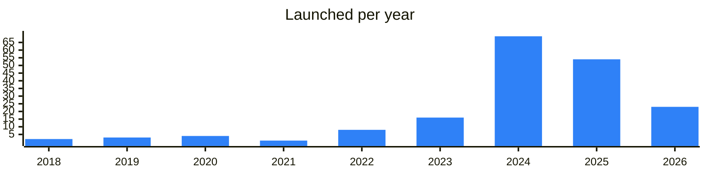

<!-- Generated by scripts/build_readme.py from data/. Do not edit by hand. -->

# Tools

**184 projects: 35 active, 147 quiet, 2 closed.** Back to [all categories](../README.md#categories); statuses are explained [here](../README.md#how-to-read-it). The same list as a [searchable table](../data/by-category/tools.csv).

## Active

| # | Project | What it is | Links | Launched | Peak MAU | Verified |
| ---: | --- | --- | --- | --- | ---: | --- |
| 1 | **Randomize Bot** | Конкурсный бот телеграм. Инструкция | [Bot](https://t.me/randomized) | 2024-03-27 |  |  |
| 2 | **RandomGodBot** | Руководство - Открытый код - Канал бота | [Telegram](https://t.me/randomgod) [Bot](https://t.me/randomgodbot) | 2021-12-02 | 8.2M |  |
| 3 | **XDAO** | Create DAOs. Co-own assets, formalize agreements, manage budgets and decisions. Join the | [Telegram](https://t.me/xdaoapp) [Bot](https://t.me/xdao_ton_bot) [Site](https://xdao.app) [GitHub](https://github.com/xdao-app) | 2024-08-15 |  | since 2025-08 |
| 4 | **Random Beast** | Розыгрыши в Telegram с проверкой подписки, защитой от ботов и без рекламы | [Telegram](https://t.me/randombeastnews) [Bot](https://t.me/randombeast_bot) | 2025-01-19 | 3.5M |  |
| 5 | **Best Random Bot** | Канал и инструкция: Служба поддержки | [Telegram](https://t.me/bestrandom_info) [Bot](https://t.me/bestrandom_bot) | 2023-04-01 | 2.9M |  |
| 6 | **Stickers Bot** | A bot for creating Telegram stickers and tracking their usage statistics | [Bot](https://t.me/stickers) [Gram News](https://gramnews.org/apps/stickers) | 2015-09-24 | 1M | since 2020-04 |
| 7 | **Safeguard** | The most extensive security and buy tracking platform on Telegram Powering Announcements | [Telegram](https://t.me/safeguard_ann) [Bot](https://t.me/safeguard) [Site](https://safeguard.run) | 2023-07-29 |  |  |
| 8 | **PR GRAM** | PR GRAM — a promotion platform for Telegram. Support | [Telegram](https://t.me/pr_gram_news) [Bot](https://t.me/gram_piarbot) | 2024-07-31 |  |  |
| 9 | **Tuberg** | Бот-ведущий для розыгрыша призов По всем вопросам | [Telegram](https://t.me/tuberg_game) [Bot](https://t.me/millerenos_bot) | 2025-12-19 |  |  |
| 10 | **Pikcher Gift** | Telegram gifts news and service | [Telegram](https://t.me/pikchergift) | 2025-06-30 |  |  |
| 11 | **AdsGram** | Telegram-native advertising network for mini apps | [Telegram](https://t.me/adsgram_ai) [Bot](https://t.me/adsgram_reward_bot) [X](https://x.com/Adsgram_ai) [Site](https://adsgram.ai) | 2024-04-12 |  |  |
| 12 | **VoteBot** | This bot will help you create polls and share them with friends | [Bot](https://t.me/vote) [Gram News](https://gramnews.org/apps/vote) | 2016-04-12 | 418K |  |
| 13 | **DegenPhone** | Anonymous NFT phone numbers sold via a Telegram mini app | [Telegram](https://t.me/degenphone) [Bot](https://t.me/degenphonetonbot) [X](https://x.com/degenphone) [Site](https://degenphone.xyz) | 2025-06-11 | 41K |  |
| 14 | **Peepo Stickers** | Sticker pack author channel | [Telegram](https://t.me/peepohd) | 2026-08-03 |  |  |
| 15 | **Pixlands** | Pixlands is a utility for asset management | [Telegram](https://t.me/pixlands) [Bot](https://t.me/pixlandsbot) [Gram News](https://gramnews.org/apps/pixlands) | 2026-03-19 | 32K |  |
| 16 | **Telegram Apps Center** | Catalog of TON and Telegram apps from third-party developers | [Telegram](https://t.me/tapps_official) [Bot](https://t.me/tapps_bot) [Gram News](https://gramnews.org/apps/telegram-apps-center) | 2020-05-06 | 7.8M | since 2024-09 |
| 17 | **iMe** | Telegram client with crypto wallet and AI | [Telegram](https://t.me/ime_ru) | 2020-04-26 |  |  |
| 18 | **Pynex** | Pynex Official Web3 Mini App & Community | [Bot](https://t.me/pynex_org_bot) | 2026-09-26 |  |  |
| 19 | **Wheel Games** | Daily giveaways, raffles and mini-games | [Telegram](https://t.me/wheelgamesnews) [Bot](https://t.me/wheelgamesbot) | 2026-02-07 |  |  |
| 20 | **PandaFiT** | PandaFiT is a unique Mini App where players collect, upgrade, and own unique collectible attributes in a Web3 ecosystem | [Telegram](https://t.me/pandafit_official) [Bot](https://t.me/pandafit_bot) [Gram News](https://gramnews.org/apps/pandafit) | 2025-02-07 |  |  |
| 21 | **Monetag** | Ad network for websites and Telegram Mini Apps | [Telegram](https://t.me/monetag) [Site](https://monetag.com) | 2025-07-03 |  |  |
| 22 | **Guarant** | Make your transactions without any problems! | [Telegram](https://t.me/guarantappen) [Bot](https://t.me/GuarantAppBot) [X](https://x.com/GuarantApp) [Gram News](https://gramnews.org/apps/guarant) | 2024-08-10 |  |  |
| 23 | **Talents** | Decentralized freelance platform on TON | [Telegram](https://t.me/tontalents) | 2026-06-09 |  |  |
| 24 | **Crypto Office** | Crypto Office - Your helper in crypto world | [Telegram](https://t.me/officeappnews) [Bot](https://t.me/office_app_bot) | 2025-01-11 |  |  |
| 25 | **AdsGram** | Native advertising system for Telegram mini apps | [Telegram](https://t.me/adsgram_ai_cis) [X](https://x.com/Adsgram_ai) [Site](https://adsgram.ai) | 2024-09-04 |  |  |
| 26 | **Engage ADS** | Advertising campaigns that pay users in TON | [Telegram](https://t.me/engageads) [X](https://x.com/EngageADS) | 2024-06-02 |  |  |
| 27 | **webappz** | webappz авто-магазины/меню в telegram | [Telegram](https://t.me/webappz) [Bot](https://t.me/webappzconnectbot) [Site](https://webappz.org) [Gram News](https://gramnews.org/apps/webappz) | 2023-07-28 |  |  |
| 28 | **Underworld Tools** | Tools and projects for Telegram stickers and apps | [Telegram](https://t.me/underworld_dev) [Site](https://stickers.tools) | 2025-07-09 |  |  |
| 29 | **SOREN** | SOREN is a digital identity layer on the TON blockchain | [Telegram](https://t.me/SORENCHANNEL) [X](https://x.com/ownsoren) [Site](https://www.soren.today/) [Gram News](https://gramnews.org/apps/soren) | 2025-06-10 |  |  |
| 30 | **Workzora** | Freelance platform | [Telegram](https://t.me/ofworkzora) | 2026-04-30 |  |  |
| 31 | **NovaCont Lite** | NovaCont Lite is a non-custodial escrow Mini App on TON | [Bot](https://t.me/NovaCont_Lite_bot) [X](https://x.com/getnovacont) [Site](https://novacont.tech) [GitHub](https://github.com/nova-cyber-and-technology/novacont-lite) | 2026-07-23 |  |  |
| 32 | **TON Box** |  | [Site](https://storage-two.vercel.app/) [GitHub](https://github.com/tonwhales) [Gram News](https://gramnews.org/apps/ton-box) | 2025-05-26 |  |  |
| 33 | **Workix** | Workix — platform for finding and applying to freelance tasks | [Bot](https://t.me/workix_tbot) [Site](https://workix.co) [GitHub](https://github.com/facetoplace/Workix) [Gram News](https://gramnews.org/apps/workix) | 2024-01-02 |  |  |
| 34 | **Teleport Gifts** | Telegram gifts service | [Telegram](https://t.me/teleportgifts) | 2025-07-03 |  |  |
| 35 | **Portal Network** | Portal Network — a bot for managing a network of electric vehicle charging stations | [Telegram](https://t.me/portal_energy) [Bot](https://t.me/portal_network_bot) [X](https://x.com/PortalNetwork_) [Site](https://portalnetwork.tech) [Gram News](https://gramnews.org/apps/portal-network) | 2024-09-24 |  |  |

<b>Quiet: 147</b>

| # | Project | What it is | Links | Launched | Peak MAU | Verified |
| ---: | --- | --- | --- | --- | ---: | --- |
| 36 | **GMCoin** |  | [Telegram](https://t.me/GMCoinChannel) [Bot](https://t.me/thegmcoinbot) [Gram News](https://gramnews.org/apps/gmcoin) | 2024-06-28 |  |  |
| 37 | **Nundu** |  | [Telegram](https://t.me/nunducrypto) [Bot](https://t.me/nunducryptobot) [Gram News](https://gramnews.org/apps/nundu) | 2024-12-12 | 43K |  |
| 39 | **BRN Tap** | Complete simple tasks and tap the Dragon! Convert the points you earn into $BRN. That's it | [Bot](https://t.me/brntap_bot) [Gram News](https://gramnews.org/apps/brn-tap) | 2024-08-22 | 271K |  |
| 40 | **NUMA** |  | [Bot](https://t.me/numasocialbot) [X](https://x.com/NUMAsocial) [Gram News](https://gramnews.org/apps/numa) | 2024-10-25 | 288K |  |
| 41 | **TrumPump SEASON I** |  | [Bot](https://t.me/trumpumpbot) [Gram News](https://gramnews.org/apps/trumpump-season-i) | 2024-08-29 | 125K |  |
| 42 | **InOne** | – a convenient service for online booking and ticket sales in Telegram | [Telegram](https://t.me/inone_me) [Bot](https://t.me/inone_me_bot) [Site](https://inone.me/) [Gram News](https://gramnews.org/apps/inone) | 2023-10-04 | 57K |  |
| 43 | **Slof** |  | [Bot](https://t.me/slofbot) [X](https://x.com/SlofBot) [Gram News](https://gramnews.org/apps/slof) | 2024-08-07 | 74K |  |
| 44 | **Bottle Up** |  | [Bot](https://t.me/bottleupmining_bot) [X](https://x.com/Athene_Network) [Gram News](https://gramnews.org/apps/bottle-up) | 2023-08-07 | 696K |  |
| 45 | **Farty Bot** | Den for beras to fart and chill | [Telegram](https://t.me/fartyfam) [Bot](https://t.me/fartyberabot) [X](https://x.com/fartybera) [Gram News](https://gramnews.org/apps/farty-bot) | 2024-06-06 | 173K |  |
| 46 | **Not Task** |  | [Telegram](https://t.me/tongiftsnews) [Bot](https://t.me/not_task_bot) [Gram News](https://gramnews.org/apps/not-task) | 2024-01-17 | 27K |  |
| 47 | **Reputation Builder** |  | [Bot](https://t.me/reputationbuilderbot) [X](https://x.com/GalacticaNet) [Site](https://Galactica.com) [Gram News](https://gramnews.org/apps/reputation-builder) | 2024-06-11 | 333K |  |
| 48 | **Hybrid Mini App** |  | [Bot](https://t.me/hybridminiappbot) [Gram News](https://gramnews.org/apps/hybrid-mini-app) | 2024-06-23 | 493K |  |
| 49 | **Mole** | Dig for wealth! Upgrade pickaxes, enhance your mole, and discover treasures | [Bot](https://t.me/tonmole_bot) [X](https://x.com/Ton_mole) Site (down) [Gram News](https://gramnews.org/apps/mole) | 2024-06-11 | 6.6M |  |
| 50 | **Teletop** | Your all-in-one desktop for Telegram apps | [Bot](https://t.me/the_teletop_bot) [Gram News](https://gramnews.org/apps/teletop) | 2024-08-29 | 210K |  |
| 51 | **CallFluent** | CallFluent is poised to transform business communications through advanced AI-driven phone agents powered by blockchain technology | [Telegram](https://t.me/callfluentai) [Bot](https://t.me/callfluent_bot) [X](https://x.com/callfluentai) [Gram News](https://gramnews.org/apps/callfluent) | 2024-06-24 | 1.4M |  |
| 52 | **GoldVerseBot** | The largest MEME ecosystem launchpad infrastructure on TON | [Bot](https://t.me/goldversebot) [Gram News](https://gramnews.org/apps/goldversebot) | 2024-06-23 | 912K |  |
| 53 | **Pell Gem** |  | [Telegram](https://t.me/gemcoinapp) [Bot](https://t.me/gemcoinapp_bot) [Gram News](https://gramnews.org/apps/pell-gem) | 2024-06-27 | 188K |  |
| 54 | **Guardify AI** | AI-powered Group Manager | [Bot](https://t.me/guardifybot) [Gram News](https://gramnews.org/apps/guardify-ai) | 2024-02-29 | 4K |  |
| 55 | **Glow** | Become a part of the Secret Glow world | [Telegram](https://t.me/Glow_Stories) [Bot](https://t.me/secretglowbot) [X](https://x.com/Glow_Stories) Site (down) [Gram News](https://gramnews.org/apps/glow) | 2024-10-03 | 45K |  |
| 56 | **TWITRIS** | TWITRIS — a Telegram mini app for handling NFT gifts | [Telegram](https://t.me/expert_tm) [Bot](https://t.me/twitris_bot) [Site](https://twitris.com) [Gram News](https://gramnews.org/apps/twitris) | 2019-06-07 |  |  |
| 57 | **Ghost Drive App** | Join the GhostDrive Data Guardians in mining the Web3 space for profit! Participate in our exclusive airdrop event | [Bot](https://t.me/ghostdrive_bot) [Gram News](https://gramnews.org/apps/ghost-drive-app) | 2024-06-30 |  |  |
| 58 | **Web3 Jobs Bot** | Web3 Jobs Bot — tool for tracking Web3 job openings | [Bot](https://t.me/jobs_web3_bot) [X](https://x.com/xrayWeb3) [Site](https://web3jobs.online/) [Gram News](https://gramnews.org/apps/web3-jobs-bot) | 2024-11-18 | 651 |  |
| 59 | **degenerative** | A Telegram bot agent with autonomous operation on TON | [Telegram](https://t.me/degenerativespace) [Bot](https://t.me/degenerativespacebot) [X](https://x.com/degespace) [Site](https://degenerative.space) [Gram News](https://gramnews.org/apps/degenerative) | 2024-04-10 |  |  |
| 60 | **Crypto Trader's Calc** |  | [Telegram](https://t.me/C4B_Best_Telegram_Bots) [Bot](https://t.me/TradersCalculatorBot) [Gram News](https://gramnews.org/apps/crypto-trader-s-calc) | 2024-12-28 | 438 |  |
| 61 | **Game Cashback Calc** |  | [Telegram](https://t.me/C4B_Best_Telegram_Bots) [Bot](https://t.me/CashbackGameBot) [Gram News](https://gramnews.org/apps/game-cashback-calc) | 2024-12-28 | 32 |  |
| 62 | **2FA** | Two-Factor Authentication for TON | [Bot](https://t.me/tgmfabot) | 2026-08-01 |  | yes |
| 63 | **Access** | Set up a custom access to your private group or channel. Built by independent devs as part of | [Bot](https://t.me/access_app_bot) | 2025-06-11 | 88K |  |
| 64 | **AdBuy** |  | [Telegram](https://t.me/Crypton_Deploys) [Gram News](https://gramnews.org/apps/adbuy) | 2024-01-08 |  |  |
| 65 | **alpha Drop** | Discover verified crypto airdrops, token launches, and Web3 opportunities before they trend | [Bot](https://t.me/blombard_com_bot) | 2025-02-14 | 2M |  |
| 67 | **Autobuy** |  | [Bot](https://t.me/automirrorbot) | 2025-06-04 |  |  |
| 68 | **Autobuy** | Bot for automatic purchase of Telegram gifts | [Bot](https://t.me/autogiftrobot) | 2025-04-15 |  |  |
| 69 | **Autogifts** | Mini app that tracks and auto-buys new Telegram gifts | [Bot](https://t.me/autogifts_official_bot) | 2025-04-08 | 20K |  |
| 70 | **Based Tools** | Buy bot and tools community | [Telegram](https://t.me/thebasedtools) | 2025-03-28 |  |  |
| 71 | **BeautyTON** | Booking platform and mini app builder for beauty professionals | [Bot](https://t.me/beautytonbot) | 2025-07-25 |  |  |
| 72 | **BlockChecker** | Bot that checks gift crafting availability | [Bot](https://t.me/blockchecker_bot) | 2025-06-30 |  |  |
| 73 | **Bravo Pro** | Interface to Bravo Ecosystem products | [Bot](https://t.me/bravoprobot) | 2026-01-21 |  |  |
| 74 | **Bulksender** |  | [Bot](https://t.me/bulksenderbot) | 2025-07 |  |  |
| 75 | **ByteMe** | Discover your identity's value with zkHero while protecting your privacy | [Bot](https://t.me/byteme_zkme_bot) | 2025-01-08 |  |  |
| 76 | **Check My Gifts** | Bot to analyze and track Telegram gift portfolios | [Bot](https://t.me/checkmygifts_bot) | 2023-05-07 |  |  |
| 77 | **CoinFi** |  | [Bot](https://t.me/coin_fi_bot) | 2026-02-11 |  |  |
| 78 | **Collab** | Ads marketplace for channel owners and advertisers | [Bot](https://t.me/collab_app_bot) | 2026-04-13 |  |  |
| 79 | **Contests** | Create, host and join contests; part of tools.tg | [Bot](https://t.me/contests_app_bot) [GitHub](https://github.com/OpenBuilders/contest-tool) | 2025-10-17 |  |  |
| 80 | **Core** | Platform for crafting, splitting and tracking Telegram gifts | [Bot](https://t.me/core_fbot) | 2026-03-28 |  |  |
| 81 | **DeJob** | DeJob｜Web3 & AI 专业服务平台 62K+用户 · 1,890+ Web3企业 dejob.ai 中文 English Kor | [Telegram](https://t.me/dejob_official) | 2026-02-28 |  |  |
| 82 | **Designers Bot** | Bot accepting UI layouts and animations to improve Telegram | [Bot](https://t.me/design_bot) | 2019-01-01 |  | since 2020-05 |
| 83 | **DEX Fund** | Community DEX fundraising on TON | [Bot](https://t.me/dexfundbot) | 2026-06-12 |  |  |
| 84 | **Drops Bot** | Your ultimate tool for Crypto | [Bot](https://t.me/etherdrops4_bot) | 2024-09-24 |  |  |
| 85 | **Drops Bot** | Your ultimate tool for Crypto | [Bot](https://t.me/etherdrops_bot) | 2023-01-29 |  |  |
| 86 | **Easy Raffle** | Free giveaways with verifiable results in Telegram | [Bot](https://t.me/easy_raffle_official_bot) | 2026-07-18 |  |  |
| 87 | **Emoji** | Telegram bot with crypto tools | [Bot](https://t.me/webemoji_bot) | 2024-11-13 | 277K |  |
| 88 | **Empty Pepe Bot** | Service bot for sending and receiving gifts | [Bot](https://t.me/emptypeperobot) | 2025-04-11 |  |  |
| 89 | **Exact Receipt** | Exact Receipt is a TON-native, watch-only payment request and receipt service | [Telegram](https://t.me/exactreceipt) [Bot](https://t.me/WDK_Wallet_bot) [Site](https://exactreceipt.com/) | 2026-05 |  |  |
| 90 | **Eye of Gifts** | Bot that finds Telegram gifts by chosen parameters | [Bot](https://t.me/eyeofgifts_bot) | 2025-03-02 |  |  |
| 91 | **Find & Check** |  | [Bot](https://t.me/findcheckbot) | 2024-05-16 |  |  |
| 92 | **Foldee** | Foldee — приложение, где можно сохранять ссылки, заметки по папкам и устанавливать напоминания о них | [Bot](https://t.me/foldee_bot) | 2025-07-20 |  |  |
| 93 | **fStik** | Bot creating stickers and emoji from photos, videos and GIFs | [Bot](https://t.me/fstikbot) | 2023-04-22 |  |  |
| 94 | **Get My ID** | Bot returning Telegram user IDs | [Bot](https://t.me/getmyid_bot) | 2024-03-20 | 254K |  |
| 95 | **Gift Alert Bot** | Notifications about Telegram gifts | [Bot](https://t.me/nftgiftalertbot) | 2025-01-29 |  |  |
| 96 | **Gift Caller** | Bot that calls when new Telegram gifts are released | [Bot](https://t.me/giftscallbot) | 2025-07-25 |  |  |
| 97 | **Gift Labs** | Preview gift combinations and find gift owners | [Bot](https://t.me/giftlabs_bot) | 2025-09-18 |  |  |
| 98 | **Giftify** | Telegram-native utilities and games platform | [Bot](https://t.me/giftify_nft_bot) | 2025-06-16 |  |  |
| 99 | **GiftNow** | Bot for sending treasure box gifts | [Bot](https://t.me/getgiftnowbot) | 2024-10-29 |  |  |
| 100 | **Give Me Total** | Bot for collective disputes on TON | [Bot](https://t.me/givemetotal_bot) | 2023-06-25 |  |  |
| 101 | **Giveaway** | Create and join giveaways; part of tools.tg | [Bot](https://t.me/giveaway_app_bot) [GitHub](https://github.com/OpenBuilders/giveaway-tool-backend) | 2025-12-04 |  |  |
| 102 | **GoldGift** | Telegram bot for sending gifts | [Bot](https://t.me/goldgift_robot) | 2025-12-09 |  |  |
| 103 | **GramAds** | Ads inside Telegram bots | [Bot](https://t.me/gramadsrobot) | 2024-10-17 | 14K |  |
| 104 | **Hashwall** | Bot for creating personal addresses | [Bot](https://t.me/hashwallapp_bot) | 2025-09-28 |  |  |
| 105 | **HunterNetwork** | International Crypto Marketing Community | [Bot](https://t.me/hunternetwork_bot) |  |  |  |
| 106 | **iMe** | Telegram client with crypto wallet and AI | [Telegram](https://t.me/ime_ai) | 2020-04-08 |  |  |
| 107 | **Lambo Stickers** | Bot creating sticker packs with a connected wallet | [Bot](https://t.me/lambo_stickers_bot) | 2026-04-09 |  |  |
| 108 | **LightDAO** | Bot for quickly creating DAO votings | [Bot](https://t.me/daolightbot) | 2024-08-18 |  |  |
| 109 | **LinkRoad** | Web3-based ride-hailing service bot | [Bot](https://t.me/linkroad_bot) | 2025-06-25 |  |  |
| 110 | **Manage Ton Subdomain** | Manage .ton subdomains directly in Telegram | [Bot](https://t.me/ton_subdomain_bot) [Site](https://subdomain.earnigram.com) [Gram News](https://gramnews.org/apps/manage-ton-subdomain) | 2024-06-15 |  |  |
| 111 | **massmint** | Bot for minting in bulk | [Bot](https://t.me/massmintbot) | 2025-03-16 |  |  |
| 112 | **Meta** | You are here to become a millionaire not just to win small amounts | [Bot](https://t.me/xtometabot) | 2024-11-18 | 387K |  |
| 113 | **MoEditor** | Message editor with buttons, media and rich text | [Bot](https://t.me/moeditorbot) | 2024-04-03 |  |  |
| 114 | **Monster Bot** | Services for NFT, channel and bot creators on TON | [Bot](https://t.me/toncoin_monster_bot) | 2022-04-06 |  |  |
| 115 | **My Gift Stickers** | Stickers showing current prices of your gifts | [Bot](https://t.me/giftstickersbot) | 2025-03-02 |  |  |
| 116 | **NFT AirDrop TON** | Bot for running NFT airdrops on TON | [Bot](https://t.me/nft_airdrop_ton_bot) | 2022-10-20 |  |  |
| 117 | **Not Slava** | AIO bot with a range of tools, related to cryptocurrency, fiat currency, NFTs, and others CONTACT | [Bot](https://t.me/anything_notslava_bot) | 2025-12-01 |  |  |
| 118 | **ONTON** | Event management and SBT solution on TON and Telegram | [Telegram](https://t.me/ontonsupport) | 2024-07-10 |  |  |
| 119 | **Open Guarantor** | Escrow guarantor bot, moved to a new bot | [Bot](https://t.me/negarant_bot) | 2025-10-31 |  |  |
| 120 | **Petition App** | Petition mini app powered by Notmeme | [Bot](https://t.me/petitionapp_bot) | 2024-04-29 |  |  |
| 121 | **Ping** | Bot that tracks gift markets and sends notifications | [Bot](https://t.me/giftsnotificationrobot) | 2025-06-30 |  |  |
| 122 | **Posted** | Bot to create posts with custom emoji | [Bot](https://t.me/posted) | 2023-06-30 |  |  |
| 123 | **Predicta** | Prediction market in Telegram for the CIS | [Bot](https://t.me/predicta_market_bot) | 2025-02-27 | 98K |  |
| 124 | **QuestHub** | Collaboration platform bot for TON projects | [Telegram](https://t.me/brochat) | 2024-04-14 |  |  |
| 125 | **Readiculous** | Telegram bot with crypto tools | [Bot](https://t.me/readiculousbot) | 2025-01-09 | 200K |  |
| 126 | **Referendum** | Mini app for creating and voting in referendums | [Bot](https://t.me/referendum_app_bot) | 2024-12-20 | 15K |  |
| 127 | **Rent-a-Name** | Service for renting Telegram usernames | [Bot](https://t.me/rentanamebot) | 2023-04-27 |  |  |
| 128 | **RevYou** | Collect client reviews in one place you control. Own your data, earn rewards, be your own boss | [Telegram](https://t.me/revyou_announcements) [Bot](https://t.me/revyou_bot) [X](https://x.com/revyouxyz) Site (down) [Gram News](https://gramnews.org/apps/revyou) | 2024-08-20 |  |  |
| 129 | **RIX** |  | [Bot](https://t.me/rixnet_bot) | 2025-12-05 |  |  |
| 130 | **RunesTON** |  | [Bot](https://t.me/runestonbot) | 2024-06-01 |  |  |
| 131 | **RUTON Checker** | TON token scanner for honeypots and fake revokes | [Bot](https://t.me/ruton_checker_bot) | 2024-11-29 |  |  |
| 132 | **Scam Check** | Bot checking Telegram accounts against a scammer base | [Bot](https://t.me/scamcheck_robot) | 2025-01-07 |  |  |
| 133 | **SMOFAST** | SMM promotion bot with TON integration | [Bot](https://t.me/smofastbot) | 2024-01-19 |  |  |
| 134 | **SMOFAST** | SMM promotion bot with TON integration | [Bot](https://t.me/frontsellerbot) | 2024-01-19 |  |  |
| 135 | **SMOFast** | SMM promotion bot with TON integration | [Bot](https://t.me/smofastbot_bot) | 2023-12-31 |  |  |
| 136 | **Soap Ads** | Telegram channel advertising exchange | [Bot](https://t.me/soapadsbot) | 2026-01-30 |  |  |
| 137 | **Spek Hub** | Leaderboard and vault tracking platform | [Bot](https://t.me/spekhubbot) | 2025-12-11 |  |  |
| 138 | **SPLIT** | Telegram Stars and TON purchase bot | [Bot](https://t.me/stars) | 2026-02-05 |  |  |
| 139 | **SplitFast** | SplitFast — a mini app for splitting expenses in Telegram | [Bot](https://t.me/SplitFastBot) [Site](https://splitfast.io) [Gram News](https://gramnews.org/apps/splitfast) | 2025-12-05 |  |  |
| 140 | **Stars Partners** | Franchise for building Telegram bots that sell stars | [Bot](https://t.me/starspartners_robot) | 2022-05-27 |  |  |
| 141 | **Sub&Invite** | Contest creator with invitations and tasks | [Bot](https://t.me/subinvitebot) | 2024-04-19 |  |  |
| 142 | **T Card** | First job search app on Telegram! | [Bot](https://t.me/tcard_job_bot) [X](https://x.com/Tools_MiniApps) [Gram News](https://gramnews.org/apps/t-card) | 2024-06 |  |  |
| 143 | **Telegram Jobs Bot** | Official Telegram bot for career opportunities at Telegram | [Bot](https://t.me/jobs_bot) | 2018-12-30 | 746K | since 2020-01 |
| 144 | **Telegram Moments** | Bot for minting and verifying Telegram posts and messages | [Bot](https://t.me/tgmoments_bot) | 2023-11-23 | 27K |  |
| 145 | **TEPE** |  | [Telegram](https://t.me/sirex_io) [Bot](https://t.me/sirexio_bot) [X](https://x.com/ton_tepe) Site (down) [Gram News](https://gramnews.org/apps/tepe) | 2024-03-12 |  |  |
| 146 | **TheVapeLabs** | Our vision is to decentralize global nicotine data for health & research using vape tech, blockchain, & AI | [Bot](https://t.me/thevapelabs_bot) | 2024-11-02 | 557K |  |
| 147 | **TINU Ads Bot** | Advertising bot of the TINU token community | [Bot](https://t.me/tinuadsbot) | 2025-09-27 |  |  |
| 148 | **TokenBar** | I'm your Bartender - with a passion for crafting the finest crypto-infused cocktailsand chatting anything token | [Bot](https://t.me/tokenbar_bot) | 2024-10-28 | 213K |  |
| 149 | **TON Agregator** | Бот пересылает сообщения из 150+ TON крипто-каналов - удобство - скорость - стабильность Хочешь добавить сюда свой канал? | [Telegram](https://t.me/parsertonnews) | 2024-06-05 |  |  |
| 150 | **TON Byte** |  | [X](https://x.com/atomhq) [Site](https://tonbyte.com) [GitHub](https://github.com/tonbyte) [Gram News](https://gramnews.org/apps/ton-byte) | 2022-11-04 |  |  |
| 151 | **TON Domains Auction** | Automation bot for TON domain auctions | [Bot](https://t.me/autodomains_bot) | 2022-08-08 |  |  |
| 152 | **TON Gifts Bot** | Bot for TON and Telegram gifts | [Bot](https://t.me/tongiftsbot) | 2022-03-24 |  |  |
| 153 | **TON Grafana** | Blockchain metrics visualization | [Site](https://tonmon.xyz/) | 2019-12-25 |  |  |
| 154 | **TON Multisender** | Batch transaction tool for TON and Jettons | [Site](https://ton.multisender.app/) | 2018-09-19 |  |  |
| 155 | **TON Sign** |  | [Telegram](https://t.me/tondocsign_bot) [Site](https://tonsign.com/privacy?lang=en) [Gram News](https://gramnews.org/apps/ton-sign) | 2026-05 |  |  |
| 156 | **TonGo** | TonGo — a .ton domains and subdomains management service | [Site](https://tongo.run) [GitHub](https://github.com/tongochi/DEX) [Gram News](https://gramnews.org/apps/tongo) | 2023-06-28 |  |  |
| 157 | **TonTickets** | Ticketing bot on TON | [Bot](https://t.me/tontickbot) | 2025-02-07 |  |  |
| 158 | **tPolls** | Bot for creating and joining polls on Telegram | [Bot](https://t.me/tpolls_official_bot) | 2025-07-25 |  |  |
| 159 | **Tribe** | Platform for launching onchain communities and giveaways | [Bot](https://t.me/tribecommunitybot) | 2025-02-21 | 23K |  |
| 160 | **TurboStars** | Bot for buying and trading Telegram Stars | [Bot](https://t.me/turbostarc_bot) | 2026-04-20 |  |  |
| 161 | **TwitGram** | Alerts for tweets and profile changes in Telegram | [Bot](https://t.me/twitgram_robot) | 2025-11-17 |  |  |
| 162 | **TylerExchange** | Reward coin exchange bot without contract fees | [Bot](https://t.me/tyler_exbot) | 2026-04-15 |  |  |
| 163 | **UserCoin App** | UserCoin can evaluate the value of your username based on data from the Fragment | [Bot](https://t.me/crypto_iq_bot) [Gram News](https://gramnews.org/apps/usercoin-app) | 2024-08-21 | 77K |  |
| 164 | **Verify Bot** | Bot for verifying Telegram channels, groups and bots | [Bot](https://t.me/verifybot) | 2020-04-02 | 30K | since 2020-04 |
| 165 | **VVERITON** | Voting marketplace with project ratings on TON | [Bot](https://t.me/polyctonsbot) | 2025-06-04 |  |  |
| 166 | **WorkersTon** | Freelance task project on TON | [Bot](https://t.me/workerston_bot) | 2026-05-07 |  |  |
| 167 | **WorkHub** | Платформа для поиска работников и заказов под любые задачи! Telegram | [Telegram](https://t.me/workhub_official) [Bot](https://t.me/workhubapp_bot) | 2025-07-30 |  |  |
| 168 | **YouToy** | Crypto Webcam Service X | [Telegram](https://t.me/youtoytech) |  |  |  |
| 169 | **TON Jobs** | Channel where TON projects post vacancies | [Telegram](https://t.me/tonhunt) | 2022-04-15 |  |  |
| 170 | **TON Spiders** | Aggregator of private chats for NFT, SBT and jetton holders | [Telegram](https://t.me/spiderston) | 2023-10-08 |  |  |
| 171 | **Roko** | Roko bot announcements channel | [Telegram](https://t.me/joinroko) | 2025-01-29 |  |  |
| 172 | **TOOLBOX** | Mini app for joining decentralized trading pools | [Telegram](https://t.me/toolboxton) [X](https://x.com/Toolboxton) [Site](https://toolboxton.com) | 2025-03-11 |  |  |
| 173 | **OpenAD** | Advertising protocol on TON | [Telegram](https://t.me/openad_protocol) [X](https://x.com/OpenAD_Protocol) [Site](https://openad.network) | 2024-09-27 |  |  |
| 174 | **ONTON** | Event management and SBT solution on TON | [Telegram](https://t.me/ontonlive) [X](https://x.com/ontonbot) [Site](https://onton.live) | 2024-09-22 |  |  |
| 175 | **Bagel Finance** | Game and DeFi app with smart portfolio on TON | [Telegram](https://t.me/bagel_finance) [X](https://x.com/bagel_fi_ton) | 2024-12-02 |  |  |
| 176 | **EZY TON** |  | [Telegram](https://t.me/ezyton) [Site](https://ezyton.com/) [Gram News](https://gramnews.org/apps/ezy-ton) | 2024-06-20 |  |  |
| 177 | **Ton 4 Joy** |  | [Telegram](https://t.me/ton4joy) | 2025-02-05 |  |  |
| 178 | **Gifties** | Digital gifts mini app | [Telegram](https://t.me/gifties_tg) | 2024-12-24 |  |  |
| 179 | **QTON** | Quest-based onboarding mini app on TON | [Telegram](https://t.me/qtonxyz) [Bot](https://t.me/qtonxyz_bot) | 2024-09-16 |  |  |
| 180 | **TONLancer** | Freelance marketplace project with LCR token | [Telegram](https://t.me/ton_lancer) | 2024-04-10 |  |  |
| 181 | **BIME** | Your call ! Fight for your belief and earn $bime + $usdt | [Telegram](https://t.me/bime_ann) [Bot](https://t.me/btc_is_meme_bot) [X](https://x.com/btc_is_meme) [Gram News](https://gramnews.org/apps/bime) | 2024-08-15 | 86K |  |
| 182 | **TON Names** | Registers short TON NFT domains that point straight to a wallet, and manages them at tonnames.org | [Telegram](https://t.me/tonnames) [Site](https://tonnames.org) [Gram News](https://gramnews.org/apps/ton-names) | 2022-01-01 |  |  |
| 183 | **Vote TON** | Onchain random mining on TON | [Telegram](https://t.me/vote05) | 2024-04-09 |  |  |
| 184 | **Decibling Lite** | Decibling is a Web3 platform with philosophy of Earning Return (payment interest) while listening to music and also a marketplace for trading works of art in NFT format | [Telegram](https://t.me/decibling) [Bot](https://t.me/decibling_lite_bot) [X](https://x.com/decibling) [Site](https://decibling.com) [GitHub](https://github.com/decibling) [Gram News](https://gramnews.org/apps/decibling-lite) | 2023-03-23 |  |  |

<b>Closed: 2</b>

| # | Project | What it is | Links | Launched | Peak MAU | Verified |
| ---: | --- | --- | --- | --- | ---: | --- |
| 38 | **Time TON Ecosystem** |  | [Gram News](https://gramnews.org/apps/time-ton-ecosystem) | 2024-05-16 |  |  |
| 66 | **Auto Orbit** |  | [Gram News](https://gramnews.org/apps/auto-orbit) | 2024-12 |  |  |

