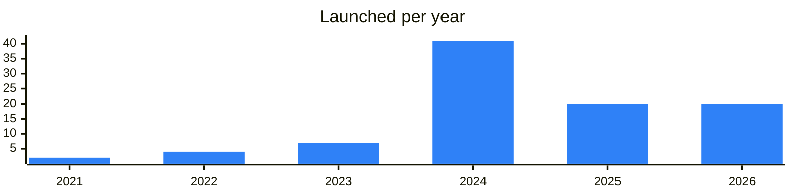

<!-- Generated by scripts/build_readme.py from data/. Do not edit by hand. -->

# Trading bots

**97 projects: 20 active, 75 quiet, 2 closed.** Back to [all categories](../README.md#categories); statuses are explained [here](../README.md#how-to-read-it). The same list as a [searchable table](../data/by-category/trading.csv).

## Active

| # | Project | What it is | Links | Launched | Peak MAU | Verified |
| ---: | --- | --- | --- | --- | ---: | --- |
| 1 | **@Trade** | Service for instant gift swaps between Telegram users with a relayer and support. | [Telegram](https://t.me/gifttradeservise) [Bot](https://t.me/trade) | 2022-03-09 | 344K |  |
| 2 | **PocketFi** | Telegram-native memecoin trading app | [Telegram](https://t.me/pocketfi) [Bot](https://t.me/pocketfi_bot) [X](https://x.com/pocket_fi) [Site](https://pocketfi.org/) [Gram News](https://gramnews.org/apps/pocketfi) | 2023-08-22 | 6.9M | since 2024-08 |
| 3 | **Maestro** | Telegram trading bot with update log, documentation and support. | [Telegram](https://t.me/maestrosniperupdates) [Bot](https://t.me/maestro) [Site](https://www.maestrobots.com) | 2022-09-05 |  |  |
| 4 | **Upscale** | Upscale – a prop‑trading service without KYC | [Telegram](https://t.me/upscale_news_en) [Bot](https://t.me/UpscaleTradeBot) [X](https://x.com/upscaletrade) [Site](https://app.upscale.trade) [Gram News](https://gramnews.org/apps/upscale) | 2022-10-25 | 109K |  |
| 5 | **@GroypFi_bot** | Chief Vibrations Officer A dose of this, a hit of that Twitter - Gbot | [Telegram](https://t.me/groyp) [Bot](https://t.me/groypfi_bot) [X](https://x.com/groyp_on_ton) [Site](https://groypfi.io/) [Gram News](https://gramnews.org/apps/groypfi) | 2025-11-11 |  |  |
| 6 | **@DTrade** | News channel for the lightning fast trading bot on TON | [Telegram](https://t.me/dtrade_news) [Bot](https://t.me/dtrade) [X](https://x.com/dtrade_tg) [Gram News](https://gramnews.org/apps/dtrade) | 2024-03-13 |  |  |
| 7 | **RedoTrade** | Trading bot on TON with a referral fee share and a website. | [Telegram](https://t.me/gramtrade) [X](https://x.com/redo_trade) [Site](https://redo.trade/) | 2025-08-04 |  |  |
| 8 | **@Swapi** | Fast trading bot built by the swap.coffee and Wen Lambo teams. | [Telegram](https://t.me/swapi_news) [Bot](https://t.me/swapi) | 2024-09-20 |  |  |
| 9 | **ATF** | AI trading project with an airdrop app, website and social accounts. | [Telegram](https://t.me/ai_trading_forex) [Bot](https://t.me/atf_airdrop_bot) [X](https://x.com/ai_trading_frx) [Site](https://www.atftoken.com) | 2026-02-20 |  |  |
| 10 | **Rebor** | Rebor is a bot for trading tokens on a decentralized exchange | [Telegram](https://t.me/ReborCoin) [Bot](https://t.me/ReborCoinBot) [X](https://x.com/Reborcoin) [Site](https://rebor.xyz) [Gram News](https://gramnews.org/apps/rebor) | 2025-01-31 | 373K |  |
| 11 | **Beta Arena** | AI-powered crypto trading platform | [Telegram](https://t.me/betaarenachannel) [Bot](https://t.me/betaarenabot) [X](https://x.com/beta_arena_io) | 2026-05-04 |  |  |
| 12 | **BasedBot** |  | [Telegram](https://t.me/basedbotverify) [Bot](https://t.me/based_eth_bot) | 2022-09-20 |  |  |
| 13 | **onai_galaxy_blaster** | AI-powered trading app in Telegram | [Telegram](https://t.me/ONAI_OFFICIAL) [Bot](https://t.me/onai_galaxy_blaster_bot) [X](https://x.com/onai_official) [Site](https://on-ai.io/) [Gram News](https://gramnews.org/apps/onai_galaxy_blaster) | 2024-08-10 | 126K |  |
| 14 | **BeWhale** | Copy real whales, run strategy cards, build your own portfolio with Wavy, the AI analyst Stocks · tokenized stocks · crypto | [Telegram](https://t.me/bewhaleapp) [Bot](https://t.me/be_whale_bot) [X](https://x.com/BeWhaleApp) [Site](https://bewhale.app) [Gram News](https://gramnews.org/apps/bewhale) | 2024-08-29 | 59K |  |
| 15 | **Elementex AI** | Elementex AI Smart Crypto Investments & AI Trading Bots. Official Website: elementex.tech | [Bot](https://t.me/elementexbot) | 2026-05-08 |  |  |
| 16 | **Sigma Bot** | Telegram trading bot with documentation, support bot and portal. | [Telegram](https://t.me/sigmaconnect) [Bot](https://t.me/sigma_buybot) [X](https://x.com/sigmatonbot) [Site](https://sigma.no.pics) | 2024-01-12 |  |  |
| 17 | **TradeTON** | Your Telegram Wallet for Trading and Holding Cryptocurrencies Customers | [Bot](https://t.me/xcrusdbot) | 2023-01-20 | 699K |  |
| 18 | **Ave.ai** | Telegram trading bot for tokens | [Telegram](https://t.me/aveai_english) [Bot](https://t.me/AveSniperBot) [X](https://x.com/aveai_info) [Site](https://ave.ai/) [Gram News](https://gramnews.org/apps/ave-ai) | 2024-03-29 |  |  |
| 19 | **Algofin** | Algorithmic trading ecosystem on TON | [Telegram](https://t.me/algofinancex) [X](https://x.com/algofinx) | 2026-04-18 |  |  |
| 20 | **FolioTrade** | Automated crypto trading bot | [Telegram](https://t.me/foliostack) [Bot](https://t.me/FolioTradeBot) [Site](https://trade.foliostack.net) [Gram News](https://gramnews.org/apps/foliotrade) | 2025-11-17 |  |  |

<b>Quiet: 75</b>

| # | Project | What it is | Links | Launched | Peak MAU | Verified |
| ---: | --- | --- | --- | --- | ---: | --- |
| 21 | **KaBoom** | KaBoom is an app for discovering and trading cryptocurrencies | [Telegram](https://t.me/kaboom_meme) [Bot](https://t.me/kaboom_meme_bot) [X](https://x.com/kaboom_meme) [Gram News](https://gramnews.org/apps/kaboom) | 2024-06-18 | 68K |  |
| 22 | **Unibot V2** |  | [Bot](https://t.me/unibotsniper_bot) [Gram News](https://gramnews.org/apps/unibot-v2) | 2023-06-08 | 16K |  |
| 23 | **SnapX** | Filter the Noise. Print the Gains | [Telegram](https://t.me/SnapX_official) [Bot](https://t.me/snapx_prod_bot) [X](https://x.com/snapx_co) Site (down) [GitHub](https://github.com/snapx-co) [Gram News](https://gramnews.org/apps/snapx) | 2024-05-05 | 53K |  |
| 24 | **HunteX** | Support Officer / I NEVER DM 1ST! / Leverage the Power of 1000x / Visit for More Details | [Telegram](https://t.me/Rezzky_HunteX) [Bot](https://t.me/HuntexBot) [X](https://x.com/huntex_bot) [Site](https://huntex.io/) [Gram News](https://gramnews.org/apps/huntex) | 2024-03-11 | 67K |  |
| 25 | **XYRO PORTAL** | XYRO PORTAL — a gamified crypto trading platform with game mechanics | [Telegram](https://t.me/xyro_io) [Bot](https://t.me/xyroportalbot) [X](https://x.com/xyro_io) [Site](https://xyro.io) [Gram News](https://gramnews.org/apps/xyro-portal) | 2023-11-02 | 1M | yes |
| 26 | **Join Studihub** |  | [Telegram](https://t.me/PieTrade) [Bot](https://t.me/joinstudihub_bot) [Site](https://pie.trading) [Gram News](https://gramnews.org/apps/join-studihub) | 2024-07-16 | 12K |  |
| 27 | **Pumpkin Bot** | Pumpkin: The World's First Decentralized Live Streaming Trading Platform / Trade Like a Show, Earn Like a Pro! | [Telegram](https://t.me/pumpkin_global) [Bot](https://t.me/pumpkin_xyz_bot) [X](https://x.com/pumpkin_global) [Site](https://pumpkin.xyz) [Gram News](https://gramnews.org/apps/pumpkin-bot) | 2023-05-25 | 27K |  |
| 28 | **Graph** | Graph — a trading terminal for digital assets on Solana | [Bot](https://t.me/graph_dex_bot) [Site](https://terminal.graphdex.io/sol/pulse) [Gram News](https://gramnews.org/apps/graph) | 2024-05-01 | 2.2M |  |
| 29 | **TractionEye** | TractionEye — social trading on TON with trader pools | [Telegram](https://t.me/TractionEye) [Bot](https://t.me/TractionEyebot) [X](https://x.com/TractionEye) [Site](https://tractioneye.xyz) [GitHub](https://github.com/TractionEye) [Gram News](https://gramnews.org/apps/tractioneye) | 2024-01-08 | 18K |  |
| 30 | **Bitbot** | Secure, manage, and protect your wallets with ease | [Telegram](https://t.me/bitbotofficial) [Bot](https://t.me/hello_bitbot) [Gram News](https://gramnews.org/apps/bitbot) | 2024-08-30 | 87K |  |
| 31 | **Alpha Dex** | One terminal, limitless tools, infinite gains | [Bot](https://t.me/alpha_web3_bot) [X](https://x.com/hotdao_) [Gram News](https://gramnews.org/apps/alpha-dex) | 2024-01-29 | 79K |  |
| 32 | **Mizar Trading Bot** | Blazing-fast on-chain bot on Solana, Ethereum, Base & BSC. Free analytics. Powerful automation | [Bot](https://t.me/mizartradingbot) [X](https://x.com/Mizar_com) [Site](https://mizar.com) [Gram News](https://gramnews.org/apps/mizar-trading-bot) | 2021-03-19 | 2K |  |
| 33 | **AI Market** | AI-Market is a platform for automated cryptocurrency trading | [Telegram](https://t.me/aimarkettrade) [Bot](https://t.me/aimarkettradebot) | 2026-07-08 |  |  |
| 34 | **ArbiTap** | Tap-to-Trade: arbitrage trading at your fingertips | [Bot](https://t.me/arbitap_bot) | 2024-11-21 | 399K |  |
| 35 | **Arbiva** | Crypto arbitrage bot that runs on autopilot. | [Bot](https://t.me/arbiva_bot) | 2026-04-16 |  |  |
| 36 | **Autobuy** | Bot that automatically buys Telegram gifts, with TON withdrawals. | [Bot](https://t.me/automirrorbot) | 2025-06-04 |  |  |
| 37 | **Autobuy** | Bot for automatic purchase of Telegram gifts | [Bot](https://t.me/autogiftrobot) | 2025-04-15 |  |  |
| 38 | **Autogifts** | Mini app that tracks and auto-buys new Telegram gifts | [Bot](https://t.me/autogifts_official_bot) | 2025-04-08 | 20K |  |
| 39 | **baZOOka** | Sniping and swapping bot for multichain trading | [Bot](https://t.me/bazookatradingbot) | 2025-05-02 | 16K |  |
| 40 | **Bobby** | We started as a buy bot, things changed. Bobby also owns the intelligence crypto runs on. Bobby. Since 2021 | [Bot](https://t.me/bobbybuybot) | 2021-11-28 |  |  |
| 41 | **BOO Snipe Bot** | Sniping bot for new TON listings | [Bot](https://t.me/snipeprobot) | 2024-03-17 |  |  |
| 42 | **BuyBag** | TON trading app and community bot | [Bot](https://t.me/buybagtrading_bot) | 2024-08-30 |  |  |
| 43 | **Crypton Buy Bot** | Crypton Buy Bot — tool for buying tokens on the TON blockchain | [Bot](https://t.me/CryptonBuyBot) [Site](https://crypton.tools) [Gram News](https://gramnews.org/apps/crypton-buy-bot) | 2024-03-24 |  |  |
| 44 | **Crypton Super Bot** | Crypton Super Bot — trading bot for the TON blockchain | [Telegram](https://t.me/cryptonitescanner) [Bot](https://t.me/CryptonSuperbot) [Site](https://crypton.tools) [Gram News](https://gramnews.org/apps/crypton-super-bot) | 2024-03-12 |  |  |
| 45 | **CV Trade** | Crypto trading bot on Telegram | [Bot](https://t.me/cvt_official_bot) |  |  |  |
| 46 | **DEX Diamonds** | Bot for trading jettons at low cost. | [Bot](https://t.me/dexdiamondsbot) | 2024-06-15 |  |  |
| 47 | **DTrade DC4 Backup** | Backup instance of the DTrade Telegram trading bot. | [Bot](https://t.me/dtrade_dc4_backup_bot) | 2026-01-30 |  |  |
| 48 | **Floki Trading Bot** | Telegram bot to trade tokens | [Bot](https://t.me/floki_trading_bot) | 2024-09-20 |  |  |
| 49 | **Forge** |  | [Telegram](https://t.me/jettrade_public) [Bot](https://t.me/forge_game_bot) [X](https://x.com/forge_game_bot) [Gram News](https://gramnews.org/apps/forge) | 2024-09-11 |  |  |
| 50 | **Gift Arbitrage Bot** | Bot for arbitrage trading of Telegram gifts. | [Bot](https://t.me/gift_arbitrage_bot) | 2025-07-25 |  |  |
| 51 | **GRIM** |  | [Bot](https://t.me/grimsniper_bot) | 2024-08-29 |  |  |
| 52 | **Hedger Bot** |  | [Bot](https://t.me/hedger_one_bot) | 2026-03-25 |  |  |
| 53 | **Jasper Vault Mini BTC** | Discover a New Era of Trading Join Jasper Vault News Join our Community | [Bot](https://t.me/jasper_vault_bot) |  |  |  |
| 54 | **Jetton Arbitrage** |  | [Gram News](https://gramnews.org/apps/jetton-arbitrage) | 2023-12-07 |  |  |
| 55 | **Kattana** | Trade crypto on multiple DEX and CEX with a complete range of trading tools. Technical analysis, portfolio management, and even trading strategy automation — all available in one place | [Telegram](https://t.me/kattana_trade) [X](https://x.com/kattanatrade) [GitHub](https://github.com/kattana-io) | 2011-07-05 |  |  |
| 56 | **lockin app** | Social trading for TON, Solana, BNB and Robinhood chains — trade, post calls, follow winning traders | [Bot](https://t.me/tradeonlockinbot) | 2026-08-20 |  |  |
| 57 | **Mite Market** | Trade Polymarket Natively on TON with Non-custodial Wallet | [Bot](https://t.me/mite_robot) | 2026-07-18 |  |  |
| 58 | **MixinBot** |  | [Telegram](https://t.me/gemztrade) [Bot](https://t.me/GemzTradeBot) [X](https://x.com/GemzTrade) [Gram News](https://gramnews.org/apps/mixinbot) | 2024-02-07 |  |  |
| 59 | **MultiTools** | Social trading for Gram, Solana, BNB & more - trade, post calls, follow winning traders. Social | [Telegram](https://t.me/multitoolssocial) [Bot](https://t.me/multitoools_bot) | 2026-08-28 |  |  |
| 60 | **OnlyOptions: Trading Platform** | Earn on changes in asset prices | [Telegram](https://t.me/only_options_tg) [Bot](https://t.me/only_options_bot) | 2025-09-06 |  |  |
| 61 | **OTC Auto Bot** | Automated OTC bot | [Bot](https://t.me/otc_auto_bot) | 2025-05-03 |  |  |
| 62 | **Rabica Finance** | Grid trading mini app on ETH price | [Bot](https://t.me/rabicabot) | 2026-04-21 |  |  |
| 63 | **SkyBot** | Telegram trading bot with an updates channel and community chat. | [Bot](https://t.me/tradewithskybot) | 2025-06-14 |  |  |
| 64 | **Snapster** | Token trading app in Telegram | [Bot](https://t.me/snapster_bot) | 2024-05-16 | 914K |  |
| 65 | **Snorter Bot** |  | [Site](https://bs_6847cd65.medexa.care) [Gram News](https://gramnews.org/apps/snorter-bot) | 2024-12 |  |  |
| 66 | **SpyTON BuyBot** | Buy-alert bot for tokens listed on TON trending. | [Bot](https://t.me/Tonspybuybot) [X](https://x.com/hubspyton) [Gram News](https://gramnews.org/apps/spyton-buybot) | 2026-03-30 |  |  |
| 67 | **StickerPad Sniper** | Sniper bot for StickerPad sticker marketplace | [Bot](https://t.me/stickerssniperbot) | 2026-04-27 |  |  |
| 68 | **sTONks** | sTONks / Buy Bot — multichain trading bot | [Telegram](https://t.me/sTONksTrendingBot) [Bot](https://t.me/stonks_sniper_bot) [X](https://x.com/tonstonks) [Site](https://stonksbots.com/) [Gram News](https://gramnews.org/apps/stonks-buy-bot) | 2024-01-10 |  |  |
| 69 | **sTONks (STONKS)** | The First Trading Bot on TON | [Telegram](https://t.me/stonksonton) [X](https://x.com/stonksbots) [Site](https://stonksbots.com) | 2024-01-06 |  |  |
| 70 | **Stun Trade** | Trading bot with news and support channels | [Bot](https://t.me/stuntrade_bot) | 2026-05-09 |  |  |
| 71 | **TerminalX** | DeFi trading tool for TON on top of DeDust | [Bot](https://t.me/terminalxtrade_bot) | 2024-12-20 |  |  |
| 72 | **TH钱包** | Chinese-language wallet bot for crypto trading, savings and asset management. | [Bot](https://t.me/thqbbot) | 2026-10 |  |  |
| 73 | **Tinu Sniper Bot** | TINU Trading Bot on TON is a powerful tool Part of | [Bot](https://t.me/tinusniperbot) | 2026-05-28 |  |  |
| 74 | **TokeHunt** |  | [Bot](https://t.me/tokehuntbot) | 2026-08-23 |  |  |
| 75 | **Ton Meme Bot** | A bot for trading memecoins on TON | [Bot](https://t.me/memefun_tradingbot) [X](https://x.com/ton_meme_trader) [Site](https://linktr.ee/ton_meme) [Gram News](https://gramnews.org/apps/ton-meme-bot) | 2024-03-09 |  |  |
| 76 | **Ton Tracker** | The fastest TON wallet sniper bot with smart filter | [Bot](https://t.me/tonscanerbot) [Gram News](https://gramnews.org/apps/ton-tracker-2) | 2024-08-27 |  |  |
| 77 | **TON Trading** | OTC and spot deals via smart contracts on TON | [Telegram](https://t.me/tontradingchannel) | 2024-07-19 |  |  |
| 78 | **Tonk** | $TONK An entire ecosystem for traders on $TON and the first multichain influencer marketplace based on onchain data in history | [Telegram](https://t.me/tonkinu_official) [X](https://x.com/tonkinubot) [Site](https://tonk.bot) | 2024-01-20 |  |  |
| 79 | **Tonly Trade** | A high-performance trading interface and routing terminal for perpetual contracts on TON | [Telegram](https://t.me/tonly_app) [Bot](https://t.me/Tonly_app_bot) [X](https://x.com/Tonly_app) [Site](https://tonly.app) | 2026-05 |  |  |
| 80 | **TONTRA** | Trading bot and sniper for TON tokens | [Bot](https://t.me/tontra_bot) | 2024-05-31 |  |  |
| 81 | **Trading Bot** | Telegram trading bot from the MyTonSwap decentralized exchange team. | [Bot](https://t.me/MyTonSwap_Trading_bot) Site (down) [Gram News](https://gramnews.org/apps/trading-bot) | 2024-03-15 |  |  |
| 82 | **Tradowix Rewards** | Official TradoWix rewards bot. Join , send your Trader ID, get your bonus. One reward per trader | [Telegram](https://t.me/tradowix_official) [Bot](https://t.me/tradowix_promo_bot) | 2026-08-15 |  |  |
| 83 | **TradyFi** | TradyFi is a Web3 SuperApp built on the TON blockchain, merging three powerful utilities — Prop Trading, Skill-based Gaming, and Tokenized Real Estate — inside | [Telegram](https://t.me/TradyFiCC) [Bot](https://t.me/tradyfi_token_bot) [X](https://x.com/tradyfi_TDF) [Site](https://www.tradyfi.io) [GitHub](https://github.com/tradyfiTDF) | 2025-09 | 93K |  |
| 84 | **UpFin Trading Bot** |  | [Telegram](https://t.me/upfin_bot) [X](https://x.com/UpFinTrade) [Site](https://bit.ly/4lKLauS) [Gram News](https://gramnews.org/apps/upfin-trading-bot) | 2025-09-01 |  |  |
| 85 | **Venkate OptionX** | Crypto trading bot on Telegram | [Bot](https://t.me/venkateoptionxbot) | 2025-05-21 | 355K |  |
| 86 | **VodkaTrade** | Telegram trading bot with its own news channel and community chat. | [Bot](https://t.me/vodkatradebot) | 2025-08-27 |  |  |
| 87 | **Wisdomise AI Trader** | Telegram bot that uses AI to find and trade memecoins with risk controls. | [Bot](https://t.me/wisdomiseton_bot) | 2024-08-06 |  |  |
| 88 | **x1000** | Telegram trading terminal bot that also publishes up-to-date information about tokens on TON. | [Telegram](https://t.me/x1000) [Bot](https://t.me/x1000_en) [X](https://x.com/x1000_finance) [Site](https://x1000.finance) [Gram News](https://gramnews.org/apps/x1000) | 2025-08-08 |  |  |
| 89 | **ZShot** | Trade-to-Mine: Earn as you trade | [Bot](https://t.me/thezshot_bot) | 2024-11-15 | 954K |  |
| 90 | **Wisdomise** | AI-automated index funds for digital assets | [Telegram](https://t.me/wisdomise_announcement) [X](https://x.com/wisdomise) [Site](https://wisdomise.com) | 2024-05-09 |  | since 2024-05 |
| 91 | **DXS: Trade The World** | Crypto trading app with a Telegram bot, plus a channel with project news and trading information. | [Telegram](https://t.me/dxsapp) [X](https://x.com/DXSapp) [Site](https://dxs.app) [Gram News](https://gramnews.org/apps/dxs-trade-the-world) | 2025-07-24 |  |  |
| 92 | **Agent X** | Mini app offering a smart trading agent, with a news channel, group and support contact. | [Telegram](https://t.me/agentxnews) | 2025-04-07 |  |  |
| 93 | **TOX** | Crypto trading hub and bot on TON | [Telegram](https://t.me/toxonton) | 2024-06-17 |  |  |
| 94 | **Optsnap Trading** | Binary options trading platform running on the TON blockchain. | [Telegram](https://t.me/opt_snap) [Site](https://optsnap.com/) [Gram News](https://gramnews.org/apps/optsnap-trading) | 2024-09-05 |  |  |
| 95 | **TG20** | Multi-chain asset management and social trading in Telegram | [Telegram](https://t.me/tg20_official) | 2023-12-22 |  |  |

<b>Closed: 2</b>

| # | Project | What it is | Links | Launched | Peak MAU | Verified |
| ---: | --- | --- | --- | --- | ---: | --- |
| 96 | **TOB Bot** | TOB - The Fastest Trading Bot on TON | [Bot](https://t.me/tob_ton_trading_bot) [X](https://x.com/TobbotTon) [Site](https://tobbot.io/) | 2024-05-21 |  |  |
| 97 | **TonTradingBot** | Trading bot on TON, run through the DinoTon bot with its own channel and group. | [Bot](https://t.me/tontrade) [X](https://x.com/TonTradingBot) [Site](https://tontradingbot.com/) | 2025-08-08 | 107K |  |

