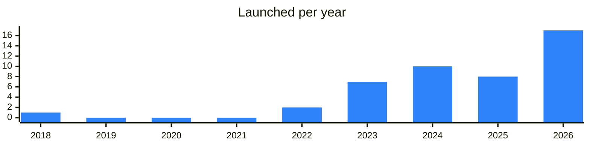

<!-- Generated by scripts/build_readme.py from data/. Do not edit by hand. -->

# Privacy

**45 projects: 13 active, 31 quiet, 1 closed.** Back to [all categories](../README.md#categories); statuses are explained [here](../README.md#how-to-read-it). The same list as a [searchable table](../data/by-category/vpn.csv).

## Active

| # | Project | What it is | Links | Launched | Peak MAU | Verified |
| ---: | --- | --- | --- | --- | ---: | --- |
| 1 |  **TonMobile eSIM** | Telegram bot for buying and managing travel eSIMs, with support for related issues. | [Telegram](https://t.me/tonmobile_en) [Bot](https://t.me/MobileSuppBot) [X](https://x.com/tonmobile_esim) [Site](https://tonmobile.com) [Gram News](https://gramnews.org/apps/mobile) | 2022-07-05 |  | since 2026-06 |
| 2 |  **SnapSIM** | Access numbers from anywhere in the world | [Bot](https://t.me/snapsimbot) [Site](https://snapsim.online) [Gram News](https://gramnews.org/apps/snapsim) | 2025-09-23 |  |  |
| 3 |  **Durev VPN** | Durev VPN is a VPN service for fast and reliable internet access | [Telegram](https://t.me/durevvpn) [Bot](https://t.me/DureVpnBot) [Site](https://durevpn.com/) [Gram News](https://gramnews.org/apps/durev-vpn) | 2024-10-05 |  |  |
| 4 |  **Resistance Tools** | An open-source privacy toolkit for TON, run through the bot | [Telegram](https://t.me/resistancetools) [Bot](https://t.me/ResistanceToolsBot) [Site](https://resistance.dog) [Gram News](https://gramnews.org/apps/resistance-tools) | 2025-10-30 |  |  |
| 5 |  **1323vpn** | VPN service managed through a Telegram bot, with a news channel for updates. | [Telegram](https://t.me/vpn1323) [Bot](https://t.me/vpn1323bot) [Gram News](https://gramnews.org/apps/1323vpn) | 2023-05-20 |  |  |
| 6 | **Connecton VPN** |  | [Telegram](https://t.me/connectonbot) [GitHub](https://github.com/Connecton) | 2026-09-15 |  |  |
| 7 |  **Need VPN & eSIM** | Telegram app selling VPN and eSIM plans, Steam top-ups and AI services. | [Telegram](https://t.me/needapp) [Bot](https://t.me/need) | 2024-10-25 |  | yes |
| 8 |  **TONNEL Network (TONNEL)** | TONNEL Network is a zero-knowledge privacy protocol on the TON blockchain | [Telegram](https://t.me/tonnel_en) [X](https://x.com/tonnel_network) [Site](https://Tonnel.network) | 2023-09-21 |  | since 2025-03 |
| 9 |  **Лови Подарок** | Russian-language gift giveaway channel with its own VPN bot. | [Telegram](https://t.me/lovi_podarok) [Bot](https://t.me/lovi_vpn_bot) | 2025-07-20 |  |  |
| 10 |  **Mr. Freeman** | VPN, proxy, eSIM and crypto cards service via Telegram bot | [Telegram](https://t.me/nosignalgohome) [X](https://x.com/MrFreeman0) | 2025-09-04 |  | since 2026-06 |
| 11 |  **VPN Скруджа** | VPN service for Telegram users connected through a bot, with a help channel. | [Telegram](https://t.me/scroogevpn) [Bot](https://t.me/scroogevpnrobot) | 2023-01-12 |  |  |
| 12 |  **Связь VPN** | VPN service sold through a Telegram bot and shop, with a news channel. | [Telegram](https://t.me/svyaznews) [Bot](https://t.me/svyazvpnrobot) | 2026-04-24 |  |  |
| 13 |  **WayLuckyVPN** | WayLuckyVPN bot - WayLuckyVPN Support account | [Telegram](https://t.me/wayluckyvpnchannel) [Bot](https://t.me/wayluckyvpn_bot) | 2024-11-28 |  |  |

<b>Quiet: 31</b>

| # | Project | What it is | Links | Launched | Peak MAU | Verified |
| ---: | --- | --- | --- | --- | ---: | --- |
| 14 |  **Depinsim** | World’s first decentralized connectivity infrastructure network | [Telegram](https://t.me/depinsim) [Bot](https://t.me/DepinSimBot) [X](https://x.com/depinsim) [Site](https://www.depinsim.com/) [Gram News](https://gramnews.org/apps/depinsim) | 2024-06-20 | 1.2M |  |
| 15 |  **Acton VPN** | Fast VPN service delivered through a Telegram bot. | [Bot](https://t.me/actonvpn_bot) | 2026-09-16 |  |  |
| 16 |  **BerkutTeam VPN** | VPN service run as a Telegram bot | [Bot](https://t.me/berkutteamvpn_bot) | 2026-07-02 |  |  |
| 17 |  **ConnectMeGuru eSIM** | Instant travel eSIMs for 190+ countries. Buy, install & manage data plans directly in Telegram | [Bot](https://t.me/esim_connectmeguru_bot) [X](https://x.com/connectmeguru) [Site](https://www.connectmeguru.com) [Gram News](https://gramnews.org/apps/connectmeguru-esim) | 2026-02-21 |  |  |
| 18 |  **DARK VPN** | VPN service with a Telegram bot, web account cabinet and support contacts. | [Telegram](https://t.me/d_k_vpn) [Bot](https://t.me/darklightvpn_bot) | 2025-07-15 |  |  |
| 19 |  **DeVPN** | VPN service run as a Telegram bot | [Bot](https://t.me/delabvpnbot) | 2024-09-12 |  |  |
| 20 |  **EJX VPNAI** | VPN service delivered through a Telegram bot | [Bot](https://t.me/vpnai) | 2026-03-26 |  |  |
| 21 |  **EJX VPNAI** | VPN service in a Telegram bot | [Bot](https://t.me/ejxbot) | 2026-03-30 |  |  |
| 22 |  **GCvpn** |  | [Bot](https://t.me/giftchangesvpnbot) | 2026-03-24 |  |  |
| 23 |  **GercVPN** | VPN service in a Telegram bot | [Bot](https://t.me/gercvpn_bot) | 2026-04-24 |  |  |
| 24 |  **Gimme VPN** |  | [Bot](https://t.me/gimmelifevpn_bot) | 2026-07-10 |  |  |
| 25 |  **Hermit VPN** | VPN service in a Telegram bot | [Bot](https://t.me/hermitvpnbot) | 2026-03-26 |  |  |
| 26 |  **hitvpnbot** | Telegram bot selling a fast and secure VPN service. | [Bot](https://t.me/hitvpnbot) | 2023-10-03 |  |  |
| 27 |  **HysteriaVPN** | VPN service as a Telegram bot | [Bot](https://t.me/hysteria2vpn_bot) | 2026-05-18 |  |  |
| 28 |  **INCY VPN** | VPN service as a Telegram bot | [Bot](https://t.me/incy) | 2026-06-08 |  |  |
| 29 |  **Kent VPN** | VPN with traffic encryption, anonymous search and bypass of whitelist-based blocking. | [Bot](https://t.me/vpn_kentbot) | 2024-07-23 |  |  |
| 30 |  **Makaka VPN** | Telegram bot selling VPN access | [Bot](https://t.me/makakavpnbot) | 2026-04-18 |  |  |
| 31 |  **Molly VPN** | Anonymous high-speed VPN service managed through a Telegram bot. | [Telegram](https://t.me/mollyvpn_community) [Bot](https://t.me/mollyvpnbot_bot) | 2026-05-05 |  |  |
| 32 |  **Mr. Freeman** | VPN, proxy, eSIM and crypto cards service via Telegram bot | [Bot](https://t.me/dmf0_bot) | 2025-10-15 | 537K |  |
| 33 |  **NETZ.RUN VPN** | Fast and reliable VPN service in Telegram | [Bot](https://t.me/netzrun_bot) | 2023-10-03 |  |  |
| 34 |  **Netzprints** | Get lifetime discount on NETZ.RUN VPN services while holding NFT | [Telegram](https://t.me/netzrun) [Site](https://getgems.io/netzprints) | 2024-02 |  |  |
| 35 |  **Outline VPN** | Outline is resistant to the most sophisticated forms of blocking including DNS, content, and IP blocking | [Bot](https://t.me/getoutlinevpn_bot) | 2025-11-08 |  |  |
| 36 |  **Plume Proxy** | Fast & Affordable Rotating Proxy Servers | [Bot](https://t.me/plumeproxy_bot) | 2023-10-03 |  |  |
| 37 |  **PlusOne VPN** |  | [Bot](https://t.me/plusonevpn_bot) | 2026-04-27 |  |  |
| 38 |  **Telegram Info VPN** | VPN service in a Telegram bot | [Bot](https://t.me/tginfovpn_bot) | 2022-06-20 |  |  |
| 39 |  **Ton VPN** | VPN service operating as a Telegram bot | [Bot](https://t.me/tonvpn_bot) | 2024-11-30 |  |  |
| 40 | **Tony VPN** |  | [Bot](https://t.me/tony_vpn_bot) [Gram News](https://gramnews.org/apps/tony-vpn) | 2026-03-26 |  |  |
| 41 |  **VPN4TON** | Telegram VPN service with a focus on connection speed. | [Bot](https://t.me/vpn4ton_bot) | 2023-10-03 |  |  |
| 42 |  **zonerift VPN** | Buy Premium VPN with Telegram Stars and TON | [Telegram](https://t.me/TildaApp) [Bot](https://t.me/zoneriftvpn_bot) [X](https://x.com/zoneriftvpn) Site (down) [Gram News](https://gramnews.org/apps/zonerift-vpn) | 2024-05-13 |  |  |
| 43 |  **Gram VPN** | A VPN inside Telegram — the bot opens blocked websites through a blocking-bypass system and cuts ads | [Telegram](https://t.me/GramVPN) [Bot](https://t.me/GramVBot) [Gram News](https://gramnews.org/apps/gram-vpn) | 2018-04-16 |  |  |
| 44 |  **telegramconnect** | Earn crypto and get access to 15M WiFi passwords with ! | [Telegram](https://t.me/townwifi) [Bot](https://t.me/townwifibot) [Gram News](https://gramnews.org/apps/telegramconnect) | 2024-06-03 | 5K |  |

<b>Closed: 1</b>

| # | Project | What it is | Links | Launched | Peak MAU | Verified |
| ---: | --- | --- | --- | --- | ---: | --- |
| 45 | **fedafone** |  | [Gram News](https://gramnews.org/apps/fedafone) | 2025-04-09 |  |  |

