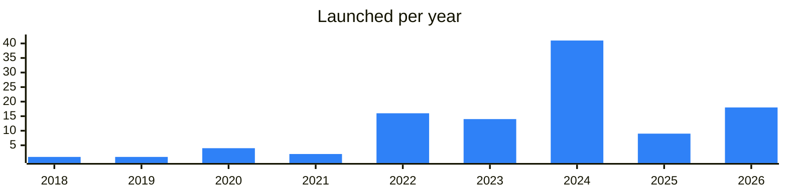

<!-- Generated by scripts/build_readme.py from data/. Do not edit by hand. -->

# Wallets

**111 projects: 30 active, 80 quiet, 1 closed.** Back to [all categories](../README.md#categories); statuses are explained [here](../README.md#how-to-read-it). The same list as a [searchable table](../data/by-category/wallets.csv).

## Active

| # | Project | What it is | Links | Launched | Peak MAU | Verified |
| ---: | --- | --- | --- | --- | ---: | --- |
| 1 | **Gram Wallet** | A non-custodial Gram wallet built into Telegram itself: the owner holds the keys, and transfers happen right in chats | [Site](https://gramwallet.io) [Gram News](https://gramnews.org/apps/gram-wallet) | 2026-08-31 |  |  |
| 2 | **Keeper** | Tonkeeper is a wallet. It allows managing TON and contacting support | [Telegram](https://t.me/keeper_en) [Bot](https://t.me/tonkeeper) [X](https://x.com/tonkeeper) [Site](https://tonkeeper.page.link/LFgS) [GitHub](https://github.com/tonkeeper/tonkeeper-web) [Gram News](https://gramnews.org/apps/tonkeeper) | 2021-11-22 | 279K | since 2024-08 |
| 3 | **My Wallet** | · All You Need to Enjoy Crypto | [Telegram](https://t.me/mywalleteng) [Bot](https://t.me/mytonwalletbot) [X](https://x.com/mywallet_io) [Site](https://mytonwallet.io) [GitHub](https://github.com/mytonwalletorg) [Gram News](https://gramnews.org/apps/mytonwallet) | 2022-09-05 |  | since 2024-05 |
| 4 | **Tonhub** |  | [Telegram](https://t.me/tonhub) [Bot](https://t.me/jettonvotebot) [Site](https://tonhub.com/dl) [Gram News](https://gramnews.org/apps/tonhub) | 2022-11-24 |  | since 2025-02 |
| 5 | **Trust Wallet** | The #1 crypto wallet, trusted by 220 million people | [Telegram](https://t.me/trust_announcements) [X](https://x.com/trustwallet) [Site](https://trustwallet.com) [GitHub](https://github.com/trustwallet) [Gram News](https://gramnews.org/apps/trust-wallet) | 2024-07-18 |  | since 2022-10 |
| 6 | **Bitget Wallet** | Bitget Wallet is a crypto wallet for everyday finance | [Telegram](https://t.me/bitget_wallet) [Bot](https://t.me/bitgetofficialbot) [X](https://x.com/BitgetWallet) [Site](https://web3.bitget.com/) [GitHub](https://github.com/bitgetwallet/download) [Gram News](https://gramnews.org/apps/bitget-wallet) | 2022-03-15 | 2.8M | since 2023-10 |
| 7 | **OKX Wallet** |  | [Site](https://web3.okx.com) | 2022-11-11 |  |  |
| 8 | **Binance Wallet** |  | [Site](https://www.binance.com/en/web3wallet) | 2017-04-01 |  |  |
| 9 | **Bybit Wallet** |  | [Site](https://www.bybit.com/en/web3) | 2022-11-16 |  |  |
| 10 | **SafePal** | Stay tuned for the latest progress of SafePal Wallet(www.safepal.com) | [Telegram](https://t.me/safepal_official) [X](https://x.com/SafePal) [Site](https://www.safepal.com) [GitHub](https://github.com/SafePalWallet) [Gram News](https://gramnews.org/apps/safepal) | 2020-11-05 |  | since 2023-06 |
| 11 | **Tangem** | Tap into crypto freedom. Security. Utility. Mobility. 6M+ wallets and counting | [Telegram](https://t.me/tangem) [X](https://x.com/Tangem) [Site](https://tangem.com) [GitHub](https://github.com/tangem) | 2023-04-13 |  | since 2023-07 |
| 12 | **Ledger** |  | [Site](https://www.ledger.com) | 2023-12-13 |  |  |
| 13 | **TokenPocket** |  | [Telegram](https://t.me/tokenpocket_channel) [X](https://x.com/TokenPocket_TP) [Site](https://www.tokenpocket.pro/) [GitHub](https://github.com/TP-Lab) [Gram News](https://gramnews.org/apps/tokenpocket) | 2024-06-03 |  |  |
| 14 | **Coin98** | DeFi & AI Wallet. Everyone's Gateway to The Open Internet | [Telegram](https://t.me/coin98wallet) [Bot](https://t.me/Coin98_bot) [X](https://x.com/coin98_wallet) [Site](https://coin98.com/) [GitHub](https://github.com/TP-Lab) [Gram News](https://gramnews.org/apps/coin98-super-wallet) | 2022-06-03 | 1.1M |  |
| 15 | **Wallet Agent** |  | [Telegram](https://t.me/wallet_agent) [Site](https://walletagent.dog) | 2026-05-29 |  |  |
| 16 | **TeQoin Wallet** | Welcome to TeQoin Blockchain! Telegram | [Telegram](https://t.me/teqoin) [Bot](https://t.me/teqoin_wallet_bot) [X](https://x.com/teqoin) [Site](https://teqoin.io) [GitHub](https://github.com/TeQoin-Blockchain) | 2026-03-29 |  | yes |
| 17 | **Architect.ton** | Architec.Ton — a wallet with an app catalog on the TON blockchain | [Telegram](https://t.me/architecton_tech) [Bot](https://t.me/architec_ton_bot) [X](https://x.com/architec_ton) [Site](https://architecton.tech) [Gram News](https://gramnews.org/apps/architect-ton) | 2024-04-24 | 53K |  |
| 18 | **Be Unstoppable** | Be Unstoppable — a cryptocurrency wallet supporting Bitcoin, Ethereum, and Zcash | [Telegram](https://t.me/unstoppable_announcements) [Bot](https://t.me/BeUnstoppable_bot) [X](https://x.com/unstoppablebyhs) [Site](https://unstoppable.money/) [GitHub](https://github.com/horizontalsystems) [Gram News](https://gramnews.org/apps/be-unstoppable) | 2020-11-13 | 82K |  |
| 19 | **GEME Wallet** | Cross-chain non-custodial wallet in Telegram | [Telegram](https://t.me/gemewallet) [Bot](https://t.me/gemewallet_bot) [X](https://x.com/GemeWallet) [Site](https://gemewallet.com) | 2026-03-10 |  |  |
| 20 | **лавэшка** | Крипто-фиатный кошелёк. Храни, отправляй, обменивай — быстро и удобно | [Telegram](https://t.me/laveshka_news) [Bot](https://t.me/laveshka) | 2026-08-18 |  |  |
| 21 | **Karta** | www.karta.io Top up with crypto, spend anywhere. Your gateway to digital finance | [Bot](https://t.me/kartawalletbot) | 2025-08-21 | 36K |  |
| 22 | **pgon** | Кошелек с возможностью оплаты в магазинах по qr сбп - канал - поддержка | [Telegram](https://t.me/pgon_wallet) [Bot](https://t.me/pgon) | 2026-01-02 |  |  |
| 23 | **UXUY Wallet** | UXUY Wallet is a multi-chain wallet with trading and earning features | [Bot](https://t.me/uxuybot) [X](https://x.com/uxuycom) [Site](https://uxuy.com/join/QvJWU08ydoo) [GitHub](https://github.com/uxuycom) [Gram News](https://gramnews.org/apps/uxuy-wallet) | 2023-08-17 |  |  |
| 24 | **KuCoin Web3 Wallet** | Decentralized non-custodial wallet announcements | [Telegram](https://t.me/kucoin_web3wallet) [X](https://x.com/KuCoin_Web3) | 2025-11-03 |  |  |
| 25 | **Gem Wallet** | Building an open source crypto wallet | [Telegram](https://t.me/gemwallet) [X](https://x.com/GemWalletApp) [Site](https://gemwallet.com) [GitHub](https://github.com/gemwalletcom) [Gram News](https://gramnews.org/apps/gem-wallet) | 2022-07-28 |  |  |
| 26 | **SociaWallet** | SociaWallet - This is the wallet you want to use. Made by made in TON. Open Wallet | [Telegram](https://t.me/sociawallet) [Bot](https://t.me/sociawalletbot) | 2026-06-01 |  |  |
| 27 | **PAY.SPACE** | Виртуальные карты для зарубежных оплат QR-платежи в РФ из USDT Сайт | [Telegram](https://t.me/pay_space_channel) [Bot](https://t.me/pay_space_wallet_bot) [Site](https://pay.space) | 2025-09-26 |  |  |
| 28 | **Walletium** | A crypto and stablecoin wallet in Telegram | [Telegram](https://t.me/walletium) [Bot](https://t.me/walletiumbot) [X](https://x.com/walletium_web3) [Site](https://walletium.net) [Gram News](https://gramnews.org/apps/walletium) | 2024-12-18 |  |  |
| 29 | **Orniton** | Orniton — TON wallet with NFT auto-buy and sell features | [Telegram](https://t.me/ornitonwallet) [Bot](https://t.me/Ornitonbot) [X](https://x.com/ornitonwallet) [Site](https://orniton.org) [GitHub](https://github.com/unlimadev/Orniton) [Gram News](https://gramnews.org/apps/orniton) | 2024-05-26 |  |  |
| 30 | **Crypto Wallet** | Храни, меняй и выводи крипту. Стейкинг USDT. 300+ монет. 30+ валют. Карты для Apple Pay. Делай чеки, следи за потоками. Плати подписки | [Telegram](https://t.me/wallet_crypto_io) [Bot](https://t.me/cryptouser_bot) [Site](https://w-crypto.io) [Gram News](https://gramnews.org/apps/crypto-wallet) | 2022-04-25 |  |  |

<b>Quiet: 80</b>

| # | Project | What it is | Links | Launched | Peak MAU | Verified |
| ---: | --- | --- | --- | --- | ---: | --- |
| 31 | **Tomo Wallet** | Tomo Wallet — a wallet for TON tokens | [Bot](https://t.me/tomowalletbot) [X](https://x.com/tomo_wallet) [Gram News](https://gramnews.org/apps/tomo-wallet) | 2023-07-25 | 1.6M |  |
| 32 | **Spintria Wallet** | Spintria Wallet is a wallet for managing your assets | [Bot](https://t.me/spintria_wallet_bot) [Gram News](https://gramnews.org/apps/spintria-wallet) | 2024-03-05 | 69K |  |
| 33 | **Tonflix Wallet** |  | [Bot](https://t.me/tonflixwallet_bot) [Gram News](https://gramnews.org/apps/tonflix-wallet) | 2024-09-03 | 160K |  |
| 34 | **water bot** |  | [Telegram](https://t.me/water_ton) [Bot](https://t.me/water_ton_bot) [Gram News](https://gramnews.org/apps/water-bot) | 2024-04-04 | 15K |  |
| 35 | **TryTON Wallet** |  | [Bot](https://t.me/trytonwalletbot) [X](https://x.com/tryton_on_ton) [Site](https://tryton-on-ton.com) [Gram News](https://gramnews.org/apps/tryton-wallet) | 2024-03-24 | 449K |  |
| 36 | **BOOL BOT** |  | [Bot](https://t.me/boolfamily_bot) [Gram News](https://gramnews.org/apps/bool-bot) | 2024-06-12 | 3.4M | since 2025-02 |
| 37 | **Pixel Wallet** | Hello Pixel is a fully on-chain gamified hub in TG mini-app for retail integration into traditional Crypto | [Telegram](https://t.me/hellopixelapp) [Bot](https://t.me/pixel_wallet_bot) [X](https://x.com/hellopixelverse) [Gram News](https://gramnews.org/apps/pixel-wallet) | 2023-11-11 | 695K |  |
| 38 | **Pluto Top** | Welcome to the Pluto Top-up Center！ | [Bot](https://t.me/plutotopupbot) [Gram News](https://gramnews.org/apps/pluto-top) | 2024-06-28 | 170K |  |
| 39 | **Wave Wallet** | Access AI Agents, DeFAI, GameFAI and more through Telegram | [Telegram](https://t.me/wave_announcements) [Bot](https://t.me/waveonsuibot) [X](https://x.com/WaveOnSui) [Gram News](https://gramnews.org/apps/wave-wallet) | 2022-04-03 | 1.2M |  |
| 40 | **Sky Rocket** |  | [Telegram](https://t.me/skyrocket2024) [Bot](https://t.me/skyrockettopbot) [Site](https://kriptomir.io/) [Gram News](https://gramnews.org/apps/sky-rocket) | 2024-07-10 | 94K |  |
| 41 | **CodexField Wallet** |  | [Bot](https://t.me/codexfieldbot) [Gram News](https://gramnews.org/apps/codexfield-wallet) | 2024-07-19 | 1.4M |  |
| 42 | **xJetSwap** | Best telegram wallet for your money! | [Telegram](https://t.me/xjetnews) [Bot](https://t.me/xjetswapbot) [Gram News](https://gramnews.org/apps/xjetswap) | 2022-08-11 | 7K |  |
| 43 | **Telenova** |  | [Bot](https://t.me/telenova_app_bot) [Gram News](https://gramnews.org/apps/telenova) | 2024-03-24 | 3K |  |
| 44 | **Ammer Wallet** |  | [Bot](https://t.me/ammer_wallet_bot) [Gram News](https://gramnews.org/apps/ammer-wallet-2) | 2024-05 | 702 |  |
| 45 | **Bpay** |  | [Telegram](https://t.me/bpay_official_channel) [Bot](https://t.me/bpay_coin_bot) [Gram News](https://gramnews.org/apps/bpay) | 2024-07-07 |  |  |
| 46 | **DPXWallet** | Feature-Rich demonstration of a dummy Wallet app / Dev | [Bot](https://t.me/dpxwalletbot) [Gram News](https://gramnews.org/apps/dpxwallet) | 2023-10-31 | 142 |  |
| 47 | **Ammer Wallet** |  | [Telegram](https://t.me/ammerwallet) [Site](https://ammer.app) [Gram News](https://gramnews.org/apps/ammer-wallet) | 2022-05-01 |  |  |
| 48 | **Axai on Waves** |  | [Bot](https://t.me/wavesaxaibot) [X](https://x.com/wxnetwork) [Gram News](https://gramnews.org/apps/axai-on-waves) | 2020-01-29 |  |  |
| 49 | **Bivreost Wallet** | Telegram crypto wallet for active social interaction | [Telegram](https://t.me/bivreost) [Bot](https://t.me/bivreost_bot) [Gram News](https://gramnews.org/apps/bivreost-wallet) | 2024-05 |  |  |
| 50 | **Coin Wallet** |  | [Telegram](https://t.me/coinwalletapp) [Bot](https://t.me/attackdetectorbot) [X](https://x.com/CoinAppWallet) [Site](https://coin.space/) [GitHub](https://github.com/CoinSpace/CoinSpace) [Gram News](https://gramnews.org/apps/coin-wallet) | 2015-03-30 | 66 |  |
| 51 | **CoLabs** | EVM is a future app with EVM-TG wallet & TON<>EVM Bridge Play BD X.com/conftapp Built by coNFT.app | [Telegram](https://t.me/co_nft) | 2024-06-27 |  |  |
| 52 | **Crypto Wallet** | Multicurrency Crypto Wallet by . Pay with cryptocurrency, view transactions, checks, payments | [Telegram](https://t.me/tegromoney) [Bot](https://t.me/tegrowalletbot) | 2023-04-05 |  |  |
| 53 | **Crypto Wallet Libermall Card** | Крипто-карты Visa/MC · Apple & Google Pay · выпуск за минуты · кешбэк до 5% · пополнение USDT-TRC20 без комиссии | [Bot](https://t.me/libermallcardbot) | 2026-04-09 |  |  |
| 54 | **Daily AI** | An encrypted smart wallet with cutting-edge AI functions running on Telegram | [Bot](https://t.me/dailywalletbot) | 2023-11-07 |  |  |
| 55 | **DeWallet** | DeWallet — a wallet for managing cryptocurrencies and NFTs | [Bot](https://t.me/delabtonbot) [Site](https://chrome.google.com/webstore/detail/dewallet/pnccjgokhbnggghddhahcnaopgeipafg) [Gram News](https://gramnews.org/apps/dewallet) | 2022-10-27 | 2.2M |  |
| 56 | **DOGENANCE** |  | [Gram News](https://gramnews.org/apps/dogenance) | 2022-09-13 |  |  |
| 57 | **EMCD Wallet** | Multi-crypto wallet bot | [Bot](https://t.me/emcdwalletbot) | 2025-08-04 | 54K |  |
| 58 | **FadeWallet** | FadeWallet — Обмен, управление и хранение в одном месте | [Bot](https://t.me/fadewalletbot) | 2024-10-09 | 5.2M |  |
| 59 | **FASQON** | Web3 bank, messenger and wallet in Telegram | [Bot](https://t.me/fasqonbot) | 2025-05-30 | 61K |  |
| 60 | **Gate Wallet** | Gate crypto wallet bot in Telegram | [Bot](https://t.me/gateio_wallet_bot) | 2024-11-04 | 1.6M |  |
| 61 | **HERE Wallet** | Mobile, web and Telegram wallet | [Telegram](https://t.me/herewallet) | 2024-02-14 |  |  |
| 62 | **HN wallet** |  | [Bot](https://t.me/HN_Wallet_bot) [Gram News](https://gramnews.org/apps/hn-wallet) | 2026-01 |  |  |
| 63 | **Holdzilla** | Multifunctional crypto wallet bot of FollowDragons | [Bot](https://t.me/holdzillabot) | 2024-04-15 | 2K |  |
| 64 | **HOT Protocol** | HERE wallet and HOT protocol support bot | [Bot](https://t.me/hotprotocol_bot) | 2025-02-02 |  |  |
| 65 | **Infinito** | Multi-chain crypto wallet | [Telegram](https://t.me/infinitowallet) | 2019-04-19 |  |  |
| 66 | **Matrix Wallet** | Self-custodial, multi-chain wallet on Telegram | [Bot](https://t.me/MatrixWalletBot) [Site](https://) [GitHub](https://github.com/rangersprotocolcode) [Gram News](https://gramnews.org/apps/matrix-wallet) | 2024-03 |  |  |
| 67 | **Mixin** | Bot to store and transfer TON, BTC and other cryptocurrencies | [Bot](https://t.me/mixinbot) | 2023-01-04 |  |  |
| 68 | **Mixin Messenger** |  | [Site](https://mixin.one/messenger) [Gram News](https://gramnews.org/apps/mixin-messenger) | 2020-02-29 |  |  |
| 69 | **MixinBot** |  | [Telegram](https://t.me/gemztrade) [Bot](https://t.me/GemzTradeBot) [X](https://x.com/GemzTrade) [Gram News](https://gramnews.org/apps/mixinbot) | 2024-02-07 |  |  |
| 70 | **notonbot** |  | [Bot](https://t.me/notonoffice_bot) [Gram News](https://gramnews.org/apps/notonbot) | 2024-07-22 | 261K |  |
| 71 | **ONTO Wallet** | Manage your own digital identities, data and assets | [Telegram](https://t.me/ONTOWallet) [X](https://x.com/ONTOWallet) [Site](https://onto.app/) [GitHub](https://github.com/ontio/ontology) [Gram News](https://gramnews.org/apps/onto-wallet) | 2018-04-13 |  |  |
| 72 | **OpenMask** |  | [Site](https://chrome.google.com/webstore/detail/openmask/penjlddjkjgpnkllboccdgccekpkcbin?utm_source=openmask) [Gram News](https://gramnews.org/apps/openmask) | 2024-01 |  |  |
| 73 | **OpenShield** | Conveniently interact with digital assets | [Bot](https://t.me/OpenShieldBot) [Gram News](https://gramnews.org/apps/openshield) | 2024-05-20 |  |  |
| 74 | **PAW Wallet** | Crypto wallet on Telegram | [Bot](https://t.me/pawwalletbot) | 2024-10-13 | 76K |  |
| 75 | **Payscrow Wallet** | Payscrow Wallet - криптокошелек с виртуальными картами Visa для ежедневных платежей | [Telegram](https://t.me/payscrowwallet) [Bot](https://t.me/payscrowwalletbot) | 2026-04-28 |  |  |
| 76 | **platho** | Encrypted messenger and TON wallet. No servers, only contracts | [Bot](https://t.me/plathobot) | 2026-08-19 |  |  |
| 77 | **PPay** | Play & Pay娱乐 • 支付 • 畅行无界 ONE WALLET A BIGGER WORLD 选必安 心必安｜使用PPay 更简单 | [Bot](https://t.me/publicpaybot) | 2026-10 |  |  |
| 78 | **PsWallet** | Store, exchange, send, and pay with cryptocurrency anytime, anywhere | [Bot](https://t.me/pswallet_bot) | 2025-11-18 | 264K |  |
| 79 | **Rustex** | Rustex Community - Rustex Technology | [Telegram](https://t.me/tondnsweb3) [Bot](https://t.me/rustexappbot) [Gram News](https://gramnews.org/apps/rustex) | 2023-06-10 |  |  |
| 80 | **Saiyan Wallet Beta** | Crypto wallet on Telegram | [Bot](https://t.me/saiyan_wallet_bot) |  |  |  |
| 81 | **Sender** |  | [Site](https://chrome.google.com/webstore/detail/sender-wallet/epapihdplajcdnnkdeiahlgigofloibg?utm_source=chrome-ntp-icon) [Gram News](https://gramnews.org/apps/sender) | 2024-03-06 |  |  |
| 82 | **Sonic Wallet** | Crypto wallet on Telegram | [Bot](https://t.me/sonic_wallet_bot) | 2025-03-15 | 16K |  |
| 83 | **SunSpace Wallet** | Wallet and swap bot of the $SPC ecosystem on TON | [Bot](https://t.me/sunspace_robot) | 2024-12-08 |  |  |
| 84 | **Talken Wallet** | Talken Wallet for Telegram is a secure Web3 wallet that uses MPC technology. Talken | [Telegram](https://t.me/talken_updates) [Bot](https://t.me/talkenwallet_bot) | 2026-10 | 15K |  |
| 85 | **TH钱包** | 频道: 欢迎体验我们的 Telegram 机器人，轻松进行加密货币交易、理财、资产安全存储、手机充值等功能。在这里，您将感受到便捷、安全与创新的一体化服务。立即加入我们，享受触手可及的智能数字交易体验 | [Bot](https://t.me/thqbbot) | 2026-10 |  |  |
| 86 | **TON Space** | Russian news channel of the TON Wallet | [Telegram](https://t.me/tonspace_news_cis) | 2024-12-03 |  |  |
| 87 | **TON Space** | News channel for the TON Wallet | [Telegram](https://t.me/tonspace_news_en) | 2024-12-03 |  |  |
| 88 | **TonDevWallet** |  | [Site](https://github.com/TonDevWallet/TonDevWallet) [GitHub](https://github.com/TonDevWallet/TonDevWallet) [Gram News](https://gramnews.org/apps/tondevwallet) | 2023-01-27 |  |  |
| 89 | **Tonkey** |  | [X](https://x.com/TonkeyApp) [GitHub](https://github.com/tonkey-app) | 2023-05-08 |  |  |
| 90 | **Tonspack** | The first telegram multi-chain MPC wallet | [Bot](https://t.me/tonspack_bot) [X](https://x.com/tonspack) Site (down) [GitHub](https://github.com/tonspay) [Gram News](https://gramnews.org/apps/tonspack) | 2024-02-29 |  |  |
| 91 | **TronKeeper** | TronKeeper is your secure Tron wallet on Telegram | [Bot](https://t.me/tronkeeperbot) | 2024-10-22 |  |  |
| 92 | **TronKeeper Claim** | TronKeeper is your secure Tron wallet on Telegram | [Bot](https://t.me/tronkeeperclaimbot) |  |  |  |
| 93 | **TWallet App** | Tokens, transactions, and digital collectibles in one clean interface that keeps the focus on what matters | [Bot](https://t.me/twalletappbot) | 2026-08-28 |  |  |
| 94 | **Units Wallet** | Foundational layer connecting all ecosystem chains in a fully interoperable and trustless manner | [Bot](https://t.me/unitswallet_bot) | 2024-10-24 | 2M |  |
| 95 | **vaniton** |  | [Telegram](https://t.me/beast_crypto_news) [Bot](https://t.me/BeastWalletBot) [Site](https://github.com/AntonMeep/vaniton) [GitHub](https://github.com/fluidicon.png) [Gram News](https://gramnews.org/apps/vaniton) | 2024-08-30 |  |  |
| 96 | **Wallet Explorer** |  | [Bot](https://t.me/toftechbot) [Gram News](https://gramnews.org/apps/wallet-explorer) | 2024-01 | 867K |  |
| 97 | **Wallet.Hub** |  | [Bot](https://t.me/walletdothub_bot) | 2026-08-01 |  |  |
| 98 | **Wind Wallet** | New Generation of Telegram Wallet on Vexanium Blockchain | [Bot](https://t.me/windwalletbot) | 2024-09-03 |  |  |
| 99 | **X Wallet** | Non-custodial TON wallet with staking | [Bot](https://t.me/xwalletbot) | 2025-04-06 | 236K |  |
| 100 | **xJetSwapBot** |  | [Gram News](https://gramnews.org/apps/xjetswapbot) | 2024-04-26 |  |  |
| 101 | **XTON crypto wallet** |  | [Telegram](https://t.me/tonoracle_app) [Bot](https://t.me/tonoracle_bot) [Site](https://xtonwallet.com/) [Gram News](https://gramnews.org/apps/xton-crypto-wallet) | 2024-04-24 |  |  |
| 102 | **XTON Wallet** |  | [Telegram](https://t.me/xtonwallet) [Bot](https://t.me/XTON_ROBOT) [X](https://x.com/XTON_ROBOT) [GitHub](https://github.com/xtonwallet/web-extension) | 2022-11-30 |  |  |
| 103 | **Zen Wallet** | A calm TON wallet for everyday crypto | [Bot](https://t.me/sendzenbot) | 2026-05-20 |  |  |
| 104 | **Кошелёк NiceWallet** |  | [Bot](https://t.me/nicewalletio_bot) | 2026-10 |  |  |
| 105 | **MathWallet** |  | [Telegram](https://t.me/mathwalletnews) [X](https://x.com/MathWallet) [Site](https://mathwallet.org/) [GitHub](https://github.com/mathwallet) [Gram News](https://gramnews.org/apps/mathwallet) | 2017-09-13 |  |  |
| 106 | **Cropty Wallet** | Cropty Wallet — multi-chain wallet with free transfers between users | [Telegram](https://t.me/croptywallet) [Bot](https://t.me/CroptyBot) [X](https://x.com/cropty_app) [Site](https://www.cropty.io) [Gram News](https://gramnews.org/apps/cropty-wallet) | 2023-07-18 |  |  |
| 107 | **Tonflow Wallet** | TONFLOW: A secure, self-custodial wallet for the TON blockchain | [Telegram](https://t.me/tonflow_community) [X](https://x.com/itonflow) Site (down) [GitHub](https://github.com/tonflow) [Gram News](https://gramnews.org/apps/tonflow-wallet) | 2024-10-22 |  |  |
| 108 | **Top Wallets** |  | [Telegram](https://t.me/top_wallets) [GitHub](https://github.com/AlexGor-dev/Top-Wallets) | 2023-05-20 |  |  |
| 109 | **Defexa** | World first memecoin bank | [Telegram](https://t.me/defexa) [X](https://x.com/DefexaCrypto) [Site](https://defexa.io) [Gram News](https://gramnews.org/apps/defexa) | 2022-11-04 |  |  |
| 110 | **OpenMask** |  | [Telegram](https://t.me/openproduct) [X](https://x.com/openmask_wallet) [Site](https://github.com/openproduct/openmask-extension) [GitHub](https://github.com/fluidicon.png) [Gram News](https://gramnews.org/apps/openmask-2) | 2022-09-06 |  |  |

<b>Closed: 1</b>

| # | Project | What it is | Links | Launched | Peak MAU | Verified |
| ---: | --- | --- | --- | --- | ---: | --- |
| 111 | **Fintopio** |  | [Telegram](https://t.me/fintopionews) [X](https://x.com/fintopio) [Site](https://fintopio.com/) | 2021-11-27 |  | since 2024-05 |

